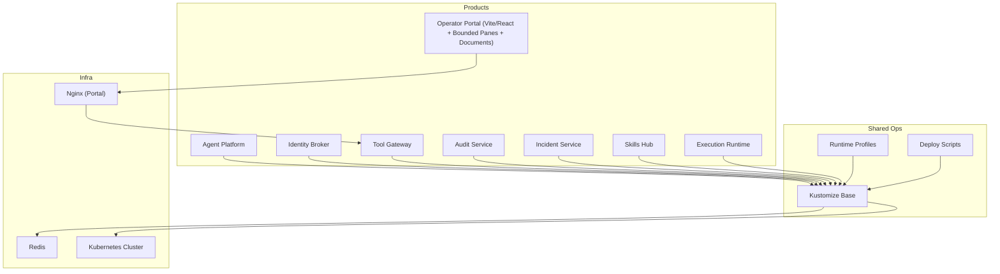
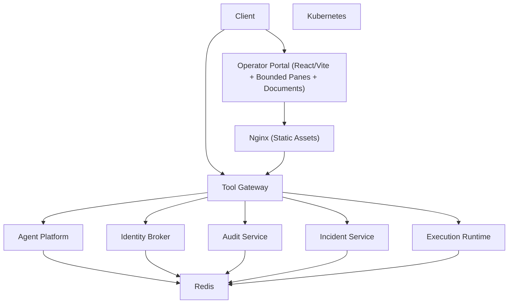

# Getting Started

<cite>
**Referenced Files in This Document**
- [README.md](file://README.md)
- [Makefile](file://Makefile)
- [VERSION](file://VERSION)
- [products/agent-platform/README.md](file://products/agent-platform/README.md)
- [products/identity-broker/README.md](file://products/identity-broker/README.md)
- [products/tool-gateway/README.md](file://products/tool-gateway/README.md)
- [products/operator-portal/Dockerfile](file://products/operator-portal/Dockerfile)
- [products/operator-portal/Makefile](file://products/operator-portal/Makefile)
- [products/operator-portal/nginx.conf](file://products/operator-portal/nginx.conf)
- [products/operator-portal/web-ui/app/package.json](file://products/operator-portal/web-ui/app/package.json)
- [products/operator-portal/web-ui/app/vite.config.ts](file://products/operator-portal/web-ui/app/vite.config.ts)
- [products/operator-portal/web-ui/app/tsconfig.json](file://products/operator-portal/web-ui/app/tsconfig.json)
- [products/operator-portal/web-ui/app/src/main.tsx](file://products/operator-portal/web-ui/app/src/main.tsx)
- [products/operator-portal/web-ui/app/src/App.tsx](file://products/operator-portal/web-ui/app/src/App.tsx)
- [products/operator-portal/web-ui/app/src/chat/usePendingDecisionPoll.ts](file://products/operator-portal/web-ui/app/src/chat/usePendingDecisionPoll.ts)
- [products/operator-portal/web-ui/app/src/chat/ChatView.tsx](file://products/operator-portal/web-ui/app/src/chat/ChatView.tsx)
- [shared/platform-ops/gitops/dev-k8s/README.md](file://shared/platform-ops/gitops/dev-k8s/README.md)
- [shared/platform-ops/gitops/deploy-overlay.sh](file://shared/platform-ops/gitops/deploy-overlay.sh)
- [shared/platform-ops/gitops/select-runtime-profile.sh](file://shared/platform-ops/gitops/select-runtime-profile.sh)
- [shared/platform-ops/gitops/sync-runtime-secret.sh](file://shared/platform-ops/gitops/sync-runtime-secret.sh)
- [shared/platform-ops/gitops/runtime-profiles/openai/configmap.yaml](file://shared/platform-ops/gitops/runtime-profiles/openai/configmap.yaml)
- [shared/platform-ops/gitops/runtime-profiles/openai/runtime-secrets.example.env](file://shared/platform-ops/gitops/runtime-profiles/openai/runtime-secrets.example.env)
- [shared/platform-ops/gitops/dev-k8s/base/kustomization.yaml](file://shared/platform-ops/gitops/dev-k8s/base/kustomization.yaml)
- [shared/platform-ops/gitops/dev-k8s/base/shared/observability.env](file://shared/platform-ops/gitops/dev-k8s/base/shared/observability.env)
- [shared/platform-ops/gitops/dev-k8s/base/tool-gateway/policy.yaml](file://shared/platform-ops/gitops/dev-k8s/base/tool-gateway/policy.yaml)
- [shared/platform-ops/gitops/dev-k8s/base/tool-gateway/rbac.yaml](file://shared/platform-ops/gitops/dev-k8s/base/tool-gateway/rbac.yaml)
- [shared/platform-ops/gitops/dev-k8s/base/infra/redis-deployment.yaml](file://shared/platform-ops/gitops/dev-k8s/base/infra/redis-deployment.yaml)
- [shared/platform-ops/gitops/dev-k8s/base/infra/redis-service.yaml](file://shared/platform-ops/gitops/dev-k8s/base/infra/redis-service.yaml)
- [shared/platform-ops/gitops/dev-k8s/base/agent-platform/agent-service-deployment.yaml](file://shared/platform-ops/gitops/dev-k8s/base/agent-platform/agent-service-deployment.yaml)
- [shared/platform-ops/gitops/dev-k8s/base/agent-platform/agent-service-service.yaml](file://shared/platform-ops/gitops/dev-k8s/base/agent-platform/agent-service-service.yaml)
- [shared/platform-ops/gitops/dev-k8s/base/identity-broker/identity-service-deployment.yaml](file://shared/platform-ops/gitops/dev-k8s/base/identity-broker/identity-service-deployment.yaml)
- [shared/platform-ops/gitops/dev-k8s/base/identity-broker/identity-service-service.yaml](file://shared/platform-ops/gitops/dev-k8s/base/identity-broker/identity-service-service.yaml)
- [shared/platform-ops/gitops/dev-k8s/base/operator-portal/web-ui-deployment.yaml](file://shared/platform-ops/gitops/dev-k8s/base/operator-portal/web-ui-deployment.yaml)
- [shared/platform-ops/gitops/dev-k8s/base/operator-portal/web-ui-service.yaml](file://shared/platform-ops/gitops/dev-k8s/base/operator-portal/web-ui-service.yaml)
- [shared/platform-ops/gitops/dev-k8s/base/tool-gateway/api-gateway-deployment.yaml](file://shared/platform-ops/gitops/dev-k8s/base/tool-gateway/api-gateway-deployment.yaml)
- [shared/platform-ops/gitops/dev-k8s/base/tool-gateway/api-gateway-service.yaml](file://shared/platform-ops/gitops/dev-k8s/base/tool-gateway/api-gateway-service.yaml)
- [shared/platform-ops/gitops/dev-k8s/deploy.sh](file://shared/platform-ops/gitops/dev-k8s/deploy.sh)
- [shared/platform-ops/gitops/reconcile-portal-oidc-client.sh](file://shared/platform-ops/gitops/reconcile-portal-oidC-client.sh)
- [shared/platform-ops/gitops/dev-k8s/base/identity-broker/runtime-config.env](file://shared/platform-ops/gitops/dev-k8s/base/identity-broker/runtime-config.env)
- [products/operator-portal/web-ui/app/src/auth/storage.ts](file://products/operator-portal/web-ui/app/src/auth/storage.ts)
- [products/operator-portal/web-ui/app/src/auth/oidc.ts](file://products/operator-portal/web-ui/app/src/auth/oidc.ts)
- [shared/shared-contracts/scripts/validate_version.py](file://shared/shared-contracts/scripts/validate_version.py)
- [products/audit-service/src/audit_service/metadata.py](file://products/audit-service/src/audit_service/metadata.py)
- [products/incident-service/src/incident_service/metadata.py](file://products/incident-service/src/incident_service/metadata.py)
- [products/agent-platform/src/agent_service/metadata.py](file://products/agent-platform/src/agent_service/metadata.py)
- [products/identity-broker/src/identity_service/metadata.py](file://products/identity-broker/src/identity_service/metadata.py)
- [products/platform-gateway/src/platform_gateway/metadata.py](file://products/platform-gateway/src/platform_gateway/metadata.py)
- [products/skills-hub/src/skills_hub/metadata.py](file://products/skills-hub/src/skills_hub/metadata.py)
- [products/tool-gateway/src/tool_gateway/metadata.py](file://products/tool-gateway/src/tool_gateway/metadata.py)
- [docs/guides/portal-user-guide.md](file://docs/guides/portal-user-guide.md)
- [docs/agentic-aiops-platform/release-notes/2026-08-29-bounded-pane-review-follow-ups.md](file://docs/agentic-aiops-platform/release-notes/2026-08-29-bounded-pane-review-follow-ups.md)
- [docs/agentic-aiops-platform/release-notes/2026-08-29-portal-live-check-polish.md](file://docs/agentic-aiops-platform/release-notes/2026-08-29-portal-live-check-polish.md)
- [docs/agentic-aiops-platform/release-notes/2026-08-29-incident-report-document-type.md](file://docs/agentic-aiops-platform/release-notes/2026-08-29-incident-report-document-type.md)
- [docs/agentic-aiops-platform/release-notes/README.md](file://docs/agentic-aiops-platform/release-notes/README.md)
</cite>

## Update Summary
**Changes Made**
- Updated version references from 0.14.0 to 0.25.2 across all sections to reflect the latest coordinated release
- Enhanced incident report document type documentation with SPEC-043 details and dual-action gate requirements
- Updated portal UI improvements including bounded pane enhancements and digest data tab renaming
- Added comprehensive coverage of v0.25.1/v0.25.2 patch releases focusing on operator portal polish
- Updated troubleshooting section with new incident report creation workflows and document type support
- Enhanced operations document repository section with incident report capabilities and dual-action gates

## Table of Contents
1. Introduction
2. Prerequisites
3. Project Structure Overview
4. Quick Start: Local Development
5. Quick Start: Production Deployment
6. Environment Configuration and Secrets
7. Coordinated Version Management
8. Initial Validation and First API Call
9. Operations Document Repository and Shift Summaries
10. Troubleshooting Guide
11. Next Steps by Persona
12. Architecture Overview
13. Conclusion

## Introduction
This guide helps you get up and running with the Luban AIOps Platform for local development and production deployment. It covers prerequisites, installation steps, environment configuration, secret management, initial validation, and common troubleshooting tips. You will also find links to additional resources and next steps tailored for developers, operators, and security teams.

**Updated** This document reflects the coordinated 0.25.2 release with synchronized versions across all platform components, plus enhanced incident report document type capabilities and operator portal polish. The platform now includes comprehensive operations document repository with shift summary and incident report types, featuring dual-action gates and role-based access controls.

## Prerequisites
Ensure your environment meets the following requirements before proceeding:
- Python 3.x (for local development and building services)
- **Node.js 22+** (required for Vite/React/TypeScript frontend development)
- Docker (container build and runtime)
- Kubernetes cluster (local or managed) with kubectl configured
- kustomize (used by GitOps overlays)
- curl or HTTP client for API testing
- Optional: Helm if you prefer Helm-based deployments later

Notes:
- The platform uses Kustomize overlays under shared/platform-ops/gitops for both development and production profiles.
- Runtime profiles are provided for OpenAI, DashScope, and DeepSeek; select one based on your needs.
- **Updated**: Version 0.25.2 introduces enhanced incident report document type capabilities requiring proper role assignments for document creation and access.
- **Updated**: The operator portal now includes bounded pane enhancements with pinned chrome and improved digest rendering.
- **New**: Incident report document type requires both `documents:create` and `incident:read` actions for creation.

**Section sources**
- [products/operator-portal/web-ui/app/package.json:6-8](file://products/operator-portal/web-ui/app/package.json#L6-L8)
- [shared/platform-ops/gitops/dev-k8s/README.md](file://shared/platform-ops/gitops/dev-k8s/README.md)
- [shared/platform-ops/gitops/runtime-profiles/README.md](file://shared/platform-ops/gitops/runtime-profiles/README.md)

## Project Structure Overview
The repository is organized into product services and shared operational assets:
- Products:
  - agent-platform: Agent runtime service and providers
  - identity-broker: Identity and token services
  - tool-gateway: API gateway, policy enforcement, and tool orchestration
  - **Updated**: operator-portal: Modern React/TypeScript web UI built with Vite and Ant Design, featuring bounded panes and enhanced document repository
  - **New**: audit-service: Durable audit trail service for authenticated event ingestion and retention
  - **New**: incident-service: Incident intake, triage, and collaboration dispatch
  - **Existing**: skills-hub: Skills and grounded guidance federation
  - **New**: execution-runtime: Isolated execution workers for bounded operational actions
- Shared:
  - platform-ops: GitOps overlays, scripts, runtime profiles, and base Kustomize manifests
  - shared-contracts: JSON schemas and observability conventions
  - shared-sdk: SDK documentation

[No sources needed since this diagram shows conceptual structure]

## Quick Start: Local Development
Follow these steps to run the platform locally using Kustomize overlays:

### Backend Services
1. Prepare your environment
   - Ensure Docker, kubectl, and kustomize are installed and working.
   - Create or switch to a local Kubernetes context (e.g., minikube, kind, docker-desktop).

2. Select a runtime profile
   - Choose a runtime profile (OpenAI, DashScope, DeepSeek) to configure provider credentials and settings.
   - Use the selection script to set the active profile.

3. Sync runtime secrets
   - Copy example secrets from the selected runtime profile into your environment or Kubernetes secrets as required by the overlay.
   - Use the sync script to apply secrets consistently across namespaces.

4. Deploy base resources
   - Apply the Kustomize base to create namespaces, Redis, and core services.
   - Verify that Redis and core services are healthy.

5. Deploy overlays
   - Apply the dev overlay to deploy all platform components (agent-platform, identity-broker, tool-gateway, operator-portal, audit-service, incident-service, skills-hub, execution-runtime).
   - Confirm pods are running and services are exposed.

### Frontend Development (Vite/React)
6. Set up frontend development environment
   - Navigate to `products/operator-portal/web-ui/app` directory
   - Install dependencies: `npm ci`
   - Start development server: `npm run dev`
   - The Vite dev server runs on port 5173 and proxies API calls to localhost:8080

7. Configure API proxy
   - Port-forward the platform-gateway service to localhost:8080
   - The Vite development server automatically proxies `/api` requests to the backend

### Access and Testing
8. Access the Operator Portal
   - Open http://localhost:5173 in your browser for the React-based UI
   - For production builds, access via the deployed service after port-forwarding

9. Make your first API call
   - Use the tool-gateway endpoints to send a chat request and receive a response.
   - Validate health endpoints to ensure services are ready.

Key scripts and overlays:
- Select runtime profile: shared/platform-ops/gitops/select-runtime-profile.sh
- Sync runtime secrets: shared/platform-ops/gitops/sync-runtime-secret.sh
- Deploy overlay: shared/platform-ops/gitops/deploy-overlay.sh
- Base Kustomization: shared/platform-ops/gitops/dev-k8s/base/kustomization.yaml
- Frontend dev server: `npm run dev` in products/operator-portal/web-ui/app

**Section sources**
- [products/operator-portal/web-ui/app/package.json:9-13](file://products/operator-portal/web-ui/app/package.json#L9-L13)
- [products/operator-portal/web-ui/app/vite.config.ts:26-32](file://products/operator-portal/web-ui/app/vite.config.ts#L26-L32)
- [shared/platform-ops/gitops/select-runtime-profile.sh](file://shared/platform-ops/gitops/select-runtime-profile.sh)
- [shared/platform-ops/gitops/sync-runtime-secret.sh](file://shared/platform-ops/gitops/sync-runtime-secret.sh)
- [shared/platform-ops/gitops/deploy-overlay.sh](file://shared/platform-ops/gitops/deploy-overlay.sh)
- [shared/platform-ops/gitops/dev-k8s/base/kustomization.yaml](file://shared/platform-ops/gitops/dev-k8s/base/kustomization.yaml)

## Quick Start: Production Deployment
For production, use the same Kustomize overlays with appropriate overlays and secrets:

1. Prepare production environment
   - Provision a managed Kubernetes cluster and configure kubectl.
   - Set up persistent storage for Redis and any stateful components.
   - Configure ingress and TLS termination at the cluster edge.

2. Select and configure runtime profile
   - Choose the desired runtime profile and populate secrets securely (e.g., via sealed secrets or external secret managers).
   - Use the sync script to apply secrets to the target namespace.

3. Build and deploy images
   - Run `make build` to build all container images including the updated operator portal with compiled frontend assets
   - The multi-stage Docker build compiles the React/Vite frontend and serves it via nginx

4. Apply Kustomize overlays
   - Apply the base and production-specific overlays to deploy all services including the new audit, incident, and execution runtime services.
   - Verify deployments, services, and policies are applied correctly.

5. Configure observability and policies
   - Review observability configuration and enable metrics/logs/traces as needed.
   - Inspect and customize policy definitions for governance and compliance.

6. Validate and monitor
   - Check health endpoints and run smoke tests against the tool-gateway.
   - Monitor pod status, logs, and metrics dashboards.

Key files for production considerations:
- Policy definition: shared/platform-ops/gitops/dev-k8s/base/tool-gateway/policy.yaml
- RBAC rules: shared/platform-ops/gitops/dev-k8s/base/tool-gateway/rbac.yaml
- Observability env: shared/platform-ops/gitops/dev-k8s/base/shared/observability.env
- **Updated**: Multi-stage Docker build: products/operator-portal/Dockerfile

**Section sources**
- [products/operator-portal/Dockerfile:1-29](file://products/operator-portal/Dockerfile#L1-L29)
- [shared/platform-ops/gitops/dev-k8s/base/tool-gateway/policy.yaml](file://shared/platform-ops/gitops/dev-k8s/base/tool-gateway/policy.yaml)
- [shared/platform-ops/gitops/dev-k8s/base/tool-gateway/rbac.yaml](file://shared/platform-ops/gitops/dev-k8s/base/tool-gateway/rbac.yaml)
- [shared/platform-ops/gitops/dev-k8s/base/shared/observability.env](file://shared/platform-ops/gitops/dev-k8s/base/shared/observability.env)

## Environment Configuration and Secrets
Environment variables and secrets are managed through Kustomize overlays and scripts:

- Runtime profiles
  - OpenAI profile includes configmap and example secrets template.
  - Use the example file to populate actual secrets for your environment.

- Secrets synchronization
  - The sync script ensures secrets are applied consistently across namespaces.
  - Follow the script usage to update secrets without manual edits.

- Observability configuration
  - Centralized observability environment variables control logging, metrics, and tracing.

- **Updated**: Frontend build configuration
  - Platform version is injected at build time from the root VERSION file
  - Vite configuration handles content hashing for immutable caching
  - Nginx serves the compiled React application with proper caching headers
  - Bounded pane enhancements provide improved user experience with pinned chrome

- **Updated**: Hostname Configuration
  - Canonical hostname: `https://aiops.luban.metasync.cc` (primary OIDC callback)
  - Fallback hostname: `https://aiops.luban.k8s.orb.local` (secondary access point)
  - Per-origin storage constraints require consistent hostname usage for browser flows
  - OIDC redirect URIs configured in identity-broker runtime configuration

- Example references
  - OpenAI runtime configmap: shared/platform-ops/gitops/runtime-profiles/openai/configmap.yaml
  - OpenAI runtime secrets example: shared/platform-ops/gitops/runtime-profiles/openai/runtime-secrets.example.env
  - Identity broker runtime config: shared/platform-ops/gitops/dev-k8s/base/identity-broker/runtime-config.env

Best practices:
- Never commit real secrets to version control; use the example templates and external secret stores.
- Rotate secrets regularly and audit access.
- Validate configurations with the verification script before deploying.
- **Updated**: Ensure version consistency across all components using the coordinated version validation system.
- **Updated**: For frontend development, ensure Node.js 22+ is installed and dependencies are properly cached.
- **New**: Test incident report document type functionality by creating documents with proper dual-action permissions.
- **New**: Configure bounded pane behavior for optimal document viewing experience.
- **Updated**: Use the canonical hostname (`aiops.luban.metasync.cc`) for all browser-based authentication flows to ensure proper OIDC callback handling.

**Section sources**
- [shared/platform-ops/gitops/runtime-profiles/openai/configmap.yaml](file://shared/platform-ops/gitops/runtime-profiles/openai/configmap.yaml)
- [shared/platform-ops/gitops/runtime-profiles/openai/runtime-secrets.example.env](file://shared/platform-ops/gitops/runtime-profiles/openai/runtime-secrets.example.env)
- [shared/platform-ops/gitops/sync-runtime-secret.sh](file://shared/platform-ops/gitops/sync-runtime-secret.sh)
- [shared/platform-ops/gitops/dev-k8s/base/shared/observability.env](file://shared/platform-ops/gitops/dev-k8s/base/shared/observability.env)
- [products/operator-portal/web-ui/app/vite.config.ts:6-18](file://products/operator-portal/web-ui/app/vite.config.ts#L6-L18)
- [products/operator-portal/nginx.conf:19-30](file://products/operator-portal/nginx.conf#L19-L30)
- [shared/platform-ops/gitops/dev-k8s/base/identity-broker/runtime-config.env:6-11](file://shared/platform-ops/gitops/dev-k8s/base/identity-broker/runtime-config.env#L6-L11)

## Coordinated Version Management
Version 0.25.2 introduces enhanced coordinated versioning that ensures all platform components maintain synchronized versions:

### Single Source of Truth
- The root `VERSION` file serves as the single source of truth for the platform semver
- All eight platform components must maintain lockstep version alignment with the central VERSION file
- **Updated**: The operator portal's React frontend also reads the VERSION file at build time for display purposes

### Components Covered
The coordinated versioning applies to:
- audit-service (SERVICE_VERSION: 0.25.2)
- incident-service (SERVICE_VERSION: 0.25.2)
- agent-platform (SERVICE_VERSION: 0.25.2)
- identity-broker (SERVICE_VERSION: 0.25.2)
- platform-gateway (SERVICE_VERSION: 0.25.2)
- skills-hub (SERVICE_VERSION: 0.25.2)
- tool-gateway (SERVICE_VERSION: 0.25.2)
- execution-runtime (SERVICE_VERSION: 0.25.2)
- **Updated**: operator-portal (frontend version displayed in UI)

### Version Validation
- Automated validation through `make validate-version` ensures version consistency
- The validation script checks VERSION file, pyproject.toml files, and metadata.py files
- Pre-commit/pre-push gates enforce version synchronization
- **Updated**: Frontend build process injects platform version at compile time

### Release Process
- Update the root VERSION file to coordinate releases across all components
- Run `make validate-version` to verify all components are synchronized
- Build and deploy using coordinated image tags generated from the VERSION file
- **Updated**: Frontend assets are rebuilt with embedded version information

**Section sources**
- [VERSION](file://VERSION)
- [Makefile:29-32](file://Makefile#L29-L32)
- [shared/shared-contracts/scripts/validate_version.py:1-121](file://shared/shared-contracts/scripts/validate_version.py#L1-L121)
- [products/audit-service/src/audit_service/metadata.py:1-6](file://products/audit-service/src/audit_service/metadata.py#L1-L6)
- [products/incident-service/src/incident_service/metadata.py:1-6](file://products/incident-service/src/incident_service/metadata.py#L1-L6)
- [products/agent-platform/src/agent_service/metadata.py:1-12](file://products/agent-platform/src/agent_service/metadata.py#L1-L12)
- [products/identity-broker/src/identity_service/metadata.py:1-6](file://products/identity-broker/src/identity_service/metadata.py#L1-L6)
- [products/platform-gateway/src/platform_gateway/metadata.py:1-6](file://products/platform-gateway/src/platform_gateway/metadata.py#L1-L6)
- [products/skills-hub/src/skills_hub/metadata.py:1-6](file://products/skills-hub/src/skills_hub/metadata.py#L1-L6)
- [products/tool-gateway/src/tool_gateway/metadata.py:1-6](file://products/tool-gateway/src/tool_gateway/metadata.py#L1-L6)
- [products/operator-portal/web-ui/app/vite.config.ts:6-18](file://products/operator-portal/web-ui/app/vite.config.ts#L6-L18)

## Initial Validation and First API Call
After deployment, validate the platform and make your first API call:

1. Health checks
   - Verify health endpoints for each service (tool-gateway, identity-broker, agent-platform, audit-service, incident-service, skills-hub, execution-runtime).
   - Ensure all pods are Running and Services are Ready.

2. Operator Portal
   - Access the web UI via port-forwarding or ingress.
   - **Updated**: The React-based portal displays the platform version in the sidebar and provides enhanced user experience with Ant Design components.
   - **New**: Test incident report document creation by selecting incidents and generating reports with proper permissions.
   - Confirm basic navigation and service status displays.

3. First API call
   - Use the tool-gateway chat endpoint to send a request and receive a response.
   - Include necessary authentication headers as configured by the identity broker.

4. Session and tools
   - Explore session management and tool invocation through the gateway.
   - Validate policy enforcement by attempting restricted actions.

5. New service validation
   - Test audit-service endpoints for event ingestion and querying
   - Validate incident-service functionality for incident management workflows
   - Test execution-runtime for isolated operational actions

6. Document repository validation
   - **New**: Test incident report document type creation with dual-action gates
   - **New**: Verify bounded pane enhancements with pinned chrome behavior
   - **New**: Validate digest data tab rendering and house layout rules

Use curl or an HTTP client to test endpoints. Refer to service READMEs for endpoint details and examples.

**Section sources**
- [products/tool-gateway/README.md](file://products/tool-gateway/README.md)
- [products/identity-broker/README.md](file://products/identity-broker/README.md)
- [products/agent-platform/README.md](file://products/agent-platform/README.md)
- [products/operator-portal/web-ui/app/src/App.tsx:150-154](file://products/operator-portal/web-ui/app/src/App.tsx#L150-L154)
- [products/operator-portal/web-ui/app/src/chat/usePendingDecisionPoll.ts:1-5](file://products/operator-portal/web-ui/app/src/chat/usePendingDecisionPoll.ts#L1-L5)

## Operations Document Repository and Shift Summaries
The platform now includes a comprehensive operations document repository that enables operators to create structured shift summaries and incident reports for end-of-shift handovers and incident documentation.

### Creating Your First Shift Summary
The typical end-of-shift workflow follows these steps:

1. **Navigate to Documents**: Open the **Documents** view in the Control section (requires platform-admin, approver, or operator role)
2. **Create New Summary**: Click **New shift summary** to open the creation dialog
3. **Configure Sessions**: 
   - Enter a label that names the shift (e.g., *Night shift 2026-08-27*)
   - Select your own sessions from the picker (up to 20 sessions)
   - To include a colleague's session, ask them to copy its session id from their session panel and paste it into the foreign-id field
   - Foreign sessions contribute metadata only and require approvals inbox role
4. **Optional Prose Summary**: Switch on the prose summary option if you want AI-generated narrative
5. **Review and Publish**: Submit to create a draft, review the digest, then click **Publish** for team visibility

### Creating Incident Reports
The incident report document type provides structured incident documentation:

1. **Navigate to Documents**: Open the **Documents** view in the Control section
2. **Create Incident Report**: Select **Incident report** from the document type options
3. **Select Incident**: Choose from the searchable incident list (requires `incident:read` permission)
4. **Configure Report**: Add optional label and toggle prose generation
5. **Review and Publish**: Review the assembled report and publish for team visibility

### Key Features
- **Envelope-only listings**: Document listings return only metadata (no digest/prose content) for security
- **Two-tier coverage**: Own sessions provide full coverage; foreign sessions provide metadata only
- **Provenance anchoring**: Every fact in the digest is traced back to source records
- **Role-based access**: Documents are accessible by role, not per-document permissions
- **Audit trail**: Cross-owner document reads are logged for compliance
- **Bounded panes**: Pinned chrome for digest tabs and narrative headers with expand affordances
- **Digest data tab**: Renamed from Raw JSON to clearly indicate typed digest rendering

### Security Considerations
- **Document content protection**: Full document content is only available through audited single fetch
- **Published document deletion**: Owners may delete their own published documents (they disappear for everyone)
- **Immutable content**: Document content cannot be edited after creation; publishing only changes visibility
- **Dual-action gates**: Incident report creation requires both `documents:create` and `incident:read` permissions
- **Read-only assembly**: Incident report assembly never mutates incident state

**Section sources**
- [docs/guides/portal-user-guide.md:170-223](file://docs/guides/portal-user-guide.md#L170-L223)
- [docs/agentic-aiops-platform/release-notes/2026-08-29-incident-report-document-type.md:23-101](file://docs/agentic-aiops-platform/release-notes/2026-08-29-incident-report-document-type.md#L23-L101)
- [docs/agentic-aiops-platform/release-notes/2026-08-29-portal-live-check-polish.md:17-58](file://docs/agentic-aiops-platform/release-notes/2026-08-29-portal-live-check-polish.md#L17-L58)
- [docs/agentic-aiops-platform/release-notes/2026-08-29-bounded-pane-review-follow-ups.md:14-31](file://docs/agentic-aiops-platform/release-notes/2026-08-29-bounded-pane-review-follow-ups.md#L14-L31)

## Troubleshooting Guide
Common issues and resolutions:

- Pods not starting
  - Check resource limits and requests in deployments.
  - Verify image pull permissions and registry access.
  - Inspect pod logs and events for errors.

- Secrets not applied
  - Ensure the sync script ran successfully and secrets exist in the target namespace.
  - Validate secret names and keys match expectations.

- Runtime profile misconfiguration
  - Re-run the selection script and verify configmaps and secrets are updated.
  - Confirm provider credentials are valid and accessible.

- Network and ingress issues
  - Verify Service types and Ingress configurations.
  - Check DNS resolution and TLS certificates.

- Policy enforcement blocks requests
  - Review policy definitions and RBAC rules.
  - Adjust policies to allow intended operations while maintaining security.

- **Updated**: Version consistency issues
  - Run `make validate-version` to check for version drift between components
  - Ensure all SERVICE_VERSION values match the root VERSION file
  - Verify pyproject.toml files have consistent version declarations

- **Updated**: Hostname and OIDC Authentication Issues
  - **Canonical vs Fallback Hostname**: Always use `https://aiops.luban.metasync.cc` for browser authentication flows. The OIDC callback is pinned to this canonical hostname.
  - **Per-Origin Storage Constraints**: Browser session storage is per-origin, so sign-in started on `aiops.luban.k8s.orb.local` cannot round-trip back to it due to PKCE pending request storage isolation.
  - **OIDC Callback Behavior**: The identity broker always starts login flows with the primary `OIDC_REDIRECT_URI` (`https://aiops.luban.metasync.cc/callback`). Extra URIs like `https://aiops.luban.k8s.orb.local/callback` are registered for reachability but never selected as callbacks.
  - **Resolution**: If login fails with redirect URI mismatch, reconcile the Keycloak client using `shared/platform-ops/gitops/dev-k8s/reconcile-portal-oidc-client.sh`.

- **New**: Operations document repository issues
  - Verify users have appropriate roles (platform-admin, approver, or operator) for document access
  - Check that document listings return envelope-only data (no digest/prose content)
  - Ensure cross-owner document reads trigger audit events
  - Validate that published documents can be deleted by their owners
  - **New**: For incident reports, verify both `documents:create` and `incident:read` permissions are granted

- **New**: Incident report creation problems
  - Confirm incident IDs are valid and accessible
  - Verify dual-action gate permissions (both `documents:create` and `incident:read`)
  - Check that incident service connectivity is properly configured
  - Validate that incident envelopes contain required triage information
  - Review error responses for 503 (not configured), 502 (upstream failure), or 404 (unknown incident)

- **Updated**: Portal UI issues
  - **Bounded Pane Problems**: Check that CSS custom properties are properly set for height bounds
  - **Digest Data Tab**: Verify that typed digest rendering is working instead of raw JSON dumps
  - **Pinned Chrome**: Ensure tab bars and collapse headers remain visible while content scrolls
  - **Expand Affordances**: Check that overflow detection works correctly after antd enter motions

- **Updated**: Live decision sync issues
  - Check that the usePendingDecisionPoll hook is properly integrated in ChatView
  - Verify that session detail endpoints return expected confirmation state
  - Ensure polling intervals are functioning correctly (5-second intervals)
  - Test approval workflows to confirm real-time status updates work as expected

- **Updated**: Frontend development issues
  - Ensure Node.js 22+ is installed and compatible with Vite
  - Clear node_modules and reinstall dependencies if experiencing build errors
  - Check that the Vite dev server can connect to the backend API proxy
  - Verify CORS settings if running frontend and backend on different ports

- **Updated**: Container build issues
  - Multi-stage Docker builds require the root VERSION file to be accessible
  - Ensure the build context includes both the frontend source and root VERSION file
  - Check nginx configuration for proper static asset serving

Useful commands:
- kubectl get pods, svc, ing -n <namespace>
- kubectl describe pod <pod-name> -n <namespace>
- kubectl logs <pod-name> -n <namespace>
- kubectl get configmaps, secrets -n <namespace>
- **Updated**: make validate-version
- **Updated**: npm run dev (for frontend development)
- **Updated**: npm run build (for frontend production builds)
- **New**: Test incident report creation through portal interface with proper permissions
- **New**: Verify bounded pane behavior in document viewer
- **Updated**: Reconcile OIDC client: `shared/platform-ops/gitops/dev-k8s/reconcile-portal-oidc-client.sh`

**Section sources**
- [shared/platform-ops/gitops/dev-k8s/base/infra/redis-deployment.yaml](file://shared/platform-ops/gitops/dev-k8s/base/infra/redis-deployment.yaml)
- [shared/platform-ops/gitops/dev-k8s/base/infra/redis-service.yaml](file://shared/platform-ops/gitops/dev-k8s/base/infra/redis-service.yaml)
- [shared/platform-ops/gitops/dev-k8s/base/tool-gateway/api-gateway-deployment.yaml](file://shared/platform-ops/gitops/dev-k8s/base/tool-gateway/api-gateway-deployment.yaml)
- [shared/platform-ops/gitops/dev-k8s/base/tool-gateway/api-gateway-service.yaml](file://shared/platform-ops/gitops/dev-k8s/base/tool-gateway/api-gateway-service.yaml)
- [shared/platform-ops/gitops/dev-k8s/base/agent-platform/agent-service-deployment.yaml](file://shared/platform-ops/gitops/dev-k8s/base/agent-platform/agent-service-deployment.yaml)
- [shared/platform-ops/gitops/dev-k8s/base/agent-platform/agent-service-service.yaml](file://shared/platform-ops/gitops/dev-k8s/base/agent-platform/agent-service-service.yaml)
- [shared/platform-ops/gitops/dev-k8s/base/identity-broker/identity-service-deployment.yaml](file://shared/platform-ops/gitops/dev-k8s/base/identity-broker/identity-service-deployment.yaml)
- [shared/platform-ops/gitops/dev-k8s/base/identity-broker/identity-service-service.yaml](file://shared/platform-ops/gitops/dev-k8s/base/identity-broker/identity-service-service.yaml)
- [shared/platform-ops/gitops/dev-k8s/base/operator-portal/web-ui-deployment.yaml](file://shared/platform-ops/gitops/dev-k8s/base/operator-portal/web-ui-deployment.yaml)
- [shared/platform-ops/gitops/dev-k8s/base/operator-portal/web-ui-service.yaml](file://shared/platform-ops/gitops/dev-k8s/base/operator-portal/web-ui-service.yaml)
- [products/operator-portal/web-ui/app/package.json:6-8](file://products/operator-portal/web-ui/app/package.json#L6-L8)
- [products/operator-portal/Dockerfile:1-29](file://products/operator-portal/Dockerfile#L1-L29)
- [products/operator-portal/web-ui/app/src/chat/usePendingDecisionPoll.ts:51-80](file://products/operator-portal/web-ui/app/src/chat/usePendingDecisionPoll.ts#L51-L80)
- [shared/platform-ops/gitops/dev-k8s/base/identity-broker/runtime-config.env:6-11](file://shared/platform-ops/gitops/dev-k8s/base/identity-broker/runtime-config.env#L6-L11)
- [products/operator-portal/web-ui/app/src/auth/storage.ts:1-63](file://products/operator-portal/web-ui/app/src/auth/storage.ts#L1-L63)

## Next Steps by Persona
- Developers
  - Explore service codebases and APIs under products/* directories.
  - Run unit tests and integration tests locally.
  - Extend providers and tools as needed.
  - **Updated**: Understand the coordinated versioning system and contribute to version updates.
  - **Updated**: Work with the modern React/TypeScript frontend stack using Vite for development and builds.
  - **New**: Implement and test incident report document type functionality with dual-action gates.
  - **New**: Develop custom document types extending the operations document repository substrate.
  - **Updated**: Understand hostname configuration requirements for browser-based authentication flows.

- Operators
  - Manage Kustomize overlays and secrets lifecycle.
  - Implement CI/CD pipelines for automated deployments.
  - Configure monitoring, alerting, and log aggregation.
  - **Updated**: Monitor version consistency across all eight platform components.
  - **Updated**: Handle multi-stage Docker builds that compile frontend assets alongside backend services.
  - **New**: Utilize incident report documents for structured incident documentation and team collaboration.
  - **New**: Configure proper roles and permissions for operations document repository access with dual-action gates.
  - **Updated**: Ensure canonical hostname configuration for reliable OIDC authentication flows.

- Security Teams
  - Review RBAC rules and policy definitions.
  - Audit secrets management and rotation procedures.
  - Enforce compliance policies and conduct periodic assessments.
  - **Updated**: Validate audit-service and incident-service security configurations.
  - **Updated**: Review frontend security headers and caching policies in nginx configuration.
  - **New**: Assess the security implications of incident report document type with dual-action gates.
  - **New**: Verify operations document repository access controls and audit trails meet compliance requirements.
  - **Updated**: Validate OIDC callback security and per-origin storage constraints for browser authentication.

Additional resources:
- Repository README for high-level overview and links
- Product READMEs for detailed service documentation
- GitOps scripts and overlays for deployment automation
- **Updated**: Version validation scripts and coordinated release processes
- **Updated**: Vite documentation and React/TypeScript best practices for frontend development
- **New**: SPEC-043 documentation for understanding incident report document type implementation
- **New**: Portal user guide for detailed operations document repository workflows
- **Updated**: Identity broker configuration reference for hostname and OIDC settings

**Section sources**
- [README.md](file://README.md)
- [products/agent-platform/README.md](file://products/agent-platform/README.md)
- [products/identity-broker/README.md](file://products/identity-broker/README.md)
- [products/tool-gateway/README.md](file://products/tool-gateway/README.md)
- [products/operator-portal/web-ui/app/package.json:15-34](file://products/operator-portal/web-ui/app/package.json#L15-L34)
- [docs/agentic-aiops-platform/release-notes/README.md:10-40](file://docs/agentic-aiops-platform/release-notes/README.md#L10-L40)
- [docs/agentic-aiops-platform/release-notes/2026-08-29-incident-report-document-type.md:1-21](file://docs/agentic-aiops-platform/release-notes/2026-08-29-incident-report-document-type.md#L1-L21)
- [shared/platform-ops/gitops/dev-k8s/base/identity-broker/runtime-config.env:6-11](file://shared/platform-ops/gitops/dev-k8s/base/identity-broker/runtime-config.env#L6-L11)

## Architecture Overview
The platform consists of several microservices orchestrated via Kubernetes and exposed through an API gateway. Core components include:
- Tool Gateway: Central API entry point with policy enforcement and tool orchestration
- Identity Broker: Authentication, authorization, and token management
- Agent Platform: Agent runtime and provider integrations
- **Updated**: Operator Portal: Modern React/TypeScript web UI built with Vite, served by nginx with optimized caching, featuring bounded panes and enhanced document repository
- **New**: Audit Service: Durable audit trail with authenticated event ingestion and retention
- **New**: Incident Service: Incident intake, triage, and collaboration dispatch
- **Existing**: Skills Hub: Skills and grounded guidance federation
- **New**: Execution Runtime: Isolated execution workers for bounded operational actions
- Redis: Stateful component for sessions and caching

[No sources needed since this diagram shows conceptual architecture]

## Conclusion
You now have the essential information to install, configure, and operate the Luban AIOps Platform for both local development and production. Version 0.25.2 introduces enhanced coordinated versioning across all eight platform components, ensuring consistent releases and simplified maintenance. The operator portal has been modernized with a Vite/React/TypeScript stack, providing an enhanced user experience with better performance and developer productivity. The bounded pane enhancements improve document viewing with pinned chrome and expand affordances.

**Updated** The coordinated version management system in version 0.25.2 provides enhanced reliability and simplifies multi-component releases across the entire platform ecosystem, while the modernized frontend stack offers improved performance and developer experience. The addition of incident report document type capabilities addresses critical gaps identified during live validation, enabling operators to create structured incident documentation with dual-action gates and role-based access controls.

**Updated** The enhanced hostname configuration guidance ensures reliable browser-based authentication flows by clearly distinguishing between the canonical hostname (`aiops.luban.metasync.cc`) used for OIDC callbacks and the fallback hostname (`aiops.luban.k8s.orb.local`) for general access. Understanding per-origin storage constraints and OIDC callback behavior is crucial for successful deployment and operation of the platform's authentication system.

**Updated** The bounded pane enhancements in v0.25.1/v0.25.2 provide improved document viewing experience with pinned chrome for digest tabs and narrative headers, along with expand affordances for long content. The digest data tab renaming clarifies the purpose of typed digest rendering, and the house layout rules ensure consistent presentation of repeated records, objects, and identifiers.

Use the provided scripts and overlays to manage deployments, secrets, and runtime profiles. For deeper exploration, consult the product READMEs and GitOps assets. If you encounter issues, refer to the troubleshooting guide and leverage Kubernetes diagnostics.