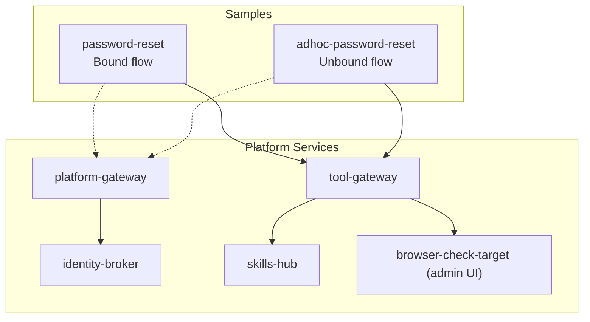
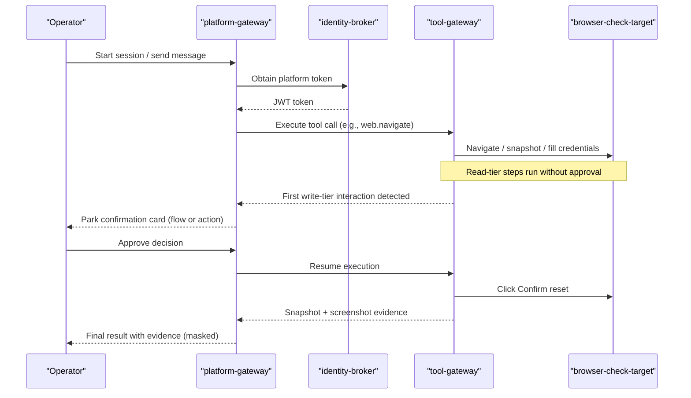
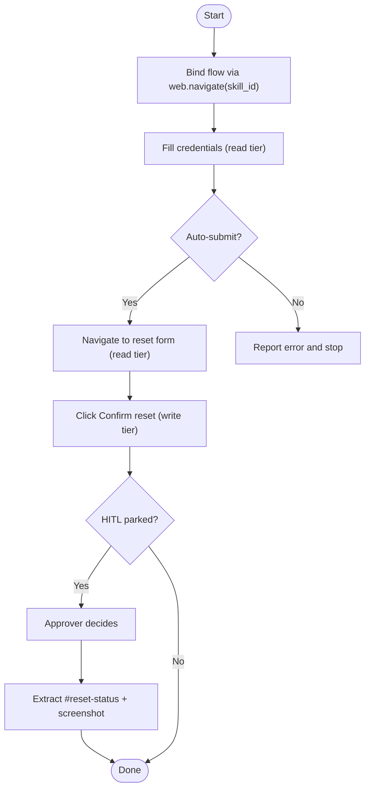
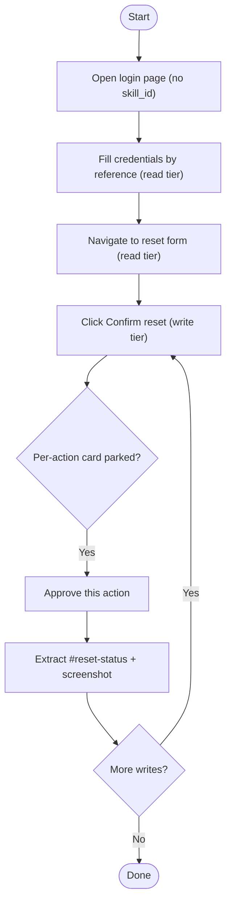
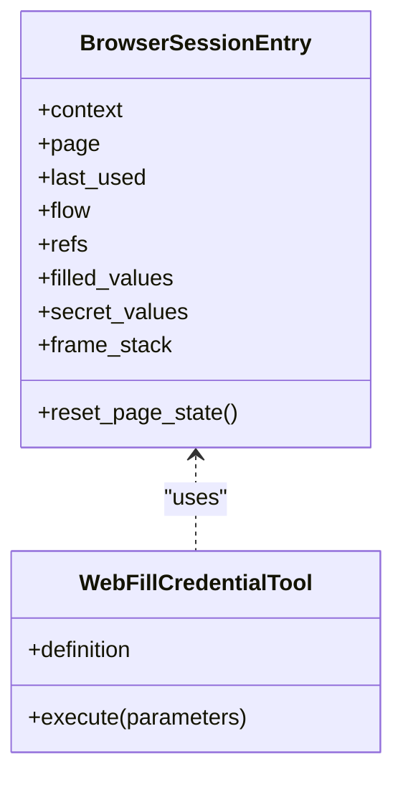
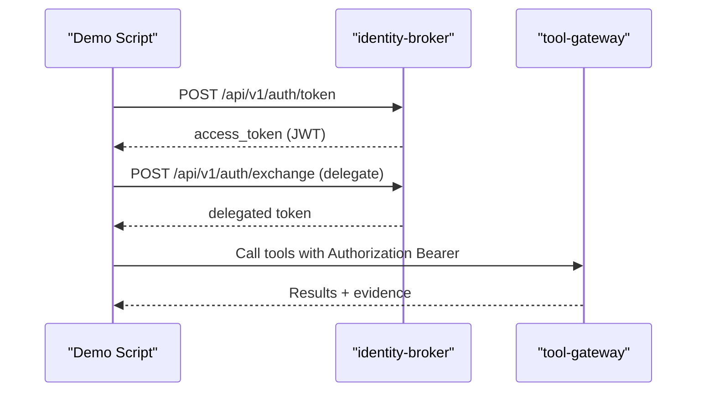
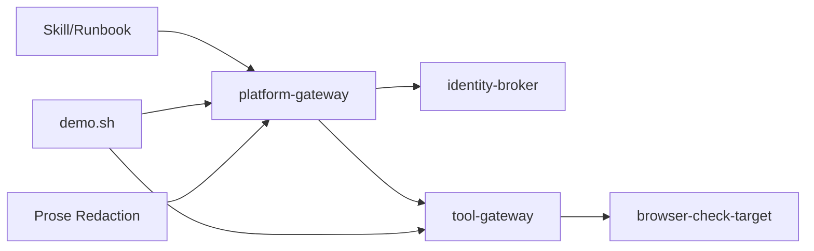

# Password Reset Walkthrough

<cite>
**Referenced Files in This Document**
- [WALKTHROUGH.md](file://samples/web-checks/password-reset/WALKTHROUGH.md)
- [ResetUserPassword.md](file://samples/web-checks/password-reset/skill/ResetUserPassword.md)
- [demo.sh](file://samples/web-checks/password-reset/demo/demo.sh)
- [WALKTHROUGH.md](file://samples/web-checks/adhoc-password-reset/WALKTHROUGH.md)
- [ResetPasswordAdHoc.md](file://samples/web-checks/adhoc-password-reset/skill/ResetPasswordAdHoc.md)
- [demo.sh](file://samples/web-checks/adhoc-password-reset/demo/demo.sh)
- [browser_connector.py](file://products/tool-gateway/src/tool_gateway/tools/browser_connector.py)
- [browser_sessions.py](file://products/tool-gateway/src/tool_gateway/tools/browser_sessions.py)
- [token_service.py](file://products/identity-broker/src/identity_service/services/token_service.py)
- [approval-and-hitl.md](file://docs/guides/approval-and-hitl.md)
- [prose_redaction.py](file://products/agent-platform/src/agent_service/services/prose_redaction.py)
- [test_prose_redaction.py](file://products/agent-platform/tests/test_prose_redaction.py)
</cite>

## Update Summary
**Changes Made**
- Enhanced documentation to clarify comprehensive masking guarantees for sensitive information in chat transcripts and live streams
- Added detailed explanations of masking boundaries including user message plaintext display during live interaction vs masked display after session reload
- Updated with specific test credentials examples (TempPass-2026! for ad-hoc flow, TempPass123! for bound flow) to help testers verify masking behavior
- Clarified that non-sensitive data like portal names remain unmasked while sensitive credentials are fully protected
- Added technical details about the prose redaction system implementation

## Table of Contents
1. [Introduction](#introduction)
2. [Project Structure](#project-structure)
3. [Core Components](#core-components)
4. [Architecture Overview](#architecture-overview)
5. [Detailed Component Analysis](#detailed-component-analysis)
6. [Dependency Analysis](#dependency-analysis)
7. [Performance Considerations](#performance-considerations)
8. [Troubleshooting Guide](#troubleshooting-guide)
9. [Conclusion](#conclusion)

## Introduction
This document walks through two password reset flows implemented as browser automation samples:
- A bound flow with a single Human-in-the-Loop (HITL) gate for the destructive mutation.
- An ad-hoc, unbound flow where each mutating action parks its own per-action approval card.

Both flows use the platform's browser tools to interact with a simulated admin portal and demonstrate secure credential handling, policy-enforced approvals, and durable evidence with comprehensive masking guarantees.

## Project Structure
The walkthroughs are provided as runnable samples under samples/web-checks, each with:
- A skill/runbook describing the steps and security constraints.
- A walkthrough explaining operator actions and expected outcomes.
- A demo script that validates prerequisites and can drive an end-to-end run.

**Diagram sources**
- [demo.sh:1-320](file://samples/web-checks/password-reset/demo/demo.sh#L1-L320)
- [demo.sh:1-349](file://samples/web-checks/adhoc-password-reset/demo/demo.sh#L1-L349)
- [browser_connector.py:775-1379](file://products/tool-gateway/src/tool_gateway/tools/browser_connector.py#L775-L1379)
- [browser_sessions.py:130-159](file://products/tool-gateway/src/tool_gateway/tools/browser_sessions.py#L130-L159)

**Section sources**
- [WALKTHROUGH.md:1-236](file://samples/web-checks/password-reset/WALKTHROUGH.md#L1-L236)
- [WALKTHROUGH.md:1-244](file://samples/web-checks/adhoc-password-reset/WALKTHROUGH.md#L1-L244)

## Core Components
- Skill/Runbook: Declares intent, risk class, and step-by-step procedure. The bound flow declares a web target and a write risk class; the ad-hoc runbook intentionally omits it to stay unbound.
- Browser Tools: Read-tier tools (navigate, snapshot, fill_credential) and write-tier tools (click, type, evaluate). Credentials are filled by reference from named sets and never appear in logs or results.
- HITL Approval: Write-tier interactions park confirmation cards. Bound flows collapse to one gate; unbound flows park one card per write.
- Identity and Tokens: Platform tokens issued by identity-broker enable authenticated calls across services.
- **Enhanced Prose Redaction**: Comprehensive masking system that protects sensitive information in all human-readable projections including titles, transcripts, live streams, cards, and evidence while preserving non-sensitive data like portal names.

**Section sources**
- [ResetUserPassword.md:1-181](file://samples/web-checks/password-reset/skill/ResetUserPassword.md#L1-L181)
- [ResetPasswordAdHoc.md:1-209](file://samples/web-checks/adhoc-password-reset/skill/ResetPasswordAdHoc.md#L1-L209)
- [browser_connector.py:1257-1369](file://products/tool-gateway/src/tool_gateway/tools/browser_connector.py#L1257-L1369)
- [token_service.py:83-126](file://products/identity-broker/src/identity_service/services/token_service.py#L83-L126)
- [prose_redaction.py:1-510](file://products/agent-platform/src/agent_service/services/prose_redaction.py#L1-L510)

## Architecture Overview
The password reset flows follow a consistent path:
1. Operator initiates via chat or demo script.
2. Platform-gateway orchestrates session and policy checks.
3. Tool-gateway executes browser tools against the admin portal.
4. Write-tier actions park HITL cards; approvers decide.
5. Evidence (snapshots, screenshots, signed receipts) is recorded with comprehensive masking.

**Diagram sources**
- [demo.sh:197-311](file://samples/web-checks/password-reset/demo/demo.sh#L197-L311)
- [demo.sh:204-340](file://samples/web-checks/adhoc-password-reset/demo/demo.sh#L204-L340)
- [browser_connector.py:775-852](file://products/tool-gateway/src/tool_gateway/tools/browser_connector.py#L775-L852)
- [approval-and-hitl.md:236-322](file://docs/guides/approval-and-hitl.md#L236-L322)

## Detailed Component Analysis

### Bound Flow: Single-HITL Gate
- Skill declares web_target and risk_class: write, binding a flow.
- Authentication uses read-tier fill_credential; login auto-submits without a click.
- The only write-tier interaction is clicking "Confirm reset," which parks one confirmation card.
- After approval, the agent verifies success via web.extract on #reset-status and captures a screenshot.

**Diagram sources**
- [ResetUserPassword.md:68-123](file://samples/web-checks/password-reset/skill/ResetUserPassword.md#L68-L123)
- [browser_connector.py:1257-1369](file://products/tool-gateway/src/tool_gateway/tools/browser_connector.py#L1257-L1369)

**Section sources**
- [WALKTHROUGH.md:63-137](file://samples/web-checks/password-reset/WALKTHROUGH.md#L63-L137)
- [ResetUserPassword.md:1-181](file://samples/web-checks/password-reset/skill/ResetUserPassword.md#L1-L181)

### Unbound Flow: Per-Action Approval
- Runbook deliberately omits web_target so no flow binds.
- Every write-tier interaction parks its own change-request card (approval_kind: action).
- Credential filling works by reference at read tier even when unbound.
- Each action must be approved individually; there is no flow-unlock.

**Diagram sources**
- [ResetPasswordAdHoc.md:98-151](file://samples/web-checks/adhoc-password-reset/skill/ResetPasswordAdHoc.md#L98-L151)
- [browser_connector.py:775-852](file://products/tool-gateway/src/tool_gateway/tools/browser_connector.py#L775-L852)

**Section sources**
- [WALKTHROUGH.md:71-163](file://samples/web-checks/adhoc-password-reset/WALKTHROUGH.md#L71-L163)
- [ResetPasswordAdHoc.md:1-209](file://samples/web-checks/adhoc-password-reset/skill/ResetPasswordAdHoc.md#L1-L209)

### Browser Tools and Session State
- Read-tier tools: navigate, snapshot, screenshot, fill_credential, extract, wait_for, hover, scroll, switch_frame.
- Write-tier tools: click, type, select, press_key, upload_file, evaluate.
- Sessions track refs, frame stack, and secret values to mask sensitive content in snapshots/screenshots.

**Diagram sources**
- [browser_sessions.py:130-159](file://products/tool-gateway/src/tool_gateway/tools/browser_sessions.py#L130-L159)
- [browser_connector.py:1257-1369](file://products/tool-gateway/src/tool_gateway/tools/browser_connector.py#L1257-L1369)

**Section sources**
- [browser_connector.py:775-852](file://products/tool-gateway/src/tool_gateway/tools/browser_connector.py#L775-L852)
- [browser_sessions.py:130-159](file://products/tool-gateway/src/tool_gateway/tools/browser_sessions.py#L130-L159)

### Identity and Token Flow
- Identity broker issues platform JWTs with roles/groups and audience binding.
- Demo scripts obtain platform tokens and delegate to tool-gateway for tool execution.
- Signed receipts and audit trails correlate confirmations with executions.

**Diagram sources**
- [token_service.py:83-126](file://products/identity-broker/src/identity_service/services/token_service.py#L83-L126)
- [demo.sh:130-195](file://samples/web-checks/password-reset/demo/demo.sh#L130-L195)
- [demo.sh:137-202](file://samples/web-checks/adhoc-password-reset/demo/demo.sh#L137-L202)

**Section sources**
- [token_service.py:1-155](file://products/identity-broker/src/identity_service/services/token_service.py#L1-L155)
- [demo.sh:130-195](file://samples/web-checks/password-reset/demo/demo.sh#L130-L195)
- [demo.sh:137-202](file://samples/web-checks/adhoc-password-reset/demo/demo.sh#L137-L202)

### Critical: Status Message Extraction Technique
**Updated** Corrected understanding of when to use web.extract vs web.snapshot for capturing status messages.

The admin portal renders success and error messages as non-interactive `
` elements with IDs like `#reset-status` and `#confirmation-message`. These elements contain important status text but are NOT captured by web.snapshot because:

1. **Snapshot Limitation**: web.snapshot only enumerates interactive elements using the selector `a, button, input, select, textarea, [role=button], [role=link], [role=tab], [role=checkbox], [onclick]`
2. **Non-Interactive Content**: `
` elements are not interactive and therefore excluded from snapshot output
3. **Correct Approach**: Use web.extract with CSS selectors like `#reset-status` to extract the actual text content

**Technical Details:**
- Success message: Extract `#reset-status` → "Password for alice@example.com has been reset successfully."
- Error message: Extract `#reset-status` → "Error: passwords do not match"
- Confirmation page: Extract `#confirmation-message` for the same success message
- Always capture web.screenshot as visual evidence alongside text extraction

**Section sources**
- [browser_connector.py:107-110](file://products/tool-gateway/src/tool_gateway/tools/browser_connector.py#L107-L110)
- [browser_connector.py:908-940](file://products/tool-gateway/src/tool_gateway/tools/browser_connector.py#L908-L940)
- [ResetUserPassword.md:119-129](file://samples/web-checks/password-reset/skill/ResetUserPassword.md#L119-L129)
- [ResetPasswordAdHoc.md:149-157](file://samples/web-checks/adhoc-password-reset/skill/ResetPasswordAdHoc.md#L149-L157)

### Card Parking Behavior Clarification
**Updated** Clarified documentation to accurately describe the ad-hoc password reset sample's card parking behavior.

The ad-hoc password reset sample is designed to park **exactly one card per action**. During SSO integration flow testing, confusion arose where runs parking two cards appeared successful while single-card runs appeared to fail. This clarification addresses that confusion:

- **Expected Behavior**: The sample performs exactly one write-tier interaction (clicking "Confirm reset"), which parks exactly one per-action confirmation card
- **Two Cards Indicate Issues**: If two cards are parked, it means the agent incorrectly clicked "Sign in" in addition to "Confirm reset" - this is a redundant gated write, not a stronger gate
- **Single Card is Correct**: One card represents the intended single destructive mutation
- **No Flow-Unlock**: Unlike bound flows, unbound writes don't unlock subsequent actions - each write parks its own card independently

**Key Distinction**: 
- **Bound Flow**: One card for the entire flow (multiple actions under one approval)
- **Unbound Flow**: One card per individual action (each action requires separate approval)

**Section sources**
- [WALKTHROUGH.md:115-124](file://samples/web-checks/adhoc-password-reset/WALKTHROUGH.md#L115-L124)
- [ResetPasswordAdHoc.md:144-151](file://samples/web-checks/adhoc-password-reset/skill/ResetPasswordAdHoc.md#L144-L151)
- [demo.sh:279-284](file://samples/web-checks/adhoc-password-reset/demo/demo.sh#L279-L284)

### Comprehensive Masking Guarantees for Sensitive Information
**Updated** Enhanced documentation to clarify comprehensive masking guarantees for sensitive information in chat transcripts and live streams.

The platform now provides comprehensive masking guarantees that protect sensitive information across all human-readable projections while maintaining the integrity of non-sensitive data.

#### Test Credentials Examples
For verification purposes, the following test credentials are used:
- **Bound Flow**: `TempPass123!` - Used in the password-reset sample
- **Ad-hoc Flow**: `TempPass-2026!` - Used in the adhoc-password-reset sample

#### Masking Boundaries
The masking system operates with clear boundaries:

1. **Live Interaction Phase**: User messages display plaintext in the composer bubble during live interaction
2. **Post-Reload Phase**: After session reload, all sensitive information appears as `***` in transcripts
3. **Non-Sensitive Data Preservation**: Portal names like `admin-portal` remain unmasked as they are not considered secrets
4. **Agent Context Integrity**: Sensitive values remain intact in the agent's operational context for task execution

#### Technical Implementation
The masking system implements multiple layers of protection:

- **Four-layer detection**: Pinned secret shapes (PEM/JWT/Bearer-Basic/AKIA), secret-named key=value pairs, URL query parameters, and heuristic credential detection
- **Role-based processing**: Different masking rules for user-authored text vs assistant responses
- **Streaming support**: Real-time masking for live streams with proper buffer management
- **Cross-turn protection**: Literals harvested from user messages are applied to all subsequent assistant responses

#### Verification Points
Testers can verify masking behavior by:
1. Sending a message with test credentials (`TempPass123!` or `TempPass-2026!`)
2. Observing plaintext display in the live composer bubble
3. Reloading the session to verify `***` replacement in transcripts
4. Confirming that portal names and other non-sensitive data remain visible
5. Checking that agent context still contains the original credentials for execution

**Section sources**
- [prose_redaction.py:1-510](file://products/agent-platform/src/agent_service/services/prose_redaction.py#L1-L510)
- [test_prose_redaction.py:1-200](file://products/agent-platform/tests/test_prose_redaction.py#L1-L200)
- [WALKTHROUGH.md:100-121](file://samples/web-checks/password-reset/WALKTHROUGH.md#L100-L121)
- [WALKTHROUGH.md:103-124](file://samples/web-checks/adhoc-password-reset/WALKTHROUGH.md#L103-L124)

## Dependency Analysis
- Skills define intent and constraints; gateway enforces origin allowlist and flow binding.
- Tool-gateway implements browser tools with strict separation between read and write tiers.
- Identity broker provides signed tokens used across services for authentication and delegation.
- Demo scripts validate environment readiness and assert behavior (one gate vs per-action cards).
- **Prose redaction system** provides comprehensive masking for all human-readable projections.

**Diagram sources**
- [ResetUserPassword.md:1-181](file://samples/web-checks/password-reset/skill/ResetUserPassword.md#L1-L181)
- [ResetPasswordAdHoc.md:1-209](file://samples/web-checks/adhoc-password-reset/skill/ResetPasswordAdHoc.md#L1-L209)
- [demo.sh:1-320](file://samples/web-checks/password-reset/demo/demo.sh#L1-L320)
- [demo.sh:1-349](file://samples/web-checks/adhoc-password-reset/demo/demo.sh#L1-L349)
- [prose_redaction.py:1-510](file://products/agent-platform/src/agent_service/services/prose_redaction.py#L1-L510)

**Section sources**
- [browser_connector.py:775-852](file://products/tool-gateway/src/tool_gateway/tools/browser_connector.py#L775-L852)
- [approval-and-hitl.md:236-322](file://docs/guides/approval-and-hitl.md#L236-L322)

## Performance Considerations
- Keep flows minimal to reduce step budget usage; bound flows collapse multiple writes under one approval.
- Prefer read-tier navigation and credential fills to avoid unnecessary approvals.
- Use screenshots sparingly; they add overhead but provide strong visual evidence.
- Ensure browser sidecar readiness to avoid delays in tool execution.
- **Optimized Status Extraction**: Use web.extract for status messages instead of web.snapshot to avoid unnecessary DOM traversal and improve performance.
- **Efficient Masking**: The prose redaction system uses targeted pattern matching to minimize performance impact while ensuring comprehensive protection.

## Troubleshooting Guide
Common issues and resolutions:
- Agent stalls before reaching the gate: Re-send the request naming the skill and credential set to ensure the flow reaches the confirmation card.
- No web.* tools available: Verify browser connector is enabled on tool-gateway.
- Credential set not found: Refresh secrets using the sync script.
- Skill not found: Install samples into skills-hub.
- Admin pages 404: Check port-forward status.
- Unexpected per-action cards: Ensure you did not pass skill_id when intending an unbound flow.
- **Status message not visible in snapshot**: Use web.extract with `#reset-status` or `#confirmation-message` instead of web.snapshot. Status messages are rendered as non-interactive `
` elements that are not captured by snapshots.
- **Incorrect verification method**: Remember that web.snapshot only captures interactive elements (`a, button, input, select, textarea`) while web.extract captures text content from any element.
- **Multiple cards appearing**: If more than one card is parked in the ad-hoc flow, check if the agent incorrectly clicked "Sign in" in addition to "Confirm reset". The sample should park exactly one card for the single destructive mutation.
- **Masking verification issues**: Use the test credentials `TempPass123!` (bound flow) or `TempPass-2026!` (ad-hoc flow) to verify that sensitive information is properly masked in transcripts while non-sensitive data like portal names remains visible.

**Section sources**
- [WALKTHROUGH.md:226-236](file://samples/web-checks/password-reset/WALKTHROUGH.md#L226-L236)
- [WALKTHROUGH.md:233-244](file://samples/web-checks/adhoc-password-reset/WALKTHROUGH.md#L233-L244)

## Conclusion
These walkthroughs demonstrate secure, auditable password resets using browser automation with clear separation between read and write operations, enforced approvals, durable evidence, and comprehensive masking guarantees. Choose the bound flow for repeatable, single-gate procedures and the unbound flow for exploratory or troubleshooting scenarios where each action requires explicit approval.

**Key Takeaway**: Always use web.extract for status messages and web.snapshot for interactive elements. The admin portal's status messages are rendered as non-interactive `
` elements that require web.extract with appropriate CSS selectors to capture their text content. For the ad-hoc password reset sample, expect exactly one card per action - multiple cards indicate incorrect behavior where additional unintended writes occurred. The platform now provides comprehensive masking guarantees that protect sensitive information across all human-readable projections while maintaining the integrity of non-sensitive data like portal names. Testers can verify masking behavior using the provided test credentials examples.