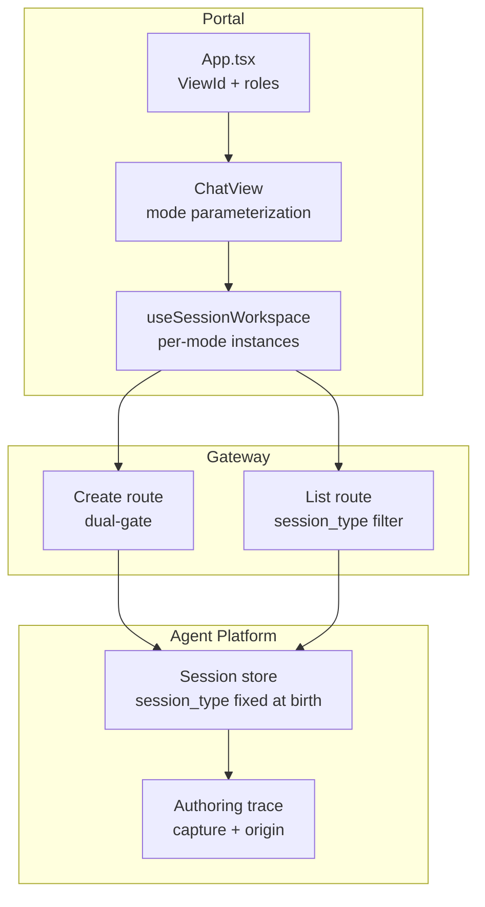
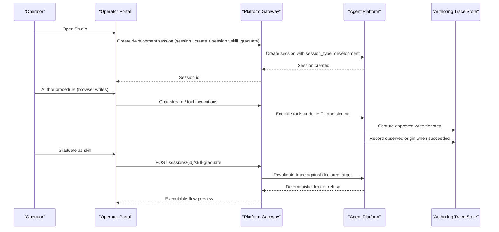
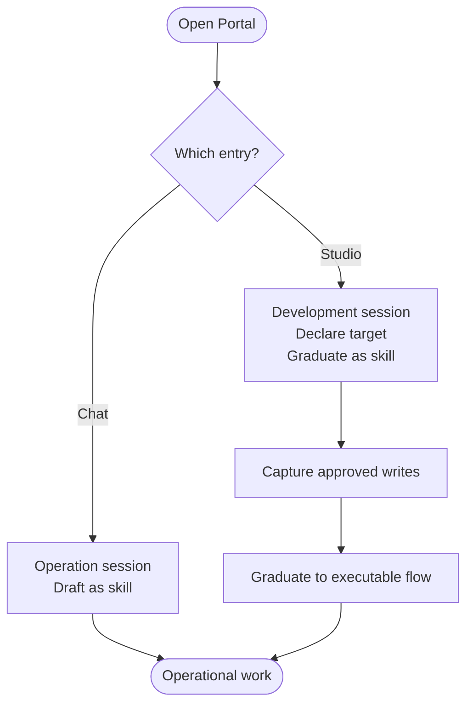
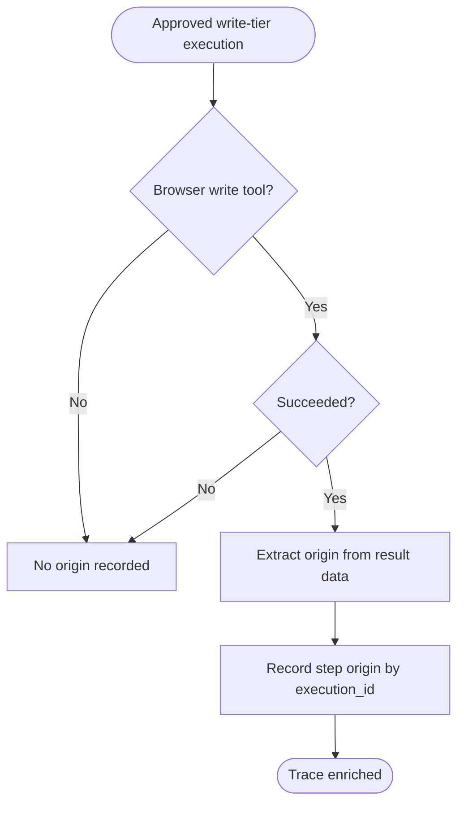
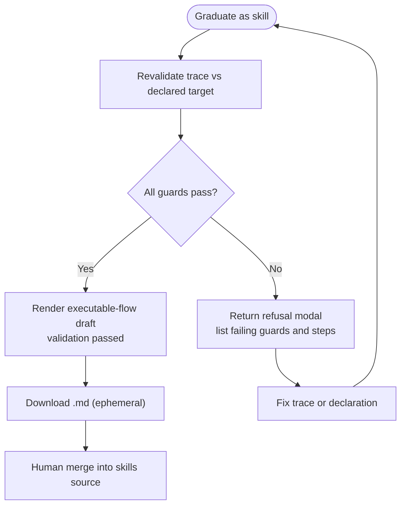
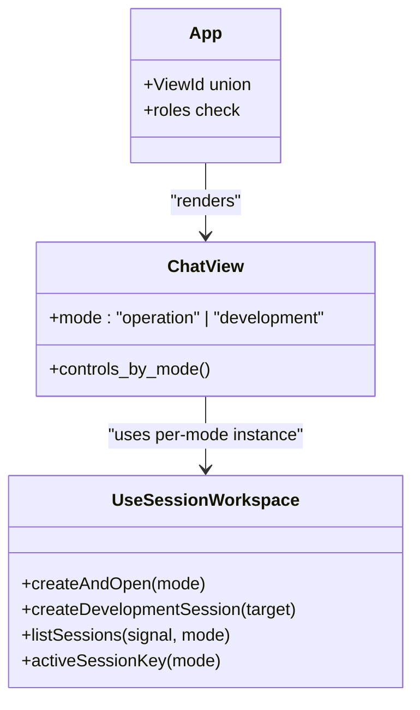
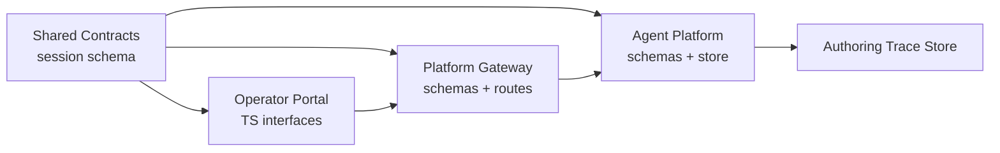

# Studio Guide

<cite>
**Referenced Files in This Document**
- [studio-guide.md](file://docs/guides/studio-guide.md)
- [SPEC-056 spec.md](file://docs/specs/SPEC-056-studio-skill-development-workspace/spec.md)
- [SPEC-056 plan.md](file://docs/specs/SPEC-056-studio-skill-development-workspace/plan.md)
- [WALKTHROUGH.md](file://samples/web-checks/skill-graduation/WALKTHROUGH.md)
- [getting-started.md](file://docs/guides/getting-started.md)
- [operator-portal README.md](file://products/operator-portal/README.md)
- [authoring_trace.py](file://products/agent-platform/src/agent_service/services/authoring_trace.py)
- [runtime_kernel.py](file://products/agent-platform/src/agent_service/runtime_kernel.py)
- [test_authoring_trace.py](file://products/agent-platform/tests/test_authoring_trace.py)
- [useSessionWorkspace.test.ts](file://products/operator-portal/web-ui/app/src/sessions/__tests__/useSessionWorkspace.test.ts)
</cite>

## Table of Contents
1. [Introduction](#introduction)
2. [Project Structure](#project-structure)
3. [Core Components](#core-components)
4. [Architecture Overview](#architecture-overview)
5. [Detailed Component Analysis](#detailed-component-analysis)
6. [Dependency Analysis](#dependency-analysis)
7. [Performance Considerations](#performance-considerations)
8. [Troubleshooting Guide](#troubleshooting-guide)
9. [Conclusion](#conclusion)
10. [Appendices](#appendices)

## Introduction
This guide explains the operator-facing Studio workspace: how to create a development session, author procedures with approvals, and graduate them into replayable executable-flow skills. It also clarifies why Studio is separate from Chat, what stays identical between them, and how to troubleshoot common issues.

Studio is a scoping change over one shared chat core. The same streaming transcript, secret masking, HITL confirmation path, tool evidence rendering, model selection, and voice input apply identically in both entries. What differs is the session type, the session list scope, and the authoring controls exposed.

## Project Structure
Studio spans multiple products and shared contracts:
- Operator portal provides the UI entry points for Chat and Studio, mode-scoped session lists, and authoring controls.
- Agent platform stores sessions, captures authoring traces, and records observed origins for browser write steps.
- Platform gateway enforces dual authorization for creating development sessions and forwards filters for session lists.
- Shared contracts define the additive session_type discriminator and skill format evolution.

**Diagram sources**
- [SPEC-056 plan.md:208-232](file://docs/specs/SPEC-056-studio-skill-development-workspace/plan.md#L208-L232)
- [SPEC-056 spec.md:87-143](file://docs/specs/SPEC-056-studio-skill-development-workspace/spec.md#L87-L143)

**Section sources**
- [SPEC-056 spec.md:87-143](file://docs/specs/SPEC-056-studio-skill-development-workspace/spec.md#L87-L143)
- [SPEC-056 plan.md:208-232](file://docs/specs/SPEC-056-studio-skill-development-workspace/plan.md#L208-L232)
- [operator-portal README.md:1-137](file://products/operator-portal/README.md#L1-L137)

## Core Components
- Session type discriminator: An additive field set once at creation and never changed. Chat creates operation sessions; Studio creates development sessions. Each entry lists only its own type server-side.
- Authoring controls placement: Draft as skill remains in Chat; Declare target and Graduate as skill live in Studio. There is no conversion between entries.
- Authorization posture: Creating a development session requires both session:create and the existing session:skill_graduate action. No new policy action or audit event type is introduced.
- Shared-core invariant: Streaming, secret masking, and HITL are identical across modes; mode only affects visible controls, birth type, and list scope.

These components ensure that operational work and skill development remain distinct while sharing the same trust surface.

**Section sources**
- [SPEC-056 spec.md:87-143](file://docs/specs/SPEC-056-studio-skill-development-workspace/spec.md#L87-L143)
- [SPEC-056 spec.md:145-221](file://docs/specs/SPEC-056-studio-skill-development-workspace/spec.md#L145-L221)
- [SPEC-056 spec.md:223-261](file://docs/specs/SPEC-056-studio-skill-development-workspace/spec.md#L223-L261)

## Architecture Overview
The Studio workflow connects portal actions to backend services through the gateway, capturing approved mutations into an authoring trace and enabling deterministic graduation.

**Diagram sources**
- [SPEC-056 spec.md:87-143](file://docs/specs/SPEC-056-studio-skill-development-workspace/spec.md#L87-L143)
- [SPEC-056 spec.md:145-221](file://docs/specs/SPEC-056-studio-skill-development-workspace/spec.md#L145-L221)
- [authoring_trace.py:547-577](file://products/agent-platform/src/agent_service/services/authoring_trace.py#L547-L577)
- [runtime_kernel.py:1945-1973](file://products/agent-platform/src/agent_service/runtime_kernel.py#L1945-L1973)

## Detailed Component Analysis

### Studio vs Chat: Entry Points and Controls
- Chat is for operational work; it creates operation sessions and offers Draft as skill.
- Studio is for developing reusable skills; it creates development sessions and offers Declare target and Graduate as skill.
- Both share the same chat core, streaming transcript, secret masking, HITL path, tool evidence, model selection, and voice input.

**Diagram sources**
- [studio-guide.md:16-43](file://docs/guides/studio-guide.md#L16-L43)
- [SPEC-056 spec.md:119-184](file://docs/specs/SPEC-056-studio-skill-development-workspace/spec.md#L119-L184)

**Section sources**
- [studio-guide.md:16-43](file://docs/guides/studio-guide.md#L16-L43)
- [SPEC-056 spec.md:119-184](file://docs/specs/SPEC-056-studio-skill-development-workspace/spec.md#L119-L184)

### Authoring Trace Capture and Origin Recording
- Every approved, signed, write-tier execution is captured into the session’s authoring trace. Read-tier calls are not captured because they do not represent authorized mutations.
- For browser write tools that succeed, the system records the observed origin where the connector landed. This supports blast-radius validation during graduation.
- The capture is best-effort and fail-safe: a store failure degrades graduation candidacy without touching receipts, audits, or resumed streams.

**Diagram sources**
- [authoring_trace.py:547-577](file://products/agent-platform/src/agent_service/services/authoring_trace.py#L547-L577)
- [runtime_kernel.py:1945-1973](file://products/agent-platform/src/agent_service/runtime_kernel.py#L1945-L1973)

**Section sources**
- [studio-guide.md:95-106](file://docs/guides/studio-guide.md#L95-L106)
- [authoring_trace.py:547-577](file://products/agent-platform/src/agent_service/services/authoring_trace.py#L547-L577)
- [runtime_kernel.py:1945-1973](file://products/agent-platform/src/agent_service/runtime_kernel.py#L1945-L1973)

### Graduation Workflow and Refusals
- Graduation is deterministic and does not invoke a model. It re-validates the captured trace against the declared target and produces either an executable-flow draft or a refusal listing every guard failed and responsible step positions.
- Common refusals include missing authoring trace, off-origin steps, unresolved credential holes, unobserved origins, and exceeding the step budget.

**Diagram sources**
- [studio-guide.md:108-133](file://docs/guides/studio-guide.md#L108-L133)
- [WALKTHROUGH.md:209-245](file://samples/web-checks/skill-graduation/WALKTHROUGH.md#L209-L245)

**Section sources**
- [studio-guide.md:108-133](file://docs/guides/studio-guide.md#L108-L133)
- [WALKTHROUGH.md:209-245](file://samples/web-checks/skill-graduation/WALKTHROUGH.md#L209-L245)

### Portal Behavior and Mode-Scope
- The portal uses one ChatView parameterized by mode. Studio is role-gated to authoring roles.
- Each entry maintains its own last-open session key and lists only its own session type server-side.
- Development polling is gated on studio roles; non-studio roles never poll a development list.

**Diagram sources**
- [SPEC-056 plan.md:208-232](file://docs/specs/SPEC-056-studio-skill-development-workspace/plan.md#L208-L232)
- [useSessionWorkspace.test.ts:118-147](file://products/operator-portal/web-ui/app/src/sessions/__tests__/useSessionWorkspace.test.ts#L118-L147)

**Section sources**
- [SPEC-056 plan.md:208-232](file://docs/specs/SPEC-056-studio-skill-development-workspace/plan.md#L208-L232)
- [useSessionWorkspace.test.ts:118-147](file://products/operator-portal/web-ui/app/src/sessions/__tests__/useSessionWorkspace.test.ts#L118-L147)

### Environment Setup and First Run
- Use the getting started guide to provision LLM secrets, build images, deploy overlays, and verify pods.
- Access the portal via the canonical hostname so OIDC callbacks round-trip correctly.
- Ensure browser tools and admin targets are reachable before attempting browser-based authoring.

**Section sources**
- [getting-started.md:20-95](file://docs/guides/getting-started.md#L20-L95)
- [getting-started.md:123-156](file://docs/guides/getting-started.md#L123-L156)

## Dependency Analysis
Studio depends on coordinated changes across products and shared contracts:
- Additive session_type on session schemas and mirrors ensures consistent classification.
- Gateway routes enforce dual authorization for development session creation and forward session_type filters.
- Agent platform persists session_type at birth and captures authoring traces with observed origins.
- Portal implements mode-scoped workspaces and role-gated navigation.

**Diagram sources**
- [SPEC-056 spec.md:87-143](file://docs/specs/SPEC-056-studio-skill-development-workspace/spec.md#L87-L143)
- [SPEC-056 spec.md:290-332](file://docs/specs/SPEC-056-studio-skill-development-workspace/spec.md#L290-L332)

**Section sources**
- [SPEC-056 spec.md:290-332](file://docs/specs/SPEC-056-studio-skill-development-workspace/spec.md#L290-L332)

## Performance Considerations
- Authoring trace capture is best-effort and bounded per session; exceeding the cap blocks additional steps for that session but does not block others.
- Closing a graduated trace prevents further appends, preserving provenance integrity.
- Origin recording runs after execution success and is keyed by execution_id to avoid rewriting earlier observations.

**Section sources**
- [test_authoring_trace.py:162-176](file://products/agent-platform/tests/test_authoring_trace.py#L162-L176)
- [runtime_kernel.py:1945-1973](file://products/agent-platform/src/agent_service/runtime_kernel.py#L1945-L1973)

## Troubleshooting Guide
Common symptoms and fixes:
- Studio missing from sidebar: Your role lacks session:skill_graduate. Sign in as operator, approver, or platform-admin.
- Graduate as skill missing: You are in Chat; authoring controls live in Studio.
- Declare target says scope already in force: First declaration wins and cannot be widened. Open a new development session if you need a different target.
- Creating a session returns 403: Dual gate requires session:create and session:skill_graduate. The response names the missing grant.
- Graduation returns 409: A refusal, not a failure. Read the modal to identify failing guards and steps.
- Studio session missing from Documents picker: Correct behavior; development sessions are not shift-summary material.
- 400 development sessions are not shift-summary material: A development id was typed into the picker’s manual-id field. Remove it and pick operational sessions.
- Off-origin graduation refusal: Declared address must match the connector’s observed origin. Use the in-cluster name, not localhost.
- Unobserved origin refusal: A captured write failed or could not be verified. Let pages redirect themselves rather than clicking elements that may detach.
- Unresolved credential hole: Avoid passing secrets as values; use credential-set references or URL parameters.

**Section sources**
- [studio-guide.md:209-221](file://docs/guides/studio-guide.md#L209-L221)
- [WALKTHROUGH.md:481-499](file://samples/web-checks/skill-graduation/WALKTHROUGH.md#L481-L499)

## Conclusion
Studio separates operational work from skill development while sharing the same secure chat core. By fixing session type at birth, scoping lists server-side, placing authoring controls in their correct homes, and enforcing dual authorization for development sessions, the platform keeps blast-radius control intact and makes graduation deterministic and auditable. Follow the walkthrough to author ad hoc procedures, graduate them into executable flows, merge by hand, and replay behind a single approval gate.

## Appendices

### Quick Reference: Roles and Visibility
- Studio visibility: operator, approver, platform-admin.
- Developer, read-only-observer, auditor see Chat only.
- Creating a development session requires session:create and session:skill_graduate.

**Section sources**
- [SPEC-056 spec.md:119-143](file://docs/specs/SPEC-056-studio-skill-development-workspace/spec.md#L119-L143)
- [SPEC-056 spec.md:223-261](file://docs/specs/SPEC-056-studio-skill-development-workspace/spec.md#L223-L261)