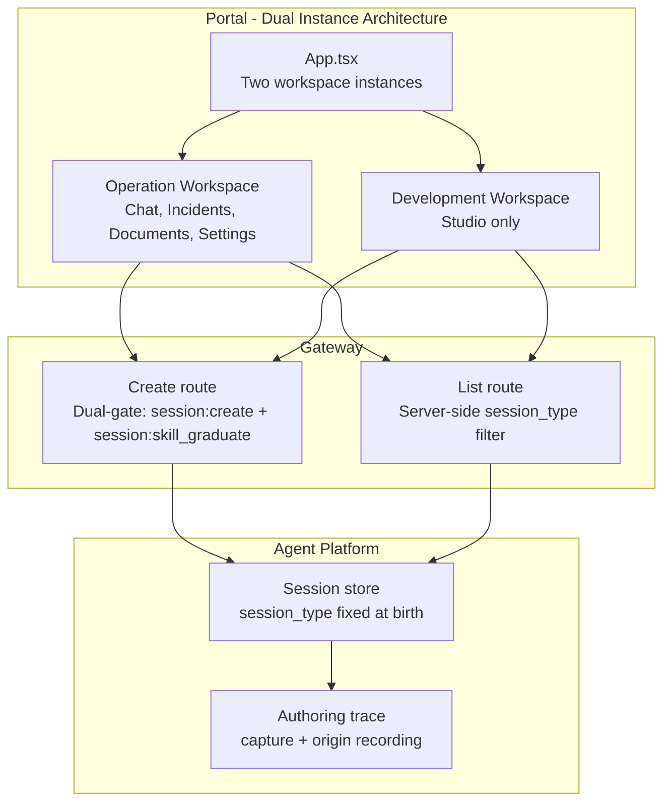
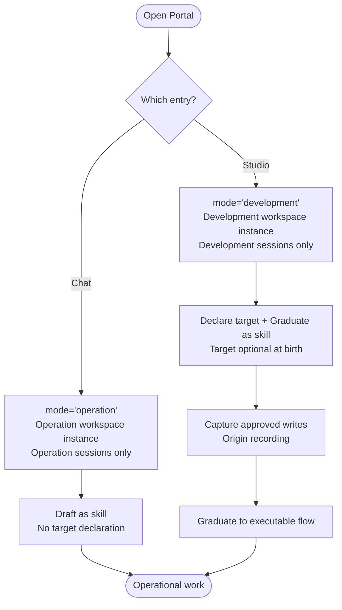
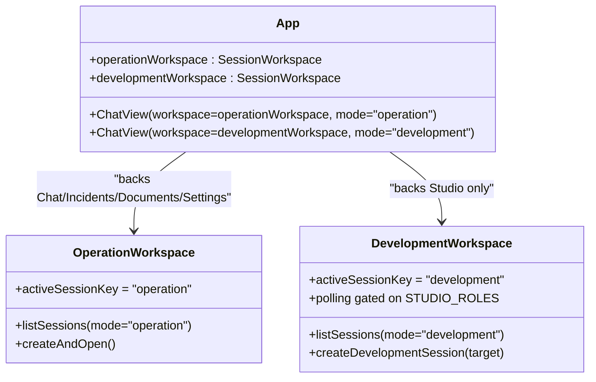
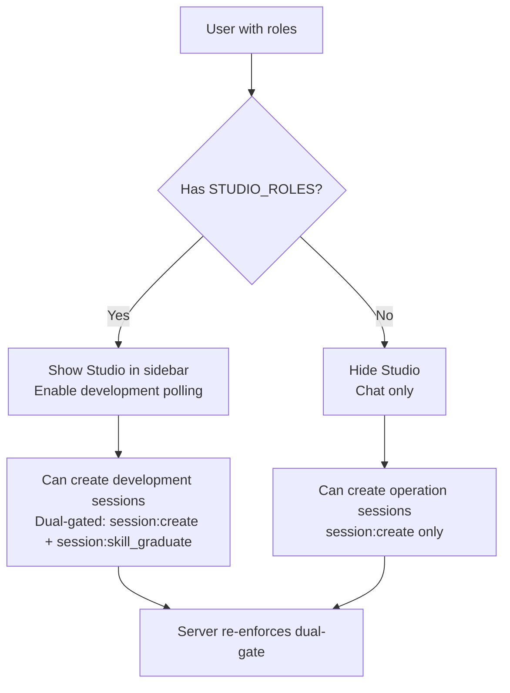
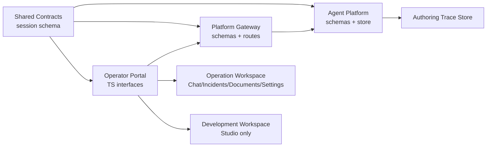

# Studio Guide

<cite>
**Referenced Files in This Document**
- [studio-guide.md](file://docs/guides/studio-guide.md)
- [SPEC-056 spec.md](file://docs/specs/SPEC-056-studio-skill-development-workspace/spec.md)
- [SPEC-056 plan.md](file://docs/specs/SPEC-056-studio-skill-development-workspace/plan.md)
- [WALKTHROUGH.md](file://samples/web-checks/skill-graduation/WALKTHROUGH.md)
- [getting-started.md](file://docs/guides/getting-started.md)
- [operator-portal README.md](file://products/operator-portal/README.md)
- [authoring_trace.py](file://products/agent-platform/src/agent_service/services/authoring_trace.py)
- [runtime_kernel.py](file://products/agent-platform/src/agent_service/runtime_kernel.py)
- [test_authoring_trace.py](file://products/agent-platform/tests/test_authoring_trace.py)
- [useSessionWorkspace.test.ts](file://products/operator-portal/web-ui/app/src/sessions/__tests__/useSessionWorkspace.test.ts)
- [useSessionWorkspace.ts](file://products/operator-portal/web-ui/app/src/sessions/useSessionWorkspace.ts)
- [App.tsx](file://products/operator-portal/web-ui/app/src/App.tsx)
- [roles.ts](file://products/operator-portal/web-ui/app/src/roles.ts)
</cite>

## Update Summary
**Changes Made**
- Enhanced SPEC-056 architecture accuracy with detailed dual-instance workspace explanation
- Clarified Chat/Studio relationship as single mode parameterization with different session types
- Improved role-based access control explanations with specific role mappings
- Updated workspace instance descriptions to reflect dual-instance architecture where operation sessions back Chat/Incidents/Documents/Settings while development sessions back Studio
- Added comprehensive technical implementation details from actual codebase analysis

## Table of Contents
1. [Introduction](#introduction)
2. [Project Structure](#project-structure)
3. [Core Components](#core-components)
4. [Architecture Overview](#architecture-overview)
5. [Detailed Component Analysis](#detailed-component-analysis)
6. [Dependency Analysis](#dependency-analysis)
7. [Performance Considerations](#performance-considerations)
8. [Troubleshooting Guide](#troubleshooting-guide)
9. [Conclusion](#conclusion)
10. [Appendices](#appendices)

## Introduction
This guide explains the operator-facing Studio workspace: how to create a development session, author procedures with approvals, and graduate them into replayable executable-flow skills. It also clarifies why Studio is separate from Chat, what stays identical between them, and how to troubleshoot common issues.

**Updated** The Chat/Studio relationship is now understood as a single shared chat core parameterized by mode, where both entries render the same component but with different session types, list scopes, and authoring controls. Studio creates `development` sessions while Chat creates `operation` sessions, with each entry maintaining its own workspace instance.

Studio is a scoping change over one shared chat core. The same streaming transcript, secret masking, HITL confirmation path, tool evidence rendering, model selection, and voice input apply identically in both entries. What differs is the session type (`operation` vs `development`), the session list scope (server-side filtered), and the authoring controls exposed (Draft as skill in Chat vs Declare target + Graduate as skill in Studio).

## Project Structure
Studio spans multiple products and shared contracts with a dual-instance architecture:
- **Operator portal** provides two mode-scoped workspace instances: an operation instance backing Chat, Incidents, Documents, and Settings; and a development instance backing Studio only.
- **Agent platform** stores sessions with fixed-at-birth session_type, captures authoring traces, and records observed origins for browser write steps.
- **Platform gateway** enforces dual authorization for creating development sessions and forwards session_type filters for server-side list scoping.
- **Shared contracts** define the additive session_type discriminator and skill format evolution across all mirrors.



**Diagram sources**
- [App.tsx:312-324](file://products/operator-portal/web-ui/app/src/App.tsx#L312-L324)
- [useSessionWorkspace.ts:21-26](file://products/operator-portal/web-ui/app/src/sessions/useSessionWorkspace.ts#L21-L26)
- [SPEC-056 plan.md:208-232](file://docs/specs/SPEC-056-studio-skill-development-workspace/plan.md#L208-L232)

**Section sources**
- [SPEC-056 spec.md:87-143](file://docs/specs/SPEC-056-studio-skill-development-workspace/spec.md#L87-L143)
- [SPEC-056 plan.md:208-232](file://docs/specs/SPEC-056-studio-skill-development-workspace/plan.md#L208-L232)
- [App.tsx:312-324](file://products/operator-portal/web-ui/app/src/App.tsx#L312-L324)
- [useSessionWorkspace.ts:21-26](file://products/operator-portal/web-ui/app/src/sessions/useSessionWorkspace.ts#L21-L26)

## Core Components
- **Session type discriminator**: An additive field set once at creation and never changed. Chat creates operation sessions; Studio creates development sessions. Each entry lists only its own type via server-side filtering.
- **Dual workspace instances**: App owns two `useSessionWorkspace` instances - operation instance backs Chat/Incidents/Documents/Settings, development instance backs Studio only. Each maintains namespaced active-session keys.
- **Role-based access control**: Studio visibility requires `STUDIO_ROLES` (operator, approver, platform-admin) which equals `SKILL_GRADUATE_ROLES`. Development polling is gated on studio roles.
- **Shared-core invariant**: Streaming, secret masking, and HITL are identical across modes; mode only affects visible controls, birth type, and list scope.

These components ensure that operational work and skill development remain distinct while sharing the same trust surface and security guarantees.

**Section sources**
- [SPEC-056 spec.md:87-143](file://docs/specs/SPEC-056-studio-skill-development-workspace/spec.md#L87-L143)
- [SPEC-056 spec.md:145-221](file://docs/specs/SPEC-056-studio-skill-development-workspace/spec.md#L145-L221)
- [SPEC-056 spec.md:223-261](file://docs/specs/SPEC-056-studio-skill-development-workspace/spec.md#L223-L261)
- [roles.ts:77-90](file://products/operator-portal/web-ui/app/src/roles.ts#L77-L90)
- [App.tsx:312-324](file://products/operator-portal/web-ui/app/src/App.tsx#L312-L324)

## Architecture Overview
The Studio workflow connects portal actions to backend services through the gateway, capturing approved mutations into an authoring trace and enabling deterministic graduation, all within a dual-instance architecture.

```mermaid
sequenceDiagram
participant User as "Operator"
participant Portal as "Operator Portal"
param App as "App (Dual Instances)"
param OpWS as "Operation Workspace"
param DevWS as "Development Workspace"
participant Gateway as "Platform Gateway"
participant Agent as "Agent Platform"
participant Trace as "Authoring Trace Store"
User->>Portal : Open Studio
Portal->>App : Navigate to studio view
App->>DevWS : Use development workspace instance
DevWS->>Gateway : Create development session (session : create + session : skill_graduate)
Gateway->>Agent : Create session with session_type=development
Agent-->>Gateway : Session created
Gateway-->>DevWS : Session id
DevWS->>App : Set active session under development key
User->>Portal : Author procedure (browser writes)
Portal->>Gateway : Chat stream / tool invocations
Gateway->>Agent : Execute tools under HITL and signing
Agent->>Trace : Capture approved write-tier step
Agent->>Trace : Record observed origin when succeeded
User->>Portal : Graduate as skill
Portal->>Gateway : POST sessions/{id}/skill-graduate
Gateway->>Agent : Revalidate trace against declared target
Agent-->>Gateway : Deterministic draft or refusal
Gateway-->>Portal : Executable-flow preview
```

**Diagram sources**
- [App.tsx:312-324](file://products/operator-portal/web-ui/app/src/App.tsx#L312-L324)
- [useSessionWorkspace.ts:151-175](file://products/operator-portal/web-ui/app/src/sessions/useSessionWorkspace.ts#L151-L175)
- [SPEC-056 spec.md:87-143](file://docs/specs/SPEC-056-studio-skill-development-workspace/spec.md#L87-L143)
- [authoring_trace.py:547-577](file://products/agent-platform/src/agent_service/services/authoring_trace.py#L547-L577)

## Detailed Component Analysis

### Studio vs Chat: Single Mode, Different Session Types
**Updated** Both Chat and Studio use the same `ChatView` component parameterized by `mode: "operation" | "development"`, not separate implementations. The mode fixes three things: birth `session_type`, list scope, and active-session key namespace.

- **Chat** uses `mode="operation"`: creates operation sessions, offers Draft as skill, backed by operation workspace instance
- **Studio** uses `mode="development"`: creates development sessions, offers Declare target + Graduate as skill, backed by development workspace instance  
- **Shared core**: Same streaming transcript, secret masking, HITL path, tool evidence, model selection, and voice input



**Diagram sources**
- [App.tsx:405-408](file://products/operator-portal/web-ui/app/src/App.tsx#L405-L408)
- [useSessionWorkspace.ts:21-26](file://products/operator-portal/web-ui/app/src/sessions/useSessionWorkspace.ts#L21-L26)
- [SPEC-056 spec.md:119-184](file://docs/specs/SPEC-056-studio-skill-development-workspace/spec.md#L119-L184)

**Section sources**
- [App.tsx:405-408](file://products/operator-portal/web-ui/app/src/App.tsx#L405-L408)
- [useSessionWorkspace.ts:21-26](file://products/operator-portal/web-ui/app/src/sessions/useSessionWorkspace.ts#L21-L26)
- [SPEC-056 spec.md:119-184](file://docs/specs/SPEC-056-studio-skill-development-workspace/spec.md#L119-L184)

### Dual Workspace Instance Architecture
**New Section** The portal implements a dual-instance architecture where `App.tsx` owns two separate `useSessionWorkspace` instances, each serving different purposes:

- **Operation workspace instance**: Backs Chat, Incidents, Documents, and Settings views. Always deals with operation sessions.
- **Development workspace instance**: Backs Studio only. Only polls when user has studio roles.

Each instance maintains namespaced active-session keys (`luban.portal.activeSessionId.operation` vs `luban.portal.activeSessionId.development`) so they never fight over the active pointer.



**Diagram sources**
- [App.tsx:312-324](file://products/operator-portal/web-ui/app/src/App.tsx#L312-L324)
- [useSessionWorkspace.ts:28-30](file://products/operator-portal/web-ui/app/src/sessions/useSessionWorkspace.ts#L28-L30)

**Section sources**
- [App.tsx:312-324](file://products/operator-portal/web-ui/app/src/App.tsx#L312-L324)
- [useSessionWorkspace.ts:28-30](file://products/operator-portal/web-ui/app/src/sessions/useSessionWorkspace.ts#L28-L30)
- [useSessionWorkspace.test.ts:85-126](file://products/operator-portal/web-ui/app/src/sessions/__tests__/useSessionWorkspace.test.ts#L85-L126)

### Role-Based Access Control and Visibility
**Enhanced** Role-based access control is implemented through explicit role sets and server-side enforcement:

- **STUDIO_ROLES**: Equals `SKILL_GRADUATE_ROLES` (platform-admin, approver, operator) - these roles see Studio in sidebar
- **Development polling**: Only enabled when `authenticated && hasAnyRole(roles, STUDIO_ROLES)`
- **Gateway dual-gate**: Creating development sessions requires both `session:create` AND `session:skill_graduate`
- **Client navigation gate**: Studio entry hidden for developer, read-only-observer, and auditor roles



**Diagram sources**
- [roles.ts:77-90](file://products/operator-portal/web-ui/app/src/roles.ts#L77-L90)
- [App.tsx:105-109](file://products/operator-portal/web-ui/app/src/App.tsx#L105-L109)
- [SPEC-056 spec.md:223-261](file://docs/specs/SPEC-056-studio-skill-development-workspace/spec.md#L223-L261)

**Section sources**
- [roles.ts:77-90](file://products/operator-portal/web-ui/app/src/roles.ts#L77-L90)
- [App.tsx:105-109](file://products/operator-portal/web-ui/app/src/App.tsx#L105-L109)
- [SPEC-056 spec.md:223-261](file://docs/specs/SPEC-056-studio-skill-development-workspace/spec.md#L223-L261)

### Authoring Trace Capture and Origin Recording
Every approved, signed, write-tier execution is captured into the session's authoring trace. Read-tier calls are not captured because they do not represent authorized mutations. For browser write tools that succeed, the system records the observed origin where the connector landed. This supports blast-radius validation during graduation.

The capture is best-effort and fail-safe: a store failure degrades graduation candidacy without touching receipts, audits, or resumed streams.


**Diagram sources**
- [authoring_trace.py:547-577](file://products/agent-platform/src/agent_service/services/authoring_trace.py#L547-L577)
- [runtime_kernel.py:1945-1973](file://products/agent-platform/src/agent_service/runtime_kernel.py#L1945-L1973)

**Section sources**
- [authoring_trace.py:547-577](file://products/agent-platform/src/agent_service/services/authoring_trace.py#L547-L577)
- [runtime_kernel.py:1945-1973](file://products/agent-platform/src/agent_service/runtime_kernel.py#L1945-L1973)

### Graduation Workflow and Refusals
Graduation is deterministic and does not invoke a model. It re-validates the captured trace against the declared target and produces either an executable-flow draft or a refusal listing every guard failed and responsible step positions.

Common refusals include missing authoring trace, off-origin steps, unresolved credential holes, unobserved origins, and exceeding the step budget.


**Diagram sources**
- [WALKTHROUGH.md:209-245](file://samples/web-checks/skill-graduation/WALKTHROUGH.md#L209-L245)

**Section sources**
- [WALKTHROUGH.md:209-245](file://samples/web-checks/skill-graduation/WALKTHROUGH.md#L209-L245)

### Environment Setup and First Run
Use the getting started guide to provision LLM secrets, build images, deploy overlays, and verify pods. Access the portal via the canonical hostname so OIDC callbacks round-trip correctly. Ensure browser tools and admin targets are reachable before attempting browser-based authoring.

**Section sources**
- [getting-started.md:20-95](file://docs/guides/getting-started.md#L20-L95)
- [getting-started.md:123-156](file://docs/guides/getting-started.md#L123-L156)

## Dependency Analysis
Studio depends on coordinated changes across products and shared contracts:
- **Additive session_type** on session schemas and mirrors ensures consistent classification
- **Gateway routes** enforce dual authorization for development session creation and forward session_type filters
- **Agent platform** persists session_type at birth and captures authoring traces with observed origins
- **Portal implements** mode-scoped workspaces and role-gated navigation with dual-instance architecture



**Diagram sources**
- [SPEC-056 spec.md:87-143](file://docs/specs/SPEC-056-studio-skill-development-workspace/spec.md#L87-L143)
- [SPEC-056 spec.md:290-332](file://docs/specs/SPEC-056-studio-skill-development-workspace/spec.md#L290-L332)

**Section sources**
- [SPEC-056 spec.md:290-332](file://docs/specs/SPEC-056-studio-skill-development-workspace/spec.md#L290-L332)

## Performance Considerations
- **Authoring trace capture** is best-effort and bounded per session; exceeding the cap blocks additional steps for that session but does not block others
- **Closing a graduated trace** prevents further appends, preserving provenance integrity
- **Origin recording** runs after execution success and is keyed by execution_id to avoid rewriting earlier observations
- **Dual workspace instances** provide independent polling cadences with development polling gated on studio roles to minimize unnecessary requests

**Section sources**
- [test_authoring_trace.py:162-176](file://products/agent-platform/tests/test_authoring_trace.py#L162-L176)
- [runtime_kernel.py:1945-1973](file://products/agent-platform/src/agent_service/runtime_kernel.py#L1945-L1973)

## Troubleshooting Guide
Common symptoms and fixes:
- **Studio missing from sidebar**: Your role lacks `session:skill_graduate`. Sign in as operator, approver, or platform-admin
- **Graduate as skill missing**: You are in Chat; authoring controls live in Studio
- **Declare target says scope already in force**: First declaration wins and cannot be widened. Open a new development session if you need a different target
- **Creating a session returns 403**: Dual gate requires `session:create` and `session:skill_graduate`. The response names the missing grant
- **Graduation returns 409**: A refusal, not a failure. Read the modal to identify failing guards and steps
- **Studio session missing from Documents picker**: Correct behavior; development sessions are not shift-summary material
- **400 development sessions are not shift-summary material**: A development id was typed into the picker's manual-id field. Remove it and pick operational sessions
- **Off-origin graduation refusal**: Declared address must match the connector's observed origin. Use the in-cluster name, not localhost
- **Unobserved origin refusal**: A captured write failed or could not be verified. Let pages redirect themselves rather than clicking elements that may detach
- **Unresolved credential hole**: Avoid passing secrets as values; use credential-set references or URL parameters

**Section sources**
- [studio-guide.md:209-221](file://docs/guides/studio-guide.md#L209-L221)
- [WALKTHROUGH.md:481-499](file://samples/web-checks/skill-graduation/WALKTHROUGH.md#L481-L499)

## Conclusion
Studio separates operational work from skill development while sharing the same secure chat core through a single-mode parameterization approach. By fixing session type at birth, implementing dual workspace instances with proper scoping, placing authoring controls in their correct homes, and enforcing dual authorization for development sessions, the platform keeps blast-radius control intact and makes graduation deterministic and auditable.

The dual-instance architecture ensures that operation sessions back Chat, Incidents, Documents, and Settings while development sessions back Studio, providing clear separation of concerns while maintaining shared security guarantees and user experience consistency.

## Appendices

### Quick Reference: Roles and Visibility
- **Studio visibility**: operator, approver, platform-admin (equals `STUDIO_ROLES` = `SKILL_GRADUATE_ROLES`)
- **Developer, read-only-observer, auditor**: See Chat only, no Studio access
- **Creating a development session**: Requires `session:create` AND `session:skill_graduate` (dual-gated)
- **Operation sessions**: Backed by operation workspace instance, used by Chat/Incidents/Documents/Settings
- **Development sessions**: Backed by development workspace instance, used by Studio only

**Section sources**
- [SPEC-056 spec.md:119-143](file://docs/specs/SPEC-056-studio-skill-development-workspace/spec.md#L119-L143)
- [SPEC-056 spec.md:223-261](file://docs/specs/SPEC-056-studio-skill-development-workspace/spec.md#L223-L261)
- [roles.ts:77-90](file://products/operator-portal/web-ui/app/src/roles.ts#L77-L90)
- [App.tsx:312-324](file://products/operator-portal/web-ui/app/src/App.tsx#L312-L324)