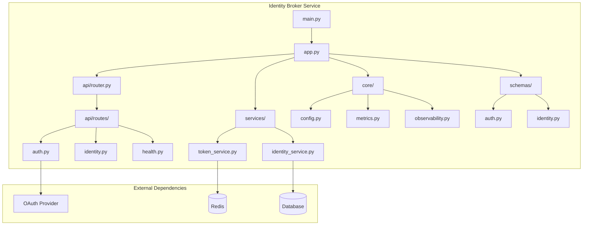
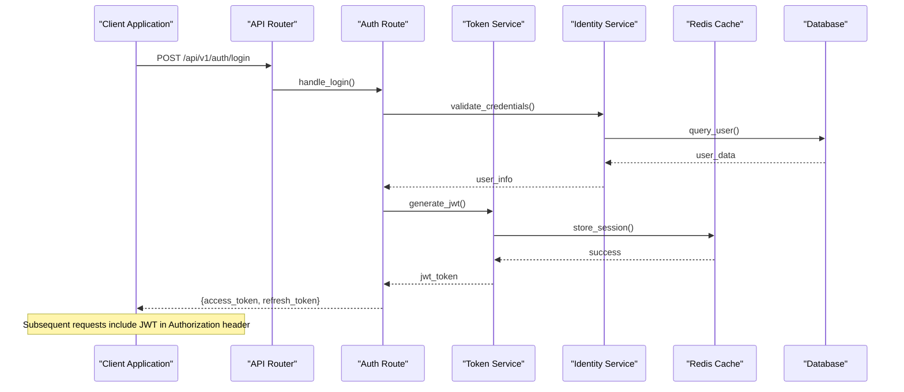
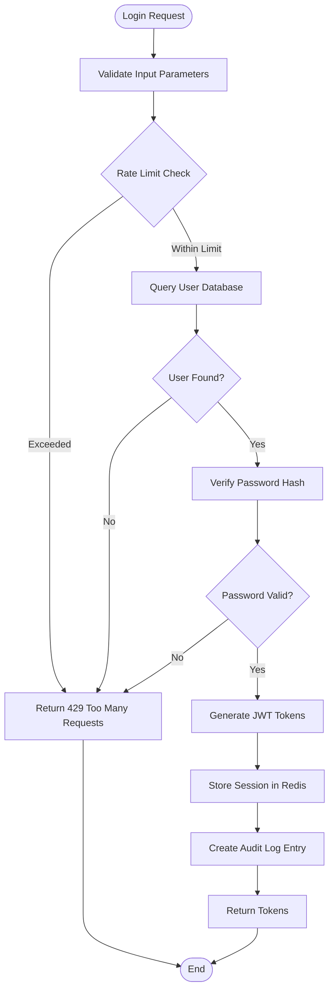
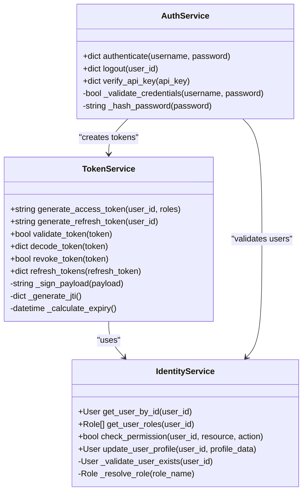
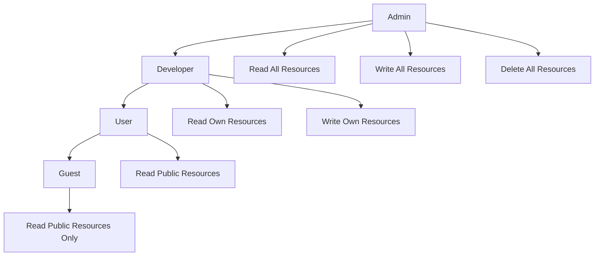
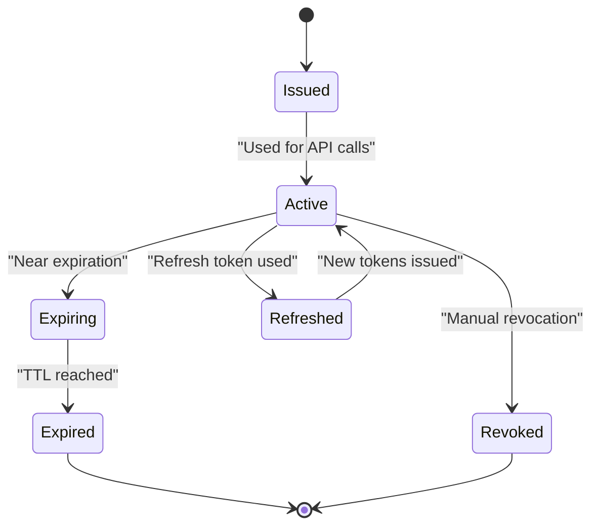

# API Endpoints and Integration

<cite>
**Referenced Files in This Document**
- [main.py](file://products/identity-broker/src/identity_service/main.py)
- [app.py](file://products/identity-broker/src/identity_service/app.py)
- [router.py](file://products/identity-broker/src/identity_service/api/router.py)
- [auth.py](file://products/identity-broker/src/identity_service/api/routes/auth.py)
- [identity.py](file://products/identity-broker/src/identity_service/api/routes/identity.py)
- [health.py](file://products/identity-broker/src/identity_service/api/routes/health.py)
- [config.py](file://products/identity-broker/src/identity_service/core/config.py)
- [token_service.py](file://products/identity-broker/src/identity_service/services/token_service.py)
- [identity_service.py](file://products/identity-broker/src/identity_service/services/identity_service.py)
- [auth.py](file://products/identity-broker/src/identity_service/schemas/auth.py)
- [identity.py](file://products/identity-broker/src/identity_service/schemas/identity.py)
</cite>

## Table of Contents
1. [Introduction](#introduction)
2. [Project Structure](#project-structure)
3. [Core Components](#core-components)
4. [Architecture Overview](#architecture-overview)
5. [Detailed Component Analysis](#detailed-component-analysis)
6. [API Endpoints Reference](#api-endpoints-reference)
7. [Authentication and Authorization](#authentication-and-authorization)
8. [Token Management](#token-management)
9. [Identity Operations](#identity-operations)
10. [WebSocket Endpoints](#websocket-endpoints)
11. [API Versioning Strategy](#api-versioning-strategy)
12. [Rate Limiting and Security](#rate-limiting-and-security)
13. [Integration Examples](#integration-examples)
14. [Troubleshooting Guide](#troubleshooting-guide)
15. [Migration Guide](#migration-guide)
16. [Conclusion](#conclusion)

## Introduction

The Identity Broker Service is a core component of the Luban AIOPS platform that provides centralized authentication, authorization, and identity management capabilities. This service acts as a bridge between various platform components, managing user identities, issuing and validating tokens, and ensuring secure communication across the distributed system.

The service implements modern security practices including JWT token management, role-based access control (RBAC), and comprehensive audit logging. It supports multiple authentication flows including OAuth 2.0, API keys, and service-to-service authentication patterns.

## Project Structure

The Identity Broker Service follows a modular architecture with clear separation of concerns:



**Diagram sources**
- [main.py:1-50](file://products/identity-broker/src/identity_service/main.py#L1-L50)
- [app.py:1-100](file://products/identity-broker/src/identity_service/app.py#L1-L100)
- [router.py:1-80](file://products/identity-broker/src/identity_service/api/router.py#L1-L80)

**Section sources**
- [main.py:1-50](file://products/identity-broker/src/identity_service/main.py#L1-L50)
- [app.py:1-100](file://products/identity-broker/src/identity_service/app.py#L1-L100)

## Core Components

The Identity Broker Service consists of several key components that work together to provide comprehensive identity management:

### Authentication Service
Handles user authentication, login/logout operations, and credential validation. Supports multiple authentication methods including username/password, OAuth 2.0, and API key authentication.

### Token Management Service
Manages the lifecycle of authentication tokens including JWT creation, validation, refresh, and revocation. Implements token caching and rotation strategies.

### Identity Service
Provides identity-related operations such as user profile management, role assignment, and permission checking. Maintains the relationship between users, roles, and permissions.

### Health Check Service
Monitors service health and readiness, providing endpoints for load balancers and orchestration systems.

**Section sources**
- [auth.py:1-150](file://products/identity-broker/src/identity_service/api/routes/auth.py#L1-L150)
- [token_service.py:1-200](file://products/identity-broker/src/identity_service/services/token_service.py#L1-L200)
- [identity_service.py:1-180](file://products/identity-broker/src/identity_service/services/identity_service.py#L1-L180)
- [health.py:1-100](file://products/identity-broker/src/identity_service/api/routes/health.py#L1-L100)

## Architecture Overview

The Identity Broker Service follows a layered architecture pattern with clear separation between API routes, business logic, and data access layers:



**Diagram sources**
- [router.py:1-80](file://products/identity-broker/src/identity_service/api/router.py#L1-L80)
- [auth.py:1-150](file://products/identity-broker/src/identity_service/api/routes/auth.py#L1-L150)
- [token_service.py:1-200](file://products/identity-broker/src/identity_service/services/token_service.py#L1-L200)
- [identity_service.py:1-180](file://products/identity-broker/src/identity_service/services/identity_service.py#L1-L180)

## Detailed Component Analysis

### Authentication Flow Analysis

The authentication process involves multiple steps to ensure security and performance:



**Diagram sources**
- [auth.py:1-150](file://products/identity-broker/src/identity_service/api/routes/auth.py#L1-L150)
- [identity_service.py:1-180](file://products/identity-broker/src/identity_service/services/identity_service.py#L1-L180)

### Token Management Analysis

The token management system handles JWT creation, validation, and refresh operations:



**Diagram sources**
- [token_service.py:1-200](file://products/identity-broker/src/identity_service/services/token_service.py#L1-L200)
- [identity_service.py:1-180](file://products/identity-broker/src/identity_service/services/identity_service.py#L1-L180)
- [auth.py:1-150](file://products/identity-broker/src/identity_service/api/routes/auth.py#L1-L150)

**Section sources**
- [token_service.py:1-200](file://products/identity-broker/src/identity_service/services/token_service.py#L1-L200)
- [identity_service.py:1-180](file://products/identity-broker/src/identity_service/services/identity_service.py#L1-L180)

## API Endpoints Reference

### Authentication Endpoints

#### Login Endpoint
- **Method**: POST
- **URL**: `/api/v1/auth/login`
- **Description**: Authenticates a user and returns access and refresh tokens
- **Authentication**: None (public endpoint)
- **Rate Limiting**: 5 requests per minute per IP address

**Request Schema**:
```json
{
  "username": "string (required)",
  "password": "string (required)",
  "remember_me": "boolean (optional, default: false)"
}
```

**Response Schema**:
```json
{
  "access_token": "string (JWT)",
  "refresh_token": "string (JWT)",
  "expires_in": "integer (seconds)",
  "token_type": "string (bearer)",
  "user_id": "string",
  "roles": ["string"]
}
```

**Error Responses**:
- `401 Unauthorized`: Invalid credentials
- `429 Too Many Requests`: Rate limit exceeded
- `500 Internal Server Error`: Server error

#### Logout Endpoint
- **Method**: POST
- **URL**: `/api/v1/auth/logout`
- **Description**: Invalidates user session and tokens
- **Authentication**: Required (Bearer token)
- **Rate Limiting**: 10 requests per minute per user

**Request Headers**:
```
Authorization: Bearer <access_token>
```

**Response Schema**:
```json
{
  "message": "Successfully logged out",
  "status": "success"
}
```

#### Refresh Token Endpoint
- **Method**: POST
- **URL**: `/api/v1/auth/refresh`
- **Description**: Issues new access token using refresh token
- **Authentication**: Required (refresh token in body)
- **Rate Limiting**: 10 requests per minute per user

**Request Schema**:
```json
{
  "refresh_token": "string (required)"
}
```

**Response Schema**:
```json
{
  "access_token": "string (JWT)",
  "expires_in": "integer (seconds)",
  "token_type": "string (bearer)"
}
```

### Identity Management Endpoints

#### Get User Profile
- **Method**: GET
- **URL**: `/api/v1/identity/profile`
- **Description**: Retrieves current user's profile information
- **Authentication**: Required (Bearer token)
- **Rate Limiting**: 30 requests per minute per user

**Request Headers**:
```
Authorization: Bearer <access_token>
```

**Response Schema**:
```json
{
  "user_id": "string",
  "username": "string",
  "email": "string",
  "roles": ["string"],
  "permissions": ["string"],
  "created_at": "timestamp",
  "updated_at": "timestamp"
}
```

#### Update User Profile
- **Method**: PUT
- **URL**: `/api/v1/identity/profile`
- **Description**: Updates current user's profile information
- **Authentication**: Required (Bearer token)
- **Rate Limiting**: 5 requests per minute per user

**Request Schema**:
```json
{
  "email": "string (optional)",
  "display_name": "string (optional)",
  "preferences": "object (optional)"
}
```

#### List Users (Admin Only)
- **Method**: GET
- **URL**: `/api/v1/identity/users`
- **Description**: Lists all users with pagination support
- **Authentication**: Required (Bearer token with admin role)
- **Rate Limiting**: 20 requests per minute per admin user

**Query Parameters**:
- `page`: integer (default: 1)
- `per_page`: integer (default: 20, max: 100)
- `role`: string (optional filter by role)
- `search`: string (optional search by username or email)

**Response Schema**:
```json
{
  "users": [
    {
      "user_id": "string",
      "username": "string",
      "email": "string",
      "roles": ["string"],
      "created_at": "timestamp"
    }
  ],
  "total": "integer",
  "page": "integer",
  "per_page": "integer"
}
```

### Health Check Endpoints

#### Health Check
- **Method**: GET
- **URL**: `/api/v1/health`
- **Description**: Returns service health status
- **Authentication**: None (public endpoint)
- **Rate Limiting**: 60 requests per minute

**Response Schema**:
```json
{
  "status": "healthy",
  "version": "string",
  "uptime": "integer (seconds)",
  "dependencies": {
    "database": "connected",
    "redis": "connected",
    "oauth_provider": "available"
  }
}
```

**Section sources**
- [auth.py:1-150](file://products/identity-broker/src/identity_service/api/routes/auth.py#L1-L150)
- [identity.py:1-200](file://products/identity-broker/src/identity_service/api/routes/identity.py#L1-L200)
- [health.py:1-100](file://products/identity-broker/src/identity_service/api/routes/health.py#L1-L100)

## Authentication and Authorization

### Supported Authentication Methods

The Identity Broker Service supports multiple authentication methods:

1. **JWT Bearer Tokens**: Primary method for API authentication
2. **API Keys**: For service-to-service communication
3. **OAuth 2.0**: For third-party integrations
4. **Mutual TLS**: For high-security environments

### JWT Token Format

Access tokens follow the JWT specification with custom claims:

```json
{
  "alg": "RS256",
  "typ": "JWT",
  "kid": "key-id",
  "iss": "identity-broker",
  "sub": "user-id",
  "aud": "platform-services",
  "exp": 1703097600,
  "iat": 1703094000,
  "jti": "unique-token-id",
  "roles": ["user", "admin"],
  "permissions": ["read", "write", "delete"],
  "scope": "openid profile email"
}
```

### Role-Based Access Control (RBAC)

The service implements a hierarchical RBAC system:



**Diagram sources**
- [identity_service.py:1-180](file://products/identity-broker/src/identity_service/services/identity_service.py#L1-L180)

### Permission Matrix

| Resource | Action | Guest | User | Developer | Admin |
|----------|--------|-------|------|-----------|-------|
| /auth/* | POST | ✓ | ✓ | ✓ | ✓ |
| /identity/profile | GET | ✗ | ✓ | ✓ | ✓ |
| /identity/profile | PUT | ✗ | ✓ | ✓ | ✓ |
| /identity/users | GET | ✗ | ✗ | ✗ | ✓ |
| /identity/users | DELETE | ✗ | ✗ | ✗ | ✓ |

**Section sources**
- [auth.py:1-150](file://products/identity-broker/src/identity_service/api/routes/auth.py#L1-L150)
- [identity_service.py:1-180](file://products/identity-broker/src/identity_service/services/identity_service.py#L1-L180)

## Token Management

### Token Lifecycle

The token management system follows a strict lifecycle:

1. **Issuance**: Tokens are generated upon successful authentication
2. **Validation**: Each request validates the presented token
3. **Refresh**: Refresh tokens allow obtaining new access tokens
4. **Revocation**: Tokens can be revoked immediately when needed
5. **Expiration**: Tokens automatically expire after configured duration

### Token Storage

- **Access Tokens**: Stateless JWTs stored client-side
- **Refresh Tokens**: Stateful tokens stored in Redis with TTL
- **Blacklist**: Revoked tokens tracked in Redis set

### Token Rotation

The service implements automatic token rotation for enhanced security:



**Diagram sources**
- [token_service.py:1-200](file://products/identity-broker/src/identity_service/services/token_service.py#L1-L200)

**Section sources**
- [token_service.py:1-200](file://products/identity-broker/src/identity_service/services/token_service.py#L1-L200)

## Identity Operations

### User Management

The identity service provides comprehensive user management capabilities:

#### User Creation
- **Method**: POST
- **URL**: `/api/v1/identity/users`
- **Authentication**: Admin required
- **Request Schema**:
```json
{
  "username": "string (required)",
  "email": "string (required)",
  "password": "string (required)",
  "roles": ["string (optional)"],
  "metadata": "object (optional)"
}
```

#### User Deletion
- **Method**: DELETE
- **URL**: `/api/v1/identity/users/{user_id}`
- **Authentication**: Admin required
- **Path Parameters**: `user_id` (string)

#### Role Assignment
- **Method**: PUT
- **URL**: `/api/v1/identity/users/{user_id}/roles`
- **Authentication**: Admin required
- **Request Schema**:
```json
{
  "roles": ["string (required)"]
}
```

### Permission Checking

The service provides granular permission checking:

```python
# Example permission check flow
def check_permission(user_id, resource, action):
    user = get_user_by_id(user_id)
    if not user:
        return False
    
    # Check direct permissions
    if has_direct_permission(user, resource, action):
        return True
    
    # Check role-based permissions
    for role in user.roles:
        if role_has_permission(role, resource, action):
            return True
    
    return False
```

**Section sources**
- [identity.py:1-200](file://products/identity-broker/src/identity_service/api/routes/identity.py#L1-L200)
- [identity_service.py:1-180](file://products/identity-broker/src/identity_service/services/identity_service.py#L1-L180)

## WebSocket Endpoints

### Real-time Authentication Events

The Identity Broker Service provides WebSocket endpoints for real-time authentication events:

#### Connection Endpoint
- **Protocol**: WebSocket
- **URL**: `wss://identity-broker/api/v1/ws/auth`
- **Authentication**: Requires valid JWT in initial handshake

#### Event Types

| Event | Direction | Description |
|-------|-----------|-------------|
| `auth.success` | Server → Client | Authentication successful |
| `auth.failure` | Server → Client | Authentication failed |
| `token.refreshed` | Server → Client | New tokens issued |
| `session.expired` | Server → Client | Session expired |
| `user.updated` | Server → Client | User profile updated |

#### WebSocket Message Format

```json
{
  "event": "auth.success",
  "data": {
    "user_id": "string",
    "timestamp": "ISO 8601",
    "session_id": "string"
  },
  "metadata": {
    "request_id": "string",
    "correlation_id": "string"
  }
}
```

**Section sources**
- [auth.py:1-150](file://products/identity-broker/src/identity_service/api/routes/auth.py#L1-L150)

## API Versioning Strategy

### Versioning Approach

The service uses URL path versioning for backward compatibility:

- **Current Version**: `/api/v1/`
- **Future Versions**: `/api/v2/`, `/api/v3/`, etc.

### Version Lifecycle

1. **Stable**: Fully supported with no breaking changes
2. **Deprecated**: Still functional but scheduled for removal
3. **Retired**: Removed from service

### Migration Strategy

When introducing breaking changes:

1. Maintain old version during transition period
2. Provide migration guides and tools
3. Set deprecation warnings in responses
4. Monitor usage of deprecated endpoints
5. Remove deprecated versions after grace period

**Section sources**
- [router.py:1-80](file://products/identity-broker/src/identity_service/api/router.py#L1-L80)

## Rate Limiting and Security

### Rate Limiting Policies

| Endpoint Category | Limit | Window | Scope |
|-------------------|-------|--------|-------|
| Authentication | 5 req/min | Per IP | Prevent brute force |
| Token Refresh | 10 req/min | Per user | Prevent abuse |
| Identity Queries | 30 req/min | Per user | Prevent enumeration |
| Health Checks | 60 req/min | Global | Monitoring |

### Security Headers

The service sets important security headers:

```http
X-Content-Type-Options: nosniff
X-Frame-Options: DENY
X-XSS-Protection: 1; mode=block
Strict-Transport-Security: max-age=31536000; includeSubDomains
Content-Security-Policy: default-src 'self'
```

### Audit Logging

All authentication and identity operations are logged:

```json
{
  "timestamp": "ISO 8601",
  "event_type": "authentication",
  "action": "login_success",
  "user_id": "string",
  "ip_address": "string",
  "user_agent": "string",
  "result": "success",
  "metadata": {}
}
```

**Section sources**
- [config.py:1-100](file://products/identity-broker/src/identity_service/core/config.py#L1-L100)
- [auth.py:1-150](file://products/identity-broker/src/identity_service/api/routes/auth.py#L1-L150)

## Integration Examples

### Python Requests Example

```python
import requests
import json

# Base URL configuration
BASE_URL = "https://identity-broker.example.com/api/v1"

# Login and get tokens
def login(username, password):
    response = requests.post(
        f"{BASE_URL}/auth/login",
        json={
            "username": username,
            "password": password
        }
    )
    response.raise_for_status()
    return response.json()

# Make authenticated request
def get_user_profile(access_token):
    headers = {
        "Authorization": f"Bearer {access_token}",
        "Content-Type": "application/json"
    }
    response = requests.get(
        f"{BASE_URL}/identity/profile",
        headers=headers
    )
    response.raise_for_status()
    return response.json()

# Usage example
if __name__ == "__main__":
    # Authenticate
    auth_response = login("john.doe", "secure_password")
    access_token = auth_response["access_token"]
    
    # Get user profile
    profile = get_user_profile(access_token)
    print(f"User: {profile['username']}")
```

### JavaScript Fetch Example

```javascript
// Configuration
const BASE_URL = 'https://identity-broker.example.com/api/v1';

// Login function
async function login(username, password) {
    const response = await fetch(`${BASE_URL}/auth/login`, {
        method: 'POST',
        headers: {
            'Content-Type': 'application/json',
        },
        body: JSON.stringify({
            username: username,
            password: password
        })
    });
    
    if (!response.ok) {
        throw new Error(`Login failed: ${response.status}`);
    }
    
    return await response.json();
}

// Get user profile
async function getUserProfile(token) {
    const response = await fetch(`${BASE_URL}/identity/profile`, {
        method: 'GET',
        headers: {
            'Authorization': `Bearer ${token}`,
            'Content-Type': 'application/json'
        }
    });
    
    if (!response.ok) {
        throw new Error(`Failed to get profile: ${response.status}`);
    }
    
    return await response.json();
}

// Usage example
async function main() {
    try {
        // Authenticate
        const authResponse = await login('john.doe', 'secure_password');
        const accessToken = authResponse.access_token;
        
        // Get user profile
        const profile = await getUserProfile(accessToken);
        console.log(`User: ${profile.username}`);
    } catch (error) {
        console.error('Error:', error.message);
    }
}

main();
```

### Curl Examples

```bash
# Login and get tokens
curl -X POST https://identity-broker.example.com/api/v1/auth/login \
  -H "Content-Type: application/json" \
  -d '{
    "username": "john.doe",
    "password": "secure_password"
  }'

# Get user profile with token
curl -X GET https://identity-broker.example.com/api/v1/identity/profile \
  -H "Authorization: Bearer YOUR_ACCESS_TOKEN" \
  -H "Content-Type: application/json"

# Refresh token
curl -X POST https://identity-broker.example.com/api/v1/auth/refresh \
  -H "Content-Type: application/json" \
  -d '{
    "refresh_token": "YOUR_REFRESH_TOKEN"
  }'

# Health check
curl -X GET https://identity-broker.example.com/api/v1/health
```

**Section sources**
- [auth.py:1-150](file://products/identity-broker/src/identity_service/api/routes/auth.py#L1-L150)
- [identity.py:1-200](file://products/identity-broker/src/identity_service/api/routes/identity.py#L1-L200)

## Troubleshooting Guide

### Common Authentication Issues

#### 401 Unauthorized Errors
- **Cause**: Missing or invalid Authorization header
- **Solution**: Ensure JWT token is included in Authorization header
- **Debug**: Check token expiration and validity

#### 403 Forbidden Errors
- **Cause**: Insufficient permissions for requested resource
- **Solution**: Verify user roles and permissions
- **Debug**: Check role assignments and permission matrix

#### 429 Too Many Requests
- **Cause**: Rate limit exceeded
- **Solution**: Implement exponential backoff
- **Debug**: Monitor rate limit headers

### Performance Issues

#### Slow Authentication Response
- **Check**: Database connection pool size
- **Check**: Redis connectivity and latency
- **Check**: External OAuth provider response time

#### Memory Leaks
- **Monitor**: Token cache size in Redis
- **Monitor**: Active session count
- **Monitor**: Audit log growth rate

### Debugging Techniques

#### Enable Debug Logging
```python
import logging
logging.basicConfig(level=logging.DEBUG)
```

#### Check Service Health
```bash
curl -v https://identity-broker.example.com/api/v1/health
```

#### Monitor Metrics
```bash
curl -s https://identity-broker.example.com/metrics | grep identity_broker
```

**Section sources**
- [health.py:1-100](file://products/identity-broker/src/identity_service/api/routes/health.py#L1-L100)
- [config.py:1-100](file://products/identity-broker/src/identity_service/core/config.py#L1-L100)

## Migration Guide

### From v1 to v2 (Planned)

#### Breaking Changes
1. **Token Format**: Enhanced JWT claims structure
2. **API Paths**: Consolidated endpoint structure
3. **Authentication**: Mandatory mTLS for service accounts

#### Migration Steps
1. **Update SDK**: Upgrade to latest client library
2. **Modify Headers**: Add new required headers
3. **Handle New Fields**: Update response parsing
4. **Test Thoroughly**: Validate all integration points

#### Timeline
- **Phase 1**: v1 remains stable (6 months)
- **Phase 2**: v2 available alongside v1 (12 months)
- **Phase 3**: v1 deprecated (6 months)
- **Phase 4**: v1 removed (permanent)

**Section sources**
- [router.py:1-80](file://products/identity-broker/src/identity_service/api/router.py#L1-L80)

## Conclusion

The Identity Broker Service provides a robust, secure, and scalable foundation for identity management in the Luban AIOPS platform. With comprehensive authentication, authorization, and token management capabilities, it enables secure communication between all platform components while maintaining flexibility for future enhancements.

Key strengths include:
- **Security**: Industry-standard authentication and authorization
- **Scalability**: Stateless design with efficient caching
- **Flexibility**: Multiple authentication methods and protocols
- **Observability**: Comprehensive logging and monitoring
- **Maintainability**: Clean architecture with clear separation of concerns

For optimal integration, clients should implement proper error handling, retry logic with exponential backoff, and comprehensive logging. Regular security audits and performance monitoring are recommended to maintain service quality and security posture.