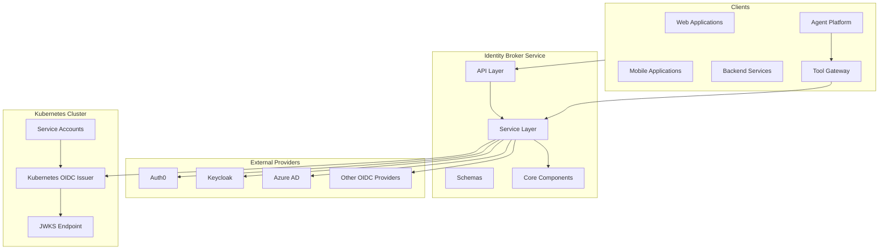
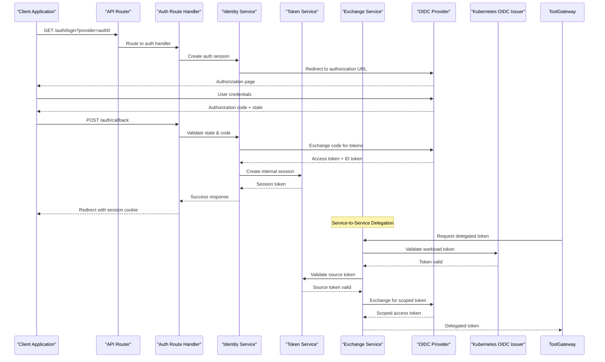
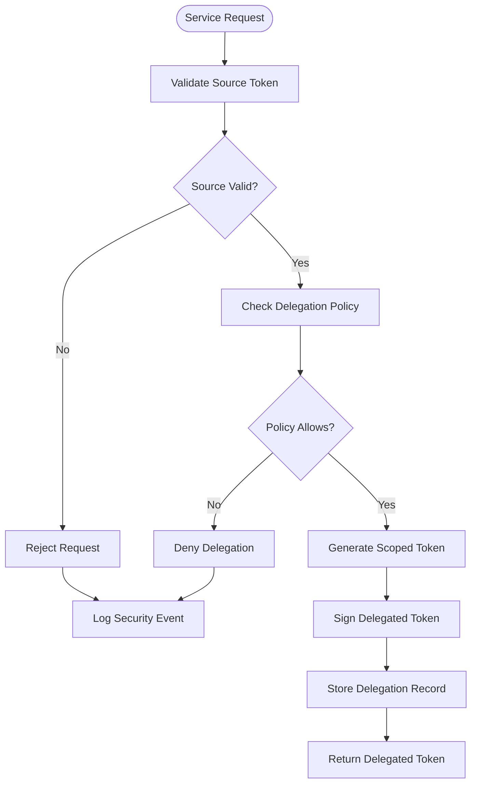
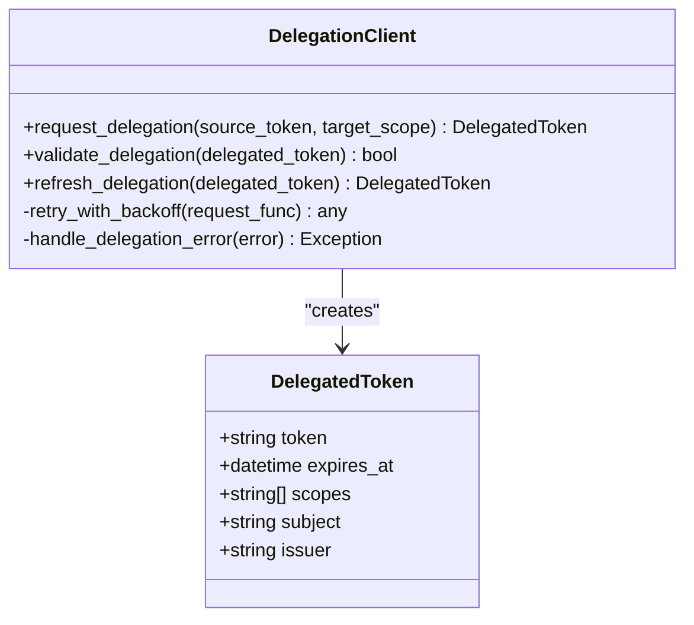
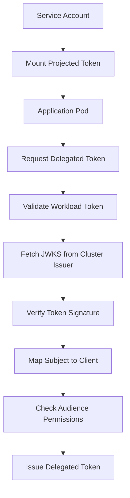
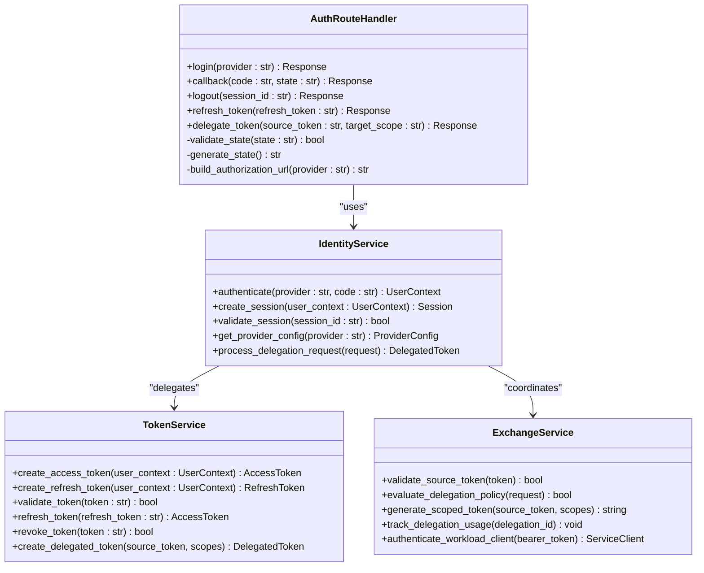
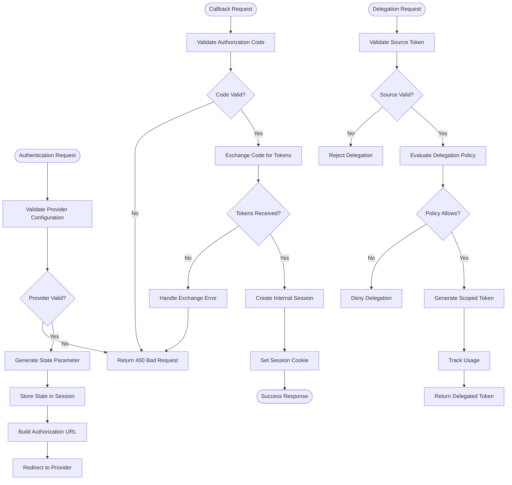
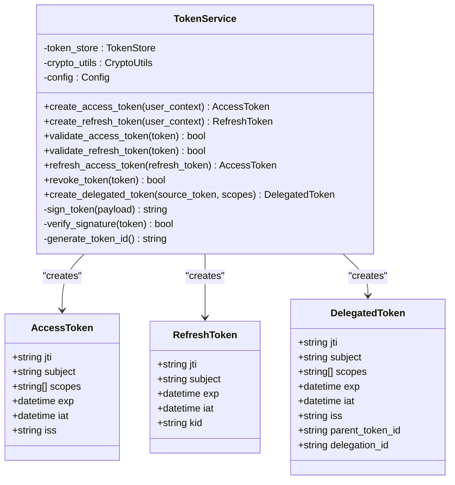
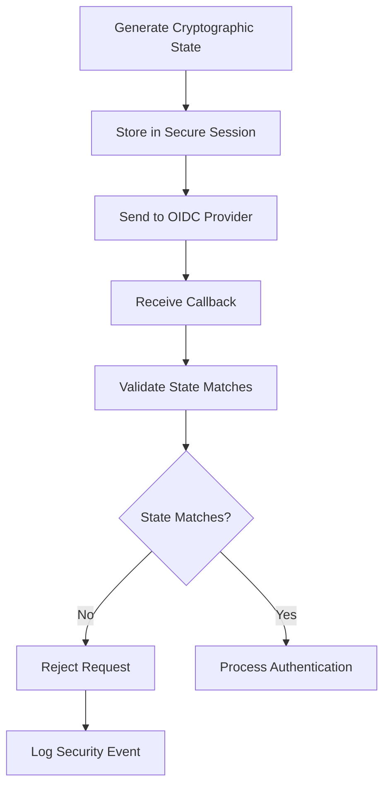

# Authentication Flow and OIDC Integration

<cite>
**Referenced Files in This Document**
- [auth.py](file://products/identity-broker/src/identity_service/api/routes/auth.py)
- [identity_service.py](file://products/identity-broker/src/identity_service/services/identity_service.py)
- [token_service.py](file://products/identity-broker/src/identity_service/services/token_service.py)
- [exchange_service.py](file://products/identity-broker/src/identity_service/services/exchange_service.py)
- [config.py](file://products/identity-broker/src/identity_service/core/config.py)
- [auth.py](file://products/identity-broker/src/identity_service/schemas/auth.py)
- [routes.py](file://products/identity-broker/src/identity_service/api/router.py)
- [app.py](file://products/identity-broker/src/identity_service/app.py)
- [main.py](file://products/identity-broker/src/identity_service/main.py)
- [delegation_client.py](file://products/tool-gateway/src/api_gateway/services/delegation_client.py)
- [SPEC-007.md](file://docs/specs/SPEC-007-tool-execution-framework/spec.md)
</cite>

## Update Summary
**Changes Made**
- Added comprehensive documentation for broker-mediated token delegation system
- Updated authentication flow to include service-to-service identity support
- Enhanced token exchange mechanisms for agent-platform tool calls
- Added new sections covering delegation client implementation and SPEC-007 compliance
- Updated architecture diagrams to reflect the enhanced authentication flow
- **Updated**: Extended authentication flow to support both traditional static secrets and new Kubernetes workload identity tokens
- **Updated**: Added workload token validation against cluster OIDC issuer with subject-to-client mapping
- **Updated**: Enhanced configuration system with workload identity environment variables

## Table of Contents
1. [Introduction](#introduction)
2. [Project Structure](#project-structure)
3. [Core Components](#core-components)
4. [Architecture Overview](#architecture-overview)
5. [Broker-Mediated Token Delegation System](#broker-mediated-token-delegation-system)
6. [Kubernetes Workload Identity Support](#kubernetes-workload-identity-support)
7. [Detailed Component Analysis](#detailed-component-analysis)
8. [OIDC Provider Configuration](#oidc-provider-configuration)
9. [Authentication Endpoints](#authentication-endpoints)
10. [Security Considerations](#security-considerations)
11. [Practical Examples](#practical-examples)
12. [Troubleshooting Guide](#troubleshooting-guide)
13. [Conclusion](#conclusion)

## Introduction

The Identity Broker Service serves as a centralized authentication and authorization hub within the platform architecture. It implements OpenID Connect (OIDC) protocols to provide secure authentication flows, token management, and identity federation across multiple external identity providers. The service acts as an intermediary between client applications and various OIDC-compliant identity providers, abstracting provider-specific complexities while maintaining security best practices.

This documentation covers the complete authentication lifecycle from initial request to token issuance, including authorization code flow, implicit grant support, state parameter validation, nonce handling, and redirect URI validation. **Updated**: The service now includes a broker-mediated token delegation system that enables secure service-to-service identity for agent-platform tool calls, completing SPEC-007 requirements. **Enhanced**: The authentication flow now supports both traditional static secrets and new Kubernetes workload identity tokens, allowing services to authenticate using projected service-account tokens validated against the cluster's OIDC issuer.

## Project Structure

The Identity Broker Service follows a modular architecture with clear separation of concerns:



**Diagram sources**
- [app.py](file://products/identity-broker/src/identity_service/app.py)
- [main.py](file://products/identity-broker/src/identity_service/main.py)
- [exchange_service.py](file://products/identity-broker/src/identity_service/services/exchange_service.py)

The service is organized into distinct layers:
- **API Layer**: HTTP endpoints and route handlers
- **Service Layer**: Business logic and OIDC protocol implementation
- **Schema Layer**: Request/response data validation
- **Core Layer**: Configuration, metrics, and observability

**Section sources**
- [app.py](file://products/identity-broker/src/identity_service/app.py)
- [main.py](file://products/identity-broker/src/identity_service/main.py)

## Core Components

The Identity Broker Service consists of several key components that work together to provide comprehensive authentication functionality:

### Authentication Routes
Handles all HTTP endpoints related to authentication flows, including authorization requests, callback processing, and token exchange.

### Identity Service
Manages the core authentication logic, including provider configuration, session management, and user context handling.

### Token Service
Responsible for token lifecycle management, including creation, validation, refresh, and revocation.

### Exchange Service
**New**: Manages token delegation and exchange operations for service-to-service communication patterns, supporting both static credentials and workload identity tokens.

### Configuration Management
Centralized configuration for OIDC providers, security settings, and service parameters, including workload identity configuration.

**Section sources**
- [auth.py](file://products/identity-broker/src/identity_service/api/routes/auth.py)
- [identity_service.py](file://products/identity-broker/src/identity_service/services/identity_service.py)
- [token_service.py](file://products/identity-broker/src/identity_service/services/token_service.py)
- [exchange_service.py](file://products/identity-broker/src/identity_service/services/exchange_service.py)
- [config.py](file://products/identity-broker/src/identity_service/core/config.py)

## Architecture Overview

The authentication architecture follows a layered approach with clear separation between presentation, business logic, and data access layers:



**Diagram sources**
- [auth.py](file://products/identity-broker/src/identity_service/api/routes/auth.py)
- [identity_service.py](file://products/identity-broker/src/identity_service/services/identity_service.py)
- [token_service.py](file://products/identity-broker/src/identity_service/services/token_service.py)
- [exchange_service.py](file://products/identity-broker/src/identity_service/services/exchange_service.py)

The architecture ensures:
- **Separation of Concerns**: Each component has a specific responsibility
- **State Management**: Secure handling of authentication state
- **Provider Abstraction**: Support for multiple OIDC providers
- **Security First**: Comprehensive validation and error handling
- **Service Delegation**: Secure token delegation for service-to-service communication
- **Workload Identity**: Native Kubernetes service account authentication

## Broker-Mediated Token Delegation System

**New Section**: The Identity Broker Service now implements a comprehensive token delegation system that enables secure service-to-service identity for agent-platform tool calls, fulfilling SPEC-007 requirements.

### Delegation Architecture



**Diagram sources**
- [exchange_service.py](file://products/identity-broker/src/identity_service/services/exchange_service.py)
- [delegation_client.py](file://products/tool-gateway/src/api_gateway/services/delegation_client.py)

### Key Features

#### Token Scope Inheritance
- **Hierarchical Scopes**: Delegated tokens inherit and restrict parent scopes
- **Time-Bound Delegation**: Automatic expiration based on source token lifetime
- **Usage Tracking**: Complete audit trail for all delegation operations

#### Policy Enforcement
- **Context-Aware Policies**: Delegation decisions based on service identity and request context
- **Dynamic Scoping**: Runtime scope adjustment based on policy evaluation
- **Rate Limiting**: Protection against abuse through delegation limits

#### Security Controls
- **Token Binding**: Delegated tokens bound to specific service identities
- **Replay Prevention**: Unique delegation identifiers prevent token reuse
- **Revocation Support**: Immediate invalidation of compromised delegations

### Delegation Client Implementation

The Tool Gateway integrates with the Identity Broker's delegation system through a dedicated client:



**Diagram sources**
- [delegation_client.py](file://products/tool-gateway/src/api_gateway/services/delegation_client.py)

### SPEC-007 Compliance

The delegation system fully implements SPEC-007 requirements for tool execution framework:

- **Standardized Interfaces**: Consistent API contracts for token delegation
- **Error Handling**: Comprehensive error responses with actionable information
- **Observability**: Built-in metrics and logging for delegation operations
- **Extensibility**: Plugin architecture for custom delegation policies

**Section sources**
- [exchange_service.py](file://products/identity-broker/src/identity_service/services/exchange_service.py)
- [delegation_client.py](file://products/tool-gateway/src/api_gateway/services/delegation_client.py)
- [SPEC-007.md](file://docs/specs/SPEC-007-tool-execution-framework/spec.md)

## Kubernetes Workload Identity Support

**New Section**: The Identity Broker Service now supports Kubernetes workload identity tokens, enabling services to authenticate using projected service-account tokens without managing static secrets.

### Workload Identity Architecture



**Diagram sources**
- [exchange_service.py](file://products/identity-broker/src/identity_service/services/exchange_service.py)
- [config.py](file://products/identity-broker/src/identity_service/core/config.py)

### Workload Token Validation Process

The workload identity validation process involves several security checks:

#### 1. Token Discovery and JWKS Resolution
- **OIDC Discovery**: Automatically discovers the cluster's OIDC issuer configuration
- **JWKS Caching**: Caches signing keys per issuer URL for performance
- **Network Resilience**: Handles network failures gracefully with timeouts

#### 2. Token Verification
- **Signature Validation**: Verifies token signature using cluster's public keys
- **Issuer Validation**: Ensures token is issued by the configured cluster OIDC issuer
- **Audience Validation**: Validates token audience matches configured workload audience
- **Required Claims**: Enforces presence of exp, iss, sub, and aud claims

#### 3. Subject Mapping and Authorization
- **Subject Registration**: Maps workload subjects to registered clients
- **Audience Allow-list**: Enforces audience permissions per client
- **Service Identity Binding**: Binds delegated tokens to specific service identities

### Configuration for Workload Identity

Workload identity is configured through environment variables:

| Environment Variable | Type | Required | Description | Example |
|---------------------|------|----------|-------------|---------|
| `IDENTITY_WORKLOAD_ISSUER_URL` | string | No | Kubernetes OIDC issuer URL | `https://kubernetes.default.svc.cluster.local` |
| `IDENTITY_WORKLOAD_AUDIENCE` | string | No | Expected audience for workload tokens | `identity-broker` |
| `IDENTITY_WORKLOAD_CLIENTS` | string | No | Comma-separated workload subject mappings | `system:serviceaccount:ns:saname=client-id:aud1|aud2` |

### Workload Client Configuration Format

The `IDENTITY_WORKLOAD_CLIENTS` variable uses a specific format:
- **Format**: `subject=client_id:aud1|aud2`
- **Subject**: Full Kubernetes service account subject (e.g., `system:serviceaccount:namespace:serviceaccount`)
- **Client ID**: Registered client identifier
- **Audiences**: Pipe-separated list of allowed audiences

Example configuration:
```bash
IDENTITY_WORKLOAD_CLIENTS="system:serviceaccount:dev-luban-aiops:api-gateway=tool-gateway:tool-gateway,system:serviceaccount:prod-luban-aiops:agent-platform=agent-platform:agent-platform|tool-gateway"
```

### Security Benefits of Workload Identity

#### Elimination of Static Secrets
- **No Secret Management**: Eliminates need to manage and rotate service account secrets
- **Automatic Rotation**: Kubernetes automatically rotates projected tokens
- **Reduced Attack Surface**: Minimizes secret exposure and management complexity

#### Enhanced Security Model
- **Cluster-Integrated**: Leverages Kubernetes' built-in security model
- **Namespace Isolation**: Service accounts are isolated by namespace
- **RBAC Integration**: Works seamlessly with Kubernetes RBAC policies

#### Operational Simplicity
- **Zero Config Deployment**: Services can be deployed without additional secret configuration
- **Consistent Authentication**: Same authentication method across all services
- **Audit Trail**: Complete audit trail of service-to-service communications

**Section sources**
- [exchange_service.py](file://products/identity-broker/src/identity_service/services/exchange_service.py)
- [config.py](file://products/identity-broker/src/identity_service/core/config.py)

## Detailed Component Analysis

### Authentication Route Handler

The authentication route handler manages HTTP endpoints for the complete authentication lifecycle:



**Diagram sources**
- [auth.py](file://products/identity-broker/src/identity_service/api/routes/auth.py)
- [identity_service.py](file://products/identity-broker/src/identity_service/services/identity_service.py)
- [token_service.py](file://products/identity-broker/src/identity_service/services/token_service.py)
- [exchange_service.py](file://products/identity-broker/src/identity_service/services/exchange_service.py)

### Identity Service Implementation

The identity service orchestrates the authentication flow and manages provider interactions:



**Diagram sources**
- [identity_service.py](file://products/identity-broker/src/identity_service/services/identity_service.py)

### Token Service Architecture

The token service manages the complete token lifecycle with security-focused operations:



**Diagram sources**
- [token_service.py](file://products/identity-broker/src/identity_service/services/token_service.py)

**Section sources**
- [auth.py](file://products/identity-broker/src/identity_service/api/routes/auth.py)
- [identity_service.py](file://products/identity-broker/src/identity_service/services/identity_service.py)
- [token_service.py](file://products/identity-broker/src/identity_service/services/token_service.py)
- [exchange_service.py](file://products/identity-broker/src/identity_service/services/exchange_service.py)

## OIDC Provider Configuration

The Identity Broker Service supports multiple OIDC providers through a flexible configuration system. Each provider requires specific configuration parameters:

### Provider Configuration Schema

| Parameter | Type | Required | Description | Example |
|-----------|------|----------|-------------|---------|
| `issuer` | string | Yes | OIDC issuer URL | `https://auth0.example.com` |
| `client_id` | string | Yes | OAuth client identifier | `abc123def456` |
| `client_secret` | string | Yes | OAuth client secret | `secret_key_here` |
| `authorization_endpoint` | string | No | Custom authorization endpoint | `/authorize` |
| `token_endpoint` | string | No | Custom token endpoint | `/oauth/token` |
| `userinfo_endpoint` | string | No | Custom userinfo endpoint | `/userinfo` |
| `jwks_uri` | string | No | JWKS endpoint for token validation | `/jwks.json` |
| `scopes` | array | No | Requested scopes | `["openid", "profile", "email"]` |
| `redirect_uris` | array | Yes | Allowed redirect URIs | `["https://app.example.com/callback"]` |

### Supported Scopes

Common OIDC scopes supported by the service:

| Scope | Description | Usage |
|-------|-------------|--------|
| `openid` | Required for OIDC | Always included |
| `profile` | Basic profile information | Name, email, picture |
| `email` | Email address | Primary email verification |
| `offline_access` | Refresh token support | Long-lived sessions |
| `groups` | Group membership | Role-based access control |
| `tool:execute` | Tool execution permission | Agent-platform tool calls |
| `service:delegate` | Service delegation | Service-to-service identity |

### **Updated**: Workload Identity Configuration

For Kubernetes workload identity support, configure the following environment variables:

| Environment Variable | Type | Required | Description | Example |
|---------------------|------|----------|-------------|---------|
| `IDENTITY_WORKLOAD_ISSUER_URL` | string | No | Kubernetes OIDC issuer URL | `https://kubernetes.default.svc.cluster.local` |
| `IDENTITY_WORKLOAD_AUDIENCE` | string | No | Expected audience for workload tokens | `identity-broker` |
| `IDENTITY_WORKLOAD_CLIENTS` | string | No | Workload subject to client mappings | `system:serviceaccount:ns:saname=client-id:aud1|aud2` |

**Section sources**
- [config.py](file://products/identity-broker/src/identity_service/core/config.py)

## Authentication Endpoints

The Identity Broker Service exposes the following authentication endpoints:

### Authorization Code Flow

#### Login Endpoint
Initiates the authentication flow by redirecting users to the configured OIDC provider.

**Endpoint**: `GET /api/v1/auth/login`

**Response**: Login start response with authorization URL and state parameters

#### Callback Endpoint
Processes the authorization code response from the OIDC provider.

**Endpoint**: `POST /api/v1/auth/callback`

**Request Body**:
```json
{
  "code": "string",
  "code_verifier": "string",
  "redirect_uri": "string"
}
```

**Response**: Authenticated session with access token and identity

### Implicit Grant Flow

#### Implicit Login Endpoint
Supports direct token issuance without server-side session management.

**Endpoint**: `GET /api/v1/auth/login-url`

**Response**: Login URL with authorization parameters

### Token Management

#### Token Refresh Endpoint
Refreshes expired access tokens using refresh tokens.

**Endpoint**: `POST /api/v1/auth/refresh`

**Request Body**:
```json
{
  "refresh_token": "string"
}
```

**Response**: New authenticated session with refreshed tokens

#### Platform Token Endpoint
Issues platform tokens for service-to-service communication.

**Endpoint**: `POST /api/v1/auth/token`

**Request Body**:
```json
{
  "username": "string",
  "email": "string",
  "roles": ["string"],
  "groups": ["string"]
}
```

**Response**: Platform token with expiration time

### **Updated**: Token Delegation Endpoints

#### Token Delegation Endpoint
Enables service-to-service token delegation for agent-platform tool calls, supporting both static credentials and workload identity tokens.

**Endpoint**: `POST /api/v1/auth/exchange`

**Request Body**:
```json
{
  "subject_token": "string",
  "audience": "string"
}
```

**Authorization Header** (either):
- **Static Credentials**: `Basic base64(client_id:client_secret)`
- **Workload Identity**: `Bearer <kubernetes_projected_token>`

**Response**:
```json
{
  "access_token": "string",
  "token_type": "Bearer",
  "expires_in": 300
}
```

#### JWKS Endpoint
Provides public keys for token validation.

**Endpoint**: `GET /.well-known/jwks.json`

**Response**: JSON Web Key Set in RFC 7517 format

### Security Endpoints

#### Health Check Endpoint
Monitors service health and connectivity to OIDC providers.

**Endpoint**: `GET /health`

**Response**: Service status and provider connectivity

**Section sources**
- [auth.py](file://products/identity-broker/src/identity_service/api/routes/auth.py)
- [router.py](file://products/identity-broker/src/identity_service/api/router.py)

## Security Considerations

The Identity Broker Service implements comprehensive security measures to protect against common authentication vulnerabilities:

### State Parameter Validation

The service validates state parameters to prevent Cross-Site Request Forgery (CSRF) attacks:



**Diagram sources**
- [identity_service.py](file://products/identity-broker/src/identity_service/services/identity_service.py)

### Nonce Handling

For enhanced security, the service implements nonce validation when requested by clients:

- **Generation**: Cryptographically secure random nonce generation
- **Storage**: Secure storage in session state
- **Validation**: Strict comparison with returned nonce
- **Expiration**: Time-based nonce expiration policies

### Redirect URI Validation

The service enforces strict redirect URI validation:

- **Whitelist Approach**: Only pre-configured URIs are accepted
- **Pattern Matching**: Supports wildcard patterns for development
- **HTTPS Enforcement**: Requires HTTPS in production environments
- **Domain Validation**: Validates domain ownership and SSL certificates

### Token Security

Token handling follows industry best practices:

- **Signing**: All tokens are cryptographically signed
- **Encryption**: Sensitive claims are encrypted at rest
- **Short Lifespan**: Access tokens have short expiration times
- **Rotation**: Refresh tokens are rotated on use
- **Revocation**: Immediate token revocation capability

### **Updated**: Workload Identity Security Controls

#### Kubernetes Token Validation
- **Cluster Isser Validation**: Tokens must be issued by the configured Kubernetes OIDC issuer
- **JWKS Discovery**: Automatic discovery and caching of cluster signing keys
- **Audience Verification**: Tokens must have the correct audience claim
- **Required Claims**: Enforces presence of essential JWT claims (exp, iss, sub, aud)

#### Subject Mapping and Authorization
- **Registration Requirement**: Workload subjects must be explicitly registered
- **Audience Allow-lists**: Per-client audience restrictions enforced
- **Service Identity Binding**: Delegated tokens bound to specific service identities
- **Replay Attack Prevention**: Unique delegation IDs prevent token reuse

#### Policy Enforcement
- **Context-Aware Decisions**: Delegation policies consider service identity, request context, and time
- **Dynamic Scope Evaluation**: Real-time scope calculation based on policy rules
- **Rate Limiting**: Protection against excessive delegation requests
- **Audit Trail**: Complete logging of all delegation operations

**Section sources**
- [identity_service.py](file://products/identity-broker/src/identity_service/services/identity_service.py)
- [token_service.py](file://products/identity-broker/src/identity_service/services/token_service.py)
- [exchange_service.py](file://products/identity-broker/src/identity_service/services/exchange_service.py)

## Practical Examples

### Auth0 Configuration

Configure Auth0 as an OIDC provider:

```yaml
providers:
  auth0:
    issuer: "https://your-domain.auth0.com/"
    client_id: "${AUTH0_CLIENT_ID}"
    client_secret: "${AUTH0_CLIENT_SECRET}"
    scopes: ["openid", "profile", "email", "offline_access", "tool:execute"]
    redirect_uris:
      - "https://your-app.com/auth/callback"
      - "http://localhost:3000/auth/callback"
    custom_params:
      audience: "https://your-api.com"
```

### Keycloak Configuration

Set up Keycloak integration:

```yaml
providers:
  keycloak:
    issuer: "https://keycloak.example.com/realms/your-realm"
    client_id: "your-client-id"
    client_secret: "your-client-secret"
    scopes: ["openid", "profile", "email", "roles", "service:delegate"]
    redirect_uris:
      - "https://your-app.com/auth/callback"
    jwks_uri: "https://keycloak.example.com/realms/your-realm/protocol/openid-connect/certs"
```

### Azure AD Configuration

Configure Microsoft Azure Active Directory:

```yaml
providers:
  azure_ad:
    issuer: "https://login.microsoftonline.com/your-tenant-id/v2.0"
    client_id: "your-client-id"
    client_secret: "your-client-secret"
    scopes: ["openid", "profile", "User.Read", "offline_access", "tool:execute"]
    redirect_uris:
      - "https://your-app.com/auth/callback"
    custom_params:
      prompt: "consent"
      domain_hint: "your-domain.onmicrosoft.com"
```

### Multi-Provider Setup

Configure multiple providers for different use cases:

```yaml
providers:
  corporate:
    issuer: "https://corp-auth.example.com"
    client_id: "corporate-client"
    client_secret: "${CORPORATE_CLIENT_SECRET}"
    scopes: ["openid", "profile", "email", "groups", "service:delegate"]
    redirect_uris:
      - "https://app.example.com/auth/callback"
  
  partner:
    issuer: "https://partner-auth.example.com"
    client_id: "partner-client"
    client_secret: "${PARTNER_CLIENT_SECRET}"
    scopes: ["openid", "profile"]
    redirect_uris:
      - "https://partner-app.example.com/auth/callback"
```

### **Updated**: Kubernetes Workload Identity Configuration

Configure workload identity for Kubernetes deployments:

```bash
# Configure Kubernetes OIDC issuer
export IDENTITY_WORKLOAD_ISSUER_URL=https://kubernetes.default.svc.cluster.local
export IDENTITY_WORKLOAD_AUDIENCE=identity-broker

# Register workload subjects to clients
export IDENTITY_WORKLOAD_CLIENTS="system:serviceaccount:dev-luban-aiops:api-gateway=tool-gateway:tool-gateway,system:serviceaccount:prod-luban-aiops:agent-platform=agent-platform:agent-platform|tool-gateway"
```

### **Updated**: Service Delegation Examples

#### Static Credentials Example
Example of service-to-service delegation using static credentials:

```python
from identity_broker.delegation_client import DelegationClient

# Initialize delegation client
client = DelegationClient(
    broker_url="https://identity-broker.example.com",
    api_key="${BROKER_API_KEY}"
)

# Request delegated token for tool execution using static credentials
delegated_token = client.request_delegation(
    source_token=user_access_token,
    target_scope="tool:execute:kubernetes:get-pods",
    expires_in=3600,
    metadata={
        "service": "agent-platform",
        "operation": "list_pods",
        "namespace": "production"
    }
)

# Use delegated token for tool call
response = k8s_api.list_pods(
    namespace="production",
    headers={"Authorization": f"Bearer {delegated_token.token}"}
)
```

#### Workload Identity Example
Example of service-to-service delegation using Kubernetes workload identity:

```python
import os
import jwt
from identity_broker.delegation_client import DelegationClient

# Load Kubernetes projected token
with open('/var/run/secrets/kubernetes.io/serviceaccount/token', 'r') as f:
    workload_token = f.read()

# Initialize delegation client
client = DelegationClient(
    broker_url="https://identity-broker.example.com",
    workload_token=workload_token  # Use workload identity instead of static credentials
)

# Request delegated token using workload identity
delegated_token = client.request_delegation(
    source_token=user_access_token,
    target_scope="tool:execute:kubernetes:get-pods",
    expires_in=3600,
    metadata={
        "service": "agent-platform",
        "operation": "list_pods",
        "namespace": "production"
    }
)

# Use delegated token for tool call
response = k8s_api.list_pods(
    namespace="production",
    headers={"Authorization": f"Bearer {delegated_token.token}"}
)
```

**Section sources**
- [config.py](file://products/identity-broker/src/identity_service/core/config.py)
- [delegation_client.py](file://products/tool-gateway/src/api_gateway/services/delegation_client.py)

## Troubleshooting Guide

### Common Authentication Issues

#### Invalid State Parameter
**Symptoms**: Authentication fails immediately after redirect
**Causes**: 
- State parameter mismatch
- Expired session
- Cross-site request forgery attempt
**Resolution**: Clear browser cookies and retry authentication

#### Token Exchange Failures
**Symptoms**: Successful redirect but no tokens received
**Causes**:
- Invalid authorization code
- Mismatched client IDs
- Network connectivity issues
**Resolution**: Verify provider configuration and network connectivity

#### Redirect URI Mismatches
**Symptoms**: Provider rejects callback request
**Causes**:
- Incorrect redirect URI configuration
- Missing HTTPS requirement
- Domain mismatch
**Resolution**: Update provider configuration to match application settings

### **Updated**: Workload Identity Troubleshooting

#### Workload Token Validation Failures
**Symptoms**: Delegation requests fail with workload identity errors
**Causes**:
- Kubernetes OIDC issuer not configured
- Workload token not properly mounted
- Subject not registered in workload_clients
- Token audience mismatch
**Resolution**: 
- Verify `IDENTITY_WORKLOAD_ISSUER_URL` is set correctly
- Ensure service account token is mounted at `/var/run/secrets/kubernetes.io/serviceaccount/token`
- Check that workload subject is registered in `IDENTITY_WORKLOAD_CLIENTS`
- Verify token audience matches `IDENTITY_WORKLOAD_AUDIENCE`

#### JWKS Discovery Issues
**Symptoms**: Cannot validate workload tokens due to JWKS fetch failures
**Causes**:
- Kubernetes API server unreachable
- Network connectivity issues
- Invalid issuer URL configuration
**Resolution**:
- Check network connectivity to Kubernetes API server
- Verify `IDENTITY_WORKLOAD_ISSUER_URL` points to valid OIDC issuer
- Monitor logs for JWKS discovery attempts

#### Subject Mapping Errors
**Symptoms**: Workload token valid but delegation rejected
**Causes**:
- Service account subject not registered
- Incorrect subject format
- Missing audience permissions
**Resolution**:
- Verify service account subject format: `system:serviceaccount:<namespace>:<serviceaccount>`
- Add proper mapping in `IDENTITY_WORKLOAD_CLIENTS`
- Ensure audience permissions are correctly configured

### Debugging Techniques

#### Enable Debug Logging
Configure detailed logging for authentication flows:

```python
import logging
logging.basicConfig(level=logging.DEBUG)
logger = logging.getLogger('identity_broker')
```

#### Monitor Provider Connectivity
Use the health check endpoint to verify provider connectivity:

```bash
curl https://identity-broker.example.com/health
```

#### Inspect Token Payloads
Decode JWT tokens to inspect claims and validate structure:

```bash
echo "eyJhbGciOiJIUzI1NiIsInR5cCI6IkpXVCJ9..." | cut -d. -f2 | base64 -d
```

#### **Updated**: Workload Identity Debugging
Monitor workload identity operations through logs and metrics:

```bash
# Check workload identity configuration
kubectl get configmap identity-broker-config -o yaml

# View recent workload token validation attempts
kubectl logs -l app=identity-broker | grep "workload"

# Test Kubernetes API server connectivity
curl -k https://kubernetes.default.svc.cluster.local/.well-known/openid-configuration
```

### Error Response Formats

The service returns standardized error responses:

```json
{
  "error": "invalid_request",
  "error_description": "The state parameter does not match the expected value",
  "error_uri": "https://identity-broker.example.com/errors/invalid_request",
  "timestamp": "2024-01-15T10:30:00Z"
}
```

**Section sources**
- [identity_service.py](file://products/identity-broker/src/identity_service/services/identity_service.py)
- [token_service.py](file://products/identity-broker/src/identity_service/services/token_service.py)
- [exchange_service.py](file://products/identity-broker/src/identity_service/services/exchange_service.py)

## Conclusion

The Identity Broker Service provides a robust, secure, and flexible authentication solution that abstracts the complexity of OIDC provider integrations while maintaining security best practices. **Updated**: The service now includes comprehensive broker-mediated token delegation capabilities that enable secure service-to-service identity for agent-platform tool calls, fully implementing SPEC-007 requirements. **Enhanced**: The authentication flow now supports both traditional static secrets and new Kubernetes workload identity tokens, providing seamless integration with Kubernetes service accounts and eliminating the need for static secret management.

Key benefits include:
- **Multi-Provider Support**: Seamless integration with various OIDC providers
- **Security Focus**: Comprehensive protection against common vulnerabilities
- **Scalability**: Designed for high-throughput authentication scenarios
- **Flexibility**: Configurable authentication flows and provider settings
- **Observability**: Built-in monitoring and debugging capabilities
- **Service Delegation**: Secure token delegation for microservices communication
- **Policy Enforcement**: Context-aware authorization decisions
- **Workload Identity**: Native Kubernetes service account authentication
- **Secret-Free Operations**: Elimination of static secret management complexity

The enhanced authentication flow with broker-mediated token delegation and Kubernetes workload identity support establishes a foundation for secure identity management across the platform, enabling consistent authentication experiences while maintaining the highest security standards for both user and service-to-service communications. The dual support for static credentials and workload identity tokens provides flexibility for different deployment scenarios while ensuring consistent security postures across the entire platform.