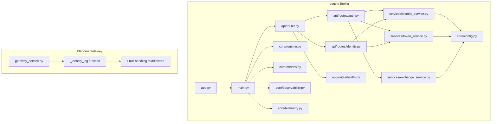
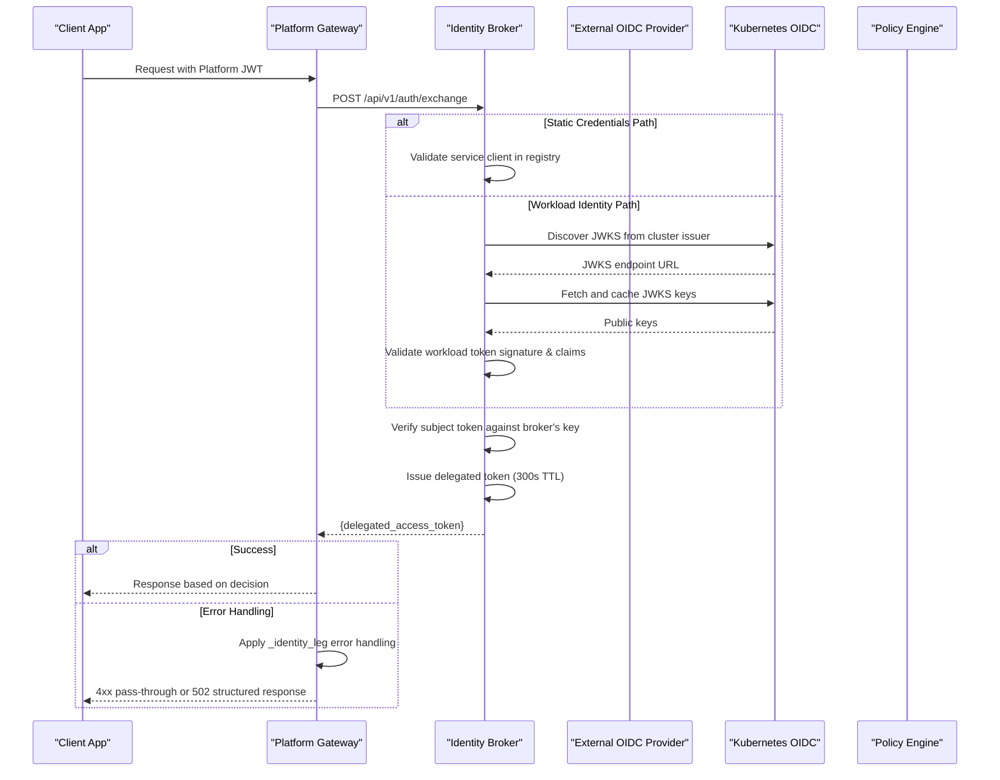
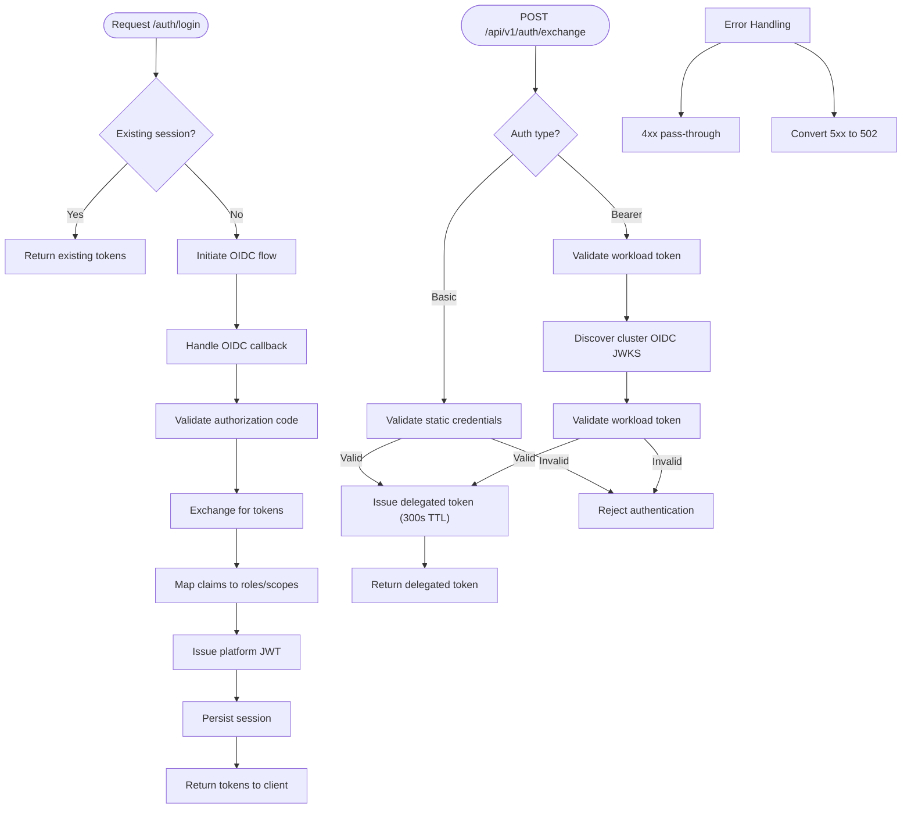
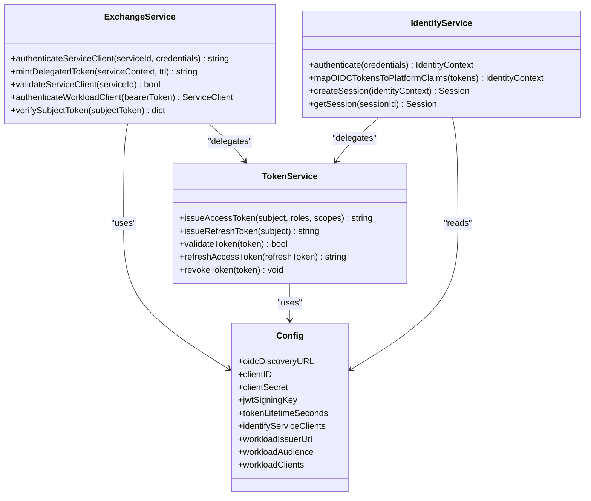
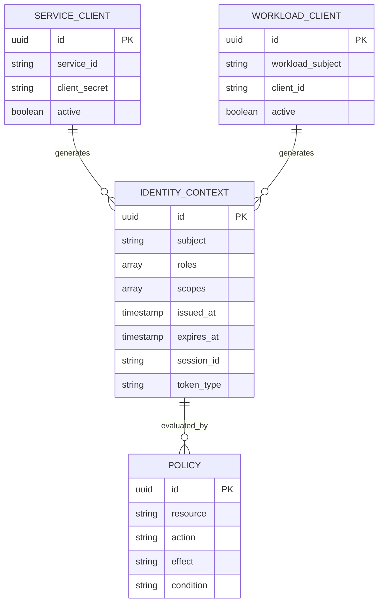
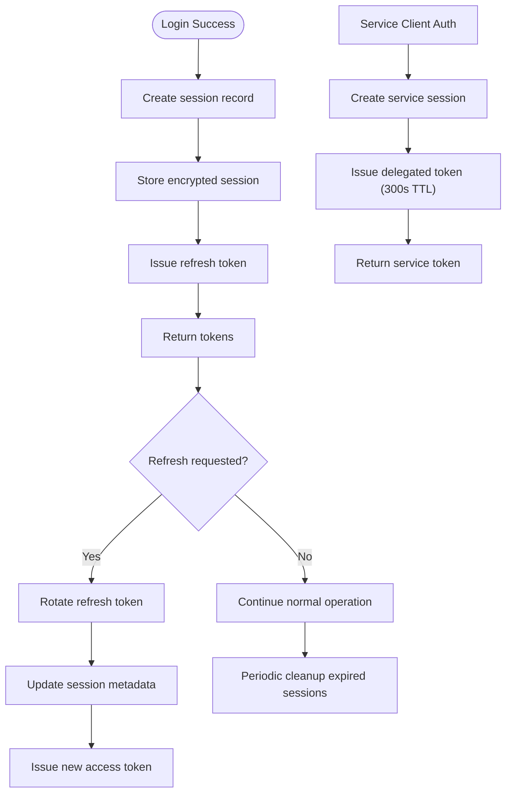
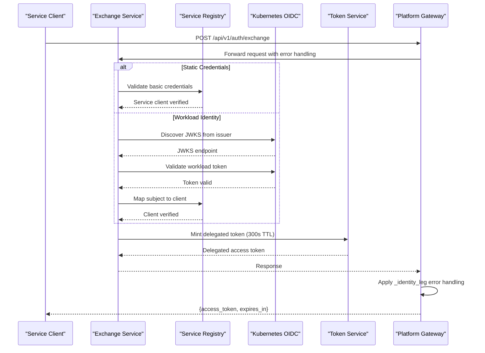
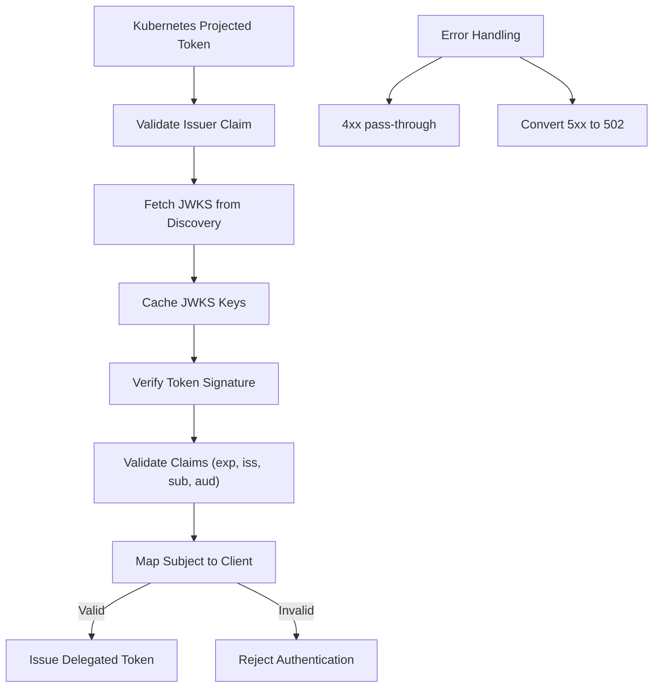
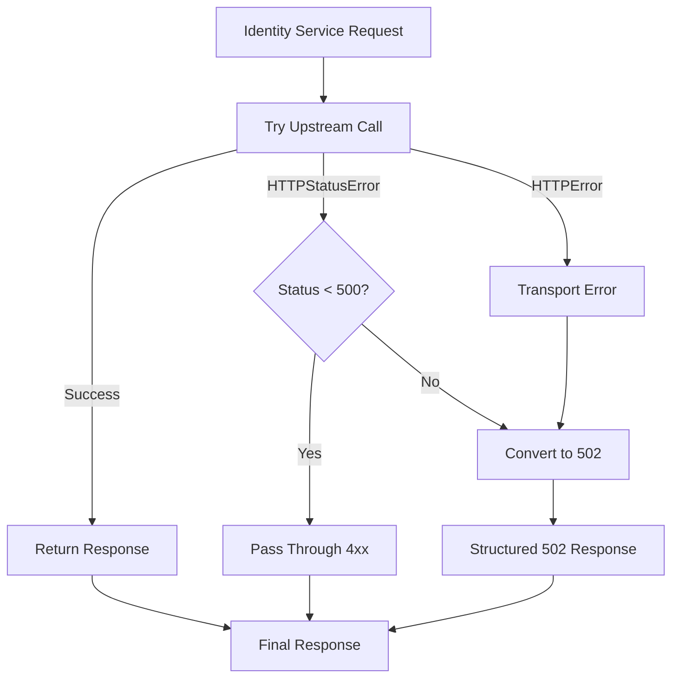
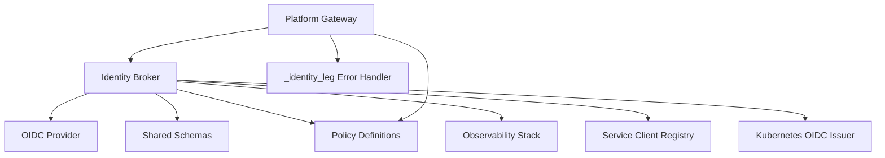

# Identity Broker Service

<cite>
**Referenced Files in This Document**
- [identity-broker README](file://products/identity-broker/README.md)
- [identity broker app](file://products/identity-broker/src/identity_service/app.py)
- [identity broker main](file://products/identity-broker/src/identity_service/main.py)
- [identity broker config](file://products/identity-broker/src/identity_service/core/config.py)
- [identity broker runtime](file://products/identity-broker/src/identity_service/core/runtime.py)
- [identity broker metrics](file://products/identity-broker/src/identity_service/core/metrics.py)
- [identity broker observability](file://products/identity-broker/src/identity_service/core/observability.py)
- [identity broker telemetry](file://products/identity-broker/src/identity_service/core/telemetry.py)
- [identity broker auth routes](file://products/identity-broker/src/identity_service/api/routes/auth.py)
- [identity broker identity routes](file://products/identity-broker/src/identity_service/api/routes/identity.py)
- [identity broker health routes](file://products/identity-broker/src/identity_service/api/routes/health.py)
- [identity broker router](file://products/identity-broker/src/identity_service/api/router.py)
- [identity broker auth schemas](file://products/identity-broker/src/identity_service/schemas/auth.py)
- [identity broker identity schemas](file://products/identity-broker/src/identity_service/schemas/identity.py)
- [identity broker identity service](file://products/identity-broker/src/identity_service/services/identity_service.py)
- [identity broker token service](file://products/identity-broker/src/identity_service/services/token_service.py)
- [identity broker exchange service](file://products/identity-broker/src/identity_service/services/exchange_service.py)
- [identity broker metadata](file://products/identity-broker/src/identity_service/metadata.py)
- [identity broker Dockerfile](file://products/identity-broker/Dockerfile)
- [identity broker pyproject](file://products/identity-broker/pyproject.toml)
- [identity broker tests - identity service](file://products/identity-broker/tests/test_identity_service.py)
- [identity broker tests - token service](file://products/identity-broker/tests/test_token_service.py)
- [identity broker tests - observability](file://products/identity-broker/tests/test_observability.py)
- [identity broker tests - exchange service](file://products/identity-broker/tests/test_exchange_service.py)
- [platform gateway service](file://products/platform-gateway/src/platform_gateway/services/gateway_service.py)
- [shared identity context schema](file://shared/shared-contracts/schemas/identity-context.schema.json)
- [shared identity token schema](file://shared/shared-contracts/schemas/identity-token.schema.json)
- [policy center policy default](file://shared/shared-contracts/policies/policy-default.yaml)
- [tool gateway token verifier](file://products/tool-gateway/src/api_gateway/services/token_verifier.py)
- [tool gateway policy engine](file://products/tool-gateway/src/api_gateway/services/policy_engine.py)
- [tool gateway auth routes](file://products/tool-gateway/src/api_gateway/api/routes/auth.py)
- [tool gateway identity routes](file://products/tool-gateway/src/api_gateway/api/routes/identity.py)
- [spec identity trust hardening](file://docs/specs/SPEC-003-identity-trust-hardening/spec.md)
- [spec session durability](file://docs/specs/SPEC-006-session-durability/spec.md)
- [ADR broker mediated token delegation](file://docs/adr/0004-broker-mediated-token-delegation.md)
</cite>

## Update Summary
**Changes Made**
- Updated error handling architecture to reflect the new `_identity_leg` function in platform gateway that standardizes 4xx pass-through and 5xx conversion to structured 502 responses
- Enhanced reliability during rollouts with consistent error posture across identity service communication
- Added comprehensive documentation of the unified error handling pattern used throughout the platform
- Updated troubleshooting guidance to reflect improved error reporting and retry semantics

## Table of Contents
1. [Introduction](#introduction)
2. [Project Structure](#project-structure)
3. [Core Components](#core-components)
4. [Architecture Overview](#architecture-overview)
5. [Detailed Component Analysis](#detailed-component-analysis)
6. [Service Client Authentication](#service-client-authentication)
7. [Workload Identity Support](#workload-identity-support)
8. [Error Handling and Reliability](#error-handling-and-reliability)
9. [Dependency Analysis](#dependency-analysis)
10. [Performance Considerations](#performance-considerations)
11. [Troubleshooting Guide](#troubleshooting-guide)
12. [Conclusion](#conclusion)
13. [Appendices](#appendices)

## Introduction
The Identity Broker Service centralizes authentication and authorization across the platform. It integrates with external OpenID Connect (OIDC) providers, issues and validates tokens, manages user sessions, and exposes standardized identity endpoints consumed by other services such as the Tool Gateway. The service enforces role-based access control (RBAC) through shared policies and produces audit logs for compliance.

Key responsibilities:
- OIDC integration flow and token issuance/validation
- JWT lifecycle management (issuance, refresh, revocation)
- User session handling and persistence
- Standardized identity APIs for downstream services
- Policy-aware identity context propagation
- **Dual-path service client authentication: static credentials and Kubernetes workload identity**
- **Kubernetes projected service-account token validation with JWKS discovery**
- **Standardized error handling with 4xx pass-through and 5xx conversion to structured 502 responses**

**Section sources**
- [identity-broker README](file://products/identity-broker/README.md)
- [spec identity trust hardening](file://docs/specs/SPEC-003-identity-trust-hardening/spec.md)
- [ADR broker mediated token delegation](file://docs/adr/0004-broker-mediated-token-delegation.md)

## Project Structure
The Identity Broker is a Python FastAPI application organized into clear layers:
- API layer: HTTP routes for authentication, identity, and health
- Services layer: Core business logic for identity operations, token management, and service client authentication
- Core layer: Configuration, runtime setup, metrics, observability, and telemetry
- Schemas: Pydantic models for request/response validation
- Tests: Unit and integration tests for services and observability

**Diagram sources**
- [identity broker app](file://products/identity-broker/src/identity_service/app.py)
- [identity broker main](file://products/identity-broker/src/identity_service/main.py)
- [identity broker router](file://products/identity-broker/src/identity_service/api/router.py)
- [identity broker auth routes](file://products/identity-broker/src/identity_service/api/routes/auth.py)
- [identity broker identity routes](file://products/identity-broker/src/identity_service/api/routes/identity.py)
- [identity broker health routes](file://products/identity-broker/src/identity_service/api/routes/health.py)
- [identity broker identity service](file://products/identity-broker/src/identity_service/services/identity_service.py)
- [identity broker token service](file://products/identity-broker/src/identity_service/services/token_service.py)
- [identity broker exchange service](file://products/identity-broker/src/identity_service/services/exchange_service.py)
- [identity broker config](file://products/identity-broker/src/identity_service/core/config.py)
- [identity broker runtime](file://products/identity-broker/src/identity_service/core/runtime.py)
- [identity broker metrics](file://products/identity-broker/src/identity_service/core/metrics.py)
- [identity broker observability](file://products/identity-broker/src/identity_service/core/observability.py)
- [identity broker telemetry](file://products/identity-broker/src/identity_service/core/telemetry.py)
- [platform gateway service](file://products/platform-gateway/src/platform_gateway/services/gateway_service.py)

**Section sources**
- [identity broker app](file://products/identity-broker/src/identity_service/app.py)
- [identity broker main](file://products/identity-broker/src/identity_service/main.py)
- [identity broker router](file://products/identity-broker/src/identity_service/api/router.py)
- [identity broker auth routes](file://products/identity-broker/src/identity_service/api/routes/auth.py)
- [identity broker identity routes](file://products/identity-broker/src/identity_service/api/routes/identity.py)
- [identity broker health routes](file://products/identity-broker/src/identity_service/api/routes/health.py)
- [identity broker identity service](file://products/identity-broker/src/identity_service/services/identity_service.py)
- [identity broker token service](file://products/identity-broker/src/identity_service/services/token_service.py)
- [identity broker exchange service](file://products/identity-broker/src/identity_service/services/exchange_service.py)
- [identity broker config](file://products/identity-broker/src/identity_service/core/config.py)
- [identity broker runtime](file://products/identity-broker/src/identity_service/core/runtime.py)
- [identity broker metrics](file://products/identity-broker/src/identity_service/core/metrics.py)
- [identity broker observability](file://products/identity-broker/src/identity_service/core/observability.py)
- [identity broker telemetry](file://products/identity-broker/src/identity_service/core/telemetry.py)

## Core Components
- Authentication Routes: Handle login, token exchange, refresh, logout, and service client authentication flows.
- Identity Routes: Provide profile lookup and identity context resolution.
- Identity Service: Orchestrates OIDC interactions, user mapping, and session creation.
- Token Service: Issues, signs, refreshes, and validates JWTs; manages claims and scopes.
- Exchange Service: Handles service client authentication and delegated token minting with registry validation and workload identity support.
- Configuration: Loads environment-specific settings for OIDC providers, signing keys, security policies, and workload identity configuration.
- Observability: Metrics, tracing, and structured logging for auditability.

Key behaviors:
- OIDC discovery and client configuration via environment variables
- Secure token signing and rotation support
- Session persistence and renewal
- RBAC enforcement using shared policy definitions
- **Dual authentication paths: static HTTP Basic credentials and Kubernetes workload identity**
- **JWKS-based validation of Kubernetes projected service-account tokens**
- **Delegated token minting with configurable TTL (300 seconds)**
- **Standardized error handling with 4xx pass-through and 5xx conversion to structured 502 responses**

**Section sources**
- [identity broker auth routes](file://products/identity-broker/src/identity_service/api/routes/auth.py)
- [identity broker identity routes](file://products/identity-broker/src/identity_service/api/routes/identity.py)
- [identity broker identity service](file://products/identity-broker/src/identity_service/services/identity_service.py)
- [identity broker token service](file://products/identity-broker/src/identity_service/services/token_service.py)
- [identity broker exchange service](file://products/identity-broker/src/identity_service/services/exchange_service.py)
- [identity broker config](file://products/identity-broker/src/identity_service/core/config.py)
- [identity broker observability](file://products/identity-broker/src/identity_service/core/observability.py)

## Architecture Overview
The Identity Broker sits between clients and external OIDC providers, issuing platform tokens that downstream services validate. It also persists sessions and propagates identity contexts to enforce policies consistently. The service now supports both user authentication and dual-path service client authentication flows with enhanced Kubernetes workload identity support and standardized error handling.

**Diagram sources**
- [identity broker auth routes](file://products/identity-broker/src/identity_service/api/routes/auth.py)
- [identity broker exchange service](file://products/identity-broker/src/identity_service/services/exchange_service.py)
- [identity broker identity service](file://products/identity-broker/src/identity_service/services/identity_service.py)
- [identity broker token service](file://products/identity-broker/src/identity_service/services/token_service.py)
- [platform gateway service](file://products/platform-gateway/src/platform_gateway/services/gateway_service.py)

**Section sources**
- [ADR broker mediated token delegation](file://docs/adr/0004-broker-mediated-token-delegation.md)
- [platform gateway service](file://products/platform-gateway/src/platform_gateway/services/gateway_service.py)

## Detailed Component Analysis

### Authentication Endpoints
Endpoints typically include:
- Login initiation and callback handling
- Token exchange and refresh
- Logout and session termination
- **Dual-path service client authentication via POST /api/v1/auth/exchange**

Behavior highlights:
- Redirects to OIDC provider when necessary
- Validates state and nonce parameters
- Exchanges authorization code for tokens securely
- Issues platform JWTs with appropriate claims and scopes
- Supports refresh token rotation and secure storage
- **Dual authentication: static HTTP Basic credentials and Kubernetes workload identity**
- **JWKS-based validation of projected service-account tokens**
- **Issues delegated tokens with 300-second TTL for service-to-service communication**
- **Standardized error handling with 4xx pass-through and 5xx conversion**

**Diagram sources**
- [identity broker auth routes](file://products/identity-broker/src/identity_service/api/routes/auth.py)
- [identity broker exchange service](file://products/identity-broker/src/identity_service/services/exchange_service.py)
- [identity broker identity service](file://products/identity-broker/src/identity_service/services/identity_service.py)
- [identity broker token service](file://products/identity-broker/src/identity_service/services/token_service.py)
- [platform gateway service](file://products/platform-gateway/src/platform_gateway/services/gateway_service.py)

**Section sources**
- [identity broker auth routes](file://products/identity-broker/src/identity_service/api/routes/auth.py)
- [identity broker exchange service](file://products/identity-broker/src/identity_service/services/exchange_service.py)
- [identity broker identity service](file://products/identity-broker/src/identity_service/services/identity_service.py)
- [identity broker token service](file://products/identity-broker/src/identity_service/services/token_service.py)

### Token Management and Validation
Responsibilities:
- Signing and verifying JWTs
- Managing token lifetimes and rotation
- Handling refresh tokens securely
- Enforcing scope and claim constraints
- **Supporting different token types (user vs service delegated tokens)**

Validation process:
- Signature verification against configured keys
- Expiration and audience checks
- Scope and role extraction for policy evaluation
- **Token type validation (user vs service delegated)**
- **JWKS-based validation for workload identity tokens**

**Diagram sources**
- [identity broker token service](file://products/identity-broker/src/identity_service/services/token_service.py)
- [identity broker exchange service](file://products/identity-broker/src/identity_service/services/exchange_service.py)
- [identity broker identity service](file://products/identity-broker/src/identity_service/services/identity_service.py)
- [identity broker config](file://products/identity-broker/src/identity_service/core/config.py)

**Section sources**
- [identity broker token service](file://products/identity-broker/src/identity_service/services/token_service.py)
- [identity broker exchange service](file://products/identity-broker/src/identity_service/services/exchange_service.py)
- [identity broker identity service](file://products/identity-broker/src/identity_service/services/identity_service.py)
- [identity broker config](file://products/identity-broker/src/identity_service/core/config.py)

### Identity Context and Policy Enforcement
Identity context encapsulates subject identity, roles, scopes, and session metadata. Downstream services use this context to enforce policies defined centrally. The system now supports both user and service client identity contexts with enhanced workload identity support and standardized error handling.

Relationships:
- Identity Broker produces identity context from OIDC tokens
- Exchange Service creates service client identity contexts from both static and workload credentials
- Tool Gateway consumes identity context to evaluate policies
- Policies define allowed actions per role/scope/resource

**Diagram sources**
- [shared identity context schema](file://shared/shared-contracts/schemas/identity-context.schema.json)
- [policy center policy default](file://shared/shared-contracts/policies/policy-default.yaml)
- [tool gateway policy engine](file://products/tool-gateway/src/api_gateway/services/policy_engine.py)

**Section sources**
- [shared identity context schema](file://shared/shared-contracts/schemas/identity-context.schema.json)
- [policy center policy default](file://shared/shared-contracts/policies/policy-default.yaml)
- [tool gateway policy engine](file://products/tool-gateway/src/api_gateway/services/policy_engine.py)

### Session Handling
Sessions are persisted and renewed according to policy. Key aspects:
- Secure session storage with encryption at rest
- Refresh token rotation on each use
- Session expiration and cleanup
- Audit logging for session lifecycle events
- **Service client sessions managed separately from user sessions**

**Diagram sources**
- [identity broker identity service](file://products/identity-broker/src/identity_service/services/identity_service.py)
- [identity broker token service](file://products/identity-broker/src/identity_service/services/token_service.py)
- [identity broker exchange service](file://products/identity-broker/src/identity_service/services/exchange_service.py)
- [spec session durability](file://docs/specs/SPEC-006-session-durability/spec.md)

**Section sources**
- [identity broker identity service](file://products/identity-broker/src/identity_service/services/identity_service.py)
- [identity broker token service](file://products/identity-broker/src/identity_service/services/token_service.py)
- [identity broker exchange service](file://products/identity-broker/src/identity_service/services/exchange_service.py)
- [spec session durability](file://docs/specs/SPEC-006-session-durability/spec.md)

### Configuration Examples
Typical configuration includes:
- OIDC provider discovery URL, client ID, and secret
- JWT signing key and algorithm
- Token lifetime and refresh policy
- Security policies and feature flags
- **IDENTIFY_SERVICE_CLIENTS registry with service client definitions**
- **Workload identity configuration with cluster OIDC issuer and subject mappings**

Environment-driven configuration ensures secure deployment across environments.

**Section sources**
- [identity broker config](file://products/identity-broker/src/identity_service/core/config.py)
- [identity broker pyproject](file://products/identity-broker/pyproject.toml)

### Security Policies and RBAC
RBAC is enforced via shared policy definitions. Roles and scopes extracted from OIDC tokens are mapped to platform roles, which are then evaluated against policies to allow or deny actions. Service clients have separate identity contexts and permissions from both static and workload identity sources.

Best practices:
- Least privilege principle
- Regular review of role mappings
- Centralized policy updates propagated to consumers
- **Service client credential rotation and monitoring**
- **TTL-based token expiration for enhanced security**
- **JWKS-based validation for workload identity tokens**
- **Standardized error handling for security-sensitive operations**

**Section sources**
- [policy center policy default](file://shared/shared-contracts/policies/policy-default.yaml)
- [tool gateway policy engine](file://products/tool-gateway/src/api_gateway/services/policy_engine.py)

## Service Client Authentication

The Identity Broker provides a dedicated endpoint for service-to-service authentication through the POST /api/v1/auth/exchange endpoint with dual authentication paths supporting both traditional static credentials and modern Kubernetes workload identity.

### Exchange Endpoint Functionality
- **Dual Authentication Paths**: Supports both static HTTP Basic credentials and Kubernetes projected service-account tokens
- **Service Client Registry Validation**: All service clients must be registered in the IDENTIFY_SERVICE_CLIENTS configuration
- **Credential Verification**: Validates service client credentials against the registry or workload identity mappings
- **Delegated Token Minting**: Issues short-lived access tokens (300-second TTL) for service-to-service calls
- **Audit Logging**: Records all authentication attempts and outcomes for compliance
- **Standardized Error Handling**: Consistent 4xx pass-through and 5xx conversion to structured 502 responses

### Static Credential Authentication Path
Traditional HTTP Basic authentication remains fully supported:
- Client credentials provided via `Authorization: Basic` header
- Credentials validated against the service client registry
- Backward compatible with existing deployments
- Suitable for development and legacy systems

### Workload Identity Authentication Path
Modern Kubernetes-native authentication using projected service-account tokens:
- Bearer token presented via `Authorization: Bearer` header
- Token validated against cluster OIDC issuer using JWKS discovery
- Subject mapped to registered workload clients
- Enhanced security with short-lived, automatically rotated tokens

### Security Considerations
- Service clients must be pre-registered with unique identifiers and secrets
- Workload subjects must be mapped to registered clients via IDENTITY_WORKLOAD_CLIENTS
- Delegated tokens have shorter lifespans (300 seconds) compared to user tokens
- All authentication attempts are logged for audit purposes
- Failed authentication attempts trigger security alerts
- Token validation includes service client context and permissions
- **JWKS caching for improved performance and reliability**
- **Standardized error handling for improved reliability during rollouts**

**Section sources**
- [identity broker exchange service](file://products/identity-broker/src/identity_service/services/exchange_service.py)
- [identity broker auth routes](file://products/identity-broker/src/identity_service/api/routes/auth.py)
- [identity broker config](file://products/identity-broker/src/identity_service/core/config.py)
- [platform gateway service](file://products/platform-gateway/src/platform_gateway/services/gateway_service.py)

## Workload Identity Support

The Identity Broker now provides comprehensive support for Kubernetes workload identity, enabling secure service-to-service authentication without managing static credentials.

### Kubernetes Projected Service-Account Tokens
Workload identity leverages Kubernetes' built-in service account token projection:
- Tokens are automatically mounted into pods via projected volumes
- Short-lived tokens (typically 1 hour) reduce security risks
- Automatic rotation eliminates credential management overhead
- Cluster OIDC issuer validates token authenticity

### JWKS Discovery and Validation
The exchange service implements robust JWKS-based validation:
- **Automatic Discovery**: Fetches JWKS endpoint from cluster OIDC issuer's discovery document
- **Key Caching**: Caches JWKS clients per issuer URL for performance
- **Signature Verification**: Validates token signatures against cluster public keys
- **Claim Validation**: Verifies issuer, audience, expiration, and required claims

### Workload Client Mapping
Workload subjects are mapped to service clients through configuration:
- Format: `subject=client_id:aud1|aud2`
- Example: `system:serviceaccount:prod-luban:api-gateway=tool-gateway:tool-gateway`
- Subjects follow Kubernetes service account naming conventions
- Audience restrictions apply same as static credentials

### Configuration Requirements
Enable workload identity by setting:
- `IDENTITY_WORKLOAD_ISSUER_URL`: Cluster OIDC issuer URL
- `IDENTITY_WORKLOAD_AUDIENCE`: Required audience claim (default: `identity-broker`)
- `IDENTITY_WORKLOAD_CLIENTS`: Comma-separated subject-to-client mappings

**Diagram sources**
- [identity broker exchange service](file://products/identity-broker/src/identity_service/services/exchange_service.py)
- [identity broker config](file://products/identity-broker/src/identity_service/core/config.py)
- [platform gateway service](file://products/platform-gateway/src/platform_gateway/services/gateway_service.py)

**Section sources**
- [identity broker exchange service](file://products/identity-broker/src/identity_service/services/exchange_service.py)
- [identity broker config](file://products/identity-broker/src/identity_service/core/config.py)
- [identity broker tests - exchange service](file://products/identity-broker/tests/test_exchange_service.py)

## Error Handling and Reliability

The platform now implements a standardized error handling approach through the `_identity_leg` function in the platform gateway, ensuring consistent behavior during identity service communications and improving reliability during rollouts.

### Unified Error Posture
The `_identity_leg` function provides a centralized approach to handling identity service communications:
- **4xx Status Codes**: Pass through unchanged to preserve client error semantics
- **5xx Status Codes**: Convert to structured 502 responses with actionable details
- **Transport Errors**: Convert to 502 responses with "identity service unavailable" messaging
- **Structured Error Details**: Extract and preserve meaningful error information from upstream responses

### Rollout Reliability Improvements
This error handling strategy specifically addresses rollout scenarios:
- Prevents raw 500 errors from masking as authentication failures
- Provides clear distinction between client errors and service unavailability
- Enables better monitoring and alerting for identity service health
- Maintains consistent user experience during partial outages

### Implementation Pattern
The error handling follows a consistent pattern across all identity-related operations:

**Diagram sources**
- [platform gateway service](file://products/platform-gateway/src/platform_gateway/services/gateway_service.py)

### Benefits During Rollouts
- **Graceful Degradation**: Users see actionable errors instead of generic failures
- **Better Diagnostics**: Clear separation between client errors and service issues
- **Improved Monitoring**: Consistent error patterns enable better observability
- **Faster Recovery**: Clear error signals help identify and resolve issues quickly

**Section sources**
- [platform gateway service](file://products/platform-gateway/src/platform_gateway/services/gateway_service.py)

## Dependency Analysis
The Identity Broker depends on:
- External OIDC providers for authentication
- Shared schemas for identity context and tokens
- Policy definitions for authorization decisions
- Observability libraries for metrics and tracing
- **Service client registry for authentication validation**
- **Kubernetes OIDC issuer for workload identity validation**
- **Platform gateway for standardized error handling**

**Diagram sources**
- [identity broker config](file://products/identity-broker/src/identity_service/core/config.py)
- [shared identity context schema](file://shared/shared-contracts/schemas/identity-context.schema.json)
- [shared identity token schema](file://shared/shared-contracts/schemas/identity-token.schema.json)
- [policy center policy default](file://shared/shared-contracts/policies/policy-default.yaml)
- [platform gateway service](file://products/platform-gateway/src/platform_gateway/services/gateway_service.py)

**Section sources**
- [identity broker config](file://products/identity-broker/src/identity_service/core/config.py)
- [shared identity context schema](file://shared/shared-contracts/schemas/identity-context.schema.json)
- [shared identity token schema](file://shared/shared-contracts/schemas/identity-token.schema.json)
- [policy center policy default](file://shared/shared-contracts/policies/policy-default.yaml)
- [platform gateway service](file://products/platform-gateway/src/platform_gateway/services/gateway_service.py)

## Performance Considerations
- Cache OIDC discovery documents where supported
- Use short-lived access tokens with refresh rotation
- Implement token introspection caching at consumers
- Optimize session store queries and TTLs
- Monitor metrics for latency and error rates
- **Cache service client registry lookups for improved performance**
- **Cache JWKS clients per workload issuer URL**
- **Monitor delegated token minting rates and failures**
- **Optimize network calls to Kubernetes OIDC endpoints**
- **Leverage cached error handling for reduced latency**

## Troubleshooting Guide
Common issues and resolutions:
- OIDC connection failures: Verify discovery URL and credentials
- Token validation errors: Check signing keys and algorithms
- Session not found: Ensure persistence backend availability
- Policy denials: Review role mappings and policy rules
- **Service client authentication failures: Verify service client registration and credentials**
- **Delegated token expiration: Check 300-second TTL limits for service-to-service calls**
- **Workload identity issues: Verify cluster OIDC issuer configuration and subject mappings**
- **JWKS discovery failures: Check network connectivity to Kubernetes API server**
- **502 errors: Check identity service availability and network connectivity**

### Error-Specific Troubleshooting
- **4xx Errors**: These are passed through unchanged, indicating client-side issues
- **502 Errors**: Indicate identity service unavailability or transport failures
- **Authentication Failures**: Check service client credentials and workload identity configuration
- **Token Validation Errors**: Verify JWT signing keys and token expiration

Audit logs should capture:
- Authentication attempts and outcomes
- Token issuance and refresh events
- Session lifecycle changes
- Policy evaluation results
- **Service client authentication attempts and registry validation results**
- **Delegated token minting and expiration events**
- **Workload identity validation attempts and JWKS discovery results**
- **Error handling events and status code conversions**

**Section sources**
- [identity broker observability](file://products/identity-broker/src/identity_service/core/observability.py)
- [identity broker tests - observability](file://products/identity-broker/tests/test_observability.py)
- [platform gateway service](file://products/platform-gateway/src/platform_gateway/services/gateway_service.py)

## Conclusion
The Identity Broker Service provides a robust foundation for authentication and authorization across the platform. By integrating with OIDC providers, managing JWT lifecycles, enforcing policies via shared definitions, and supporting dual-path service client authentication with enhanced Kubernetes workload identity support, it enables secure and compliant operations. The addition of standardized error handling through the `_identity_leg` function significantly improves reliability during rollouts while maintaining backward compatibility with static credentials. Proper configuration, observability, and adherence to best practices ensure reliability and maintainability.

## Appendices

### API Endpoints Summary
- Authentication: login, callback, refresh, logout
- **Service Client Authentication: POST /api/v1/auth/exchange (supports both Basic and Bearer auth)**
- Identity: profile lookup, context resolution
- Health: readiness and liveness checks

**Section sources**
- [identity broker auth routes](file://products/identity-broker/src/identity_service/api/routes/auth.py)
- [identity broker identity routes](file://products/identity-broker/src/identity_service/api/routes/identity.py)
- [identity broker health routes](file://products/identity-broker/src/identity_service/api/routes/health.py)

### Deployment Notes
- Container image built via Dockerfile
- Environment variables for configuration
- Kubernetes manifests for deployment and services
- **Service client registry configuration required for exchange endpoint**
- **Workload identity requires proper cluster OIDC issuer configuration**
- **Platform gateway configuration for standardized error handling**

**Section sources**
- [identity broker Dockerfile](file://products/identity-broker/Dockerfile)
- [identity broker README](file://products/identity-broker/README.md)

### Service Client Configuration
Service clients must be configured in the IDENTIFY_SERVICE_CLIENTS registry with:
- Unique service identifier
- Client secret for authentication
- Active status flag
- Associated permissions and roles

### Workload Identity Configuration
For Kubernetes workload identity support:
- Set `IDENTITY_WORKLOAD_ISSUER_URL` to cluster OIDC issuer
- Configure `IDENTITY_WORKLOAD_AUDIENCE` (default: `identity-broker`)
- Map workload subjects to clients via `IDENTITY_WORKLOAD_CLIENTS`
- Format: `system:serviceaccount:<namespace>:<service-account>=<client-id>:<audiences>`

**Section sources**
- [identity broker config](file://products/identity-broker/src/identity_service/core/config.py)
- [identity broker exchange service](file://products/identity-broker/src/identity_service/services/exchange_service.py)
- [identity broker tests - exchange service](file://products/identity-broker/tests/test_exchange_service.py)

### Environment Variables Reference
**Core Configuration:**
- `KEYCLOAK_BASE_URL`, `KEYCLOAK_REALM`: OIDC provider settings
- `OIDC_CLIENT_ID`, `OIDC_REDIRECT_URI`, `OIDC_SCOPES`: Client configuration
- `IDENTITY_JWT_PRIVATE_KEY_PATH`: JWT signing key path
- `IDENTITY_TOKEN_TTL_SECONDS`: Platform JWT lifetime (default: 900)
- `IDENTITY_TOKEN_ISSUER`: JWT issuer claim (default: `luban-identity-broker`)
- `IDENTITY_TOKEN_AUDIENCE`: Default audience (default: `tool-gateway`)
- `IDENTITY_DELEGATED_TOKEN_TTL_SECONDS`: Delegated token lifetime (default: 300)

**Service Client Configuration:**
- `IDENTITY_SERVICE_CLIENTS`: Static credential registry format: `client_id:secret:aud1|aud2`

**Workload Identity Configuration:**
- `IDENTITY_WORKLOAD_ISSUER_URL`: Cluster OIDC issuer URL
- `IDENTITY_WORKLOAD_AUDIENCE`: Required audience for workload tokens (default: `identity-broker`)
- `IDENTITY_WORKLOAD_CLIENTS`: Workload subject mappings format: `subject=client_id:aud1|aud2`

**Observability:**
- `OTEL_ENABLED`: Enable OTLP metrics/tracing
- `OTEL_EXPORTER_OTLP_ENDPOINT`: Collector endpoint
- `OTEL_SERVICE_NAME`: Service name for metrics

**Section sources**
- [identity broker config](file://products/identity-broker/src/identity_service/core/config.py)
- [identity broker README](file://products/identity-broker/README.md)

### Error Handling Configuration
**Platform Gateway Settings:**
- `IDENTITY_SERVICE_URL`: Base URL for identity service
- Timeout configurations for identity service calls
- Retry policies for transient failures
- Logging levels for error tracking

**Monitoring and Alerting:**
- Error rate monitoring for 4xx vs 5xx responses
- Identity service availability metrics
- Token exchange success/failure rates
- Workload identity validation metrics

**Section sources**
- [platform gateway service](file://products/platform-gateway/src/platform_gateway/services/gateway_service.py)