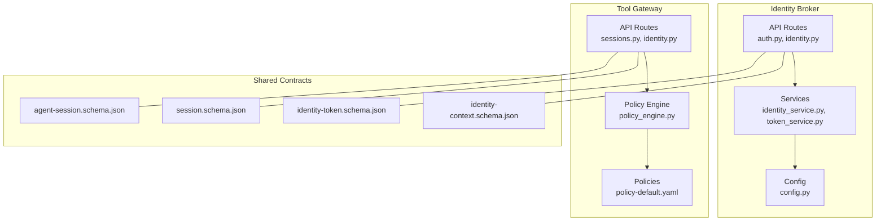
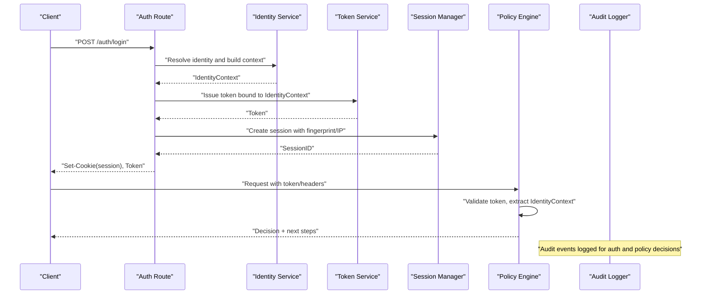
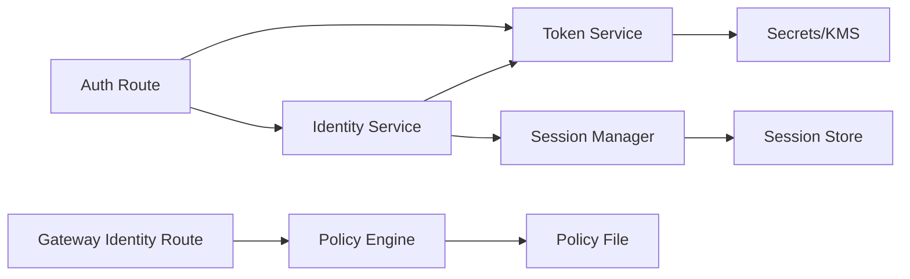

# Identity Context and User Sessions

<cite>
**Referenced Files in This Document**
- [identity-context.schema.json](file://shared/shared-contracts/schemas/identity-context.schema.json)
- [identity-token.schema.json](file://shared/shared-contracts/schemas/identity-token.schema.json)
- [session.schema.json](file://shared/shared-contracts/schemas/session.schema.json)
- [auth.py](file://products/identity-broker/src/identity_service/api/routes/auth.py)
- [identity.py](file://products/identity-broker/src/identity_service/api/routes/identity.py)
- [identity_service.py](file://products/identity-broker/src/identity_service/services/identity_service.py)
- [token_service.py](file://products/identity-broker/src/identity_service/services/token_service.py)
- [config.py](file://products/identity-broker/src/identity_service/core/config.py)
- [router.py](file://products/identity-broker/src/identity_service/api/router.py)
- [app.py](file://products/identity-broker/src/identity_service/app.py)
- [main.py](file://products/identity-broker/src/identity_service/main.py)
- [policy-default.yaml](file://products/tool-gateway/src/api_gateway/policies/policy-default.yaml)
- [policy_engine.py](file://products/tool-gateway/src/api_gateway/services/policy_engine.py)
- [sessions.py](file://products/tool-gateway/src/api_gateway/api/routes/sessions.py)
- [identity.py](file://products/tool-gateway/src/api_gateway/api/routes/identity.py)
- [agent_session.schema.json](file://shared/shared-contracts/schemas/agent-session.schema.json)
</cite>

## Table of Contents
1. [Introduction](#introduction)
2. [Project Structure](#project-structure)
3. [Core Components](#core-components)
4. [Architecture Overview](#architecture-overview)
5. [Detailed Component Analysis](#detailed-component-analysis)
6. [Dependency Analysis](#dependency-analysis)
7. [Performance Considerations](#performance-considerations)
8. [Troubleshooting Guide](#troubleshooting-guide)
9. [Conclusion](#conclusion)
10. [Appendices](#appendices)

## Introduction
This document explains how identity context and user sessions are structured, validated, and propagated across the Identity Broker Service and downstream services. It covers the identity context schema, session lifecycle (creation, persistence, concurrency, cleanup), security measures (client fingerprint binding, IP validation, secure cookies), integration with policy enforcement, and audit logging requirements. The goal is to provide both a conceptual overview and concrete guidance for implementing role-based access control and extracting identity context in downstream services.

## Project Structure
The identity and session capabilities span several modules:
- Identity Broker Service: defines identity context schemas, authentication routes, token issuance, and identity service logic.
- Tool Gateway: enforces policies using identity context, manages sessions, and exposes identity-related endpoints.
- Shared Contracts: JSON schemas that define identity context, tokens, sessions, and agent sessions.

**Diagram sources**
- [auth.py](file://products/identity-broker/src/identity_service/api/routes/auth.py)
- [identity.py](file://products/identity-broker/src/identity_service/api/routes/identity.py)
- [identity_service.py](file://products/identity-broker/src/identity_service/services/identity_service.py)
- [token_service.py](file://products/identity-broker/src/identity_service/services/token_service.py)
- [config.py](file://products/identity-broker/src/identity_service/core/config.py)
- [sessions.py](file://products/tool-gateway/src/api_gateway/api/routes/sessions.py)
- [identity.py](file://products/tool-gateway/src/api_gateway/api/routes/identity.py)
- [policy_engine.py](file://products/tool-gateway/src/api_gateway/services/policy_engine.py)
- [policy-default.yaml](file://products/tool-gateway/src/api_gateway/policies/policy-default.yaml)
- [identity-context.schema.json](file://shared/shared-contracts/schemas/identity-context.schema.json)
- [identity-token.schema.json](file://shared/shared-contracts/schemas/identity-token.schema.json)
- [session.schema.json](file://shared/shared-contracts/schemas/session.schema.json)
- [agent-session.schema.json](file://shared/shared-contracts/schemas/agent-session.schema.json)

**Section sources**
- [router.py](file://products/identity-broker/src/identity_service/api/router.py)
- [app.py](file://products/identity-broker/src/identity_service/app.py)
- [main.py](file://products/identity-broker/src/identity_service/main.py)

## Core Components
- Identity Context Schema: Defines the canonical structure of user identity information shared between services.
- Token Service: Issues and validates tokens bound to an identity context.
- Identity Service: Orchestrates identity resolution, session creation, and metadata enrichment.
- API Routes: Expose authentication and identity endpoints; handle request/response contracts.
- Policy Engine: Enforces RBAC and other policies based on identity context.
- Session Management: Creates, persists, and cleans up sessions with concurrency controls.

Key responsibilities:
- Validate and normalize identity context fields.
- Bind sessions to client fingerprints and validate IPs.
- Secure cookie attributes for transport safety.
- Propagate identity context via tokens or headers to downstream services.
- Enforce policies and log audit events.

**Section sources**
- [identity-context.schema.json](file://shared/shared-contracts/schemas/identity-context.schema.json)
- [identity-token.schema.json](file://shared/shared-contracts/schemas/identity-token.schema.json)
- [identity_service.py](file://products/identity-broker/src/identity_service/services/identity_service.py)
- [token_service.py](file://products/identity-broker/src/identity_service/services/token_service.py)
- [auth.py](file://products/identity-broker/src/identity_service/api/routes/auth.py)
- [identity.py](file://products/identity-broker/src/identity_service/api/routes/identity.py)
- [policy_engine.py](file://products/tool-gateway/src/api_gateway/services/policy_engine.py)
- [sessions.py](file://products/tool-gateway/src/api_gateway/api/routes/sessions.py)

## Architecture Overview
The Identity Broker Service authenticates users, constructs an identity context, issues tokens, and creates sessions. Downstream services (e.g., Tool Gateway) extract identity context from tokens or headers, enforce policies, and manage sessions.

**Diagram sources**
- [auth.py](file://products/identity-broker/src/identity_service/api/routes/auth.py)
- [identity_service.py](file://products/identity-broker/src/identity_service/services/identity_service.py)
- [token_service.py](file://products/identity-broker/src/identity_service/services/token_service.py)
- [policy_engine.py](file://products/tool-gateway/src/api_gateway/services/policy_engine.py)
- [sessions.py](file://products/tool-gateway/src/api_gateway/api/routes/sessions.py)

## Detailed Component Analysis

### Identity Context Schema
The identity context schema defines required and optional fields used across services. Typical elements include:
- Required fields: unique user identifier, principal name, issuer, issued-at timestamp, expiration, scopes/roles.
- Optional metadata: tenant, organization, device fingerprint, IP address, locale, consent flags.

Validation rules:
- Strict type checks and format constraints per schema.
- Mandatory presence of identifiers and timestamps.
- Optional fields must conform to allowed patterns when present.

Propagation:
- Include minimal required fields in tokens.
- Attach additional metadata in secure headers when needed by downstream services.

Security considerations:
- Never embed secrets in identity context.
- Ensure expiration and revocation mechanisms are enforced.

**Section sources**
- [identity-context.schema.json](file://shared/shared-contracts/schemas/identity-context.schema.json)

### Token Issuance and Validation
Tokens bind to an identity context and carry claims necessary for authorization. Responsibilities:
- Generate signed tokens with subject, issuer, exp, scopes, and roles.
- Validate signatures, expiry, and claim integrity.
- Support rotation and revocation lists where applicable.

Downstream usage:
- Extract claims to reconstruct identity context.
- Use scopes/roles for RBAC decisions.

**Section sources**
- [identity-token.schema.json](file://shared/shared-contracts/schemas/identity-token.schema.json)
- [token_service.py](file://products/identity-broker/src/identity_service/services/token_service.py)

### Session Lifecycle Management
Sessions represent authenticated user states with lifecycle management:
- Creation: On successful authentication, create a session bound to client fingerprint and validated IP.
- Persistence: Store session data securely with TTL and versioning.
- Concurrency: Handle concurrent requests safely using locks or atomic operations.
- Cleanup: Expire and purge stale sessions automatically.

Schema alignment:
- Align session records with session schema and agent session schema where relevant.

Security measures:
- Bind session to client fingerprint to prevent hijacking.
- Validate IP against known ranges or allowlists.
- Use secure, HttpOnly, SameSite cookies.

**Section sources**
- [session.schema.json](file://shared/shared-contracts/schemas/session.schema.json)
- [agent-session.schema.json](file://shared/shared-contracts/schemas/agent-session.schema.json)
- [sessions.py](file://products/tool-gateway/src/api_gateway/api/routes/sessions.py)

### Authentication and Identity Routes
Authentication routes orchestrate login flows, identity resolution, and token issuance:
- Accept credentials or external tokens.
- Resolve identity and construct identity context.
- Issue tokens and set secure cookies.
- Return standardized responses.

Identity routes expose endpoints to retrieve or refresh identity context and metadata.

**Section sources**
- [auth.py](file://products/identity-broker/src/identity_service/api/routes/auth.py)
- [identity.py](file://products/identity-broker/src/identity_service/api/routes/identity.py)

### Identity Service Orchestration
The identity service coordinates:
- Identity resolution from providers or upstream systems.
- Building and validating identity context.
- Triggering session creation and token issuance workflows.
- Enriching context with optional metadata.

Error handling:
- Normalize errors and return consistent status codes.
- Log detailed audit events without leaking sensitive data.

**Section sources**
- [identity_service.py](file://products/identity-broker/src/identity_service/services/identity_service.py)

### Policy Enforcement and RBAC
Policy engine integrates identity context to make authorization decisions:
- Extract roles/scopes from identity context or token claims.
- Evaluate rules defined in policy files.
- Return decision results and reasons for auditing.

RBAC implementation:
- Map roles to permissions.
- Enforce least privilege and deny-by-default.

**Section sources**
- [policy_engine.py](file://products/tool-gateway/src/api_gateway/services/policy_engine.py)
- [policy-default.yaml](file://products/tool-gateway/src/api_gateway/policies/policy-default.yaml)

### Configuration and Runtime
Configuration centralizes settings for identity broker:
- Token signing keys and algorithms.
- Session storage backend and TTLs.
- Cookie attributes (secure, HttpOnly, SameSite).
- IP validation rules and fingerprinting options.

Runtime initialization wires dependencies and ensures secure defaults.

**Section sources**
- [config.py](file://products/identity-broker/src/identity_service/core/config.py)
- [router.py](file://products/identity-broker/src/identity_service/api/router.py)
- [app.py](file://products/identity-broker/src/identity_service/app.py)
- [main.py](file://products/identity-broker/src/identity_service/main.py)

## Dependency Analysis
The following diagram shows key dependencies among components involved in identity and session management.

**Diagram sources**
- [auth.py](file://products/identity-broker/src/identity_service/api/routes/auth.py)
- [identity_service.py](file://products/identity-broker/src/identity_service/services/identity_service.py)
- [token_service.py](file://products/identity-broker/src/identity_service/services/token_service.py)
- [policy_engine.py](file://products/tool-gateway/src/api_gateway/services/policy_engine.py)
- [policy-default.yaml](file://products/tool-gateway/src/api_gateway/policies/policy-default.yaml)
- [sessions.py](file://products/tool-gateway/src/api_gateway/api/routes/sessions.py)

**Section sources**
- [config.py](file://products/identity-broker/src/identity_service/core/config.py)

## Performance Considerations
- Minimize payload size in identity context and tokens to reduce network overhead.
- Cache frequently accessed policy decisions with short TTLs.
- Use efficient session stores with atomic operations for concurrency.
- Avoid synchronous calls to external identity providers during hot paths; use async or caching where safe.
- Implement rate limiting and backpressure on authentication endpoints.

[No sources needed since this section provides general guidance]

## Troubleshooting Guide
Common issues and resolutions:
- Invalid identity context: Validate schema fields and ensure required attributes are present.
- Token verification failures: Check signature algorithms, key rotation, and expiry.
- Session conflicts: Inspect concurrent access patterns and ensure proper locking.
- Policy denials: Review policy rules and identity claims mapping.
- Cookie rejection: Verify secure, HttpOnly, SameSite attributes and domain/path settings.

Audit logging:
- Log authentication attempts, policy decisions, and session lifecycle events.
- Exclude sensitive data from logs while retaining sufficient detail for forensics.

**Section sources**
- [identity-context.schema.json](file://shared/shared-contracts/schemas/identity-context.schema.json)
- [identity-token.schema.json](file://shared/shared-contracts/schemas/identity-token.schema.json)
- [policy-engine.py](file://products/tool-gateway/src/api_gateway/services/policy_engine.py)
- [sessions.py](file://products/tool-gateway/src/api_gateway/api/routes/sessions.py)

## Conclusion
The Identity Broker Service establishes a robust foundation for identity context and session management. By adhering to strict schemas, securing sessions with fingerprint and IP binding, enforcing policies through RBAC, and maintaining comprehensive audit logs, downstream services can reliably extract and use identity information. Following the guidance here ensures secure, scalable, and maintainable identity propagation across the platform.

[No sources needed since this section summarizes without analyzing specific files]

## Appendices

### Extracting Identity Context in Downstream Services
- Read token claims or identity headers to reconstruct identity context.
- Validate token signatures and expiry before trusting claims.
- Map roles/scopes to local permissions and enforce at route handlers.

### Role-Based Access Control Implementation
- Define roles and permissions in policy files.
- Map identity context roles to policy rules.
- Deny by default and explicitly allow required actions.

### Session Security Measures
- Bind sessions to client fingerprints and validate IPs.
- Set secure cookie attributes (Secure, HttpOnly, SameSite).
- Implement automatic cleanup for expired sessions.

### Audit Logging Requirements
- Log authentication success/failure, token issuance/validation, session creation/expiry, and policy decisions.
- Correlate events with session IDs and user identifiers.
- Retain logs according to compliance requirements.

**Section sources**
- [policy-default.yaml](file://products/tool-gateway/src/api_gateway/policies/policy-default.yaml)
- [sessions.py](file://products/tool-gateway/src/api_gateway/api/routes/sessions.py)
- [identity.py](file://products/tool-gateway/src/api_gateway/api/routes/identity.py)