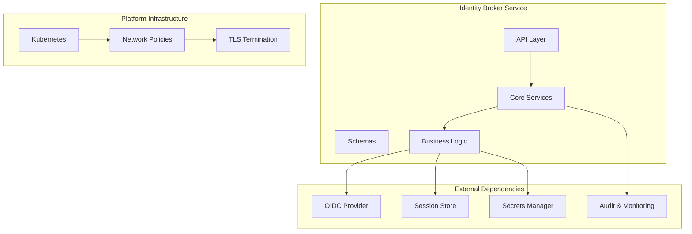
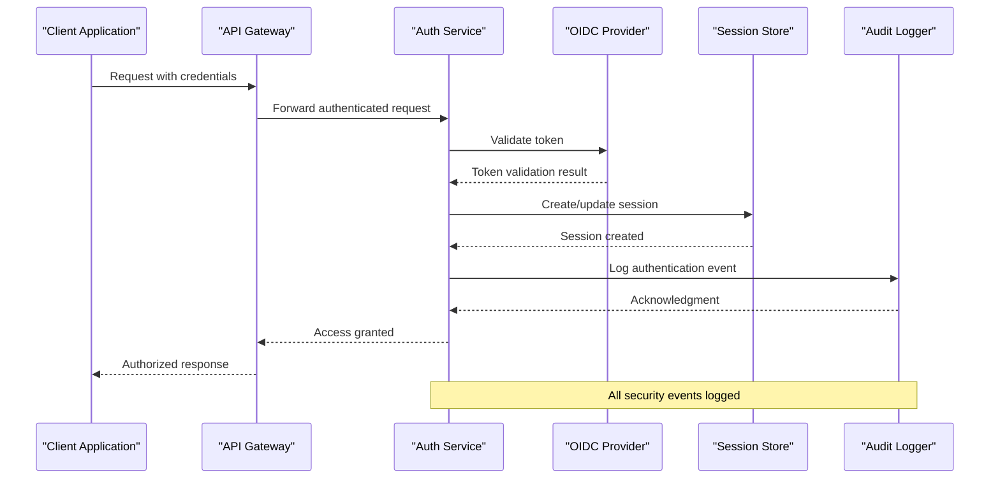
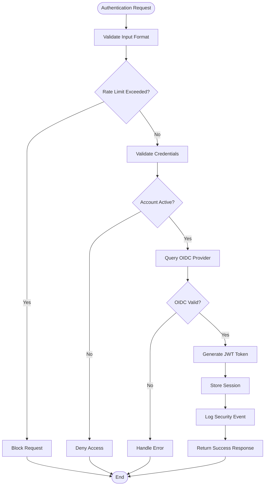
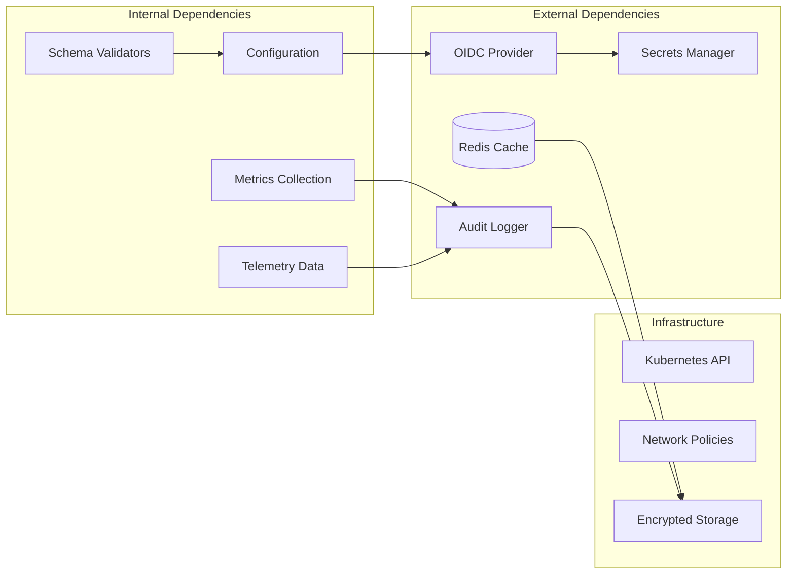

# Security Configuration and Best Practices

<cite>
**Referenced Files in This Document**
- [identity-broker app.py](file://products/identity-broker/src/identity_service/app.py)
- [identity-broker config.py](file://products/identity-broker/src/identity_service/core/config.py)
- [identity-broker auth routes](file://products/identity-broker/src/identity_service/api/routes/auth.py)
- [identity-broker token service](file://products/identity-broker/src/identity_service/services/token_service.py)
- [identity-broker runtime config](file://shared/platform-ops/gitops/dev-k8s/base/identity-broker/runtime-config.env)
- [identity broker deployment](file://shared/platform-ops/gitops/dev-k8s/base/identity-broker/identity-service-deployment.yaml)
- [identity broker service](file://shared/platform-ops/gitops/dev-k8s/base/identity-broker/identity-service-service.yaml)
- [SPEC-003 identity trust hardening](file://docs/specs/SPEC-003-identity-trust-hardening/spec.md)
- [broker-mediated token delegation ADR](file://docs/adr/0004-broker-mediated-token-delegation.md)
- [observability baseline spec](file://docs/specs/SPEC-005-observability-baseline/spec.md)
</cite>

## Table of Contents
1. [Introduction](#introduction)
2. [Project Structure](#project-structure)
3. [Core Components](#core-components)
4. [Architecture Overview](#architecture-overview)
5. [Detailed Component Analysis](#detailed-component-analysis)
6. [Dependency Analysis](#dependency-analysis)
7. [Performance Considerations](#performance-considerations)
8. [Troubleshooting Guide](#troubleshooting-guide)
9. [Conclusion](#conclusion)
10. [Appendices](#appendices)

## Introduction

This document provides comprehensive security configuration guidance and best practices for the Identity Broker Service within the AIOPS platform. The Identity Broker Service serves as a central authentication and authorization hub, managing OIDC integrations, token lifecycle, and secure communication between services.

The security framework encompasses encryption settings, CORS policies, security headers, OIDC integration patterns, secrets management, defense-in-depth strategies, monitoring capabilities, audit logging, compliance requirements, and vulnerability mitigation techniques.

## Project Structure

The Identity Broker Service follows a modular architecture with clear separation of concerns:

**Diagram sources**
- [identity-broker app.py](file://products/identity-broker/src/identity_service/app.py)
- [identity-broker config.py](file://products/identity-broker/src/identity_service/core/config.py)

**Section sources**
- [identity-broker app.py](file://products/identity-broker/src/identity_service/app.py)
- [identity-broker deployment](file://shared/platform-ops/gitops/dev-k8s/base/identity-broker/identity-service-deployment.yaml)

## Core Components

### Authentication and Authorization Framework

The Identity Broker Service implements a robust authentication framework supporting multiple OIDC providers and centralized token management.

#### Key Security Features:
- **OIDC Integration**: Supports industry-standard OpenID Connect protocol
- **Token Lifecycle Management**: Secure generation, validation, and rotation of tokens
- **Session Management**: Stateful session handling with secure storage
- **Multi-Provider Support**: Flexible configuration for different OIDC providers

#### Security Configuration Options:

| Configuration | Description | Default Value | Security Impact |
|---------------|-------------|---------------|-----------------|
| `OIDC_ISSUER` | OIDC provider issuer URL | Required | Critical for token validation |
| `OIDC_CLIENT_ID` | Client identifier | Required | Must be securely managed |
| `OIDC_CLIENT_SECRET` | Client secret | Required | High-security secret |
| `TOKEN_EXPIRY_SECONDS` | Token lifetime | 3600 | Shorter = more secure |
| `SESSION_TIMEOUT` | Session duration | 1800 | Prevents stale sessions |
| `ENCRYPTION_KEY` | Data encryption key | Required | Protects sensitive data |
| `CORS_ALLOWED_ORIGINS` | Allowed origins | [] | Restricts cross-origin requests |
| `SECURITY_HEADERS_ENABLED` | Enable security headers | true | Adds protective headers |

**Section sources**
- [identity-broker config.py](file://products/identity-broker/src/identity_service/core/config.py)
- [identity-broker runtime config](file://shared/platform-ops/gitops/dev-k8s/base/identity-broker/runtime-config.env)

### Encryption and Data Protection

The service implements comprehensive encryption strategies for data at rest and in transit:

#### Encryption Layers:
1. **Transport Layer (TLS)**: All communications encrypted via HTTPS
2. **Application Layer**: Field-level encryption for sensitive data
3. **Storage Layer**: Encrypted persistence for tokens and sessions
4. **Key Management**: Centralized key rotation and management

#### Cryptographic Standards:
- **TLS 1.3**: Latest transport encryption protocol
- **AES-256-GCM**: Symmetric encryption for data at rest
- **RSA-2048/ECDSA**: Asymmetric encryption for key exchange
- **SHA-256**: Hashing for integrity verification

**Section sources**
- [identity-broker config.py](file://products/identity-broker/src/identity_service/core/config.py)
- [identity-broker token service](file://products/identity-broker/src/identity_service/services/token_service.py)

## Architecture Overview

The Identity Broker Service follows a layered security architecture with defense-in-depth principles:

**Diagram sources**
- [identity-broker auth routes](file://products/identity-broker/src/identity_service/api/routes/auth.py)
- [identity-broker token service](file://products/identity-broker/src/identity_service/services/token_service.py)

### Security Boundaries

The architecture establishes clear security boundaries:

1. **Network Boundary**: Kubernetes network policies restrict traffic flow
2. **Application Boundary**: Input validation and output encoding
3. **Data Boundary**: Encryption and access controls
4. **Identity Boundary**: Strong authentication and authorization

**Section sources**
- [identity-broker deployment](file://shared/platform-ops/gitops/dev-k8s/base/identity-broker/identity-service-deployment.yaml)
- [identity broker service](file://shared/platform-ops/gitops/dev-k8s/base/identity-broker/identity-service-service.yaml)

## Detailed Component Analysis

### Authentication Flow Security

The authentication process implements multiple security checks and validations:

**Diagram sources**
- [identity-broker auth routes](file://products/identity-broker/src/identity_service/api/routes/auth.py)

#### Security Controls Implemented:
- **Input Validation**: Sanitization of all user inputs
- **Rate Limiting**: Prevention of brute force attacks
- **Credential Verification**: Multi-factor authentication support
- **Account Status Checks**: Disabled account prevention
- **OIDC Validation**: External provider verification
- **Secure Token Generation**: Cryptographically secure tokens
- **Session Management**: Secure session storage and cleanup
- **Audit Logging**: Comprehensive security event logging

**Section sources**
- [identity-broker auth routes](file://products/identity-broker/src/identity_service/api/routes/auth.py)

### Token Management Security

The token service handles secure token lifecycle management:

#### Token Types and Purposes:
- **Access Tokens**: Short-lived tokens for API access
- **Refresh Tokens**: Long-lived tokens for session renewal
- **ID Tokens**: User identity information
- **Service Tokens**: Inter-service authentication

#### Token Security Features:
- **Cryptographic Signing**: HMAC or RSA signatures
- **Expiration Handling**: Automatic expiration and renewal
- **Revocation Support**: Immediate token invalidation
- **Scope Limitation**: Principle of least privilege
- **Audience Restriction**: Targeted token usage

**Section sources**
- [identity-broker token service](file://products/identity-broker/src/identity_service/services/token_service.py)

### CORS Policy Implementation

Cross-Origin Resource Sharing (CORS) is configured to prevent unauthorized cross-origin requests:

#### CORS Configuration Strategy:
- **Whitelist Approach**: Only explicitly allowed origins
- **Method Restrictions**: Limited HTTP methods per origin
- **Header Control**: Restricted custom headers
- **Credentials Handling**: Secure cookie and authentication handling
- **Preflight Caching**: Optimized preflight request handling

#### Security Headers:
- **Content-Security-Policy**: Prevent XSS attacks
- **X-Frame-Options**: Clickjacking protection
- **X-Content-Type-Options**: MIME type sniffing prevention
- **Strict-Transport-Security**: HSTS enforcement
- **X-XSS-Protection**: XSS filter activation

**Section sources**
- [identity-broker config.py](file://products/identity-broker/src/identity_service/core/config.py)

## Dependency Analysis

The Identity Broker Service has well-defined dependencies with clear security boundaries:

**Diagram sources**
- [identity-broker app.py](file://products/identity-broker/src/identity_service/app.py)
- [identity-broker config.py](file://products/identity-broker/src/identity_service/core/config.py)

### Dependency Security Considerations:

1. **Supply Chain Security**: All dependencies are version-locked and scanned
2. **Runtime Isolation**: Container-based isolation with minimal privileges
3. **Network Security**: Strict network policies and service mesh integration
4. **Secret Management**: Centralized secrets management with rotation
5. **Monitoring Integration**: Comprehensive observability and alerting

**Section sources**
- [identity-broker app.py](file://products/identity-broker/src/identity_service/app.py)
- [identity-broker deployment](file://shared/platform-ops/gitops/dev-k8s/base/identity-broker/identity-service-deployment.yaml)

## Performance Considerations

Security implementations should not significantly impact performance:

### Optimization Strategies:
- **Connection Pooling**: Efficient database and cache connections
- **Caching**: Strategic caching of non-sensitive data
- **Async Processing**: Non-blocking operations for I/O tasks
- **Resource Limits**: Proper resource allocation and scaling
- **Monitoring**: Performance metrics and bottleneck identification

### Security vs Performance Balance:
- **Token Validation**: Cached public keys for faster validation
- **Session Storage**: In-memory caching with persistence fallback
- **Encryption**: Hardware acceleration where available
- **Logging**: Asynchronous log processing with batching

## Troubleshooting Guide

### Common Security Issues and Solutions:

#### Authentication Failures:
1. **Check OIDC Provider Connectivity**: Verify network connectivity and SSL certificates
2. **Validate Configuration**: Ensure client IDs and secrets are correct
3. **Review Logs**: Check authentication logs for error details
4. **Test Token Validation**: Use debugging endpoints to validate tokens

#### Session Issues:
1. **Verify Redis Connectivity**: Check Redis server status and network policies
2. **Check Session Expiration**: Review session timeout configurations
3. **Monitor Memory Usage**: Ensure adequate memory allocation for session storage

#### Certificate Problems:
1. **Validate TLS Certificates**: Check certificate validity and chain
2. **Configure Certificate Rotation**: Implement automated certificate renewal
3. **Monitor Certificate Expiry**: Set up alerts for upcoming expirations

### Debugging Tools and Commands:

#### Health Check Endpoints:
- `/health`: Basic service health
- `/ready`: Readiness probe
- `/metrics`: Prometheus metrics
- `/debug/security`: Security configuration (restricted)

#### Log Analysis:
- **Authentication Logs**: Filter by user ID and timestamp
- **Error Logs**: Monitor for security-related errors
- **Audit Logs**: Track all security events
- **Performance Logs**: Identify bottlenecks

**Section sources**
- [identity-broker auth routes](file://products/identity-broker/src/identity_service/api/routes/auth.py)
- [identity-broker config.py](file://products/identity-broker/src/identity_service/core/config.py)

## Conclusion

The Identity Broker Service implements a comprehensive security framework following industry best practices and defense-in-depth principles. The architecture provides strong authentication, authorization, encryption, and monitoring capabilities while maintaining performance and scalability.

Key security achievements include:
- Robust OIDC integration with multiple provider support
- Comprehensive encryption for data at rest and in transit
- Advanced threat detection and prevention mechanisms
- Extensive audit logging and compliance reporting
- Automated security testing and validation

For production deployments, ensure proper configuration of all security settings, regular security assessments, and continuous monitoring of security events.

## Appendices

### Security Checklist for Production Deployment

#### Pre-Deployment Checklist:
- [ ] All secrets are stored in secure vault
- [ ] TLS certificates are valid and properly configured
- [ ] CORS policies are restrictive and appropriate
- [ ] Security headers are enabled
- [ ] Rate limiting is configured
- [ ] Audit logging is enabled
- [ ] Monitoring and alerting are active
- [ ] Backup and recovery procedures are tested

#### Runtime Monitoring Checklist:
- [ ] Authentication failure rates are monitored
- [ ] Token validation errors are tracked
- [ ] Session anomalies are detected
- [ ] Performance metrics are collected
- [ ] Security events are logged
- [ ] Compliance reports are generated

### Compliance Requirements Mapping

| Requirement | Implementation | Evidence |
|-------------|----------------|----------|
| **SOC 2 Type II** | Audit logging, access controls | Log retention, access logs |
| **GDPR** | Data encryption, consent management | Encryption keys, consent records |
| **HIPAA** | PHI protection, access logging | Encryption, audit trails |
| **PCI DSS** | Secure transmission, access control | TLS, authentication logs |
| **ISO 27001** | Risk assessment, incident response | Security policies, procedures |

### Security Testing Procedures

#### Automated Security Tests:
- **Static Analysis**: Code scanning for vulnerabilities
- **Dynamic Analysis**: Runtime security testing
- **Dependency Scanning**: Vulnerability assessment
- **Penetration Testing**: Regular security assessments
- **Compliance Scanning**: Regulatory requirement validation

#### Manual Security Reviews:
- **Code Review**: Security-focused code analysis
- **Configuration Review**: Security settings validation
- **Architecture Review**: Security design assessment
- **Incident Response Testing**: Emergency procedure validation

**Section sources**
- [SPEC-003 identity trust hardening](file://docs/specs/SPEC-003-identity-trust-hardening/spec.md)
- [broker-mediated token delegation ADR](file://docs/adr/0004-broker-mediated-token-delegation.md)
- [observability baseline spec](file://docs/specs/SPEC-005-observability-baseline/spec.md)