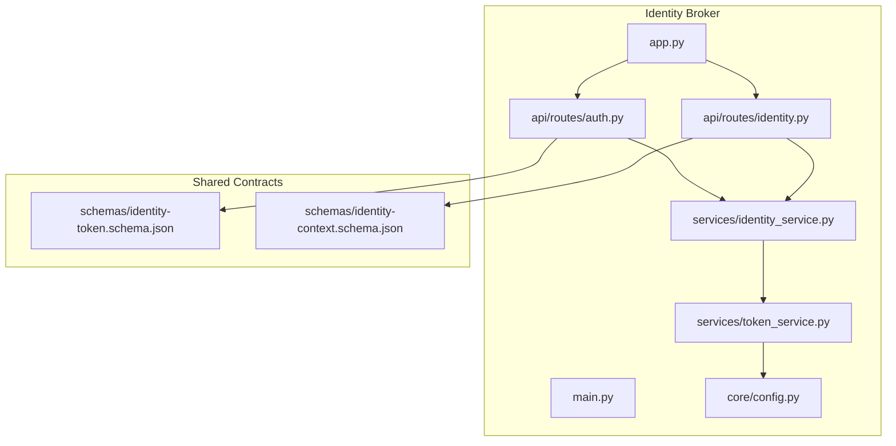
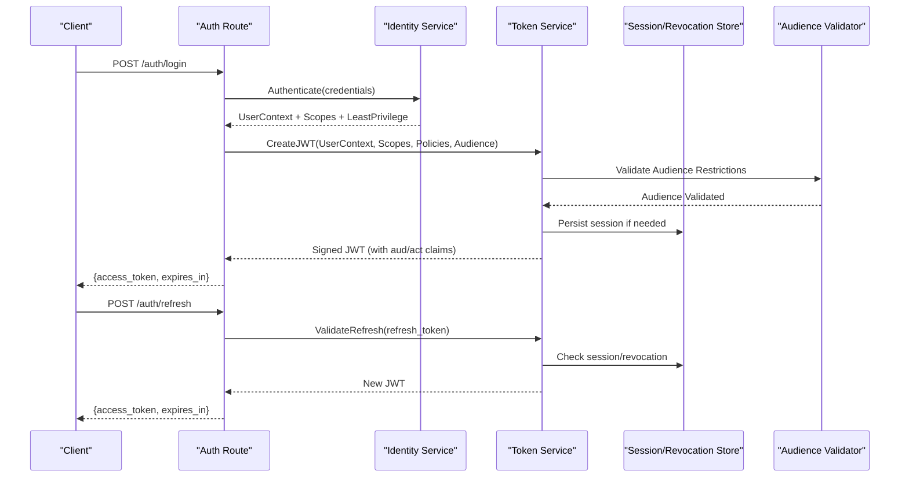
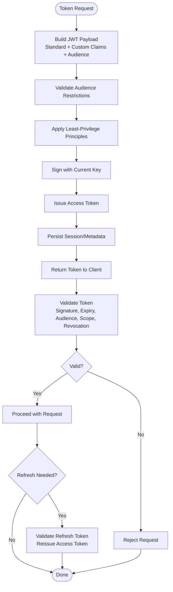
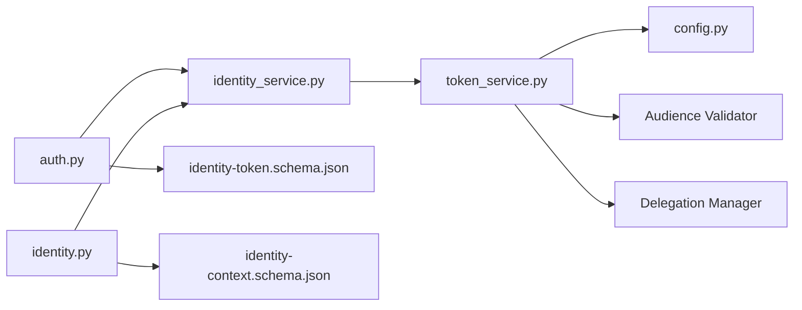

# Token Management and JWT Handling

<cite>
**Referenced Files in This Document**
- [identity_service.py](file://products/identity-broker/src/identity_service/services/identity_service.py)
- [token_service.py](file://products/identity-broker/src/identity_service/services/token_service.py)
- [auth.py](file://products/identity-broker/src/identity_service/api/routes/auth.py)
- [identity.py](file://products/identity-broker/src/identity_service/api/routes/identity.py)
- [config.py](file://products/identity-broker/src/identity_service/core/config.py)
- [app.py](file://products/identity-broker/src/identity_service/app.py)
- [main.py](file://products/identity-broker/src/identity_service/main.py)
- [identity-token.schema.json](file://shared/shared-contracts/schemas/identity-token.schema.json)
- [identity-context.schema.json](file://shared/shared-contracts/schemas/identity-context.schema.json)
- [broker-mediated-token-delegation.adr.md](file://docs/adr/0004-broker-mediated-token-delegation.md)
- [test_token_service.py](file://products/identity-broker/tests/test_token_service.py)
- [test_identity_service.py](file://products/identity-broker/tests/test_identity_service.py)
</cite>

## Update Summary
**Changes Made**
- Enhanced audience validation with strict aud claim enforcement
- Added delegated token generation with aud/act claims for service-to-service communication
- Implemented least-privilege principles maintaining sub/username/roles without elevation
- Updated token lifecycle to include audience verification and delegation workflows
- Enhanced security posture with improved scope limitations and transmission security

## Table of Contents
1. [Introduction](#introduction)
2. [Project Structure](#project-structure)
3. [Core Components](#core-components)
4. [Architecture Overview](#architecture-overview)
5. [Detailed Component Analysis](#detailed-component-analysis)
6. [Dependency Analysis](#dependency-analysis)
7. [Performance Considerations](#performance-considerations)
8. [Troubleshooting Guide](#troubleshooting-guide)
9. [Conclusion](#conclusion)
10. [Appendices](#appendices)

## Introduction
This document explains token management and JWT handling in the Identity Broker Service. It covers the full token lifecycle (generation, signing, validation, refresh, revocation), JWT structure and custom claims, cryptographic operations, key rotation strategies, secure storage, middleware for validation, and best practices for security. The system now includes enhanced audience validation, delegated token generation capabilities, and least-privilege principles that maintain user identity without privilege escalation.

## Project Structure
The Identity Broker Service is implemented under products/identity-broker. Key modules include:
- API routes for authentication and identity endpoints
- Services for identity orchestration and token operations
- Core configuration and runtime setup
- Shared schemas defining token and context payloads
- ADR describing broker-mediated token delegation

**Diagram sources**
- [app.py](file://products/identity-broker/src/identity_service/app.py)
- [main.py](file://products/identity-broker/src/identity_service/main.py)
- [auth.py](file://products/identity-broker/src/identity_service/api/routes/auth.py)
- [identity.py](file://products/identity-broker/src/identity_service/api/routes/identity.py)
- [identity_service.py](file://products/identity-broker/src/identity_service/services/identity_service.py)
- [token_service.py](file://products/identity-broker/src/identity_service/services/token_service.py)
- [config.py](file://products/identity-broker/src/identity_service/core/config.py)
- [identity-token.schema.json](file://shared/shared-contracts/schemas/identity-token.schema.json)
- [identity-context.schema.json](file://shared/shared-contracts/schemas/identity-context.schema.json)

**Section sources**
- [app.py](file://products/identity-broker/src/identity_service/app.py)
- [main.py](file://products/identity-broker/src/identity_service/main.py)
- [auth.py](file://products/identity-broker/src/identity_service/api/routes/auth.py)
- [identity.py](file://products/identity-broker/src/identity_service/api/routes/identity.py)
- [identity_service.py](file://products/identity-broker/src/identity_service/services/identity_service.py)
- [token_service.py](file://products/identity-broker/src/identity_service/services/token_service.py)
- [config.py](file://products/identity-broker/src/identity_service/core/config.py)
- [identity-token.schema.json](file://shared/shared-contracts/schemas/identity-token.schema.json)
- [identity-context.schema.json](file://shared/shared-contracts/schemas/identity-context.schema.json)

## Core Components
- Identity Service: Orchestrates authentication flows, composes identities, and delegates to the token service for issuance and validation with enhanced audience validation.
- Token Service: Implements JWT creation, signing, verification, refresh, and revocation logic; manages keys, metadata, and delegated token generation with aud/act claims.
- Auth Routes: Expose endpoints for login, token issuance, refresh, and introspection with audience verification.
- Identity Routes: Provide identity resolution and context enrichment using validated tokens with least-privilege enforcement.
- Configuration: Holds cryptographic settings, expiration policies, audience restrictions, and storage backends.

Key responsibilities:
- Generate signed JWTs with standard and custom claims including audience validation
- Validate tokens against current keys, audiences, and policies
- Support refresh workflows and short-lived access tokens with delegation capabilities
- Enforce revocation via token metadata or external stores
- Maintain least-privilege principles without elevating user permissions
- Persist session state where applicable

**Section sources**
- [identity_service.py](file://products/identity-broker/src/identity_service/services/identity_service.py)
- [token_service.py](file://products/identity-broker/src/identity_service/services/token_service.py)
- [auth.py](file://products/identity-broker/src/identity_service/api/routes/auth.py)
- [identity.py](file://products/identity-broker/src/identity_service/api/routes/identity.py)
- [config.py](file://products/identity-broker/src/identity_service/core/config.py)

## Architecture Overview
The Identity Broker issues and validates JWTs on behalf of clients and downstream services with enhanced security features. The flow includes:
- Client authenticates via auth routes with audience validation
- Identity service resolves user context, scopes, and applies least-privilege principles
- Token service signs and returns a JWT with proper aud/act claims for delegation
- Downstream services validate tokens using public keys, audiences, and shared secrets
- Refresh endpoint reissues tokens based on refresh tokens or session state
- Revocation is enforced through metadata and optional external revocation lists

**Diagram sources**
- [auth.py](file://products/identity-broker/src/identity_service/api/routes/auth.py)
- [identity_service.py](file://products/identity-broker/src/identity_service/services/identity_service.py)
- [token_service.py](file://products/identity-broker/src/identity_service/services/token_service.py)

## Detailed Component Analysis

### Enhanced Token Lifecycle
- Generation: Token service constructs a JWT payload with standard claims (iss, sub, iat, exp, jti) and custom claims derived from identity context and policy decisions. Signing uses configured algorithms and keys with audience validation.
- Validation: Middleware or downstream services verify signature, expiry, issuer, audience, and scope constraints. Optional checks include revocation status and delegated token verification.
- Refresh: Refresh tokens are validated against stored sessions or token metadata. On success, a new access token is issued with updated expiry and possibly adjusted scopes while maintaining least-privilege.
- Revocation: Tokens can be revoked by marking them in a store or updating metadata. Validation rejects revoked tokens immediately with proper error handling.

**Diagram sources**
- [token_service.py](file://products/identity-broker/src/identity_service/services/token_service.py)
- [auth.py](file://products/identity-broker/src/identity_service/api/routes/auth.py)

**Section sources**
- [token_service.py](file://products/identity-broker/src/identity_service/services/token_service.py)
- [auth.py](file://products/identity-broker/src/identity_service/api/routes/auth.py)

### JWT Structure and Custom Claims
- Standard claims: iss, sub, iat, exp, jti, aud (as applicable)
- Custom claims: Derived from identity context such as roles, permissions, tenant identifiers, and policy decisions
- Delegation claims: act (acting party) and aud (audience) for service-to-service communication
- Metadata: Includes token versioning, algorithm hints, and revocation flags when necessary

Schema references define expected fields and types for tokens and identity contexts with enhanced audience support.

**Section sources**
- [identity-token.schema.json](file://shared/shared-contracts/schemas/identity-token.schema.json)
- [identity-context.schema.json](file://shared/shared-contracts/schemas/identity-context.schema.json)
- [identity_service.py](file://products/identity-broker/src/identity_service/services/identity_service.py)
- [token_service.py](file://products/identity-broker/src/identity_service/services/token_service.py)

### Enhanced Token Service Implementation
Responsibilities:
- Cryptographic operations: Signing and verifying JWTs using configured algorithms and keys
- Key management: Loading keys, supporting multiple active keys, and rotating keys safely
- Secure storage: Persisting sessions and revocation state in a reliable backend
- Policy enforcement: Applying expiration policies, scope limitations, and audience checks
- Delegation support: Generating tokens with aud/act claims for secure service-to-service communication
- Least-privilege enforcement: Maintaining user identity without elevating permissions

Implementation patterns:
- Factory or provider pattern for key loading and rotation
- Centralized error handling for invalid signatures, expired tokens, and revocation
- Config-driven behavior for algorithms, lifetimes, and storage backends
- Audience validation middleware for strict access control

**Section sources**
- [token_service.py](file://products/identity-broker/src/identity_service/services/token_service.py)
- [config.py](file://products/identity-broker/src/identity_service/core/config.py)

### Authentication and Validation Middleware
- Auth routes expose login and refresh endpoints with audience validation
- Validation middleware verifies incoming tokens before processing requests
- Custom claim injection enriches request context with identity attributes and scopes
- Least-privilege enforcement ensures no permission escalation occurs

Best practices:
- Short-lived access tokens with refresh tokens for longer sessions
- Strict audience and scope validation
- Consistent error responses for unauthorized or invalid requests
- Secure transmission over TLS with proper headers

**Section sources**
- [auth.py](file://products/identity-broker/src/identity_service/api/routes/auth.py)
- [identity.py](file://products/identity-broker/src/identity_service/api/routes/identity.py)

### Key Rotation Strategies
- Maintain multiple active keys during rotation windows
- Prefer asymmetric algorithms for cross-service verification
- Update validators to accept both old and new keys temporarily
- Ensure backward compatibility for in-flight tokens
- Support audience-specific key management for delegated tokens

**Section sources**
- [token_service.py](file://products/identity-broker/src/identity_service/services/token_service.py)
- [config.py](file://products/identity-broker/src/identity_service/core/config.py)

### Secure Storage Mechanisms
- Sessions: Persisted securely with encryption at rest and integrity checks
- Revocation lists: Stored in a fast-access backend with TTL and consistency guarantees
- Secrets management: Keys and sensitive configuration loaded from secure vaults
- Audience mappings: Secure storage for audience-restricted token configurations

**Section sources**
- [token_service.py](file://products/identity-broker/src/identity_service/services/token_service.py)
- [config.py](file://products/identity-broker/src/identity_service/core/config.py)

### Relationship Between Tokens and Sessions
- Tokens may reference session identifiers for server-side state
- Session persistence enables revocation and refresh workflows
- Cleanup procedures remove expired sessions and stale revocation entries
- Audience-specific session management for delegated tokens

**Section sources**
- [identity_service.py](file://products/identity-broker/src/identity_service/services/identity_service.py)
- [token_service.py](file://products/identity-broker/src/identity_service/services/token_service.py)

### Examples of Token Creation, Validation, and Custom Claim Injection
- Token creation: Use identity context and policies to build claims with audience validation, then sign and return
- Validation middleware: Verify signature, expiry, audience, and scopes; reject invalid tokens
- Custom claim injection: Add roles, permissions, and tenant info into request context after validation
- Delegation support: Generate tokens with aud/act claims for secure service-to-service communication

**Section sources**
- [auth.py](file://products/identity-broker/src/identity_service/api/routes/auth.py)
- [identity_service.py](file://products/identity-broker/src/identity_service/services/identity_service.py)
- [token_service.py](file://products/identity-broker/src/identity_service/services/token_service.py)

## Dependency Analysis
The Identity Broker depends on shared schemas and internal services to enforce consistent token contracts and behaviors with enhanced audience validation.

**Diagram sources**
- [auth.py](file://products/identity-broker/src/identity_service/api/routes/auth.py)
- [identity.py](file://products/identity-broker/src/identity_service/api/routes/identity.py)
- [identity_service.py](file://products/identity-broker/src/identity_service/services/identity_service.py)
- [token_service.py](file://products/identity-broker/src/identity_service/services/token_service.py)
- [config.py](file://products/identity-broker/src/identity_service/core/config.py)
- [identity-token.schema.json](file://shared/shared-contracts/schemas/identity-token.schema.json)
- [identity-context.schema.json](file://shared/shared-contracts/schemas/identity-context.schema.json)

**Section sources**
- [auth.py](file://products/identity-broker/src/identity_service/api/routes/auth.py)
- [identity.py](file://products/identity-broker/src/identity_service/api/routes/identity.py)
- [identity_service.py](file://products/identity-broker/src/identity_service/services/identity_service.py)
- [token_service.py](file://products/identity-broker/src/identity_service/services/token_service.py)
- [config.py](file://products/identity-broker/src/identity_service/core/config.py)
- [identity-token.schema.json](file://shared/shared-contracts/schemas/identity-token.schema.json)
- [identity-context.schema.json](file://shared/shared-contracts/schemas/identity-context.schema.json)

## Performance Considerations
- Minimize payload size by limiting custom claims to essential data
- Cache public keys and validation results where appropriate
- Use efficient storage backends for sessions and revocation lists
- Implement rate limiting on auth endpoints to prevent abuse
- Optimize audience validation with caching mechanisms
- Balance security checks with performance requirements

## Troubleshooting Guide
Common issues and resolutions:
- Invalid signature: Verify key alignment and algorithm configuration
- Expired tokens: Adjust expiration policies and ensure timely refresh
- Revoked tokens: Check revocation store consistency and TTL settings
- Missing scopes: Review identity context and policy decisions during issuance
- Audience validation failures: Verify audience configuration and token claims
- Delegation errors: Check aud/act claim configuration and service permissions

Use tests to validate token flows and edge cases.

**Section sources**
- [test_token_service.py](file://products/identity-broker/tests/test_token_service.py)
- [test_identity_service.py](file://products/identity-broker/tests/test_identity_service.py)

## Conclusion
The Identity Broker Service implements robust token management and JWT handling with clear separation of concerns across services and routes. With enhanced audience validation, delegated token generation capabilities, and least-privilege principles, it supports secure issuance, validation, refresh, and revocation while adhering to shared schemas and best practices. Proper configuration, key rotation, and storage mechanisms ensure reliability and security across the platform.

## Appendices

### Security Best Practices
- Enforce short-lived access tokens and long-lived refresh tokens
- Limit scopes to minimum required permissions following least-privilege principles
- Validate audiences and issuers strictly with proper error handling
- Transmit tokens over secure channels (TLS) with proper headers
- Rotate keys regularly and maintain backward compatibility
- Implement proper delegation with aud/act claims for service-to-service communication
- Monitor and audit token usage for security compliance

**Section sources**
- [broker-mediated-token-delegation.adr.md](file://docs/adr/0004-broker-mediated-token-delegation.md)
- [config.py](file://products/identity-broker/src/identity_service/core/config.py)

### Audience Validation Configuration
- Configure allowed audiences per service or application
- Validate audience claims during token verification
- Handle audience mismatches with appropriate error responses
- Support dynamic audience configuration updates

### Delegation Token Guidelines
- Use aud/act claims for secure service-to-service communication
- Limit delegation scope to minimum required permissions
- Implement proper token chaining with audience validation
- Monitor and audit delegated token usage

### Least-Privilege Implementation
- Maintain original user identity (sub/username/roles) without elevation
- Apply role-based access control consistently
- Validate permissions at each service boundary
- Audit privilege escalation attempts