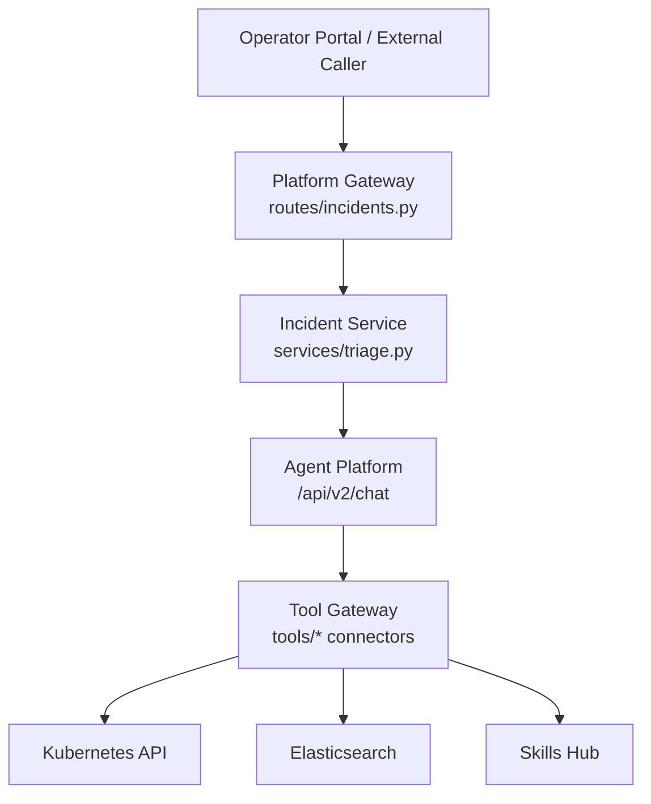
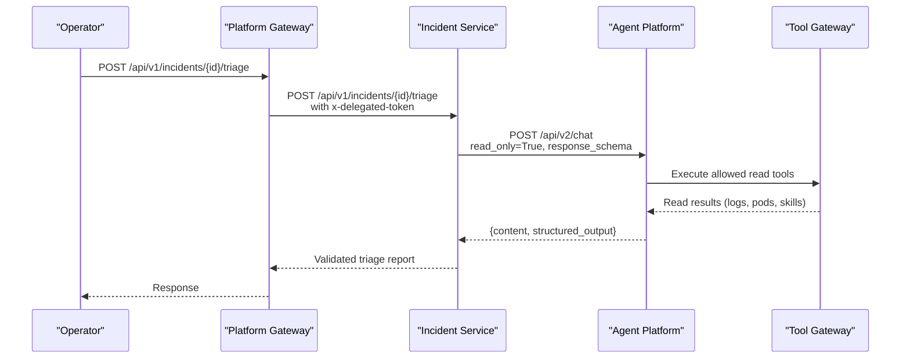
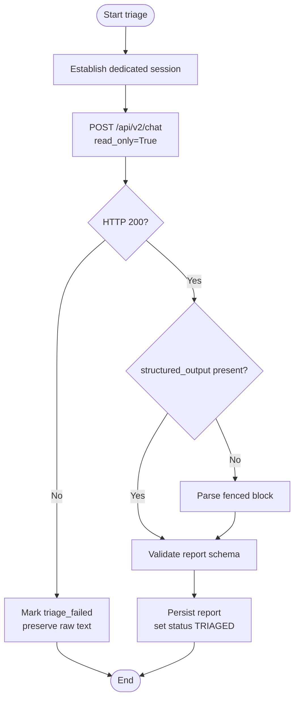
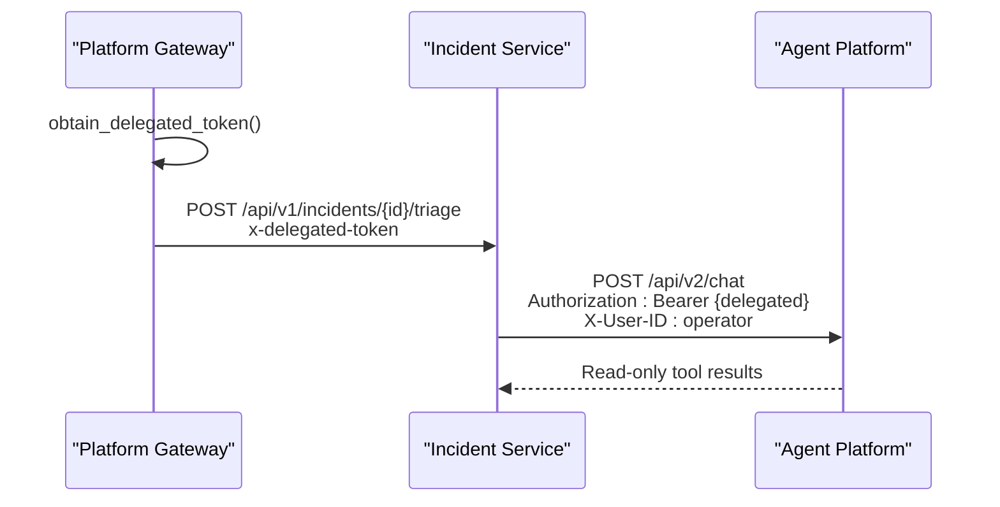
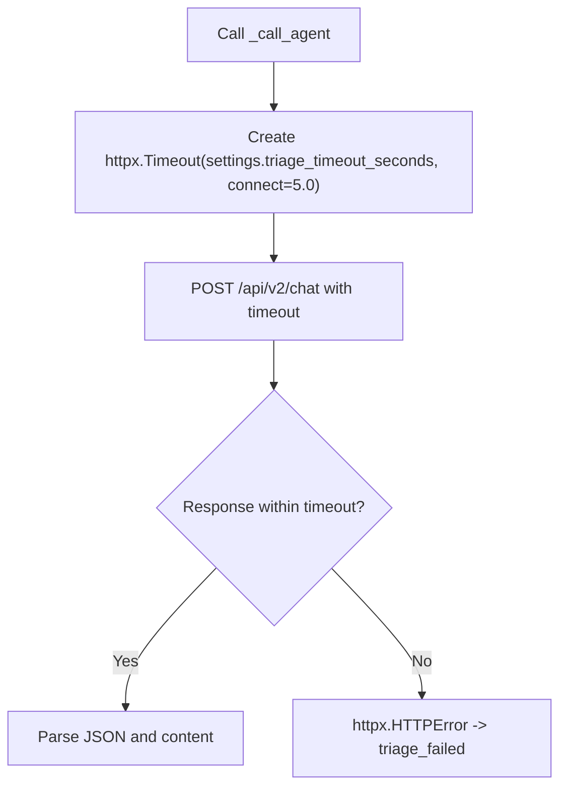
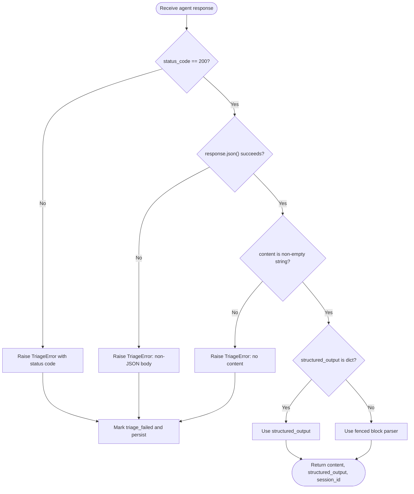
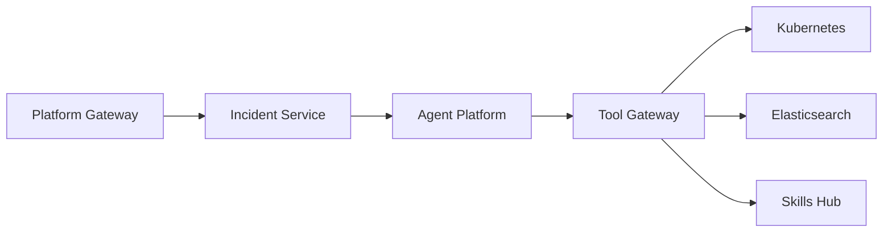

# Agent Execution and Tool Restrictions

<cite>
**Referenced Files in This Document**
- [triage.py](file://products/incident-service/src/incident_service/services/triage.py)
- [incident_client.py](file://products/platform-gateway/src/platform_gateway/services/incident_client.py)
- [incidents.py](file://products/platform-gateway/src/platform_gateway/api/routes/incidents.py)
- [k8s_connector.py](file://products/tool-gateway/src/tool_gateway/tools/k8s_connector.py)
- [elastic_connector.py](file://products/tool-gateway/src/tool_gateway/tools/elastic_connector.py)
- [skills_connector.py](file://products/tool-gateway/src/tool_gateway/tools/skills_connector.py)
- [tool_configuration.md](file://docs/guides/tool-configuration.md)
- [test_triage.py](file://products/incident-service/tests/test_triage.py)
</cite>

## Table of Contents
1. Introduction
2. Project Structure
3. Core Components
4. Architecture Overview
5. Detailed Component Analysis
6. Dependency Analysis
7. Performance Considerations
8. Troubleshooting Guide
9. Conclusion

## Introduction
This document explains how the agent execution environment enforces strict read-only constraints during triage runs. It focuses on how the incident service calls the agent platform, how tool restrictions prevent mutations, how timeouts and bearer token delegation are configured, and how errors are handled when HTTP responses fail, contain non-JSON bodies, or lack expected content. The goal is to show how triage remains a safe, evidence-gathering operation that can use approved diagnostic tools without risking accidental system changes.

## Project Structure
The triage flow spans three services:
- Platform gateway: authenticates the operator, obtains a delegated token, and forwards the triage request to the incident service.
- Incident service: orchestrates one agent turn against the agent platform’s chat endpoint with read-only enforcement and parses the result into a validated report.
- Tool gateway (used by agent-platform): exposes read-only tools such as Kubernetes get operations, Elastic search, and skills search; mutating tools like pod deletion exist but are excluded from triage turns.



**Diagram sources**
- [incidents.py:190-225](file://products/platform-gateway/src/platform_gateway/api/routes/incidents.py#L190-L225)
- [incident_client.py:168-192](file://products/platform-gateway/src/platform_gateway/services/incident_client.py#L168-L192)
- [triage.py:219-276](file://products/incident-service/src/incident_service/services/triage.py#L219-L276)
- [k8s_connector.py:278-326](file://products/tool-gateway/src/tool_gateway/tools/k8s_connector.py#L278-L326)
- [elastic_connector.py:291-326](file://products/tool-gateway/src/tool_gateway/tools/elastic_connector.py#L291-L326)
- [skills_connector.py:158-245](file://products/tool-gateway/src/tool_gateway/tools/skills_connector.py#L158-L245)

**Section sources**
- [incidents.py:190-225](file://products/platform-gateway/src/platform_gateway/api/routes/incidents.py#L190-L225)
- [incident_client.py:168-192](file://products/platform-gateway/src/platform_gateway/services/incident_client.py#L168-L192)
- [triage.py:219-276](file://products/incident-service/src/incident_service/services/triage.py#L219-L276)

## Core Components
- Triage orchestration: builds a prompt for a single agent turn, establishes a dedicated session, posts to the agent platform chat endpoint with read-only enforcement, and validates the response into a triage report.
- Token delegation: the platform gateway obtains a delegated bearer token and passes it downstream so the agent turn executes under operator authority while remaining read-only.
- Tool set: only read-tier tools are effective in triage because the agent platform strips non-read tools for this turn. Approved diagnostic tools include k8s.get_pod, elastic.search_logs, and skills.search. Mutating tools such as k8s.delete_pod are not available in triage.
- Timeouts: the incident service configures a per-turn timeout via settings.triage_timeout_seconds and a short connect timeout to avoid hanging requests.
- Error handling: HTTP failures, non-JSON responses, and missing content are captured and recorded as triage failures while preserving raw text for diagnostics.

**Section sources**
- [triage.py:219-276](file://products/incident-service/src/incident_service/services/triage.py#L219-L276)
- [incidents.py:190-225](file://products/platform-gateway/src/platform_gateway/api/routes/incidents.py#L190-L225)
- [incident_client.py:168-192](file://products/platform-gateway/src/platform_gateway/services/incident_client.py#L168-L192)
- [k8s_connector.py:278-326](file://products/tool-gateway/src/tool_gateway/tools/k8s_connector.py#L278-L326)
- [elastic_connector.py:291-326](file://products/tool-gateway/src/tool_gateway/tools/elastic_connector.py#L291-L326)
- [skills_connector.py:158-245](file://products/tool-gateway/src/tool_gateway/tools/skills_connector.py#L158-L245)
- [tool_configuration.md:25-39](file://docs/guides/tool-configuration.md#L25-L39)

## Architecture Overview
The triage run is a single-turn, read-only conversation anchored to an incident-scoped session. The incident service:
1. Establishes a dedicated session for the incident.
2. Posts to the agent platform chat endpoint with message, session_id, response_schema, and read_only=True.
3. Receives either structured_output (preferred) or a fenced block fallback.
4. Validates and persists the triage report.



**Diagram sources**
- [incidents.py:190-225](file://products/platform-gateway/src/platform_gateway/api/routes/incidents.py#L190-L225)
- [incident_client.py:168-192](file://products/platform-gateway/src/platform_gateway/services/incident_client.py#L168-L192)
- [triage.py:219-276](file://products/incident-service/src/incident_service/services/triage.py#L219-L276)
- [k8s_connector.py:278-326](file://products/tool-gateway/src/tool_gateway/tools/k8s_connector.py#L278-L326)
- [elastic_connector.py:291-326](file://products/tool-gateway/src/tool_gateway/tools/elastic_connector.py#L291-L326)
- [skills_connector.py:158-245](file://products/tool-gateway/src/tool_gateway/tools/skills_connector.py#L158-L245)

## Detailed Component Analysis

### Triage Orchestration and Read-Only Enforcement
The incident service’s triage function performs one agent turn:
- Builds a dedicated session per incident and tries a per-operator fallback if needed.
- Sends a chat request with read_only=True, which instructs the agent platform to strip non-read tools from the turn’s toolkit.
- Requests structured output using the triage report schema; falls back to parsing a fenced block if structured_output is absent.
- Marks the incident triage_failed on any error and preserves raw text for debugging.



**Diagram sources**
- [triage.py:189-216](file://products/incident-service/src/incident_service/services/triage.py#L189-L216)
- [triage.py:219-276](file://products/incident-service/src/incident_service/services/triage.py#L219-L276)
- [triage.py:290-371](file://products/incident-service/src/incident_service/services/triage.py#L290-L371)

**Section sources**
- [triage.py:189-216](file://products/incident-service/src/incident_service/services/triage.py#L189-L216)
- [triage.py:219-276](file://products/incident-service/src/incident_service/services/triage.py#L219-L276)
- [triage.py:290-371](file://products/incident-service/src/incident_service/services/triage.py#L290-L371)

### Bearer Token Delegation and Operator Identity
- The platform gateway route obtains a delegated token and requires it for triage; without it, the request fails fast with a 503.
- The incident client forwards the delegated token in headers so the agent turn retains operator permissions while operating within read-only bounds enforced by read_only=True.
- The incident service attaches the operator identity and request ID to the agent call headers.



**Diagram sources**
- [incidents.py:190-225](file://products/platform-gateway/src/platform_gateway/api/routes/incidents.py#L190-L225)
- [incident_client.py:168-192](file://products/platform-gateway/src/platform_gateway/services/incident_client.py#L168-L192)
- [triage.py:219-276](file://products/incident-service/src/incident_service/services/triage.py#L219-L276)

**Section sources**
- [incidents.py:190-225](file://products/platform-gateway/src/platform_gateway/api/routes/incidents.py#L190-L225)
- [incident_client.py:168-192](file://products/platform-gateway/src/platform_gateway/services/incident_client.py#L168-L192)
- [triage.py:219-276](file://products/incident-service/src/incident_service/services/triage.py#L219-L276)

### Tool Restrictions During Triage
During triage, the agent platform receives read_only=True and strips non-read tools from the turn’s toolkit. This prevents any mutating action from executing or being parked for later approval in this context.

Approved diagnostic tools used in triage:
- k8s.get_pod: reads pod details; risk_level is read.
- elastic.search_logs: searches logs; risk_level is read.
- skills.search: searches operational skills and runbooks; risk_level is read.

Mutating tools are excluded from triage:
- k8s.delete_pod: write-risk tool that deletes a pod; not available in triage due to read_only enforcement.

```mermaid
classDiagram
class GetPodTool {
+definition : ToolDefinition
+execute(parameters, identity) : ToolResult
}
class DeletePodTool {
+definition : ToolDefinition
+execute(parameters, identity) : ToolResult
}
class ElasticSearchTool {
+definition : ToolDefinition
+execute(parameters, identity) : ToolResult
}
class SkillsSearchTool {
+definition : ToolDefinition
+execute(parameters, identity) : ToolResult
}
GetPodTool -->|risk_level="read"| ElasticSearchTool
SkillsSearchTool -->|risk_level="read"| GetPodTool
DeletePodTool -->|risk_level="write"| GetPodTool
```

**Diagram sources**
- [k8s_connector.py:278-326](file://products/tool-gateway/src/tool_gateway/tools/k8s_connector.py#L278-L326)
- [k8s_connector.py:447-483](file://products/tool-gateway/src/tool_gateway/tools/k8s_connector.py#L447-L483)
- [elastic_connector.py:291-326](file://products/tool-gateway/src/tool_gateway/tools/elastic_connector.py#L291-L326)
- [skills_connector.py:158-245](file://products/tool-gateway/src/tool_gateway/tools/skills_connector.py#L158-L245)

**Section sources**
- [triage.py:219-276](file://products/incident-service/src/incident_service/services/triage.py#L219-L276)
- [k8s_connector.py:278-326](file://products/tool-gateway/src/tool_gateway/tools/k8s_connector.py#L278-L326)
- [k8s_connector.py:447-483](file://products/tool-gateway/src/tool_gateway/tools/k8s_connector.py#L447-L483)
- [elastic_connector.py:291-326](file://products/tool-gateway/src/tool_gateway/tools/elastic_connector.py#L291-L326)
- [skills_connector.py:158-245](file://products/tool-gateway/src/tool_gateway/tools/skills_connector.py#L158-L245)
- [tool_configuration.md:25-39](file://docs/guides/tool-configuration.md#L25-L39)

### Timeout Configuration
- The incident service constructs an httpx timeout using settings.triage_timeout_seconds with a fixed connect timeout to ensure the chat call does not hang indefinitely.
- The platform gateway also applies its own timeout when calling the incident service, isolating end-to-end latency concerns.



**Diagram sources**
- [triage.py:219-276](file://products/incident-service/src/incident_service/services/triage.py#L219-L276)
- [incident_client.py:168-192](file://products/platform-gateway/src/platform_gateway/services/incident_client.py#L168-L192)

**Section sources**
- [triage.py:219-276](file://products/incident-service/src/incident_service/services/triage.py#L219-L276)
- [incident_client.py:168-192](file://products/platform-gateway/src/platform_gateway/services/incident_client.py#L168-L192)

### Error Handling for HTTP, Non-JSON, and Missing Content
- HTTP failures: non-200 responses from the agent platform raise a triage error; upstream transport errors are caught and converted to triage failures.
- Non-JSON responses: attempting to parse a non-JSON body raises a triage error.
- Missing content: if the response lacks a string content field, a triage error is raised.
- All failures mark the incident triage_failed and preserve raw text up to a bounded size for auditability.



**Diagram sources**
- [triage.py:219-276](file://products/incident-service/src/incident_service/services/triage.py#L219-L276)
- [triage.py:290-371](file://products/incident-service/src/incident_service/services/triage.py#L290-L371)

**Section sources**
- [triage.py:219-276](file://products/incident-service/src/incident_service/services/triage.py#L219-L276)
- [triage.py:290-371](file://products/incident-service/src/incident_service/services/triage.py#L290-L371)

### Evidence Gathering Through Approved Read-Only Toolsets
Triage relies on approved read-only tools to gather actionable evidence:
- Kubernetes read tools (e.g., k8s.get_pod) provide live cluster state without changing resources.
- Elastic search tools enable log queries to correlate symptoms and timelines.
- Skills search locates runbooks and procedures to ground next steps in documented guidance.

These tools are safe in triage because read_only=True ensures only read-tier tools are available to the agent turn.

**Section sources**
- [k8s_connector.py:278-326](file://products/tool-gateway/src/tool_gateway/tools/k8s_connector.py#L278-L326)
- [elastic_connector.py:291-326](file://products/tool-gateway/src/tool_gateway/tools/elastic_connector.py#L291-L326)
- [skills_connector.py:158-245](file://products/tool-gateway/src/tool_gateway/tools/skills_connector.py#L158-L245)
- [tool_configuration.md:25-39](file://docs/guides/tool-configuration.md#L25-L39)

## Dependency Analysis
The triage flow depends on:
- Platform gateway for authentication and delegation.
- Incident service for orchestration and validation.
- Agent platform for enforcing read-only tool sets per turn.
- Tool gateway for exposing read-only capabilities to the agent runtime.



**Diagram sources**
- [incidents.py:190-225](file://products/platform-gateway/src/platform_gateway/api/routes/incidents.py#L190-L225)
- [incident_client.py:168-192](file://products/platform-gateway/src/platform_gateway/services/incident_client.py#L168-L192)
- [triage.py:219-276](file://products/incident-service/src/incident_service/services/triage.py#L219-L276)
- [k8s_connector.py:278-326](file://products/tool-gateway/src/tool_gateway/tools/k8s_connector.py#L278-L326)
- [elastic_connector.py:291-326](file://products/tool-gateway/src/tool_gateway/tools/elastic_connector.py#L291-L326)
- [skills_connector.py:158-245](file://products/tool-gateway/src/tool_gateway/tools/skills_connector.py#L158-L245)

**Section sources**
- [incidents.py:190-225](file://products/platform-gateway/src/platform_gateway/api/routes/incidents.py#L190-L225)
- [incident_client.py:168-192](file://products/platform-gateway/src/platform_gateway/services/incident_client.py#L168-L192)
- [triage.py:219-276](file://products/incident-service/src/incident_service/services/triage.py#L219-L276)

## Performance Considerations
- Use settings.triage_timeout_seconds to bound the end-to-end agent turn duration and avoid long-running triage operations.
- Keep the connect timeout small to fail fast on network issues.
- Prefer structured_output when available to reduce parsing overhead and improve reliability.
- Limit tool result sizes at the tool level where applicable (e.g., max_results, time_range_minutes) to control payload sizes.

[No sources needed since this section provides general guidance]

## Troubleshooting Guide
Common triage failures and their causes:
- HTTP failure from agent platform: check the status code returned by the chat endpoint; triage marks the incident failed and preserves raw text.
- Non-JSON response: indicates unexpected content type; inspect agent platform logs and response headers.
- Missing content: the response must include a string content field; otherwise, triage fails.
- Session creation errors: if all candidate sessions are rejected, triage fails; verify ownership and availability of the agent platform session store.
- Delegated token unavailable: the platform gateway requires a valid delegated token for triage; ensure the delegation chain is established before invoking triage.

Validation and tests:
- The incident service test suite exercises the session establishment and chat call sequence, confirming that the correct endpoints are invoked and responses are processed.

**Section sources**
- [triage.py:219-276](file://products/incident-service/src/incident_service/services/triage.py#L219-L276)
- [triage.py:290-371](file://products/incident-service/src/incident_service/services/triage.py#L290-L371)
- [test_triage.py:219-257](file://products/incident-service/tests/test_triage.py#L219-L257)

## Conclusion
Triage runs are intentionally read-only to safely gather evidence without risking unintended mutations. The incident service enforces this by setting read_only=True on the agent platform chat call, delegating operator permissions through a bearer token, and applying strict timeouts. Only approved diagnostic tools are effective in triage, while mutating tools remain excluded. Robust error handling ensures failures are recorded with preserved context, enabling reliable triage outcomes and clear diagnostics.

[No sources needed since this section summarizes without analyzing specific files]