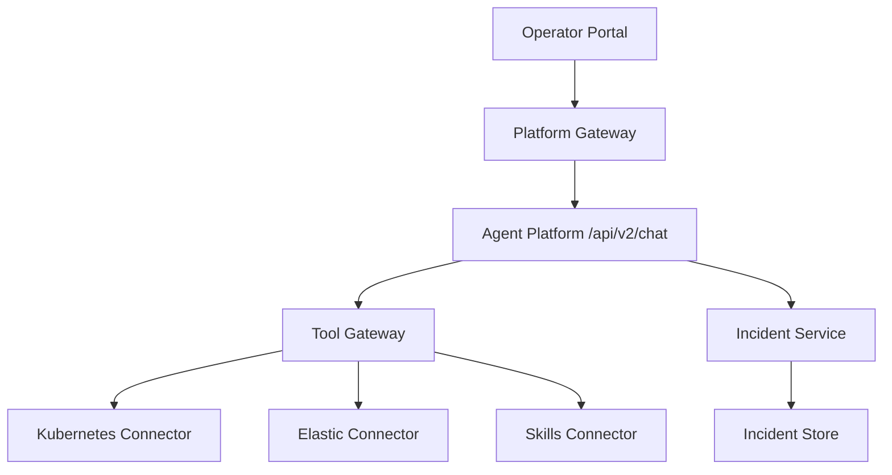
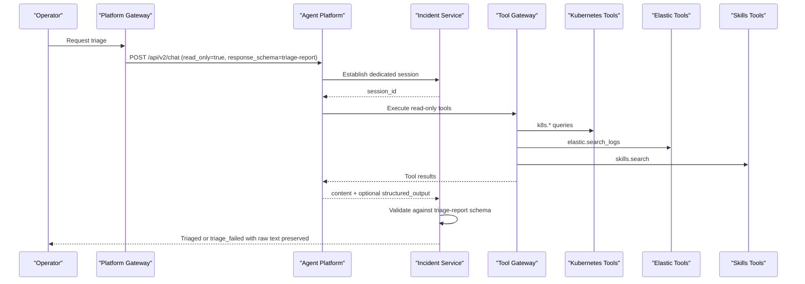
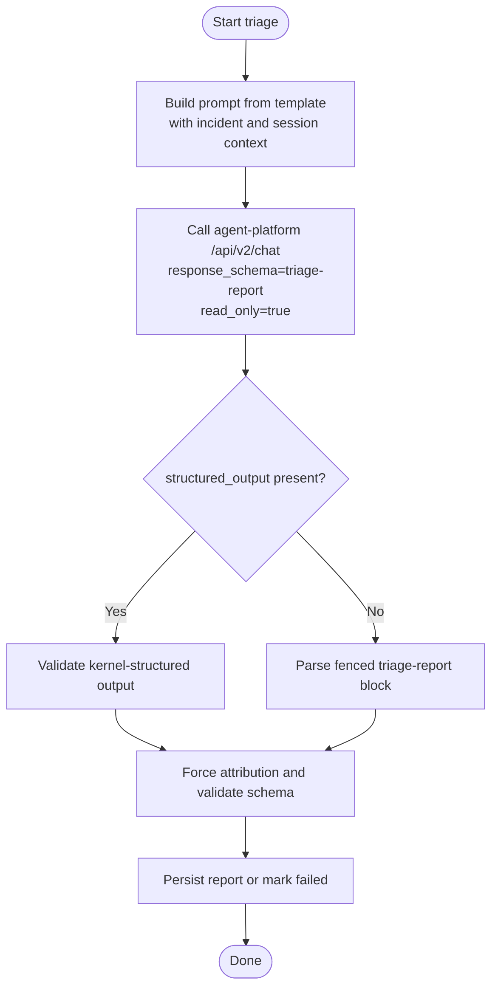
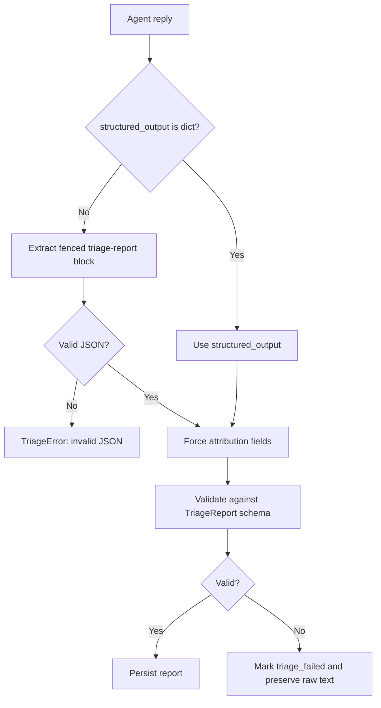
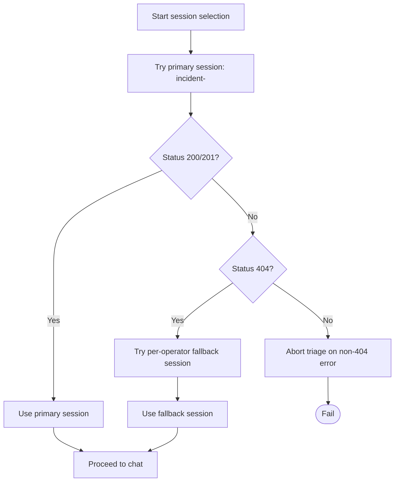
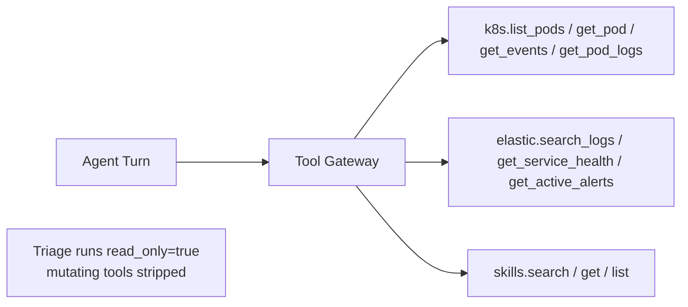
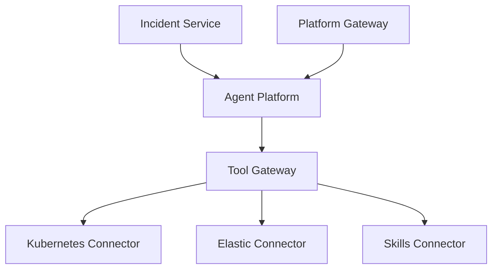

# Agent-Driven Triage Automation

<cite>
**Referenced Files in This Document**
- [triage.py](file://products/incident-service/src/incident_service/services/triage.py)
- [incident.py](file://products/incident-service/src/incident_service/schemas/incident.py)
- [config.py](file://products/incident-service/src/incident_service/core/config.py)
- [triage-report.schema.json](file://shared/shared-contracts/schemas/triage-report.schema.json)
- [test_triage.py](file://products/incident-service/tests/test_triage.py)
- [k8s_connector.py](file://products/tool-gateway/src/tool_gateway/tools/k8s_connector.py)
- [elastic_connector.py](file://products/tool-gateway/src/tool_gateway/tools/elastic_connector.py)
- [tool-configuration.md](file://docs/guides/tool-configuration.md)
- [app.py](file://products/tool-gateway/src/tool_gateway/app.py)
- [gateway_service.py](file://products/platform-gateway/src/platform_gateway/services/gateway_service.py)
</cite>

## Table of Contents
1. [Introduction](#introduction)
2. [Project Structure](#project-structure)
3. [Core Components](#core-components)
4. [Architecture Overview](#architecture-overview)
5. [Detailed Component Analysis](#detailed-component-analysis)
6. [Dependency Analysis](#dependency-analysis)
7. [Performance Considerations](#performance-considerations)
8. [Troubleshooting Guide](#troubleshooting-guide)
9. [Conclusion](#conclusion)

## Introduction
This document explains the agent-driven triage automation that transforms raw alerts into actionable intelligence. The incident-service orchestrates a single, read-only agent turn per incident to gather evidence, produce ranked hypotheses, and recommend advisory next steps. It creates dedicated sessions per incident, constructs prompts from a service template, calls the agent-platform chat API with read-only tool restrictions, validates structured output against the triage report schema, and preserves raw agent responses when triage fails for debugging.

## Project Structure
The triage flow spans three main areas:
- Incident service: session management, prompt construction, agent call orchestration, structured output validation, and result persistence.
- Tool gateway: read-only tools (k8s.*, elastic.*, skills.search) used by agents to collect evidence.
- Platform gateway: proxies operator requests to the agent platform chat endpoint.

**Diagram sources**
- [gateway_service.py:894-913](file://products/platform-gateway/src/platform_gateway/services/gateway_service.py#L894-L913)
- [triage.py:219-276](file://products/incident-service/src/incident_service/services/triage.py#L219-L276)
- [app.py:32-67](file://products/tool-gateway/src/tool_gateway/app.py#L32-L67)
- [k8s_connector.py:1-16](file://products/tool-gateway/src/tool_gateway/tools/k8s_connector.py#L1-L16)
- [elastic_connector.py:291-384](file://products/tool-gateway/src/tool_gateway/tools/elastic_connector.py#L291-L384)

**Section sources**
- [triage.py:1-14](file://products/incident-service/src/incident_service/services/triage.py#L1-L14)
- [gateway_service.py:894-913](file://products/platform-gateway/src/platform_gateway/services/gateway_service.py#L894-L913)
- [app.py:32-67](file://products/tool-gateway/src/tool_gateway/app.py#L32-L67)

## Core Components
- Triage orchestrator: builds prompts, establishes dedicated sessions, calls agent-platform chat with read-only mode, parses kernel-validated structured output or falls back to fenced block parsing, validates against the triage report schema, and persists results or failure state.
- Session manager: selects a shared incident session first for repeat triage by the owning operator, then falls back to a per-operator session when ownership is denied.
- Evidence tools: read-only tools exposed via the tool gateway (k8s.*, elastic.*, skills.search) that agents use to collect contextual information.
- Schema validator: enforces the canonical triage report contract before storage.

**Section sources**
- [triage.py:99-136](file://products/incident-service/src/incident_service/services/triage.py#L99-L136)
- [triage.py:147-186](file://products/incident-service/src/incident_service/services/triage.py#L147-L186)
- [triage.py:189-276](file://products/incident-service/src/incident_service/services/triage.py#L189-L276)
- [triage-report.schema.json:1-120](file://shared/shared-contracts/schemas/triage-report.schema.json#L1-L120)
- [tool-configuration.md:25-39](file://docs/guides/tool-configuration.md#L25-L39)

## Architecture Overview
The triage run is a single agent turn in a dedicated session. The incident-service:
1. Creates or reuses a dedicated session per incident.
2. Builds a prompt using the triage template.
3. Calls agent-platform /api/v2/chat with response_schema set to the triage report schema and read_only enabled.
4. Accepts kernel-validated structured_output when available; otherwise parses a fenced triage-report block.
5. Validates the final payload against the triage report schema and persists it.

**Diagram sources**
- [triage.py:219-276](file://products/incident-service/src/incident_service/services/triage.py#L219-L276)
- [gateway_service.py:894-913](file://products/platform-gateway/src/platform_gateway/services/gateway_service.py#L894-L913)
- [k8s_connector.py:1-16](file://products/tool-gateway/src/tool_gateway/tools/k8s_connector.py#L1-L16)
- [elastic_connector.py:291-384](file://products/tool-gateway/src/tool_gateway/tools/elastic_connector.py#L291-L384)
- [tool-configuration.md:25-39](file://docs/guides/tool-configuration.md#L25-L39)

## Detailed Component Analysis

### Triage Orchestrator and Prompt Construction
- The triage template instructs the agent to work read-only, gather evidence using allowed tools, search skills, ground hypotheses and next steps in evidence, and emit either a structured-output tool call or a fenced triage-report JSON block.
- The prompt includes incident metadata (id, source, severity, status, title, summary, labels) and operator/session context.

**Diagram sources**
- [triage.py:43-92](file://products/incident-service/src/incident_service/services/triage.py#L43-L92)
- [triage.py:147-186](file://products/incident-service/src/incident_service/services/triage.py#L147-L186)
- [triage.py:219-276](file://products/incident-service/src/incident_service/services/triage.py#L219-L276)

**Section sources**
- [triage.py:43-92](file://products/incident-service/src/incident_service/services/triage.py#L43-L92)
- [triage.py:147-186](file://products/incident-service/src/incident_service/services/triage.py#L147-L186)

### Structured Output Validation and Fallback Parsing
- Kernel-validated structured_output is preferred when present.
- When absent, the fallback parser extracts the last fenced triage-report block, parses JSON, forces server-minted attribution fields, and validates against the TriageReport model bound to the canonical schema.
- Any validation failure marks the incident triage_failed and preserves raw agent text for debugging.

**Diagram sources**
- [triage.py:147-186](file://products/incident-service/src/incident_service/services/triage.py#L147-L186)
- [incident.py:81-103](file://products/incident-service/src/incident_service/schemas/incident.py#L81-L103)
- [triage-report.schema.json:1-120](file://shared/shared-contracts/schemas/triage-report.schema.json#L1-L120)

**Section sources**
- [triage.py:147-186](file://products/incident-service/src/incident_service/services/triage.py#L147-L186)
- [incident.py:81-103](file://products/incident-service/src/incident_service/schemas/incident.py#L81-L103)
- [triage-report.schema.json:1-120](file://shared/shared-contracts/schemas/triage-report.schema.json#L1-L120)

### Session Management Strategy
- Dedicated session naming: incident-<incident_id>.
- Candidate order: primary shared session first, then per-operator fallback session named incident-<id>--<operator-slug>.
- If the primary session returns 404 (owned by another operator), the fallback is tried automatically. Non-404 errors abort triage immediately.
- This supports repeat triage by the same operator while allowing other operators to work independently.

**Diagram sources**
- [triage.py:99-119](file://products/incident-service/src/incident_service/services/triage.py#L99-L119)
- [triage.py:189-216](file://products/incident-service/src/incident_service/services/triage.py#L189-L216)

**Section sources**
- [triage.py:99-119](file://products/incident-service/src/incident_service/services/triage.py#L99-L119)
- [triage.py:189-216](file://products/incident-service/src/incident_service/services/triage.py#L189-L216)

### Evidence Gathering with Read-Only Tools
- Agents are instructed to use read-only tools only: k8s.*, elastic.*, skills.search, incidents.*.
- Tool gateway registers connectors based on configuration:
  - Kubernetes connector provides read-only tools (list pods, get pod, events, logs) and a mutating tool gated behind a feature flag.
  - Elastic connector provides read-only log search and health/alerts tools.
  - Skills connector provides read-only skill discovery and retrieval.
- During triage, agent-platform strips non-read tools for this turn so no mutating action can execute or park.

**Diagram sources**
- [triage.py:249-261](file://products/incident-service/src/incident_service/services/triage.py#L249-L261)
- [k8s_connector.py:1-16](file://products/tool-gateway/src/tool_gateway/tools/k8s_connector.py#L1-L16)
- [elastic_connector.py:291-384](file://products/tool-gateway/src/tool_gateway/tools/elastic_connector.py#L291-L384)
- [tool-configuration.md:25-39](file://docs/guides/tool-configuration.md#L25-L39)
- [app.py:32-67](file://products/tool-gateway/src/tool_gateway/app.py#L32-L67)

**Section sources**
- [triage.py:249-261](file://products/incident-service/src/incident_service/services/triage.py#L249-L261)
- [k8s_connector.py:1-16](file://products/tool-gateway/src/tool_gateway/tools/k8s_connector.py#L1-L16)
- [elastic_connector.py:291-384](file://products/tool-gateway/src/tool_gateway/tools/elastic_connector.py#L291-L384)
- [tool-configuration.md:25-39](file://docs/guides/tool-configuration.md#L25-L39)
- [app.py:32-67](file://products/tool-gateway/src/tool_gateway/app.py#L32-L67)

### Configuration, Timeouts, and Error Handling
- Triage timeout: configurable via INCIDENT_TRIAGE_TIMEOUT_SECONDS; defaults to 120 seconds.
- Agent service URL: configured via INCIDENT_AGENT_SERVICE_URL.
- On failure (network errors, non-200 responses, validation failures), the incident is marked triage_failed and the raw agent text is preserved in triage_raw for debugging.
- Tests verify read-only enforcement, structured output relay, and fallback session behavior.

**Section sources**
- [config.py:72-120](file://products/incident-service/src/incident_service/core/config.py#L72-L120)
- [triage.py:219-276](file://products/incident-service/src/incident_service/services/triage.py#L219-L276)
- [triage.py:279-349](file://products/incident-service/src/incident_service/services/triage.py#L279-L349)
- [test_triage.py:259-282](file://products/incident-service/tests/test_triage.py#L259-L282)
- [test_triage.py:312-345](file://products/incident-service/tests/test_triage.py#L312-L345)

## Dependency Analysis
- Incident service depends on:
  - Agent platform chat API for executing the triage turn.
  - Tool gateway for read-only tool execution during the agent turn.
  - Shared triage report schema for validation.
- Platform gateway proxies operator requests to agent platform.
- Tool gateway conditionally registers connectors based on environment flags.

**Diagram sources**
- [triage.py:219-276](file://products/incident-service/src/incident_service/services/triage.py#L219-L276)
- [gateway_service.py:894-913](file://products/platform-gateway/src/platform_gateway/services/gateway_service.py#L894-L913)
- [app.py:32-67](file://products/tool-gateway/src/tool_gateway/app.py#L32-L67)

**Section sources**
- [triage.py:219-276](file://products/incident-service/src/incident_service/services/triage.py#L219-L276)
- [gateway_service.py:894-913](file://products/platform-gateway/src/platform_gateway/services/gateway_service.py#L894-L913)
- [app.py:32-67](file://products/tool-gateway/src/tool_gateway/app.py#L32-L67)

## Performance Considerations
- Triage timeout protects against long-running agent turns; tune INCIDENT_TRIAGE_TIMEOUT_SECONDS based on expected tool latency and data volume.
- Read-only tool constraints reduce risk and simplify execution paths.
- Prefer kernel-validated structured_output to avoid extra parsing overhead and improve reliability.

[No sources needed since this section provides general guidance]

## Troubleshooting Guide
Common issues and how they are handled:
- No fenced triage-report block: raises a triage error indicating missing structured output.
- Invalid JSON in fenced block: reports the decode error.
- Schema validation failure: marks incident triage_failed with detailed validation message.
- Network or upstream errors: captures HTTP errors and marks triage_failed.
- Raw agent text preservation: triage_raw stores up to a bounded size for post-mortem analysis.

Operational checks:
- Verify INCIDENT_AGENT_SERVICE_URL and INCIDENT_TRIAGE_TIMEOUT_SECONDS are set correctly.
- Confirm tool gateway connectors are enabled for k8s, elastic, and skills if evidence gathering is required.
- Inspect triage_failed incidents and their triage_raw field to diagnose agent output issues.

**Section sources**
- [triage.py:139-186](file://products/incident-service/src/incident_service/services/triage.py#L139-L186)
- [triage.py:279-349](file://products/incident-service/src/incident_service/services/triage.py#L279-L349)
- [config.py:72-120](file://products/incident-service/src/incident_service/core/config.py#L72-L120)
- [app.py:32-67](file://products/tool-gateway/src/tool_gateway/app.py#L32-L67)

## Conclusion
The agent-driven triage automation provides a robust, read-only workflow that converts raw alerts into validated, actionable intelligence. It uses dedicated sessions per incident, constructs prompts from a service template, calls the agent-platform chat API with strict read-only restrictions, validates outputs against the canonical triage report schema, and preserves raw agent responses for debugging when triage fails. With configurable timeouts and clear error handling, it balances speed, safety, and observability for operational teams.