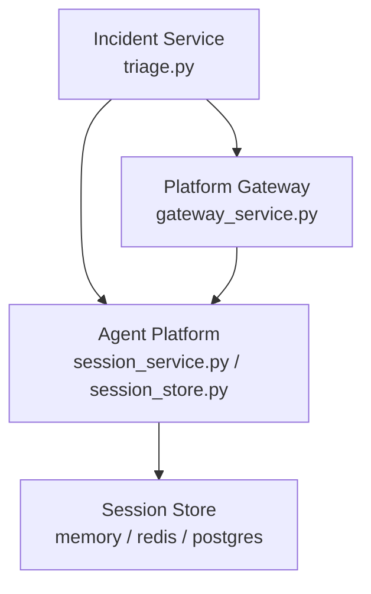
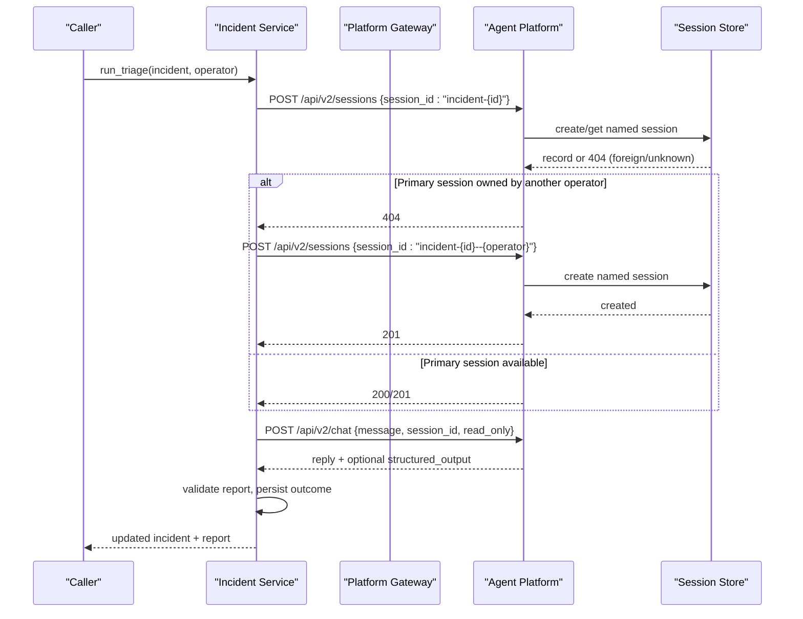
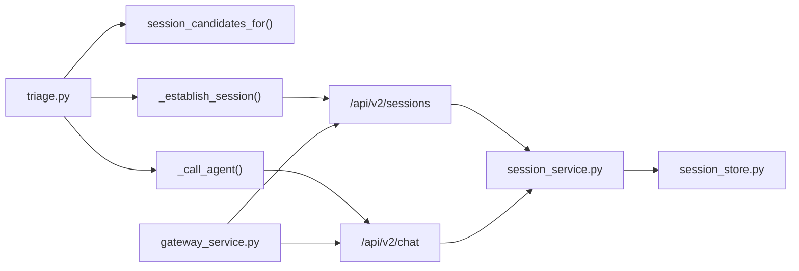

# Dedicated Session Management

<cite>
**Referenced Files in This Document**
- [triage.py](file://products/incident-service/src/incident_service/services/triage.py)
- [test_triage.py](file://products/incident-service/tests/test_triage.py)
- [session_store.py](file://products/agent-platform/src/agent_service/services/session_store.py)
- [session_service.py](file://products/agent-platform/src/agent_service/services/session_service.py)
- [gateway_service.py](file://products/platform-gateway/src/platform_gateway/services/gateway_service.py)
- [config.py](file://products/incident-service/src/incident_service/core/config.py)
- [README.md](file://products/agent-platform/README.md)
</cite>

## Table of Contents
1. [Introduction](#introduction)
2. [Project Structure](#project-structure)
3. [Core Components](#core-components)
4. [Architecture Overview](#architecture-overview)
5. [Detailed Component Analysis](#detailed-component-analysis)
6. [Dependency Analysis](#dependency-analysis)
7. [Performance Considerations](#performance-considerations)
8. [Troubleshooting Guide](#troubleshooting-guide)
9. [Conclusion](#conclusion)

## Introduction
This document explains the dedicated session management system used to isolate triage conversations per incident. It covers:
- The session naming convention using the `incident-{incident_id}` format.
- The fallback strategy that creates per-operator sessions when the primary session is owned by another operator.
- How `_establish_session` handles 404 responses from agent-platform to detect ownership conflicts and automatically tries alternative session candidates.
- Benefits of session isolation, including conversation continuity for repeat triage, operator-specific context preservation, and prevention of cross-operator data leakage.
- Session lifecycle management, cleanup policies, and troubleshooting session creation failures.
- The `session_candidates_for` function that generates primary and per-operator fallback sessions.

## Project Structure
The dedicated session flow spans three services:
- Incident service orchestrates triage and selects a dedicated session per incident.
- Agent platform owns session storage and enforces single-owner semantics.
- Platform gateway proxies requests and preserves error posture.

**Diagram sources**
- [triage.py:189-276](file://products/incident-service/src/incident_service/services/triage.py#L189-L276)
- [session_service.py:45-75](file://products/agent-platform/src/agent_service/services/session_service.py#L45-L75)
- [session_store.py:128-200](file://products/agent-platform/src/agent_service/services/session_store.py#L128-L200)
- [gateway_service.py:331-403](file://products/platform-gateway/src/platform_gateway/services/gateway_service.py#L331-L403)

**Section sources**
- [triage.py:1-120](file://products/incident-service/src/incident_service/services/triage.py#L1-L120)
- [session_store.py:1-120](file://products/agent-platform/src/agent_service/services/session_store.py#L1-L120)
- [gateway_service.py:331-403](file://products/platform-gateway/src/platform_gateway/services/gateway_service.py#L331-L403)

## Core Components
- Session naming: `incident-{incident_id}` ensures one dedicated session per incident.
- Candidate selection: Primary shared session first; if it belongs to another operator, fall back to a per-operator session named `incident-{incident_id}--{operator_slug}`.
- Ownership enforcement: Agent platform returns 404 for unknown or foreign sessions, which incident service treats as an ownership conflict and retries with the next candidate.
- Lifecycle and cleanup: Sessions are ephemeral with TTL-based expiration and eviction policies.

Key responsibilities:
- Incident service: builds candidates, establishes session, calls agent chat, persists triage outcome.
- Agent platform: stores sessions, asserts ownership, applies TTL and eviction, exposes get-or-create named sessions.
- Platform gateway: proxies session operations and preserves 4xx error posture.

**Section sources**
- [triage.py:99-119](file://products/incident-service/src/incident_service/services/triage.py#L99-L119)
- [triage.py:189-216](file://products/incident-service/src/incident_service/services/triage.py#L189-L216)
- [session_service.py:45-75](file://products/agent-platform/src/agent_service/services/session_service.py#L45-L75)
- [session_store.py:128-200](file://products/agent-platform/src/agent_service/services/session_store.py#L128-L200)
- [gateway_service.py:331-403](file://products/platform-gateway/src/platform_gateway/services/gateway_service.py#L331-L403)

## Architecture Overview
End-to-end flow for triage with dedicated session establishment and fallback:

**Diagram sources**
- [triage.py:189-276](file://products/incident-service/src/incident_service/services/triage.py#L189-L276)
- [session_service.py:45-75](file://products/agent-platform/src/agent_service/services/session_service.py#L45-L75)
- [session_store.py:128-200](file://products/agent-platform/src/agent_service/services/session_store.py#L128-L200)
- [gateway_service.py:331-403](file://products/platform-gateway/src/platform_gateway/services/gateway_service.py#L331-L403)

## Detailed Component Analysis

### Session Naming Convention
- Primary session ID: `incident-{incident_id}`.
- Per-operator fallback session ID: `incident-{incident_id}--{operator_slug}`, where the operator slug is sanitized and truncated to ensure safe characters and length.

Benefits:
- Shared primary session supports conversation continuity for repeat triage by the same operator.
- Per-operator fallback preserves operator-specific context when the primary session is owned by someone else.
- Prevents cross-operator data leakage because sessions are single-owner and foreign access returns 404.

**Section sources**
- [triage.py:99-119](file://products/incident-service/src/incident_service/services/triage.py#L99-L119)

### Candidate Generation: `session_candidates_for`
- Returns a prioritized list: primary shared session first, then per-operator fallback.
- Ensures re-triage attempts reuse the shared session when possible and only falls back when necessary.

Behavioral guarantees:
- Deterministic order: primary before per-operator.
- Operator slug sanitization avoids unsafe characters and excessive length.

**Section sources**
- [triage.py:110-119](file://products/incident-service/src/incident_service/services/triage.py#L110-L119)
- [test_triage.py:81-91](file://products/incident-service/tests/test_triage.py#L81-L91)

### Session Establishment: `_establish_session`
- Attempts to create or get the named session via agent-platform’s `/api/v2/sessions`.
- Treats 200/201 as success and returns the chosen session ID.
- Treats 404 as ownership conflict or unknown session and tries the next candidate.
- Any other non-2xx status aborts triage with a TriageError.

Ownership conflict handling:
- A 404 indicates the session exists but is owned by another operator (or does not exist), so the caller should try the per-operator fallback.

Failure semantics:
- Non-404 errors do not trigger fallback; they immediately fail the triage to avoid masking upstream issues.

**Section sources**
- [triage.py:189-216](file://products/incident-service/src/incident_service/services/triage.py#L189-L216)
- [test_triage.py:279-325](file://products/incident-service/tests/test_triage.py#L279-L325)

### Agent Chat Turn and Report Handling
- After establishing the session, incident service calls agent-platform’s `/api/v2/chat` with the triage prompt and schema request.
- Prefers kernel-validated structured output; falls back to parsing a fenced block if structured output is absent.
- Enforces server-minted attribution fields to prevent spoofing.

Read-only discipline:
- Triage turns are marked read-only to prevent mutating tool execution during triage.

**Section sources**
- [triage.py:219-276](file://products/incident-service/src/incident_service/services/triage.py#L219-L276)
- [triage.py:147-186](file://products/incident-service/src/incident_service/services/triage.py#L147-L186)
- [test_triage.py:241-277](file://products/incident-service/tests/test_triage.py#L241-L277)

### Session Lifecycle and Cleanup Policies
- Default TTL: 3600 seconds (1 hour).
- In-memory store:
  - Purges expired sessions on access based on last accessed time.
  - Evicts oldest sessions when exceeding max entries.
- Redis store:
  - Uses TTL on keys for automatic expiration.
- Postgres store:
  - Sweeps expired rows and uses conflict-safe insert logic to reclaim expired rows while preserving live sessions’ immutability.
- Ownership enforcement:
  - Foreign or unknown sessions return 404, preventing cross-operator access.

Configuration:
- Backend selection and TTL are configurable via environment variables.
- Memory backend defaults apply when Redis is unreachable.

**Section sources**
- [session_store.py:30-35](file://products/agent-platform/src/agent_service/services/session_store.py#L30-L35)
- [session_store.py:128-200](file://products/agent-platform/src/agent_service/services/session_store.py#L128-L200)
- [session_store.py:545-571](file://products/agent-platform/src/agent_service/services/session_store.py#L545-L571)
- [README.md:215-222](file://products/agent-platform/README.md#L215-L222)

### Error Handling and Troubleshooting
Common failure modes and how the system responds:
- 404 on session creation: treated as ownership conflict; fallback to per-operator session.
- Non-404 errors on session creation: immediate failure; no fallback.
- All 4xx from agent platform pass through unchanged at the gateway layer to preserve anti-enumeration posture.
- Triage failures mark incidents as failed and preserve raw text for diagnostics.

Operational guidance:
- If both candidates return 404, verify operator identity and session ownership.
- Check agent-platform availability and session store health.
- Review metrics for session store errors and backend selection.

**Section sources**
- [triage.py:189-216](file://products/incident-service/src/incident_service/services/triage.py#L189-L216)
- [gateway_service.py:374-403](file://products/platform-gateway/src/platform_gateway/services/gateway_service.py#L374-L403)
- [session_service.py:45-75](file://products/agent-platform/src/agent_service/services/session_service.py#L45-L75)
- [test_triage.py:306-325](file://products/incident-service/tests/test_triage.py#L306-L325)

## Dependency Analysis
High-level dependencies between components involved in dedicated session management:

**Diagram sources**
- [triage.py:110-276](file://products/incident-service/src/incident_service/services/triage.py#L110-L276)
- [session_service.py:45-75](file://products/agent-platform/src/agent_service/services/session_service.py#L45-L75)
- [session_store.py:128-200](file://products/agent-platform/src/agent_service/services/session_store.py#L128-L200)
- [gateway_service.py:331-403](file://products/platform-gateway/src/platform_gateway/services/gateway_service.py#L331-L403)

**Section sources**
- [triage.py:110-276](file://products/incident-service/src/incident_service/services/triage.py#L110-L276)
- [gateway_service.py:331-403](file://products/platform-gateway/src/platform_gateway/services/gateway_service.py#L331-L403)

## Performance Considerations
- Minimal overhead: candidate generation is O(1) and involves simple string formatting.
- Session establishment performs at most two HTTP calls to agent-platform in the worst case (primary and fallback).
- TTL-based expiration reduces memory pressure and prevents stale sessions from accumulating.
- Read-only triage turns reduce risk and complexity during diagnostic phases.

[No sources needed since this section provides general guidance]

## Troubleshooting Guide
Symptoms and resolutions:
- Repeated 404 on session creation:
  - Verify operator identity and ensure the intended operator has not been superseded by another operator owning the primary session.
  - Confirm agent-platform is reachable and session store is healthy.
- Unexpected non-404 errors:
  - Investigate upstream agent-platform errors; these do not trigger fallback and indicate transport or service issues.
- Stale session pointers:
  - If a session was deleted or expired, client-side retry with null session triggers server-side auto-creation behavior.
- Metrics and logs:
  - Inspect session store error counters and backend selection metrics to identify storage backend issues.

**Section sources**
- [triage.py:189-216](file://products/incident-service/src/incident_service/services/triage.py#L189-L216)
- [session_store.py:915-937](file://products/agent-platform/src/agent_service/services/session_store.py#L915-L937)
- [README.md:215-222](file://products/agent-platform/README.md#L215-L222)

## Conclusion
The dedicated session management system ensures robust, isolated triage conversations per incident. By combining deterministic session naming, ownership-aware fallback, and strict error handling, it delivers:
- Conversation continuity for repeat triage.
- Operator-specific context preservation.
- Prevention of cross-operator data leakage.
- Reliable lifecycle management with TTL-based cleanup and multi-backend support.

This design enables resilient triage workflows even under ownership conflicts and transient failures, while maintaining clear separation of concerns across incident service, agent platform, and platform gateway.

[No sources needed since this section summarizes without analyzing specific files]