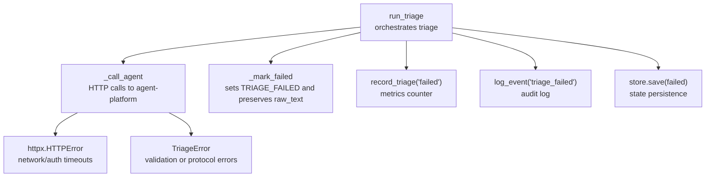
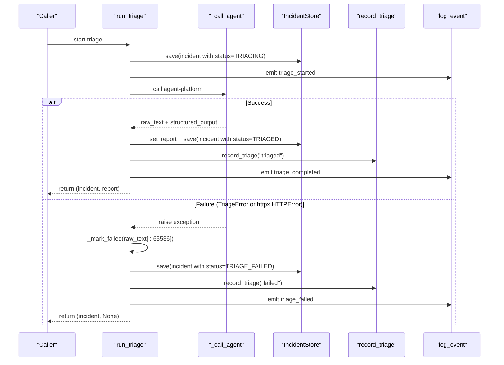
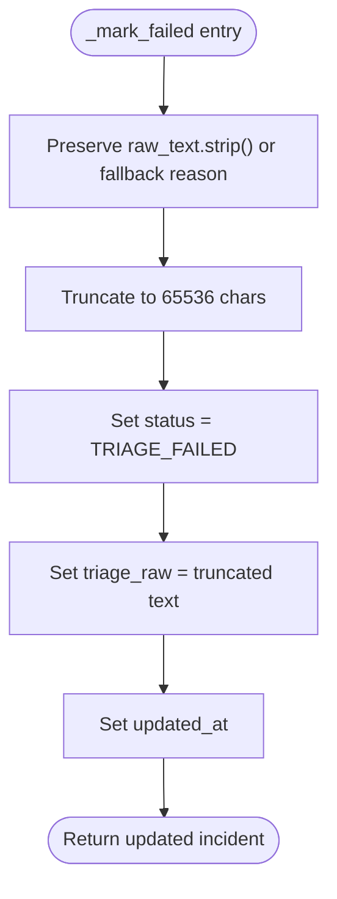
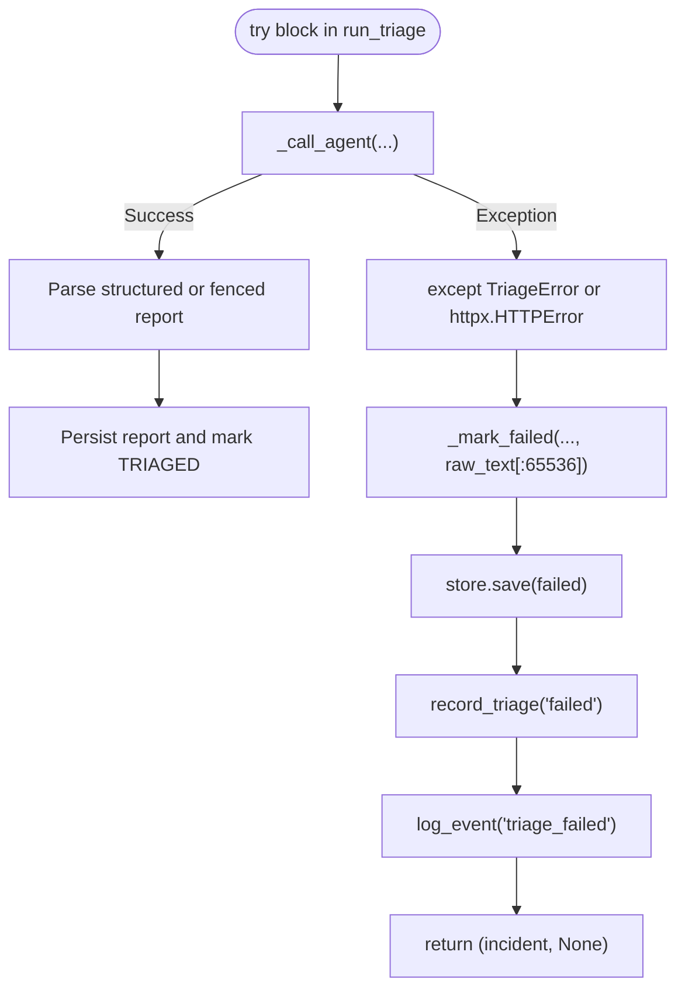
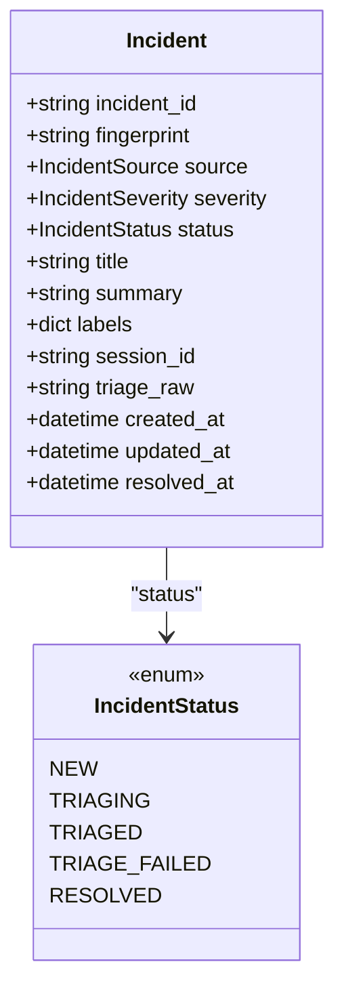
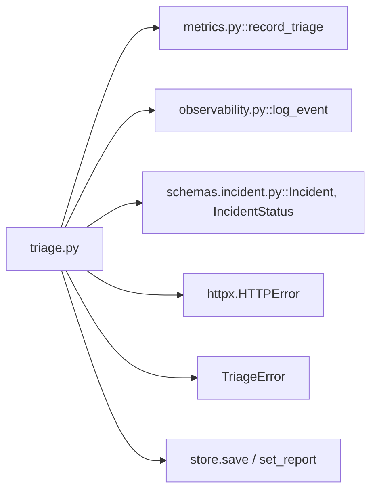

# Failure Handling and Recovery

<cite>
**Referenced Files in This Document**
- [triage.py](file://products/incident-service/src/incident_service/services/triage.py)
- [metrics.py](file://products/incident-service/src/incident_service/core/metrics.py)
- [observability.py](file://products/incident-service/src/incident_service/core/observability.py)
- [incident.py](file://products/incident-service/src/incident_service/schemas/incident.py)
- [test_triage.py](file://products/incident-service/tests/test_triage.py)
</cite>

## Table of Contents
1. [Introduction](#introduction)
2. [Project Structure](#project-structure)
3. [Core Components](#core-components)
4. [Architecture Overview](#architecture-overview)
5. [Detailed Component Analysis](#detailed-component-analysis)
6. [Dependency Analysis](#dependency-analysis)
7. [Performance Considerations](#performance-considerations)
8. [Troubleshooting Guide](#troubleshooting-guide)
9. [Conclusion](#conclusion)

## Introduction
This document explains how the incident triage system handles failures and preserves diagnostic information to maintain operational continuity. When triage fails, the system marks incidents with a visible failure status, preserves raw agent responses for debugging, records metrics, and emits audit events. It also documents how exceptions from network calls, authentication issues, and malformed responses are handled consistently so that partial results and context are never lost.

## Project Structure
The triage failure handling logic lives in the incident-service package:
- Triage orchestration and error handling: services/triage.py
- Metrics recording: core/metrics.py
- Audit logging helper: core/observability.py
- Incident model including failure state and raw text field: schemas/incident.py
- Tests validating failure paths and outcomes: tests/test_triage.py

**Diagram sources**
- [triage.py:219-276](file://products/incident-service/src/incident_service/services/triage.py#L219-L276)
- [triage.py:279-349](file://products/incident-service/src/incident_service/services/triage.py#L279-L349)
- [metrics.py:93-94](file://products/incident-service/src/incident_service/core/metrics.py#L93-L94)
- [observability.py:21-23](file://products/incident-service/src/incident_service/core/observability.py#L21-L23)
- [incident.py:29-50](file://products/incident-service/src/incident_service/schemas/incident.py#L29-L50)

**Section sources**
- [triage.py:1-371](file://products/incident-service/src/incident_service/services/triage.py#L1-L371)
- [metrics.py:1-103](file://products/incident-service/src/incident_service/core/metrics.py#L1-L103)
- [observability.py:1-24](file://products/incident-service/src/incident_service/core/observability.py#L1-L24)
- [incident.py:1-116](file://products/incident-service/src/incident_service/schemas/incident.py#L1-L116)
- [test_triage.py:300-463](file://products/incident-service/tests/test_triage.py#L300-L463)

## Core Components
- TriageError: custom exception raised when agent interaction or report validation fails.
- _call_agent: performs HTTP calls to agent-platform; raises TriageError on non-200 responses, invalid JSON, missing content, or schema mismatches; httpx.HTTPError propagates transport-level failures such as timeouts and connection errors.
- run_triage: orchestrates triage lifecycle, persists intermediate states, and centralizes failure handling by marking incidents failed, saving them, recording metrics, and emitting audit logs.
- _mark_failed: sets incident status to TRIAGE_FAILED and preserves up to 65536 characters of raw agent response in triage_raw for debugging.
- record_triage: increments a Prometheus counter labeled by outcome (e.g., "failed").
- log_event: emits structured audit events for triage_started, triage_completed, and triage_failed.

**Section sources**
- [triage.py:95-97](file://products/incident-service/src/incident_service/services/triage.py#L95-L97)
- [triage.py:219-276](file://products/incident-service/src/incident_service/services/triage.py#L219-L276)
- [triage.py:279-349](file://products/incident-service/src/incident_service/services/triage.py#L279-L349)
- [metrics.py:41-45](file://products/incident-service/src/incident_service/core/metrics.py#L41-L45)
- [metrics.py:93-94](file://products/incident-service/src/incident_service/core/metrics.py#L93-L94)
- [observability.py:21-23](file://products/incident-service/src/incident_service/core/observability.py#L21-L23)
- [incident.py:29-50](file://products/incident-service/src/incident_service/schemas/incident.py#L29-L50)

## Architecture Overview
The triage flow starts by setting the incident to TRIAGING and emitting a triage_started event. The system then calls the agent platform to perform a read-only triage turn. If any step fails—session creation, chat call, response parsing, or report validation—the flow catches both TriageError and httpx.HTTPError, marks the incident failed with preserved raw text, persists the failure, records a failed metric, and emits a triage_failed event. On success, it stores the validated report, updates the incident to TRIAGED, records a triaged metric, and emits a triage_completed event.

**Diagram sources**
- [triage.py:290-370](file://products/incident-service/src/incident_service/services/triage.py#L290-L370)
- [triage.py:219-276](file://products/incident-service/src/incident_service/services/triage.py#L219-L276)
- [metrics.py:93-94](file://products/incident-service/src/incident_service/core/metrics.py#L93-L94)
- [observability.py:21-23](file://products/incident-service/src/incident_service/core/observability.py#L21-L23)
- [incident.py:29-50](file://products/incident-service/src/incident_service/schemas/incident.py#L29-L50)

## Detailed Component Analysis

### Failure Preservation via _mark_failed
- Purpose: Ensure failed triage attempts remain visible and debuggable.
- Behavior:
  - Sets incident status to TRIAGE_FAILED.
  - Preserves raw_text stripped and truncated to 65536 characters in triage_raw.
  - Updates updated_at timestamp.
  - Returns a new incident copy with these fields updated.
- Why 65536: Matches the triage_raw field’s maximum length in the Incident model, preventing oversized payloads while retaining sufficient context for diagnosis.

**Diagram sources**
- [triage.py:279-287](file://products/incident-service/src/incident_service/services/triage.py#L279-L287)
- [incident.py:49-50](file://products/incident-service/src/incident_service/schemas/incident.py#L49-L50)

**Section sources**
- [triage.py:279-287](file://products/incident-service/src/incident_service/services/triage.py#L279-L287)
- [incident.py:29-50](file://products/incident-service/src/incident_service/schemas/incident.py#L29-L50)

### Exception Handling: TriageError and httpx.HTTPError
- TriageError is raised for:
  - Non-200 responses from agent-platform during session creation or chat calls.
  - Invalid JSON body from agent-platform.
  - Missing or empty content in agent response.
  - Report validation failures (missing fenced block, invalid JSON, schema violations).
- httpx.HTTPError covers:
  - Network timeouts, connection errors, and other transport-level failures.
- Centralized catch:
  - run_triage catches both TriageError and httpx.HTTPError.
  - On exception, it marks the incident failed, persists it, records metrics, and emits an audit event.

**Diagram sources**
- [triage.py:321-349](file://products/incident-service/src/incident_service/services/triage.py#L321-L349)
- [triage.py:219-276](file://products/incident-service/src/incident_service/services/triage.py#L219-L276)
- [triage.py:171-186](file://products/incident-service/src/incident_service/services/triage.py#L171-L186)

**Section sources**
- [triage.py:219-276](file://products/incident-service/src/incident_service/services/triage.py#L219-L276)
- [triage.py:321-349](file://products/incident-service/src/incident_service/services/triage.py#L321-L349)
- [triage.py:171-186](file://products/incident-service/src/incident_service/services/triage.py#L171-L186)

### State Persistence Strategy
- On triage start:
  - Incident is saved with status TRIAGING and a cleared triage_raw to avoid stale data.
- On failure:
  - _mark_failed creates a new incident copy with status TRIAGE_FAILED and triage_raw set to preserved raw text (up to 65536 characters).
  - The failed incident is persisted via store.save, ensuring visibility in dashboards and logs.
- On success:
  - The validated report is stored via store.set_report.
  - The incident is saved with status TRIAGED and updated session_id.

**Diagram sources**
- [incident.py:29-50](file://products/incident-service/src/incident_service/schemas/incident.py#L29-L50)

**Section sources**
- [triage.py:303-312](file://products/incident-service/src/incident_service/services/triage.py#L303-L312)
- [triage.py:337-349](file://products/incident-service/src/incident_service/services/triage.py#L337-L349)
- [triage.py:351-360](file://products/incident-service/src/incident_service/services/triage.py#L351-L360)
- [incident.py:29-50](file://products/incident-service/src/incident_service/schemas/incident.py#L29-L50)

### Metrics Recording via record_triage
- The system records triage outcomes using a Prometheus counter:
  - record_triage("failed") on exceptions.
  - record_triage("triaged") on successful completion.
- This enables monitoring of triage success/failure rates and supports alerting and capacity planning.

**Section sources**
- [triage.py:341-342](file://products/incident-service/src/incident_service/services/triage.py#L341-L342)
- [triage.py:361-361](file://products/incident-service/src/incident_service/services/triage.py#L361-L361)
- [metrics.py:41-45](file://products/incident-service/src/incident_service/core/metrics.py#L41-L45)
- [metrics.py:93-94](file://products/incident-service/src/incident_service/core/metrics.py#L93-L94)

### Audit Logging via log_event
- triage_started: emitted after persisting the incident in TRIAGING, capturing incident_id, session_id, and operator.
- triage_completed: emitted on success, capturing incident_id, session_id, operator, and next_steps count.
- triage_failed: emitted on failure, capturing incident_id and reason derived from the exception message.
- These events provide an immutable audit trail for triage lifecycle tracking and post-incident analysis.

**Section sources**
- [triage.py:313-319](file://products/incident-service/src/incident_service/services/triage.py#L313-L319)
- [triage.py:343-348](file://products/incident-service/src/incident_service/services/triage.py#L343-L348)
- [triage.py:362-369](file://products/incident-service/src/incident_service/services/triage.py#L362-L369)
- [observability.py:21-23](file://products/incident-service/src/incident_service/core/observability.py#L21-L23)

### Operational Continuity and Diagnostics
- Partial results preservation:
  - Even when triage fails, raw_text is captured and truncated to fit within the triage_raw limit, enabling root cause analysis without risking storage overflow.
- Visibility:
  - Status transitions to TRIAGE_FAILED ensure operators can identify problematic incidents quickly.
- Diagnostic information:
  - Audit events include reasons and contextual fields (incident_id, session_id, operator), supporting correlation across systems.
- Resilience:
  - Both application-level (TriageError) and transport-level (httpx.HTTPError) failures are handled uniformly, preventing silent failures and ensuring consistent observability.

[No sources needed since this section synthesizes behavior already cited above]

## Dependency Analysis
- triage.py depends on:
  - metrics.record_triage for outcome counters.
  - observability.log_event for audit events.
  - schemas.Incident and IncidentStatus for state modeling and limits.
- Exceptions propagate from:
  - _call_agent raising TriageError on protocol/validation errors.
  - httpx raising HTTPError on network/auth/timeouts.
- Tests validate:
  - Session creation failures and unexpected statuses raise TriageError.
  - Structured output preference and fence fallback behavior.
  - Invalid structured payloads result in TRIAGE_FAILED.

**Diagram sources**
- [triage.py:219-276](file://products/incident-service/src/incident_service/services/triage.py#L219-L276)
- [triage.py:279-349](file://products/incident-service/src/incident_service/services/triage.py#L279-L349)
- [metrics.py:93-94](file://products/incident-service/src/incident_service/core/metrics.py#L93-L94)
- [observability.py:21-23](file://products/incident-service/src/incident_service/core/observability.py#L21-L23)
- [incident.py:29-50](file://products/incident-service/src/incident_service/schemas/incident.py#L29-L50)

**Section sources**
- [triage.py:219-349](file://products/incident-service/src/incident_service/services/triage.py#L219-L349)
- [metrics.py:93-94](file://products/incident-service/src/incident_service/core/metrics.py#L93-L94)
- [observability.py:21-23](file://products/incident-service/src/incident_service/core/observability.py#L21-L23)
- [incident.py:29-50](file://products/incident-service/src/incident_service/schemas/incident.py#L29-L50)
- [test_triage.py:306-325](file://products/incident-service/tests/test_triage.py#L306-L325)
- [test_triage.py:448-453](file://products/incident-service/tests/test_triage.py#L448-L453)

## Performance Considerations
- Raw text truncation to 65536 characters prevents large payloads from impacting storage and network overhead while preserving enough context for diagnostics.
- Using a dedicated session per incident reduces contention and improves traceability.
- Preferencing kernel-validated structured_output avoids expensive parsing and ensures schema compliance early.

[No sources needed since this section provides general guidance grounded by cited behaviors]

## Troubleshooting Guide
Common failure scenarios and their handling:
- Network timeouts or connectivity issues:
  - httpx.HTTPError is caught; incident marked TRIAGE_FAILED with preserved raw_text and triage_failed event emitted.
- Authentication failures:
  - Non-200 responses from agent-platform raise TriageError; same failure path applies.
- Malformed responses:
  - Invalid JSON or missing content triggers TriageError; failure path preserves raw_text and emits triage_failed.
- Report validation failures:
  - Missing fenced block, invalid JSON, or schema violations raise TriageError; failure path preserves raw_text and emits triage_failed.

Verification via tests:
- Session creation failures and unexpected statuses raise TriageError without fallback retries.
- Invalid structured payloads lead to TRIAGE_FAILED status.

**Section sources**
- [triage.py:219-276](file://products/incident-service/src/incident_service/services/triage.py#L219-L276)
- [triage.py:321-349](file://products/incident-service/src/incident_service/services/triage.py#L321-L349)
- [test_triage.py:306-325](file://products/incident-service/tests/test_triage.py#L306-L325)
- [test_triage.py:448-453](file://products/incident-service/tests/test_triage.py#L448-L453)

## Conclusion
The triage system implements robust failure handling and recovery:
- Consistent exception handling for both application and transport errors.
- Clear state transitions to TRIAGE_FAILED with preserved raw_text for debugging.
- Comprehensive observability through metrics and audit events.
- Operational continuity ensured by persisting partial results and providing actionable diagnostics.

These mechanisms collectively improve reliability, visibility, and post-incident analysis capabilities.

[No sources needed since this section summarizes without analyzing specific files]