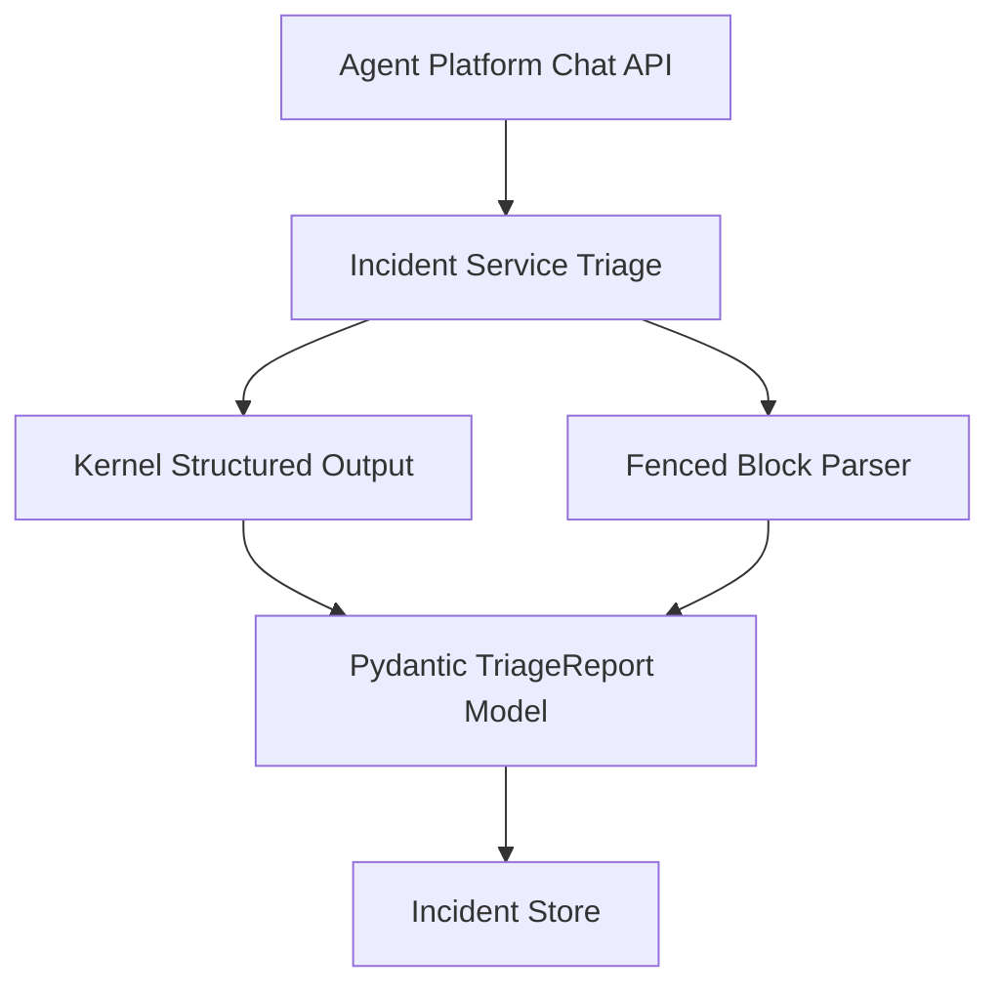
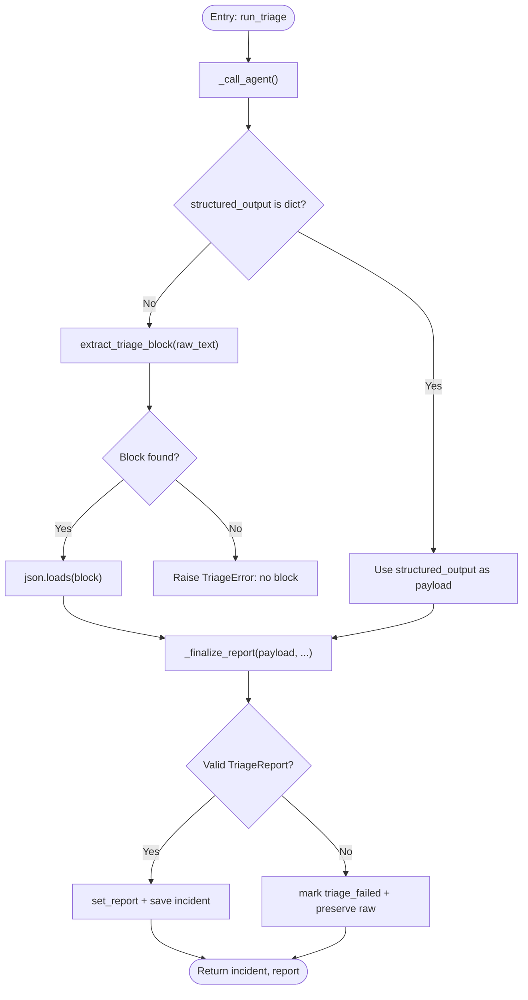
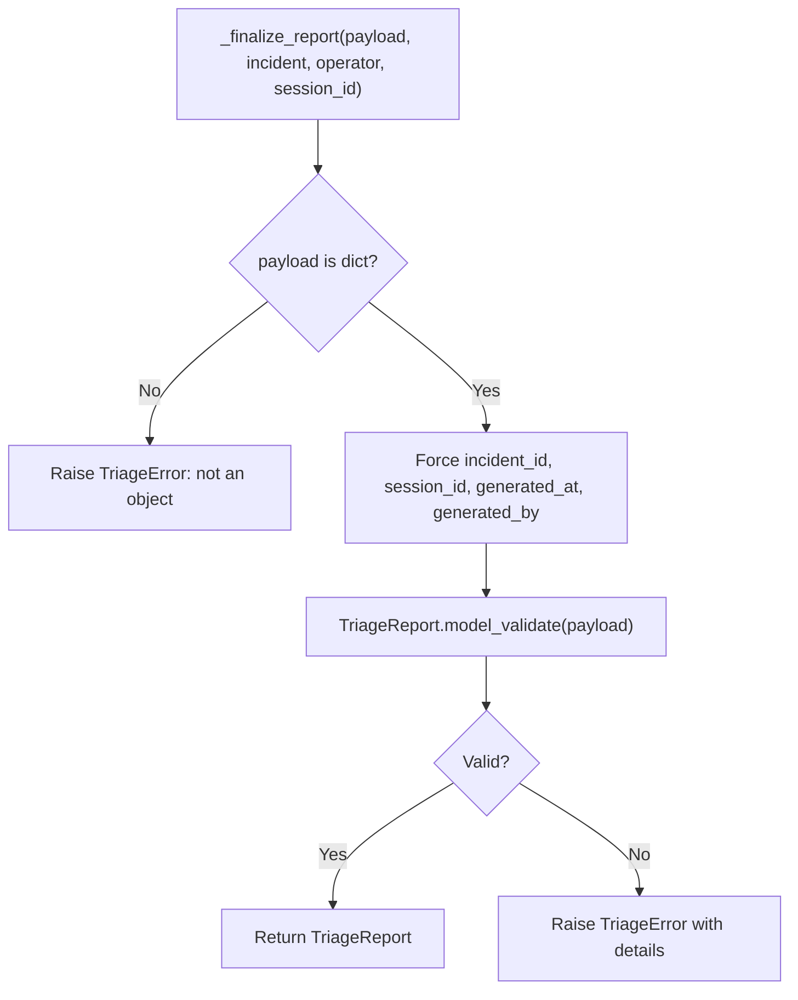
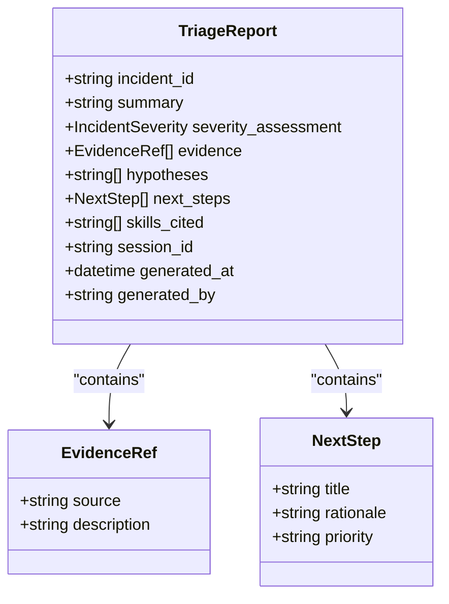
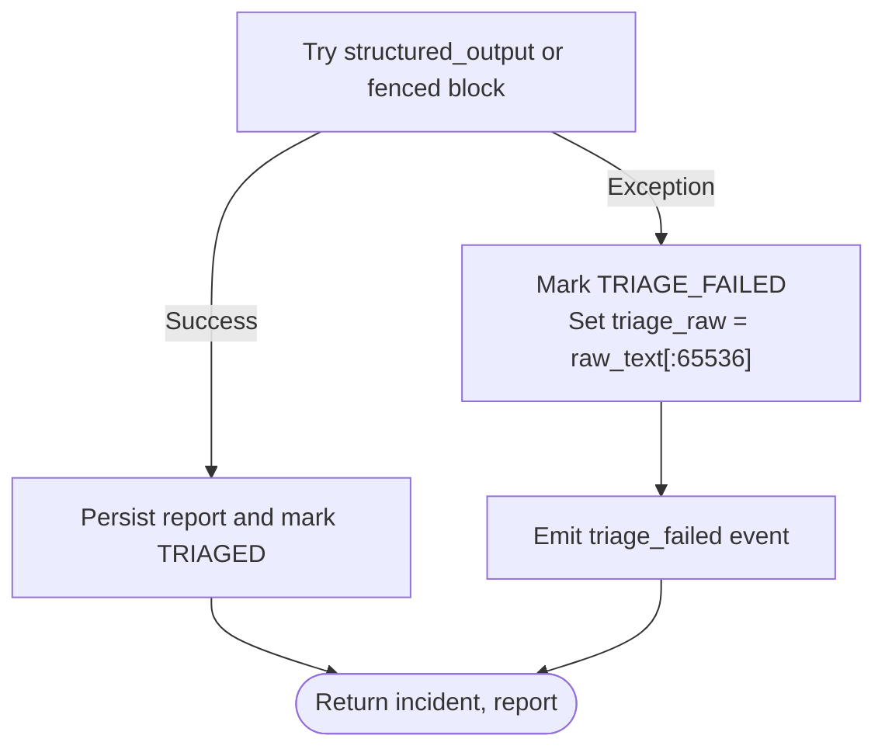
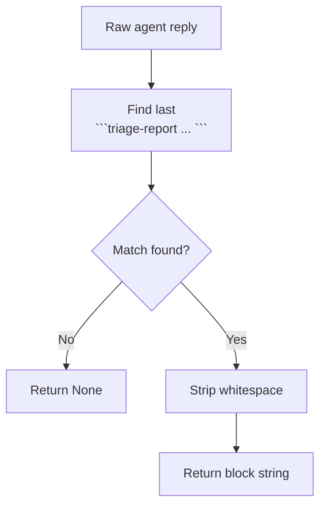
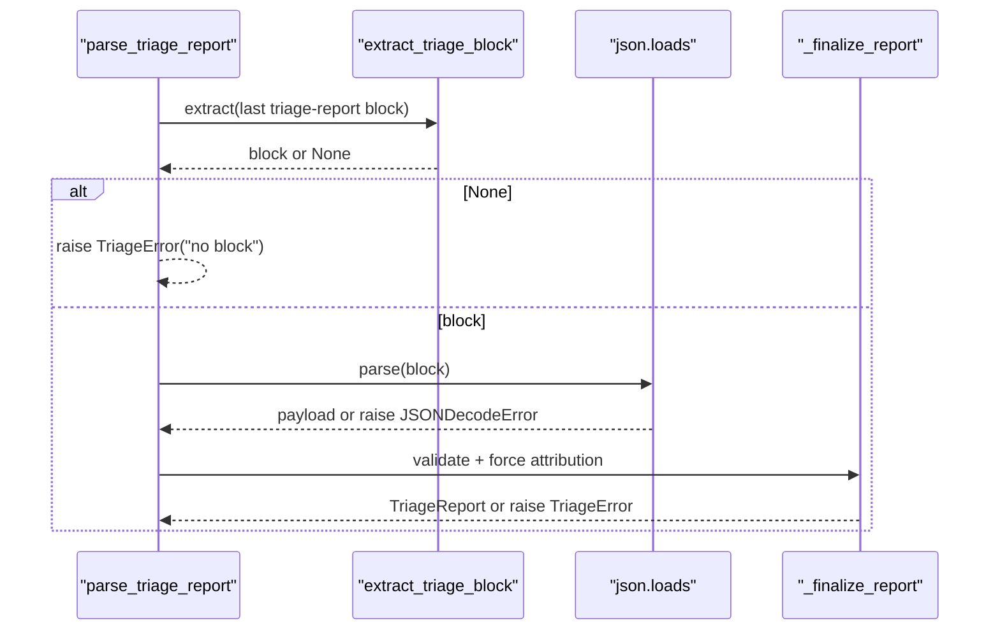
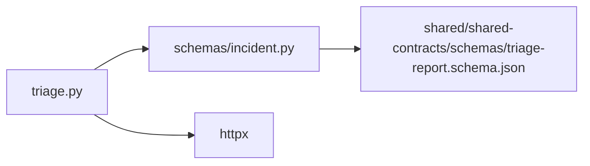

# Structured Output Validation

<cite>
**Referenced Files in This Document**
- [triage.py](file://products/incident-service/src/incident_service/services/triage.py)
- [incident.py](file://products/incident-service/src/incident_service/schemas/incident.py)
- [triage-report.schema.json](file://shared/shared-contracts/schemas/triage-report.schema.json)
- [test_triage.py](file://products/incident-service/tests/test_triage.py)
</cite>

## Table of Contents
1. [Introduction](#introduction)
2. [Project Structure](#project-structure)
3. [Core Components](#core-components)
4. [Architecture Overview](#architecture-overview)
5. [Detailed Component Analysis](#detailed-component-analysis)
6. [Dependency Analysis](#dependency-analysis)
7. [Performance Considerations](#performance-considerations)
8. [Troubleshooting Guide](#troubleshooting-guide)
9. [Conclusion](#conclusion)

## Introduction
This document explains the structured output validation system for triage reports in the incident service. It covers the dual-path validation strategy that prefers kernel-validated structured output when available and falls back to fenced block parsing for legacy compatibility. It also documents how server-minted attribution fields are enforced to prevent prompt injection, how JSON schema validation is enforced via Pydantic models, how malformed reports are handled without losing diagnostic information, and how the pipeline orchestrates extraction and validation through specific functions.

## Project Structure
The validation logic lives in the incident service under a dedicated triage module. The canonical contract schema is shared across the platform and enforced by Pydantic models in the same service. Tests validate both success paths and error handling.



**Diagram sources**
- [triage.py:219-276](file://products/incident-service/src/incident_service/services/triage.py#L219-L276)
- [triage.py:139-186](file://products/incident-service/src/incident_service/services/triage.py#L139-L186)
- [incident.py:81-103](file://products/incident-service/src/incident_service/schemas/incident.py#L81-L103)

**Section sources**
- [triage.py:1-14](file://products/incident-service/src/incident_service/services/triage.py#L1-L14)
- [incident.py:1-7](file://products/incident-service/src/incident_service/schemas/incident.py#L1-L7)
- [triage-report.schema.json:1-119](file://shared/shared-contracts/schemas/triage-report.schema.json#L1-L119)

## Core Components
- Dual-path validation:
  - Preferred path: kernel-validated structured_output returned from agent-platform chat.
  - Fallback path: parse_triage_report extracts a fenced code block tagged triage-report and validates it.
- Server-minted attribution: _finalize_report forces incident_id, session_id, generated_at, and generated_by to trusted values before validation.
- Schema enforcement: TriageReport Pydantic model mirrors the shared JSON schema and rejects invalid payloads.
- Error handling: TriageError wraps validation failures; failed runs mark incidents as triage_failed and preserve raw text for diagnostics.

**Section sources**
- [triage.py:147-186](file://products/incident-service/src/incident_service/services/triage.py#L147-L186)
- [incident.py:81-103](file://products/incident-service/src/incident_service/schemas/incident.py#L81-L103)
- [triage-report.schema.json:1-119](file://shared/shared-contracts/schemas/triage-report.schema.json#L1-L119)

## Architecture Overview
The run_triage flow calls the agent platform with a request that includes the triage report JSON schema as response_schema. If the kernel returns structured_output, it is validated directly; otherwise, the raw reply is parsed for a fenced block. In all cases, attribution fields are forced and validated before persisting.

```mermaid
sequenceDiagram
participant Caller as "Caller"
participant Triage as "run_triage"
participant Agent as "Agent Platform /api/v2/chat"
participant Parser as "extract_triage_block"
participant Finalize as "_finalize_report"
participant Model as "TriageReport (Pydantic)"
participant Store as "Incident Store"
Caller->>Triage : start triage
Triage->>Agent : POST {message, session_id, response_schema, read_only}
Agent-->>Triage : {content, structured_output?}
alt structured_output present
Triage->>Finalize : payload=structured_output
else no structured_output
Triage->>Parser : extract last
```triage-report block
        Parser-->>Triage: block or None
        Triage->>Finalize: payload=json.loads(block)
    end
    Finalize->>Model: model_validate(payload)
    Model-->>Finalize: TriageReport or raises
    alt success
        Triage->>Store: set_report + save incident
        Store-->>Triage: ok
        Triage-->>Caller: incident, report
    else failure
        Triage->>Store: mark triage_failed, preserve raw_text
        Store-->>Triage: ok
        Triage-->>Caller: incident, None
    end
```

**Diagram sources**
- [triage.py:219-276](file://products/incident-service/src/incident_service/services/triage.py#L219-L276)
- [triage.py:279-370](file://products/incident-service/src/incident_service/services/triage.py#L279-L370)
- [triage.py:139-186](file://products/incident-service/src/incident_service/services/triage.py#L139-L186)
- [incident.py:81-103](file://products/incident-service/src/incident_service/schemas/incident.py#L81-L103)

## Detailed Component Analysis

### Dual-Path Validation Strategy
- Kernel-validated structured_output path:
  - When agent-platform returns structured_output as a dict, run_triage uses it directly.
  - _finalize_report forces server-known attribution and validates against TriageReport.
- Fenced block fallback path:
  - extract_triage_block finds the last fenced code block tagged triage-report.
  - parse_triage_report parses JSON and delegates to _finalize_report.
- Preference rule: structured_output takes precedence; only if absent does the parser run.



**Diagram sources**
- [triage.py:290-370](file://products/incident-service/src/incident_service/services/triage.py#L290-L370)
- [triage.py:139-186](file://products/incident-service/src/incident_service/services/triage.py#L139-L186)

**Section sources**
- [triage.py:219-276](file://products/incident-service/src/incident_service/services/triage.py#L219-L276)
- [triage.py:290-370](file://products/incident-service/src/incident_service/services/triage.py#L290-L370)

### _finalize_report: Server-Minted Attribution Enforcement
- Forces incident_id, session_id, generated_at, and generated_by to trusted values derived from the incident context and operator.
- Validates the resulting payload against TriageReport; any mismatch raises a wrapped TriageError.
- Prevents prompt injection by never trusting these fields from agent output.



**Diagram sources**
- [triage.py:147-168](file://products/incident-service/src/incident_service/services/triage.py#L147-L168)

**Section sources**
- [triage.py:147-168](file://products/incident-service/src/incident_service/services/triage.py#L147-L168)

### JSON Schema Validation via Pydantic Models
- TriageReport enforces required fields, types, lengths, enums, and patterns consistent with the shared schema.
- EvidenceRef and NextStep constrain nested structures similarly to the schema.
- The model’s extra="forbid" ensures unknown fields are rejected.



**Diagram sources**
- [incident.py:66-103](file://products/incident-service/src/incident_service/schemas/incident.py#L66-L103)

**Section sources**
- [incident.py:66-103](file://products/incident-service/src/incident_service/schemas/incident.py#L66-L103)
- [triage-report.schema.json:1-119](file://shared/shared-contracts/schemas/triage-report.schema.json#L1-L119)

### Error Handling and Preservation of Raw Text
- On validation or network errors, run_triage marks the incident status as triage_failed and persists the raw agent text (trimmed, capped) into triage_raw for later inspection.
- TriageError carries human-readable reasons for each failure mode: missing block, invalid JSON, non-object payload, schema violations, and transport issues.



**Diagram sources**
- [triage.py:279-349](file://products/incident-service/src/incident_service/services/triage.py#L279-L349)

**Section sources**
- [triage.py:279-349](file://products/incident-service/src/incident_service/services/triage.py#L279-L349)

### extract_triage_block: Fenced Code Block Parsing
- Uses a regex to find the last fenced code block tagged triage-report in the agent reply.
- Returns the stripped content or None if no matching block exists.
- Ignores other fences (e.g., generic json blocks).



**Diagram sources**
- [triage.py:39-41](file://products/incident-service/src/incident_service/services/triage.py#L39-L41)
- [triage.py:139-144](file://products/incident-service/src/incident_service/services/triage.py#L139-L144)

**Section sources**
- [triage.py:39-41](file://products/incident-service/src/incident_service/services/triage.py#L39-L41)
- [triage.py:139-144](file://products/incident-service/src/incident_service/services/triage.py#L139-L144)

### parse_triage_report: Orchestration of Fallback Path
- Calls extract_triage_block; if None, raises TriageError indicating no block was found.
- Parses the block as JSON; on decode error, raises TriageError with details.
- Delegates to _finalize_report to enforce attribution and schema validation.



**Diagram sources**
- [triage.py:171-186](file://products/incident-service/src/incident_service/services/triage.py#L171-L186)

**Section sources**
- [triage.py:171-186](file://products/incident-service/src/incident_service/services/triage.py#L171-L186)

### Examples of Valid and Invalid Reports
- Valid report:
  - Contains all required fields per the schema and Pydantic model.
  - Passes _finalize_report and TriageReport.model_validate.
  - Example construction and successful parsing are covered in tests.
- Invalid reports:
  - Missing fenced block: parse_triage_report raises TriageError.
  - Non-JSON block: parse_triage_report raises TriageError.
  - Non-object payload: _finalize_report raises TriageError.
  - Schema violation (e.g., invalid severity): _finalize_report raises TriageError.
  - Kernel structured_output with invalid fields: same validation path fails.

These behaviors are asserted in the test suite.

**Section sources**
- [test_triage.py:115-206](file://products/incident-service/tests/test_triage.py#L115-L206)
- [test_triage.py:430-458](file://products/incident-service/tests/test_triage.py#L430-L458)

## Dependency Analysis
- triage.py depends on:
  - incident_service.schemas.incident for Incident, IncidentStatus, and TriageReport.
  - httpx for calling agent-platform.
  - Standard library modules for datetime, json, re, logging.
- incident.py defines Pydantic models that mirror shared/schema contracts.
- Shared schema provides the authoritative structure for triage reports.



**Diagram sources**
- [triage.py:16-33](file://products/incident-service/src/incident_service/services/triage.py#L16-L33)
- [incident.py:1-7](file://products/incident-service/src/incident_service/schemas/incident.py#L1-L7)

**Section sources**
- [triage.py:16-33](file://products/incident-service/src/incident_service/services/triage.py#L16-L33)
- [incident.py:1-7](file://products/incident-service/src/incident_service/schemas/incident.py#L1-L7)

## Performance Considerations
- Prefer structured_output to avoid regex parsing and JSON decoding overhead when available.
- Regex extraction targets the last matching block, which is efficient for typical agent replies.
- JSON parsing occurs only on the fallback path.
- Validation cost is bounded by fixed-size lists and short strings defined in the schema and models.

[No sources needed since this section provides general guidance]

## Troubleshooting Guide
Common failure modes and where to look:
- No fenced block in agent reply:
  - Cause: agent did not emit a triage-report block.
  - Action: check agent logs and ensure structured_output is requested; inspect raw text preserved in triage_raw.
- Invalid JSON in block:
  - Cause: malformed JSON inside the fence.
  - Action: review raw text and correct formatting; rely on triage_raw for diagnostics.
- Non-object payload:
  - Cause: block contains array or scalar instead of object.
  - Action: ensure the block is a JSON object with required fields.
- Schema violations:
  - Cause: field type, enum, length, or pattern mismatch.
  - Action: align output with TriageReport constraints and the shared schema.
- Network or agent errors:
  - Cause: non-200 responses or non-JSON bodies.
  - Action: verify agent-platform availability and headers; check triage_raw and error messages.

Validation and preservation behavior is exercised in tests.

**Section sources**
- [test_triage.py:175-206](file://products/incident-service/tests/test_triage.py#L175-L206)
- [triage.py:279-349](file://products/incident-service/src/incident_service/services/triage.py#L279-L349)

## Conclusion
The triage validation pipeline enforces strict schema compliance while remaining resilient to legacy outputs. By preferring kernel-validated structured output and falling back to fenced block parsing, it balances safety and compatibility. Server-minted attribution prevents prompt injection, and robust error handling preserves raw text for post-mortem analysis. The Pydantic models provide a clear, enforceable contract aligned with the shared schema.