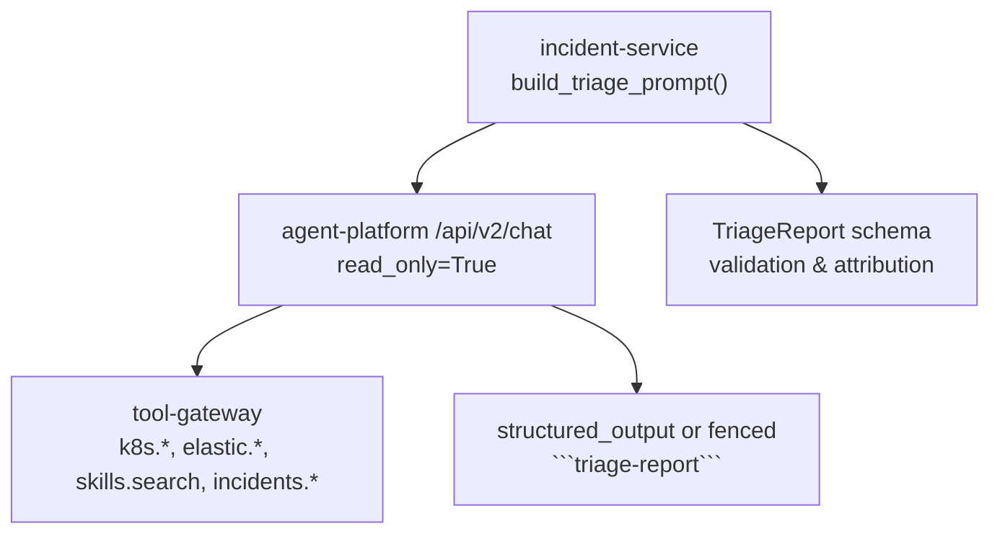
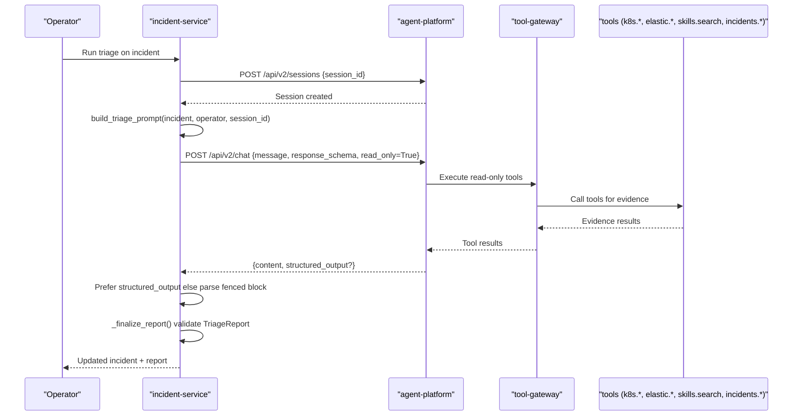
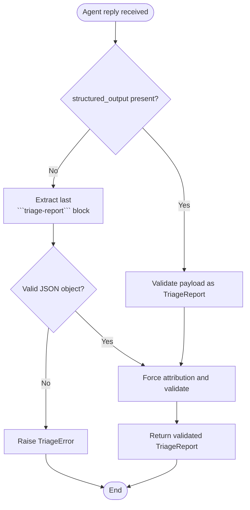
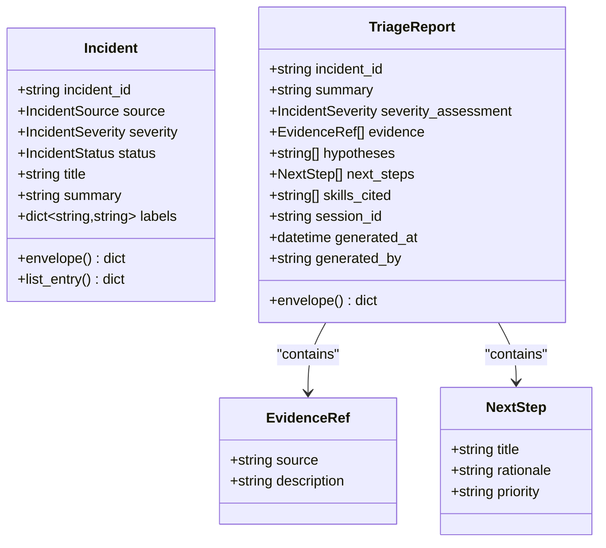
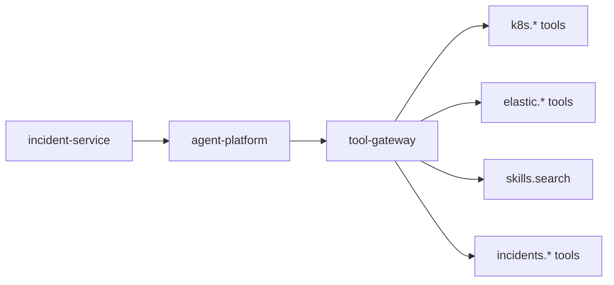

# Triage Prompt Construction

<cite>
**Referenced Files in This Document**
- [triage.py](file://products/incident-service/src/incident_service/services/triage.py)
- [incident.py](file://products/incident-service/src/incident_service/schemas/incident.py)
- [triage-report.schema.json](file://shared/shared-contracts/schemas/triage-report.schema.json)
- [test_triage.py](file://products/incident-service/tests/test_triage.py)
- [skills_connector.py](file://products/tool-gateway/src/tool_gateway/tools/skills_connector.py)
- [incidents_connector.py](file://products/tool-gateway/src/tool_gateway/tools/incidents_connector.py)
- [tool-configuration.md](file://docs/guides/tool-configuration.md)
- [runtime_settings.py](file://products/agent-platform/src/agent_service/runtime_settings.py)
- [SPEC-015 spec.md](file://docs/specs/SPEC-015-incident-triage-and-collaboration/spec.md)
- [SPEC-014 spec.md](file://docs/specs/SPEC-014-skills-and-grounded-guidance/spec.md)
</cite>

## Table of Contents
1. [Introduction](#introduction)
2. [Project Structure](#project-structure)
3. [Core Components](#core-components)
4. [Architecture Overview](#architecture-overview)
5. [Detailed Component Analysis](#detailed-component-analysis)
6. [Dependency Analysis](#dependency-analysis)
7. [Performance Considerations](#performance-considerations)
8. [Troubleshooting Guide](#troubleshooting-guide)
9. [Conclusion](#conclusion)

## Introduction
This document explains how the triage prompt construction system builds context-rich prompts for agent triage runs and how those prompts enforce disciplined, evidence-based diagnostics. The system lives in incident-service and orchestrates a single read-only agent turn against agent-platform to produce a schema-validated triage report. It injects incident metadata into a template, instructs the agent to gather live evidence using approved read-only tools, search skills for runbooks, and ground all conclusions in actual findings. Outputs are captured either as kernel-validated structured output or via a fenced code block fallback, ensuring consistent, auditable results.

## Project Structure
The triage prompt construction spans several components:
- incident-service builds the prompt from a service template and calls agent-platform with a read-only turn and a response schema.
- agent-platform executes the turn with a restricted toolkit and optional structured-output enforcement.
- tool-gateway exposes read-only tools (k8s.*, elastic.*, skills.search, incidents.*) that the agent uses to gather evidence.
- shared contracts define the canonical triage report schema used for validation.



**Diagram sources**
- [triage.py:122-136](file://products/incident-service/src/incident_service/services/triage.py#L122-L136)
- [triage.py:219-276](file://products/incident-service/src/incident_service/services/triage.py#L219-L276)
- [incident.py:81-103](file://products/incident-service/src/incident_service/schemas/incident.py#L81-L103)
- [triage-report.schema.json:1-120](file://shared/shared-contracts/schemas/triage-report.schema.json#L1-L120)

**Section sources**
- [triage.py:1-14](file://products/incident-service/src/incident_service/services/triage.py#L1-L14)
- [SPEC-015 spec.md:117-121](file://docs/specs/SPEC-015-incident-triage-and-collaboration/spec.md#L117-L121)

## Core Components
- TRIAGE_PROMPT_TEMPLATE: A string template that embeds incident metadata and discipline rules into the agent prompt.
- build_triage_prompt(): Formats the template with fields from an Incident model and operator/session context.
- _call_agent(): Establishes a dedicated session per incident, sends the prompt with response_schema and read_only=True, and returns content plus optional structured_output.
- parse_triage_report() and extract_triage_block(): Fallback parser for fenced triage-report blocks when structured_output is absent.
- _finalize_report(): Forces server-minted attribution and validates against the TriageReport model.

Key behaviors:
- Labels are rendered as key=value pairs; missing labels or summary render as "(none)".
- The prompt explicitly bans mutating tools and requires evidence-based reasoning.
- The agent is directed to use k8s.*, elastic.*, skills.search, and incidents.* for evidence gathering.
- Skills must be cited by skill_id or title in skills_cited.

**Section sources**
- [triage.py:43-92](file://products/incident-service/src/incident_service/services/triage.py#L43-L92)
- [triage.py:122-136](file://products/incident-service/src/incident_service/services/triage.py#L122-L136)
- [triage.py:139-186](file://products/incident-service/src/incident_service/services/triage.py#L139-L186)
- [triage.py:147-168](file://products/incident-service/src/incident_service/services/triage.py#L147-L168)
- [incident.py:37-53](file://products/incident-service/src/incident_service/schemas/incident.py#L37-L53)
- [test_triage.py:93-112](file://products/incident-service/tests/test_triage.py#L93-L112)

## Architecture Overview
The triage flow constructs a prompt, enforces read-only execution, and captures a validated report.



**Diagram sources**
- [triage.py:189-276](file://products/incident-service/src/incident_service/services/triage.py#L189-L276)
- [triage.py:290-370](file://products/incident-service/src/incident_service/services/triage.py#L290-L370)
- [incident.py:81-103](file://products/incident-service/src/incident_service/schemas/incident.py#L81-L103)
- [triage-report.schema.json:1-120](file://shared/shared-contracts/schemas/triage-report.schema.json#L1-L120)

## Detailed Component Analysis

### Prompt Template and Context Injection
- The template includes incident ID, source, severity, status, title, summary, and labels to provide full context.
- build_triage_prompt formats these fields and appends operator and session identifiers.
- Missing labels or summary are safely rendered as "(none)" to avoid empty context.

Examples of generated prompts (described):
- Kubernetes pod readiness failure:
  - Incident under triage section lists ID, source, severity, status, title, summary, and labels such as alertname=KubePodNotReady.
  - Discipline instructs the agent to gather live evidence with k8s.* and elastic.*, search skills for runbooks, and cite skills used.
  - Output format requests either structured output or a fenced triage-report JSON block.
- Network connectivity outage:
  - Labels include network-related tags; prompt directs evidence collection to elastic logs and k8s networking resources.
  - Next steps remain advisory and grounded in evidence or cited skills.
- Database performance regression:
  - Summary highlights slow queries; prompt guides searching elastic metrics and k8s resource pressure indicators.
  - Skills search targets database tuning runbooks; citations required.

These examples illustrate how the same template adapts to different incident types while preserving structure and discipline.

**Section sources**
- [triage.py:43-92](file://products/incident-service/src/incident_service/services/triage.py#L43-L92)
- [triage.py:122-136](file://products/incident-service/src/incident_service/services/triage.py#L122-L136)
- [test_triage.py:93-112](file://products/incident-service/tests/test_triage.py#L93-L112)

### Discipline Rules Embedded in Prompts
- Read-only operations only: The prompt forbids mutating tools and the platform enforces read_only=True on the chat turn.
- Evidence-based reasoning: Every hypothesis and next step must be grounded in gathered evidence or a cited skill.
- Skill citation requirement: Agents must run skills.search and list skills_cited for any guidance relied upon.
- Advisory next steps: The platform does not execute actions during triage; remediation decisions occur separately with approvals.

These rules ensure consistent, safe, and auditable triage outputs.

**Section sources**
- [triage.py:56-67](file://products/incident-service/src/incident_service/services/triage.py#L56-L67)
- [triage.py:249-261](file://products/incident-service/src/incident_service/services/triage.py#L249-L261)
- [SPEC-014 spec.md:166-180](file://docs/specs/SPEC-014-skills-and-grounded-guidance/spec.md#L166-L180)

### Approved Tools for Live Evidence
- k8s.* tools: Query cluster state without mutation.
- elastic.* tools: Search logs and metrics to corroborate symptoms.
- skills.search: Find team-owned runbooks and procedures; results are deterministic and bounded.
- incidents.* tools: List or fetch related incidents for cross-context.

Tool definitions and documentation confirm read risk levels and parameters, aligning with the prompt’s directives.

**Section sources**
- [tool-configuration.md:25-39](file://docs/guides/tool-configuration.md#L25-L39)
- [skills_connector.py:158-196](file://products/tool-gateway/src/tool_gateway/tools/skills_connector.py#L158-L196)
- [incidents_connector.py:158-191](file://products/tool-gateway/src/tool_gateway/tools/incidents_connector.py#L158-L191)

### Structured Output and Fenced Block Fallback
- Preferred path: Kernel-validated structured_output returned by agent-platform when response_schema is provided.
- Fallback path: If structured_output is absent, the last fenced ```triage-report``` block is extracted and parsed.
- Validation: _finalize_report forces server-minted attribution (incident_id, session_id, generated_at, generated_by) and validates against TriageReport.



**Diagram sources**
- [triage.py:219-276](file://products/incident-service/src/incident_service/services/triage.py#L219-L276)
- [triage.py:139-186](file://products/incident-service/src/incident_service/services/triage.py#L139-L186)
- [triage.py:147-168](file://products/incident-service/src/incident_service/services/triage.py#L147-L168)
- [incident.py:81-103](file://products/incident-service/src/incident_service/schemas/incident.py#L81-L103)

**Section sources**
- [triage.py:139-186](file://products/incident-service/src/incident_service/services/triage.py#L139-L186)
- [triage.py:147-168](file://products/incident-service/src/incident_service/services/triage.py#L147-L168)
- [test_triage.py:115-206](file://products/incident-service/tests/test_triage.py#L115-L206)

### Data Model and Schema Alignment
- Incident model provides fields used in prompt construction: incident_id, source, severity, status, title, summary, labels.
- TriageReport model mirrors the shared contract schema, enforcing field constraints and enumerations.
- The schema defines required fields, bounds, and descriptions for evidence, hypotheses, next_steps, and skills_cited.



**Diagram sources**
- [incident.py:37-53](file://products/incident-service/src/incident_service/schemas/incident.py#L37-L53)
- [incident.py:66-103](file://products/incident-service/src/incident_service/schemas/incident.py#L66-L103)
- [triage-report.schema.json:1-120](file://shared/shared-contracts/schemas/triage-report.schema.json#L1-L120)

**Section sources**
- [incident.py:37-53](file://products/incident-service/src/incident_service/schemas/incident.py#L37-L53)
- [incident.py:66-103](file://products/incident-service/src/incident_service/schemas/incident.py#L66-L103)
- [triage-report.schema.json:1-120](file://shared/shared-contracts/schemas/triage-report.schema.json#L1-L120)

## Dependency Analysis
- incident-service depends on agent-platform for execution and on tool-gateway for read-only tools.
- The prompt references specific tool namespaces (k8s.*, elastic.*, skills.search, incidents.*), which are exposed by tool-gateway connectors.
- Agent runtime settings reinforce skills discipline and separation between skill guidance and live data.



**Diagram sources**
- [triage.py:219-276](file://products/incident-service/src/incident_service/services/triage.py#L219-L276)
- [skills_connector.py:158-196](file://products/tool-gateway/src/tool_gateway/tools/skills_connector.py#L158-L196)
- [incidents_connector.py:158-191](file://products/tool-gateway/src/tool_gateway/tools/incidents_connector.py#L158-L191)
- [runtime_settings.py:24-33](file://products/agent-platform/src/agent_service/runtime_settings.py#L24-L33)

**Section sources**
- [runtime_settings.py:24-33](file://products/agent-platform/src/agent_service/runtime_settings.py#L24-L33)
- [tool-configuration.md:25-39](file://docs/guides/tool-configuration.md#L25-L39)

## Performance Considerations
- The triage turn is read-only and bounded by tool limits (e.g., skills.search limit defaults and caps).
- Structured output avoids parsing overhead when available; the fenced-block fallback is lightweight but still validated.
- Dedication of sessions per incident reduces contention and preserves conversation context for repeat triage.

[No sources needed since this section provides general guidance]

## Troubleshooting Guide
Common issues and their handling:
- No fenced block in agent reply: Raises TriageError indicating absence of a triage-report block.
- Invalid JSON in fenced block: Raises TriageError with decode details.
- Non-object payload: Raises TriageError because the report must be a JSON object.
- Schema violations: Raises TriageError describing validation failures against TriageReport.
- Structured output validation errors: Marks incident triage_failed and persists raw text for inspection.
- Session creation failures: Retries per-operator fallback on 404; other non-2xx responses abort triage.

Operational tips:
- Inspect triage_raw on failed incidents to understand what the agent produced.
- Verify tool availability and configuration if evidence is missing.
- Confirm that response_schema is sent so structured output can be preferred.

**Section sources**
- [triage.py:139-186](file://products/incident-service/src/incident_service/services/triage.py#L139-L186)
- [triage.py:189-216](file://products/incident-service/src/incident_service/services/triage.py#L189-L216)
- [triage.py:279-287](file://products/incident-service/src/incident_service/services/triage.py#L279-L287)
- [test_triage.py:175-206](file://products/incident-service/tests/test_triage.py#L175-L206)
- [test_triage.py:279-325](file://products/incident-service/tests/test_triage.py#L279-L325)

## Conclusion
The triage prompt construction system ensures that every triage run starts with rich incident context and strict discipline. By embedding metadata, enforcing read-only operations, requiring evidence-based reasoning, and mandating skill citations, it produces consistent, auditable outputs. The dual capture mechanism (structured output and fenced block fallback) combined with schema validation guarantees reliability and traceability across all triage outcomes.