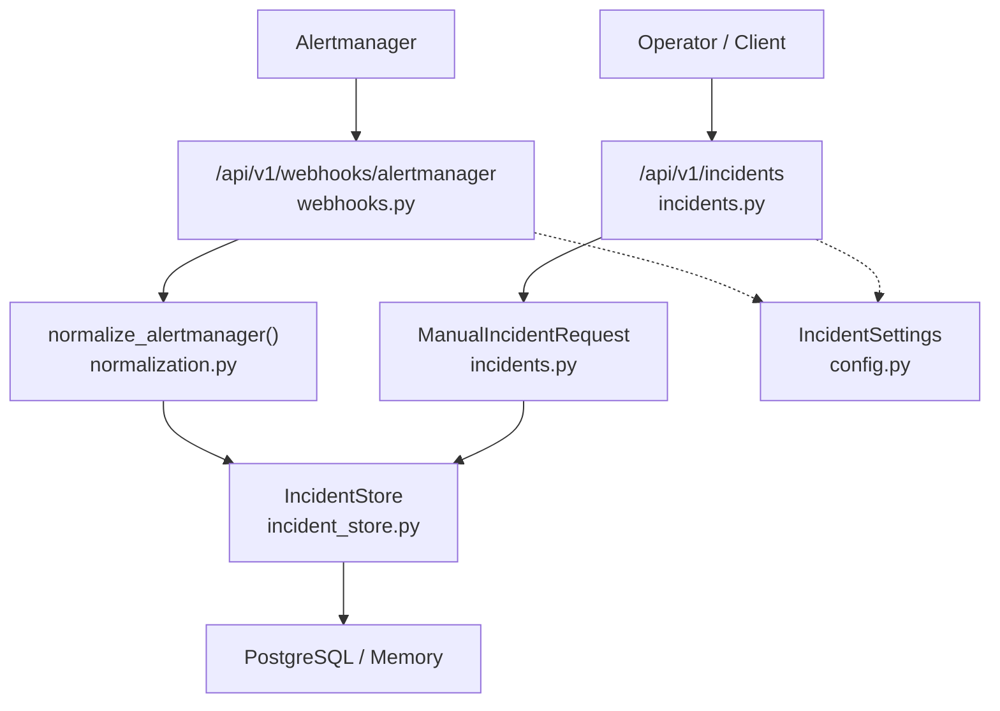
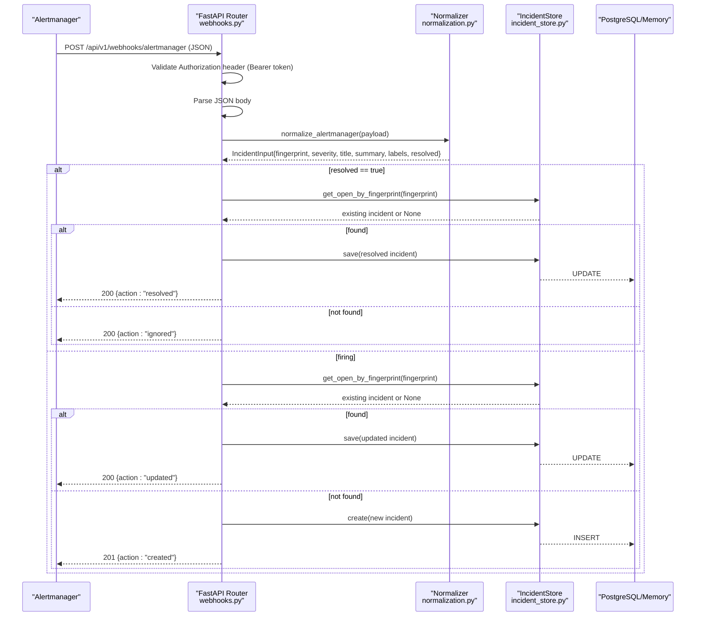
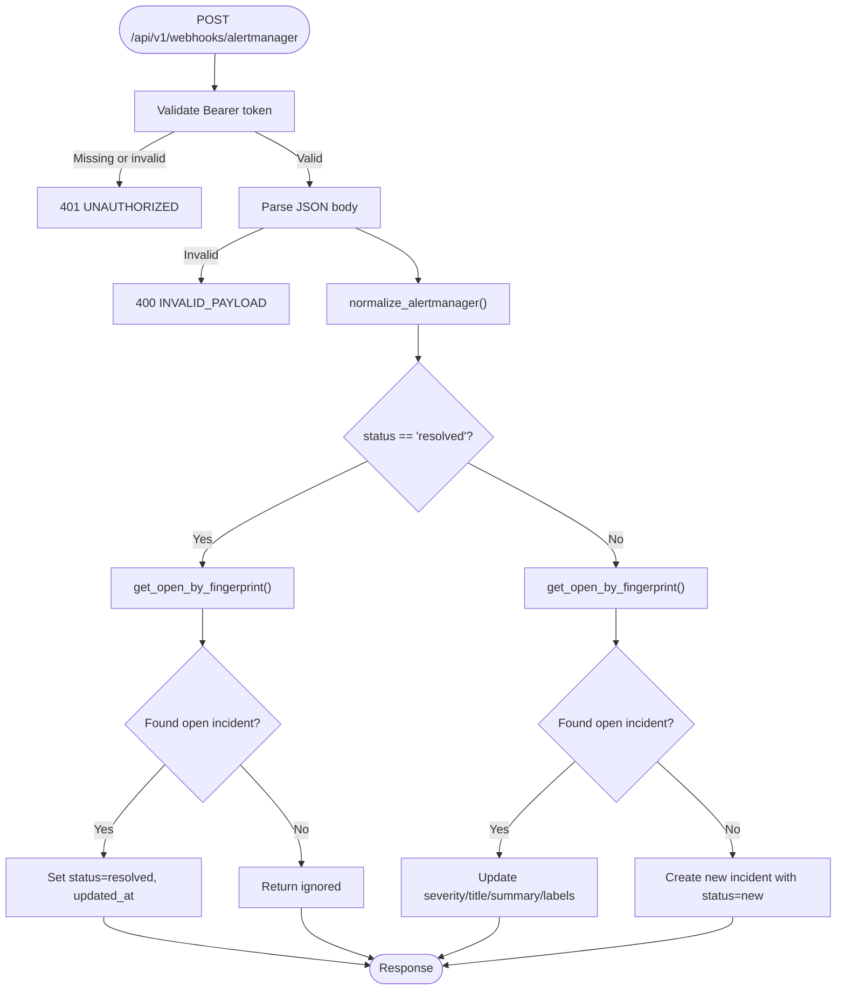
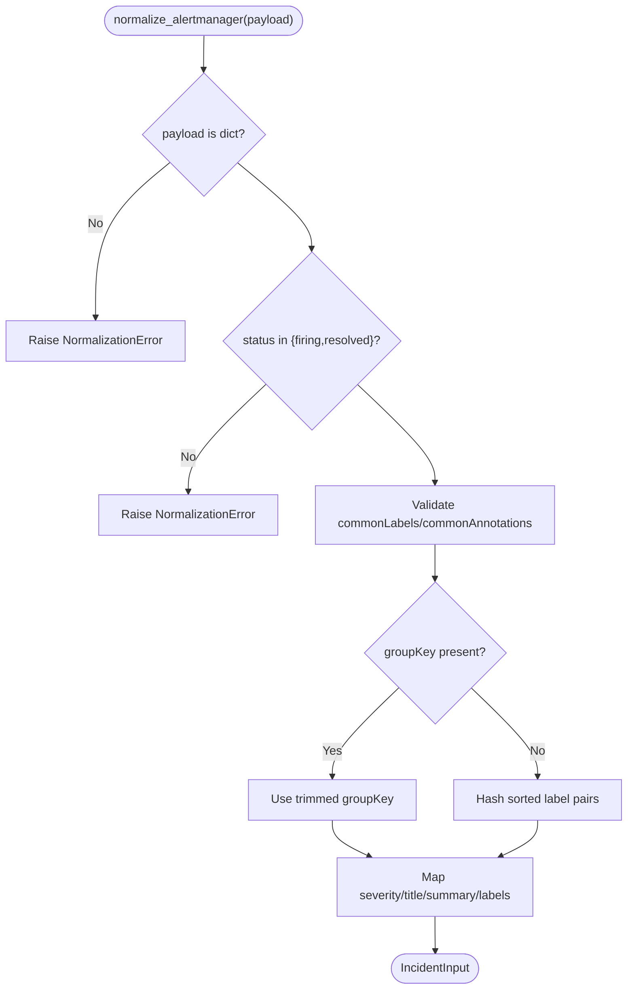
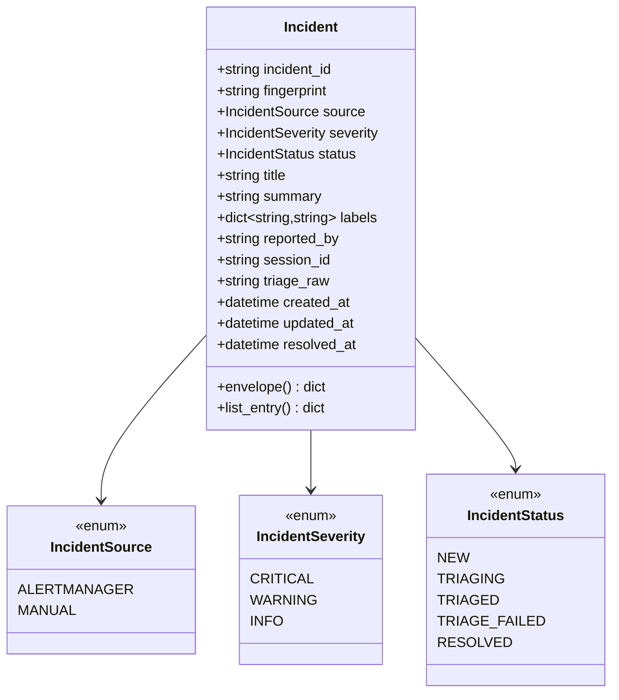
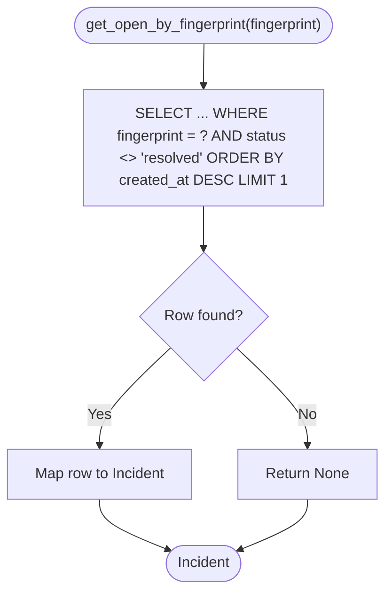
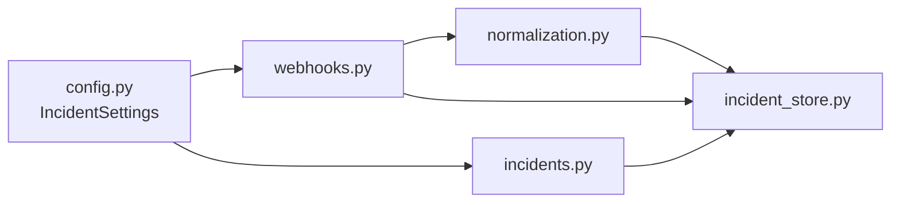

# Alert Ingestion and Normalization

<cite>
**Referenced Files in This Document**
- [webhooks.py](file://products/incident-service/src/incident_service/api/routes/webhooks.py)
- [normalization.py](file://products/incident-service/src/incident_service/services/normalization.py)
- [incident.py](file://products/incident-service/src/incident_service/schemas/incident.py)
- [incident_store.py](file://products/incident-service/src/incident_service/services/incident_store.py)
- [config.py](file://products/incident-service/src/incident_service/core/config.py)
- [incidents.py](file://products/incident-service/src/incident_service/api/routes/incidents.py)
- [incident.schema.json](file://shared/shared-contracts/schemas/incident.schema.json)
</cite>

## Table of Contents
1. [Introduction](#introduction)
2. [Project Structure](#project-structure)
3. [Core Components](#core-components)
4. [Architecture Overview](#architecture-overview)
5. [Detailed Component Analysis](#detailed-component-analysis)
6. [Dependency Analysis](#dependency-analysis)
7. [Performance Considerations](#performance-considerations)
8. [Troubleshooting Guide](#troubleshooting-guide)
9. [Conclusion](#conclusion)
10. [Appendices](#appendices)

## Introduction
This document explains the alert ingestion and normalization subsystem that receives alerts from external sources such as Alertmanager webhooks and manual operator reports, validates them against the canonical incident schema, and normalizes them into a consistent model with stable fields for source, severity, title, summary, and labels. It also documents the fingerprinting mechanism used to deduplicate related alerts and prevent incident storms, configuration options for different alert sources, authentication methods for webhook endpoints, and error handling for malformed or unauthorized requests. Examples of how vendor-specific fields are mapped to the platform’s canonical model are included.

## Project Structure
The alert ingestion and normalization logic is implemented in the incident-service product:
- Webhook intake route for Alertmanager events
- Manual incident creation route for operator reports
- Normalization layer mapping Alertmanager payloads to a canonical input
- Incident schema models bound to the shared contract
- Store abstraction with in-memory and PostgreSQL backends
- Configuration loaded from environment variables

**Diagram sources**
- [webhooks.py:69-102](file://products/incident-service/src/incident_service/api/routes/webhooks.py#L69-L102)
- [normalization.py:68-109](file://products/incident-service/src/incident_service/services/normalization.py#L68-L109)
- [incidents.py:74-128](file://products/incident-service/src/incident_service/api/routes/incidents.py#L74-L128)
- [incident_store.py:30-66](file://products/incident-service/src/incident_service/services/incident_store.py#L30-L66)
- [config.py:72-120](file://products/incident-service/src/incident_service/core/config.py#L72-L120)

**Section sources**
- [webhooks.py:1-102](file://products/incident-service/src/incident_service/api/routes/webhooks.py#L1-L102)
- [incidents.py:1-128](file://products/incident-service/src/incident_service/api/routes/incidents.py#L1-L128)
- [normalization.py:1-109](file://products/incident-service/src/incident_service/services/normalization.py#L1-L109)
- [incident_store.py:1-66](file://products/incident-service/src/incident_service/services/incident_store.py#L1-L66)
- [config.py:1-120](file://products/incident-service/src/incident_service/core/config.py#L1-L120)

## Core Components
- Webhook endpoint: Authenticates incoming Alertmanager webhooks using a bearer token, parses JSON, normalizes the payload, and creates or updates incidents based on fingerprint.
- Normalizer: Converts an Alertmanager v4 webhook payload into a canonical IncidentInput with deterministic fingerprinting, normalized severity, title, summary, and labels.
- Incident schema: Defines the canonical incident envelope (source, severity, status, title, summary, labels, timestamps) and enforces constraints aligned with the shared contract.
- Store: Persists incidents and supports deduplication by fingerprint; includes both in-memory and PostgreSQL implementations.
- Configuration: Provides settings for webhook token, store backend, database URL, connectors, and other runtime knobs.
- Manual intake: Allows authenticated operators to create incidents with a unique “manual:” fingerprint marker.

**Section sources**
- [webhooks.py:57-102](file://products/incident-service/src/incident_service/api/routes/webhooks.py#L57-L102)
- [normalization.py:15-109](file://products/incident-service/src/incident_service/services/normalization.py#L15-L109)
- [incident.py:18-63](file://products/incident-service/src/incident_service/schemas/incident.py#L18-L63)
- [incident_store.py:30-66](file://products/incident-service/src/incident_service/services/incident_store.py#L30-L66)
- [config.py:72-120](file://products/incident-service/src/incident_service/core/config.py#L72-L120)
- [incidents.py:74-128](file://products/incident-service/src/incident_service/api/routes/incidents.py#L74-L128)

## Architecture Overview
The ingestion pipeline ensures robust acceptance, validation, normalization, and persistence of alerts while preventing duplicate incidents through fingerprint-based deduplication.

**Diagram sources**
- [webhooks.py:69-206](file://products/incident-service/src/incident_service/api/routes/webhooks.py#L69-L206)
- [normalization.py:68-109](file://products/incident-service/src/incident_service/services/normalization.py#L68-L109)
- [incident_store.py:337-350](file://products/incident-service/src/incident_service/services/incident_store.py#L337-L350)

## Detailed Component Analysis

### Webhook Endpoint: Alertmanager Intake
- Authentication: Requires a configured bearer token via the Authorization header; fails closed if token is not set.
- Validation: Expects valid JSON; rejects malformed bodies.
- Normalization: Delegates to the normalizer to produce a canonical IncidentInput.
- Deduplication: Uses fingerprint to find open incidents; updates existing ones or creates new incidents. Resolutions close open incidents idempotently.
- Metrics and observability: Records intake metrics and logs key lifecycle events.

**Diagram sources**
- [webhooks.py:57-206](file://products/incident-service/src/incident_service/api/routes/webhooks.py#L57-L206)

**Section sources**
- [webhooks.py:57-206](file://products/incident-service/src/incident_service/api/routes/webhooks.py#L57-L206)

### Normalization Layer: Alertmanager v4 Payload Mapping
- Input validation: Ensures payload is a dict and status is either “firing” or “resolved”.
- Labels and annotations: Validates commonLabels and commonAnnotations as string maps with size and length limits.
- Fingerprinting:
  - Preferred: groupKey from the payload (trimmed and capped).
  - Fallback: Stable SHA-256 hash over sorted label pairs when groupKey is absent or empty.
- Severity mapping: Maps Alertmanager severity to canonical values; defaults to warning/info when missing or unrecognized.
- Title and summary: Derives title from annotations.summary or alertname; derives summary from annotations.description or a canonical label list.
- Output: Returns a frozen IncidentInput with normalized fields and a resolved flag.

**Diagram sources**
- [normalization.py:68-109](file://products/incident-service/src/incident_service/services/normalization.py#L68-L109)

**Section sources**
- [normalization.py:15-109](file://products/incident-service/src/incident_service/services/normalization.py#L15-L109)

### Canonical Incident Model and Schema Alignment
- The Incident model defines required fields including incident_id, fingerprint, source, severity, status, title, summary, labels, and timestamps. Optional fields include reported_by, session_id, triage_raw, and resolved_at.
- The shared contract schema enforces these constraints at the API boundary and ensures consistency across services.
- Envelope methods provide standardized serialization for responses.

**Diagram sources**
- [incident.py:18-63](file://products/incident-service/src/incident_service/schemas/incident.py#L18-L63)

**Section sources**
- [incident.py:18-63](file://products/incident-service/src/incident_service/schemas/incident.py#L18-L63)
- [incident.schema.json:1-95](file://shared/shared-contracts/schemas/incident.schema.json#L1-L95)

### Store and Deduplication Strategy
- Deduplication key: fingerprint. For Alertmanager incidents, this is derived from groupKey or a stable label hash; for manual reports, it uses a “manual:” marker with a UUID suffix to ensure uniqueness.
- Open incident lookup: get_open_by_fingerprint returns the most recent non-resolved incident matching the fingerprint.
- Persistence: Supports in-memory storage for dev/test and PostgreSQL for production with appropriate indexes for performance.

**Diagram sources**
- [incident_store.py:337-350](file://products/incident-service/src/incident_service/services/incident_store.py#L337-L350)

**Section sources**
- [incident_store.py:72-153](file://products/incident-service/src/incident_service/services/incident_store.py#L72-L153)
- [incident_store.py:280-350](file://products/incident-service/src/incident_service/services/incident_store.py#L280-L350)

### Manual Operator Reports
- Authentication: Requires a registered platform-caller credential (Basic registry or projected workload token).
- Payload validation: Enforces title, summary, severity, and label constraints.
- Fingerprinting: Always creates a new incident with a unique “manual:<uuid>” fingerprint to avoid accidental merges.
- Response: Returns the full incident envelope.

**Section sources**
- [incidents.py:74-128](file://products/incident-service/src/incident_service/api/routes/incidents.py#L74-L128)

## Dependency Analysis
- Webhook route depends on:
  - Configuration for webhook token
  - Normalization for payload mapping
  - Store for persistence and deduplication
  - Metrics and observability utilities
- Normalization depends only on dataclasses and hashing; no external services.
- Store abstracts backend selection based on configuration.
- Manual intake depends on query authentication and store.

**Diagram sources**
- [config.py:72-120](file://products/incident-service/src/incident_service/core/config.py#L72-L120)
- [webhooks.py:69-102](file://products/incident-service/src/incident_service/api/routes/webhooks.py#L69-L102)
- [incidents.py:74-128](file://products/incident-service/src/incident_service/api/routes/incidents.py#L74-L128)
- [normalization.py:68-109](file://products/incident-service/src/incident_service/services/normalization.py#L68-L109)
- [incident_store.py:30-66](file://products/incident-service/src/incident_service/services/incident_store.py#L30-L66)

**Section sources**
- [config.py:72-120](file://products/incident-service/src/incident_service/core/config.py#L72-L120)
- [webhooks.py:69-102](file://products/incident-service/src/incident_service/api/routes/webhooks.py#L69-L102)
- [incidents.py:74-128](file://products/incident-service/src/incident_service/api/routes/incidents.py#L74-L128)
- [normalization.py:68-109](file://products/incident-service/src/incident_service/services/normalization.py#L68-L109)
- [incident_store.py:30-66](file://products/incident-service/src/incident_service/services/incident_store.py#L30-L66)

## Performance Considerations
- Deduplication queries use indexed lookups by fingerprint and filter out resolved incidents to reduce noise.
- Label normalization enforces maximum counts and lengths to prevent oversized payloads.
- Store implementation uses per-operation connections for low-volume traffic; PostgreSQL indexes support efficient listing and filtering.
- Metrics update after each ingestion event to reflect current open incident counts.

[No sources needed since this section provides general guidance]

## Troubleshooting Guide
Common issues and their handling:
- Missing webhook token: Endpoint returns 503 with code WEBHOOK_NOT_CONFIGURED.
- Unauthorized webhook request: Returns 401 UNAUTHORIZED.
- Malformed JSON body: Returns 400 INVALID_PAYLOAD.
- Invalid payload structure during normalization: Returns 400 INVALID_PAYLOAD with details from the normalizer.
- Resolution for unknown fingerprint: Idempotent no-op success response indicating ignored action.
- Manual report validation errors: Returns 400 INVALID_PAYLOAD with Pydantic validation messages.

Operational checks:
- Ensure INCIDENT_WEBHOOK_TOKEN is configured before enabling webhooks.
- Verify Authorization header format: “Bearer <token>”.
- Confirm Alertmanager sends status “firing” or “resolved” and includes groupKey or commonLabels.

**Section sources**
- [webhooks.py:57-102](file://products/incident-service/src/incident_service/api/routes/webhooks.py#L57-L102)
- [normalization.py:68-109](file://products/incident-service/src/incident_service/services/normalization.py#L68-L109)
- [incidents.py:74-128](file://products/incident-service/src/incident_service/api/routes/incidents.py#L74-L128)

## Conclusion
The alert ingestion and normalization subsystem provides a secure, validated, and deduplicated intake path for alerts from Alertmanager and manual operator reports. By normalizing vendor-specific fields into a canonical incident model and using fingerprint-based deduplication, it prevents incident storms and ensures consistent processing downstream. Configuration and authentication controls allow safe deployment in production environments, while clear error responses aid troubleshooting.

[No sources needed since this section summarizes without analyzing specific files]

## Appendices

### Configuration Options for Alert Sources
- INCIDENT_WEBHOOK_TOKEN: Required for Alertmanager webhook authentication; absence causes fail-closed behavior.
- INCIDENT_STORE_BACKEND: Selects memory or postgres backend.
- INCIDENT_DB_URL: Required when using postgres backend.
- INCIDENT_CONNECTORS: Controls outbound connectors for triage reports.
- INCIDENT_AGENT_SERVICE_URL, INCIDENT_TRIAGE_TIMEOUT_SECONDS: Triage-related settings.
- INCIDENT_AUDIT_SERVICE_URL, INCIDENT_AUDIT_CLIENT_ID, INCIDENT_AUDIT_CLIENT_SECRET: Audit integration settings.

**Section sources**
- [config.py:72-120](file://products/incident-service/src/incident_service/core/config.py#L72-L120)

### Example Alert Payloads and Field Mapping
- Alertmanager webhook fields:
  - status: “firing” or “resolved” maps to intake action (create/update vs resolve).
  - groupKey: Used as fingerprint when present; otherwise fallback to label hash.
  - commonLabels: Mapped to labels; alertname influences title; severity maps to canonical severity.
  - commonAnnotations: summary and description influence title and summary.
- Manual operator report fields:
  - title, summary, severity, labels: Directly mapped to canonical fields.
  - reported_by: Derived from operator identity or headers.
  - fingerprint: Unique “manual:<uuid>” to ensure no merging.

[No sources needed since this section describes conceptual mappings without quoting code]