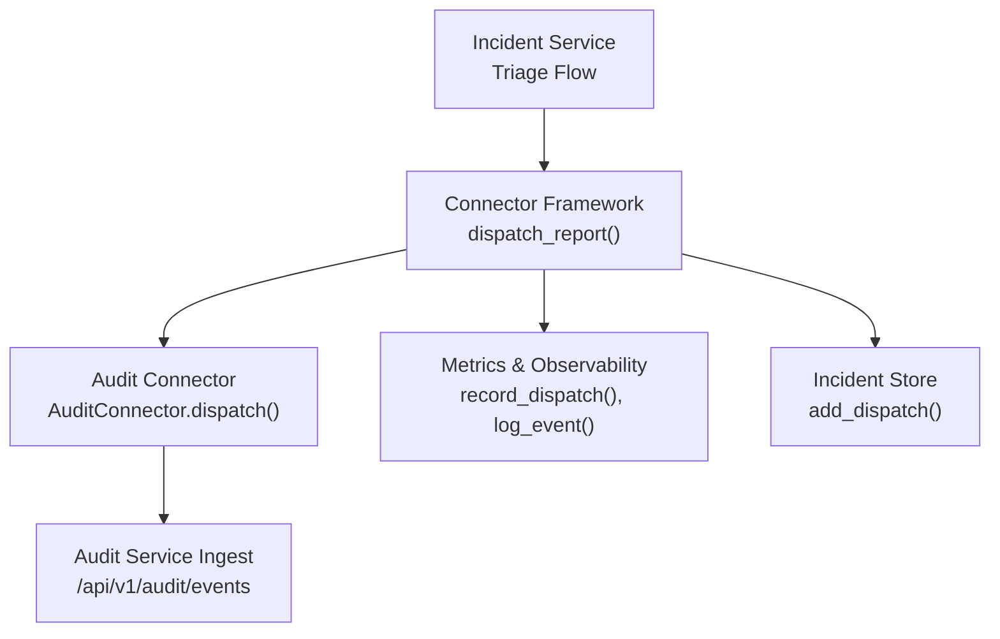
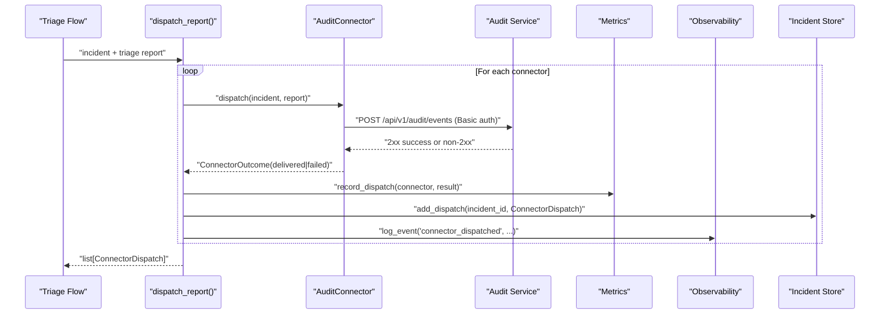
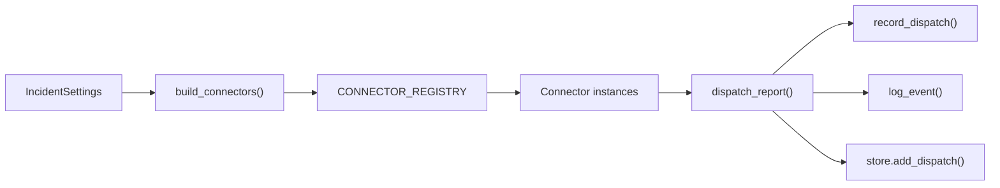

# Collaboration Connectors

<cite>
**Referenced Files in This Document**
- [connectors.py](file://products/incident-service/src/incident_service/services/connectors.py)
- [audit_emitter.py](file://products/incident-service/src/incident_service/services/audit_emitter.py)
- [incident.py](file://products/incident-service/src/incident_service/schemas/incident.py)
- [config.py](file://products/incident-service/src/incident_service/core/config.py)
- [metrics.py](file://products/incident-service/src/incident_service/core/metrics.py)
- [observability.py](file://products/incident-service/src/incident_service/core/observability.py)
- [test_connectors.py](file://products/incident-service/tests/test_connectors.py)
</cite>

## Table of Contents
1. [Introduction](#introduction)
2. [Project Structure](#project-structure)
3. [Core Components](#core-components)
4. [Architecture Overview](#architecture-overview)
5. [Detailed Component Analysis](#detailed-component-analysis)
6. [Dependency Analysis](#dependency-analysis)
7. [Performance Considerations](#performance-considerations)
8. [Troubleshooting Guide](#troubleshooting-guide)
9. [Conclusion](#conclusion)
10. [Appendices](#appendices)

## Introduction
This document explains the collaboration connector framework that dispatches incident triage outcomes to external systems. It focuses on the connector abstraction, the built-in audit connector for durable compliance records, event payload structure, error handling and isolation, configuration, authentication, monitoring, and security considerations. The goal is to help operators and developers integrate new collaboration platforms or audit sinks reliably without risking the core triage flow.

## Project Structure
The collaboration connector framework lives in the incident-service product:
- Connector abstraction and dispatcher: products/incident-service/src/incident_service/services/connectors.py
- Built-in audit connector implementation: products/incident-service/src/incident_service/services/audit_emitter.py
- Incident and report data models used by connectors: products/incident-service/src/incident_service/schemas/incident.py
- Configuration loading (including connector selection and audit credentials): products/incident-service/src/incident_service/core/config.py
- Metrics and observability hooks used during dispatch: products/incident-service/src/incident_service/core/metrics.py and products/incident-service/src/incident_service/core/observability.py
- Tests validating behavior: products/incident-service/tests/test_connectors.py

**Diagram sources**
- [connectors.py:87-126](file://products/incident-service/src/incident_service/services/connectors.py#L87-L126)
- [audit_emitter.py:62-94](file://products/incident-service/src/incident_service/services/audit_emitter.py#L62-L94)
- [metrics.py:97-98](file://products/incident-service/src/incident_service/core/metrics.py#L97-L98)
- [observability.py:21-23](file://products/incident-service/src/incident_service/core/observability.py#L21-L23)

**Section sources**
- [connectors.py:1-126](file://products/incident-service/src/incident_service/services/connectors.py#L1-L126)
- [audit_emitter.py:1-94](file://products/incident-service/src/incident_service/services/audit_emitter.py#L1-L94)
- [incident.py:37-116](file://products/incident-service/src/incident_service/schemas/incident.py#L37-L116)
- [config.py:62-89](file://products/incident-service/src/incident_service/core/config.py#L62-L89)
- [metrics.py:47-51](file://products/incident-service/src/incident_service/core/metrics.py#L47-L51)
- [observability.py:9-23](file://products/incident-service/src/incident_service/core/observability.py#L9-L23)

## Core Components
- Connector protocol: a minimal async interface with name and dispatch(incident, report). Implementations return a ConnectorOutcome indicating delivered or failed with optional reference and error details.
- Registry and builder: CONNECTOR_REGISTRY maps names to factories; build_connectors instantiates configured connectors and fails fast on unknown names.
- Dispatcher: dispatch_report iterates configured connectors, isolates failures, records metrics, persists per-incident dispatch outcomes, and emits structured logs.
- Audit connector: implements Connector for the audit sink, building an incident_triaged event and posting it to the audit service using Basic auth from settings.

Key behaviors:
- Failure isolation: exceptions in a connector do not abort other connectors or the triage path.
- Durability: every dispatch attempt is persisted against the incident.
- Observability: metrics and structured logs are emitted for each connector outcome.

**Section sources**
- [connectors.py:31-84](file://products/incident-service/src/incident_service/services/connectors.py#L31-L84)
- [connectors.py:87-126](file://products/incident-service/src/incident_service/services/connectors.py#L87-L126)
- [audit_emitter.py:30-94](file://products/incident-service/src/incident_service/services/audit_emitter.py#L30-L94)
- [incident.py:106-116](file://products/incident-service/src/incident_service/schemas/incident.py#L106-L116)

## Architecture Overview
The dispatcher coordinates multiple connectors. Each connector encapsulates transport and authentication to its target system. The built-in audit connector posts a single event envelope to the audit service ingest endpoint. All outcomes are recorded and observable.

**Diagram sources**
- [connectors.py:87-126](file://products/incident-service/src/incident_service/services/connectors.py#L87-L126)
- [audit_emitter.py:62-94](file://products/incident-service/src/incident_service/services/audit_emitter.py#L62-L94)
- [metrics.py:97-98](file://products/incident-service/src/incident_service/core/metrics.py#L97-L98)
- [observability.py:21-23](file://products/incident-service/src/incident_service/core/observability.py#L21-L23)

## Detailed Component Analysis

### Connector Abstraction and Registry
- Protocol defines name and async dispatch(incident, report) returning ConnectorOutcome.
- Registry holds name-to-factory mappings; currently includes "audit".
- build_connectors validates requested connector names at startup and raises ConnectorConfigError for unknown entries.

Extensibility points:
- Add a new factory function that returns a Connector instance.
- Register it under a unique name in CONNECTOR_REGISTRY.
- Select via INCIDENT_CONNECTORS environment variable.

**Section sources**
- [connectors.py:31-84](file://products/incident-service/src/incident_service/services/connectors.py#L31-L84)

### Dispatcher and Error Isolation
- Iterates all configured connectors.
- Wraps each call in try/except to capture exceptions as failed outcomes.
- Records metrics and logs per connector.
- Persists ConnectorDispatch per incident for later inspection.

Retry strategy:
- No automatic retry is implemented in the dispatcher. Failures are recorded and surfaced through metrics/logs and stored dispatch outcomes. Operators can implement retries at the connector level if needed.

**Section sources**
- [connectors.py:87-126](file://products/incident-service/src/incident_service/services/connectors.py#L87-L126)
- [test_connectors.py:194-207](file://products/incident-service/tests/test_connectors.py#L194-L207)

### Built-in Audit Connector
- Builds an incident_triaged event containing incident envelope, severity assessment, report summary, next steps, and skills cited.
- Posts to audit-service ingest endpoint with Basic auth derived from INCIDENT_AUDIT_* settings.
- Returns delivered when HTTP 2xx, otherwise failed with status code context.
- If audit URL is missing, returns failed with a clear configuration error message.

Event payload highlights:
- event_type: "incident_triaged"
- service: "incident-service"
- details.incident: full incident envelope
- details.next_steps: titles of next steps
- details.skills_cited: list of skill identifiers

**Section sources**
- [audit_emitter.py:30-94](file://products/incident-service/src/incident_service/services/audit_emitter.py#L30-L94)
- [incident.py:37-104](file://products/incident-service/src/incident_service/schemas/incident.py#L37-L104)

### Data Models and Payloads
- Incident and TriageReport models enforce field constraints and provide envelope() methods for contract-compliant serialization.
- ConnectorDispatch captures connector name, status, optional reference/error, and timestamp.

These models ensure payloads sent to connectors and stored outcomes remain consistent and auditable.

**Section sources**
- [incident.py:37-116](file://products/incident-service/src/incident_service/schemas/incident.py#L37-L116)

### Configuration and Authentication
- INCIDENT_CONNECTORS selects which connectors to instantiate; defaults to "audit" when empty.
- INCIDENT_AUDIT_SERVICE_URL, INCIDENT_AUDIT_CLIENT_ID, INCIDENT_AUDIT_CLIENT_SECRET configure the audit connector’s endpoint and Basic auth.
- Unknown connector names cause startup failure via ConnectorConfigError.

Authentication method:
- Audit connector uses HTTP Basic authentication with client_id and client_secret from settings.

**Section sources**
- [config.py:62-89](file://products/incident-service/src/incident_service/core/config.py#L62-L89)
- [audit_emitter.py:35-39](file://products/incident-service/src/incident_service/services/audit_emitter.py#L35-L39)
- [test_connectors.py:90-138](file://products/incident-service/tests/test_connectors.py#L90-L138)

### Monitoring and Observability
- Metrics: incident_connector_dispatches_total labeled by connector and result tracks delivery attempts and outcomes.
- Logs: structured events emitted for each dispatch with connector name, incident id, result, reference, and error.
- Health: connector health can be inferred from dispatch metrics and stored dispatch outcomes.

Operational tips:
- Alert on rising failed counts for specific connectors.
- Correlate incidents with connector failures using incident_id in logs and stored dispatches.

**Section sources**
- [metrics.py:47-51](file://products/incident-service/src/incident_service/core/metrics.py#L47-L51)
- [metrics.py:97-98](file://products/incident-service/src/incident_service/core/metrics.py#L97-L98)
- [observability.py:21-23](file://products/incident-service/src/incident_service/core/observability.py#L21-L23)

### Extensibility: Adding a Custom Connector
Steps:
1. Implement a class with name attribute and async dispatch(incident, report) returning ConnectorOutcome.
2. Create a factory that accepts IncidentSettings and returns the connector instance.
3. Register the factory in CONNECTOR_REGISTRY under a unique name.
4. Include the connector name in INCIDENT_CONNECTORS.
5. Ensure your connector handles network errors and returns ConnectorOutcome(status="failed", error=...) rather than raising.

Validation and testing:
- Use tests similar to those in test_connectors.py to assert delivered/failed paths and isolation behavior.

**Section sources**
- [connectors.py:44-84](file://products/incident-service/src/incident_service/services/connectors.py#L44-L84)
- [test_connectors.py:182-221](file://products/incident-service/tests/test_connectors.py#L182-L221)

## Dependency Analysis
The dispatcher depends on:
- Connector implementations (e.g., AuditConnector)
- Settings for connector selection and credentials
- Metrics and logging utilities
- Incident store for persistence

**Diagram sources**
- [config.py:62-89](file://products/incident-service/src/incident_service/core/config.py#L62-L89)
- [connectors.py:66-84](file://products/incident-service/src/incident_service/services/connectors.py#L66-L84)
- [connectors.py:87-126](file://products/incident-service/src/incident_service/services/connectors.py#L87-L126)
- [metrics.py:97-98](file://products/incident-service/src/incident_service/core/metrics.py#L97-L98)
- [observability.py:21-23](file://products/incident-service/src/incident_service/core/observability.py#L21-L23)

**Section sources**
- [connectors.py:66-126](file://products/incident-service/src/incident_service/services/connectors.py#L66-L126)
- [config.py:62-89](file://products/incident-service/src/incident_service/core/config.py#L62-L89)

## Performance Considerations
- Dispatch is synchronous across connectors but each connector call is isolated; keep connector dispatch calls efficient and bounded by timeouts.
- Avoid heavy work inside dispatch; prefer lightweight transports and fail fast on errors.
- Persisting dispatch outcomes adds small overhead; ensure store operations are efficient.
- Monitor incident_connector_dispatches_total and http_request_duration_seconds to detect latency regressions.

[No sources needed since this section provides general guidance]

## Troubleshooting Guide
Common issues and diagnostics:
- Unknown connector name: build_connectors raises ConnectorConfigError at startup. Check INCIDENT_CONNECTORS and registry.
- Audit connector failures:
  - Missing audit URL: returns failed with configuration error.
  - Network errors: returns failed with unreachable error.
  - Non-2xx responses: returns failed with status code context.
- Connector exception: dispatcher converts to failed outcome; check logs for connector name and error.

Diagnostics:
- Inspect incident_connector_dispatches_total for per-connector failure rates.
- Review structured logs for connector_dispatched events including incident_id and error fields.
- Query stored dispatches per incident to see exact outcomes.

**Section sources**
- [connectors.py:73-84](file://products/incident-service/src/incident_service/services/connectors.py#L73-L84)
- [connectors.py:99-105](file://products/incident-service/src/incident_service/services/connectors.py#L99-L105)
- [audit_emitter.py:65-94](file://products/incident-service/src/incident_service/services/audit_emitter.py#L65-L94)
- [metrics.py:97-98](file://products/incident-service/src/incident_service/core/metrics.py#L97-L98)
- [test_connectors.py:139-167](file://products/incident-service/tests/test_connectors.py#L139-L167)

## Conclusion
The collaboration connector framework provides a robust, extensible mechanism to deliver incident triage outcomes to external systems while preserving reliability and observability. The built-in audit connector ensures durable compliance records, and the connector abstraction enables adding new integrations with minimal risk to the triage flow. With clear configuration, authentication, metrics, and logging, operators can monitor health and troubleshoot effectively.

[No sources needed since this section summarizes without analyzing specific files]

## Appendices

### Event Payload Structure (Audit Connector)
- Top-level fields include event_id, occurred_at, event_type ("incident_triaged"), service ("incident-service"), request_id, username, session_id, outcome ("success"), and details.
- details contains:
  - incident: full incident envelope
  - severity_assessment: enum value
  - report_summary: string
  - next_steps: list of titles
  - skills_cited: list of skill identifiers

**Section sources**
- [audit_emitter.py:40-60](file://products/incident-service/src/incident_service/services/audit_emitter.py#L40-L60)
- [incident.py:37-104](file://products/incident-service/src/incident_service/schemas/incident.py#L37-L104)

### Configuration Examples
- Enable audit connector only: set INCIDENT_CONNECTORS to empty or "audit".
- Configure audit service integration:
  - INCIDENT_AUDIT_SERVICE_URL: base URL of audit service
  - INCIDENT_AUDIT_CLIENT_ID: client id for Basic auth
  - INCIDENT_AUDIT_CLIENT_SECRET: secret for Basic auth
- Add custom connectors: register in CONNECTOR_REGISTRY and include their names in INCIDENT_CONNECTORS.

**Section sources**
- [config.py:62-89](file://products/incident-service/src/incident_service/core/config.py#L62-L89)
- [audit_emitter.py:35-39](file://products/incident-service/src/incident_service/services/audit_emitter.py#L35-L39)

### Security Considerations
- Credential management:
  - Use INCIDENT_AUDIT_* environment variables for audit credentials; avoid hardcoding secrets.
  - Restrict access to environment variables and deployment manifests.
- Network policies:
  - Allow outbound traffic from incident-service to audit-service endpoints only.
  - Enforce TLS where supported by the audit service.
- Data sanitization:
  - Incident and report envelopes are validated by Pydantic models before emission.
  - Only necessary fields are included in the audit event details.
- Authentication:
  - Audit connector uses Basic auth with client_id and client_secret; ensure these are scoped and rotated appropriately.

**Section sources**
- [incident.py:37-104](file://products/incident-service/src/incident_service/schemas/incident.py#L37-L104)
- [audit_emitter.py:35-39](file://products/incident-service/src/incident_service/services/audit_emitter.py#L35-L39)
- [audit_emitter.py:72-80](file://products/incident-service/src/incident_service/services/audit_emitter.py#L72-L80)