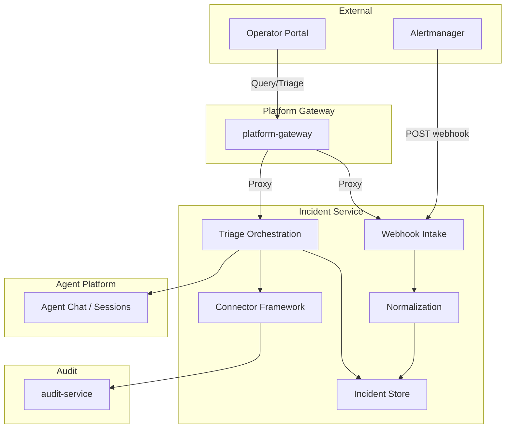
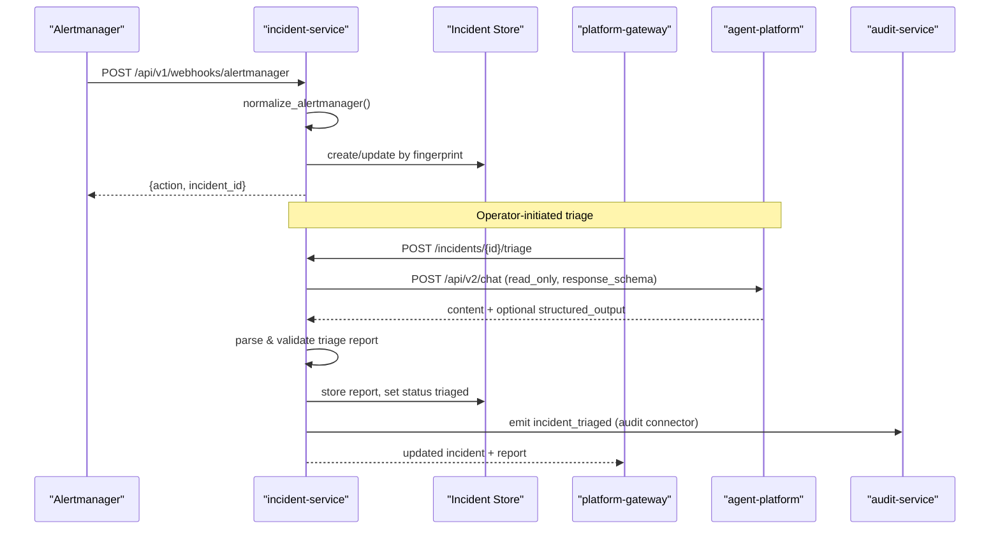
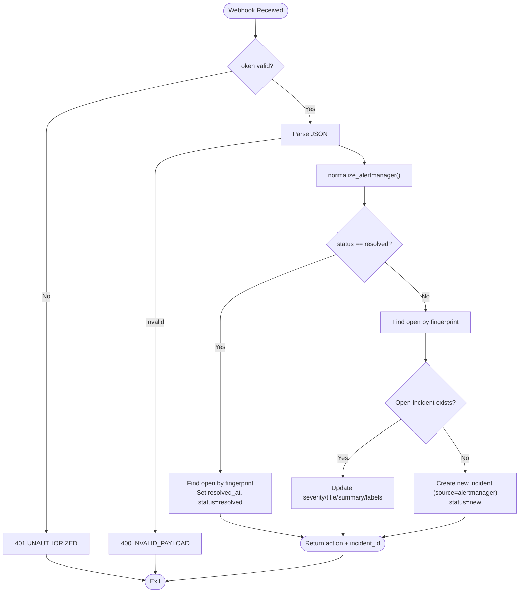
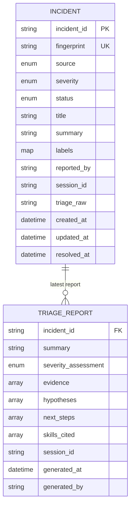
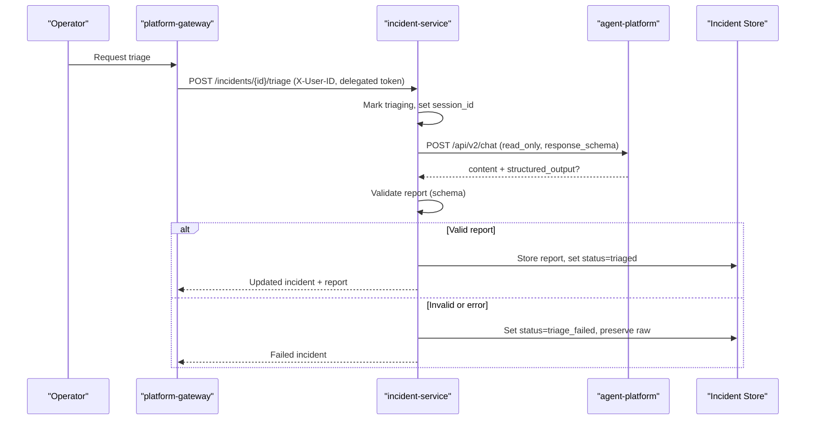
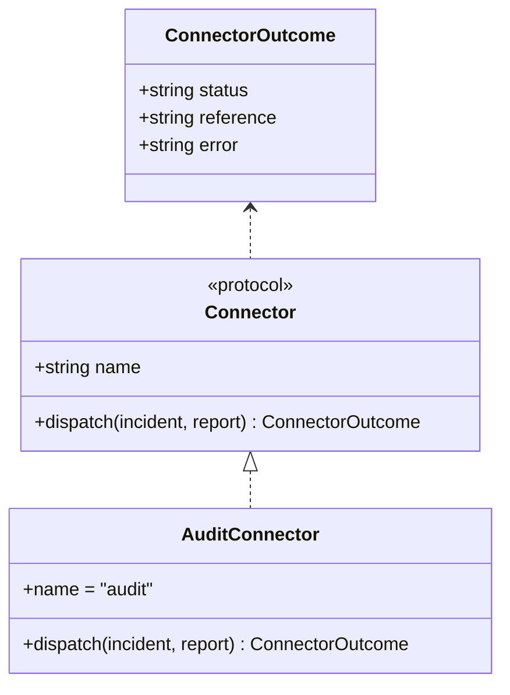
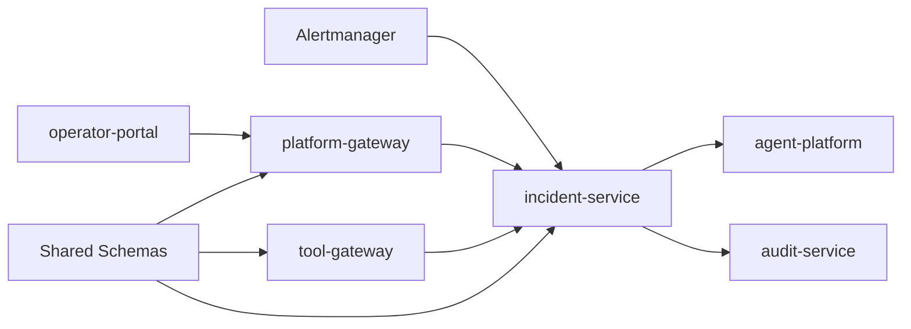

# Incident Management

<cite>
**Referenced Files in This Document**
- [incident-guide.md](file://docs/guides/incident-guide.md)
- [SPEC-015 spec.md](file://docs/specs/SPEC-015-incident-triage-and-collaboration/spec.md)
- [incident-service README.md](file://products/incident-service/README.md)
- [webhooks.py](file://products/incident-service/src/incident_service/api/routes/webhooks.py)
- [normalization.py](file://products/incident-service/src/incident_service/services/normalization.py)
- [triage.py](file://products/incident-service/src/incident_service/services/triage.py)
- [connectors.py](file://products/incident-service/src/incident_service/services/connectors.py)
- [incident.schema.json](file://shared/shared-contracts/schemas/incident.schema.json)
- [triage-report.schema.json](file://shared/shared-contracts/schemas/triage-report.schema.json)
</cite>

## Table of Contents
1. [Introduction](#introduction)
2. [Project Structure](#project-structure)
3. [Core Components](#core-components)
4. [Architecture Overview](#architecture-overview)
5. [Detailed Component Analysis](#detailed-component-analysis)
6. [Dependency Analysis](#dependency-analysis)
7. [Performance Considerations](#performance-considerations)
8. [Troubleshooting Guide](#troubleshooting-guide)
9. [Conclusion](#conclusion)
10. [Appendices](#appendices)

## Introduction
This document explains the incident management capabilities that enable automated alert intake, triage, and collaboration. It covers how the incident-service ingests alerts from Alertmanager webhooks and manual operator reports, normalizes them into a canonical model, deduplicates incidents using fingerprinting, runs agent-driven triage to produce validated triage reports with ranked advisory next steps, and dispatches outcomes through a pluggable connector framework including a built-in audit sink. It also describes the Incidents view in the operator portal for managing active incidents, viewing triage reports, and continuing investigation in chat sessions, along with configuration guidance for alert sources, triage workflows, and connector endpoints.

## Project Structure
The incident management slice spans several products:
- incident-service: core service for intake, normalization, storage, triage orchestration, and connector dispatch
- platform-gateway: relays portal requests to incident-service with identity and policy enforcement
- tool-gateway: registers read-only incidents tools for agents
- agent-platform: executes the triage turn under an operator’s delegated token
- operator-portal: provides the Incidents panel for operators
- shared contracts: JSON schemas defining the incident envelope and triage report

**Diagram sources**
- [webhooks.py:69-102](file://products/incident-service/src/incident_service/api/routes/webhooks.py#L69-L102)
- [triage.py:219-276](file://products/incident-service/src/incident_service/services/triage.py#L219-L276)
- [connectors.py:87-126](file://products/incident-service/src/incident_service/services/connectors.py#L87-L126)

**Section sources**
- [incident-service README.md:1-82](file://products/incident-service/README.md#L1-L82)
- [SPEC-015 spec.md:13-23](file://docs/specs/SPEC-015-incident-triage-and-collaboration/spec.md#L13-L23)

## Core Components
- Webhook intake: Accepts Alertmanager v4 payloads, authenticates via bearer token, normalizes into a canonical input, and creates or updates incidents by fingerprint; resolves open incidents on resolved status.
- Normalization: Pure mapping from Alertmanager payload to a canonical IncidentInput with stable fingerprint, severity mapping, title/summary derivation, and label limits.
- Triage orchestration: Runs one agent turn in a dedicated session per incident, enforces read-only mode, extracts a schema-validated triage report (structured output preferred, fenced block fallback), persists it, and transitions status accordingly.
- Connector framework: Pluggable protocol for pushing validated reports to collaboration surfaces; ships a built-in audit sink that emits structured events and records per-incident dispatch outcomes.
- Schemas: Shared JSON schemas define the incident envelope and triage report contract used across intake, triage capture, connectors, tools, and the portal.

**Section sources**
- [webhooks.py:69-206](file://products/incident-service/src/incident_service/api/routes/webhooks.py#L69-L206)
- [normalization.py:1-110](file://products/incident-service/src/incident_service/services/normalization.py#L1-L110)
- [triage.py:1-371](file://products/incident-service/src/incident_service/services/triage.py#L1-L371)
- [connectors.py:1-127](file://products/incident-service/src/incident_service/services/connectors.py#L1-L127)
- [incident.schema.json:1-95](file://shared/shared-contracts/schemas/incident.schema.json#L1-L95)
- [triage-report.schema.json:1-120](file://shared/shared-contracts/schemas/triage-report.schema.json#L1-L120)

## Architecture Overview
The system follows a clear pipeline:
- Alertmanager sends firing/resolved groups to the incident-service webhook.
- The webhook authenticates, normalizes, and deduplicates by fingerprint, creating or updating incidents.
- Operators trigger triage via the portal through platform-gateway; incident-service calls agent-platform to run one read-only turn in a dedicated session.
- A validated triage report is stored and dispatched to configured connectors (default: audit).
- The portal displays incidents, triage reports, and allows continuation in the associated chat session.

**Diagram sources**
- [webhooks.py:69-102](file://products/incident-service/src/incident_service/api/routes/webhooks.py#L69-L102)
- [triage.py:219-276](file://products/incident-service/src/incident_service/services/triage.py#L219-L276)
- [connectors.py:87-126](file://products/incident-service/src/incident_service/services/connectors.py#L87-L126)

## Detailed Component Analysis

### Webhook Intake and Deduplication
- Authentication: Bearer token check; fails closed when unconfigured.
- Normalization: Validates payload shape, maps severity, derives title/summary, computes stable fingerprint (groupKey or label hash).
- Dedupe and resolution: Open incidents are updated on re-fire; resolved status closes the incident; unknown fingerprint resolution is idempotent no-op.

**Diagram sources**
- [webhooks.py:57-102](file://products/incident-service/src/incident_service/api/routes/webhooks.py#L57-L102)
- [webhooks.py:105-206](file://products/incident-service/src/incident_service/api/routes/webhooks.py#L105-L206)
- [normalization.py:68-110](file://products/incident-service/src/incident_service/services/normalization.py#L68-L110)

**Section sources**
- [webhooks.py:69-206](file://products/incident-service/src/incident_service/api/routes/webhooks.py#L69-L206)
- [normalization.py:1-110](file://products/incident-service/src/incident_service/services/normalization.py#L1-L110)

### Canonical Model and Schemas
- Incident envelope fields include identifiers, source, severity, lifecycle status, human-readable title/summary, labels, timestamps, and optional fields for reported_by, session_id, triage_raw, and resolved_at.
- Triage report fields include summary, severity assessment, evidence references, hypotheses, ranked next steps with priorities, cited skills, and server-minted attribution fields.

**Diagram sources**
- [incident.schema.json:1-95](file://shared/shared-contracts/schemas/incident.schema.json#L1-L95)
- [triage-report.schema.json:1-120](file://shared/shared-contracts/schemas/triage-report.schema.json#L1-L120)

**Section sources**
- [incident.schema.json:1-95](file://shared/shared-contracts/schemas/incident.schema.json#L1-L95)
- [triage-report.schema.json:1-120](file://shared/shared-contracts/schemas/triage-report.schema.json#L1-L120)

### Agent-Driven Triage Process
- Session strategy: Dedicated session per incident; if owned by another operator, falls back to a per-operator suffix so re-triage works without collisions.
- Prompt discipline: Read-only tools only, evidence gathering, skill citation, grounded hypotheses, advisory next steps.
- Output handling: Prefers kernel-validated structured output; falls back to fenced block parsing; attributes are server-minted to prevent spoofing.
- State transitions: triaging → triaged (report stored) or triage_failed (raw text preserved); latest report wins on re-triage.

**Diagram sources**
- [triage.py:99-136](file://products/incident-service/src/incident_service/services/triage.py#L99-L136)
- [triage.py:171-186](file://products/incident-service/src/incident_service/services/triage.py#L171-L186)
- [triage.py:219-276](file://products/incident-service/src/incident_service/services/triage.py#L219-L276)
- [triage.py:290-371](file://products/incident-service/src/incident_service/services/triage.py#L290-L371)

**Section sources**
- [triage.py:1-371](file://products/incident-service/src/incident_service/services/triage.py#L1-L371)

### Collaboration Connector Framework
- Protocol: Each connector exposes name and async dispatch(incident, report) returning a structured outcome.
- Registry: Connectors are selected via configuration; unknown names fail startup fast.
- Built-in audit sink: Emits structured incident_triaged events and records per-incident dispatch outcomes; failures are recorded but never fail triage.

**Diagram sources**
- [connectors.py:35-53](file://products/incident-service/src/incident_service/services/connectors.py#L35-L53)
- [connectors.py:59-70](file://products/incident-service/src/incident_service/services/connectors.py#L59-L70)

**Section sources**
- [connectors.py:1-127](file://products/incident-service/src/incident_service/services/connectors.py#L1-L127)

### Operator Portal Incidents View
- List and filter by status, severity, source; rows show opened time, title, severity/status badges, source, and id.
- Detail view shows metadata, labels, summary, triage report (if present), and connector dispatch outcomes.
- Actions: Run triage (progress and failure states), draft as skill (from validated report), continue in chat (opens the incident’s triage session), and report incident (manual intake form).
- “Continue in chat” is gated at render time based on caller’s live session list; disabled gracefully when session expired or owned by another operator.

**Section sources**
- [incident-guide.md:75-121](file://docs/guides/incident-guide.md#L75-L121)

## Dependency Analysis
- incident-service depends on:
  - Alertmanager webhook format (external)
  - Agent-platform chat and sessions APIs (for triage)
  - Audit-service (for built-in audit connector)
  - Postgres or in-memory store (selected by configuration)
- platform-gateway proxies portal requests to incident-service with identity and policy enforcement.
- tool-gateway registers read-only incidents tools backed by incident-service query API.
- Shared schemas enforce consistency across components.

**Diagram sources**
- [incident-service README.md:72-82](file://products/incident-service/README.md#L72-L82)
- [SPEC-015 spec.md:310-335](file://docs/specs/SPEC-015-incident-triage-and-collaboration/spec.md#L310-L335)

**Section sources**
- [incident-service README.md:72-82](file://products/incident-service/README.md#L72-L82)
- [SPEC-015 spec.md:310-335](file://docs/specs/SPEC-015-incident-triage-and-collaboration/spec.md#L310-L335)

## Performance Considerations
- Fingerprint deduplication avoids duplicate incidents and reduces storage growth.
- Label and annotation size limits protect against oversized payloads during normalization.
- Triage timeout and read-only mode constrain agent turns to bounded, safe operations.
- Connector dispatch isolation ensures downstream failures do not impact triage latency or success.

[No sources needed since this section provides general guidance]

## Troubleshooting Guide
- Webhook authentication failures return 401; unconfigured token returns 503. Malformed payloads return 400.
- Triage failures mark the incident triage_failed and preserve raw agent text for inspection.
- Unknown connector names fail startup fast; connector dispatch failures are recorded without failing triage.
- Portal “Continue in chat” may be disabled if the triage session is expired or owned by another operator; use “Draft as skill” instead.

**Section sources**
- [webhooks.py:57-93](file://products/incident-service/src/incident_service/api/routes/webhooks.py#L57-L93)
- [triage.py:279-371](file://products/incident-service/src/incident_service/services/triage.py#L279-L371)
- [connectors.py:73-84](file://products/incident-service/src/incident_service/services/connectors.py#L73-L84)
- [incident-guide.md:101-121](file://docs/guides/incident-guide.md#L101-L121)

## Conclusion
The incident management slice delivers a robust, operator-centric workflow: reliable alert intake with deduplication, schema-backed canonical models, agent-driven triage producing validated reports with ranked advisory next steps, and a pluggable connector framework with a durable audit sink. The operator portal provides a cohesive experience for managing incidents, reviewing triage outputs, and continuing investigations in chat. Configuration knobs allow secure integration with Alertmanager, agent-platform, and audit-service while keeping the platform strictly advisory in this release.

[No sources needed since this section summarizes without analyzing specific files]

## Appendices

### Configuration Reference
- Alertmanager webhook:
  - Endpoint: POST /api/v1/webhooks/alertmanager
  - Authorization: Bearer token from INCIDENT_WEBHOOK_TOKEN
  - Payload: Alertmanager v4 webhook format; groupKey drives identity; status selects fire vs resolve; commonLabels and commonAnnotations feed labels, title, and summary
- Triage workflow:
  - Trigger: POST /api/v1/incidents/{incident_id}/triage via platform-gateway
  - Identity: X-User-ID and delegated bearer relayed from platform-gateway
  - Timeout: INCIDENT_TRIAGE_TIMEOUT_SECONDS (default 120)
- Connector endpoints:
  - Built-in audit connector uses INCIDENT_AUDIT_SERVICE_URL and client credentials to emit incident_triaged events
  - Additional connectors can be added by implementing the Connector protocol and registering in the registry; select via INCIDENT_CONNECTORS

**Section sources**
- [incident-guide.md:36-74](file://docs/guides/incident-guide.md#L36-L74)
- [incident-service README.md:43-61](file://products/incident-service/README.md#L43-L61)
- [connectors.py:59-84](file://products/incident-service/src/incident_service/services/connectors.py#L59-L84)