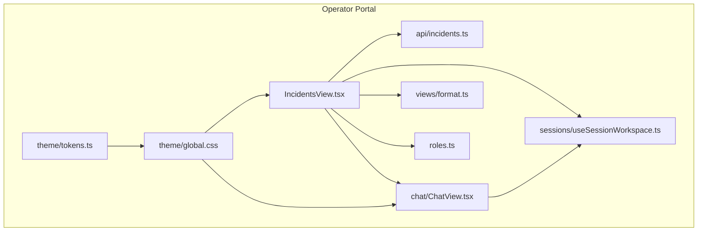
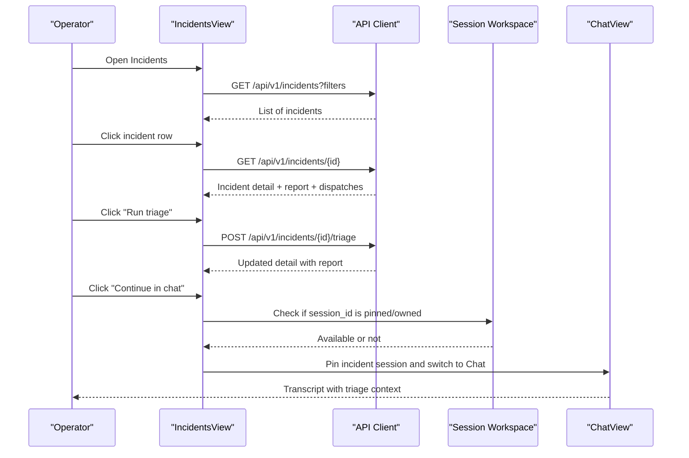
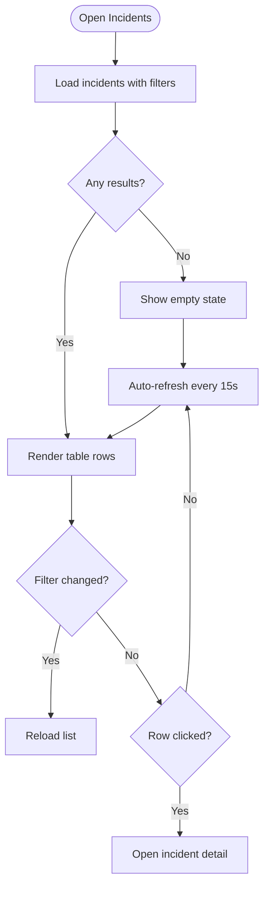
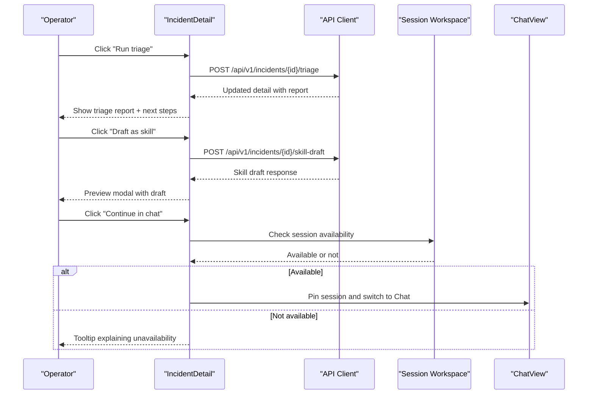
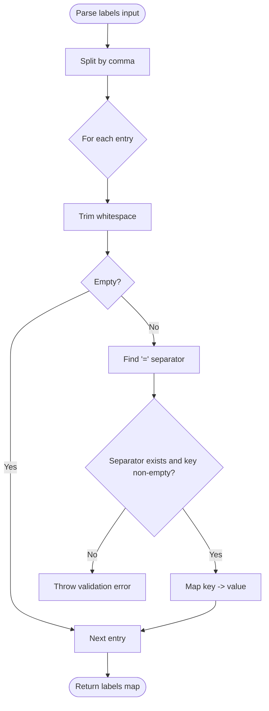
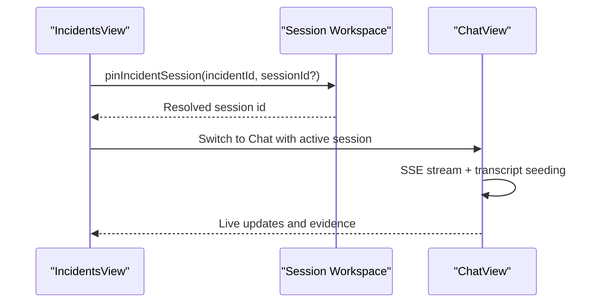
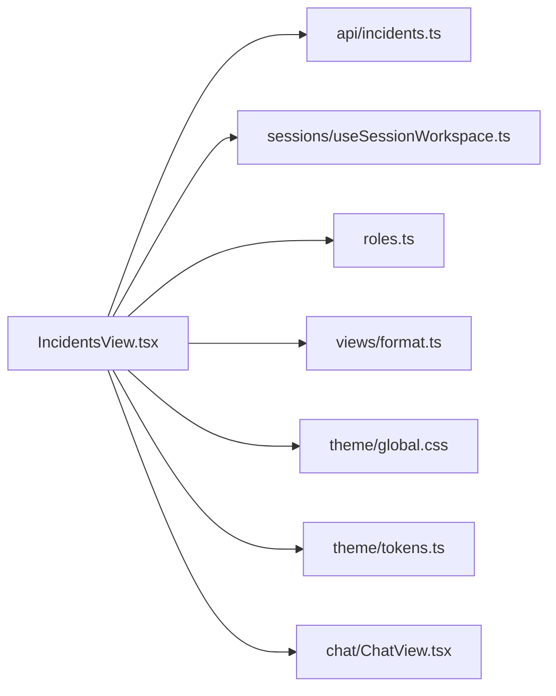

# Operator Portal Interface

<cite>
**Referenced Files in This Document**
- [IncidentsView.tsx](file://products/operator-portal/web-ui/app/src/views/incidents/IncidentsView.tsx)
- [labels.ts](file://products/operator-portal/web-ui/app/src/views/incidents/labels.ts)
- [incidents.ts](file://products/operator-portal/web-ui/app/src/api/incidents.ts)
- [ChatView.tsx](file://products/operator-portal/web-ui/app/src/chat/ChatView.tsx)
- [useSessionWorkspace.ts](file://products/operator-portal/web-ui/app/src/sessions/useSessionWorkspace.ts)
- [format.ts](file://products/operator-portal/web-ui/app/src/views/format.ts)
- [roles.ts](file://products/operator-portal/web-ui/app/src/roles.ts)
- [tokens.ts](file://products/operator-portal/web-ui/app/src/theme/tokens.ts)
- [global.css](file://products/operator-portal/web-ui/app/src/theme/global.css)
</cite>

## Table of Contents
1. Introduction
2. Project Structure
3. Core Components
4. Architecture Overview
5. Detailed Component Analysis
6. Dependency Analysis
7. Performance Considerations
8. Troubleshooting Guide
9. Conclusion

## Introduction
This document explains the operator portal interface for managing incidents throughout their lifecycle. It covers the Incidents list view, the incident detail panel (including triage reports, evidence, hypotheses, and next steps), integration with chat sessions for continuing investigations, the label system, severity visualization, workflow controls (triage, status transitions, closing), user interaction patterns, real-time updates, accessibility features, responsive design, and mobile-friendly behaviors for on-call operators.

## Project Structure
The operator portal is a React application built with Ant Design. The incident management UI lives under views/incidents, with API clients under api, session workspace state under sessions, and shared theming and styles under theme. Chat and session interactions are implemented in chat and sessions modules.

**Diagram sources**
- [IncidentsView.tsx:1-699](file://products/operator-portal/web-ui/app/src/views/incidents/IncidentsView.tsx#L1-L699)
- [incidents.ts:1-144](file://products/operator-portal/web-ui/app/src/api/incidents.ts#L1-L144)
- [useSessionWorkspace.ts:1-283](file://products/operator-portal/web-ui/app/src/sessions/useSessionWorkspace.ts#L1-L283)
- [ChatView.tsx:1-800](file://products/operator-portal/web-ui/app/src/chat/ChatView.tsx#L1-L800)
- [global.css:1-694](file://products/operator-portal/web-ui/app/src/theme/global.css#L1-L694)
- [tokens.ts:1-43](file://products/operator-portal/web-ui/app/src/theme/tokens.ts#L1-L43)
- [format.ts:1-7](file://products/operator-portal/web-ui/app/src/views/format.ts#L1-L7)
- [roles.ts:1-95](file://products/operator-portal/web-ui/app/src/roles.ts#L1-L95)

**Section sources**
- [IncidentsView.tsx:1-699](file://products/operator-portal/web-ui/app/src/views/incidents/IncidentsView.tsx#L1-L699)
- [incidents.ts:1-144](file://products/operator-portal/web-ui/app/src/api/incidents.ts#L1-L144)
- [useSessionWorkspace.ts:1-283](file://products/operator-portal/web-ui/app/src/sessions/useSessionWorkspace.ts#L1-L283)
- [ChatView.tsx:1-800](file://products/operator-portal/web-ui/app/src/chat/ChatView.tsx#L1-L800)
- [global.css:1-694](file://products/operator-portal/web-ui/app/src/theme/global.css#L1-L694)
- [tokens.ts:1-43](file://products/operator-portal/web-ui/app/src/theme/tokens.ts#L1-L43)
- [format.ts:1-7](file://products/operator-portal/web-ui/app/src/views/format.ts#L1-L7)
- [roles.ts:1-95](file://products/operator-portal/web-ui/app/src/roles.ts#L1-L95)

## Core Components
- Incidents list view: role-gated table with filters (status, severity, source), manual refresh, and auto-refresh every 15 seconds while not in detail mode. Rows open the incident detail panel.
- Incident detail panel: shows incident metadata, labels, summary, triage report (if available), connector dispatches, and workflow actions (run/re-run triage, draft as skill, continue in chat).
- Label system: supports key=value pairs parsed from a single input field; rejects malformed entries client-side.
- Severity visualization: color-coded tags for incident severity and triage assessment; priority tags for next steps.
- Chat integration: “Continue in chat” deep-links to the incident’s triage session if it is still owned by the current operator and visible in the session workspace.
- Session workspace: polls sessions every 30 seconds, persists active session per mode, and pins incident sessions for quick access.

**Section sources**
- [IncidentsView.tsx:103-165](file://products/operator-portal/web-ui/app/src/views/incidents/IncidentsView.tsx#L103-L165)
- [IncidentsView.tsx:238-259](file://products/operator-portal/web-ui/app/src/views/incidents/IncidentsView.tsx#L238-L259)
- [IncidentsView.tsx:262-418](file://products/operator-portal/web-ui/app/src/views/incidents/IncidentsView.tsx#L262-L418)
- [IncidentsView.tsx:421-699](file://products/operator-portal/web-ui/app/src/views/incidents/IncidentsView.tsx#L421-L699)
- [labels.ts:1-15](file://products/operator-portal/web-ui/app/src/views/incidents/labels.ts#L1-L15)
- [incidents.ts:78-144](file://products/operator-portal/web-ui/app/src/api/incidents.ts#L78-L144)
- [useSessionWorkspace.ts:89-136](file://products/operator-portal/web-ui/app/src/sessions/useSessionWorkspace.ts#L89-L136)
- [useSessionWorkspace.ts:240-266](file://products/operator-portal/web-ui/app/src/sessions/useSessionWorkspace.ts#L240-L266)

## Architecture Overview
The Incidents view composes UI state, API calls, and session workspace state to present a live, interactive incident management surface. When an operator opens an incident, the detail panel can trigger triage, display generated guidance, and optionally open the associated chat session if it is still available.

**Diagram sources**
- [IncidentsView.tsx:133-178](file://products/operator-portal/web-ui/app/src/views/incidents/IncidentsView.tsx#L133-L178)
- [IncidentsView.tsx:185-196](file://products/operator-portal/web-ui/app/src/views/incidents/IncidentsView.tsx#L185-L196)
- [IncidentsView.tsx:238-259](file://products/operator-portal/web-ui/app/src/views/incidents/IncidentsView.tsx#L238-L259)
- [incidents.ts:78-111](file://products/operator-portal/web-ui/app/src/api/incidents.ts#L78-L111)
- [useSessionWorkspace.ts:240-266](file://products/operator-portal/web-ui/app/src/sessions/useSessionWorkspace.ts#L240-L266)
- [ChatView.tsx:1-800](file://products/operator-portal/web-ui/app/src/chat/ChatView.tsx#L1-L800)

## Detailed Component Analysis

### Incidents View (List)
- Role gating: Only users with incident-visible roles can see the view; others receive an informational alert.
- Filters: Status, severity, and source dropdowns update query parameters and reload the list.
- Auto-refresh: While in list mode, the view polls every 15 seconds to reflect ongoing changes. Manual refresh is also available.
- Table columns: opened time, title, severity badge, status badge, source, incident id. Rows are clickable to open details.
- Manual intake: Authorized users can report an incident with title, summary, severity, and labels. Labels are validated client-side before submission.

**Diagram sources**
- [IncidentsView.tsx:103-165](file://products/operator-portal/web-ui/app/src/views/incidents/IncidentsView.tsx#L103-L165)
- [IncidentsView.tsx:262-418](file://products/operator-portal/web-ui/app/src/views/incidents/IncidentsView.tsx#L262-L418)

**Section sources**
- [IncidentsView.tsx:103-165](file://products/operator-portal/web-ui/app/src/views/incidents/IncidentsView.tsx#L103-L165)
- [IncidentsView.tsx:262-418](file://products/operator-portal/web-ui/app/src/views/incidents/IncidentsView.tsx#L262-L418)
- [roles.ts:6-21](file://products/operator-portal/web-ui/app/src/roles.ts#L6-L21)

### Incident Detail Panel
- Metadata: Shows incident id, fingerprint, timestamps, reported_by, resolved_at, and labels as tags.
- Triage report: If available, renders severity assessment, generation metadata, markdown summary, evidence references, hypotheses, next steps with priority tags, and cited skills.
- Connector dispatches: Displays connector name, status, reference, error (on failure), and timestamp.
- Workflow controls:
  - Run triage / Re-run triage: Triggers agent triage and updates the panel with the new report.
  - Draft as skill: Creates an incident-anchored skill draft from the validated triage (requires appropriate role).
  - Continue in chat: Opens the incident’s triage session in the chat workspace if the session is currently owned by the operator and visible in the workspace.

**Diagram sources**
- [IncidentsView.tsx:185-196](file://products/operator-portal/web-ui/app/src/views/incidents/IncidentsView.tsx#L185-L196)
- [IncidentsView.tsx:421-589](file://products/operator-portal/web-ui/app/src/views/incidents/IncidentsView.tsx#L421-L589)
- [incidents.ts:102-144](file://products/operator-portal/web-ui/app/src/api/incidents.ts#L102-L144)
- [useSessionWorkspace.ts:240-266](file://products/operator-portal/web-ui/app/src/sessions/useSessionWorkspace.ts#L240-L266)

**Section sources**
- [IncidentsView.tsx:421-699](file://products/operator-portal/web-ui/app/src/views/incidents/IncidentsView.tsx#L421-L699)
- [incidents.ts:102-144](file://products/operator-portal/web-ui/app/src/api/incidents.ts#L102-L144)
- [useSessionWorkspace.ts:240-266](file://products/operator-portal/web-ui/app/src/sessions/useSessionWorkspace.ts#L240-L266)

### Label System
- Input format: Comma-separated key=value pairs.
- Validation: Rejects entries without a non-empty key; skips empty entries.
- Usage: Used when reporting incidents manually.

**Diagram sources**
- [labels.ts:1-15](file://products/operator-portal/web-ui/app/src/views/incidents/labels.ts#L1-L15)

**Section sources**
- [labels.ts:1-15](file://products/operator-portal/web-ui/app/src/views/incidents/labels.ts#L1-L15)
- [IncidentsView.tsx:198-226](file://products/operator-portal/web-ui/app/src/views/incidents/IncidentsView.tsx#L198-L226)

### Severity Visualization and Status Indicators
- Severity badges: Color-coded tags for critical, warning, info.
- Status badges: Visual indicators for new, triaging, triaged, triage_failed, resolved.
- Priority tags: Immediate, soon, later for next steps.
- Dispatch statuses: pending, sent, succeeded, failed with tooltips for errors.

**Section sources**
- [IncidentsView.tsx:56-89](file://products/operator-portal/web-ui/app/src/views/incidents/IncidentsView.tsx#L56-L89)
- [IncidentsView.tsx:481-505](file://products/operator-portal/web-ui/app/src/views/incidents/IncidentsView.tsx#L481-L505)
- [IncidentsView.tsx:623-699](file://products/operator-portal/web-ui/app/src/views/incidents/IncidentsView.tsx#L623-L699)

### Chat Integration and Real-Time Updates
- Deep-link behavior: The “Continue in chat” button is enabled only when the incident’s triage session is present in the operator’s session workspace (indicating ownership and visibility).
- Session workspace: Polls sessions every 30 seconds, maintains pinned incident sessions, and sets the active session for immediate continuation.
- Chat transcript: Renders tool evidence, confirmation cards, and arrival highlights for newly arrived content.

**Diagram sources**
- [IncidentsView.tsx:238-259](file://products/operator-portal/web-ui/app/src/views/incidents/IncidentsView.tsx#L238-L259)
- [useSessionWorkspace.ts:240-266](file://products/operator-portal/web-ui/app/src/sessions/useSessionWorkspace.ts#L240-L266)
- [ChatView.tsx:1-800](file://products/operator-portal/web-ui/app/src/chat/ChatView.tsx#L1-L800)

**Section sources**
- [IncidentsView.tsx:238-259](file://products/operator-portal/web-ui/app/src/views/incidents/IncidentsView.tsx#L238-L259)
- [useSessionWorkspace.ts:89-136](file://products/operator-portal/web-ui/app/src/sessions/useSessionWorkspace.ts#L89-L136)
- [useSessionWorkspace.ts:240-266](file://products/operator-portal/web-ui/app/src/sessions/useSessionWorkspace.ts#L240-L266)
- [ChatView.tsx:1-800](file://products/operator-portal/web-ui/app/src/chat/ChatView.tsx#L1-L800)

### Accessibility and Responsive Design
- Dark theme: Consistent tokens via antd theme configuration and CSS custom properties.
- Focus visibility: Global focus ring ensures keyboard navigation clarity.
- Reduced motion: Animations adapt to prefers-reduced-motion for turn arrival highlights.
- Mobile-friendly: On narrow screens, the session panel narrows; a mobile menu button provides off-canvas navigation below a breakpoint.
- Semantic inputs: Form fields include aria-labels for screen readers.

**Section sources**
- [tokens.ts:1-43](file://products/operator-portal/web-ui/app/src/theme/tokens.ts#L1-L43)
- [global.css:1-694](file://products/operator-portal/web-ui/app/src/theme/global.css#L1-L694)
- [IncidentsView.tsx:288-390](file://products/operator-portal/web-ui/app/src/views/incidents/IncidentsView.tsx#L288-L390)

## Dependency Analysis
- IncidentsView depends on:
  - API client for listing, fetching, triaging, reporting, and drafting skills.
  - Session workspace for checking chat availability and pinning incident sessions.
  - Roles for client-side gating of view and actions.
  - Formatting utilities for timestamps.
  - Theme and global styles for consistent UI.

**Diagram sources**
- [IncidentsView.tsx:1-699](file://products/operator-portal/web-ui/app/src/views/incidents/IncidentsView.tsx#L1-L699)
- [incidents.ts:1-144](file://products/operator-portal/web-ui/app/src/api/incidents.ts#L1-L144)
- [useSessionWorkspace.ts:1-283](file://products/operator-portal/web-ui/app/src/sessions/useSessionWorkspace.ts#L1-L283)
- [roles.ts:1-95](file://products/operator-portal/web-ui/app/src/roles.ts#L1-L95)
- [format.ts:1-7](file://products/operator-portal/web-ui/app/src/views/format.ts#L1-L7)
- [global.css:1-694](file://products/operator-portal/web-ui/app/src/theme/global.css#L1-L694)
- [tokens.ts:1-43](file://products/operator-portal/web-ui/app/src/theme/tokens.ts#L1-L43)
- [ChatView.tsx:1-800](file://products/operator-portal/web-ui/app/src/chat/ChatView.tsx#L1-L800)

**Section sources**
- [IncidentsView.tsx:1-699](file://products/operator-portal/web-ui/app/src/views/incidents/IncidentsView.tsx#L1-L699)
- [incidents.ts:1-144](file://products/operator-portal/web-ui/app/src/api/incidents.ts#L1-L144)
- [useSessionWorkspace.ts:1-283](file://products/operator-portal/web-ui/app/src/sessions/useSessionWorkspace.ts#L1-L283)
- [roles.ts:1-95](file://products/operator-portal/web-ui/app/src/roles.ts#L1-L95)
- [format.ts:1-7](file://products/operator-portal/web-ui/app/src/views/format.ts#L1-L7)
- [global.css:1-694](file://products/operator-portal/web-ui/app/src/theme/global.css#L1-L694)
- [tokens.ts:1-43](file://products/operator-portal/web-ui/app/src/theme/tokens.ts#L1-L43)
- [ChatView.tsx:1-800](file://products/operator-portal/web-ui/app/src/chat/ChatView.tsx#L1-L800)

## Performance Considerations
- Auto-refresh cadence: The list view refreshes every 15 seconds while in list mode; this balances freshness with network load.
- Session polling: The session workspace polls every 30 seconds to keep the chat deep-link accurate and avoid stale session states.
- Evidence budgeting: Chat transcripts cap large payloads and show truncated markers to maintain responsiveness.
- Rendering efficiency: Collapsed evidence panels and bounded panes prevent layout thrash during heavy data loads.

[No sources needed since this section provides general guidance]

## Troubleshooting Guide
- No incidents match filters: Adjust filters or clear them to expand the result set.
- Triage not available: Ensure the incident has a validated triage report before attempting to draft a skill; otherwise, run triage first.
- Skill draft unavailable: Errors may indicate missing permissions, no validated triage, validation service not configured, or unreachable validation service.
- Continue in chat disabled: The incident’s triage session may be expired, not yet visible, or owned by another operator; draft a skill instead.
- Label parsing errors: Ensure labels are provided as key=value pairs separated by commas; entries without a non-empty key are rejected.

**Section sources**
- [IncidentsView.tsx:198-226](file://products/operator-portal/web-ui/app/src/views/incidents/IncidentsView.tsx#L198-L226)
- [IncidentsView.tsx:445-479](file://products/operator-portal/web-ui/app/src/views/incidents/IncidentsView.tsx#L445-L479)
- [IncidentsView.tsx:573-587](file://products/operator-portal/web-ui/app/src/views/incidents/IncidentsView.tsx#L573-L587)
- [labels.ts:1-15](file://products/operator-portal/web-ui/app/src/views/incidents/labels.ts#L1-L15)

## Conclusion
The operator portal provides a comprehensive, role-gated interface for incident management. Operators can filter and monitor active incidents, inspect detailed triage outputs, collaborate via integrated chat sessions, and perform workflow actions such as triage and skill drafting. Real-time updates, accessibility features, and responsive design ensure a productive experience for on-call operators across devices.

[No sources needed since this section summarizes without analyzing specific files]