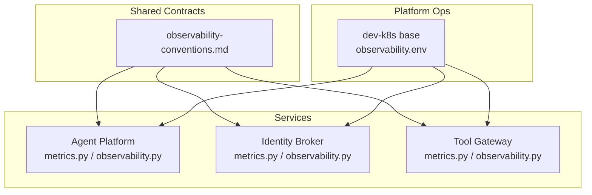
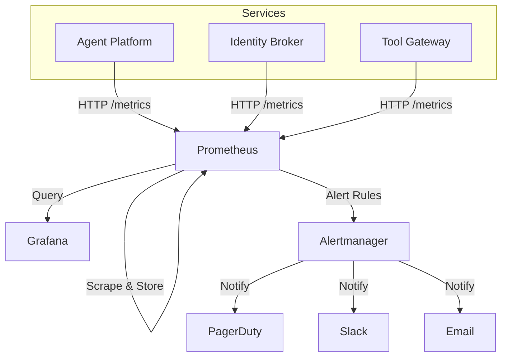
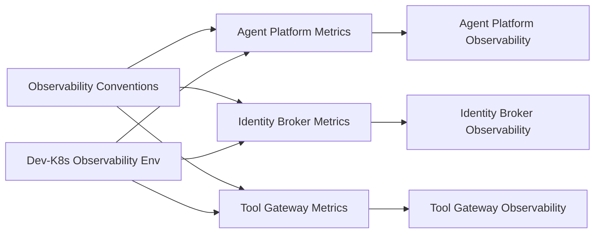

# Alerting and Dashboards

<cite>
**Referenced Files in This Document**
- [observability-conventions.md](file://shared/shared-contracts/observability-conventions.md)
- [SPEC-005-observability-baseline/spec.md](file://docs/specs/SPEC-005-observability-baseline/spec.md)
- [agent-platform core metrics](file://products/agent-platform/src/agent_service/core/metrics.py)
- [agent-platform core observability](file://products/agent-platform/src/agent_service/core/observability.py)
- [identity-broker core metrics](file://products/identity-broker/src/identity_service/core/metrics.py)
- [identity-broker core observability](file://products/identity-broker/src/identity_service/core/observability.py)
- [tool-gateway core metrics](file://products/tool-gateway/src/api_gateway/core/metrics.py)
- [tool-gateway core observability](file://products/tool-gateway/src/api_gateway/core/observability.py)
- [dev-k8s observability env](file://shared/platform-ops/gitops/dev-k8s/base/infra/observability.env)
</cite>

## Table of Contents
1. [Introduction](#introduction)
2. [Project Structure](#project-structure)
3. [Core Components](#core-components)
4. [Architecture Overview](#architecture-overview)
5. [Detailed Component Analysis](#detailed-component-analysis)
6. [Dependency Analysis](#dependency-analysis)
7. [Performance Considerations](#performance-considerations)
8. [Troubleshooting Guide](#troubleshooting-guide)
9. [Conclusion](#conclusion)
10. [Appendices](#appendices)

## Introduction
This document provides comprehensive guidance for alerting rules and dashboard configuration across the platform’s observability stack. It covers:
- Prometheus alerting rules for critical system metrics, warning thresholds, and incident response triggers
- Grafana dashboard templates, key performance indicators (KPIs), and operational visibility requirements
- Guidance on creating custom alerts, notification channels, and escalation procedures
- Dashboard design principles, role-based access control (RBAC), and maintenance practices for observability infrastructure

The content is grounded in the project’s observability conventions and service-level metrics implementations to ensure consistency and reliability.

## Project Structure
Observability-related artifacts are primarily located under shared contracts and product services:
- Shared observability conventions define naming, labeling, and metric exposure standards
- Each service exposes metrics and telemetry via dedicated modules
- Kubernetes overlays include environment variables that configure observability components

**Diagram sources**
- [observability-conventions.md](file://shared/shared-contracts/observability-conventions.md)
- [agent-platform core metrics](file://products/agent-platform/src/agent_service/core/metrics.py)
- [agent-platform core observability](file://products/agent-platform/src/agent_service/core/observability.py)
- [identity-broker core metrics](file://products/identity-broker/src/identity_service/core/metrics.py)
- [identity-broker core observability](file://products/identity-broker/src/identity_service/core/observability.py)
- [tool-gateway core metrics](file://products/tool-gateway/src/api_gateway/core/metrics.py)
- [tool-gateway core observability](file://products/tool-gateway/src/api_gateway/core/observability.py)
- [dev-k8s observability env](file://shared/platform-ops/gitops/dev-k8s/base/infra/observability.env)

**Section sources**
- [observability-conventions.md](file://shared/shared-contracts/observability-conventions.md)
- [dev-k8s observability env](file://shared/platform-ops/gitops/dev-k8s/base/infra/observability.env)

## Core Components
- Observability Conventions: Define consistent metric names, labels, and exposure patterns used by all services
- Service Metrics Modules: Implement counters, gauges, histograms, and summaries aligned with conventions
- Service Observability Modules: Configure tracing, logging, and health endpoints
- Kubernetes Environment: Provides observability-related configuration for development deployments

Key responsibilities:
- Standardize metric definitions and label sets
- Expose HTTP endpoints for scraping
- Provide health checks and readiness/liveness probes
- Ensure consistent telemetry across services

**Section sources**
- [observability-conventions.md](file://shared/shared-contracts/observability-conventions.md)
- [agent-platform core metrics](file://products/agent-platform/src/agent_service/core/metrics.py)
- [agent-platform core observability](file://products/agent-platform/src/agent_service/core/observability.py)
- [identity-broker core metrics](file://products/identity-broker/src/identity_service/core/metrics.py)
- [identity-broker core observability](file://products/identity-broker/src/identity_service/core/observability.py)
- [tool-gateway core metrics](file://products/tool-gateway/src/api_gateway/core/metrics.py)
- [tool-gateway core observability](file://products/tool-gateway/src/api_gateway/core/observability.py)

## Architecture Overview
The observability architecture follows a standard pattern:
- Services expose metrics over HTTP endpoints
- Prometheus scrapes these endpoints and stores time series data
- Grafana consumes Prometheus data to render dashboards
- Alertmanager processes alert rules and routes notifications

[No sources needed since this diagram shows conceptual workflow, not actual code structure]

## Detailed Component Analysis

### Prometheus Alerting Rules
- Critical System Metrics: CPU utilization, memory pressure, disk I/O saturation, network errors, and service error rates
- Warning Thresholds: Elevated latency percentiles, increased error ratios, resource exhaustion warnings
- Incident Response Triggers: Service down, unresponsive health endpoints, sustained high error rates, queue backlogs

Guidelines:
- Use standardized labels (service, namespace, instance)
- Apply multi-window evaluation to reduce noise
- Include runbook links in annotations
- Separate critical and warning severities

Example rule categories:
- Availability: Service health endpoint failures
- Performance: Latency p95/p99 spikes
- Resource: Memory/CPU/disk nearing limits
- Errors: HTTP 5xx rate increases
- Dependencies: Downstream service connectivity issues

[No sources needed since this section provides general guidance]

### Grafana Dashboard Templates
- KPIs: Request throughput, error rate, latency percentiles, resource utilization, dependency health
- Operational Visibility: Real-time status, trend analysis, anomaly detection, drill-down by service and instance
- Template Structure: Global variables for environment, templated panels per service, reusable queries

Design principles:
- Consistent layout and color coding
- Clear hierarchy from overview to details
- Time-range controls and refresh intervals
- Annotations for incidents and deployments

[No sources needed since this section provides general guidance]

### Custom Alerts Creation
Steps:
- Identify metric and threshold based on SLOs or business impact
- Define query and conditions with appropriate windows
- Set severity levels and routing rules
- Add annotations and runbook references
- Validate with synthetic traffic or historical data

Notification Channels:
- PagerDuty for critical incidents
- Slack for warnings and team awareness
- Email for non-urgent notifications and reports

Escalation Procedures:
- Auto-escalate after initial response timeout
- Page on-call engineers for critical alerts
- Notify stakeholders for extended outages

[No sources needed since this section provides general guidance]

### Role-Based Access Control (RBAC)
- Viewers: Read-only access to dashboards and logs
- Editors: Can create/edit dashboards and alerts
- Admins: Full access including infrastructure configuration
- Least privilege principle applied per role

[No sources needed since this section provides general guidance]

### Maintenance of Observability Infrastructure
- Regular review of alert rules for relevance and noise reduction
- Update dashboards as services evolve
- Monitor Prometheus storage and retention policies
- Backup and restore procedures for configurations
- Security hardening for access controls

[No sources needed since this section provides general guidance]

## Dependency Analysis
Service dependencies on observability components:
- All services depend on shared observability conventions
- Metrics modules provide standardized metric exposure
- Observability modules configure telemetry and health endpoints
- Kubernetes environment variables configure deployment-specific settings

**Diagram sources**
- [observability-conventions.md](file://shared/shared-contracts/observability-conventions.md)
- [agent-platform core metrics](file://products/agent-platform/src/agent_service/core/metrics.py)
- [agent-platform core observability](file://products/agent-platform/src/agent_service/core/observability.py)
- [identity-broker core metrics](file://products/identity-broker/src/identity_service/core/metrics.py)
- [identity-broker core observability](file://products/identity-broker/src/identity_service/core/observability.py)
- [tool-gateway core metrics](file://products/tool-gateway/src/api_gateway/core/metrics.py)
- [tool-gateway core observability](file://products/tool-gateway/src/api_gateway/core/observability.py)
- [dev-k8s observability env](file://shared/platform-ops/gitops/dev-k8s/base/infra/observability.env)

**Section sources**
- [observability-conventions.md](file://shared/shared-contracts/observability-conventions.md)
- [dev-k8s observability env](file://shared/platform-ops/gitops/dev-k8s/base/infra/observability.env)

## Performance Considerations
- Optimize Prometheus scrape intervals based on metric cardinality
- Use histograms for latency distributions instead of custom quantile calculations
- Implement metric filtering to reduce storage overhead
- Monitor alert rule evaluation performance
- Design dashboards for efficient querying with proper indexing

[No sources needed since this section provides general guidance]

## Troubleshooting Guide
Common issues and resolutions:
- Missing metrics endpoints: Verify service configuration and health checks
- High cardinality metrics: Review label usage and implement sampling
- Alert fatigue: Tune thresholds and add suppression rules
- Dashboard loading slowly: Optimize queries and use caching
- Prometheus storage growth: Adjust retention policies and cleanup strategies

[No sources needed since this section provides general guidance]

## Conclusion
Effective alerting and dashboard configuration requires adherence to established conventions, consistent metric exposure, and thoughtful rule design. By following the guidelines in this document, teams can maintain reliable observability infrastructure that supports rapid incident response and operational excellence.

[No sources needed since this section summarizes without analyzing specific files]

## Appendices

### Key Performance Indicators (KPIs)
- Availability: Uptime percentage and error budgets
- Latency: p50, p95, p99 response times
- Throughput: Requests per second and capacity utilization
- Error Rates: HTTP 5xx and application-specific errors
- Resource Utilization: CPU, memory, disk, and network metrics

[No sources needed since this section provides general guidance]

### Alert Rule Categories
- Critical: Immediate action required (service down, data loss risk)
- Warning: Investigation needed (degraded performance, resource pressure)
- Informational: Awareness only (deployment events, capacity planning)

[No sources needed since this section provides general guidance]

### Notification Channel Configuration
- PagerDuty: Integration setup and escalation policies
- Slack: Channel configuration and message formatting
- Email: SMTP settings and recipient management

[No sources needed since this section provides general guidance]