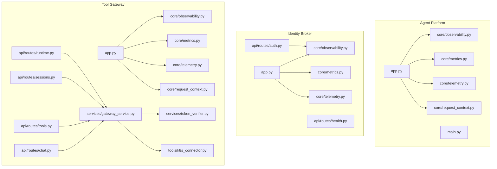
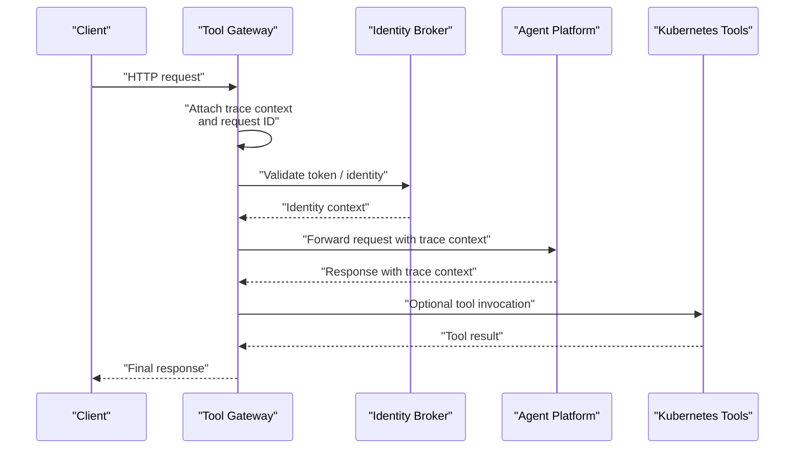
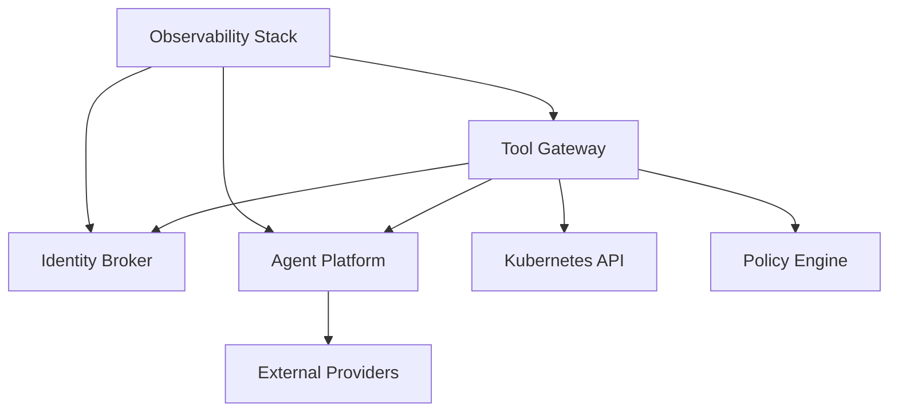

# Debugging and Troubleshooting Guide

<cite>
**Referenced Files in This Document**
- [README.md](file://README.md)
- [observability-conventions.md](file://shared/shared-contracts/observability-conventions.md)
- [SPEC-005-observability-baseline/spec.md](file://docs/specs/SPEC-005-observability-baseline/spec.md)
- [agent-platform/src/agent_service/core/observability.py](file://products/agent-platform/src/agent_service/core/observability.py)
- [agent-platform/src/agent_service/core/metrics.py](file://products/agent-platform/src/agent_service/core/metrics.py)
- [agent-platform/src/agent_service/core/telemetry.py](file://products/agent-platform/src/agent_service/core/telemetry.py)
- [agent-platform/src/agent_service/core/request_context.py](file://products/agent-platform/src/agent_service/core/request_context.py)
- [agent-platform/src/agent_service/app.py](file://products/agent-platform/src/agent_service/app.py)
- [agent-platform/src/agent_service/main.py](file://products/agent-platform/src/agent_service/main.py)
- [identity-broker/src/identity_service/core/observability.py](file://products/identity-broker/src/identity_service/core/observability.py)
- [identity-broker/src/identity_service/core/metrics.py](file://products/identity-broker/src/identity_service/core/metrics.py)
- [identity-broker/src/identity_service/core/telemetry.py](file://products/identity-broker/src/identity_service/core/telemetry.py)
- [identity-broker/src/identity_service/api/routes/auth.py](file://products/identity-broker/src/identity_service/api/routes/auth.py)
- [identity-broker/src/identity_service/api/routes/health.py](file://products/identity-broker/src/identity_service/api/routes/health.py)
- [tool-gateway/src/api_gateway/core/observability.py](file://products/tool-gateway/src/api_gateway/core/observability.py)
- [tool-gateway/src/api_gateway/core/metrics.py](file://products/tool-gateway/src/api_gateway/core/metrics.py)
- [tool-gateway/src/api_gateway/core/telemetry.py](file://products/tool-gateway/src/api_gateway/core/telemetry.py)
- [tool-gateway/src/api_gateway/core/request_context.py](file://products/tool-gateway/src/api_gateway/core/request_context.py)
- [tool-gateway/src/api_gateway/services/gateway_service.py](file://products/tool-gateway/src/api_gateway/services/gateway_service.py)
- [tool-gateway/src/api_gateway/services/token_verifier.py](file://products/tool-gateway/src/api_gateway/services/token_verifier.py)
- [tool-gateway/src/api_gateway/tools/k8s_connector.py](file://products/tool-gateway/src/api_gateway/tools/k8s_connector.py)
- [tool-gateway/src/api_gateway/api/routes/runtime.py](file://products/tool-gateway/src/api_gateway/api/routes/runtime.py)
- [tool-gateway/src/api_gateway/api/routes/sessions.py](file://products/tool-gateway/src/api_gateway/api/routes/sessions.py)
- [tool-gateway/src/api_gateway/api/routes/tools.py](file://products/tool-gateway/src/api_gateway/api/routes/tools.py)
- [tool-gateway/src/api_gateway/api/routes/chat.py](file://products/tool-gateway/src/api_gateway/api/routes/chat.py)
- [shared/shared-contracts/policies/policy-default.yaml](file://shared/shared-contracts/policies/policy-default.yaml)
- [shared/platform-ops/gitops/dev-k8s/base/shared/observability.env](file://shared/platform-ops/gitops/dev-k8s/base/shared/observability.env)
- [shared/platform-ops/gitops/dev-k8s/base/agent-platform/agent-service-deployment.yaml](file://shared/platform-ops/gitops/dev-k8s/base/agent-platform/agent-service-deployment.yaml)
- [shared/platform-ops/gitops/dev-k8s/base/identity-broker/identity-service-deployment.yaml](file://shared/platform-ops/gitops/dev-k8s/base/identity-broker/identity-service-deployment.yaml)
- [shared/platform-ops/gitops/dev-k8s/base/tool-gateway/api-gateway-deployment.yaml](file://shared/platform-ops/gitops/dev-k8s/base/tool-gateway/api-gateway-deployment.yaml)
</cite>

## Table of Contents
1. [Introduction](#introduction)
2. [Project Structure](#project-structure)
3. [Core Components](#core-components)
4. [Architecture Overview](#architecture-overview)
5. [Detailed Component Analysis](#detailed-component-analysis)
6. [Dependency Analysis](#dependency-analysis)
7. [Performance Considerations](#performance-considerations)
8. [Troubleshooting Guide](#troubleshooting-guide)
9. [Conclusion](#conclusion)
10. [Appendices](#appendices)

## Introduction
This guide provides a systematic approach to debugging and troubleshooting the Luban AIOps Platform using its built-in observability tools, logs, metrics, and traces. It covers common failure patterns, diagnostic commands, and workflows across service components such as Agent Platform, Identity Broker, and Tool Gateway. The guide also explains how to collect debug information, reproduce issues, correlate traces across services, and collaborate effectively with development teams.

## Project Structure
The platform is organized into multiple product modules:
- Agent Platform: runtime kernel, session management, provider integrations, and observability instrumentation.
- Identity Broker: authentication, identity context propagation, and token services.
- Tool Gateway: API gateway, policy enforcement, tool execution orchestration, and external tool connectors.
- Shared contracts and GitOps overlays define deployment configurations and observability environment variables.

**Diagram sources**
- [agent-platform/src/agent_service/app.py](file://products/agent-platform/src/agent_service/app.py)
- [agent-platform/src/agent_service/main.py](file://products/agent-platform/src/agent_service/main.py)
- [agent-platform/src/agent_service/core/observability.py](file://products/agent-platform/src/agent_service/core/observability.py)
- [agent-platform/src/agent_service/core/metrics.py](file://products/agent-platform/src/agent_service/core/metrics.py)
- [agent-platform/src/agent_service/core/telemetry.py](file://products/agent-platform/src/agent_service/core/telemetry.py)
- [agent-platform/src/agent_service/core/request_context.py](file://products/agent-platform/src/agent_service/core/request_context.py)
- [identity-broker/src/identity_service/app.py](file://products/identity-broker/src/identity_service/app.py)
- [identity-broker/src/identity_service/api/routes/auth.py](file://products/identity-broker/src/identity_service/api/routes/auth.py)
- [identity-broker/src/identity_service/api/routes/health.py](file://products/identity-broker/src/identity_service/api/routes/health.py)
- [identity-broker/src/identity_service/core/observability.py](file://products/identity-broker/src/identity_service/core/observability.py)
- [identity-broker/src/identity_service/core/metrics.py](file://products/identity-broker/src/identity_service/core/metrics.py)
- [identity-broker/src/identity_service/core/telemetry.py](file://products/identity-broker/src/identity_service/core/telemetry.py)
- [tool-gateway/src/api_gateway/app.py](file://products/tool-gateway/src/api_gateway/app.py)
- [tool-gateway/src/api_gateway/api/routes/runtime.py](file://products/tool-gateway/src/api_gateway/api/routes/runtime.py)
- [tool-gateway/src/api_gateway/api/routes/sessions.py](file://products/tool-gateway/src/api_gateway/api/routes/sessions.py)
- [tool-gateway/src/api_gateway/api/routes/tools.py](file://products/tool-gateway/src/api_gateway/api/routes/tools.py)
- [tool-gateway/src/api_gateway/api/routes/chat.py](file://products/tool-gateway/src/api_gateway/api/routes/chat.py)
- [tool-gateway/src/api_gateway/core/observability.py](file://products/tool-gateway/src/api_gateway/core/observability.py)
- [tool-gateway/src/api_gateway/core/metrics.py](file://products/tool-gateway/src/api_gateway/core/metrics.py)
- [tool-gateway/src/api_gateway/core/telemetry.py](file://products/tool-gateway/src/api_gateway/core/telemetry.py)
- [tool-gateway/src/api_gateway/core/request_context.py](file://products/tool-gateway/src/api_gateway/core/request_context.py)
- [tool-gateway/src/api_gateway/services/gateway_service.py](file://products/tool-gateway/src/api_gateway/services/gateway_service.py)
- [tool-gateway/src/api_gateway/services/token_verifier.py](file://products/tool-gateway/src/api_gateway/services/token_verifier.py)
- [tool-gateway/src/api_gateway/tools/k8s_connector.py](file://products/tool-gateway/src/api_gateway/tools/k8s_connector.py)

**Section sources**
- [README.md](file://README.md)

## Core Components
This section outlines the key observability and debugging components used across services:
- Observability module: centralizes tracing, logging configuration, and correlation IDs.
- Metrics module: exposes application-level metrics (latency, error rates, throughput).
- Telemetry module: configures exporters and propagates context for distributed tracing.
- Request context: maintains per-request identifiers and metadata for trace correlation.

Key responsibilities:
- Standardize log formats and include request-scoped identifiers.
- Emit structured metrics for SLO tracking and alerting.
- Propagate trace context across service boundaries.
- Provide health endpoints for readiness/liveness checks.

**Section sources**
- [agent-platform/src/agent_service/core/observability.py](file://products/agent-platform/src/agent_service/core/observability.py)
- [agent-platform/src/agent_service/core/metrics.py](file://products/agent-platform/src/agent_service/core/metrics.py)
- [agent-platform/src/agent_service/core/telemetry.py](file://products/agent-platform/src/agent_service/core/telemetry.py)
- [agent-platform/src/agent_service/core/request_context.py](file://products/agent-platform/src/agent_service/core/request_context.py)
- [identity-broker/src/identity_service/core/observability.py](file://products/identity-broker/src/identity_service/core/observability.py)
- [identity-broker/src/identity_service/core/metrics.py](file://products/identity-broker/src/identity_service/core/metrics.py)
- [identity-broker/src/identity_service/core/telemetry.py](file://products/identity-broker/src/identity_service/core/telemetry.py)
- [tool-gateway/src/api_gateway/core/observability.py](file://products/tool-gateway/src/api_gateway/core/observability.py)
- [tool-gateway/src/api_gateway/core/metrics.py](file://products/tool-gateway/src/api_gateway/core/metrics.py)
- [tool-gateway/src/api_gateway/core/telemetry.py](file://products/tool-gateway/src/api_gateway/core/telemetry.py)
- [tool-gateway/src/api_gateway/core/request_context.py](file://products/tool-gateway/src/api_gateway/core/request_context.py)

## Architecture Overview
The platform follows a microservice architecture with clear separation between API gateways, identity services, and agent runtimes. Observability is embedded at each layer to enable end-to-end tracing and metric collection.

**Diagram sources**
- [tool-gateway/src/api_gateway/api/routes/chat.py](file://products/tool-gateway/src/api_gateway/api/routes/chat.py)
- [tool-gateway/src/api_gateway/services/gateway_service.py](file://products/tool-gateway/src/api_gateway/services/gateway_service.py)
- [identity-broker/src/identity_service/api/routes/auth.py](file://products/identity-broker/src/identity_service/api/routes/auth.py)
- [agent-platform/src/agent_service/app.py](file://products/agent-platform/src/agent_service/app.py)
- [tool-gateway/src/api_gateway/tools/k8s_connector.py](file://products/tool-gateway/src/api_gateway/tools/k8s_connector.py)

## Detailed Component Analysis

### Agent Platform Observability and Debugging
- Logging and tracing are configured via the observability module; ensure request-scoped IDs are present in logs.
- Metrics expose latency histograms and error counters; use these to detect anomalies.
- Telemetry sets up exporters and propagates context headers for cross-service correlation.
- Request context carries identifiers and metadata throughout the lifecycle.

Common issues:
- Missing or inconsistent trace IDs across logs indicate misconfigured context propagation.
- High error rates on specific routes suggest upstream dependency failures.
- Slow responses may be due to external provider calls or session store latency.

Diagnostics:
- Inspect logs for request IDs and span IDs.
- Check metrics dashboards for latency spikes and error rate increases.
- Validate telemetry exporter connectivity and sampling configuration.

**Section sources**
- [agent-platform/src/agent_service/core/observability.py](file://products/agent-platform/src/agent_service/core/observability.py)
- [agent-platform/src/agent_service/core/metrics.py](file://products/agent-platform/src/agent_service/core/metrics.py)
- [agent-platform/src/agent_service/core/telemetry.py](file://products/agent-platform/src/agent_service/core/telemetry.py)
- [agent-platform/src/agent_service/core/request_context.py](file://products/agent-platform/src/agent_service/core/request_context.py)
- [agent-platform/src/agent_service/app.py](file://products/agent-platform/src/agent_service/app.py)
- [agent-platform/src/agent_service/main.py](file://products/agent-platform/src/agent_service/main.py)

### Identity Broker Authentication Flow and Observability
- Authentication routes validate tokens and establish identity context.
- Health endpoints provide liveness/readiness signals for orchestrators.
- Observability and telemetry propagate identity-related spans and metrics.

Common issues:
- Token validation failures lead to unauthorized errors; verify token issuer and signature.
- Identity context not propagated downstream indicates missing headers or middleware misconfiguration.
- Health endpoint failures indicate service startup or dependency issues.

Diagnostics:
- Review auth route logs for token parsing and validation steps.
- Confirm identity context headers are forwarded by upstream services.
- Monitor health endpoint status and dependency probes.

**Section sources**
- [identity-broker/src/identity_service/api/routes/auth.py](file://products/identity-broker/src/identity_service/api/routes/auth.py)
- [identity-broker/src/identity_service/api/routes/health.py](file://products/identity-broker/src/identity_service/api/routes/health.py)
- [identity-broker/src/identity_service/core/observability.py](file://products/identity-broker/src/identity_service/core/observability.py)
- [identity-broker/src/identity_service/core/metrics.py](file://products/identity-broker/src/identity_service/core/metrics.py)
- [identity-broker/src/identity_service/core/telemetry.py](file://products/identity-broker/src/identity_service/core/telemetry.py)

### Tool Gateway Orchestration and Policy Enforcement
- Routes handle runtime, sessions, tools, and chat operations.
- Gateway service coordinates requests, invokes policies, and manages tool execution.
- Token verifier validates incoming tokens and enforces identity constraints.
- Kubernetes connector executes cluster operations with proper context propagation.

Common issues:
- Policy denials cause request rejections; inspect policy decisions and rules.
- Tool invocations fail due to network timeouts or permission errors.
- Session persistence problems lead to state loss or corruption.

Diagnostics:
- Check policy engine logs for decision reasons and rule matches.
- Monitor tool invocation metrics and error rates.
- Verify Kubernetes RBAC and connectivity from the gateway pod.

**Section sources**
- [tool-gateway/src/api_gateway/api/routes/runtime.py](file://products/tool-gateway/src/api_gateway/api/routes/runtime.py)
- [tool-gateway/src/api_gateway/api/routes/sessions.py](file://products/tool-gateway/src/api_gateway/api/routes/sessions.py)
- [tool-gateway/src/api_gateway/api/routes/tools.py](file://products/tool-gateway/src/api_gateway/api/routes/tools.py)
- [tool-gateway/src/api_gateway/api/routes/chat.py](file://products/tool-gateway/src/api_gateway/api/routes/chat.py)
- [tool-gateway/src/api_gateway/services/gateway_service.py](file://products/tool-gateway/src/api_gateway/services/gateway_service.py)
- [tool-gateway/src/api_gateway/services/token_verifier.py](file://products/tool-gateway/src/api_gateway/services/token_verifier.py)
- [tool-gateway/src/api_gateway/tools/k8s_connector.py](file://products/tool-gateway/src/api_gateway/tools/k8s_connector.py)

### Observability Conventions and Standards
- Centralized conventions define log formats, metric names, and trace attributes.
- Ensure all services adhere to naming and tagging standards for consistent analysis.
- Use standardized correlation IDs to link logs, metrics, and traces across services.

Best practices:
- Include request ID, user identity, and operation name in logs.
- Tag metrics with service name, version, and environment labels.
- Propagate trace headers consistently across HTTP and internal calls.

**Section sources**
- [shared/shared-contracts/observability-conventions.md](file://shared/shared-contracts/observability-conventions.md)
- [docs/specs/SPEC-005-observability-baseline/spec.md](file://docs/specs/SPEC-005-observability-baseline/spec.md)

## Dependency Analysis
Service dependencies and integration points impact reliability and performance:
- Tool Gateway depends on Identity Broker for authentication and on Agent Platform for runtime operations.
- External dependencies include Kubernetes APIs and third-party providers.
- Observability stack relies on exporters and collectors configured via environment variables.

**Diagram sources**
- [tool-gateway/src/api_gateway/services/gateway_service.py](file://products/tool-gateway/src/api_gateway/services/gateway_service.py)
- [identity-broker/src/identity_service/api/routes/auth.py](file://products/identity-broker/src/identity_service/api/routes/auth.py)
- [agent-platform/src/agent_service/app.py](file://products/agent-platform/src/agent_service/app.py)
- [tool-gateway/src/api_gateway/tools/k8s_connector.py](file://products/tool-gateway/src/api_gateway/tools/k8s_connector.py)
- [shared/shared-contracts/policies/policy-default.yaml](file://shared/shared-contracts/policies/policy-default.yaml)

**Section sources**
- [shared/shared-contracts/policies/policy-default.yaml](file://shared/shared-contracts/policies/policy-default.yaml)

## Performance Considerations
- Monitor latency percentiles and error rates to identify bottlenecks.
- Use distributed traces to pinpoint slow segments in request flows.
- Tune telemetry sampling to balance visibility and overhead.
- Profile memory usage and CPU consumption during peak loads.

Recommendations:
- Set appropriate resource limits and requests in deployments.
- Enable connection pooling for external dependencies.
- Cache frequently accessed data where possible.
- Implement backpressure and retry policies with exponential backoff.

[No sources needed since this section provides general guidance]

## Troubleshooting Guide

### Collecting Debug Information
- Gather logs from all involved services using request IDs and timestamps.
- Export traces for the affected request span to visualize the full flow.
- Capture metrics snapshots around the incident timeframe.
- Record environment variables and configuration differences between environments.

Commands and techniques:
- Use container log viewers to filter by service and request ID.
- Query metrics dashboards for anomalies and trends.
- Download trace exports and analyze span durations and errors.

**Section sources**
- [agent-platform/src/agent_service/core/observability.py](file://products/agent-platform/src/agent_service/core/observability.py)
- [tool-gateway/src/api_gateway/core/observability.py](file://products/tool-gateway/src/api_gateway/core/observability.py)
- [identity-broker/src/identity_service/core/observability.py](file://products/identity-broker/src/identity_service/core/observability.py)

### Reproducing Issues
- Isolate the failing component by testing endpoints individually.
- Replicate network conditions and load patterns observed during the incident.
- Use synthetic requests that mirror production payloads and headers.
- Validate configuration parity across environments.

**Section sources**
- [tool-gateway/src/api_gateway/api/routes/chat.py](file://products/tool-gateway/src/api_gateway/api/routes/chat.py)
- [identity-broker/src/identity_service/api/routes/auth.py](file://products/identity-broker/src/identity_service/api/routes/auth.py)

### Correlating Traces Across Services
- Ensure trace context headers are propagated through all hops.
- Use correlation IDs to join logs and traces for a single request.
- Validate that telemetry exporters are correctly configured and connected.

**Section sources**
- [agent-platform/src/agent_service/core/request_context.py](file://products/agent-platform/src/agent_service/core/request_context.py)
- [tool-gateway/src/api_gateway/core/request_context.py](file://products/tool-gateway/src/api_gateway/core/request_context.py)
- [shared/shared-contracts/observability-conventions.md](file://shared/shared-contracts/observability-conventions.md)

### Common Failure Patterns
- Authentication failures: invalid tokens, expired credentials, or misconfigured issuers.
- Policy denials: insufficient permissions or mismatched policy rules.
- Network timeouts: unreachable dependencies or DNS resolution failures.
- Memory leaks: gradual increase in memory usage without release.
- Session corruption: inconsistent state due to concurrent access or storage failures.

**Section sources**
- [identity-broker/src/identity_service/api/routes/auth.py](file://products/identity-broker/src/identity_service/api/routes/auth.py)
- [shared/shared-contracts/policies/policy-default.yaml](file://shared/shared-contracts/policies/policy-default.yaml)
- [tool-gateway/src/api_gateway/tools/k8s_connector.py](file://products/tool-gateway/src/api_gateway/tools/k8s_connector.py)

### Diagnostic Commands and Workflows
- Inspect health endpoints to confirm service readiness.
- Query metrics endpoints for real-time indicators.
- Stream logs with filters for request IDs and error levels.
- Export traces and analyze span trees for hotspots.

**Section sources**
- [identity-broker/src/identity_service/api/routes/health.py](file://products/identity-broker/src/identity_service/api/routes/health.py)
- [tool-gateway/src/api_gateway/core/metrics.py](file://products/tool-gateway/src/api_gateway/core/metrics.py)
- [agent-platform/src/agent_service/core/metrics.py](file://products/agent-platform/src/agent_service/core/metrics.py)

### Collaborating with Development Teams
- Share complete trace exports, logs, and metrics snapshots.
- Provide step-by-step reproduction instructions and environment details.
- Highlight specific spans or log entries indicating failure points.
- Coordinate on configuration changes and rollback plans.

[No sources needed since this section provides general guidance]

### Performance Troubleshooting
- Identify slow spans and measure their contribution to overall latency.
- Analyze CPU and memory profiles during high-load scenarios.
- Review database and cache query patterns for inefficiencies.
- Optimize serialization and payload sizes.

[No sources needed since this section provides general guidance]

### Memory Leak Detection
- Monitor heap usage over time and look for steady growth.
- Take memory dumps and analyze object retention graphs.
- Inspect long-lived objects and event handlers for unintended references.
- Validate resource cleanup in error paths and timeouts.

[No sources needed since this section provides general guidance]

### Network Connectivity Issues
- Verify DNS resolution and service discovery configurations.
- Check firewall rules and security groups for allowed traffic.
- Inspect TLS certificates and handshake logs for errors.
- Test connectivity to external endpoints from within pods.

[No sources needed since this section provides general guidance]

## Conclusion
Effective debugging of the Luban AIOps Platform relies on consistent observability practices, structured logs, comprehensive metrics, and correlated traces. By following the diagnostic workflows outlined here, teams can quickly identify root causes, reproduce issues reliably, and collaborate efficiently to resolve problems. Adhering to observability conventions and leveraging deployment configurations ensures robust monitoring and faster incident response.

[No sources needed since this section summarizes without analyzing specific files]

## Appendices

### Deployment and Environment Configuration
- Observability environment variables configure exporters, sampling, and correlation settings.
- Service deployments reference environment files and secrets for secure configuration.

**Section sources**
- [shared/platform-ops/gitops/dev-k8s/base/shared/observability.env](file://shared/platform-ops/gitops/dev-k8s/base/shared/observability.env)
- [shared/platform-ops/gitops/dev-k8s/base/agent-platform/agent-service-deployment.yaml](file://shared/platform-ops/gitops/dev-k8s/base/agent-platform/agent-service-deployment.yaml)
- [shared/platform-ops/gitops/dev-k8s/base/identity-broker/identity-service-deployment.yaml](file://shared/platform-ops/gitops/dev-k8s/base/identity-broker/identity-service-deployment.yaml)
- [shared/platform-ops/gitops/dev-k8s/base/tool-gateway/api-gateway-deployment.yaml](file://shared/platform-ops/gitops/dev-k8s/base/tool-gateway/api-gateway-deployment.yaml)