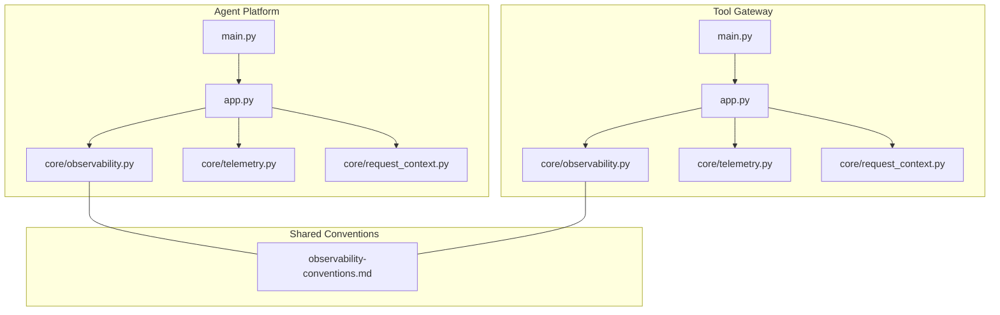
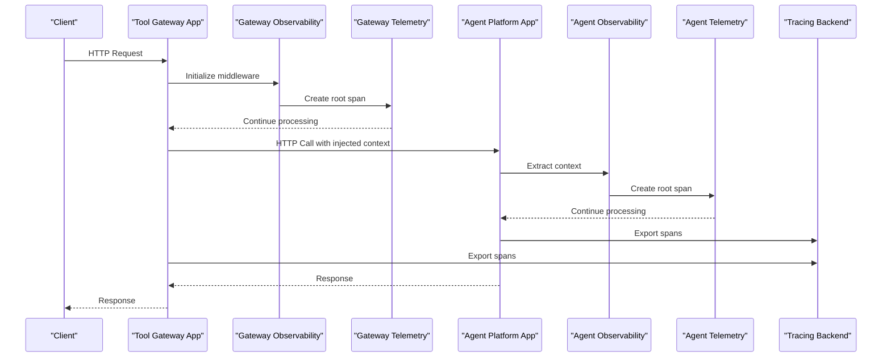
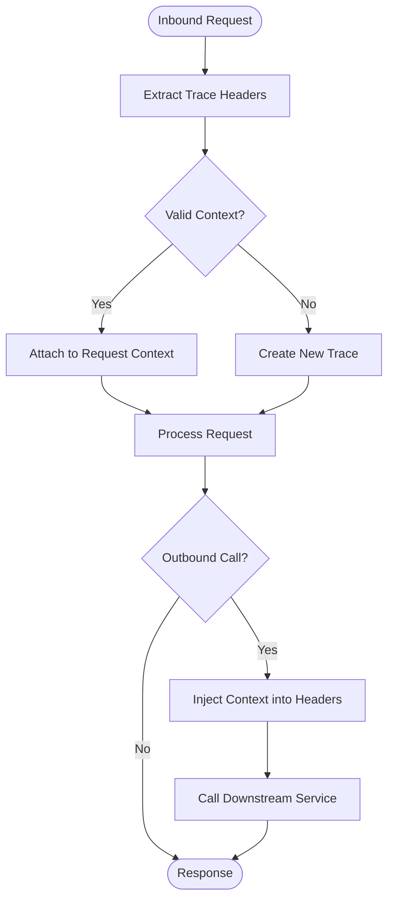
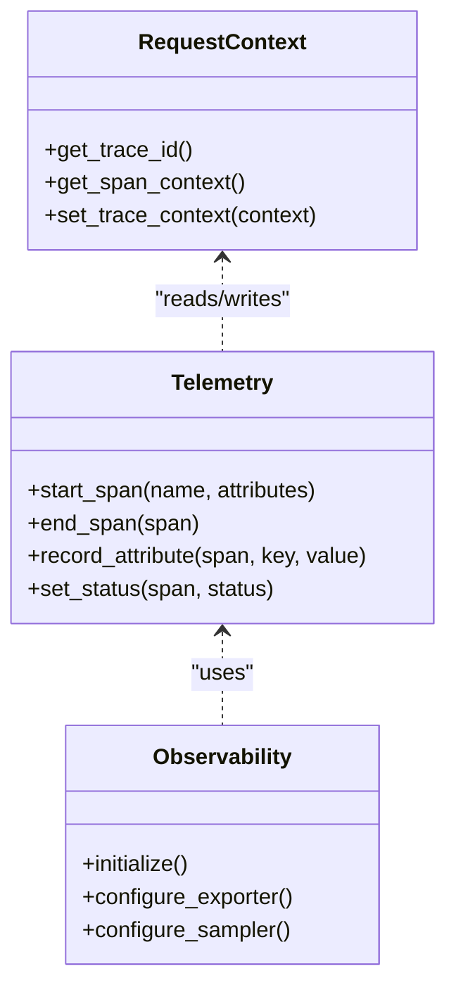
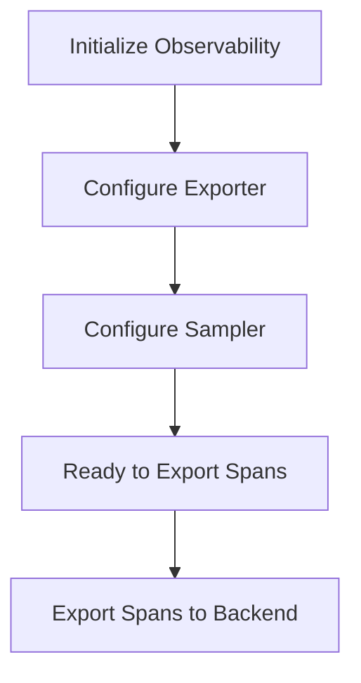
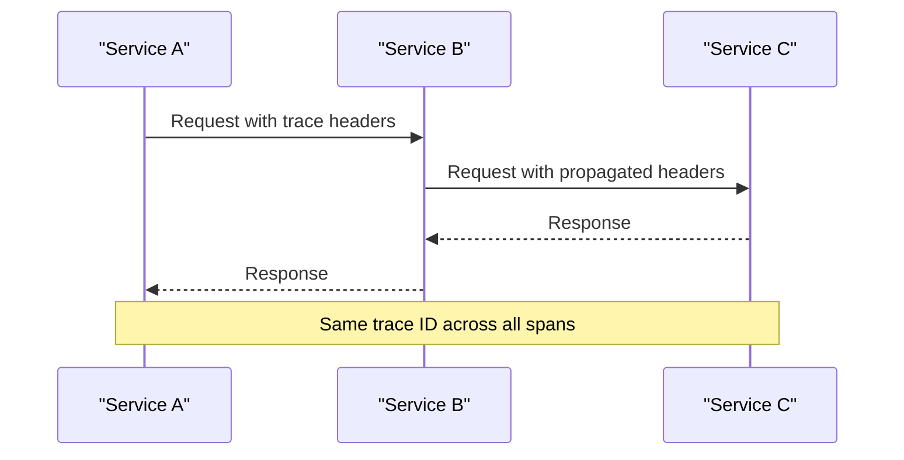
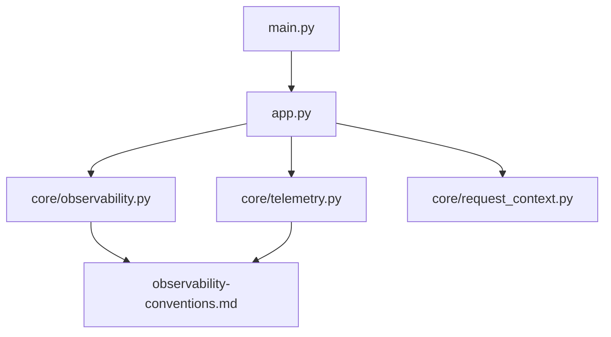

# Distributed Tracing Implementation

<cite>
**Referenced Files in This Document**
- [observability.py](file://products/agent-platform/src/agent_service/core/observability.py)
- [telemetry.py](file://products/agent-platform/src/agent_service/core/telemetry.py)
- [request_context.py](file://products/agent-platform/src/agent_service/core/request_context.py)
- [app.py](file://products/agent-platform/src/agent_service/app.py)
- [main.py](file://products/agent-platform/src/agent_service/main.py)
- [observability.py](file://products/tool-gateway/src/api_gateway/core/observability.py)
- [telemetry.py](file://products/tool-gateway/src/api_gateway/core/telemetry.py)
- [request_context.py](file://products/tool-gateway/src/api_gateway/core/request_context.py)
- [app.py](file://products/tool-gateway/src/api_gateway/app.py)
- [main.py](file://products/tool-gateway/src/api_gateway/main.py)
- [observability-conventions.md](file://shared/shared-contracts/observability-conventions.md)
</cite>

## Table of Contents
1. [Introduction](#introduction)
2. [Project Structure](#project-structure)
3. [Core Components](#core-components)
4. [Architecture Overview](#architecture-overview)
5. [Detailed Component Analysis](#detailed-component-analysis)
6. [Dependency Analysis](#dependency-analysis)
7. [Performance Considerations](#performance-considerations)
8. [Troubleshooting Guide](#troubleshooting-guide)
9. [Conclusion](#conclusion)

## Introduction
This document explains how distributed tracing is implemented across the microservices in this repository, focusing on trace context propagation, span creation, and correlation between services. It covers integration with tracing backends such as Jaeger or Zipkin, custom instrumentation patterns, sampling strategies, and practical guidance for identifying bottlenecks, analyzing request flows, and debugging cross-service issues using trace data. The content is derived from the observability modules and conventions present in the codebase.

## Project Structure
The observability and tracing implementation is primarily located within each service’s core module:
- Agent Platform service: core/observability.py, core/telemetry.py, core/request_context.py, app.py, main.py
- Tool Gateway service: core/observability.py, core/telemetry.py, core/request_context.py, app.py, main.py
- Shared observability conventions: shared/shared-contracts/observability-conventions.md

These files collectively define how traces are initialized, propagated across HTTP boundaries, instrumented around business operations, and exported to backends.

**Diagram sources**
- [observability.py](file://products/agent-platform/src/agent_service/core/observability.py)
- [telemetry.py](file://products/agent-platform/src/agent_service/core/telemetry.py)
- [request_context.py](file://products/agent-platform/src/agent_service/core/request_context.py)
- [app.py](file://products/agent-platform/src/agent_service/app.py)
- [main.py](file://products/agent-platform/src/agent_service/main.py)
- [observability.py](file://products/tool-gateway/src/api_gateway/core/observability.py)
- [telemetry.py](file://products/tool-gateway/src/api_gateway/core/telemetry.py)
- [request_context.py](file://products/tool-gateway/src/api_gateway/core/request_context.py)
- [app.py](file://products/tool-gateway/src/api_gateway/app.py)
- [main.py](file://products/tool-gateway/src/api_gateway/main.py)
- [observability-conventions.md](file://shared/shared-contracts/observability-conventions.md)

**Section sources**
- [observability.py](file://products/agent-platform/src/agent_service/core/observability.py)
- [telemetry.py](file://products/agent-platform/src/agent_service/core/telemetry.py)
- [request_context.py](file://products/agent-platform/src/agent_service/core/request_context.py)
- [app.py](file://products/agent-platform/src/agent_service/app.py)
- [main.py](file://products/agent-platform/src/agent_service/main.py)
- [observability.py](file://products/tool-gateway/src/api_gateway/core/observability.py)
- [telemetry.py](file://products/tool-gateway/src/api_gateway/core/telemetry.py)
- [request_context.py](file://products/tool-gateway/src/api_gateway/core/request_context.py)
- [app.py](file://products/tool-gateway/src/api_gateway/app.py)
- [main.py](file://products/tool-gateway/src/api_gateway/main.py)
- [observability-conventions.md](file://shared/shared-contracts/observability-conventions.md)

## Core Components
- Observability initialization and configuration: Each service initializes tracing via its core/observability module, setting up exporters and propagators consistent with shared conventions.
- Telemetry utilities: core/telemetry provides helpers for creating spans, recording attributes, and managing timing around operations.
- Request context management: core/request_context maintains per-request trace identifiers and metadata, enabling consistent propagation across middleware and handlers.
- Application wiring: app.py wires middleware and routes to ensure every incoming request starts a root span and outgoing calls propagate context.
- Entrypoints: main.py bootstraps the application and ensures observability is configured before serving traffic.

Key responsibilities:
- Trace context propagation over HTTP headers (e.g., W3C Trace Context or OpenTelemetry propagators).
- Span creation for inbound requests, outbound calls, and internal operations.
- Exporting spans to backends like Jaeger or Zipkin through configured exporters.
- Sampling decisions based on environment or configuration.

**Section sources**
- [observability.py](file://products/agent-platform/src/agent_service/core/observability.py)
- [telemetry.py](file://products/agent-platform/src/agent_service/core/telemetry.py)
- [request_context.py](file://products/agent-platform/src/agent_service/core/request_context.py)
- [app.py](file://products/agent-platform/src/agent_service/app.py)
- [main.py](file://products/agent-platform/src/agent_service/main.py)
- [observability.py](file://products/tool-gateway/src/api_gateway/core/observability.py)
- [telemetry.py](file://products/tool-gateway/src/api_gateway/core/telemetry.py)
- [request_context.py](file://products/tool-gateway/src/api_gateway/core/request_context.py)
- [app.py](file://products/tool-gateway/src/api_gateway/app.py)
- [main.py](file://products/tool-gateway/src/api_gateway/main.py)
- [observability-conventions.md](file://shared/shared-contracts/observability-conventions.md)

## Architecture Overview
At a high level, each service follows a consistent pattern:
- On process start, observability is initialized with exporter and sampler settings.
- Incoming HTTP requests trigger middleware that extracts trace context and creates a root span.
- Business logic uses telemetry helpers to create child spans for operations.
- Outgoing HTTP calls inject trace context into headers so downstream services can continue the trace.
- Spans are exported asynchronously to the configured backend.

**Diagram sources**
- [app.py](file://products/tool-gateway/src/api_gateway/app.py)
- [observability.py](file://products/tool-gateway/src/api_gateway/core/observability.py)
- [telemetry.py](file://products/tool-gateway/src/api_gateway/core/telemetry.py)
- [app.py](file://products/agent-platform/src/agent_service/app.py)
- [observability.py](file://products/agent-platform/src/agent_service/core/observability.py)
- [telemetry.py](file://products/agent-platform/src/agent_service/core/telemetry.py)

## Detailed Component Analysis

### Trace Context Propagation
- Inbound extraction: Middleware reads trace headers from incoming requests and attaches them to the request context.
- Outbound injection: When making HTTP calls to other services, the current trace context is injected into outgoing headers.
- Consistency: Both services follow shared conventions to ensure compatible header formats and propagation behavior.

**Diagram sources**
- [request_context.py](file://products/tool-gateway/src/api_gateway/core/request_context.py)
- [observability.py](file://products/tool-gateway/src/api_gateway/core/observability.py)
- [request_context.py](file://products/agent-platform/src/agent_service/core/request_context.py)
- [observability.py](file://products/agent-platform/src/agent_service/core/observability.py)

**Section sources**
- [request_context.py](file://products/tool-gateway/src/api_gateway/core/request_context.py)
- [observability.py](file://products/tool-gateway/src/api_gateway/core/observability.py)
- [request_context.py](file://products/agent-platform/src/agent_service/core/request_context.py)
- [observability.py](file://products/agent-platform/src/agent_service/core/observability.py)

### Span Creation and Custom Instrumentation
- Root spans: Created at the entrypoint of each service for incoming requests.
- Child spans: Created around key operations (e.g., policy evaluation, tool invocation, session handling) using telemetry helpers.
- Attributes: Spans include relevant attributes such as operation names, status codes, and custom tags defined by conventions.
- Timing: Automatic timing is captured; additional manual timing can be added for complex operations.

**Diagram sources**
- [telemetry.py](file://products/tool-gateway/src/api_gateway/core/telemetry.py)
- [observability.py](file://products/tool-gateway/src/api_gateway/core/observability.py)
- [request_context.py](file://products/tool-gateway/src/api_gateway/core/request_context.py)
- [telemetry.py](file://products/agent-platform/src/agent_service/core/telemetry.py)
- [observability.py](file://products/agent-platform/src/agent_service/core/observability.py)
- [request_context.py](file://products/agent-platform/src/agent_service/core/request_context.py)

**Section sources**
- [telemetry.py](file://products/tool-gateway/src/api_gateway/core/telemetry.py)
- [observability.py](file://products/tool-gateway/src/api_gateway/core/observability.py)
- [request_context.py](file://products/tool-gateway/src/api_gateway/core/request_context.py)
- [telemetry.py](file://products/agent-platform/src/agent_service/core/telemetry.py)
- [observability.py](file://products/agent-platform/src/agent_service/core/observability.py)
- [request_context.py](file://products/agent-platform/src/agent_service/core/request_context.py)

### Integration with Tracing Backends
- Exporters: Configured via observability initialization to send spans to Jaeger or Zipkin endpoints.
- Sampling: Sampler configured to control the volume of exported spans based on environment or configuration.
- Conventions: Shared observability conventions define attribute naming and structure to ensure consistency across services.

**Diagram sources**
- [observability.py](file://products/tool-gateway/src/api_gateway/core/observability.py)
- [observability.py](file://products/agent-platform/src/agent_service/core/observability.py)
- [observability-conventions.md](file://shared/shared-contracts/observability-conventions.md)

**Section sources**
- [observability.py](file://products/tool-gateway/src/api_gateway/core/observability.py)
- [observability.py](file://products/agent-platform/src/agent_service/core/observability.py)
- [observability-conventions.md](file://shared/shared-contracts/observability-conventions.md)

### Trace Correlation Between Services
- Header propagation: Trace IDs and parent IDs are passed via standardized headers.
- Context continuity: Each service continues the same trace ID across boundaries, enabling end-to-end visibility.
- Error correlation: Errors and exceptions are recorded as span events or attributes to aid debugging.

[No sources needed since this diagram shows conceptual workflow, not actual code structure]

## Dependency Analysis
Observability components depend on shared conventions and are wired into application lifecycle:
- app.py imports and configures observability and telemetry modules.
- main.py ensures observability initialization occurs before serving requests.
- request_context is used by middleware and handlers to access and propagate trace context.

**Diagram sources**
- [main.py](file://products/tool-gateway/src/api_gateway/main.py)
- [app.py](file://products/tool-gateway/src/api_gateway/app.py)
- [observability.py](file://products/tool-gateway/src/api_gateway/core/observability.py)
- [telemetry.py](file://products/tool-gateway/src/api_gateway/core/telemetry.py)
- [request_context.py](file://products/tool-gateway/src/api_gateway/core/request_context.py)
- [observability-conventions.md](file://shared/shared-contracts/observability-conventions.md)
- [main.py](file://products/agent-platform/src/agent_service/main.py)
- [app.py](file://products/agent-platform/src/agent_service/app.py)
- [observability.py](file://products/agent-platform/src/agent_service/core/observability.py)
- [telemetry.py](file://products/agent-platform/src/agent_service/core/telemetry.py)
- [request_context.py](file://products/agent-platform/src/agent_service/core/request_context.py)

**Section sources**
- [main.py](file://products/tool-gateway/src/api_gateway/main.py)
- [app.py](file://products/tool-gateway/src/api_gateway/app.py)
- [observability.py](file://products/tool-gateway/src/api_gateway/core/observability.py)
- [telemetry.py](file://products/tool-gateway/src/api_gateway/core/telemetry.py)
- [request_context.py](file://products/tool-gateway/src/api_gateway/core/request_context.py)
- [observability-conventions.md](file://shared/shared-contracts/observability-conventions.md)
- [main.py](file://products/agent-platform/src/agent_service/main.py)
- [app.py](file://products/agent-platform/src/agent_service/app.py)
- [observability.py](file://products/agent-platform/src/agent_service/core/observability.py)
- [telemetry.py](file://products/agent-platform/src/agent_service/core/telemetry.py)
- [request_context.py](file://products/agent-platform/src/agent_service/core/request_context.py)

## Performance Considerations
- Sampling strategy: Use appropriate sampling rates to balance visibility and overhead. High-volume environments may require adaptive or probabilistic sampling.
- Attribute minimization: Avoid adding large or unnecessary attributes to spans to reduce payload size and export latency.
- Async export: Ensure exporters operate asynchronously to avoid blocking request processing.
- Hot path instrumentation: Limit instrumentation in hot paths to essential spans and attributes.
- Monitoring exporter health: Track exporter metrics and errors to detect backpressure or failures early.

[No sources needed since this section provides general guidance]

## Troubleshooting Guide
Common issues and remedies:
- Missing trace context: Verify header propagation in both inbound and outbound calls. Check that middleware extracts and injects context correctly.
- Broken traces: Ensure trace IDs are preserved across service boundaries and that no component resets context unexpectedly.
- High overhead: Reduce span count and attribute size; review sampling configuration.
- Export failures: Inspect exporter logs and network connectivity to tracing backends.

Practical steps:
- Validate observability initialization order in main.py and app.py.
- Confirm shared conventions are followed for attribute names and structures.
- Use span events to mark critical points in long-running operations.

**Section sources**
- [observability.py](file://products/tool-gateway/src/api_gateway/core/observability.py)
- [telemetry.py](file://products/tool-gateway/src/api_gateway/core/telemetry.py)
- [request_context.py](file://products/tool-gateway/src/api_gateway/core/request_context.py)
- [observability.py](file://products/agent-platform/src/agent_service/core/observability.py)
- [telemetry.py](file://products/agent-platform/src/agent_service/core/telemetry.py)
- [request_context.py](file://products/agent-platform/src/agent_service/core/request_context.py)
- [observability-conventions.md](file://shared/shared-contracts/observability-conventions.md)

## Conclusion
The microservices implement a consistent distributed tracing approach centered on robust context propagation, structured span creation, and backend integration following shared conventions. By adhering to these patterns, teams can achieve end-to-end visibility, identify performance bottlenecks, and debug cross-service issues effectively while maintaining acceptable performance overhead.

[No sources needed since this section summarizes without analyzing specific files]