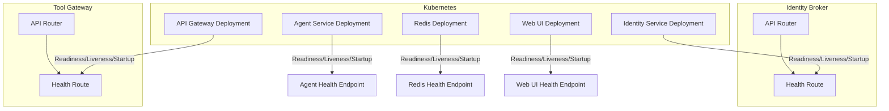
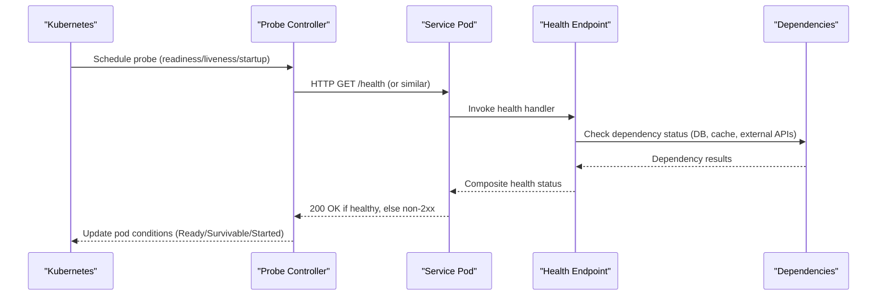
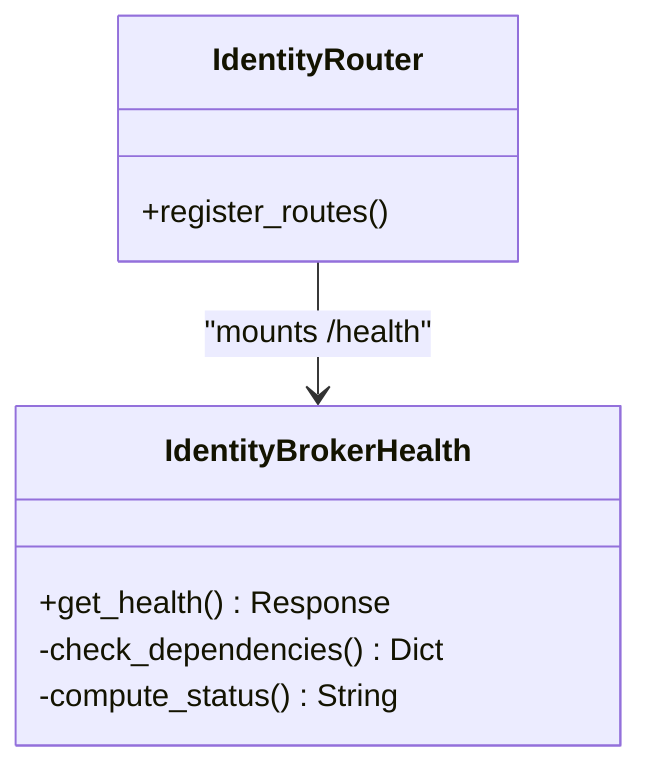
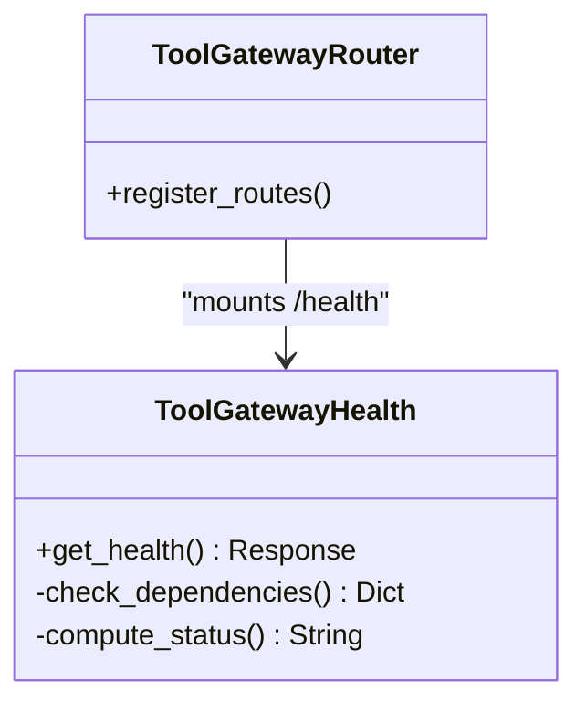
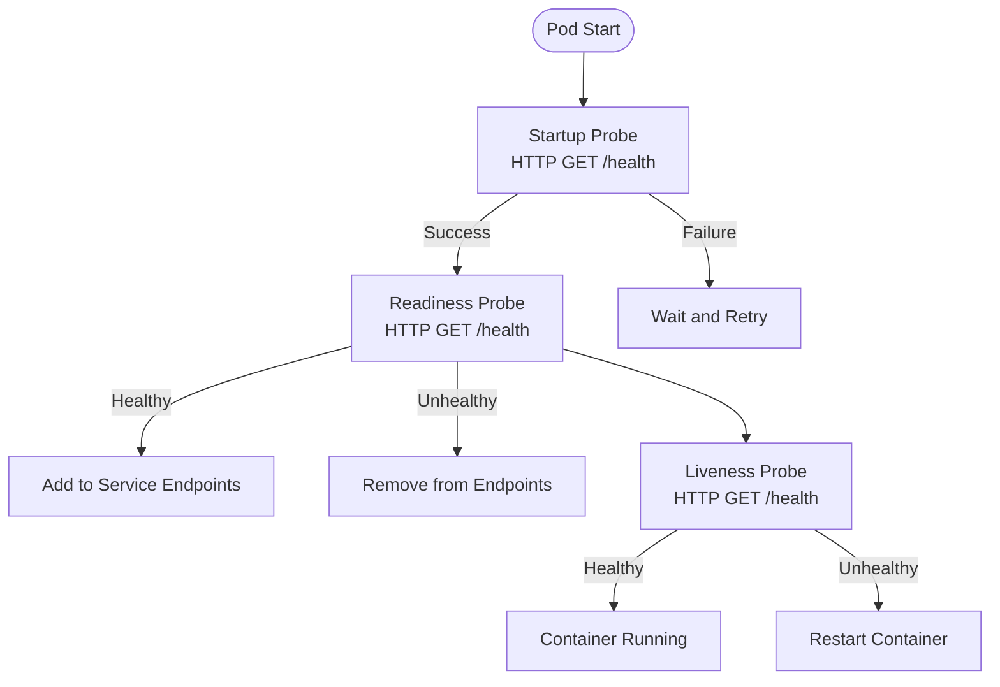
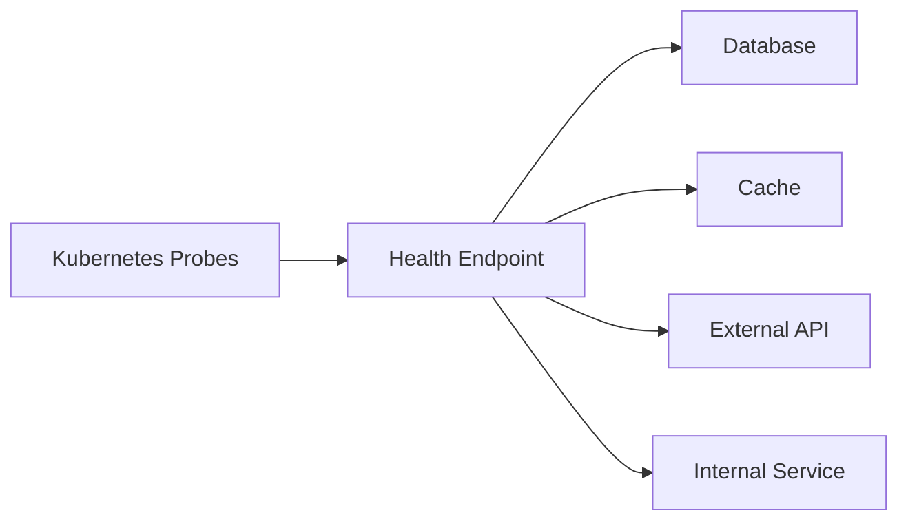

# Health Checks and Probes

<cite>
**Referenced Files in This Document**
- [health.py](file://products/identity-broker/src/identity_service/api/routes/health.py)
- [health.py](file://products/tool-gateway/src/api_gateway/api/routes/health.py)
- [router.py](file://products/identity-broker/src/identity_service/api/router.py)
- [router.py](file://products/tool-gateway/src/api_gateway/api/router.py)
- [agent-service-deployment.yaml](file://shared/platform-ops/gitops/dev-k8s/base/agent-platform/agent-service-deployment.yaml)
- [identity-service-deployment.yaml](file://shared/platform-ops/gitops/dev-k8s/base/identity-broker/identity-service-deployment.yaml)
- [api-gateway-deployment.yaml](file://shared/platform-ops/gitops/dev-k8s/base/tool-gateway/api-gateway-deployment.yaml)
- [redis-deployment.yaml](file://shared/platform-ops/gitops/dev-k8s/base/infra/redis-deployment.yaml)
- [web-ui-deployment.yaml](file://shared/platform-ops/gitops/dev-k8s/base/operator-portal/web-ui-deployment.yaml)
- [health-response.schema.json](file://shared/shared-contracts/schemas/health-response.schema.json)
- [observability-conventions.md](file://shared/shared-contracts/observability-conventions.md)
</cite>

## Table of Contents
1. [Introduction](#introduction)
2. [Project Structure](#project-structure)
3. [Core Components](#core-components)
4. [Architecture Overview](#architecture-overview)
5. [Detailed Component Analysis](#detailed-component-analysis)
6. [Dependency Analysis](#dependency-analysis)
7. [Performance Considerations](#performance-considerations)
8. [Troubleshooting Guide](#troubleshooting-guide)
9. [Conclusion](#conclusion)
10. [Appendices](#appendices)

## Introduction
This document explains how health checks are implemented across platform services and how Kubernetes probes are configured to manage traffic routing, container restarts, and initialization timing. It covers readiness, liveness, and startup probes; custom health check implementations; dependency health validation; composite health status calculation; example endpoint responses; probe configuration in Kubernetes manifests; troubleshooting unhealthy services; and monitoring and alerting on service degradation.

## Project Structure
Health endpoints are exposed by API services under their respective route modules. Kubernetes deployments for each service define the probes that control lifecycle behavior. Shared schemas define the expected structure of health responses.

**Diagram sources**
- [router.py](file://products/identity-broker/src/identity_service/api/router.py)
- [health.py](file://products/identity-broker/src/identity_service/api/routes/health.py)
- [router.py](file://products/tool-gateway/src/api_gateway/api/router.py)
- [health.py](file://products/tool-gateway/src/api_gateway/api/routes/health.py)
- [identity-service-deployment.yaml](file://shared/platform-ops/gitops/dev-k8s/base/identity-broker/identity-service-deployment.yaml)
- [api-gateway-deployment.yaml](file://shared/platform-ops/gitops/dev-k8s/base/tool-gateway/api-gateway-deployment.yaml)
- [agent-service-deployment.yaml](file://shared/platform-ops/gitops/dev-k8s/base/agent-platform/agent-service-deployment.yaml)
- [redis-deployment.yaml](file://shared/platform-ops/gitops/dev-k8s/base/infra/redis-deployment.yaml)
- [web-ui-deployment.yaml](file://shared/platform-ops/gitops/dev-k8s/base/operator-portal/web-ui-deployment.yaml)

**Section sources**
- [health.py](file://products/identity-broker/src/identity_service/api/routes/health.py)
- [health.py](file://products/tool-gateway/src/api_gateway/api/routes/health.py)
- [router.py](file://products/identity-broker/src/identity_service/api/router.py)
- [router.py](file://products/tool-gateway/src/api_gateway/api/router.py)
- [agent-service-deployment.yaml](file://shared/platform-ops/gitops/dev-k8s/base/agent-platform/agent-service-deployment.yaml)
- [identity-service-deployment.yaml](file://shared/platform-ops/gitops/dev-k8s/base/identity-broker/identity-service-deployment.yaml)
- [api-gateway-deployment.yaml](file://shared/platform-ops/gitops/dev-k8s/base/tool-gateway/api-gateway-deployment.yaml)
- [redis-deployment.yaml](file://shared/platform-ops/gitops/dev-k8s/base/infra/redis-deployment.yaml)
- [web-ui-deployment.yaml](file://shared/platform-ops/gitops/dev-k8s/base/operator-portal/web-ui-deployment.yaml)

## Core Components
- Health endpoints: Each API service exposes a dedicated health route that returns a structured health response conforming to the shared schema.
- Kubernetes probes: Deployments configure readiness, liveness, and optional startup probes to interact with these endpoints.
- Shared schema: The health response schema defines fields such as status, version, dependencies, and timestamps to standardize responses across services.

Key responsibilities:
- Readiness probes ensure traffic is only routed when the service is ready to serve requests.
- Liveness probes trigger container restarts when the process is stuck or unrecoverable.
- Startup probes allow slow-starting containers to initialize before being probed for readiness or liveness.

**Section sources**
- [health-response.schema.json](file://shared/shared-contracts/schemas/health-response.schema.json)
- [observability-conventions.md](file://shared/shared-contracts/observability-conventions.md)

## Architecture Overview
The health check architecture integrates application-level health logic with Kubernetes orchestration:

**Diagram sources**
- [health.py](file://products/identity-broker/src/identity_service/api/routes/health.py)
- [health.py](file://products/tool-gateway/src/api_gateway/api/routes/health.py)
- [identity-service-deployment.yaml](file://shared/platform-ops/gitops/dev-k8s/base/identity-broker/identity-service-deployment.yaml)
- [api-gateway-deployment.yaml](file://shared/platform-ops/gitops/dev-k8s/base/tool-gateway/api-gateway-deployment.yaml)
- [agent-service-deployment.yaml](file://shared/platform-ops/gitops/dev-k8s/base/agent-platform/agent-service-deployment.yaml)

## Detailed Component Analysis

### Identity Broker Health Endpoint
- Exposes a health route registered via the API router.
- Returns a structured health response aligned with the shared schema.
- Can include dependency checks (e.g., identity store, token service).

**Diagram sources**
- [health.py](file://products/identity-broker/src/identity_service/api/routes/health.py)
- [router.py](file://products/identity-broker/src/identity_service/api/router.py)

**Section sources**
- [health.py](file://products/identity-broker/src/identity_service/api/routes/health.py)
- [router.py](file://products/identity-broker/src/identity_service/api/router.py)

### Tool Gateway Health Endpoint
- Exposes a health route registered via the API router.
- Returns a structured health response aligned with the shared schema.
- May validate gateway-specific dependencies (policy engine, agent client, token verifier).

**Diagram sources**
- [health.py](file://products/tool-gateway/src/api_gateway/api/routes/health.py)
- [router.py](file://products/tool-gateway/src/api_gateway/api/router.py)

**Section sources**
- [health.py](file://products/tool-gateway/src/api_gateway/api/routes/health.py)
- [router.py](file://products/tool-gateway/src/api_gateway/api/router.py)

### Kubernetes Probes Configuration
Each deployment configures probes to interact with health endpoints:

- Readiness probe: Ensures the service is ready to receive traffic.
- Liveness probe: Restarts the container if it becomes unresponsive.
- Startup probe: Allows slow initialization before readiness/liveness checks begin.

Example configurations are defined per service deployment files.

**Diagram sources**
- [identity-service-deployment.yaml](file://shared/platform-ops/gitops/dev-k8s/base/identity-broker/identity-service-deployment.yaml)
- [api-gateway-deployment.yaml](file://shared/platform-ops/gitops/dev-k8s/base/tool-gateway/api-gateway-deployment.yaml)
- [agent-service-deployment.yaml](file://shared/platform-ops/gitops/dev-k8s/base/agent-platform/agent-service-deployment.yaml)
- [redis-deployment.yaml](file://shared/platform-ops/gitops/dev-k8s/base/infra/redis-deployment.yaml)
- [web-ui-deployment.yaml](file://shared/platform-ops/gitops/dev-k8s/base/operator-portal/web-ui-deployment.yaml)

**Section sources**
- [identity-service-deployment.yaml](file://shared/platform-ops/gitops/dev-k8s/base/identity-broker/identity-service-deployment.yaml)
- [api-gateway-deployment.yaml](file://shared/platform-ops/gitops/dev-k8s/base/tool-gateway/api-gateway-deployment.yaml)
- [agent-service-deployment.yaml](file://shared/platform-ops/gitops/dev-k8s/base/agent-platform/agent-service-deployment.yaml)
- [redis-deployment.yaml](file://shared/platform-ops/gitops/dev-k8s/base/infra/redis-deployment.yaml)
- [web-ui-deployment.yaml](file://shared/platform-ops/gitops/dev-k8s/base/operator-portal/web-ui-deployment.yaml)

### Custom Health Check Implementations
- Health handlers implement dependency checks and compute composite status.
- Responses follow the shared schema to ensure consistency across services.
- Dependencies may include databases, caches, external APIs, and internal services.

Composite status calculation typically follows:
- If any critical dependency fails, mark overall status as degraded or unhealthy.
- Include detailed dependency statuses for observability and debugging.

**Section sources**
- [health.py](file://products/identity-broker/src/identity_service/api/routes/health.py)
- [health.py](file://products/tool-gateway/src/api_gateway/api/routes/health.py)
- [health-response.schema.json](file://shared/shared-contracts/schemas/health-response.schema.json)

### Example Health Endpoint Responses
Responses adhere to the shared schema and include:
- Overall status (e.g., healthy, degraded, unhealthy)
- Version information
- Timestamps
- Dependency details (name, status, latency, error messages)

Use the shared schema to validate responses across services.

**Section sources**
- [health-response.schema.json](file://shared/shared-contracts/schemas/health-response.schema.json)

### Monitoring Health Check Endpoints and Alerting
- Monitor probe success/failure rates and latencies.
- Alert on sustained failures indicating service degradation.
- Track dependency health metrics to pinpoint root causes.

Follow observability conventions for consistent metrics and logs.

**Section sources**
- [observability-conventions.md](file://shared/shared-contracts/observability-conventions.md)

## Dependency Analysis
Health endpoints depend on internal services and external dependencies. Probes rely on correct HTTP endpoints and appropriate status codes.

**Diagram sources**
- [health.py](file://products/identity-broker/src/identity_service/api/routes/health.py)
- [health.py](file://products/tool-gateway/src/api_gateway/api/routes/health.py)

**Section sources**
- [health.py](file://products/identity-broker/src/identity_service/api/routes/health.py)
- [health.py](file://products/tool-gateway/src/api_gateway/api/routes/health.py)

## Performance Considerations
- Keep health checks lightweight to avoid impacting service performance.
- Use startup probes for slow-starting services to prevent premature readiness.
- Avoid expensive operations in health checks; prefer cached or fast-path validations.
- Tune probe intervals and thresholds based on service characteristics.

[No sources needed since this section provides general guidance]

## Troubleshooting Guide
Common issues and resolutions:
- Unhealthy readiness: Verify dependency connectivity and configuration.
- Frequent liveness restarts: Investigate application hangs or resource exhaustion.
- Slow startup: Increase startup probe timeout and adjust initial delays.
- Inconsistent health responses: Validate against the shared schema and ensure all dependencies report accurate status.

Check probe logs and pod events for failure reasons. Inspect dependency health within the health endpoint response.

**Section sources**
- [health-response.schema.json](file://shared/shared-contracts/schemas/health-response.schema.json)

## Conclusion
Robust health checks and well-configured Kubernetes probes are essential for reliable service operation. By implementing standardized health endpoints, validating dependencies, and tuning probes appropriately, platforms can maintain high availability and quickly recover from failures. Monitoring and alerting on health metrics enable proactive management of service degradation.

[No sources needed since this section summarizes without analyzing specific files]

## Appendices
- Kubernetes manifest examples for probe configuration are located in each service’s deployment file.
- Shared schema definitions provide the contract for health responses across services.
- Observability conventions guide metrics and logging practices for health checks.

**Section sources**
- [identity-service-deployment.yaml](file://shared/platform-ops/gitops/dev-k8s/base/identity-broker/identity-service-deployment.yaml)
- [api-gateway-deployment.yaml](file://shared/platform-ops/gitops/dev-k8s/base/tool-gateway/api-gateway-deployment.yaml)
- [agent-service-deployment.yaml](file://shared/platform-ops/gitops/dev-k8s/base/agent-platform/agent-service-deployment.yaml)
- [redis-deployment.yaml](file://shared/platform-ops/gitops/dev-k8s/base/infra/redis-deployment.yaml)
- [web-ui-deployment.yaml](file://shared/platform-ops/gitops/dev-k8s/base/operator-portal/web-ui-deployment.yaml)
- [health-response.schema.json](file://shared/shared-contracts/schemas/health-response.schema.json)
- [observability-conventions.md](file://shared/shared-contracts/observability-conventions.md)