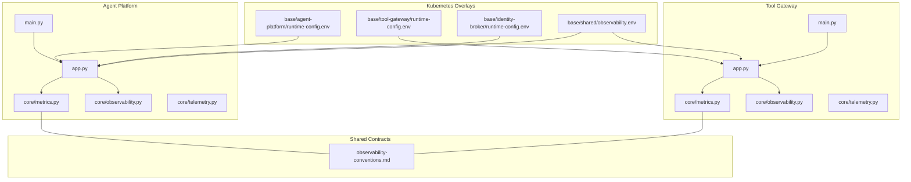
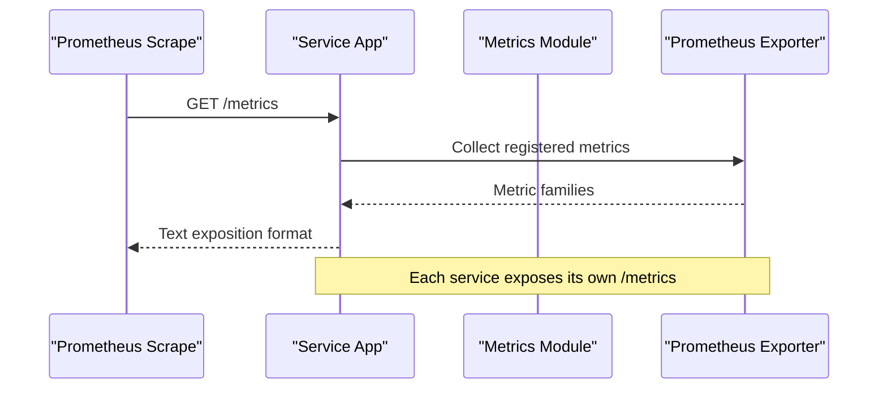
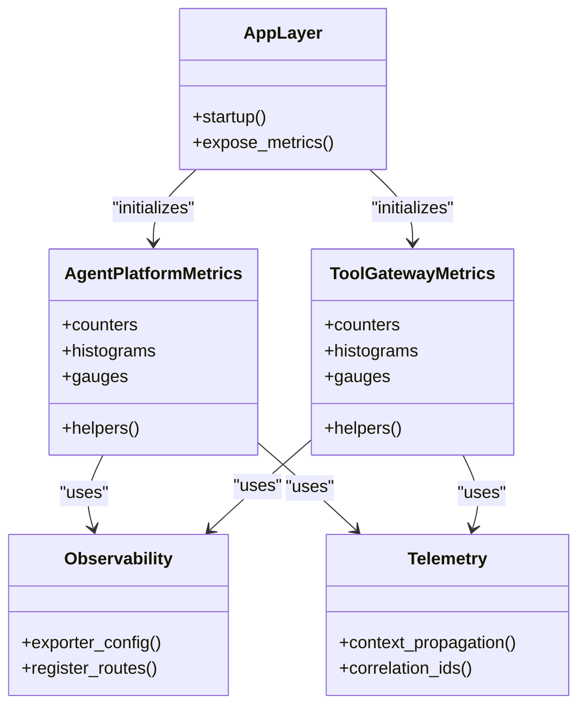

# Metrics Collection and Monitoring

<cite>
**Referenced Files in This Document**
- [observability-conventions.md](file://shared/shared-contracts/observability-conventions.md)
- [metrics.py](file://products/agent-platform/src/agent_service/core/metrics.py)
- [observability.py](file://products/agent-platform/src/agent_service/core/observability.py)
- [telemetry.py](file://products/agent-platform/src/agent_service/core/telemetry.py)
- [app.py](file://products/agent-platform/src/agent_service/app.py)
- [main.py](file://products/agent-platform/src/agent_service/main.py)
- [metrics.py](file://products/tool-gateway/src/api_gateway/core/metrics.py)
- [observability.py](file://products/tool-gateway/src/api_gateway/core/observability.py)
- [telemetry.py](file://products/tool-gateway/src/api_gateway/core/telemetry.py)
- [app.py](file://products/tool-gateway/src/api_gateway/app.py)
- [main.py](file://products/tool-gateway/src/api_gateway/main.py)
- [runtime-config.env](file://shared/platform-ops/gitops/dev-k8s/base/agent-platform/runtime-config.env)
- [runtime-config.env](file://shared/platform-ops/gitops/dev-k8s/base/tool-gateway/runtime-config.env)
- [runtime-config.env](file://shared/platform-ops/gitops/dev-k8s/base/identity-broker/runtime-config.env)
- [observability.env](file://shared/platform-ops/gitops/dev-k8s/base/shared/observability.env)
</cite>

## Table of Contents
1. [Introduction](#introduction)
2. [Project Structure](#project-structure)
3. [Core Components](#core-components)
4. [Architecture Overview](#architecture-overview)
5. [Detailed Component Analysis](#detailed-component-analysis)
6. [Dependency Analysis](#dependency-analysis)
7. [Performance Considerations](#performance-considerations)
8. [Troubleshooting Guide](#troubleshooting-guide)
9. [Conclusion](#conclusion)
10. [Appendices](#appendices)

## Introduction
This document explains how the Luban AIOps Platform collects, exposes, and aggregates metrics using Prometheus-compatible instrumentation across services. It covers custom metric definitions, naming conventions, labels, aggregation strategies, and service-specific metrics for agent execution, API requests/responses, session management, and tool invocations. It also provides guidance on dashboards, alerting, performance monitoring best practices, and capacity planning based on collected metrics.

## Project Structure
The observability and metrics implementation is implemented consistently across services:
- Agent Platform (Agent Service): defines metrics, telemetry, and observability utilities; integrates with application lifecycle.
- Tool Gateway (API Gateway): exposes gateway-level metrics for HTTP endpoints and policy enforcement; integrates with application lifecycle.
- Identity Broker: follows the same pattern for identity-related metrics.
- Shared contracts define observability conventions used by all services.
- Kubernetes overlays configure environment variables to enable metrics exposure and scraping.

**Diagram sources**
- [app.py](file://products/agent-platform/src/agent_service/app.py)
- [main.py](file://products/agent-platform/src/agent_service/main.py)
- [metrics.py](file://products/agent-platform/src/agent_service/core/metrics.py)
- [observability.py](file://products/agent-platform/src/agent_service/core/observability.py)
- [telemetry.py](file://products/agent-platform/src/agent_service/core/telemetry.py)
- [app.py](file://products/tool-gateway/src/api_gateway/app.py)
- [main.py](file://products/tool-gateway/src/api_gateway/main.py)
- [metrics.py](file://products/tool-gateway/src/api_gateway/core/metrics.py)
- [observability.py](file://products/tool-gateway/src/api_gateway/core/observability.py)
- [telemetry.py](file://products/tool-gateway/src/api_gateway/core/telemetry.py)
- [observability-conventions.md](file://shared/shared-contracts/observability-conventions.md)
- [runtime-config.env](file://shared/platform-ops/gitops/dev-k8s/base/agent-platform/runtime-config.env)
- [runtime-config.env](file://shared/platform-ops/gitops/dev-k8s/base/tool-gateway/runtime-config.env)
- [runtime-config.env](file://shared/platform-ops/gitops/dev-k8s/base/identity-broker/runtime-config.env)
- [observability.env](file://shared/platform-ops/gitops/dev-k8s/base/shared/observability.env)

**Section sources**
- [observability-conventions.md](file://shared/shared-contracts/observability-conventions.md)
- [metrics.py](file://products/agent-platform/src/agent_service/core/metrics.py)
- [observability.py](file://products/agent-platform/src/agent_service/core/observability.py)
- [telemetry.py](file://products/agent-platform/src/agent_service/core/telemetry.py)
- [app.py](file://products/agent-platform/src/agent_service/app.py)
- [main.py](file://products/agent-platform/src/agent_service/main.py)
- [metrics.py](file://products/tool-gateway/src/api_gateway/core/metrics.py)
- [observability.py](file://products/tool-gateway/src/api_gateway/core/observability.py)
- [telemetry.py](file://products/tool-gateway/src/api_gateway/core/telemetry.py)
- [app.py](file://products/tool-gateway/src/api_gateway/app.py)
- [main.py](file://products/tool-gateway/src/api_gateway/main.py)
- [runtime-config.env](file://shared/platform-ops/gitops/dev-k8s/base/agent-platform/runtime-config.env)
- [runtime-config.env](file://shared/platform-ops/gitops/dev-k8s/base/tool-gateway/runtime-config.env)
- [runtime-config.env](file://shared/platform-ops/gitops/dev-k8s/base/identity-broker/runtime-config.env)
- [observability.env](file://shared/platform-ops/gitops/dev-k8s/base/shared/observability.env)

## Core Components
- Shared Observability Conventions: Defines naming, labeling, and semantic expectations for metrics across services.
- Service Metrics Modules: Define counters, histograms, gauges, and aggregators per service.
- Telemetry Utilities: Provide helpers for tracing and context propagation that complement metrics.
- Application Integration: Bootstraps metrics exporters and registers routes or middleware to expose /metrics.
- Environment Configuration: Enables metrics collection via environment variables in Kubernetes overlays.

Key responsibilities:
- Standardize metric names and labels to ensure consistent aggregation and dashboards.
- Expose a Prometheus scrape endpoint per service.
- Instrument key business operations (requests, sessions, tools, runtime).
- Provide hooks for custom metrics creation and extension.

**Section sources**
- [observability-conventions.md](file://shared/shared-contracts/observability-conventions.md)
- [metrics.py](file://products/agent-platform/src/agent_service/core/metrics.py)
- [metrics.py](file://products/tool-gateway/src/api_gateway/core/metrics.py)
- [observability.py](file://products/agent-platform/src/agent_service/core/observability.py)
- [observability.py](file://products/tool-gateway/src/api_gateway/core/observability.py)
- [telemetry.py](file://products/agent-platform/src/agent_service/core/telemetry.py)
- [telemetry.py](file://products/tool-gateway/src/api_gateway/core/telemetry.py)
- [app.py](file://products/agent-platform/src/agent_service/app.py)
- [app.py](file://products/tool-gateway/src/api_gateway/app.py)
- [main.py](file://products/agent-platform/src/agent_service/main.py)
- [main.py](file://products/tool-gateway/src/api_gateway/main.py)

## Architecture Overview
Each service implements a consistent metrics architecture:
- Metrics module defines typed metrics and helper functions.
- Observability module wires up exporters and global configuration.
- Telemetry module adds request context and correlation IDs.
- Application layer registers the /metrics endpoint and optional middleware.
- Kubernetes overlays set environment variables to enable scraping and retention policies.

**Diagram sources**
- [app.py](file://products/agent-platform/src/agent_service/app.py)
- [metrics.py](file://products/agent-platform/src/agent_service/core/metrics.py)
- [observability.py](file://products/agent-platform/src/agent_service/core/observability.py)
- [app.py](file://products/tool-gateway/src/api_gateway/app.py)
- [metrics.py](file://products/tool-gateway/src/api_gateway/core/metrics.py)
- [observability.py](file://products/tool-gateway/src/api_gateway/core/observability.py)

## Detailed Component Analysis

### Agent Platform Metrics
Responsibilities:
- Define agent execution metrics (e.g., request counts, latency histograms, error rates).
- Track session lifecycle events and storage interactions.
- Instrument provider calls and tool invocations within the agent runtime.
- Integrate with observability and telemetry modules for context propagation.

Implementation highlights:
- Counters for total requests, errors, and retries.
- Histograms for latency and payload sizes.
- Gauges for active sessions and queue lengths.
- Aggregation helpers to compute per-service and per-provider breakdowns.

Naming and labels:
- Follow shared conventions for metric prefixes, suffixes, and label keys.
- Common labels include service name, version, instance, region, and operation.

Integration points:
- Application startup initializes metrics and registers the /metrics route.
- Middleware or decorators wrap handlers to record request/response metrics.

**Section sources**
- [metrics.py](file://products/agent-platform/src/agent_service/core/metrics.py)
- [observability.py](file://products/agent-platform/src/agent_service/core/observability.py)
- [telemetry.py](file://products/agent-platform/src/agent_service/core/telemetry.py)
- [app.py](file://products/agent-platform/src/agent_service/app.py)
- [main.py](file://products/agent-platform/src/agent_service/main.py)

### Tool Gateway Metrics
Responsibilities:
- Record HTTP request/response metrics (status codes, latency, throughput).
- Track policy evaluation outcomes and token verification results.
- Instrument tool invocation flows and downstream client calls.
- Provide per-route and per-method breakdowns for fine-grained analysis.

Implementation highlights:
- Counters for requests by method, path, and status code.
- Histograms for latency and response size.
- Gauges for concurrent requests and active tool invocations.
- Aggregations by policy decision and identity context.

Naming and labels:
- Consistent prefixing and label keys aligned with shared conventions.
- Labels include route, method, status_code, policy_decision, and identity_provider.

Integration points:
- Application bootstraps metrics and exposes /metrics.
- Request pipeline records metrics at entry and exit points.

**Section sources**
- [metrics.py](file://products/tool-gateway/src/api_gateway/core/metrics.py)
- [observability.py](file://products/tool-gateway/src/api_gateway/core/observability.py)
- [telemetry.py](file://products/tool-gateway/src/api_gateway/core/telemetry.py)
- [app.py](file://products/tool-gateway/src/api_gateway/app.py)
- [main.py](file://products/tool-gateway/src/api_gateway/main.py)

### Identity Broker Metrics
Responsibilities:
- Track authentication and token issuance metrics.
- Monitor identity provider integrations and error rates.
- Provide visibility into session creation and validation.

Implementation highlights:
- Counters for auth attempts, successes, failures.
- Histograms for token generation latency.
- Gauges for active tokens and provider connections.

Naming and labels:
- Align with shared conventions; include identity provider and action labels.

**Section sources**
- [metrics.py](file://products/identity-broker/src/identity_service/core/metrics.py)
- [observability.py](file://products/identity-broker/src/identity_service/core/observability.py)
- [telemetry.py](file://products/identity-broker/src/identity_service/core/telemetry.py)
- [app.py](file://products/identity-broker/src/identity_service/app.py)
- [main.py](file://products/identity-broker/src/identity_service/main.py)

### Custom Metric Creation Examples
Guidelines:
- Use counters for event totals (e.g., requests, retries, errors).
- Use histograms for latency distributions and payload sizes.
- Use gauges for stateful values (e.g., active sessions, queue length).
- Apply consistent labels per shared conventions to enable aggregation.

Common patterns:
- Wrap handler functions with decorators to record metrics automatically.
- Use helper functions to increment counters and observe durations.
- Group related metrics under a single namespace or prefix.

**Section sources**
- [metrics.py](file://products/agent-platform/src/agent_service/core/metrics.py)
- [metrics.py](file://products/tool-gateway/src/api_gateway/core/metrics.py)
- [observability-conventions.md](file://shared/shared-contracts/observability-conventions.md)

### Dashboard Configuration
Recommendations:
- Create service-level dashboards showing request rate, error rate, and latency percentiles.
- Include panels for session activity, tool invocation success/failure, and policy decisions.
- Use standard Prometheus queries leveraging consistent labels for cross-service comparisons.

Example panels:
- HTTP Requests by Method and Status Code
- Latency Percentiles by Route
- Active Sessions Gauge
- Tool Invocation Success Rate
- Policy Decision Distribution

[No sources needed since this section provides general guidance]

### Alert Rule Setup
Recommended alerts:
- High error rate for critical endpoints.
- Elevated p95/p99 latency beyond SLO thresholds.
- Session growth exceeding capacity limits.
- Tool invocation failure spikes.
- Policy denial rate anomalies.

Alert conditions:
- Use PromQL expressions with consistent labels.
- Set appropriate thresholds and evaluation windows.
- Include runbook links and severity levels.

[No sources needed since this section provides general guidance]

## Dependency Analysis
Metrics components depend on shared conventions and are integrated through application layers. The following diagram shows relationships between modules and their roles in exposing metrics.

**Diagram sources**
- [metrics.py](file://products/agent-platform/src/agent_service/core/metrics.py)
- [metrics.py](file://products/tool-gateway/src/api_gateway/core/metrics.py)
- [observability.py](file://products/agent-platform/src/agent_service/core/observability.py)
- [observability.py](file://products/tool-gateway/src/api_gateway/core/observability.py)
- [telemetry.py](file://products/agent-platform/src/agent_service/core/telemetry.py)
- [telemetry.py](file://products/tool-gateway/src/api_gateway/core/telemetry.py)
- [app.py](file://products/agent-platform/src/agent_service/app.py)
- [app.py](file://products/tool-gateway/src/api_gateway/app.py)

**Section sources**
- [metrics.py](file://products/agent-platform/src/agent_service/core/metrics.py)
- [metrics.py](file://products/tool-gateway/src/api_gateway/core/metrics.py)
- [observability.py](file://products/agent-platform/src/agent_service/core/observability.py)
- [observability.py](file://products/tool-gateway/src/api_gateway/core/observability.py)
- [telemetry.py](file://products/agent-platform/src/agent_service/core/telemetry.py)
- [telemetry.py](file://products/tool-gateway/src/api_gateway/core/telemetry.py)
- [app.py](file://products/agent-platform/src/agent_service/app.py)
- [app.py](file://products/tool-gateway/src/api_gateway/app.py)

## Performance Considerations
Best practices:
- Prefer histograms for latency to capture distribution and percentiles.
- Avoid high-cardinality labels; use sampled or aggregated dimensions where possible.
- Batch metric updates and avoid synchronous I/O in hot paths.
- Use exponential bucketing for latency histograms to cover wide ranges efficiently.
- Monitor exporter overhead and scrape intervals to prevent backpressure.

Capacity planning:
- Track request rate and latency trends to scale horizontally.
- Monitor session growth and storage utilization to plan capacity.
- Use error rate and policy denial metrics to identify bottlenecks and optimize flows.

[No sources needed since this section provides general guidance]

## Troubleshooting Guide
Common issues:
- Missing /metrics endpoint: verify application initialization and route registration.
- Inconsistent labels: ensure adherence to shared conventions.
- High cardinality causing slow scrapes: reduce label diversity or aggregate.
- Stale metrics: check exporter health and scrape configuration.

Debugging steps:
- Inspect raw Prometheus scrape output for malformed metrics.
- Validate PromQL queries against known label sets.
- Correlate metrics with logs and traces from telemetry module.

**Section sources**
- [observability-conventions.md](file://shared/shared-contracts/observability-conventions.md)
- [metrics.py](file://products/agent-platform/src/agent_service/core/metrics.py)
- [metrics.py](file://products/tool-gateway/src/api_gateway/core/metrics.py)
- [telemetry.py](file://products/agent-platform/src/agent_service/core/telemetry.py)
- [telemetry.py](file://products/tool-gateway/src/api_gateway/core/telemetry.py)

## Conclusion
The Luban AIOps Platform implements a consistent, convention-driven metrics strategy across services. By standardizing naming, labels, and aggregation, it enables robust dashboards and alerting. Following the best practices outlined here ensures reliable performance monitoring and informed capacity planning.

[No sources needed since this section summarizes without analyzing specific files]

## Appendices

### Metric Naming Conventions and Labels
- Prefixes: service-specific namespaces (e.g., agent_platform_, api_gateway_).
- Suffixes: _total, _latency_seconds, _size_bytes, _active.
- Labels: service, version, instance, region, operation, method, route, status_code, policy_decision, identity_provider.

**Section sources**
- [observability-conventions.md](file://shared/shared-contracts/observability-conventions.md)

### Data Retention Policies
- Configure Prometheus retention via environment variables in Kubernetes overlays.
- Adjust scrape intervals and storage limits based on workload characteristics.

**Section sources**
- [runtime-config.env](file://shared/platform-ops/gitops/dev-k8s/base/agent-platform/runtime-config.env)
- [runtime-config.env](file://shared/platform-ops/gitops/dev-k8s/base/tool-gateway/runtime-config.env)
- [runtime-config.env](file://shared/platform-ops/gitops/dev-k8s/base/identity-broker/runtime-config.env)
- [observability.env](file://shared/platform-ops/gitops/dev-k8s/base/shared/observability.env)

### Example PromQL Queries
- Request rate by method: sum(rate(api_gateway_requests_total{method="GET"}[5m]))
- Error rate by route: sum(rate(api_gateway_requests_total{status_code=~"5.."}[5m])) / sum(rate(api_gateway_requests_total[5m]))
- Latency percentiles: histogram_quantile(0.99, rate(api_gateway_request_latency_seconds_bucket[5m]))
- Active sessions: sum(agent_platform_sessions_active)

[No sources needed since this section provides general guidance]