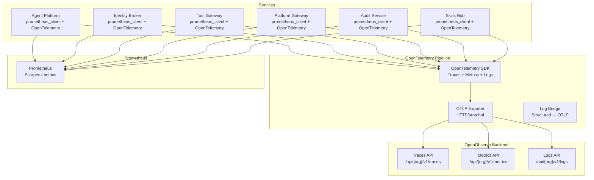
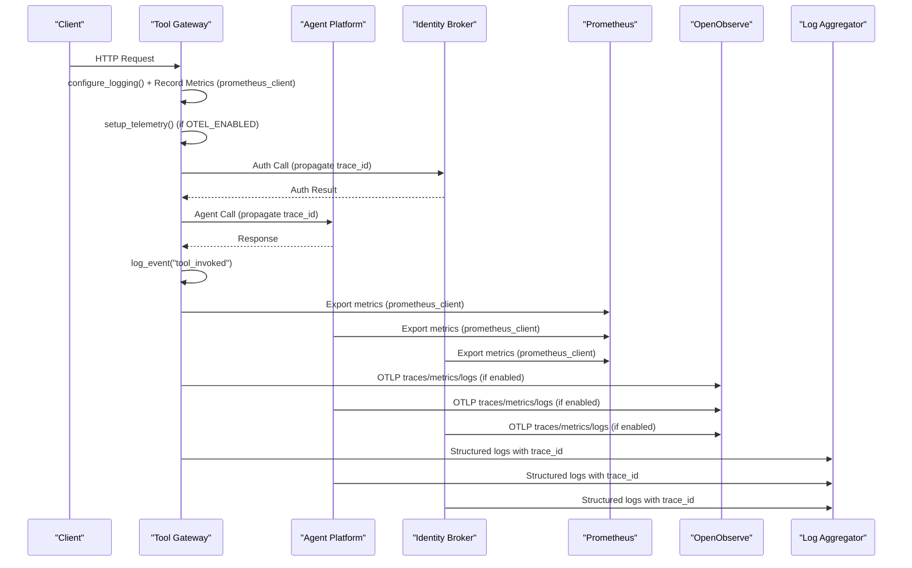
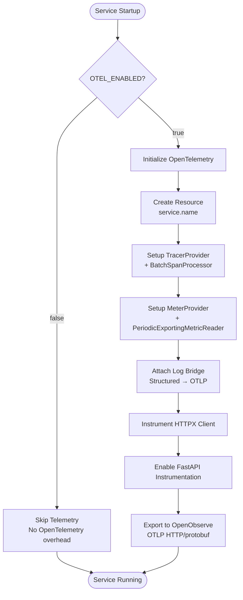
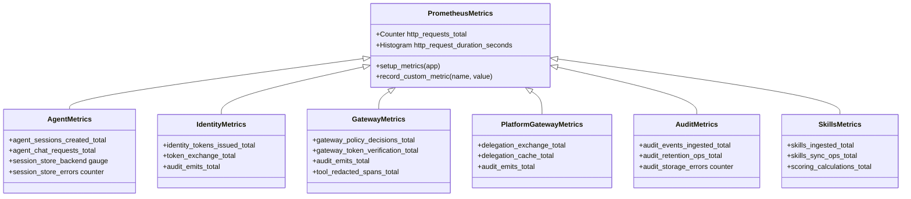
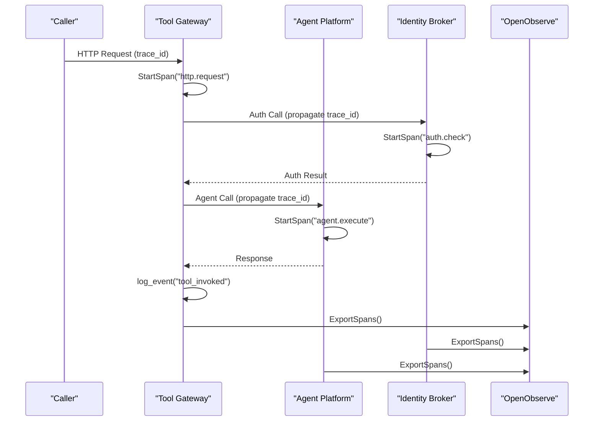
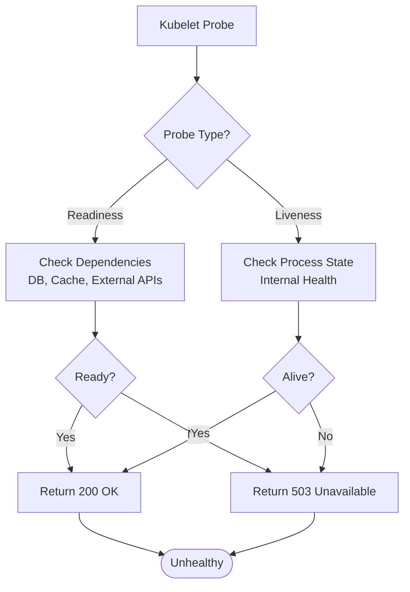
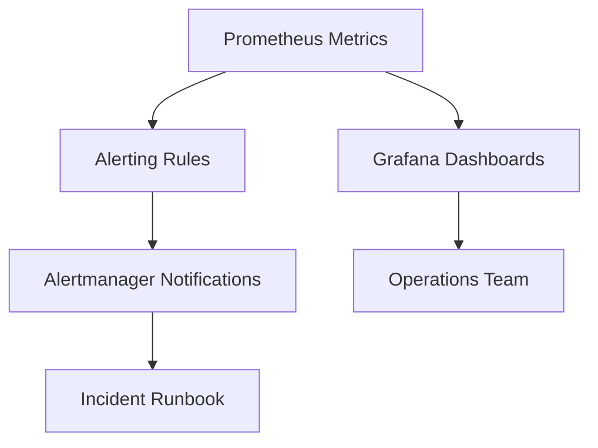
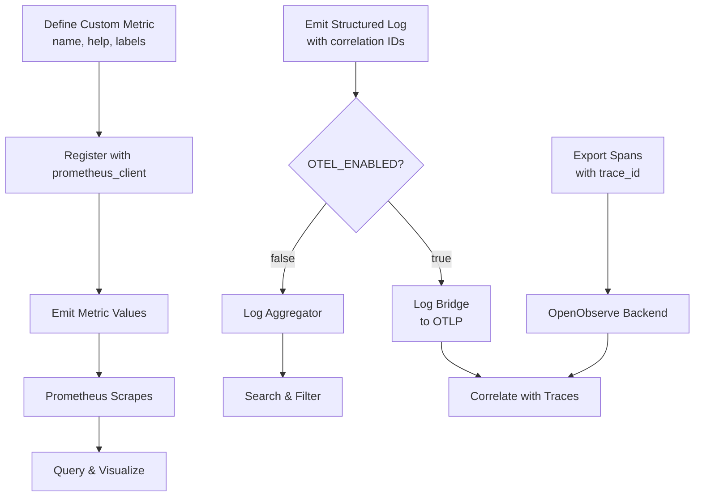
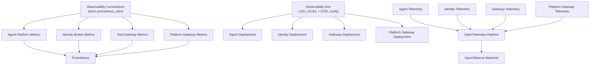

# Monitoring and Observability

<cite>
**Referenced Files in This Document**
- [SPEC-005-observability-baseline/spec.md](file://docs/specs/SPEC-005-observability-baseline/spec.md)
- [observability-conventions.md](file://shared/shared-contracts/observability-conventions.md)
- [agent-platform/src/agent_service/core/metrics.py](file://products/agent-platform/src/agent_service/core/metrics.py)
- [identity-broker/src/identity_service/core/metrics.py](file://products/identity-broker/src/identity_service/core/metrics.py)
- [tool-gateway/src/tool_gateway/core/metrics.py](file://products/tool-gateway/src/tool_gateway/core/metrics.py)
- [platform-gateway/src/platform_gateway/core/metrics.py](file://products/platform-gateway/src/platform_gateway/core/metrics.py)
- [audit-service/src/audit_service/core/metrics.py](file://products/audit-service/src/audit_service/core/metrics.py)
- [skills-hub/src/skills_hub/core/metrics.py](file://products/skills-hub/src/skills_hub/core/metrics.py)
- [agent-platform/src/agent_service/app.py](file://products/agent-platform/src/agent_service/app.py)
- [identity-broker/src/identity_service/app.py](file://products/identity-broker/src/identity_service/app.py)
- [tool-gateway/src/tool_gateway/app.py](file://products/tool-gateway/src/tool_gateway/app.py)
- [platform-gateway/src/platform_gateway/app.py](file://products/platform-gateway/src/platform_gateway/app.py)
- [agent-platform/src/agent_service/core/telemetry.py](file://products/agent-platform/src/agent_service/core/telemetry.py)
- [identity-broker/src/identity_service/core/telemetry.py](file://products/identity-broker/src/identity_service/core/telemetry.py)
- [tool-gateway/src/tool_gateway/core/telemetry.py](file://products/tool-gateway/src/tool_gateway/core/telemetry.py)
- [platform-gateway/src/platform_gateway/core/telemetry.py](file://products/platform-gateway/src/platform_gateway/core/telemetry.py)
- [audit-service/src/audit_service/core/telemetry.py](file://products/audit-service/src/audit_service/core/telemetry.py)
- [skills-hub/src/skills_hub/core/telemetry.py](file://products/skills-hub/src/skills_hub/core/telemetry.py)
- [shared/shared-contracts/schemas/health-response.schema.json](file://shared/shared-contracts/schemas/health-response.schema.json)
- [shared/platform-ops/gitops/dev-k8s/base/agent-platform/agent-service-deployment.yaml](file://shared/platform-ops/gitops/dev-k8s/base/agent-platform/agent-service-deployment.yaml)
- [shared/platform-ops/gitops/dev-k8s/base/identity-broker/identity-service-deployment.yaml](file://shared/platform-ops/gitops/dev-k8s/base/identity-broker/identity-service-deployment.yaml)
- [shared/platform-ops/gitops/dev-k8s/base/tool-gateway/tool-gateway-deployment.yaml](file://shared/platform-ops/gitops/dev-k8s/base/tool-gateway/tool-gateway-deployment.yaml)
- [shared/platform-ops/gitops/dev-k8s/base/audit-service/audit-service-deployment.yaml](file://shared/platform-ops/gitops/dev-k8s/base/audit-service/audit-service-deployment.yaml)
- [shared/platform-ops/gitops/dev-k8s/base/platform-gateway/platform-gateway-deployment.yaml](file://shared/platform-ops/gitops/dev-k8s/base/platform-gateway/platform-gateway-deployment.yaml)
</cite>

## Update Summary
**Changes Made**
- Added comprehensive OpenObserve telemetry push implementation across all six platform services with OTLP HTTP/protobuf protocol
- Enhanced distributed tracing section to document the opt-in OpenTelemetry pipeline with log bridge functionality
- Updated architecture diagrams to show end-to-end observability capabilities including traces, metrics, and logs
- Added configuration guidance for OTEL_ENABLED environment variable and OpenObserve endpoint setup
- Updated troubleshooting guide with OpenObserve-specific debugging procedures
- Documented fail-open behavior when OpenObserve collector is unreachable

## Table of Contents
1. [Introduction](#introduction)
2. [Project Structure](#project-structure)
3. [Core Components](#core-components)
4. [Architecture Overview](#architecture-overview)
5. [Detailed Component Analysis](#detailed-component-analysis)
6. [Dependency Analysis](#dependency-analysis)
7. [Performance Considerations](#performance-considerations)
8. [Troubleshooting Guide](#troubleshooting-guide)
9. [Conclusion](#conclusion)
10. [Appendices](#appendices)

## Introduction
This document provides comprehensive guidance for monitoring and observability across the Luban AIOps Platform. It consolidates the platform's metrics collection strategy using Prometheus with direct prometheus_client implementation, structured logging conventions, distributed tracing implementation with OpenObserve integration, health check endpoints, readiness/liveness probes configuration, alerting rules, dashboard templates, and incident response procedures. The platform now includes a comprehensive OpenTelemetry push pipeline that exports traces, metrics, and logs to OpenObserve via OTLP HTTP/protobuf protocol, enabling end-to-end observability across all six platform services.

## Project Structure
Observability is implemented consistently across all six services with standardized metrics collection using direct prometheus_client implementation and comprehensive OpenTelemetry telemetry:
- Agent Platform service exposes metrics via custom RED middleware with prometheus_client and OpenTelemetry push pipeline
- Identity Broker service implements similar metrics collection with domain-specific counters and OpenTelemetry integration
- Tool Gateway service integrates metrics into request handling with policy decision tracking and OpenTelemetry support
- Platform Gateway service provides centralized routing metrics with delegation tracking and OpenTelemetry instrumentation
- Audit Service and Skills Hub services complete the observability coverage with consistent telemetry patterns
- Shared contracts define observability conventions and schemas used by all services
- Kubernetes manifests configure probes and environment variables for observability components

**Diagram sources**
- [agent-platform/src/agent_service/core/telemetry.py](file://products/agent-platform/src/agent_service/core/telemetry.py)
- [identity-broker/src/identity_service/core/telemetry.py](file://products/identity-broker/src/identity_service/core/telemetry.py)
- [tool-gateway/src/tool_gateway/core/telemetry.py](file://products/tool-gateway/src/tool_gateway/core/telemetry.py)
- [platform-gateway/src/platform_gateway/core/telemetry.py](file://products/platform-gateway/src/platform_gateway/core/telemetry.py)
- [audit-service/src/audit_service/core/telemetry.py](file://products/audit-service/src/audit_service/core/telemetry.py)
- [skills-hub/src/skills_hub/core/telemetry.py](file://products/skills-hub/src/skills_hub/core/telemetry.py)

**Section sources**
- [shared/shared-contracts/observability-conventions.md](file://shared/shared-contracts/observability-conventions.md)

## Core Components
- **Updated** Metrics Collection Strategy:
  - Each service exposes a Prometheus-compatible endpoint via direct prometheus_client implementation
  - Custom RED middleware records HTTP requests and durations with bounded cardinality labels
  - Standardized metric naming and labels enforced through shared conventions
  - Direct implementation avoids compatibility issues with pinned starlette versions
- **Enhanced** Distributed Tracing Implementation:
  - Opt-in OpenTelemetry push pipeline exports traces, metrics, and logs to OpenObserve
  - Gated by OTEL_ENABLED environment variable (default: disabled)
  - Uses OTLP HTTP/protobuf protocol to match OpenObserve ingest contract
  - Log bridge mirrors structured logs to OTLP pipeline for correlation with traces
  - Fail-open design ensures service continues operating if OpenObserve is unreachable
- Structured Logging Conventions:
  - All services call `configure_logging()` at startup to raise root logger from WARNING to INFO level
  - LOG_LEVEL environment variable supports per-deployment log level overrides (default: INFO)
  - Logs include consistent fields such as service name, version, request ID, and correlation IDs
  - Audit trail events (http_request, tool_invoked, policy decisions) are captured at INFO level
- Health Check Endpoints:
  - Services expose health endpoints conforming to shared schema definitions.
  - Readiness and liveness probes are configured in Kubernetes deployments.
- Alerting Rules and Dashboards:
  - Alerting rules target key SLOs derived from metrics.
  - Dashboard templates visualize core KPIs and operational health.

**Section sources**
- [SPEC-005-observability-baseline/spec.md](file://docs/specs/SPEC-005-observability-baseline/spec.md)
- [shared/shared-contracts/observability-conventions.md](file://shared/shared-contracts/observability-conventions.md)

## Architecture Overview
The observability architecture centers around dual pipelines: direct prometheus_client implementation for metrics collection and opt-in OpenTelemetry push pipeline for comprehensive observability:
- Services implement custom RED middleware using prometheus_client for metrics collection
- Application startup sequences call configure_logging() before FastAPI initialization
- OpenTelemetry pipeline is initialized conditionally based on OTEL_ENABLED flag
- OTLP exporters send traces, metrics, and logs to OpenObserve via HTTP/protobuf
- Kubernetes configurations inject environment variables and define probes
- Prometheus scrapes metrics; logs are aggregated centrally; traces are exported to OpenObserve

**Diagram sources**
- [tool-gateway/src/tool_gateway/core/telemetry.py](file://products/tool-gateway/src/tool_gateway/core/telemetry.py)
- [agent-platform/src/agent_service/core/telemetry.py](file://products/agent-platform/src/agent_service/core/telemetry.py)
- [identity-broker/src/identity_service/core/telemetry.py](file://products/identity-broker/src/identity_service/core/telemetry.py)
- [platform-gateway/src/platform_gateway/core/telemetry.py](file://products/platform-gateway/src/platform_gateway/core/telemetry.py)

## Detailed Component Analysis

### **Updated** OpenTelemetry Push Pipeline Implementation
- **Comprehensive Coverage**: All six platform services implement identical OpenTelemetry push pipeline
- **Opt-in Configuration**: Enabled via OTEL_ENABLED environment variable (supports true/false/yes/on/1)
- **OTLP Protocol**: Uses HTTP/protobuf protocol compatible with OpenObserve ingest endpoints
- **Three Signal Types**: Exports traces, metrics, and logs to OpenObserve backend
- **Fail-Open Design**: Setup errors are logged but never raised into request path
- **Resource Context**: Service name propagated via OTEL_SERVICE_NAME or defaults to service metadata
- **Authentication**: Supports OTEL_EXPORTER_OTLP_HEADERS for OpenObserve authentication

**Diagram sources**
- [agent-platform/src/agent_service/core/telemetry.py](file://products/agent-platform/src/agent_service/core/telemetry.py)
- [identity-broker/src/identity_service/core/telemetry.py](file://products/identity-broker/src/identity_service/core/telemetry.py)
- [tool-gateway/src/tool_gateway/core/telemetry.py](file://products/tool-gateway/src/tool_gateway/core/telemetry.py)

**Section sources**
- [agent-platform/src/agent_service/core/telemetry.py](file://products/agent-platform/src/agent_service/core/telemetry.py)
- [identity-broker/src/identity_service/core/telemetry.py](file://products/identity-broker/src/identity_service/core/telemetry.py)
- [tool-gateway/src/tool_gateway/core/telemetry.py](file://products/tool-gateway/src/tool_gateway/core/telemetry.py)
- [platform-gateway/src/platform_gateway/core/telemetry.py](file://products/platform-gateway/src/platform_gateway/core/telemetry.py)
- [audit-service/src/audit_service/core/telemetry.py](file://products/audit-service/src/audit_service/core/telemetry.py)
- [skills-hub/src/skills_hub/core/telemetry.py](file://products/skills-hub/src/skills_hub/core/telemetry.py)

### **Updated** Metrics Collection Strategy
- Each service defines metrics using direct prometheus_client implementation:
  - Custom RED middleware records HTTP requests with method, handler, and status labels
  - Histogram metrics track request duration with method and handler labels
  - Domain-specific counters for business logic (sessions, tokens, policy decisions)
  - Module-level metric objects prevent double-registration during testing
- Metric naming follows shared conventions to ensure consistency across services
- Labels include service, route, method, status code, and operation where applicable
- Direct implementation avoids compatibility issues with pinned starlette versions

**Diagram sources**
- [agent-platform/src/agent_service/core/metrics.py](file://products/agent-platform/src/agent_service/core/metrics.py)
- [identity-broker/src/identity_service/core/metrics.py](file://products/identity-broker/src/identity_service/core/metrics.py)
- [tool-gateway/src/tool_gateway/core/metrics.py](file://products/tool-gateway/src/tool_gateway/core/metrics.py)
- [platform-gateway/src/platform_gateway/core/metrics.py](file://products/platform-gateway/src/platform_gateway/core/metrics.py)
- [audit-service/src/audit_service/core/metrics.py](file://products/audit-service/src/audit_service/core/metrics.py)
- [skills-hub/src/skills_hub/core/metrics.py](file://products/skills-hub/src/skills_hub/core/metrics.py)

**Section sources**
- [shared/shared-contracts/observability-conventions.md](file://shared/shared-contracts/observability-conventions.md)
- [agent-platform/src/agent_service/core/metrics.py](file://products/agent-platform/src/agent_service/core/metrics.py)
- [identity-broker/src/identity_service/core/metrics.py](file://products/identity-broker/src/identity_service/core/metrics.py)
- [tool-gateway/src/tool_gateway/core/metrics.py](file://products/tool-gateway/src/tool_gateway/core/metrics.py)
- [platform-gateway/src/platform_gateway/core/metrics.py](file://products/platform-gateway/src/platform_gateway/core/metrics.py)

### Enhanced Structured Logging Conventions
- All services now implement standardized logging configuration:
  - `configure_logging()` raises root logger from WARNING to INFO level at startup
  - LOG_LEVEL environment variable supports per-deployment overrides (default: INFO)
  - Audit trail events (http_request, tool_invoked, policy decisions) are captured at INFO level
  - Structured logs include consistent fields: service_name, version, timestamp, level, message, request_id, trace_id, user_id, operation
- **Updated** Log Bridge Integration:
  - When OpenTelemetry is enabled, structured logs are mirrored to OTLP pipeline
  - Log bridge attaches to root logger to capture all application logs
  - Trace context automatically attached to logs when spans are active
  - OpenTelemetry internal loggers detached to prevent recursion
- Log aggregation pipelines parse these fields to support filtering and correlation.
- Sensitive data is excluded from logs per security policies.

**Section sources**
- [shared/shared-contracts/observability-conventions.md](file://shared/shared-contracts/observability-conventions.md)
- [agent-platform/src/agent_service/core/observability.py](file://products/agent-platform/src/agent_service/core/observability.py)
- [identity-broker/src/identity_service/core/observability.py](file://products/identity-broker/src/identity_service/core/observability.py)
- [tool-gateway/src/tool_gateway/core/observability.py](file://products/tool-gateway/src/tool_gateway/core/observability.py)
- [platform-gateway/src/platform_gateway/core/observability.py](file://products/platform-gateway/src/platform_gateway/core/observability.py)

### **Enhanced** Distributed Tracing Implementation
- **Comprehensive Coverage**: All six services implement identical OpenTelemetry tracing
- **Trace Propagation**: W3C trace context propagated across service boundaries
- **Automatic Instrumentation**: FastAPI and HTTPX client calls automatically instrumented
- **Batch Processing**: Spans exported in batches for optimal performance
- **Resource Context**: Service metadata included in all telemetry signals
- **Current Trace ID**: Available via current_trace_id() function for correlation

**Diagram sources**
- [agent-platform/src/agent_service/core/telemetry.py](file://products/agent-platform/src/agent_service/core/telemetry.py)
- [identity-broker/src/identity_service/core/telemetry.py](file://products/identity-broker/src/identity_service/core/telemetry.py)
- [tool-gateway/src/tool_gateway/core/telemetry.py](file://products/tool-gateway/src/tool_gateway/core/telemetry.py)
- [platform-gateway/src/platform_gateway/core/telemetry.py](file://products/platform-gateway/src/platform_gateway/core/telemetry.py)

**Section sources**
- [agent-platform/src/agent_service/core/telemetry.py](file://products/agent-platform/src/agent_service/core/telemetry.py)
- [identity-broker/src/identity_service/core/telemetry.py](file://products/identity-broker/src/identity_service/core/telemetry.py)
- [tool-gateway/src/tool_gateway/core/telemetry.py](file://products/tool-gateway/src/tool_gateway/core/telemetry.py)
- [platform-gateway/src/platform_gateway/core/telemetry.py](file://products/platform-gateway/src/platform_gateway/core/telemetry.py)
- [audit-service/src/audit_service/core/telemetry.py](file://products/audit-service/src/audit_service/core/telemetry.py)
- [skills-hub/src/skills_hub/core/telemetry.py](file://products/skills-hub/src/skills_hub/core/telemetry.py)

### Health Check Endpoints, Readiness Probes, and Liveness Probes
- Health endpoints return responses conforming to the shared health schema.
- Readiness probes verify dependencies (e.g., Redis, external APIs).
- Liveness probes confirm process health and internal state.
- Kubernetes deployments configure probe paths, intervals, and thresholds.

**Diagram sources**
- [shared/shared-contracts/schemas/health-response.schema.json](file://shared/shared-contracts/schemas/health-response.schema.json)
- [shared/platform-ops/gitops/dev-k8s/base/identity-broker/identity-service-deployment.yaml](file://shared/platform-ops/gitops/dev-k8s/base/identity-broker/identity-service-deployment.yaml)
- [shared/platform-ops/gitops/dev-k8s/base/tool-gateway/tool-gateway-deployment.yaml](file://shared/platform-ops/gitops/dev-k8s/base/tool-gateway/tool-gateway-deployment.yaml)
- [shared/platform-ops/gitops/dev-k8s/base/agent-platform/agent-service-deployment.yaml](file://shared/platform-ops/gitops/dev-k8s/base/agent-platform/agent-service-deployment.yaml)

**Section sources**
- [shared/shared-contracts/schemas/health-response.schema.json](file://shared/shared-contracts/schemas/health-response.schema.json)
- [shared/platform-ops/gitops/dev-k8s/base/identity-broker/identity-service-deployment.yaml](file://shared/platform-ops/gitops/dev-k8s/base/identity-broker/identity-service-deployment.yaml)
- [shared/platform-ops/gitops/dev-k8s/base/tool-gateway/tool-gateway-deployment.yaml](file://shared/platform-ops/gitops/dev-k8s/base/tool-gateway/tool-gateway-deployment.yaml)
- [shared/platform-ops/gitops/dev-k8s/base/agent-platform/agent-service-deployment.yaml](file://shared/platform-ops/gitops/dev-k8s/base/agent-platform/agent-service-deployment.yaml)

### Alerting Rules and Dashboard Templates
- Alerting rules are defined based on key metrics:
  - High error rates, latency spikes, resource exhaustion, dependency failures.
  - Tool invocation failures and redaction overflow events.
- Dashboard templates visualize:
  - Request throughput, latency percentiles, error rates, trace spans, and system resources.
  - Tool invocation patterns and audit trail events.
- Alerts trigger notifications and runbooks for incident response.

**Section sources**
- [SPEC-005-observability-baseline/spec.md](file://docs/specs/SPEC-005-observability-baseline/spec.md)

### Custom Metric Creation, Log Aggregation, and Trace Correlation
- Custom metrics should adhere to shared naming and labeling conventions.
- Logs must include correlation identifiers (request_id, trace_id) for cross-service correlation.
- Traces should be exported with consistent span names and attributes.
- Tool invocation events provide enhanced audit trail for debugging and compliance.
- **Updated** OpenObserve Integration:
  - All three signal types (traces, metrics, logs) exported to OpenObserve when enabled
  - Automatic correlation between logs and traces via trace context
  - Batch processing optimizes network usage and reduces overhead

**Section sources**
- [shared/shared-contracts/observability-conventions.md](file://shared/shared-contracts/observability-conventions.md)

## Dependency Analysis
Observability components depend on shared contracts and Kubernetes configurations:
- Services rely on shared observability conventions for consistency
- Deployments configure probes and environment variables for observability
- Prometheus scrapes metrics from each service's /metrics endpoint
- All services call configure_logging() during startup for consistent log levels
- Direct prometheus_client implementation replaces prometheus-fastapi-instrumentator
- **Updated** OpenTelemetry dependencies:
  - Optional OpenTelemetry SDK components loaded only when OTEL_ENABLED is true
  - OTLP HTTP/protobuf exporters for traces, metrics, and logs
  - Automatic instrumentation for FastAPI and HTTPX client libraries

**Diagram sources**
- [shared/shared-contracts/observability-conventions.md](file://shared/shared-contracts/observability-conventions.md)

**Section sources**
- [shared/shared-contracts/observability-conventions.md](file://shared/shared-contracts/observability-conventions.md)

## Performance Considerations
- Monitor latency percentiles and error rates to identify bottlenecks.
- Use histograms for request durations and gauge metrics for resource utilization.
- Correlate traces with metrics to pinpoint slow or failing operations.
- Capacity planning should be informed by trends in throughput, latency, and error rates.
- Tool invocation patterns can reveal performance issues in external integrations.
- Direct prometheus_client implementation provides better performance than external instrumentation libraries.
- **Updated** OpenTelemetry Performance:
  - Batch processing reduces network overhead for traces, metrics, and logs
  - Fail-open design prevents OpenObserve connectivity issues from impacting service performance
  - Optional feature allows disabling telemetry in high-performance environments
  - Resource-efficient implementation with minimal CPU and memory overhead

## Troubleshooting Guide
- Use structured logs with correlation IDs to trace requests across services.
- Inspect Prometheus metrics for anomalies in latency, errors, and resource usage.
- Review traces to understand call chains and identify failures.
- Validate health endpoints and probe configurations when services are unhealthy.
- Check LOG_LEVEL environment variable if audit trail events are missing - uvicorn defaults to WARNING level which discards INFO-level structured events like http_request and tool_invoked.
- Investigate tool_invoked events for tool-specific issues and redaction problems.
- Verify that configure_logging() is called during service startup to ensure proper log level configuration.
- **Updated** If metrics are not appearing in Prometheus, verify that the /metrics endpoint is accessible and returning prometheus_client format data.
- **Updated** The direct prometheus_client implementation avoids compatibility issues with pinned starlette versions that affected prometheus-fastapi-instrumentator.
- **New** OpenTelemetry Troubleshooting:
  - Set OTEL_ENABLED=true to enable telemetry pipeline
  - Configure OTEL_EXPORTER_OTLP_ENDPOINT to point to OpenObserve
  - Check service logs for "otel telemetry enabled" confirmation message
  - Verify OpenObserve authentication headers via OTEL_EXPORTER_OTLP_HEADERS
  - Test connectivity to OpenObserve endpoint independently
  - Monitor for "otel telemetry setup failed" messages indicating configuration issues
  - Use fail-open behavior to continue service operation even if OpenObserve is unavailable

**Section sources**
- [shared/shared-contracts/observability-conventions.md](file://shared/shared-contracts/observability-conventions.md)
- [SPEC-005-observability-baseline/spec.md](file://docs/specs/SPEC-005-observability-baseline/spec.md)

## Conclusion
The Luban AIOps Platform implements a robust observability framework centered on direct prometheus_client implementation for metrics collection, enhanced structured logging with configurable log levels, and comprehensive distributed tracing with OpenObserve integration. The platform now includes an opt-in OpenTelemetry push pipeline that exports traces, metrics, and logs to OpenObserve via OTLP HTTP/protobuf protocol, providing end-to-end observability across all six platform services. By using direct prometheus_client instead of prometheus-fastapi-instrumentator, the platform avoids compatibility issues with pinned starlette versions while maintaining equivalent functionality. The framework adheres to shared conventions, calls configure_logging() at startup, and configures Kubernetes probes appropriately, enabling operators to effectively monitor, diagnose, and respond to incidents while planning for future capacity needs. The enhanced audit trail with tool_invoked events and OpenObserve integration provides comprehensive visibility into tool execution patterns and potential security concerns.

## Appendices
- Reference specifications for observability baseline and conventions.
- Kubernetes deployment examples for probes and environment variables.
- Health response schema for consistent health checks.
- LOG_LEVEL environment variable configuration for different environments.
- **Updated** Migration notes from prometheus-fastapi-instrumentator to direct prometheus_client implementation.
- **New** OpenTelemetry configuration guide for OpenObserve integration including environment variables and authentication setup.

**Section sources**
- [SPEC-005-observability-baseline/spec.md](file://docs/specs/SPEC-005-observability-baseline/spec.md)
- [shared/shared-contracts/observability-conventions.md](file://shared/shared-contracts/observability-conventions.md)
- [shared/shared-contracts/schemas/health-response.schema.json](file://shared/shared-contracts/schemas/health-response.schema.json)
- [shared/platform-ops/gitops/dev-k8s/base/agent-platform/agent-service-deployment.yaml](file://shared/platform-ops/gitops/dev-k8s/base/agent-platform/agent-service-deployment.yaml)
- [shared/platform-ops/gitops/dev-k8s/base/identity-broker/identity-service-deployment.yaml](file://shared/platform-ops/gitops/dev-k8s/base/identity-broker/identity-service-deployment.yaml)
- [shared/platform-ops/gitops/dev-k8s/base/tool-gateway/tool-gateway-deployment.yaml](file://shared/platform-ops/gitops/dev-k8s/base/tool-gateway/tool-gateway-deployment.yaml)