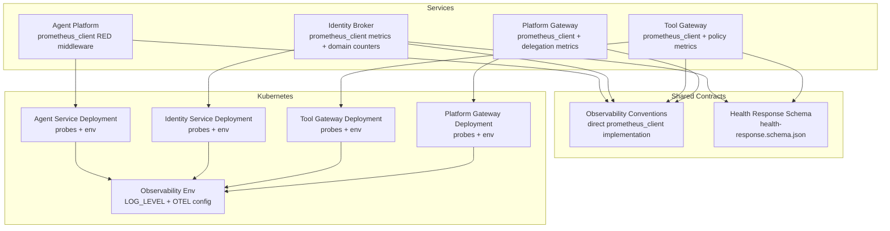
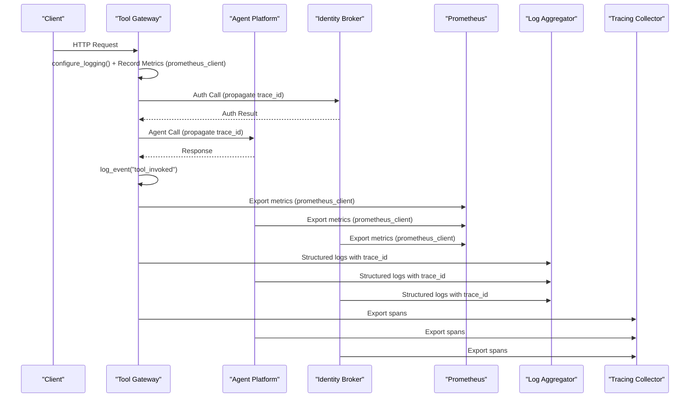
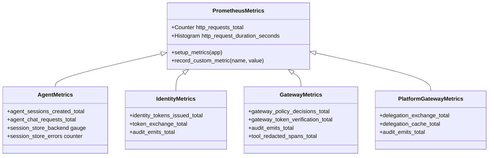
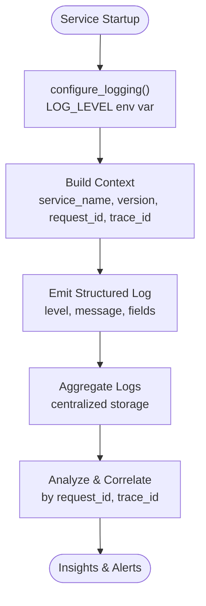
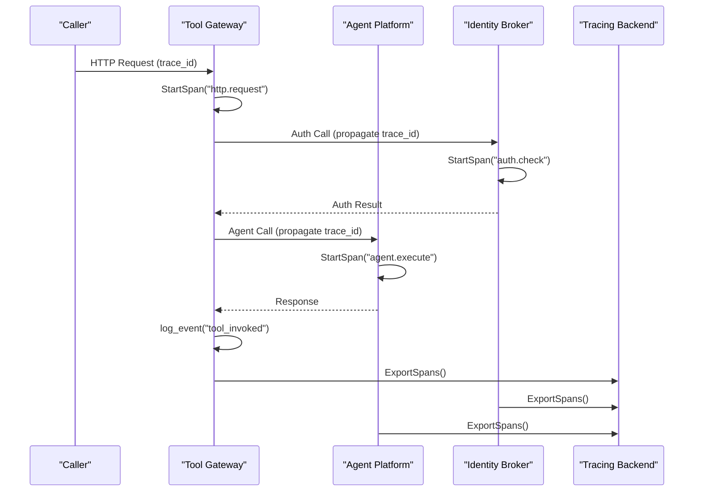
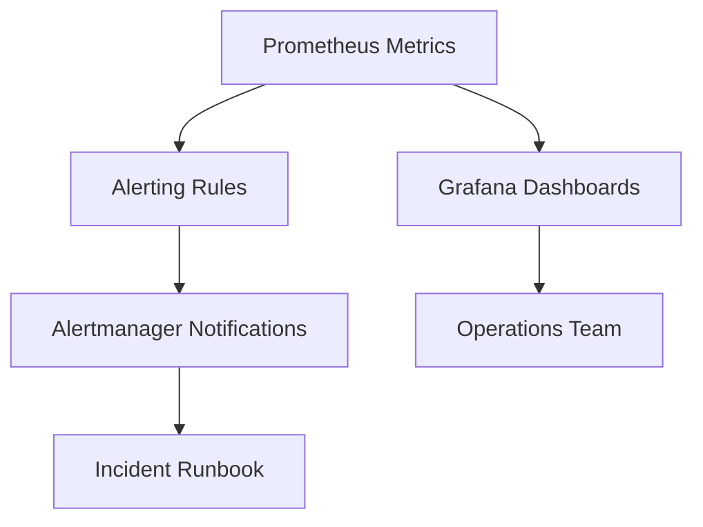
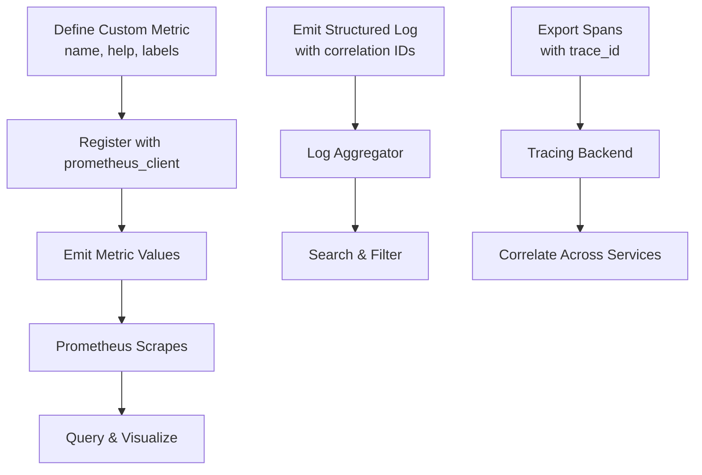
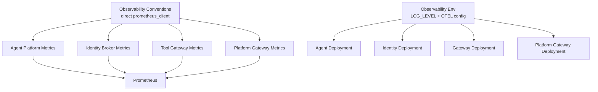

# Monitoring and Observability

<cite>
**Referenced Files in This Document**
- [SPEC-005-observability-baseline/spec.md](file://docs/specs/SPEC-005-observability-baseline/spec.md)
- [observability-conventions.md](file://shared/shared-contracts/observability-conventions.md)
- [agent-platform/src/agent_service/core/metrics.py](file://products/agent-platform/src/agent_service/core/metrics.py)
- [identity-broker/src/identity_service/core/metrics.py](file://products/identity-broker/src/identity_service/core/metrics.py)
- [tool-gateway/src/tool_gateway/core/metrics.py](file://products/tool-gateway/src/tool_gateway/core/metrics.py)
- [platform-gateway/src/platform_gateway/core/metrics.py](file://products/platform-gateway/src/platform_gateway/core/metrics.py)
- [agent-platform/src/agent_service/app.py](file://products/agent-platform/src/agent_service/app.py)
- [identity-broker/src/identity_service/app.py](file://products/identity-broker/src/identity_service/app.py)
- [tool-gateway/src/tool_gateway/app.py](file://products/tool-gateway/src/tool_gateway/app.py)
- [platform-gateway/src/platform_gateway/app.py](file://products/platform-gateway/src/platform_gateway/app.py)
- [agent-platform/src/agent_service/core/telemetry.py](file://products/agent-platform/src/agent_service/core/telemetry.py)
- [identity-broker/src/identity_service/core/telemetry.py](file://products/identity-broker/src/identity_service/core/telemetry.py)
- [tool-gateway/src/tool_gateway/core/telemetry.py](file://products/tool-gateway/src/tool_gateway/core/telemetry.py)
- [platform-gateway/src/platform_gateway/core/telemetry.py](file://products/platform-gateway/src/platform_gateway/core/telemetry.py)
- [shared/shared-contracts/schemas/health-response.schema.json](file://shared/shared-contracts/schemas/health-response.schema.json)
- [shared/platform-ops/gitops/dev-k8s/base/agent-platform/agent-service-deployment.yaml](file://shared/platform-ops/gitops/dev-k8s/base/agent-platform/agent-service-deployment.yaml)
- [shared/platform-ops/gitops/dev-k8s/base/identity-broker/identity-service-deployment.yaml](file://shared/platform-ops/gitops/dev-k8s/base/identity-broker/identity-service-deployment.yaml)
- [shared/platform-ops/gitops/dev-k8s/base/tool-gateway/tool-gateway-deployment.yaml](file://shared/platform-ops/gitops/dev-k8s/base/tool-gateway/tool-gateway-deployment.yaml)
</cite>

## Update Summary
**Changes Made**
- Updated metrics collection strategy section to reflect direct prometheus_client implementation instead of prometheus-fastapi-instrumentator
- Enhanced architecture overview to show the new direct metrics implementation pattern
- Updated dependency analysis to reflect prometheus-client as the core dependency
- Added detailed explanation of the compatibility issues with prometheus-fastapi-instrumentator
- Updated troubleshooting guide to include information about the metrics implementation change

## Table of Contents
1. [Introduction](#introduction)
2. [Project Structure](#project-structure)
3. [Core Components](#core-components)
4. [Architecture Overview](#architecture-overview)
5. [Detailed Component Analysis](#detailed-component-analysis)
6. [Dependency Analysis](#dependency-analysis)
7. [Performance Considerations](#performance-considerations)
8. [Troubleshooting Guide](#troubleshooting-guide)
9. [Conclusion](#conclusion)
10. [Appendices](#appendices)

## Introduction
This document provides comprehensive guidance for monitoring and observability across the Luban AIOps Platform. It consolidates the platform's metrics collection strategy using Prometheus with direct prometheus_client implementation, structured logging conventions, distributed tracing implementation, health check endpoints, readiness/liveness probes configuration, alerting rules, dashboard templates, and incident response procedures. It also includes guidance on custom metric creation, log aggregation, trace correlation, performance monitoring, bottleneck identification, capacity planning, debugging techniques, and troubleshooting workflows using available observability tools.

## Project Structure
Observability is implemented consistently across all four services with standardized metrics collection using direct prometheus_client implementation:
- Agent Platform service exposes metrics via custom RED middleware with prometheus_client
- Identity Broker service implements similar metrics collection with domain-specific counters
- Tool Gateway service integrates metrics into request handling with policy decision tracking
- Platform Gateway service provides centralized routing metrics with delegation tracking
- Shared contracts define observability conventions and schemas used by all services
- Kubernetes manifests configure probes and environment variables for observability components

**Diagram sources**
- [agent-platform/src/agent_service/core/metrics.py](file://products/agent-platform/src/agent_service/core/metrics.py)
- [identity-broker/src/identity_service/core/metrics.py](file://products/identity-broker/src/identity_service/core/metrics.py)
- [tool-gateway/src/tool_gateway/core/metrics.py](file://products/tool-gateway/src/tool_gateway/core/metrics.py)
- [platform-gateway/src/platform_gateway/core/metrics.py](file://products/platform-gateway/src/platform_gateway/core/metrics.py)
- [shared/shared-contracts/observability-conventions.md](file://shared/shared-contracts/observability-conventions.md)
- [shared/shared-contracts/schemas/health-response.schema.json](file://shared/shared-contracts/schemas/health-response.schema.json)

**Section sources**
- [shared/shared-contracts/observability-conventions.md](file://shared/shared-contracts/observability-conventions.md)

## Core Components
- **Updated** Metrics Collection Strategy:
  - Each service exposes a Prometheus-compatible endpoint via direct prometheus_client implementation
  - Custom RED middleware records HTTP requests and durations with bounded cardinality labels
  - Standardized metric naming and labels enforced through shared conventions
  - Direct implementation avoids compatibility issues with pinned starlette versions
- Structured Logging Conventions:
  - All services call `configure_logging()` at startup to raise root logger from WARNING to INFO level
  - LOG_LEVEL environment variable supports per-deployment log level overrides (default: INFO)
  - Logs include consistent fields such as service name, version, request ID, and correlation IDs
  - Audit trail events (http_request, tool_invoked, policy decisions) are captured at INFO level
- Distributed Tracing Implementation:
  - Telemetry modules propagate trace context across service boundaries
  - Enhanced tool invocation tracking with tool_invoked events in tool gateway
  - Spans are created for key operations (HTTP requests, tool invocations, policy checks)
- Health Check Endpoints:
  - Services expose health endpoints conforming to shared schema definitions.
  - Readiness and liveness probes are configured in Kubernetes deployments.
- Alerting Rules and Dashboards:
  - Alerting rules target key SLOs derived from metrics.
  - Dashboard templates visualize core KPIs and operational health.

**Section sources**
- [SPEC-005-observability-baseline/spec.md](file://docs/specs/SPEC-005-observability-baseline/spec.md)
- [shared/shared-contracts/observability-conventions.md](file://shared/shared-contracts/observability-conventions.md)

## Architecture Overview
The observability architecture centers around direct prometheus_client implementation with standardized libraries and shared contracts:
- Services implement custom RED middleware using prometheus_client for metrics collection
- Application startup sequences call configure_logging() before FastAPI initialization
- Kubernetes configurations inject environment variables and define probes
- Prometheus scrapes metrics; logs are aggregated centrally; traces are exported to a collector

**Diagram sources**
- [tool-gateway/src/tool_gateway/core/metrics.py](file://products/tool-gateway/src/tool_gateway/core/metrics.py)
- [agent-platform/src/agent_service/core/metrics.py](file://products/agent-platform/src/agent_service/core/metrics.py)
- [identity-broker/src/identity_service/core/metrics.py](file://products/identity-broker/src/identity_service/core/metrics.py)
- [platform-gateway/src/platform_gateway/core/metrics.py](file://products/platform-gateway/src/platform_gateway/core/metrics.py)

## Detailed Component Analysis

### **Updated** Metrics Collection Strategy
- Each service defines metrics using direct prometheus_client implementation:
  - Custom RED middleware records HTTP requests with method, handler, and status labels
  - Histogram metrics track request duration with method and handler labels
  - Domain-specific counters for business logic (sessions, tokens, policy decisions)
  - Module-level metric objects prevent double-registration during testing
- Metric naming follows shared conventions to ensure consistency across services
- Labels include service, route, method, status code, and operation where applicable
- Direct implementation avoids compatibility issues with pinned starlette versions

**Diagram sources**
- [agent-platform/src/agent_service/core/metrics.py](file://products/agent-platform/src/agent_service/core/metrics.py)
- [identity-broker/src/identity_service/core/metrics.py](file://products/identity-broker/src/identity_service/core/metrics.py)
- [tool-gateway/src/tool_gateway/core/metrics.py](file://products/tool-gateway/src/tool_gateway/core/metrics.py)
- [platform-gateway/src/platform_gateway/core/metrics.py](file://products/platform-gateway/src/platform_gateway/core/metrics.py)

**Section sources**
- [shared/shared-contracts/observability-conventions.md](file://shared/shared-contracts/observability-conventions.md)
- [agent-platform/src/agent_service/core/metrics.py](file://products/agent-platform/src/agent_service/core/metrics.py)
- [identity-broker/src/identity_service/core/metrics.py](file://products/identity-broker/src/identity_service/core/metrics.py)
- [tool-gateway/src/tool_gateway/core/metrics.py](file://products/tool-gateway/src/tool_gateway/core/metrics.py)
- [platform-gateway/src/platform_gateway/core/metrics.py](file://products/platform-gateway/src/platform_gateway/core/metrics.py)

### Structured Logging Conventions
- All services now implement standardized logging configuration:
  - `configure_logging()` raises root logger from WARNING to INFO level at startup
  - LOG_LEVEL environment variable supports per-deployment overrides (default: INFO)
  - Audit trail events (http_request, tool_invoked, policy decisions) are captured at INFO level
  - Structured logs include consistent fields: service_name, version, timestamp, level, message, request_id, trace_id, user_id, operation
- Log aggregation pipelines parse these fields to support filtering and correlation.
- Sensitive data is excluded from logs per security policies.

**Section sources**
- [shared/shared-contracts/observability-conventions.md](file://shared/shared-contracts/observability-conventions.md)
- [agent-platform/src/agent_service/core/observability.py](file://products/agent-platform/src/agent_service/core/observability.py)
- [identity-broker/src/identity_service/core/observability.py](file://products/identity-broker/src/identity_service/core/observability.py)
- [tool-gateway/src/tool_gateway/core/observability.py](file://products/tool-gateway/src/tool_gateway/core/observability.py)
- [platform-gateway/src/platform_gateway/core/observability.py](file://products/platform-gateway/src/platform_gateway/core/observability.py)

### Enhanced Distributed Tracing Implementation
- Telemetry modules create spans for critical operations:
  - HTTP request lifecycle, policy evaluation, tool invocation, agent execution
  - Enhanced tool invocation tracking with tool_invoked events
- Trace context is propagated across service calls using standard headers.
- Spans are exported to a tracing backend for visualization and analysis.
- OpenTelemetry push pipeline is opt-in via OTEL_ENABLED environment variable.

**Diagram sources**
- [agent-platform/src/agent_service/core/telemetry.py](file://products/agent-platform/src/agent_service/core/telemetry.py)
- [identity-broker/src/identity_service/core/telemetry.py](file://products/identity-broker/src/identity_service/core/telemetry.py)
- [tool-gateway/src/tool_gateway/core/telemetry.py](file://products/tool-gateway/src/tool_gateway/core/telemetry.py)
- [platform-gateway/src/platform_gateway/core/telemetry.py](file://products/platform-gateway/src/platform_gateway/core/telemetry.py)

**Section sources**
- [agent-platform/src/agent_service/core/telemetry.py](file://products/agent-platform/src/agent_service/core/telemetry.py)
- [identity-broker/src/identity_service/core/telemetry.py](file://products/identity-broker/src/identity_service/core/telemetry.py)
- [tool-gateway/src/tool_gateway/core/telemetry.py](file://products/tool-gateway/src/tool_gateway/core/telemetry.py)
- [platform-gateway/src/platform_gateway/core/telemetry.py](file://products/platform-gateway/src/platform_gateway/core/telemetry.py)

### Health Check Endpoints, Readiness Probes, and Liveness Probes
- Health endpoints return responses conforming to the shared health schema.
- Readiness probes verify dependencies (e.g., Redis, external APIs).
- Liveness probes confirm process health and internal state.
- Kubernetes deployments configure probe paths, intervals, and thresholds.

**Diagram sources**
- [shared/shared-contracts/schemas/health-response.schema.json](file://shared/shared-contracts/schemas/health-response.schema.json)
- [shared/platform-ops/gitops/dev-k8s/base/identity-broker/identity-service-deployment.yaml](file://shared/platform-ops/gitops/dev-k8s/base/identity-broker/identity-service-deployment.yaml)
- [shared/platform-ops/gitops/dev-k8s/base/tool-gateway/tool-gateway-deployment.yaml](file://shared/platform-ops/gitops/dev-k8s/base/tool-gateway/tool-gateway-deployment.yaml)
- [shared/platform-ops/gitops/dev-k8s/base/agent-platform/agent-service-deployment.yaml](file://shared/platform-ops/gitops/dev-k8s/base/agent-platform/agent-service-deployment.yaml)

**Section sources**
- [shared/shared-contracts/schemas/health-response.schema.json](file://shared/shared-contracts/schemas/health-response.schema.json)
- [shared/platform-ops/gitops/dev-k8s/base/identity-broker/identity-service-deployment.yaml](file://shared/platform-ops/gitops/dev-k8s/base/identity-broker/identity-service-deployment.yaml)
- [shared/platform-ops/gitops/dev-k8s/base/tool-gateway/tool-gateway-deployment.yaml](file://shared/platform-ops/gitops/dev-k8s/base/tool-gateway/tool-gateway-deployment.yaml)
- [shared/platform-ops/gitops/dev-k8s/base/agent-platform/agent-service-deployment.yaml](file://shared/platform-ops/gitops/dev-k8s/base/agent-platform/agent-service-deployment.yaml)

### Alerting Rules and Dashboard Templates
- Alerting rules are defined based on key metrics:
  - High error rates, latency spikes, resource exhaustion, dependency failures.
  - Tool invocation failures and redaction overflow events.
- Dashboard templates visualize:
  - Request throughput, latency percentiles, error rates, trace spans, and system resources.
  - Tool invocation patterns and audit trail events.
- Alerts trigger notifications and runbooks for incident response.

**Section sources**
- [SPEC-005-observability-baseline/spec.md](file://docs/specs/SPEC-005-observability-baseline/spec.md)

### Custom Metric Creation, Log Aggregation, and Trace Correlation
- Custom metrics should adhere to shared naming and labeling conventions.
- Logs must include correlation identifiers (request_id, trace_id) for cross-service correlation.
- Traces should be exported with consistent span names and attributes.
- Tool invocation events provide enhanced audit trail for debugging and compliance.

**Section sources**
- [shared/shared-contracts/observability-conventions.md](file://shared/shared-contracts/observability-conventions.md)

## Dependency Analysis
Observability components depend on shared contracts and Kubernetes configurations:
- Services rely on shared observability conventions for consistency
- Deployments configure probes and environment variables for observability
- Prometheus scrapes metrics from each service's /metrics endpoint
- All services call configure_logging() during startup for consistent log levels
- Direct prometheus_client implementation replaces prometheus-fastapi-instrumentator

**Diagram sources**
- [shared/shared-contracts/observability-conventions.md](file://shared/shared-contracts/observability-conventions.md)

**Section sources**
- [shared/shared-contracts/observability-conventions.md](file://shared/shared-contracts/observability-conventions.md)

## Performance Considerations
- Monitor latency percentiles and error rates to identify bottlenecks.
- Use histograms for request durations and gauge metrics for resource utilization.
- Correlate traces with metrics to pinpoint slow or failing operations.
- Capacity planning should be informed by trends in throughput, latency, and error rates.
- Tool invocation patterns can reveal performance issues in external integrations.
- Direct prometheus_client implementation provides better performance than external instrumentation libraries.

## Troubleshooting Guide
- Use structured logs with correlation IDs to trace requests across services.
- Inspect Prometheus metrics for anomalies in latency, errors, and resource usage.
- Review traces to understand call chains and identify failures.
- Validate health endpoints and probe configurations when services are unhealthy.
- Check LOG_LEVEL environment variable if audit trail events are missing - uvicorn defaults to WARNING level which discards INFO-level structured events like http_request and tool_invoked.
- Investigate tool_invoked events for tool-specific issues and redaction problems.
- Verify that configure_logging() is called during service startup to ensure proper log level configuration.
- **Updated** If metrics are not appearing in Prometheus, verify that the /metrics endpoint is accessible and returning prometheus_client format data.
- **Updated** The direct prometheus_client implementation avoids compatibility issues with pinned starlette versions that affected prometheus-fastapi-instrumentator.

**Section sources**
- [shared/shared-contracts/observability-conventions.md](file://shared/shared-contracts/observability-conventions.md)
- [SPEC-005-observability-baseline/spec.md](file://docs/specs/SPEC-005-observability-baseline/spec.md)

## Conclusion
The Luban AIOps Platform implements a robust observability framework centered on direct prometheus_client implementation for metrics collection, enhanced structured logging with configurable log levels, and distributed tracing with tool invocation tracking. By using direct prometheus_client instead of prometheus-fastapi-instrumentator, the platform avoids compatibility issues with pinned starlette versions while maintaining equivalent functionality. The framework adheres to shared conventions, calls configure_logging() at startup, and configures Kubernetes probes appropriately, enabling operators to effectively monitor, diagnose, and respond to incidents while planning for future capacity needs. The enhanced audit trail with tool_invoked events provides comprehensive visibility into tool execution patterns and potential security concerns.

## Appendices
- Reference specifications for observability baseline and conventions.
- Kubernetes deployment examples for probes and environment variables.
- Health response schema for consistent health checks.
- LOG_LEVEL environment variable configuration for different environments.
- **Updated** Migration notes from prometheus-fastapi-instrumentator to direct prometheus_client implementation.

**Section sources**
- [SPEC-005-observability-baseline/spec.md](file://docs/specs/SPEC-005-observability-baseline/spec.md)
- [shared/shared-contracts/observability-conventions.md](file://shared/shared-contracts/observability-conventions.md)
- [shared/shared-contracts/schemas/health-response.schema.json](file://shared/shared-contracts/schemas/health-response.schema.json)
- [shared/platform-ops/gitops/dev-k8s/base/agent-platform/agent-service-deployment.yaml](file://shared/platform-ops/gitops/dev-k8s/base/agent-platform/agent-service-deployment.yaml)
- [shared/platform-ops/gitops/dev-k8s/base/identity-broker/identity-service-deployment.yaml](file://shared/platform-ops/gitops/dev-k8s/base/identity-broker/identity-service-deployment.yaml)
- [shared/platform-ops/gitops/dev-k8s/base/tool-gateway/tool-gateway-deployment.yaml](file://shared/platform-ops/gitops/dev-k8s/base/tool-gateway/tool-gateway-deployment.yaml)