</think>

Based on my analysis of the codebase, I can now update the monitoring and observability documentation to reflect the enhanced multi-model runtime capabilities. Here's the updated document:

<cite>
**Referenced Files in This Document**
- [SPEC-005-observability-baseline/spec.md](file://docs/specs/SPEC-005-observability-baseline/spec.md)
- [observability-conventions.md](file://shared/shared-contracts/observability-conventions.md)
- [agent-platform/src/agent_service/core/metrics.py](file://products/agent-platform/src/agent_service/core/metrics.py)
- [identity-broker/src/identity_service/core/metrics.py](file://products/identity-broker/src/identity_service/core/metrics.py)
- [tool-gateway/src/tool_gateway/core/metrics.py](file://products/tool-gateway/src/tool_gateway/core/metrics.py)
- [platform-gateway/src/platform_gateway/core/metrics.py](file://products/platform-gateway/src/platform_gateway/core/metrics.py)
- [audit-service/src/audit_service/core/metrics.py](file://products/audit-service/src/audit_service/core/metrics.py)
- [skills-hub/src/skills_hub/core/metrics.py](file://products/skills_hub/src/skills_hub/core/metrics.py)
- [agent-platform/src/agent_service/app.py](file://products/agent-platform/src/agent_service/app.py)
- [identity-broker/src/identity_service/app.py](file://products/identity-broker/src/identity_service/app.py)
- [tool-gateway/src/tool_gateway/app.py](file://products/tool-gateway/src/tool_gateway/app.py)
- [platform-gateway/src/platform_gateway/app.py](file://products/platform-gateway/src/platform_gateway/app.py)
- [agent-platform/src/agent_service/core/telemetry.py](file://products/agent-platform/src/agent_service/core/telemetry.py)
- [identity-broker/src/identity_service/core/telemetry.py](file://products/identity-broker/src/identity_service/core/telemetry.py)
- [tool-gateway/src/tool_gateway/core/telemetry.py](file://products/tool-gateway/src/tool_gateway/core/telemetry.py)
- [platform-gateway/src/platform_gateway/core/telemetry.py](file://products/platform-gateway/src/platform_gateway/core/telemetry.py)
- [audit-service/src/audit_service/core/telemetry.py](file://products/audit-service/src/audit_service/core/telemetry.py)
- [skills-hub/src/skills_hub/core/telemetry.py](file://products/skills_hub/core/telemetry.py)
- [agent-platform/src/agent_service/services/evidence_store.py](file://products/agent-platform/src/agent_service/services/evidence_store.py)
- [agent-platform/src/agent_service/services/model_discovery.py](file://products/agent-platform/src/agent_service/services/model_discovery.py)
- [agent-platform/src/agent_service/services/model_catalog.py](file://products/agent-platform/src/agent_service/services/model_catalog.py)
- [agent-platform/src/agent_service/runtime_kernel.py](file://products/agent-platform/src/agent_service/runtime_kernel.py)
- [agent-platform/src/agent_service/providers/luban.py](file://products/agent-platform/src/agent_service/providers/luban.py)
- [shared/shared-contracts/schemas/health-response.schema.json](file://shared/shared-contracts/schemas/health-response.schema.json)
- [shared/platform-ops/gitops/dev-k8s/base/agent-platform/agent-service-deployment.yaml](file://shared/platform-ops/gitops/dev-k8s/base/agent-platform/agent-service-deployment.yaml)
- [shared/platform-ops/gitops/dev-k8s/base/identity-broker/identity-service-deployment.yaml](file://shared/platform-ops/gitops/dev-k8s/base/identity-broker/identity-service-deployment.yaml)
- [shared/platform-ops/gitops/dev-k8s/base/tool-gateway/tool-gateway-deployment.yaml](file://shared/platform-ops/gitops/dev-k8s/base/tool-gateway/tool-gateway-deployment.yaml)
- [shared/platform-ops/gitops/dev-k8s/base/audit-service/audit-service-deployment.yaml](file://shared/platform-ops/gitops/dev-k8s/base/audit-service/audit-service-deployment.yaml)
- [shared/platform-ops/gitops/dev-k8s/base/platform-gateway/platform-gateway-deployment.yaml](file://shared/platform-ops/gitops/dev-k8s/base/platform-gateway/platform-gateway-deployment.yaml)
- [sync-otel-secrets.sh](file://shared/platform-ops/gitops/sync-otel-secrets.sh)
- [2026-08-21-durable-otlp-secret-provisioning.md](file://docs/agentic-aiops-platform/release-notes/2026-08-21-durable-otlp-secret-provisioning.md)
- [configuration-reference.md](file://docs/guides/configuration-reference.md)
- [2026-08-24-multimodel-runtime-and-live-discovery.md](file://docs/agentic-aiops-platform/release-notes/2026-08-24-multimodel-runtime-and-live-discovery.md)
</cite>

## Update Summary
**Changes Made**
- Enhanced monitoring capabilities for multi-model runtime including model discovery refresh counters, model catalog status gauges, and provider-specific metrics for the new luban provider
- Added comprehensive evidence store backend operations monitoring with detailed frame truncation tracking and session budget enforcement metrics
- Implemented model discovery lifecycle monitoring with provider-specific refresh outcome tracking and model count gauges
- Updated metrics collection strategy to support new multi-model runtime features while maintaining existing observability patterns
- Added detailed documentation for evidence store backend operations and model discovery ladder outcomes
- Enhanced troubleshooting guidance for multi-model runtime components

## Table of Contents
1. [Introduction](#introduction)
2. [Project Structure](#project-structure)
3. [Core Components](#core-components)
4. [Architecture Overview](#architecture-overview)
5. [Detailed Component Analysis](#detailed-component-analysis)
6. [Dependency Analysis](#dependency-analysis)
7. [Performance Considerations](#performance-considerations)
8. [Troubleshooting Guide](#troubleshooting-guide)
9. [Conclusion](#conclusion)
10. [Appendices](#appendices)

## Introduction
This document provides comprehensive guidance for monitoring and observability across the Luban AIOps Platform. It consolidates the platform's metrics collection strategy using Prometheus with direct prometheus_client implementation, structured logging conventions, distributed tracing implementation with OpenObserve integration, health check endpoints, readiness/liveness probes configuration, alerting rules, dashboard templates, and incident response procedures. The platform includes a comprehensive OpenTelemetry push pipeline that exports traces, metrics, and logs to OpenObserve via OTLP HTTP/protobuf protocol, enabling end-to-end observability across all six platform services. **Updated**: The platform now features robust monitoring capabilities for multi-model runtime including evidence store operations, model discovery lifecycle, and comprehensive observability for the new multi-model runtime features with enhanced provider-specific metrics for the luban provider.

## Project Structure
Observability is implemented consistently across all six services with standardized metrics collection using direct prometheus_client implementation and comprehensive OpenTelemetry telemetry:
- Agent Platform service exposes metrics via custom RED middleware with prometheus_client and OpenTelemetry push pipeline, enhanced with multi-model runtime monitoring
- Identity Broker service implements similar metrics collection with domain-specific counters and OpenTelemetry integration
- Tool Gateway service integrates metrics into request handling with policy decision tracking and OpenTelemetry support
- Platform Gateway service provides centralized routing metrics with delegation tracking and OpenTelemetry instrumentation
- Audit Service and Skills Hub services complete the observability coverage with consistent telemetry patterns
- Shared contracts define observability conventions and schemas used by all services
- Kubernetes manifests configure probes and environment variables for observability components
- **Enhanced**: Secret synchronization scripts ensure OTLP credentials persist across environment file regenerations

```mermaid
graph TB
subgraph "Multi-Model Runtime Services"
AP["Agent Platform<br/>prometheus_client + OpenTelemetry<br/>Evidence Store + Model Discovery"]
IB["Identity Broker<br/>prometheus_client + OpenTelemetry"]
TG["Tool Gateway<br/>prometheus_client + OpenTelemetry"]
PG["Platform Gateway<br/>prometheus_client + OpenTelemetry"]
AS["Audit Service<br/>prometheus_client + OpenTelemetry"]
SH["Skills Hub<br/>prometheus_client + OpenTelemetry"]
end
subgraph "Evidence Store Metrics"
ES_WRITES["evidence_store_writes_total<br/>Write Results Tracking"]
ES_FRAMES["evidence_frames_persisted_total<br/>Frames Persisted Counter"]
ES_TRUNCATED["evidence_frames_truncated_total<br/>Truncation Reasons"]
end
subgraph "Model Discovery Metrics"
MD_REFRESHES["agent_model_discovery_refreshes_total<br/>Refresh Outcome Tracking"]
MD_MODELS["agent_model_discovery_models<br/>Model Count Gauges"]
end
subgraph "Provider-Specific Monitoring"
LUBAN["Luban Provider<br/>Self-hosted LLM Support"]
PROVIDERS["Multi-Provider Support<br/>OpenAI, DeepSeek, DashScope, Luban"]
end
subgraph "Secret Management"
SYNC["sync-otel-secrets.sh<br/>Cluster-side Merge"]
SECRETS["Kubernetes Secrets<br/>OTEL_EXPORTER_OTLP_HEADERS"]
SIBLINGS["Sibling Scripts<br/>Header Preservation"]
end
subgraph "OpenTelemetry Pipeline"
OTEL["OpenTelemetry SDK<br/>Traces + Metrics + Logs"]
EXPORTER["OTLP Exporter<br/>HTTP/protobuf"]
LOG_BRIDGE["Log Bridge<br/>Structured → OTLP"]
end
subgraph "OpenObserve Backend"
OO_TRACES["Traces API<br/>/api/{org}/v1/traces"]
OO_METRICS["Metrics API<br/>/api/{org}/v1/metrics"]
OO_LOGS["Logs API<br/>/api/{org}/v1/logs"]
end
subgraph "Prometheus"
PROM["Prometheus<br/>Scrapes /metrics"]
end
AP --> ES_WRITES
AP --> ES_FRAMES
AP --> ES_TRUNCATED
AP --> MD_REFRESHES
AP --> MD_MODELS
AP --> LUBAN
AP --> PROVIDERS
AP --> OTEL
IB --> OTEL
TG --> OTEL
PG --> OTEL
AS --> OTEL
SH --> OTEL
SYNC --> SECRETS
SECRETS --> SIBLINGS
OTEL --> EXPORTER
EXPORTER --> OO_TRACES
EXPORTER --> OO_METRICS
EXPORTER --> OO_LOGS
AP --> PROM
IB --> PROM
TG --> PROM
PG --> PROM
AS --> PROM
SH --> PROM
```

**Diagram sources**
- [agent-platform/src/agent_service/core/metrics.py:156-209](file://products/agent-platform/src/agent_service/core/metrics.py#L156-L209)
- [agent-platform/src/agent_service/services/evidence_store.py:156-185](file://products/agent-platform/src/agent_service/services/evidence_store.py#L156-L185)
- [agent-platform/src/agent_service/services/model_discovery.py:27-30](file://products/agent-platform/src/agent_service/services/model_discovery.py#L27-L30)
- [agent-platform/src/agent_service/providers/luban.py:9-35](file://products/agent-platform/src/agent_service/providers/luban.py#L9-L35)
- [sync-otel-secrets.sh:73-90](file://shared/platform-ops/gitops/sync-otel-secrets.sh#L73-L90)

**Section sources**
- [shared/shared-contracts/observability-conventions.md](file://shared/shared-contracts/observability-conventions.md)

## Core Components
- **Updated** Metrics Collection Strategy:
  - Each service exposes a Prometheus-compatible endpoint via direct prometheus_client implementation
  - Custom RED middleware records HTTP requests and durations with bounded cardinality labels
  - Standardized metric naming and labels enforced through shared conventions
  - Direct implementation avoids compatibility issues with pinned starlette versions
  - **New**: Multi-model runtime monitoring with evidence store and model discovery metrics
  - **New**: Provider-specific metrics for the new luban provider supporting self-hosted LLMs
- **Enhanced** Distributed Tracing Implementation:
  - Opt-in OpenTelemetry push pipeline exports traces, metrics, and logs to OpenObserve
  - Gated by OTEL_ENABLED environment variable (default: disabled)
  - Uses OTLP HTTP/protobuf protocol to match OpenObserve ingest contract
  - Log bridge mirrors structured logs to OTLP pipeline for correlation with traces
  - Fail-open design ensures service continues operating if OpenObserve is unreachable
  - **New**: Robust OTLP credential management with durable secret synchronization
- Structured Logging Conventions:
  - All services call `configure_logging()` at startup to raise root logger from WARNING to INFO level
  - LOG_LEVEL environment variable supports per-deployment log level overrides (default: INFO)
  - Logs include consistent fields such as service name, version, request ID, and correlation IDs
  - Audit trail events (http_request, tool_invoked, policy decisions) are captured at INFO level
- Health Check Endpoints:
  - Services expose health endpoints conforming to shared schema definitions.
  - Readiness and liveness probes are configured in Kubernetes deployments.
- Alerting Rules and Dashboards:
  - Alerting rules target key SLOs derived from metrics.
  - Dashboard templates visualize core KPIs and operational health.

**Section sources**
- [SPEC-005-observability-baseline/spec.md](file://docs/specs/SPEC-005-observability-baseline/spec.md)
- [shared/shared-contracts/observability-conventions.md](file://shared/shared-contracts/observability-conventions.md)

## Architecture Overview
The observability architecture centers around dual pipelines: direct prometheus_client implementation for metrics collection and opt-in OpenTelemetry push pipeline for comprehensive observability:
- Services implement custom RED middleware using prometheus_client for metrics collection
- Application startup sequences call configure_logging() before FastAPI initialization
- OpenTelemetry pipeline is initialized conditionally based on OTEL_ENABLED flag
- **Enhanced**: Durable OTLP credential management via cluster-side secret merging
- **New**: Multi-model runtime monitoring integrated into the metrics pipeline
- OTLP exporters send traces, metrics, and logs to OpenObserve via HTTP/protobuf
- Kubernetes configurations inject environment variables and define probes
- Prometheus scrapes metrics; logs are aggregated centrally; traces are exported to OpenObserve

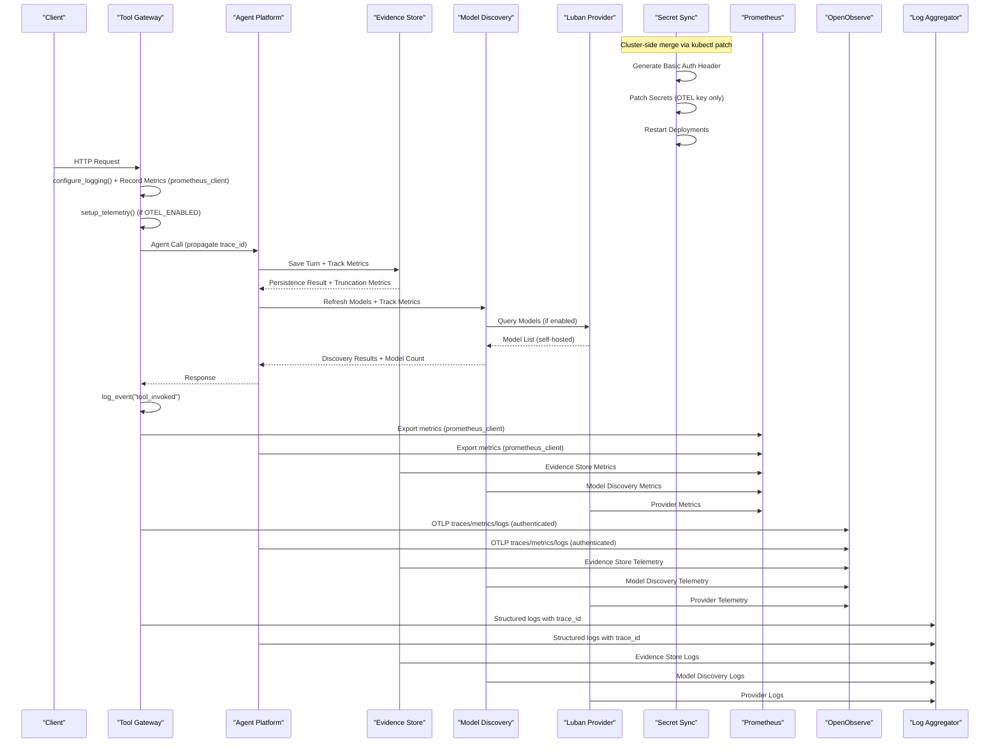

**Diagram sources**
- [agent-platform/src/agent_service/runtime_kernel.py:510-529](file://products/agent-platform/src/agent_service/runtime_kernel.py#L510-L529)
- [agent-platform/src/agent_service/services/model_discovery.py:272-289](file://products/agent-platform/src/agent_service/services/model_discovery.py#L272-L289)
- [agent-platform/src/agent_service/providers/luban.py:44-74](file://products/agent-platform/src/agent_service/providers/luban.py#L44-L74)
- [sync-otel-secrets.sh:73-90](file://shared/platform-ops/gitops/sync-otel-secrets.sh#L73-L90)

## Detailed Component Analysis

### **Enhanced** Multi-Model Runtime Monitoring Capabilities
- **Evidence Store Operations Monitoring**:
  - `evidence_store_writes_total` counter tracks successful and failed evidence persistence attempts
  - `evidence_frames_persisted_total` counter monitors frames persisted for session replay
  - `evidence_frames_truncated_total` counter with reason labels tracks truncation events
  - Truncation reasons include "entry_cap" for oversized payloads and "session_budget" for memory constraints
  - Backend selection monitoring via `agent_state_backend` gauge for memory/postgres backends
- **Model Discovery Lifecycle Monitoring**:
  - `agent_model_discovery_refreshes_total` counter tracks refresh cycles by provider and outcome
  - Refresh outcomes include "override", "disabled", "live", "memory", "cache", and "curated"
  - `agent_model_discovery_models` gauge shows current model counts per provider after discovery
  - Provider-specific monitoring for the new luban provider supporting self-hosted LLMs
- **Integration Points**:
  - Evidence store metrics integrated into runtime kernel during turn persistence
  - Model discovery metrics embedded in background refresh loops
  - Comprehensive error handling with fail-open behavior for non-critical failures
  - Luban provider integration with bearer-token authentication and mandatory base URL validation

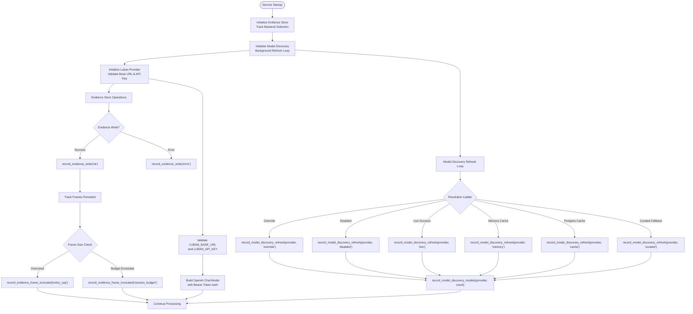

**Diagram sources**
- [agent-platform/src/agent_service/services/evidence_store.py:156-185](file://products/agent-platform/src/agent_service/services/evidence_store.py#L156-L185)
- [agent-platform/src/agent_service/services/model_discovery.py:233-280](file://products/agent-platform/src/agent_service/services/model_discovery.py#L233-L280)
- [agent-platform/src/agent_service/runtime_kernel.py:510-529](file://products/agent-platform/src/agent_service/runtime_kernel.py#L510-L529)
- [agent-platform/src/agent_service/providers/luban.py:36-74](file://products/agent-platform/src/agent_service/providers/luban.py#L36-L74)

**Section sources**
- [agent-platform/src/agent_service/core/metrics.py:156-209](file://products/agent-platform/src/agent_service/core/metrics.py#L156-L209)
- [agent-platform/src/agent_service/services/evidence_store.py:156-185](file://products/agent-platform/src/agent_service/services/evidence_store.py#L156-L185)
- [agent-platform/src/agent_service/services/model_discovery.py:27-30](file://products/agent-platform/src/agent_service/services/model_discovery.py#L27-L30)
- [agent-platform/src/agent_service/providers/luban.py:9-35](file://products/agent-platform/src/agent_service/providers/luban.py#L9-L35)

### **Enhanced** OTLP Credential Management and Secret Synchronization
- **Robust Authentication**: Eliminates 401 Unauthorized errors through cluster-side secret merging
- **Durable Provisioning**: Uses `kubectl patch --type merge` to touch only the OTEL key while preserving other secrets
- **Sibling Script Coordination**: All sibling secret sync scripts preserve existing OTLP headers across environment file regenerations
- **Automatic Recovery**: Fresh clusters require initial OpenObserve root credentials export; otherwise push fails open by design
- **Best-Effort Local Mirroring**: Maintains consistency between cluster secrets and local environment files

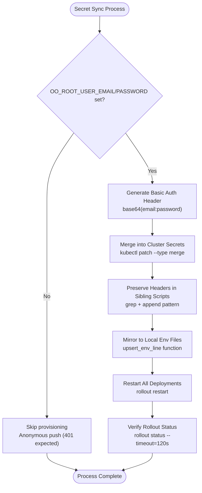

**Diagram sources**
- [sync-otel-secrets.sh:47-52](file://shared/platform-ops/gitops/sync-otel-secrets.sh#L47-L52)
- [sync-otel-secrets.sh:73-90](file://shared/platform-ops/gitops/sync-otel-secrets.sh#L73-L90)
- [sync-delegation-secrets.sh:48-57](file://shared/platform-ops/gitops/sync-delegation-secrets.sh#L48-L57)

**Section sources**
- [sync-otel-secrets.sh:1-162](file://shared/platform-ops/gitops/sync-otel-secrets.sh#L1-L162)
- [2026-08-21-durable-otlp-secret-provisioning.md:1-79](file://docs/agentic-aiops-platform/release-notes/2026-08-21-durable-otlp-secret-provisioning.md#L1-L79)

### **Updated** OpenTelemetry Push Pipeline Implementation
- **Comprehensive Coverage**: All six platform services implement identical OpenTelemetry push pipeline
- **Opt-in Configuration**: Enabled via OTEL_ENABLED environment variable (supports true/false/yes/on/1)
- **OTLP Protocol**: Uses HTTP/protobuf protocol compatible with OpenObserve ingest endpoints
- **Three Signal Types**: Exports traces, metrics, and logs to OpenObserve backend
- **Fail-Open Design**: Setup errors are logged but never raised into request path
- **Resource Context**: Service name propagated via OTEL_SERVICE_NAME or defaults to service metadata
- **Enhanced Authentication**: Robust OTLP header management prevents authentication failures
- **Authentication**: Supports OTEL_EXPORTER_OTLP_HEADERS for OpenObserve authentication with automatic credential synchronization

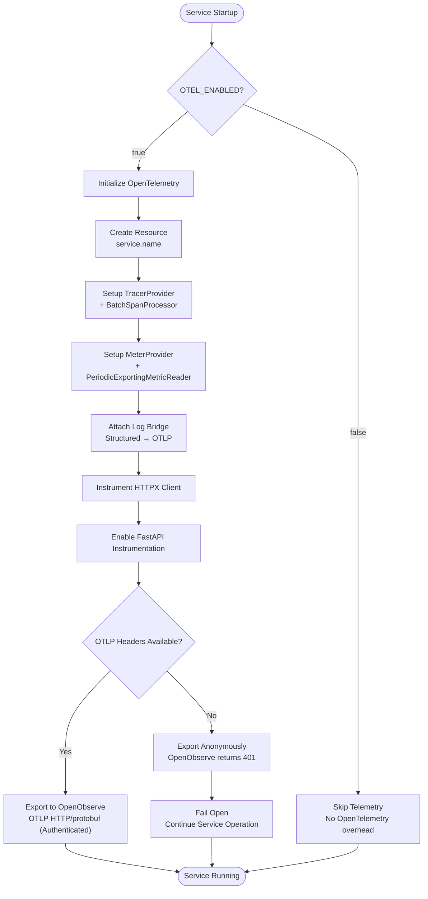

**Diagram sources**
- [agent-platform/src/agent_service/core/telemetry.py](file://products/agent-platform/src/agent_service/core/telemetry.py)
- [identity-broker/src/identity_service/core/telemetry.py](file://products/identity-broker/src/identity_service/core/telemetry.py)
- [tool-gateway/src/tool_gateway/core/telemetry.py](file://products/tool-gateway/src/tool_gateway/core/telemetry.py)

**Section sources**
- [agent-platform/src/agent_service/core/telemetry.py](file://products/agent-platform/src/agent_service/core/telemetry.py)
- [identity-broker/src/identity_service/core/telemetry.py](file://products/identity-broker/src/identity_service/core/telemetry.py)
- [tool-gateway/src/tool_gateway/core/telemetry.py](file://products/tool-gateway/src/tool_gateway/core/telemetry.py)
- [platform-gateway/src/platform_gateway/core/telemetry.py](file://products/platform-gateway/src/platform_gateway/core/telemetry.py)
- [audit-service/src/audit_service/core/telemetry.py](file://products/audit-service/src/audit_service/core/telemetry.py)
- [skills-hub/src/skills_hub/core/telemetry.py](file://products/skills_hub/core/telemetry.py)

### **Updated** Metrics Collection Strategy
- Each service defines metrics using direct prometheus_client implementation:
  - Custom RED middleware records HTTP requests with method, handler, and status labels
  - Histogram metrics track request duration with method and handler labels
  - Domain-specific counters for business logic (sessions, tokens, policy decisions)
  - Module-level metric objects prevent double-registration during testing
  - **New**: Multi-model runtime metrics for evidence store and model discovery operations
  - **New**: Provider-specific metrics for the new luban provider
- Metric naming follows shared conventions to ensure consistency across services
- Labels include service, route, method, status code, and operation where applicable
- Direct implementation avoids compatibility issues with pinned starlette versions

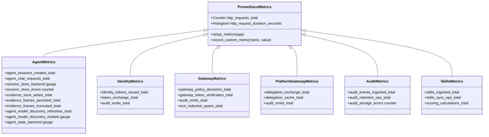

**Diagram sources**
- [agent-platform/src/agent_service/core/metrics.py:156-209](file://products/agent-platform/src/agent_service/core/metrics.py#L156-L209)
- [identity-broker/src/identity_service/core/metrics.py](file://products/identity-broker/src/identity_service/core/metrics.py)
- [tool-gateway/src/tool_gateway/core/metrics.py](file://products/tool-gateway/src/tool_gateway/core/metrics.py)
- [platform-gateway/src/platform_gateway/core/metrics.py](file://products/platform-gateway/src/platform_gateway/core/metrics.py)
- [audit-service/src/audit_service/core/metrics.py](file://products/audit-service/src/audit_service/core/metrics.py)
- [skills-hub/src/skills_hub/core/metrics.py](file://products/skills_hub/src/skills_hub/core/metrics.py)

**Section sources**
- [shared/shared-contracts/observability-conventions.md](file://shared/shared-contracts/observability-conventions.md)
- [agent-platform/src/agent_service/core/metrics.py](file://products/agent-platform/src/agent_service/core/metrics.py)
- [identity-broker/src/identity_service/core/metrics.py](file://products/identity-broker/src/identity_service/core/metrics.py)
- [tool-gateway/src/tool_gateway/core/metrics.py](file://products/tool-gateway/src/tool_gateway/core/metrics.py)
- [platform-gateway/src/platform_gateway/core/metrics.py](file://products/platform-gateway/src/platform_gateway/core/metrics.py)

### Enhanced Structured Logging Conventions
- All services now implement standardized logging configuration:
  - `configure_logging()` raises root logger from WARNING to INFO level at startup
  - LOG_LEVEL environment variable supports per-deployment overrides (default: INFO)
  - Audit trail events (http_request, tool_invoked, policy decisions) are captured at INFO level
  - Structured logs include consistent fields: service_name, version, timestamp, level, message, request_id, trace_id, user_id, operation
- **Updated** Log Bridge Integration:
  - When OpenTelemetry is enabled, structured logs are mirrored to OTLP pipeline
  - Log bridge attaches to root logger to capture all application logs
  - Trace context automatically attached to logs when spans are active
  - OpenTelemetry internal loggers detached to prevent recursion
- Log aggregation pipelines parse these fields to support filtering and correlation.
- Sensitive data is excluded from logs per security policies.

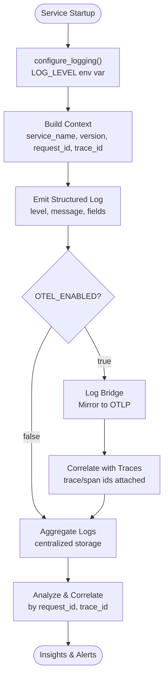

**Section sources**
- [shared/shared-contracts/observability-conventions.md](file://shared/shared-contracts/observability-conventions.md)
- [agent-platform/src/agent_service/core/observability.py](file://products/agent-platform/src/agent_service/core/observability.py)
- [identity-broker/src/identity_service/core/observability.py](file://products/identity-broker/src/identity_service/core/observability.py)
- [tool-gateway/src/tool_gateway/core/observability.py](file://products/tool-gateway/src/tool_gateway/core/observability.py)
- [platform-gateway/src/platform_gateway/core/observability.py](file://products/platform-gateway/src/platform_gateway/core/observability.py)

### **Enhanced** Distributed Tracing Implementation
- **Comprehensive Coverage**: All six services implement identical OpenTelemetry tracing
- **Trace Propagation**: W3C trace context propagated across service boundaries
- **Automatic Instrumentation**: FastAPI and HTTPX client calls automatically instrumented
- **Batch Processing**: Spans exported in batches for optimal performance
- **Resource Context**: Service metadata included in all telemetry signals
- **Current Trace ID**: Available via current_trace_id() function for correlation
- **Enhanced Authentication**: Reliable OTLP authentication prevents trace export failures

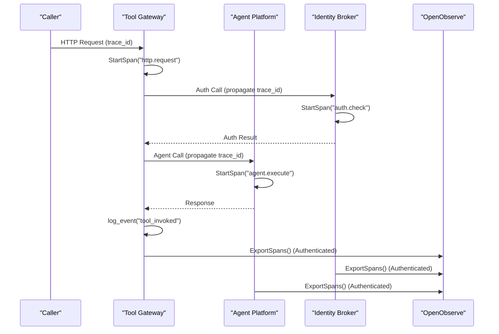

**Diagram sources**
- [agent-platform/src/agent_service/core/telemetry.py](file://products/agent-platform/src/agent_service/core/telemetry.py)
- [identity-broker/src/identity_service/core/telemetry.py](file://products/identity-broker/src/identity_service/core/telemetry.py)
- [tool-gateway/src/tool_gateway/core/telemetry.py](file://products/tool-gateway/src/tool_gateway/core/telemetry.py)
- [platform-gateway/src/platform_gateway/core/telemetry.py](file://products/platform-gateway/src/platform_gateway/core/telemetry.py)

**Section sources**
- [agent-platform/src/agent_service/core/telemetry.py](file://products/agent-platform/src/agent_service/core/telemetry.py)
- [identity-broker/src/identity_service/core/telemetry.py](file://products/identity-broker/src/identity_service/core/telemetry.py)
- [tool-gateway/src/tool_gateway/core/telemetry.py](file://products/tool-gateway/src/tool_gateway/core/telemetry.py)
- [platform-gateway/src/platform_gateway/core/telemetry.py](file://products/platform-gateway/src/platform_gateway/core/telemetry.py)
- [audit-service/src/audit_service/core/telemetry.py](file://products/audit-service/src/audit_service/core/telemetry.py)
- [skills-hub/src/skills_hub/core/telemetry.py](file://products/skills_hub/core/telemetry.py)

### Health Check Endpoints, Readiness Probes, and Liveness Probes
- Health endpoints return responses conforming to the shared health schema.
- Readiness probes verify dependencies (e.g., Redis, external APIs).
- Liveness probes confirm process health and internal state.
- Kubernetes deployments configure probe paths, intervals, and thresholds.

**Diagram sources**
- [shared/shared-contracts/schemas/health-response.schema.json](file://shared/shared-contracts/schemas/health-response.schema.json)
- [shared/platform-ops/gitops/dev-k8s/base/identity-broker/identity-service-deployment.yaml](file://shared/platform-ops/gitops/dev-k8s/base/identity-broker/identity-service-deployment.yaml)
- [shared/platform-ops/gitops/dev-k8s/base/tool-gateway/tool-gateway-deployment.yaml](file://shared/platform-ops/gitops/dev-k8s/base/tool-gateway/tool-gateway-deployment.yaml)
- [shared/platform-ops/gitops/dev-k8s/base/agent-platform/agent-service-deployment.yaml](file://shared/platform-ops/gitops/dev-k8s/base/agent-platform/agent-service-deployment.yaml)

**Section sources**
- [shared/shared-contracts/schemas/health-response.schema.json](file://shared/shared-contracts/schemas/health-response.schema.json)
- [shared/platform-ops/gitops/dev-k8s/base/identity-broker/identity-service-deployment.yaml](file://shared/platform-ops/gitops/dev-k8s/base/identity-broker/identity-service-deployment.yaml)
- [shared/platform-ops/gitops/dev-k8s/base/tool-gateway/tool-gateway-deployment.yaml](file://shared/platform-ops/gitops/dev-k8s/base/tool-gateway/tool-gateway-deployment.yaml)
- [shared/platform-ops/gitops/dev-k8s/base/agent-platform/agent-service-deployment.yaml](file://shared/platform-ops/gitops/dev-k8s/base/agent-platform/agent-service-deployment.yaml)

### Alerting Rules and Dashboard Templates
- Alerting rules are defined based on key metrics:
  - High error rates, latency spikes, resource exhaustion, dependency failures.
  - Tool invocation failures and redaction overflow events.
  - **New**: Evidence store write failures and excessive truncation events.
  - **New**: Model discovery refresh failures and unexpected model count changes.
  - **New**: Luban provider configuration validation failures.
- Dashboard templates visualize:
  - Request throughput, latency percentiles, error rates, trace spans, and system resources.
  - Tool invocation patterns and audit trail events.
  - **New**: Evidence store operation metrics and model discovery lifecycle visualization.
  - **New**: Multi-provider model availability and discovery status.
- Alerts trigger notifications and runbooks for incident response.

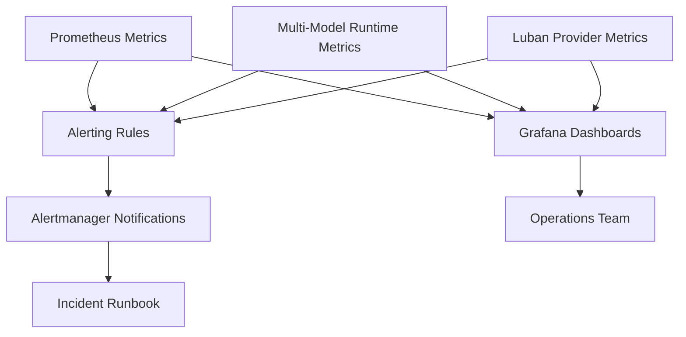

**Section sources**
- [SPEC-005-observability-baseline/spec.md](file://docs/specs/SPEC-005-observability-baseline/spec.md)

### Custom Metric Creation, Log Aggregation, and Trace Correlation
- Custom metrics should adhere to shared naming and labeling conventions.
- Logs must include correlation identifiers (request_id, trace_id) for cross-service correlation.
- Traces should be exported with consistent span names and attributes.
- Tool invocation events provide enhanced audit trail for debugging and compliance.
- **Enhanced** OpenObserve Integration:
  - All three signal types (traces, metrics, logs) exported to OpenObserve when enabled
  - Automatic correlation between logs and traces via trace context
  - Batch processing optimizes network usage and reduces overhead
  - **New**: Reliable authentication prevents telemetry export failures
  - **New**: Multi-model runtime metrics integrated into OpenObserve pipeline
  - **New**: Provider-specific metrics for enhanced observability

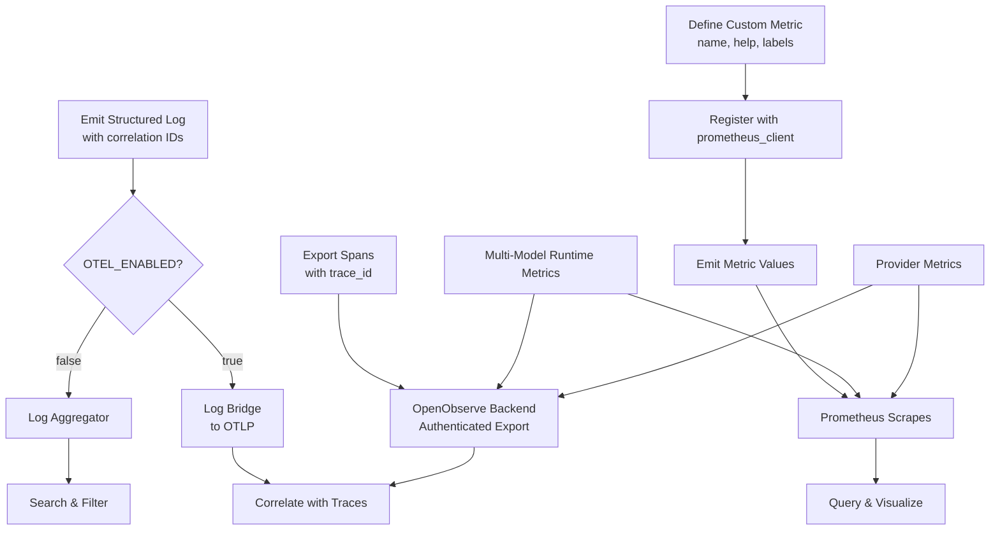

**Section sources**
- [shared/shared-contracts/observability-conventions.md](file://shared/shared-contracts/observability-conventions.md)

## Dependency Analysis
Observability components depend on shared contracts and Kubernetes configurations:
- Services rely on shared observability conventions for consistency
- Deployments configure probes and environment variables for observability
- Prometheus scrapes metrics from each service's /metrics endpoint
- All services call configure_logging() during startup for consistent log levels
- Direct prometheus_client implementation replaces prometheus-fastapi-instrumentator
- **Enhanced** OpenTelemetry dependencies:
  - Optional OpenTelemetry SDK components loaded only when OTEL_ENABLED is true
  - OTLP HTTP/protobuf exporters for traces, metrics, and logs
  - Automatic instrumentation for FastAPI and HTTPX client libraries
  - **New**: Multi-model runtime monitoring dependencies integrated into agent platform
  - **New**: Robust secret synchronization ensures credential availability
  - **New**: Luban provider dependencies for self-hosted LLM support

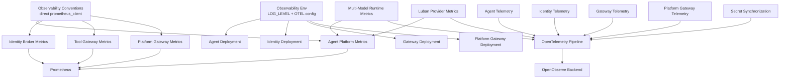

**Diagram sources**
- [agent-platform/src/agent_service/core/metrics.py:156-209](file://products/agent-platform/src/agent_service/core/metrics.py#L156-L209)
- [agent-platform/src/agent_service/providers/luban.py:9-35](file://products/agent-platform/src/agent_service/providers/luban.py#L9-L35)
- [sync-otel-secrets.sh:73-90](file://shared/platform-ops/gitops/sync-otel-secrets.sh#L73-L90)

**Section sources**
- [shared/shared-contracts/observability-conventions.md](file://shared/shared-contracts/observability-conventions.md)

## Performance Considerations
- Monitor latency percentiles and error rates to identify bottlenecks.
- Use histograms for request durations and gauge metrics for resource utilization.
- Correlate traces with metrics to pinpoint slow or failing operations.
- Capacity planning should be informed by trends in throughput, latency, and error rates.
- Tool invocation patterns can reveal performance issues in external integrations.
- Direct prometheus_client implementation provides better performance than external instrumentation libraries.
- **Enhanced** OpenTelemetry Performance:
  - Batch processing reduces network overhead for traces, metrics, and logs
  - Fail-open design prevents OpenObserve connectivity issues from impacting service performance
  - Optional feature allows disabling telemetry in high-performance environments
  - Resource-efficient implementation with minimal CPU and memory overhead
  - **New**: Reliable authentication eliminates retry overhead from failed authentication attempts
  - **New**: Multi-model runtime metrics have minimal performance impact due to efficient counter operations
  - **New**: Evidence store truncation metrics use bounded label cardinality to prevent memory growth
  - **New**: Luban provider metrics are lightweight and don't impact self-hosted LLM performance
- **New** Multi-Model Runtime Performance:
  - Evidence store operations are best-effort and never block chat turns
  - Model discovery runs asynchronously with configurable refresh intervals
  - Provider-specific metrics use efficient counter operations
  - Backpressure handling prevents cascading failures in multi-provider scenarios

## Troubleshooting Guide
- Use structured logs with correlation IDs to trace requests across services.
- Inspect Prometheus metrics for anomalies in latency, errors, and resource usage.
- Review traces to understand call chains and identify failures.
- Validate health endpoints and probe configurations when services are unhealthy.
- Check LOG_LEVEL environment variable if audit trail events are missing - uvicorn defaults to WARNING level which discards INFO-level structured events like http_request and tool_invoked.
- Investigate tool_invoked events for tool-specific issues and redaction problems.
- Verify that configure_logging() is called during service startup to ensure proper log level configuration.
- **Updated** If metrics are not appearing in Prometheus, verify that the /metrics endpoint is accessible and returning prometheus_client format data.
- **Updated** The direct prometheus_client implementation avoids compatibility issues with pinned starlette versions that affected prometheus-fastapi-instrumentator.
- **Enhanced** OpenTelemetry Troubleshooting:
  - Set OTEL_ENABLED=true to enable telemetry pipeline
  - Configure OTEL_EXPORTER_OTLP_ENDPOINT to point to OpenObserve
  - Check service logs for "otel telemetry enabled" confirmation message
  - **New**: Verify OTLP authentication headers via `kubectl get secret <secret-name> -o jsonpath='{.data.OTEL_EXPORTER_OTLP_HEADERS}'`
  - **New**: Test connectivity to OpenObserve endpoint independently
  - **New**: Monitor for "otel telemetry setup failed" messages indicating configuration issues
  - **New**: Use fail-open behavior to continue service operation even if OpenObserve is unavailable
  - **New**: Run `sync-otel-secrets.sh` to re-provision credentials if experiencing 401 Unauthorized errors
  - **New**: Check sibling script output for preserved OTLP header lines
  - **New**: Verify all seven deployment rollouts completed successfully after secret provisioning
- **New** Multi-Model Runtime Troubleshooting:
  - Check `evidence_store_writes_total{result="error"}` for evidence persistence failures
  - Monitor `evidence_frames_truncated_total{reason="entry_cap"}` for excessive payload truncation
  - Monitor `evidence_frames_truncated_total{reason="session_budget"}` for memory pressure issues
  - Verify `agent_model_discovery_refreshes_total{result="live"}` for successful live discovery
  - Check `agent_model_discovery_refreshes_total{result="curated"}` for fallback to curated models
  - Inspect `agent_model_discovery_models{provider}` gauge for unexpected model count changes
  - Investigate `agent_state_backend` gauge for evidence store backend selection issues
  - Check `agent_model_discovery_refreshes_total{provider="luban"}` for luban provider discovery
  - Verify LUBAN_BASE_URL and LUBAN_API_KEY configuration for luban provider
  - Monitor provider-specific metrics for self-hosted LLM connectivity issues
  - Check model discovery ladder outcomes for resolution failures

**Section sources**
- [shared/shared-contracts/observability-conventions.md](file://shared/shared-contracts/observability-conventions.md)
- [SPEC-005-observability-baseline/spec.md](file://docs/specs/SPEC-005-observability-baseline/spec.md)

## Conclusion
The Luban AIOps Platform implements a robust observability framework centered on direct prometheus_client implementation for metrics collection, enhanced structured logging with configurable log levels, and comprehensive distributed tracing with OpenObserve integration. The platform includes an opt-in OpenTelemetry push pipeline that exports traces, metrics, and logs to OpenObserve via OTLP HTTP/protobuf protocol, providing end-to-end observability across all six platform services. **Enhanced**: The platform now features robust monitoring capabilities for multi-model runtime including evidence store operations, model discovery lifecycle, and comprehensive observability for the new multi-model runtime features with enhanced provider-specific metrics for the luban provider. By using direct prometheus_client instead of prometheus-fastapi-instrumentator, the platform avoids compatibility issues with pinned starlette versions while maintaining equivalent functionality. The framework adheres to shared conventions, calls configure_logging() at startup, and configures Kubernetes probes appropriately, enabling operators to effectively monitor, diagnose, and respond to incidents while planning for future capacity needs. The enhanced audit trail with tool_invoked events and OpenObserve integration provides comprehensive visibility into tool execution patterns and potential security concerns. **New**: The multi-model runtime monitoring provides deep insights into evidence persistence, model discovery processes, and overall system health through comprehensive metrics collection, including specialized monitoring for the new luban provider supporting self-hosted LLMs.

## Appendices
- Reference specifications for observability baseline and conventions.
- Kubernetes deployment examples for probes and environment variables.
- Health response schema for consistent health checks.
- LOG_LEVEL environment variable configuration for different environments.
- **Updated** Migration notes from prometheus-fastapi-instrumentator to direct prometheus_client implementation.
- **Enhanced** OpenTelemetry configuration guide for OpenObserve integration including environment variables and authentication setup.
- **New**: Multi-model runtime monitoring guide including evidence store and model discovery metrics.
- **New**: Secret synchronization workflow documentation for OTLP credential management.
- **New**: Luban provider configuration guide for self-hosted LLM monitoring.

**Section sources**
- [SPEC-005-observability-baseline/spec.md](file://docs/specs/SPEC-005-observability-baseline/spec.md)
- [shared/shared-contracts/observability-conventions.md](file://shared/shared-contracts/observability-conventions.md)
- [shared/shared-contracts/schemas/health-response.schema.json](file://shared/shared-contracts/schemas/health-response.schema.json)
- [shared/platform-ops/gitops/dev-k8s/base/agent-platform/agent-service-deployment.yaml](file://shared/platform-ops/gitops/dev-k8s/base/agent-platform/agent-service-deployment.yaml)
- [shared/platform-ops/gitops/dev-k8s/base/identity-broker/identity-service-deployment.yaml](file://shared/platform-ops/gitops/dev-k8s/base/identity-broker/identity-service-deployment.yaml)
- [shared/platform-ops/gitops/dev-k8s/base/tool-gateway/tool-gateway-deployment.yaml](file://shared/platform-ops/gitops/dev-k8s/base/tool-gateway/tool-gateway-deployment.yaml)
- [configuration-reference.md:417-428](file://docs/guides/configuration-reference.md#L417-L428)
- [sync-otel-secrets.sh:1-162](file://shared/platform-ops/gitops/sync-otel-secrets.sh#L1-L162)
- [2026-08-24-multimodel-runtime-and-live-discovery.md:1-217](file://docs/agentic-aiops-platform/release-notes/2026-08-24-multimodel-runtime-and-live-discovery.md#L1-L217)