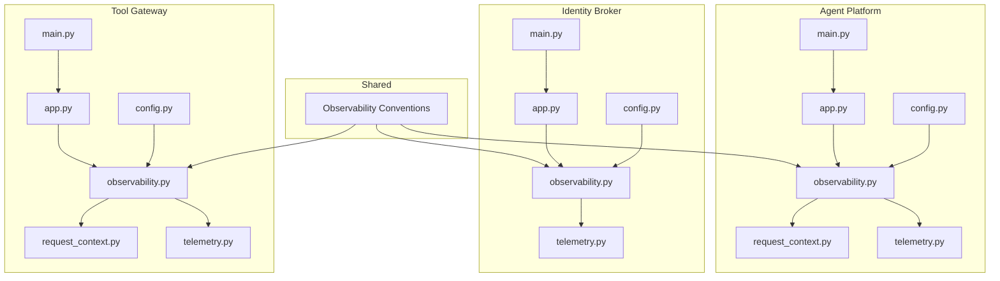
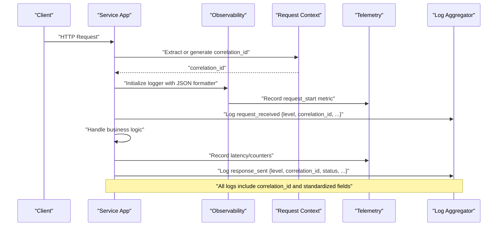
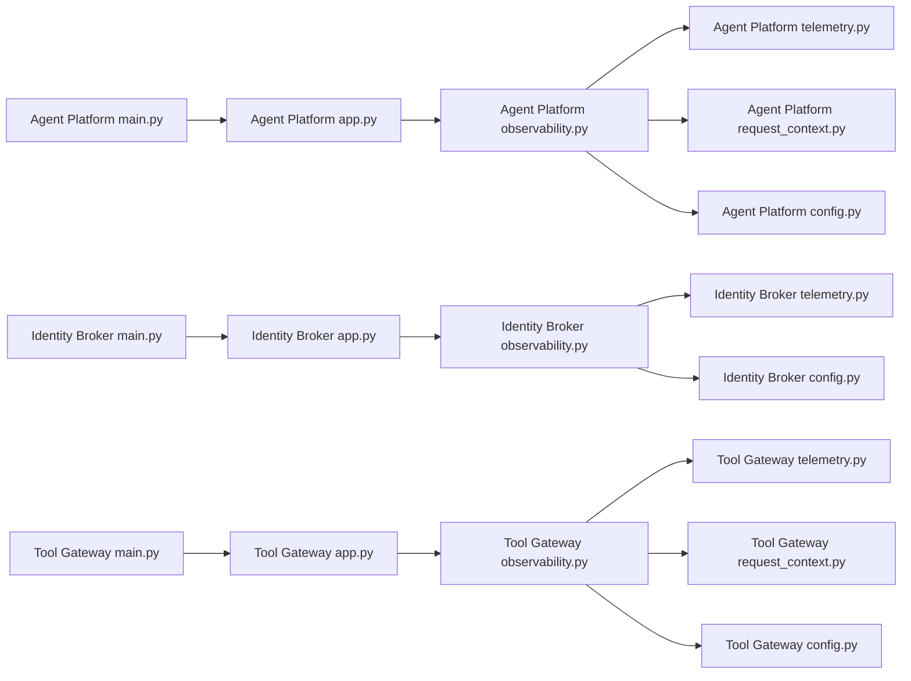

# Structured Logging Strategy

<cite>
**Referenced Files in This Document**
- [observability-conventions.md](file://shared/shared-contracts/observability-conventions.md)
- [agent-platform observability.py](file://products/agent-platform/src/agent_service/core/observability.py)
- [agent-platform telemetry.py](file://products/agent-platform/src/agent_service/core/telemetry.py)
- [agent-platform request_context.py](file://products/agent-platform/src/agent_service/core/request_context.py)
- [identity-broker observability.py](file://products/identity-broker/src/identity_service/core/observability.py)
- [identity-broker telemetry.py](file://products/identity-broker/src/identity_service/core/telemetry.py)
- [tool-gateway observability.py](file://products/tool-gateway/src/api_gateway/core/observability.py)
- [tool-gateway telemetry.py](file://products/tool-gateway/src/api_gateway/core/telemetry.py)
- [tool-gateway request_context.py](file://products/tool-gateway/src/api_gateway/core/request_context.py)
- [agent-platform app.py](file://products/agent-platform/src/agent_service/app.py)
- [identity-broker app.py](file://products/identity-broker/src/identity_service/app.py)
- [tool-gateway app.py](file://products/tool-gateway/src/api_gateway/app.py)
- [agent-platform main.py](file://products/agent-platform/src/agent_service/main.py)
- [identity-broker main.py](file://products/identity-broker/src/identity_service/main.py)
- [tool-gateway main.py](file://products/tool-gateway/src/api_gateway/main.py)
- [agent-platform config.py](file://products/agent-platform/src/agent_service/core/config.py)
- [identity-broker config.py](file://products/identity-broker/src/identity_service/core/config.py)
- [tool-gateway config.py](file://products/tool-gateway/src/api_gateway/core/config.py)
- [dev-k8s observability.env](file://shared/platform-ops/gitops/dev-k8s/base/shared/observability.env)
</cite>

## Table of Contents
1. [Introduction](#introduction)
2. [Project Structure](#project-structure)
3. [Core Components](#core-components)
4. [Architecture Overview](#architecture-overview)
5. [Detailed Component Analysis](#detailed-component-analysis)
6. [Dependency Analysis](#dependency-analysis)
7. [Performance Considerations](#performance-considerations)
8. [Troubleshooting Guide](#troubleshooting-guide)
9. [Conclusion](#conclusion)
10. [Appendices](#appendices)

## Introduction
This document defines the structured logging strategy for all platform services. It standardizes log format, correlation ID propagation, and log levels; explains how to implement JSON-formatted logs with contextual fields and sensitive data masking; and outlines aggregation, rotation, and storage considerations. It also provides examples of proper log statements, error logging patterns, and debugging techniques using structured logs.

## Project Structure
The platform implements consistent observability across services:
- Shared conventions define field names, formats, and correlation IDs.
- Each service includes a core observability module that initializes logging, metrics, and telemetry.
- Request context modules propagate correlation IDs across HTTP boundaries.
- Application entrypoints wire configuration and initialize observability at startup.

**Diagram sources**
- [observability-conventions.md](file://shared/shared-contracts/observability-conventions.md)
- [agent-platform observability.py](file://products/agent-platform/src/agent_service/core/observability.py)
- [agent-platform telemetry.py](file://products/agent-platform/src/agent_service/core/telemetry.py)
- [agent-platform request_context.py](file://products/agent-platform/src/agent_service/core/request_context.py)
- [agent-platform app.py](file://products/agent-platform/src/agent_service/app.py)
- [agent-platform main.py](file://products/agent-platform/src/agent_service/main.py)
- [agent-platform config.py](file://products/agent-platform/src/agent_service/core/config.py)
- [identity-broker observability.py](file://products/identity-broker/src/identity_service/core/observability.py)
- [identity-broker telemetry.py](file://products/identity-broker/src/identity_service/core/telemetry.py)
- [identity-broker app.py](file://products/identity-broker/src/identity_service/app.py)
- [identity-broker main.py](file://products/identity-broker/src/identity_service/main.py)
- [identity-broker config.py](file://products/identity-broker/src/identity_service/core/config.py)
- [tool-gateway observability.py](file://products/tool-gateway/src/api_gateway/core/observability.py)
- [tool-gateway telemetry.py](file://products/tool-gateway/src/api_gateway/core/telemetry.py)
- [tool-gateway request_context.py](file://products/tool-gateway/src/api_gateway/core/request_context.py)
- [tool-gateway app.py](file://products/tool-gateway/src/api_gateway/app.py)
- [tool-gateway main.py](file://products/tool-gateway/src/api_gateway/main.py)
- [tool-gateway config.py](file://products/tool-gateway/src/api_gateway/core/config.py)

**Section sources**
- [observability-conventions.md](file://shared/shared-contracts/observability-conventions.md)
- [agent-platform observability.py](file://products/agent-platform/src/agent_service/core/observability.py)
- [agent-platform telemetry.py](file://products/agent-platform/src/agent_service/core/telemetry.py)
- [agent-platform request_context.py](file://products/agent-platform/src/agent_service/core/request_context.py)
- [agent-platform app.py](file://products/agent-platform/src/agent_service/app.py)
- [agent-platform main.py](file://products/agent-platform/src/agent_service/main.py)
- [agent-platform config.py](file://products/agent-platform/src/agent_service/core/config.py)
- [identity-broker observability.py](file://products/identity-broker/src/identity_service/core/observability.py)
- [identity-broker telemetry.py](file://products/identity-broker/src/identity_service/core/telemetry.py)
- [identity-broker app.py](file://products/identity-broker/src/identity_service/app.py)
- [identity-broker main.py](file://products/identity-broker/src/identity_service/main.py)
- [identity-broker config.py](file://products/identity-broker/src/identity_service/core/config.py)
- [tool-gateway observability.py](file://products/tool-gateway/src/api_gateway/core/observability.py)
- [tool-gateway telemetry.py](file://products/tool-gateway/src/api_gateway/core/telemetry.py)
- [tool-gateway request_context.py](file://products/tool-gateway/src/api_gateway/core/request_context.py)
- [tool-gateway app.py](file://products/tool-gateway/src/api_gateway/app.py)
- [tool-gateway main.py](file://products/tool-gateway/src/api_gateway/main.py)
- [tool-gateway config.py](file://products/tool-gateway/src/api_gateway/core/config.py)

## Core Components
- Observability modules initialize structured logging, configure JSON formatting, and set up metrics and telemetry per service.
- Telemetry modules expose counters, histograms, and traces aligned with shared conventions.
- Request context modules manage correlation IDs and attach them to logs and outgoing requests.
- Configuration modules provide environment-driven settings for log levels, output destinations, and sampling rates.

Key responsibilities:
- Standardize log schema (fields, types, and naming).
- Ensure correlation IDs are present on every log line within a request scope.
- Mask sensitive data before emitting logs.
- Provide consistent APIs for info/warn/error logging with structured fields.

**Section sources**
- [agent-platform observability.py](file://products/agent-platform/src/agent_service/core/observability.py)
- [agent-platform telemetry.py](file://products/agent-platform/src/agent_service/core/telemetry.py)
- [agent-platform request_context.py](file://products/agent-platform/src/agent_service/core/request_context.py)
- [identity-broker observability.py](file://products/identity-broker/src/identity_service/core/observability.py)
- [identity-broker telemetry.py](file://products/identity-broker/src/identity_service/core/telemetry.py)
- [tool-gateway observability.py](file://products/tool-gateway/src/api_gateway/core/observability.py)
- [tool-gateway telemetry.py](file://products/tool-gateway/src/api_gateway/core/telemetry.py)
- [tool-gateway request_context.py](file://products/tool-gateway/src/api_gateway/core/request_context.py)
- [agent-platform config.py](file://products/agent-platform/src/agent_service/core/config.py)
- [identity-broker config.py](file://products/identity-broker/src/identity_service/core/config.py)
- [tool-gateway config.py](file://products/tool-gateway/src/api_gateway/core/config.py)

## Architecture Overview
Structured logging is initialized at process start and configured via environment variables. Correlation IDs flow through HTTP layers and are attached to all subsequent logs. Metrics and telemetry are emitted alongside logs for unified observability.

**Diagram sources**
- [agent-platform app.py](file://products/agent-platform/src/agent_service/app.py)
- [identity-broker app.py](file://products/identity-broker/src/identity_service/app.py)
- [tool-gateway app.py](file://products/tool-gateway/src/api_gateway/app.py)
- [agent-platform observability.py](file://products/agent-platform/src/agent_service/core/observability.py)
- [identity-broker observability.py](file://products/identity-broker/src/identity_service/core/observability.py)
- [tool-gateway observability.py](file://products/tool-gateway/src/api_gateway/core/observability.py)
- [agent-platform request_context.py](file://products/agent-platform/src/agent_service/core/request_context.py)
- [tool-gateway request_context.py](file://products/tool-gateway/src/api_gateway/core/request_context.py)

## Detailed Component Analysis

### Log Format Standards
- All logs must be JSON lines with consistent keys: timestamp, level, message, service_name, version, instance_id, correlation_id, and domain-specific fields.
- Use structured fields for entities (e.g., user_id, session_id, tool_name) rather than freeform text.
- Avoid embedding secrets or tokens; mask values using a dedicated sanitizer.

Implementation guidance:
- Configure JSON formatter in each service’s observability module.
- Enforce required fields via middleware or base logger wrapper.
- Validate log payloads in tests to ensure compliance.

**Section sources**
- [observability-conventions.md](file://shared/shared-contracts/observability-conventions.md)
- [agent-platform observability.py](file://products/agent-platform/src/agent_service/core/observability.py)
- [identity-broker observability.py](file://products/identity-broker/src/identity_service/core/observability.py)
- [tool-gateway observability.py](file://products/tool-gateway/src/api_gateway/core/observability.py)

### Correlation ID Propagation
- Generate a unique correlation_id at the gateway boundary if not present.
- Attach correlation_id to inbound requests and propagate it to downstream calls.
- Ensure every log emitted within the request scope includes correlation_id.

Propagation pattern:
- Extract from headers when available.
- Fallback to generation logic.
- Store in request-scoped context accessible by all handlers and services.

**Section sources**
- [agent-platform request_context.py](file://products/agent-platform/src/agent_service/core/request_context.py)
- [tool-gateway request_context.py](file://products/tool-gateway/src/api_gateway/core/request_context.py)
- [observability-conventions.md](file://shared/shared-contracts/observability-conventions.md)

### Log Level Conventions
- DEBUG: Verbose internal state, useful during development.
- INFO: Normal operational events (requests, job starts/completions).
- WARN: Recoverable issues or unexpected but non-fatal conditions.
- ERROR: Failures requiring attention; include error codes and context.
- CRITICAL: System-level failures impacting availability.

Guidelines:
- Do not use DEBUG in production unless explicitly enabled.
- Always include correlation_id and relevant entity identifiers on ERROR and WARN.
- Keep messages concise; put details in structured fields.

**Section sources**
- [observability-conventions.md](file://shared/shared-contracts/observability-conventions.md)

### Implementing Structured Logging with JSON
- Initialize a JSON logger at service startup via the observability module.
- Use a base logger API that accepts keyword arguments for structured fields.
- Wrap HTTP handlers to inject correlation_id and request metadata automatically.

Example usage pattern:
- Log request received with method, path, and correlation_id.
- Log business steps with action, target, and outcome fields.
- Log errors with exception type, stack trace reference, and remediation hint.

**Section sources**
- [agent-platform observability.py](file://products/agent-platform/src/agent_service/core/observability.py)
- [identity-broker observability.py](file://products/identity-broker/src/identity_service/core/observability.py)
- [tool-gateway observability.py](file://products/tool-gateway/src/api_gateway/core/observability.py)

### Contextual Information Inclusion
- Include service_name, version, and instance_id from configuration.
- Add request-scoped fields such as correlation_id, client_ip, and user_agent where appropriate.
- For background jobs, include job_id, queue_name, and retry_count.

Best practices:
- Centralize common fields in the logger initialization.
- Use context managers to add temporary fields for specific operations.

**Section sources**
- [agent-platform config.py](file://products/agent-platform/src/agent_service/core/config.py)
- [identity-broker config.py](file://products/identity-broker/src/identity_service/core/config.py)
- [tool-gateway config.py](file://products/tool-gateway/src/api_gateway/core/config.py)

### Sensitive Data Masking
- Define a list of sensitive keys (passwords, tokens, secrets).
- Sanitize log records before emission to redact or hash sensitive values.
- Apply masking at the logger level to avoid ad-hoc handling.

Recommendations:
- Use allowlists for safe fields instead of blocklists.
- Validate masking rules in unit tests.

**Section sources**
- [observability-conventions.md](file://shared/shared-contracts/observability-conventions.md)

### Error Logging Patterns
- Capture exception type, message, and optional stack trace reference.
- Include correlation_id and operation context.
- Emit ERROR level with actionable hints (e.g., “check upstream timeout”).

Patterns:
- Try/catch around external calls with structured error logs.
- Re-raise after logging to preserve call stacks.

**Section sources**
- [observability-conventions.md](file://shared/shared-contracts/observability-conventions.md)

### Debugging Techniques Using Structured Logs
- Filter logs by correlation_id to reconstruct request flows across services.
- Use structured fields to query metrics and logs together.
- Enable DEBUG temporarily for problematic scenarios and aggregate results.

Operational tips:
- Export correlation_id from clients to trace end-to-end.
- Use log sampling for high-volume DEBUG logs.

**Section sources**
- [observability-conventions.md](file://shared/shared-contracts/observability-conventions.md)

### Example Log Statements
- Request lifecycle:
  - Log request_received with method, path, correlation_id.
  - Log request_completed with status_code, duration_ms, correlation_id.
- Business operations:
  - Log action_started with actor, target, correlation_id.
  - Log action_completed with result, correlation_id.
- Errors:
  - Log error_occurred with error_code, message, correlation_id, remediation_hint.

Note: Refer to service observability modules for the exact API surface used to emit these logs.

**Section sources**
- [agent-platform observability.py](file://products/agent-platform/src/agent_service/core/observability.py)
- [identity-broker observability.py](file://products/identity-broker/src/identity_service/core/observability.py)
- [tool-gateway observability.py](file://products/tool-gateway/src/api_gateway/core/observability.py)

## Dependency Analysis
Each service depends on its own observability and telemetry modules, which are initialized by the application entrypoint and configured via environment variables.

**Diagram sources**
- [agent-platform main.py](file://products/agent-platform/src/agent_service/main.py)
- [agent-platform app.py](file://products/agent-platform/src/agent_service/app.py)
- [agent-platform observability.py](file://products/agent-platform/src/agent_service/core/observability.py)
- [agent-platform telemetry.py](file://products/agent-platform/src/agent_service/core/telemetry.py)
- [agent-platform request_context.py](file://products/agent-platform/src/agent_service/core/request_context.py)
- [agent-platform config.py](file://products/agent-platform/src/agent_service/core/config.py)
- [identity-broker main.py](file://products/identity-broker/src/identity_service/main.py)
- [identity-broker app.py](file://products/identity-broker/src/identity_service/app.py)
- [identity-broker observability.py](file://products/identity-broker/src/identity_service/core/observability.py)
- [identity-broker telemetry.py](file://products/identity-broker/src/identity_service/core/telemetry.py)
- [identity-broker config.py](file://products/identity-broker/src/identity_service/core/config.py)
- [tool-gateway main.py](file://products/tool-gateway/src/api_gateway/main.py)
- [tool-gateway app.py](file://products/tool-gateway/src/api_gateway/app.py)
- [tool-gateway observability.py](file://products/tool-gateway/src/api_gateway/core/observability.py)
- [tool-gateway telemetry.py](file://products/tool-gateway/src/api_gateway/core/telemetry.py)
- [tool-gateway request_context.py](file://products/tool-gateway/src/api_gateway/core/request_context.py)
- [tool-gateway config.py](file://products/tool-gateway/src/api_gateway/core/config.py)

**Section sources**
- [agent-platform main.py](file://products/agent-platform/src/agent_service/main.py)
- [agent-platform app.py](file://products/agent-platform/src/agent_service/app.py)
- [agent-platform observability.py](file://products/agent-platform/src/agent_service/core/observability.py)
- [agent-platform telemetry.py](file://products/agent-platform/src/agent_service/core/telemetry.py)
- [agent-platform request_context.py](file://products/agent-platform/src/agent_service/core/request_context.py)
- [agent-platform config.py](file://products/agent-platform/src/agent_service/core/config.py)
- [identity-broker main.py](file://products/identity-broker/src/identity_service/main.py)
- [identity-broker app.py](file://products/identity-broker/src/identity_service/app.py)
- [identity-broker observability.py](file://products/identity-broker/src/identity_service/core/observability.py)
- [identity-broker telemetry.py](file://products/identity-broker/src/identity_service/core/telemetry.py)
- [identity-broker config.py](file://products/identity-broker/src/identity_service/core/config.py)
- [tool-gateway main.py](file://products/tool-gateway/src/api_gateway/main.py)
- [tool-gateway app.py](file://products/tool-gateway/src/api_gateway/app.py)
- [tool-gateway observability.py](file://products/tool-gateway/src/api_gateway/core/observability.py)
- [tool-gateway telemetry.py](file://products/tool-gateway/src/api_gateway/core/telemetry.py)
- [tool-gateway request_context.py](file://products/tool-gateway/src/api_gateway/core/request_context.py)
- [tool-gateway config.py](file://products/tool-gateway/src/api_gateway/core/config.py)

## Performance Considerations
- Prefer structured fields over string concatenation to reduce CPU overhead.
- Use sampling for high-frequency DEBUG logs in production.
- Batch log emissions where supported by the logging backend.
- Avoid synchronous I/O in hot paths; rely on async-friendly loggers.

[No sources needed since this section provides general guidance]

## Troubleshooting Guide
Common issues and resolutions:
- Missing correlation_id:
  - Verify extraction at the gateway and propagation in request context.
  - Ensure middleware attaches correlation_id to all logs.
- Unstructured logs:
  - Confirm JSON formatter is active and no legacy print statements exist.
- Sensitive data exposure:
  - Check masking rules and update allowlists for new fields.
- High log volume:
  - Adjust log levels and enable sampling for DEBUG/INFO.

Operational checks:
- Validate log schema with automated tests.
- Inspect environment variables for correct configuration.

**Section sources**
- [observability-conventions.md](file://shared/shared-contracts/observability-conventions.md)
- [agent-platform observability.py](file://products/agent-platform/src/agent_service/core/observability.py)
- [identity-broker observability.py](file://products/identity-broker/src/identity_service/core/observability.py)
- [tool-gateway observability.py](file://products/tool-gateway/src/api_gateway/core/observability.py)

## Conclusion
Adopting a consistent structured logging strategy improves observability, simplifies debugging, and enables reliable correlation across services. By enforcing JSON formatting, propagating correlation IDs, standardizing log levels, and masking sensitive data, teams can build robust monitoring and incident response workflows.

[No sources needed since this section summarizes without analyzing specific files]

## Appendices

### Log Aggregation Strategies
- Forward JSON logs to centralized collectors (e.g., Fluent Bit, Filebeat).
- Use structured parsers to index key fields for fast queries.
- Retain raw logs for audit while indexing essential fields.

[No sources needed since this section provides general guidance]

### Log Rotation Policies
- Rotate based on size and time (e.g., daily, max size).
- Compress rotated files and retain for compliance periods.
- Ensure atomic writes to prevent partial log lines.

[No sources needed since this section provides general guidance]

### Storage Considerations
- Separate indexes for different log levels to optimize query performance.
- Partition by service and date for efficient retention and cleanup.
- Encrypt logs at rest and in transit.

[No sources needed since this section provides general guidance]

### Environment Variables for Observability
- Review observability configuration in shared environment files to align log levels, outputs, and sampling.

**Section sources**
- [dev-k8s observability.env](file://shared/platform-ops/gitops/dev-k8s/base/shared/observability.env)