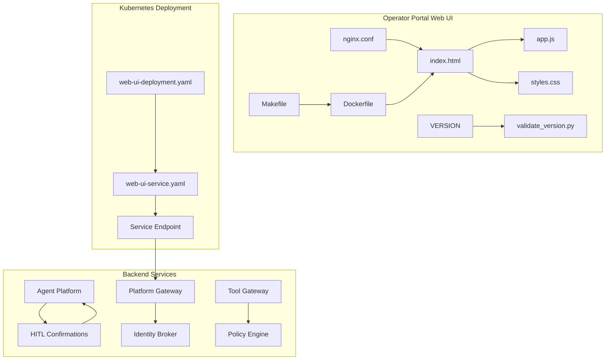
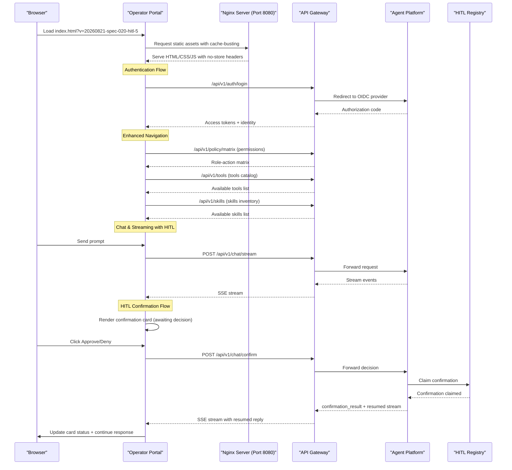

# Operator Portal

<cite>
**Referenced Files in This Document**
- [index.html](file://products/operator-portal/web-ui/index.html)
- [app.js](file://products/operator-portal/web-ui/app.js)
- [styles.css](file://products/operator-portal/web-ui/styles.css)
- [nginx.conf](file://products/operator-portal/nginx.conf)
- [Dockerfile](file://products/operator-portal/Dockerfile)
- [Makefile](file://products/operator-portal/Makefile)
- [README.md](file://products/operator-portal/README.md)
- [web-ui-deployment.yaml](file://shared/platform-ops/gitops/dev-k8s/base/operator-portal/web-ui-deployment.yaml)
- [web-ui-service.yaml](file://shared/platform-ops/gitops/dev-k8s/base/operator-portal/web-ui-service.yaml)
- [image.mk](file://mk/image.mk)
- [VERSION](file://VERSION)
- [validate_version.py](file://shared/shared-contracts/scripts/validate_version.py)
- [hitl_confirmations.py](file://products/agent-platform/src/agent_service/services/hitl_confirmations.py)
- [2026-08-21-hitl-confirmation-bridging.md](file://docs/agentic-aiops-platform/release-notes/2026-08-21-hitl-confirmation-bridging.md)
</cite>

## Update Summary
**Changes Made**
- Added comprehensive HITL (Human-in-the-Loop) confirmation card component with Approve/Deny buttons
- Implemented role-based visibility for confirmation controls based on user permissions
- Integrated stream continuation handling for pending tool approvals with SSE streaming
- Enhanced evidence system with inline approval surfaces for ASK-gated tool executions
- Updated version to v0.6.0 with enhanced platform ecosystem consistency

## Table of Contents
1. [Introduction](#introduction)
2. [Project Structure](#project-structure)
3. [Core Components](#core-components)
4. [Architecture Overview](#architecture-overview)
5. [Detailed Component Analysis](#detailed-component-analysis)
6. [Enhanced Navigation System](#enhanced-navigation-system)
7. [Role-Gated Audit Trail System](#role-gated-audit-trail-system)
8. [HITL Confirmation Card System](#hitl-confirmation-card-system)
9. [Authentication and Security](#authentication-and-security)
10. [Markdown Rendering System](#markdown-rendering-interface)
11. [Real-time Streaming Interface](#real-time-streaming-interface)
12. [Skills Integration and Cited Guidance](#skills-integration-and-cited-guidance)
13. [Permission Matrix and Workspace Resources](#permission-matrix-and-workspace-resources)
14. [Deployment Guide](#deployment-guide)
15. [UI Customization](#ui-customization)
16. [Accessibility Features](#accessibility-features)
17. [Browser Compatibility](#browser-compatibility)
18. [Troubleshooting Guide](#troubleshooting-guide)
19. [Conclusion](#conclusion)

## Introduction

The Operator Portal is a modern web-based administrative interface designed for platform administration and monitoring within the Luban AIOPS ecosystem. Built with vanilla JavaScript and HTML/CSS, it provides operators with a sophisticated two-column shell interface featuring a persistent sidebar for navigation and a main content area for interactive operations. The portal serves as a centralized control plane for platform administrators, offering real-time visibility into system status through an interactive chat interface, comprehensive evidence panels for tool execution tracking, configuration management capabilities, and administrative functions necessary for maintaining the AI-powered agent platform infrastructure.

**Updated** The portal has been updated to version 0.6.0 with comprehensive HITL (Human-in-the-Loop) confirmation bridging capabilities. The new inline confirmation card component allows operators to approve or deny ASK-gated tool executions directly within the chat interface, with role-based visibility controls ensuring only authorized users can make decisions. The platform maintains enhanced version consistency across the ecosystem with improved cache-busting mechanisms and comprehensive skills integration with "Cited guidance" chips for operational traceability.

## Project Structure

The Operator Portal follows a clean, modular architecture with separation of concerns between presentation layer (HTML), styling (CSS), and application logic (JavaScript). The project structure is organized as follows:



**Diagram sources**
- [index.html](file://products/operator-portal/web-ui/index.html)
- [app.js](file://products/operator-portal/web-ui/app.js)
- [nginx.conf](file://products/operator-portal/nginx.conf)
- [web-ui-deployment.yaml](file://shared/platform-ops/gitops/dev-k8s/base/operator-portal/web-ui-deployment.yaml)
- [hitl_confirmations.py](file://products/agent-platform/src/agent_service/services/hitl_confirmations.py)
- [VERSION](file://VERSION)
- [validate_version.py](file://shared/shared-contracts/scripts/validate_version.py)

**Section sources**
- [index.html](file://products/operator-portal/web-ui/index.html)
- [app.js](file://products/operator-portal/web-ui/app.js)
- [styles.css](file://products/operator-portal/web-ui/styles.css)

## Core Components

The Operator Portal consists of several key components that work together to provide a comprehensive administrative interface:

### Frontend Architecture
- **Two-Column Shell Layout**: Professional interface with persistent sidebar and main content area
- **Enhanced Sectioned Navigation**: Organized navigation with Chat, Control, and Workspace sections
- **Chat-Based Interface**: Modern single-page application with real-time streaming responses
- **Inline Per-Turn Evidence System**: Sophisticated turn-scoped evidence grouping with collapsible groups rendered directly after agent responses
- **HITL Confirmation Cards**: Inline approval surfaces for ASK-gated tool executions with Approve/Deny buttons
- **Skills Integration**: Enhanced evidence cards with "Cited guidance" chips displaying matched skills when skills.* tools succeed
- **Authentication System**: OIDC integration with automatic token refresh and session management
- **Markdown Renderer**: Comprehensive text formatting with syntax highlighting support
- **Responsive Design**: Dark theme with mobile-first approach and accessibility features

### Backend Integration
- **Streaming API Client**: Real-time communication with backend services via Server-Sent Events
- **HITL Confirmation Bridge**: Seamless integration with agent-platform confirmation registry for pending tool approvals
- **Authentication Handler**: Seamless integration with identity broker for secure access
- **Session Management**: Persistent session handling with automatic refresh mechanisms
- **Error Handling**: Comprehensive error management with user-friendly feedback

### Enhanced User Interface
- **Persistent Sidebar**: Branding, identity management, and function navigation
- **User Card System**: Avatar display with initials, username badge, and role information
- **Role-Based Navigation**: Conditional visibility of audit trail based on user roles
- **Mobile Drawer**: Off-canvas navigation for narrow screens with hamburger menu
- **Settings & Debug Panel**: Configuration management and debugging tools

### HITL Confirmation System
- **Inline Approval Cards**: Warning-toned bordered cards for pending tool confirmations
- **Role-Based Controls**: Approve/Deny buttons visible only to authorized roles (platform-admin, approver, operator, developer)
- **Stream Continuation**: Automatic resumption of parked replies upon decision with SSE streaming
- **Evidence Integration**: Seamless integration with existing evidence card system
- **Status Management**: Visual indicators showing awaiting decision, approved, denied, or expired states

### Permission and Resource Discovery
- **Live Permission Matrix**: Real-time display of role-action permissions from policy bundle
- **Tools Catalog**: Read-only inventory of available tools with filtering capabilities
- **Skills Inventory**: Browseable catalog of available skills with source and tag filtering
- **Workspace Resources**: Centralized view of platform resources and capabilities

### Version Management and Cache Busting
- **Version Synchronization**: PLATFORM_VERSION constant synchronized with root VERSION file
- **Cache-Busting Mechanism**: Query parameter versioning (v=20260821-spec-020-hitl-5) ensures proper client-side caching
- **Validation System**: Automated version consistency checks across all platform components
- **Deployment Consistency**: Coordinated versioning across all platform services

**Updated** The interface now includes comprehensive HITL confirmation bridging with inline approval cards that allow operators to approve or deny ASK-gated tool executions directly within the chat interface. The system supports role-based visibility controls, stream continuation handling, and seamless integration with the existing evidence system. The platform has been updated to version 0.6.0 with enhanced version consistency across the platform ecosystem.

**Section sources**
- [app.js](file://products/operator-portal/web-ui/app.js)
- [Dockerfile](file://products/operator-portal/Dockerfile)
- [web-ui-deployment.yaml](file://shared/platform-ops/gitops/dev-k8s/base/operator-portal/web-ui-deployment.yaml)

## Architecture Overview

The Operator Portal follows a modern single-page application (SPA) architecture built with vanilla JavaScript, providing a responsive and interactive user experience without relying on heavy frameworks.



**Diagram sources**
- [index.html](file://products/operator-portal/web-ui/index.html)
- [app.js](file://products/operator-portal/web-ui/app.js)
- [nginx.conf](file://products/operator-portal/nginx.conf)
- [hitl_confirmations.py](file://products/agent-platform/src/agent_service/services/hitl_confirmations.py)

The architecture emphasizes simplicity, performance, and maintainability while providing enterprise-grade functionality for platform operations. The HITL confirmation bridge enables human oversight of automated tool executions while maintaining seamless user experience through inline approval interfaces.

## Detailed Component Analysis

### HTML Structure and Layout

The main HTML document defines the semantic structure of the operator portal with a professional two-column shell layout:

- **App Shell**: Grid-based layout with fixed-width sidebar and flexible main content area
- **Sidebar**: Persistent navigation panel with branding, user identity, and function list
- **Main Area**: Content area displaying one function view at a time (chat, settings, audit)
- **Mobile Top Bar**: Hamburger menu and title for narrow screen navigation
- **View Sections**: Separate sections for chat workspace, settings/debug panel, and audit trail

### JavaScript Application Logic

The JavaScript application implements core functionality including:

#### Enhanced Sectioned Navigation System
- **Section Organization**: Navigation items grouped into logical sections (Control, Workspace)
- **Automatic Section Visibility**: Sections hide automatically when all entries are hidden
- **View Management**: Show/hide different views while preserving state and history
- **Sidebar Controls**: Mobile drawer toggle with backdrop and keyboard navigation
- **Active State Management**: Visual indicators for current active view
- **Role-Based Access Control**: Conditional visibility of audit trail based on user roles

#### Enhanced User Identity System
- **User Card Display**: Avatar with initials, username badge, and role information
- **Popup Menu**: User-related actions and information in dropdown menu
- **Login/Logout Actions**: Icon-only buttons with tooltip support
- **Session Persistence**: Secure storage of authentication state in sessionStorage

#### Chat Interface Management
- **Real-time Streaming**: Server-Sent Events for live response updates
- **Message History**: Persistent conversation display with user and agent messages
- **Sticky Smart-scroll**: Intelligent scrolling that respects user reading position during streaming
- **Input Handling**: Keyboard shortcuts and form validation

#### HITL Confirmation Card System
- **Inline Approval Cards**: Warning-toned bordered cards displayed for ASK-gated tool executions
- **Role-Based Controls**: Approve/Deny buttons visible only to authorized roles (platform-admin, approver, operator, developer)
- **Stream Continuation**: Automatic resumption of parked replies upon decision with SSE streaming
- **Evidence Integration**: Seamless integration with existing evidence card system
- **Status Management**: Visual indicators showing awaiting decision, approved, denied, or expired states
- **Confirmation Registry**: In-memory per-process registry managing pending confirmations with TTL expiry

#### Inline Per-Turn Evidence System
- **Per-turn Evidence Grouping**: Organizes evidence by conversation turns with collapsible groups rendered inline after agent responses
- **Turn-based Organization**: Uses currentTurn object to track active conversation turn with anchor, group, body, summaryLine, counts, entries, and cardMap properties
- **Evidence Turn Management**: Lazy creation of evidence groups on first tool frame with ensureCurrentTurn function
- **Live Status Metrics**: Real-time counters tracking pending, success, error, and denied states with formatCounts function
- **Per-turn Audit Cards**: Comprehensive aggregation of tool executions with metadata display in tabular format
- **Evidence Summary**: Dynamic summary line showing current turn statistics with collapsible details element

#### Skills Integration and Cited Guidance
- **Cited Skills Detection**: Automatic detection of skills.* tool success responses with matched skills data
- **Chip Generation**: Creation of clickable chip elements displaying skill titles and namespaced IDs
- **Evidence Integration**: Seamless integration with existing evidence card system
- **Truncation Handling**: Smart filtering to avoid displaying partial or truncated skill citations
- **Visual Styling**: Professional chip design with proper spacing, borders, and typography

#### Durable Audit Trail System
- **Role-Gated Access**: Audit trail view hidden unless user has auditor or platform-admin roles
- **Filtering Capabilities**: Username, event type, service, and date range filters
- **Pagination Support**: Cursor-based pagination with load more functionality
- **Event Detail View**: Expandable rows showing full event envelope JSON

**Updated** The interface now includes comprehensive HITL confirmation bridging with inline approval cards that allow operators to approve or deny ASK-gated tool executions directly within the chat interface. The system supports role-based visibility controls, stream continuation handling, and seamless integration with the existing evidence system. The platform has been updated to version 0.6.0 with enhanced version consistency across the platform ecosystem.

**Section sources**
- [app.js](file://products/operator-portal/web-ui/app.js)

### CSS Styling System

The styling system provides a comprehensive design foundation with:

#### Design Tokens
- **Dark Theme**: Modern color palette optimized for extended use
- **Typography Scale**: Inter font family with responsive sizing
- **Spacing System**: Consistent margins and padding throughout
- **Animation Effects**: Smooth transitions and loading indicators

#### Two-Column Layout System
- **Grid-Based Shell**: Fixed 230px sidebar with flexible main content area
- **Responsive Breakpoints**: Mobile-first approach with off-canvas drawer below 800px
- **Sidebar Styling**: Professional navigation with hover effects and active states
- **Main Area**: Full-height content area with proper overflow handling

#### Enhanced Navigation Styling
- **Section Labels**: Muted, uppercase labels for navigation sections with proper spacing
- **Section Containers**: Flexbox-based layout with automatic hiding when all entries are hidden
- **Navigation Items**: Clean button styling with active state indicators and hover effects
- **Stream Indicator**: Pulsing dot showing when chat streaming is active

#### HITL Confirmation Card Styling
- **Warning Border**: Yellow border indicating pending decision required
- **Locked State**: Border changes to standard when confirmation is resolved
- **Action Buttons**: Green approve button and red deny button with hover effects
- **Status Messages**: Clear status indicators for awaiting decision, approving/denying, and final states
- **Call Details**: Collapsible sections showing tool parameters for review

#### Component Styles
- **User Card**: Avatar display with initials, username badge, and role information
- **Navigation Items**: Clean button styling with active state indicators
- **Chat Messages**: Distinct styling for user and agent messages
- **Inline Evidence Groups**: Professional collapsible interface with native browser details element behavior
- **Cited Guidance Chips**: Specialized styling for skill citation chips with proper typography and spacing
- **Audit Trail Table**: Responsive table with sticky headers and expandable detail rows
- **Settings Panel**: Grid-based layout for configuration options
- **Mobile Drawer**: Slide-in navigation with backdrop overlay

#### Accessibility Features
- **High Contrast**: WCAG 2.1 AA compliant color ratios
- **Keyboard Navigation**: Full keyboard operability with visible focus indicators
- **Screen Reader Support**: Semantic HTML and ARIA labels
- **Reduced Motion**: Respects user motion preferences

**Section sources**
- [styles.css](file://products/operator-portal/web-ui/styles.css)

## Enhanced Navigation System

The Operator Portal features a sophisticated enhanced navigation system with sectioned organization and role-based visibility controls.

### Sectioned Navigation Architecture

The navigation system organizes functions into logical sections with automatic visibility management:

#### Control Section
- **Incidents**: Incident triage and management interface
- **Audit Trail**: Durable audit event inspection with role-based access
- **Permissions**: Live permission matrix display showing role-action relationships

#### Workspace Section  
- **Tools**: Read-only catalog of available tools with filtering capabilities
- **Skills**: Browseable inventory of available skills with source and tag filtering
- **Settings & Debug**: Configuration management and debugging tools

#### Automatic Section Visibility
- **Dynamic Hiding**: Sections automatically hide when all their entries are hidden due to role restrictions
- **Role-Based Filtering**: Individual navigation items hidden based on user roles and authentication status
- **Server-Side Enforcement**: All navigation items enforce server-side permissions on every request

### Navigation Implementation Details

The enhanced navigation system uses a structured approach with clear separation of concerns:

#### Section Definition
```javascript
const NAV_SECTIONS = {
  control: {
    container: document.querySelector("#nav-section-control"),
    entries: ["incidents", "audit", "permissions"]
  },
  workspace: {
    container: document.querySelector("#nav-section-workspace"),
    entries: ["tools", "skills", "settings"]
  }
};
```

#### Visibility Management
- **Section Synchronization**: `syncNavSectionVisibility()` function manages automatic section hiding
- **Entry-Level Control**: Individual navigation items controlled by role checks and authentication status
- **State Preservation**: Navigation state preserved across view changes and page reloads

### Role-Based Access Control

The navigation system implements comprehensive role-based access control:

#### Required Roles for Different Functions
- **Audit Trail**: Requires "auditor" or "platform-admin" roles
- **Incidents**: Requires specific incident-related roles (platform-admin, approver, operator, developer, read-only-observer)
- **Permissions/Tools/Skills**: Available to all authenticated users
- **Chat**: Available to all users regardless of role

#### Client-Side and Server-Side Enforcement
- **Client-Side Gating**: Immediate visual feedback by hiding unauthorized navigation items
- **Server-Side Validation**: Gateway re-enforces permissions on every API request
- **Graceful Fallback**: Users automatically redirected to chat if they lose required roles

### Mobile Responsive Design

The enhanced navigation maintains excellent mobile experience:

#### Off-Canvas Drawer
- **Hamburger Menu**: Compact header with hamburger button for mobile navigation
- **Slide-In Navigation**: Sidebar slides in from left as overlay on narrow screens
- **Backdrop Overlay**: Semi-transparent background when drawer is open
- **Touch-Friendly**: Larger touch targets and swipe gestures support

**Updated** The navigation system now provides enhanced organization with sectioned grouping, automatic visibility management, and comprehensive role-based access control, making it easier for operators to find relevant functions while maintaining security boundaries.

**Section sources**
- [index.html:40-57](file://products/operator-portal/web-ui/index.html#L40-L57)
- [app.js:93-110](file://products/operator-portal/web-ui/app.js#L93-L110)
- [styles.css:211-228](file://products/operator-portal/web-ui/styles.css#L211-L228)

## Role-Gated Audit Trail System

The Operator Portal implements a comprehensive audit trail system with role-based access control and advanced filtering capabilities.

### Role-Based Access Control

The audit trail view is protected by role-based access control:

- **Required Roles**: Users must have either "auditor" or "platform-admin" roles to access audit trail
- **Client-Side Gating**: Audit trail navigation item hidden unless user has required roles
- **Server-Side Enforcement**: Gateway re-enforces audit:read permission on every request
- **Automatic View Switching**: If user loses required roles, automatically switches back to chat view

### Audit Trail Interface

The audit trail provides comprehensive event inspection capabilities:

#### Filter Toolbar
- **Username Filter**: Search by specific username
- **Event Type Filter**: Filter by event types (tool_invoked, policy_decision, token_exchange, etc.)
- **Service Filter**: Filter by originating service (tool-gateway, platform-gateway, identity-service)
- **Date Range Filters**: Since and until datetime-local inputs for temporal filtering
- **Refresh Button**: Reload current filtered results

#### Event Display
- **Table Format**: Clean tabular display with columns for timestamp, type, service, outcome, actor, and request ID
- **Expandable Details**: Click any row to reveal full event envelope JSON
- **Status Indicators**: Color-coded outcomes with negative outcomes highlighted in red
- **Pagination**: Cursor-based pagination with "Load more" button for large result sets

#### Data Management
- **Lazy Loading**: Events loaded only when audit view is activated
- **State Preservation**: Filter selections and loaded data preserved during navigation
- **Error Handling**: Graceful error display with user-friendly messages
- **Loading States**: Visual feedback during data loading operations

### Security Considerations

The audit trail system implements multiple security layers:

- **Role Verification**: Client-side role checking before rendering audit view
- **Server-Side Validation**: Gateway enforces audit:read permission on all requests
- **Request Context**: Includes x-request-id for traceability
- **Authentication Required**: All audit requests require valid authentication tokens

**Section sources**
- [app.js:27-39](file://products/operator-portal/web-ui/app.js#L27-L39)
- [app.js:232-234](file://products/operator-portal/web-ui/app.js#L232-L234)
- [app.js:403-506](file://products/operator-portal/web-ui/app.js#L403-L506)
- [index.html:124-156](file://products/operator-portal/web-ui/index.html#L124-L156)

## HITL Confirmation Card System

The Operator Portal now includes comprehensive Human-in-the-Loop (HITL) confirmation bridging that allows operators to approve or deny ASK-gated tool executions directly within the chat interface.

### HITL Confirmation Architecture

The HITL system bridges the gap between automated agent tool execution and human oversight:

#### Confirmation Request Flow
- **ASK-Gated Tools**: When the kernel encounters a tool requiring user confirmation, it parks the reply and emits a `confirmation_request` SSE frame
- **Inline Card Rendering**: The portal renders an inline approval card with warning-toned border and detailed tool information
- **Role-Based Controls**: Approve/Deny buttons are only visible to authorized roles (platform-admin, approver, operator, developer)
- **Stream Continuation**: Upon decision, the parked reply resumes with the operator's choice applied

#### Confirmation Registry Management
- **In-Memory Storage**: Per-process confirmation registry manages pending confirmations with unique IDs
- **TTL Expiry**: Confirmations expire after a timeout period, preventing indefinite parking
- **Single-Flight Claims**: Atomic claim mechanism prevents duplicate confirmations
- **Owner Verification**: Ensures only the original requester can confirm their own parked calls

#### Stream Continuation Handling
- **SSE Resume**: The confirm endpoint returns a resumed SSE stream containing the remainder of the parked reply
- **Evidence Context Preservation**: Tool frames from the resumed reply attach to the same turn group as the original request
- **Nested Confirmations**: Supports chained confirmations where a resumed turn may park again on another ASK-gated tool
- **Error Recovery**: Handles mid-stream errors, timeouts, and connection issues gracefully

### Confirmation Card Interface

The inline confirmation card provides a focused interface for reviewing and deciding on tool executions:

#### Card Components
- **Warning Header**: Yellow-bordered card with "Tool confirmation required" title and "awaiting decision" status badge
- **Message Display**: Clear explanation of why confirmation is needed
- **Tool Details**: Expandable sections showing tool name and parameters for review
- **Action Buttons**: Prominent Approve (green) and Deny (red) buttons for authorized users
- **Status Line**: Real-time status updates showing "Approving…"/"Denying…" during processing

#### Role-Based Visibility
- **Authorized Roles**: platform-admin, approver, operator, developer roles can see and interact with confirmation buttons
- **Read-Only Access**: Other roles see a message indicating they cannot approve or deny tool confirmations
- **Server-Side Enforcement**: Gateway validates chat:confirm permission on every confirmation request

#### Visual Feedback
- **Pending State**: Yellow border and pulsing status indicator while awaiting decision
- **Processing State**: Disabled buttons with "Approving…"/"Denying…" status during decision processing
- **Resolved State**: Border changes to standard gray, buttons disabled, final status displayed
- **Error Handling**: Clear error messages for network failures, timeouts, and permission issues

### Backend Integration

The HITL system integrates seamlessly with the agent-platform confirmation registry:

#### Confirmation Lifecycle
1. **Registration**: When kernel parks a reply, agent-platform registers the confirmation in memory with unique ID
2. **Frontend Rendering**: Portal receives confirmation_request frame and renders inline approval card
3. **Decision Processing**: User clicks Approve/Deny, portal sends decision to gateway
4. **Registry Claim**: Agent-platform claims the confirmation atomically to prevent duplicates
5. **Reply Resume**: Kernel resumes parked reply with decision applied (approve executes tools, deny reports refusal)
6. **Stream Continuation**: Resumed reply streams back to portal, updating evidence and completing the interaction

#### Security and Safety
- **Deny-by-Default**: All tool executions require explicit approval unless on auto-allow list
- **Owner Verification**: Only the original requester can confirm their own parked calls
- **TTL Protection**: Expired confirmations fail closed rather than auto-executing
- **Audit Trail**: All confirmation decisions are recorded in durable audit events

### User Experience Benefits

The HITL confirmation system provides several operational benefits:

#### Enhanced Safety
- **Human Oversight**: Operators can review potentially risky tool executions before they run
- **Contextual Information**: Full tool parameters visible for informed decision-making
- **Immediate Feedback**: Real-time status updates during decision processing

#### Improved Workflow
- **Inline Interface**: No need to switch contexts or navigate away from chat
- **Streamlined Process**: Single-click approval or denial with immediate effect
- **Evidence Integration**: Decisions appear alongside other tool execution evidence

#### Operational Transparency
- **Clear Status**: Visual indicators show confirmation state throughout the process
- **Audit Trail**: All decisions recorded with timestamps and user context
- **Error Recovery**: Graceful handling of network issues and timeouts

**Updated** The HITL confirmation system represents a significant enhancement to the operator portal, enabling safe automation of complex workflows while maintaining human oversight for critical operations. The system supports nested confirmations, handles various error scenarios gracefully, and integrates seamlessly with the existing evidence and streaming systems.

**Section sources**
- [app.js:1670-1863](file://products/operator-portal/web-ui/app.js#L1670-L1863)
- [styles.css:749-823](file://products/operator-portal/web-ui/styles.css#L749-L823)
- [hitl_confirmations.py:1-209](file://products/agent-platform/src/agent_service/services/hitl_confirmations.py#L1-L209)

## Authentication and Security

The Operator Portal implements comprehensive authentication and security features using OpenID Connect (OIDC) protocol with automatic session management.

### OIDC Integration Flow

The authentication system supports complete OIDC flows:

- **Login Initiation**: Redirect to identity provider with PKCE flow
- **Code Exchange**: Secure authorization code exchange for tokens
- **State Validation**: CSRF protection with state parameter verification
- **Session Storage**: Secure token storage in sessionStorage

### Token Management

Automatic token lifecycle management ensures seamless user experience:

- **Access Token Refresh**: Silent refresh 60 seconds before expiration
- **Refresh Token Handling**: Background renewal of expired sessions
- **Graceful Degradation**: Fallback to cached identity when refresh fails
- **Logout Support**: Complete logout with ID token hint

### Security Context

Enhanced security measures protect against common vulnerabilities:

- **Non-root Execution**: Container runs as unprivileged user (UID 101)
- **Security Context**: Proper Kubernetes security policies applied
- **CORS Configuration**: Strict cross-origin request policies
- **Content Security**: Safe HTML rendering with proper escaping

### Identity Management

Flexible identity handling supports various scenarios:

- **Authenticated Users**: Full access with verified identity
- **Demo Mode**: Local development with simulated identities
- **Group Membership**: Role-based access control integration
- **Custom Claims**: Support for organization-specific identity attributes

### User Interface Enhancements

The authentication system integrates seamlessly with the new UI:

- **User Card Display**: Avatar with initials, username badge, and role information
- **Login/Logout Buttons**: Icon-only buttons with tooltip support
- **Role-Based Navigation**: Conditional visibility of audit trail based on user roles
- **Session Persistence**: Automatic session restoration on page reload

**Section sources**
- [app.js:197-354](file://products/operator-portal/web-ui/app.js#L197-L354)
- [app.js:555-642](file://products/operator-portal/web-ui/app.js#L555-L642)
- [web-ui-deployment.yaml:22-27](file://shared/platform-ops/gitops/dev-k8s/base/operator-portal/web-ui-deployment.yaml#L22-L27)

## Markdown Rendering System

The Operator Portal includes a comprehensive markdown rendering engine that transforms plain text into rich, formatted HTML content for display in the chat interface.

### Supported Markdown Features

The renderer supports extensive markdown syntax:

- **Headers**: Six levels of heading hierarchy (h1-h6)
- **Text Formatting**: Bold, italic, strikethrough, and emphasis
- **Lists**: Ordered and unordered lists with nested support
- **Code Blocks**: Syntax-highlighted code with language specification
- **Inline Code**: Monospace formatting for inline code snippets
- **Links**: Hyperlinks with external target support
- **Blockquotes**: Nested quote blocks with visual styling
- **Tables**: Structured data presentation with headers and alignment
- **Horizontal Rules**: Visual separators for content organization

### Security Considerations

The markdown renderer implements multiple security measures:

- **HTML Escaping**: All user input is escaped before processing using escapeHtml function
- **Safe Link Handling**: External links open in new tabs with security attributes
- **XSS Prevention**: No raw HTML injection or script execution
- **Content Sanitization**: Removal of potentially dangerous elements

### Performance Optimization

Efficient rendering ensures smooth user experience:

- **Incremental Processing**: Progressive text updates during streaming
- **DOM Manipulation**: Minimal DOM operations for optimal performance
- **Memory Management**: Proper cleanup of temporary objects
- **String Processing**: Optimized regex patterns for fast parsing

### Styling and Theming

Consistent visual presentation across all rendered content:

- **Theme Integration**: Dark theme with accent colors and proper contrast
- **Code Styling**: Monospace fonts with syntax highlighting support
- **Responsive Design**: Adapts to different screen sizes and orientations
- **Accessibility**: Proper semantic markup for screen readers

**Section sources**
- [app.js:202-268](file://products/operator-portal/web-ui/app.js#L202-L268)
- [styles.css:496-571](file://products/operator-portal/web-ui/styles.css#L496-L571)

## Real-time Streaming Interface

The Operator Portal implements a sophisticated real-time streaming interface using Server-Sent Events (SSE) for live chat responses and tool execution updates.

### Streaming Architecture

The streaming system handles real-time communication efficiently:

- **Server-Sent Events**: Native browser API for server-to-client updates
- **Event Parsing**: Robust JSON event parsing with error handling
- **Buffer Management**: Efficient text buffer handling for large responses
- **Connection Recovery**: Automatic reconnection on network interruptions

### Message Type Handling

Different event types are processed appropriately:

- **Message Delta**: Incremental text updates for streaming responses
- **Tool Calls**: Evidence drawer updates for tool execution via renderToolCall function
- **Tool Results**: Completion notifications with status and data via renderToolResult function
- **Stream Completion**: Finalization signals for response ending
- **Confirmation Requests**: HITL approval cards for ASK-gated tool executions
- **Confirmation Results**: Status updates for confirmation decisions

### User Experience Features

Intuitive streaming interface enhances usability:

- **Sticky Smart-scroll**: Intelligent scrolling that respects user reading position
- **Placeholder Handling**: Graceful handling of empty or delayed responses
- **Error Display**: User-friendly error messages for connection issues
- **Loading States**: Visual feedback during streaming operations

### Performance Considerations

Optimized for high-frequency updates:

- **Batch Processing**: Efficient event batching for better performance
- **DOM Updates**: Minimal DOM manipulation for smooth animations
- **Memory Management**: Proper cleanup of streaming resources
- **Network Efficiency**: Connection reuse and request optimization

### Enhanced Streaming Features

The new interface includes additional streaming enhancements:

- **Thinking Indicator**: Animated placeholder shown while agent processes requests
- **Sidebar Pulse**: Visual indicator in sidebar showing active streaming state
- **Turn Scoping**: Each conversation turn maintains its own evidence context
- **HITL Integration**: Seamless handling of confirmation requests within streaming flow
- **Error Recovery**: Graceful handling of streaming errors with user feedback

**Section sources**
- [app.js:1900-2050](file://products/operator-portal/web-ui/app.js#L1900-L2050)
- [styles.css:353-382](file://products/operator-portal/web-ui/styles.css#L353-L382)

## Skills Integration and Cited Guidance

The Operator Portal now includes comprehensive skills integration with "Cited guidance" chips that provide enhanced operational visibility when skills.* tools successfully execute.

### Cited Guidance System Architecture

The cited guidance system automatically detects and displays matched skills from successful skills.* tool executions:

#### Skill Detection Logic
- **Success Status Check**: Only processes tool results with "success" status
- **Data Summary Validation**: Ensures data_summary exists and is not truncated
- **Tool Type Recognition**: Handles different skills.* tool types (search, list, get)
- **Entry Extraction**: Extracts skill entries based on tool type (matches, skills, or single data)

#### Chip Generation Process
- **Validation Filtering**: Filters out invalid entries without skill_id
- **Title Generation**: Creates user-friendly titles from skill data or falls back to skill_id
- **Element Creation**: Generates clickable chip elements with proper styling
- **Integration**: Seamlessly integrates with existing evidence card system

#### Visual Presentation
- **Chip Design**: Professional chip styling with borders, background, and proper spacing
- **Typography**: Clear title display with monospace font for skill IDs
- **Layout**: Flexbox-based layout with proper wrapping and gaps
- **Responsiveness**: Adapts to different screen sizes and content lengths

### Implementation Details

The cited guidance system is implemented through two key functions:

#### citedSkills Function
- **Input Processing**: Validates payload status and data structure
- **Tool Type Handling**: Processes different skills.* tool types appropriately
- **Data Extraction**: Extracts skill information from various data structures
- **Output Generation**: Returns array of skill objects with id and title

#### renderCitedGuidance Function
- **Conditional Rendering**: Only renders for skills.* tools with valid citations
- **Duplicate Prevention**: Prevents multiple rendering of same evidence card
- **Element Construction**: Builds DOM structure for cited guidance section
- **Styling Application**: Applies proper CSS classes for visual presentation

### User Experience Benefits

The cited guidance system provides several operational benefits:

#### Enhanced Traceability
- **Skill Reference**: Clear indication of which team-owned guidance was used
- **Namespaced IDs**: Precise identification of specific skill versions
- **Visual Feedback**: Immediate recognition of skills usage in tool execution

#### Improved Operational Visibility
- **Quick Reference**: At-a-glance understanding of guidance sources
- **Click-to-Copy**: Easy copying of skill IDs for further investigation
- **Contextual Information**: Title and ID displayed together for clarity

#### Integration with Existing Features
- **Evidence Cards**: Seamless integration with existing evidence system
- **Turn Scoping**: Proper association with conversation turns
- **Status Tracking**: Works alongside existing success/error/denied status indicators

### Styling and Design

The cited guidance chips follow the established design system:

#### Visual Design
- **Color Scheme**: Uses existing design tokens for consistency
- **Typography**: Mix of regular and monospace fonts for readability
- **Spacing**: Proper margins and padding for visual hierarchy
- **Borders**: Subtle borders to distinguish chips from other content

#### Responsive Behavior
- **Flexbox Layout**: Automatic wrapping for multiple chips
- **Text Overflow**: Ellipsis handling for long skill titles
- **Touch Friendly**: Adequate sizing for mobile interaction
- **Screen Reader Support**: Proper ARIA attributes and semantic markup

**Section sources**
- [app.js:750-799](file://products/operator-portal/web-ui/app.js#L750-L799)
- [styles.css:589-627](file://products/operator-portal/web-ui/styles.css#L589-L627)

## Permission Matrix and Workspace Resources

The Operator Portal now provides comprehensive visibility into platform permissions and workspace resources through dedicated views.

### Live Permission Matrix

The permissions view displays the current role-action matrix evaluated from the enforced policy bundle:

#### Permission Matrix Features
- **Real-Time Updates**: Fetches latest policy bundle from `/api/v1/policy/matrix` endpoint
- **Role-Action Grid**: Tabular display showing which roles can perform which actions
- **Status Badges**: Visual indicators (allow/deny) for each role-action combination
- **Bundle Metadata**: Shows policy version, source, and scope information

#### Implementation Details
- **Automatic Loading**: Loads on view activation to ensure fresh data
- **Error Handling**: Graceful error display with user-friendly messages
- **Status Updates**: Shows count of roles and actions evaluated
- **Server-Side Enforcement**: Gateway re-enforces policy:read permission on every request

### Tools Catalog

The tools view provides a read-only inventory of available tools in the workspace:

#### Tools Catalog Features
- **Complete Tool Listing**: Displays all registered tools with name, description, category, and risk level
- **Empty State Handling**: Shows helpful message when no tools are available
- **Status Indicators**: Shows total count of registered tools
- **Read-Only Access**: No modification capabilities, ensuring safety

#### Data Source
- **API Endpoint**: `/api/v1/tools` returns array of tool objects
- **Field Mapping**: Maps tool properties to table columns (name, description, category, risk_level)
- **Server-Side Validation**: Gateway enforces tools:list permission on every request

### Skills Inventory

The skills view offers browseable access to available skills with filtering capabilities:

#### Skills Inventory Features
- **Comprehensive Listing**: Shows skill title, source, tags, version, and last updated timestamp
- **Advanced Filtering**: Supports filtering by source and tag parameters
- **Pagination Support**: Handles large skill inventories with limit parameter
- **Total Count Display**: Shows both filtered results and total available skills

#### Filtering System
- **Source Filter**: Filter skills by their source identifier
- **Tag Filter**: Filter skills by associated tags
- **Query Building**: Dynamically constructs URL parameters based on filter values
- **Auto-Refresh**: Re-loads data when filter values change

### Workspace Resource Discovery

The combined workspace views provide comprehensive resource discovery capabilities:

#### Unified Resource View
- **Centralized Access**: All workspace resources accessible from sidebar navigation
- **Consistent Interface**: Uniform table-based display across tools and skills
- **Status Feedback**: Clear status messages indicating resource availability
- **Role-Based Access**: Sign-in required for workspace resource views

#### Security Model
- **Authentication Required**: All workspace views require signed-in session
- **Server-Side Enforcement**: Gateway validates permissions on every request
- **Read-Only Operations**: All workspace views are read-only for safety
- **Policy Compliance**: Views respect current policy bundle and role assignments

**Updated** The workspace resource discovery system provides operators with comprehensive visibility into platform capabilities, enabling better understanding of available tools and skills while maintaining strict security boundaries through role-based access control.

**Section sources**
- [app.js:626-763](file://products/operator-portal/web-ui/app.js#L626-L763)
- [index.html:232-280](file://products/operator-portal/web-ui/index.html#L232-L280)

## Deployment Guide

### Prerequisites

Before deploying the Operator Portal, ensure you have the following prerequisites:

- **Kubernetes Cluster**: Version 1.20 or higher
- **Helm**: Version 3.x for package management
- **kubectl**: Latest stable version configured for your cluster
- **Nginx Ingress Controller**: For external access routing
- **TLS Certificates**: Valid certificates for HTTPS access
- **Identity Provider**: OIDC-compatible identity provider (Keycloak, Auth0, etc.)

### Container Image Build

Build the container image using the provided Makefile:

```bash
cd products/operator-portal
make build
make push
```

### Kubernetes Deployment

Deploy the portal using the provided Kubernetes manifests:

```bash
# Create namespace
kubectl create namespace operator-portal

# Apply deployment
kubectl apply -f shared/platform-ops/gitops/dev-k8s/base/operator-portal/web-ui-deployment.yaml

# Apply service
kubectl apply -f shared/platform-ops/gitops/dev-k8s/base/operator-portal/web-ui-service.yaml
```

### Nginx Configuration

The nginx configuration handles static file serving and reverse proxy setup on port 8080:

- **Static Asset Serving**: Optimized delivery of HTML, CSS, and JavaScript files
- **API Proxying**: Reverse proxy to platform gateway for backend communication
- **Streaming Support**: Configured for long-lived connections and SSE streams with proxy_buffering off
- **Security Headers**: Content Security Policy and other security headers
- **Compression**: Gzip compression for reduced bandwidth usage
- **Non-root Execution**: Runs as unprivileged user for enhanced security
- **Cache Control**: No-store headers for all static assets to prevent caching issues

### Environment Configuration

Configure environment variables for the portal deployment:

- **API Gateway URL**: Backend API gateway endpoint
- **Authentication Provider**: Identity broker configuration
- **Logging Level**: Debug, info, warning, or error levels
- **Feature Flags**: Enable/disable specific features

### Version Management and Cache Busting

The deployment process includes enhanced version management:

- **Platform Version**: PLATFORM_VERSION set to v0.6.0 for consistency across the platform ecosystem
- **Cache-Busting**: Query parameter versioning (v=20260821-spec-020-hitl-5) ensures proper client-side caching behavior
- **Version Validation**: Automated validation ensures all platform components use consistent versions
- **Deployment Coordination**: Coordinated versioning across all platform services

**Updated** The deployment now supports the enhanced HITL confirmation bridging system with inline approval cards, improved navigation system with sectioned organization, comprehensive workspace resource discovery capabilities, and enhanced skills integration with "Cited guidance" chips. The nginx configuration remains optimized for streaming support and non-root execution while supporting the new permission matrix and workspace resource endpoints. The cache-busting mechanism ensures clients always receive the latest version of static assets after deployments.

**Section sources**
- [nginx.conf](file://products/operator-portal/nginx.conf)
- [Dockerfile](file://products/operator-portal/Dockerfile)
- [web-ui-deployment.yaml](file://shared/platform-ops/gitops/dev-k8s/base/operator-portal/web-ui-deployment.yaml)
- [web-ui-service.yaml](file://shared/platform-ops/gitops/dev-k8s/base/operator-portal/web-ui-service.yaml)
- [image.mk](file://mk/image.mk)

## UI Customization

The Operator Portal supports extensive UI customization to match organizational branding and preferences.

### Theme Customization

- **Color Schemes**: Primary, secondary, and accent colors via CSS custom properties
- **Typography**: Font families, sizes, and line heights
- **Layout Options**: Compact, standard, and spacious layouts
- **Dark/Light Mode**: Automatic or manual theme switching

### Branding Elements

- **Logo Integration**: Custom logo placement and sizing
- **Favicon Support**: Custom browser tab icons
- **Page Titles**: Customizable page titles and meta descriptions
- **Watermarking**: Optional watermark overlay for sensitive environments

### Layout Customization

- **Widget Configuration**: Show/hide dashboard widgets
- **Column Layouts**: Adjustable grid layouts for different screen sizes
- **Navigation Structure**: Customizable navigation menus
- **Responsive Breakpoints**: Mobile-first responsive design

### Accessibility Customization

- **High Contrast Mode**: Enhanced contrast for better visibility
- **Screen Reader Support**: ARIA labels and semantic markup
- **Keyboard Navigation**: Full keyboard operability
- **Font Scaling**: Support for increased font sizes

### Enhanced Customization Options

The updated interface provides additional customization points:

- **Sidebar Width**: Adjustable sidebar width for different screen densities
- **User Card Layout**: Customizable user card appearance and positioning
- **Navigation Item Styling**: Custom styling for navigation items and active states
- **Mobile Drawer Behavior**: Configurable drawer animation and positioning
- **Section Label Styling**: Customizable appearance for navigation section labels
- **HITL Confirmation Card Styling**: Customizable appearance for approval cards with warning borders and action buttons
- **Cited Guidance Styling**: Customizable chip appearance and behavior for skills integration
- **Permission Matrix Styling**: Customizable table styling for permission displays
- **Workspace Resource Styling**: Customizable table layouts for tools and skills catalogs

**Section sources**
- [styles.css](file://products/operator-portal/web-ui/styles.css)

## Accessibility Features

The Operator Portal is designed with accessibility as a first-class concern, ensuring usability for users with disabilities.

### WCAG Compliance

- **WCAG 2.1 AA Compliance**: Meets Web Content Accessibility Guidelines
- **Semantic HTML**: Proper use of semantic elements and landmarks
- **ARIA Labels**: Comprehensive ARIA attributes for assistive technologies
- **Keyboard Navigation**: Full keyboard operability with visible focus indicators

### Screen Reader Support

- **Descriptive Alt Text**: Meaningful alternative text for images and icons
- **Form Labels**: Properly associated form labels and instructions
- **Error Messages**: Descriptive error messages with suggestions
- **Status Updates**: Live regions for dynamic content updates

### Visual Accessibility

- **Color Contrast**: Minimum 4.5:1 contrast ratio for normal text
- **Text Resizing**: Support for up to 200% text zoom
- **Focus Indicators**: Clear visual focus indicators
- **Reduced Motion**: Respect for user motion preferences

### Cognitive Accessibility

- **Simple Language**: Clear and concise language throughout
- **Consistent Layout**: Predictable navigation and interaction patterns
- **Error Prevention**: Helpful error messages and recovery options
- **Progress Indicators**: Clear feedback for long-running operations

### Enhanced Accessibility Features

The new interface includes additional accessibility improvements:

- **Two-Column Layout**: Proper semantic structure with nav and main landmarks
- **Sidebar Navigation**: Accessible navigation with proper ARIA attributes
- **User Card**: Accessible user identity display with proper labeling
- **Mobile Drawer**: Accessible off-canvas navigation with proper focus management
- **HITL Confirmation Cards**: Accessible approval interfaces with proper ARIA labels and keyboard navigation
- **Audit Trail**: Accessible table with proper headers and expandable details
- **Cited Guidance Chips**: Accessible chip elements with proper labeling and keyboard navigation
- **Permission Matrix**: Accessible table with proper headers and status badges
- **Workspace Resources**: Accessible tables for tools and skills catalogs with proper headers

**Section sources**
- [styles.css](file://products/operator-portal/web-ui/styles.css)
- [index.html](file://products/operator-portal/web-ui/index.html)

## Browser Compatibility

The Operator Portal supports modern web browsers with progressive enhancement for broader compatibility.

### Supported Browsers

- **Chrome**: Version 90+ (recommended)
- **Firefox**: Version 88+
- **Safari**: Version 14+
- **Edge**: Version 90+
- **Mobile Safari**: iOS 14+
- **Android Chrome**: Android 10+

### Feature Support

- **ES6+ JavaScript**: Modern JavaScript features with polyfills
- **CSS Grid and Flexbox**: Flexible layout systems
- **Web APIs**: Fetch API, Local Storage, Service Workers, Server-Sent Events
- **Media Queries**: Responsive design capabilities
- **Canvas API**: Chart and graph rendering

### Polyfills and Fallbacks

- **CoreJS**: JavaScript feature polyfills for older browsers
- **Autoprefixer**: CSS vendor prefixing for cross-browser compatibility
- **Babel Transpilation**: ES6+ to ES5 transpilation when needed
- **Graceful Degradation**: Essential functionality works across all supported browsers

### Enhanced Feature Compatibility

The updated interface maintains broad browser compatibility:

- **CSS Grid**: Used for two-column layout with fallbacks for older browsers
- **CSS Custom Properties**: Theme customization with fallback values
- **Modern JavaScript**: ES6+ features with appropriate polyfills
- **Responsive Design**: Mobile-first approach with progressive enhancement
- **HITL Confirmation Cards**: Inline approval interfaces compatible with all modern browsers
- **Skills Integration**: Cited guidance chips work across all supported browsers
- **Permission Matrix**: Table-based displays compatible with all modern browsers
- **Workspace Resources**: Standard HTML tables with broad browser support

**Section sources**
- [Dockerfile](file://products/operator-portal/Dockerfile)
- [app.js](file://products/operator-portal/web-ui/app.js)

## Troubleshooting Guide

Common issues and their solutions when working with the Operator Portal.

### Connection Issues

**Problem**: Cannot connect to backend services
**Solution**: 
- Verify API gateway URL configuration
- Check network connectivity and firewall rules
- Confirm authentication credentials are valid
- Review nginx configuration for proper routing on port 8080

### Authentication Problems

**Problem**: Login failures or session timeouts
**Solution**:
- Verify identity broker connectivity
- Check token expiration and refresh mechanisms
- Ensure CORS policies allow the portal domain
- Review browser cookie settings and privacy modes

### Performance Issues

**Problem**: Slow dashboard loading or unresponsive interface
**Solution**:
- Check browser developer tools for console errors
- Verify network request timing and response sizes
- Review server-side API performance and database queries
- Optimize image and asset loading strategies

### Deployment Issues

**Problem**: Kubernetes deployment failures
**Solution**:
- Check pod logs for error messages
- Verify resource quotas and limits
- Ensure proper RBAC permissions
- Validate configuration secrets and configmaps
- Confirm non-root execution permissions are properly configured

### Port Configuration Issues

**Problem**: Service not accessible on expected port
**Solution**:
- Verify nginx is listening on port 8080
- Check Kubernetes service port mappings
- Ensure ingress controller routes traffic correctly
- Review firewall rules allowing port 8080

### Streaming Message Issues

**Problem**: Stream completes with no visible text or missing delta events
**Solution**:
- Verify streaming endpoint returns proper event format with 'type' field
- Check that message_delta events contain valid delta content
- Ensure stream completion events are properly handled
- Review browser console for JavaScript errors in streaming logic
- Confirm nginx proxy configuration allows streaming responses

### Enhanced Navigation Issues

**Problem**: Navigation sections not displaying correctly or items hidden unexpectedly
**Solution**:
- Verify user has appropriate roles for accessing specific sections
- Check client-side role detection in syncResolvedUser function
- Ensure server-side permissions are properly configured
- Review browser console for role detection errors
- Confirm navigation section visibility logic is working correctly

### Permission Matrix Issues

**Problem**: Permission matrix not loading or showing incorrect permissions
**Solution**:
- Verify user is authenticated (required for permissions view)
- Check /api/v1/policy/matrix endpoint is accessible
- Review browser console for API call errors
- Ensure gateway has proper policy:read permissions
- Verify policy bundle is properly configured on backend

### Workspace Resource Issues

**Problem**: Tools or Skills catalogs not loading or showing empty results
**Solution**:
- Verify user is authenticated (required for workspace views)
- Check /api/v1/tools and /api/v1/skills endpoints are accessible
- Review browser console for API call errors
- Ensure gateway has proper tools:list and skills:read permissions
- Verify workspace resources are properly registered in backend services

### Skills Integration Issues

**Problem**: Cited guidance chips not appearing for skills.* tools
**Solution**:
- Verify skills.* tools return success status with proper data_summary structure
- Check that data_summary contains skill_id and title fields
- Ensure tool_name starts with "skills." prefix
- Review browser console for JavaScript errors in citedSkills function
- Verify CSS classes are properly applied for chip styling
- Check that _truncated flag is not set in data_summary

### HITL Confirmation Card Issues

**Problem**: Confirmation cards not appearing or buttons not working
**Solution**:
- Verify user has appropriate roles (platform-admin, approver, operator, developer) for confirmation
- Check that confirmation_request events are being received in the stream
- Ensure /api/v1/chat/confirm endpoint is accessible and properly configured
- Review browser console for JavaScript errors in confirmation handling
- Verify confirmation registry is properly initialized in agent-platform
- Check that confirm_id values are properly passed between frontend and backend

### Stream Continuation Issues

**Problem**: Stream doesn't resume after confirmation decision
**Solution**:
- Verify confirmation decision is properly sent to backend
- Check that agent-platform confirmation registry is functioning
- Ensure resumed stream events are properly handled in frontend
- Review network requests for confirmation endpoint responses
- Check for proper error handling in sendConfirmation function

### Role-Based Access Issues

**Problem**: Navigation items hidden despite having correct roles
**Solution**:
- Verify user has required roles in identity system
- Check client-side role detection functions (canViewAudit, canViewIncidents, canConfirmTools)
- Ensure server-side permissions are properly enforced
- Review browser console for role detection errors
- Confirm identity normalization is working correctly

### Version and Cache Issues

**Problem**: Outdated static assets being served after deployment
**Solution**:
- Verify cache-busting query parameters are present in HTML references
- Check that nginx is serving files with no-store headers
- Clear browser cache and hard refresh the page
- Verify VERSION file matches PLATFORM_VERSION in app.js
- Ensure validate-version script passes during build process

**Updated** Added troubleshooting guidance for the enhanced navigation system, permission matrix, workspace resources, skills integration, and HITL confirmation bridging features, including common issues with section visibility, permission displays, resource loading, cited guidance chip rendering, confirmation card functionality, and stream continuation handling. Also added guidance for version and cache-related issues introduced by the cache-busting mechanism.

**Section sources**
- [app.js](file://products/operator-portal/web-ui/app.js)

## Conclusion

The Operator Portal provides a comprehensive, accessible, and customizable web interface for platform administration and monitoring within the Luban AIOPS ecosystem. Built with vanilla JavaScript and modern web standards, it delivers enterprise-grade functionality while maintaining simplicity and performance.

**Updated** The recent enhancements include comprehensive HITL (Human-in-the-Loop) confirmation bridging with inline approval cards that allow operators to approve or deny ASK-gated tool executions directly within the chat interface, significantly improved navigation system with sectioned organization (Chat, Control, Workspace sections), live permission visibility through the permission matrix endpoint, comprehensive workspace resource discovery for tools and skills catalogs, and enhanced skills integration with "Cited guidance" chips that automatically detect and display matched skills from successful skills.* tool executions. The platform has been updated to version 0.6.0 with enhanced version consistency across the platform ecosystem and improved cache-busting mechanisms for proper client-side caching behavior after deployment.

Key strengths of the enhanced portal include its modular architecture, extensive customization options, strong accessibility features, seamless integration with backend services, comprehensive HITL confirmation bridging capabilities, enhanced skills integration capabilities, and improved navigation organization. The deployment process remains streamlined through containerization and Kubernetes-native configurations, making it suitable for both development and production environments.

The HITL confirmation system represents a significant advancement in operator capabilities, enabling safe automation of complex workflows while maintaining human oversight for critical operations. The inline approval interface provides immediate feedback and seamless integration with the existing evidence system, while role-based controls ensure only authorized personnel can make decisions on sensitive tool executions.

Future enhancements may include additional dashboard widgets, advanced analytics capabilities, mobile app integration, expanded customization options, enhanced collaboration features, further improvements to the HITL confirmation system, continued refinement of the navigation and resource discovery interfaces, and expanded support for more complex multi-step approval workflows to meet evolving operational requirements.