# Operator Portal

<cite>
**Referenced Files in This Document**
- [README.md](file://products/operator-portal/README.md)
- [Dockerfile](file://products/operator-portal/Dockerfile)
- [Makefile](file://products/operator-portal/Makefile)
- [nginx.conf](file://products/operator-portal/nginx.conf)
- [index.html](file://products/operator-portal/web-ui/app/index.html)
- [main.tsx](file://products/operator-portal/web-ui/app/src/main.tsx)
- [App.tsx](file://products/operator-portal/web-ui/app/src/App.tsx)
- [AuthContext.tsx](file://products/operator-portal/web-ui/app/src/auth/AuthContext.tsx)
- [client.ts](file://products/operator-portal/web-ui/app/src/api/client.ts)
- [ChatView.tsx](file://products/operator-portal/web-ui/app/src/chat/ChatView.tsx)
- [useChatStream.ts](file://products/operator-portal/web-ui/app/src/stream/useChatStream.ts)
- [models.ts](file://products/operator-portal/web-ui/app/src/stream/models.ts)
- [decoder.ts](file://products/operator-portal/web-ui/app/src/stream/decoder.ts)
- [transcript.ts](file://products/operator-portal/web-ui/app/src/chat/transcript.ts)
- [global.css](file://products/operator-portal/web-ui/app/src/theme/global.css)
- [SettingsView.tsx](file://products/operator-portal/web-ui/app/src/views/control/SettingsView.tsx)
- [AuditView.tsx](file://products/operator-portal/web-ui/app/src/views/audit/AuditView.tsx)
- [AuditSummaryPanel.tsx](file://products/operator-portal/web-ui/app/src/views/audit/AuditSummaryPanel.tsx)
- [constants.ts](file://products/operator-portal/web-ui/app/src/views/audit/constants.ts)
- [AuditView.test.tsx](file://products/operator-portal/web-ui/app/src/views/__tests__/AuditView.test.tsx)
- [tokens.ts](file://products/operator-portal/web-ui/app/src/theme/tokens.ts)
- [sessions.ts](file://products/operator-portal/web-ui/app/src/api/sessions.ts)
- [SkillContentViewer.tsx](file://products/operator-portal/web-ui/app/src/chat/SkillContentViewer.tsx)
- [SkillsView.tsx](file://products/operator-portal/web-ui/app/src/views/control/SkillsView.tsx)
- [markdown.ts](file://products/operator-portal/web-ui/app/src/chat/markdown.ts)
- [SkillContentViewer.test.tsx](file://products/operator-portal/web-ui/app/src/chat/__tests__/SkillContentViewer.test.tsx)
- [SkillsView.test.tsx](file://products/operator-portal/web-ui/app/src/views/control/__tests__/SkillsView.test.tsx)
- [agent-stream-event.schema.json](file://shared/shared-contracts/schemas/agent-stream-event.schema.json)
</cite>

## Update Summary
**Changes Made**
- Added new SkillContentViewer component for read-only skill content inspection with Rendered/Raw toggle functionality
- Enhanced Skills view with lazy View action per row that fetches skill details on-demand
- Integrated secure markdown rendering with escape-first approach for safe skill content display
- Added comprehensive testing coverage for both the Skills view and SkillContentViewer components
- Updated skills API integration to support lazy loading of full skill records

## Table of Contents
1. [Introduction](#introduction)
2. [Project Structure](#project-structure)
3. [Core Components](#core-components)
4. [Architecture Overview](#architecture-overview)
5. [Detailed Component Analysis](#detailed-component-analysis)
6. [Dependency Analysis](#dependency-analysis)
7. [Performance Considerations](#performance-considerations)
8. [Troubleshooting Guide](#troubleshooting-guide)
9. [Conclusion](#conclusion)
10. [Appendices](#appendices)

## Introduction
The Operator Portal is the operator-facing web application for platform administration and monitoring. It provides a modern SPA shell with role-based navigation, chat-driven interactions, incident triage, approval workflows, enhanced audit trail viewing with tabbed interface, permissions inspection, workspace resource browsing, and **enhanced skills inventory with lazy loading and read-only content inspection**. The portal authenticates via OIDC through the identity broker, proxies API calls to the platform gateway, and serves a static bundle via nginx with immutable asset caching and SPA fallback.

Key capabilities include:
- Chat and streaming responses with tool evidence and inline human-in-the-loop confirmations
- **Enhanced confirmation cards with browser flow context showing skill titles, descriptions, target origins, and risk classifications with visual styling and flow headline rendering, plus parsed element labels as human-readable prose**
- Incident management with triage reports and live runs
- Approval queue with pending decision badges and actions
- **Enhanced read-only audit trail with sophisticated tabbed interface (Events and Summary tabs), shared filter toolbar, CSV export with truncation warnings, comprehensive summary analytics with drill-down capabilities, critical hook ordering stability for sign-out/token refresh scenarios, and automatic recovery from stale session transitions**
- Permissions matrix view sourced from policy enforcement
- Workspace views for tools and skills catalogs
- **Enhanced Skills inventory with lazy View action per row and new SkillContentViewer component for read-only skill content inspection with Rendered/Raw toggle functionality**
- Settings & Debug panel showing session, identity, and platform component health

**Section sources**
- [README.md:1-137](file://products/operator-portal/README.md#L1-L137)

## Project Structure
The Operator Portal product ships a multi-stage Docker image that builds a Vite/React SPA and serves it with nginx. The runtime exposes port 8080, serves hashed assets immutably, keeps index.html no-store for immediate rollouts, and proxies /api/ and /health/ to the platform gateway.

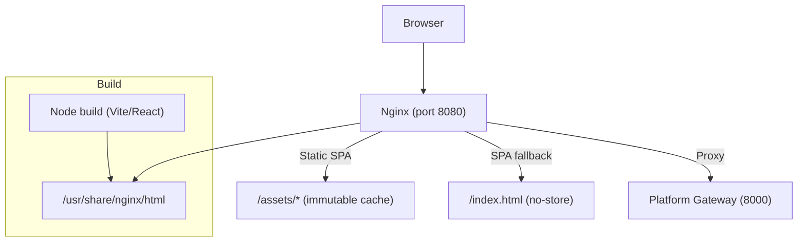

**Diagram sources**
- [Dockerfile:1-29](file://products/operator-portal/Dockerfile#L1-L29)
- [nginx.conf:1-43](file://products/operator-portal/nginx.conf#L1-L43)

**Section sources**
- [Dockerfile:1-29](file://products/operator-portal/Dockerfile#L1-L29)
- [nginx.conf:1-43](file://products/operator-portal/nginx.conf#L1-L43)
- [Makefile:1-14](file://products/operator-portal/Makefile#L1-L14)

## Core Components
- Application shell and routing: React app root, theme provider, auth provider, and view router with sidebar sections and responsive drawer.
- Authentication: OIDC login flow, token refresh scheduling, and session persistence; roles drive UI visibility and feature gating.
- API client: Centralized fetch wrapper adding bearer tokens and request IDs, with configurable gateway URL override.
- Chat workspace: Session list, message composer, model selector, voice input, streaming SSE transport, tool evidence rendering, and **enhanced HITL confirmation cards with browser flow context, parsed element labels as prose, and metadata visualization**.
- Control views: Approvals inbox, **enhanced audit trail with sophisticated tabbed interface, critical hook ordering stability, and automatic recovery from stale session transitions**, permissions matrix, settings & debug, incidents triage.
- Workspace views: Tools catalog and **enhanced skills inventory with lazy loading and read-only content viewer**.
- Theme and accessibility: Dark theme tokens mirrored into CSS custom properties; ARIA labels and keyboard-friendly controls.

**Section sources**
- [App.tsx:1-422](file://products/operator-portal/web-ui/app/src/App.tsx#L1-L422)
- [AuthContext.tsx:1-110](file://products/operator-portal/web-ui/app/src/auth/AuthContext.tsx#L1-L110)
- [client.ts:1-101](file://products/operator-portal/web-ui/app/src/api/client.ts#L1-L101)
- [ChatView.tsx:1-200](file://products/operator-portal/web-ui/app/src/chat/ChatView.tsx#L1-L200)
- [SettingsView.tsx:1-200](file://products/operator-portal/web-ui/app/src/views/control/SettingsView.tsx#L1-L200)
- [AuditView.tsx:1-484](file://products/operator-portal/web-ui/app/src/views/audit/AuditView.tsx#L1-L484)
- [tokens.ts:1-43](file://products/operator-portal/web-ui/app/src/theme/tokens.ts#L1-L43)

## Architecture Overview
The portal follows a thin-client architecture:
- Frontend: React SPA built with Vite, served by nginx with immutable asset caching and SPA fallback.
- Auth: OIDC via identity broker; access tokens are attached to requests.
- Backend integration: All API calls go through nginx proxy to the platform gateway, which enforces policies and delegates to agent-platform, policy-center, and other services.

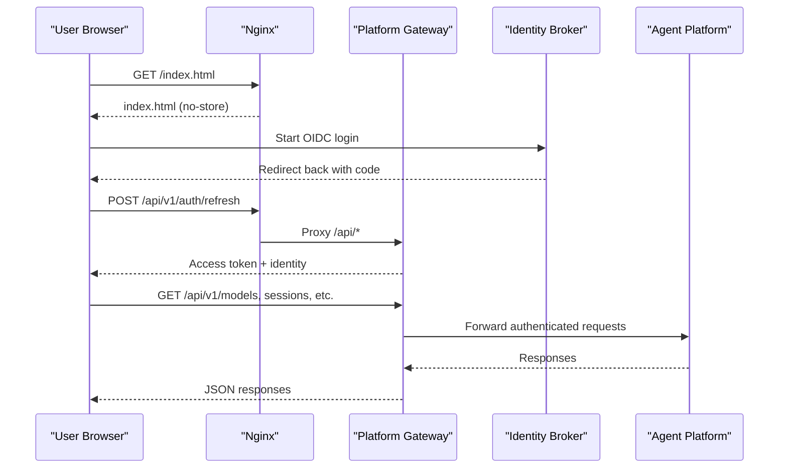

**Diagram sources**
- [nginx.conf:8-28](file://products/operator-portal/nginx.conf#L8-L28)
- [AuthContext.tsx:40-71](file://products/operator-portal/web-ui/app/src/auth/AuthContext.tsx#L40-L71)
- [client.ts:65-92](file://products/operator-portal/web-ui/app/src/api/client.ts#L65-L92)

## Detailed Component Analysis

### Application Shell and Navigation
- Two-column layout with collapsible sidebar and off-canvas drawer on narrow screens.
- Role-based menu items grouped under Control and Workspace sections; section headers hide when all entries are hidden.
- User card shows initials, username, roles, sign-in/sign-out buttons, and platform version chip.

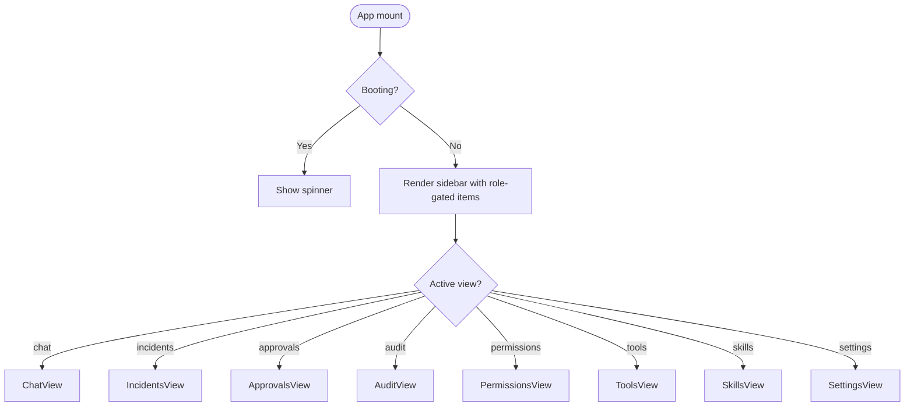

**Diagram sources**
- [App.tsx:287-422](file://products/operator-portal/web-ui/app/src/App.tsx#L287-L422)

**Section sources**
- [App.tsx:1-422](file://products/operator-portal/web-ui/app/src/App.tsx#L1-L422)

### Authentication and Session Management
- OIDC login initiated from UI; callback completed at startup; existing sessions restored from storage.
- Token refresh scheduled before expiry; failures clear session and prompt re-authentication.
- Roles extracted from identity context and used to gate UI features and API calls.
- **Stale session handling**: During boot window, expired stored sessions restore cached identity, allowing signed-in rendering until silent refresh completes or fails.

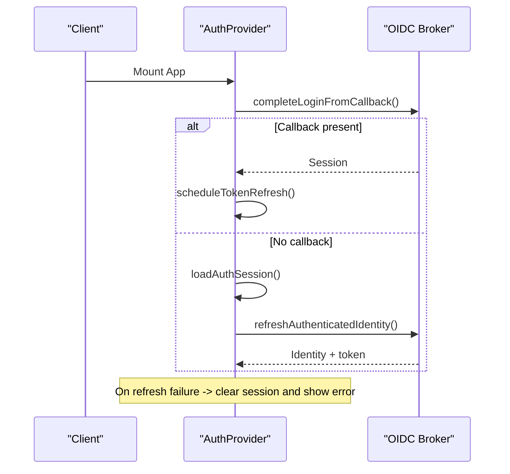

**Diagram sources**
- [AuthContext.tsx:31-85](file://products/operator-portal/web-ui/app/src/auth/AuthContext.tsx#L31-L85)

**Section sources**
- [AuthContext.tsx:1-110](file://products/operator-portal/web-ui/app/src/auth/AuthContext.tsx#L1-L110)

### API Client and Request Correlation
- Centralized request function attaches x-request-id and Authorization header when signed in.
- Gateway URL can be overridden via local storage key for development/debugging.
- Errors are wrapped in ApiError with status and message.

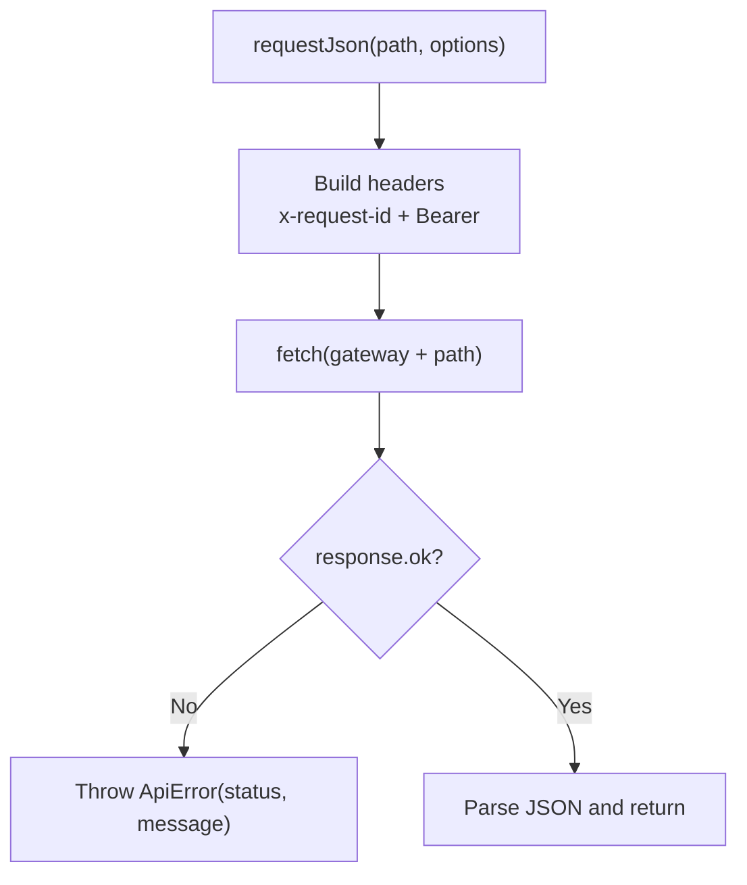

**Diagram sources**
- [client.ts:38-92](file://products/operator-portal/web-ui/app/src/api/client.ts#L38-L92)

**Section sources**
- [client.ts:1-101](file://products/operator-portal/web-ui/app/src/api/client.ts#L1-L101)

### Chat Workspace and Streaming
- Session workspace manages multiple sessions, titles, last-active timestamps, and pinned incident sessions.
- Model selector integrates with /api/v1/models; selection persists per session.
- Voice input uses Web Speech API with language preference persisted locally.
- Tool evidence rendered as collapsible cards with status badges and optional full output expander.
- **Enhanced inline HITL confirmation cards with browser flow context, parsed element labels as human-readable prose, and metadata visualization including background highlighting and tags**.

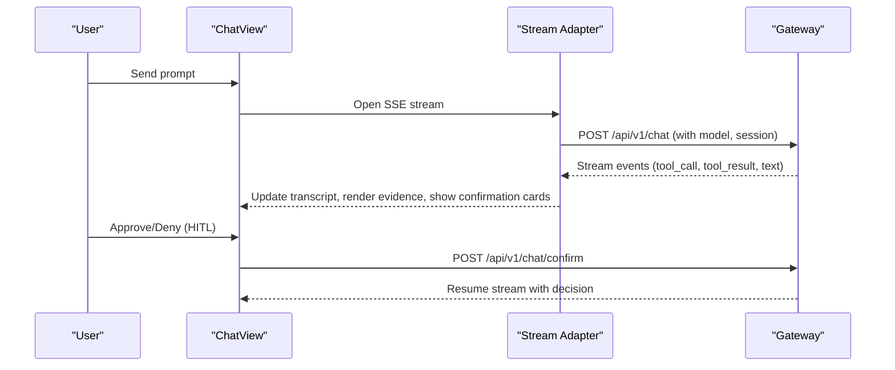

**Diagram sources**
- [ChatView.tsx:1-200](file://products/operator-portal/web-ui/app/src/chat/ChatView.tsx#L1-L200)

**Section sources**
- [ChatView.tsx:1-200](file://products/operator-portal/web-ui/app/src/chat/ChatView.tsx#L1-L200)
- [README.md:43-126](file://products/operator-portal/README.md#L43-L126)

### Enhanced Confirmation Cards with Browser Flow Context and Parsed Element Labels
**Updated** The confirmation card system has been significantly enhanced with AgentStreamEvent schema v9 support for flow_summary fields and parsed element labels, enabling consistent workflow framing across both live and durable confirmation views while hiding technical details behind expanders for improved operator readability.

#### AgentStreamEvent Schema v9 - Flow Summary and Display Hint Support
- **Flow Summary Field**: New optional `flow_summary` field on confirmation_request frames carrying bound browser-flow headline information including skill_id, origin, title, description, and risk_class
- **Display Hint Field**: Enhanced per-call `display_hint` field providing human-readable element descriptions for browser interaction tools (web.click, web.type, etc.)
- **Schema Definition**: Both fields are defined with additionalProperties false, ensuring strict validation of flow metadata structure
- **Backward Compatibility**: Fields are nullable and absent for non-browser cards, maintaining compatibility with existing confirmation scenarios
- **Type Safety**: Full TypeScript support ensures compile-time validation of flow metadata structure throughout the confirmation pipeline

#### Parsed Element Labels as Prose
- **Human-Readable Descriptions**: Browser automation tools now display parsed element labels as natural language prose rather than raw technical references
- **Improved Readability**: Operators see what element will be affected (e.g., "Click Submit button") instead of cryptic references like "web.click ref=2"
- **Technical Details Hidden**: Raw parameters and technical implementation details are folded behind collapsible "Technical details" expanders
- **Workflow Context First**: Card headlines emphasize the overall workflow intent ("Reset user password on example.com") over individual tool actions

#### FlowSummary Interface and Metadata Processing
- **Structured Metadata**: FlowSummary interface provides typed access to browser flow context including skill identification, target origin, human-readable titles, descriptions, and risk classification
- **Metadata Sources**: Flow context is populated from skill frontmatter and runtime analysis, providing operators with meaningful workflow descriptions rather than raw tool invocations
- **Conditional Rendering**: Flow headline displays only when relevant metadata is available, gracefully degrading to tool-level details when flow context is absent
- **Data Transformation**: Decoder functions handle snake_case to camelCase conversion between wire format and view models

#### Visual Enhancement Features
- **Background Highlighting**: Flow headline section uses subtle background highlighting (`rgba(127,127,127,0.08)`) with left border accent to visually distinguish workflow context from individual tool calls
- **Origin Tags**: Target origin displayed as geekblue-tagged identifiers, helping operators understand which systems or domains are being accessed
- **Risk Classification Tags**: Risk class shown with appropriate color coding - default for read operations, warning for write/mutating operations
- **Typography Hierarchy**: Skill titles use bold formatting while descriptions appear with reduced opacity for visual hierarchy
- **Collapsible Technical Details**: Raw parameters and technical implementation details are hidden behind `
` elements with "Technical details" summary

#### Integration with Existing Card Architecture
- **Seamless Integration**: Flow headline renders above the existing tool call list, maintaining backward compatibility with non-browser confirmation scenarios
- **Metadata Propagation**: FlowSummary data flows through the entire confirmation pipeline from stream frames to final card rendering
- **Durable Record Support**: Flow context is preserved in durable records and replayed consistently across approvals inbox and session detail views
- **Performance Optimization**: Conditional checks prevent unnecessary DOM manipulation when flow metadata is absent

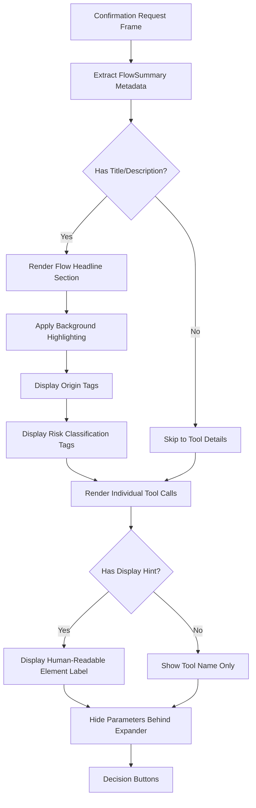

**Diagram sources**
- [ChatView.tsx:388-435](file://products/operator-portal/web-ui/app/src/chat/ChatView.tsx#L388-L435)
- [models.ts:70-79](file://products/operator-portal/web-ui/app/src/stream/models.ts#L70-L79)
- [agent-stream-event.schema.json:59-70](file://shared/shared-contracts/schemas/agent-stream-event.schema.json#L59-L70)

#### Styling and Presentation
- **CSS Classes**: Uses `.confirm-flow` class for consistent styling across different confirmation scenarios
- **Responsive Design**: Flow headline section adapts to different screen sizes while maintaining readability
- **Accessibility**: Proper semantic HTML structure with appropriate heading levels and descriptive text
- **Visual Consistency**: Follows established design patterns used throughout the confirmation card system

**Section sources**
- [ChatView.tsx:388-435](file://products/operator-portal/web-ui/app/src/chat/ChatView.tsx#L388-L435)
- [models.ts:70-79](file://products/operator-portal/web-ui/app/src/stream/models.ts#L70-L79)
- [decoder.ts:39-57](file://products/operator-portal/web-ui/app/src/stream/decoder.ts#L39-L57)
- [transcript.ts:116-133](file://products/operator-portal/web-ui/app/src/chat/transcript.ts#L116-L133)
- [agent-stream-event.schema.json:59-70](file://shared/shared-contracts/schemas/agent-stream-event.schema.json#L59-L70)
- [sessions.ts:53-66](file://products/operator-portal/web-ui/app/src/api/sessions.ts#L53-L66)

### Enhanced Skills Inventory with Lazy Loading and Content Viewer
**New** The Skills inventory view has been enhanced with lazy loading capabilities and a new read-only content viewer component that allows operators to inspect skill contents safely before trusting them to drive tool behavior and HITL gates.

#### Lazy View Action Per Row
- **On-Demand Loading**: Each skill row includes a "View" button that triggers lazy fetching of the full skill record only when invoked
- **Optimized Performance**: The list payload omits the skill body by contract, reducing initial load time and network usage
- **Loading States**: Individual row loading indicators provide feedback during skill detail retrieval
- **Error Handling**: Inline error messages are displayed if skill detail fetching fails, without opening the viewer

#### SkillContentViewer Component
- **Read-Only Modal**: Opens in a modal dialog with skill metadata (title, source, version, tags, web_target) displayed prominently
- **Rendered/Raw Toggle**: Segmented control allows switching between rendered markdown view and raw source view
- **Secure Rendering**: Uses escape-first markdown renderer that prevents XSS attacks by escaping all HTML characters before processing markup
- **Safe Link Handling**: Only http(s) links are rendered as clickable URLs; other protocols are displayed as plain text
- **Bounded Scrolling**: Content area has maximum height with scrollable overflow for large skill documents

#### Markdown Rendering Security
- **Escape-First Approach**: All HTML characters are escaped before any markdown processing occurs
- **Code Block Protection**: Fenced code blocks and inline code spans are protected from markdown transformation
- **Link Validation**: Only http(s) protocol links are allowed; javascript:, data:, and other dangerous protocols are stripped
- **XSS Prevention**: Hostile content like `<script>` tags and event handlers are safely escaped and displayed as literal text

#### API Integration
- **Namespaced Skill IDs**: Supports namespaced skill IDs (e.g., "sre-alerting/reset-password") with proper URL encoding
- **Gateway Proxy**: Integrates with platform gateway's `/api/v1/skills/{skill_id:path}` endpoint for skill detail retrieval
- **Type Safety**: TypeScript interfaces define the shape of skill records and details for compile-time validation

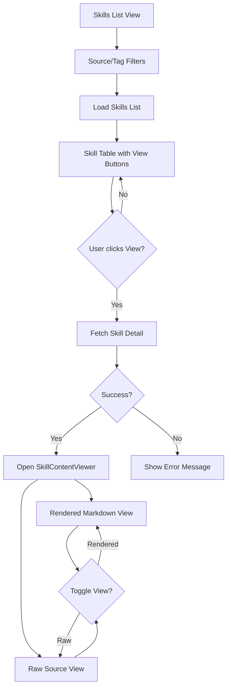

**Diagram sources**
- [SkillsView.tsx:34-175](file://products/operator-portal/web-ui/app/src/views/control/SkillsView.tsx#L34-L175)
- [SkillContentViewer.tsx:29-131](file://products/operator-portal/web-ui/app/src/chat/SkillContentViewer.tsx#L29-L131)
- [markdown.ts:77-198](file://products/operator-portal/web-ui/app/src/chat/markdown.ts#L77-L198)

#### Testing Coverage
- **Component Tests**: Comprehensive test coverage for both SkillsView and SkillContentViewer components
- **Security Testing**: Tests verify hostile content is properly escaped and not executed
- **Integration Testing**: Tests validate lazy loading behavior and API integration
- **User Experience Testing**: Tests ensure proper loading states, error handling, and view toggling

**Section sources**
- [SkillsView.tsx:1-175](file://products/operator-portal/web-ui/app/src/views/control/SkillsView.tsx#L1-L175)
- [SkillContentViewer.tsx:1-131](file://products/operator-portal/web-ui/app/src/chat/SkillContentViewer.tsx#L1-L131)
- [markdown.ts:1-198](file://products/operator-portal/web-ui/app/src/chat/markdown.ts#L1-L198)
- [SkillsView.test.tsx:1-107](file://products/operator-portal/web-ui/app/src/views/control/__tests__/SkillsView.test.tsx#L1-L107)
- [SkillContentViewer.test.tsx:1-86](file://products/operator-portal/web-ui/app/src/chat/__tests__/SkillContentViewer.test.tsx#L1-L86)

### Enhanced Audit Trail with Automatic Recovery Capabilities
**Updated** The audit trail view has been completely redesigned with an advanced tabbed interface that provides both detailed event inspection and comprehensive summary analytics with interactive drill-down capabilities. The v0.29.3 release includes critical improvements for session lifecycle handling that prevent empty state rendering during stale session transitions, ensuring robust automatic recovery without manual intervention.

#### Advanced Tabbed Interface Architecture
- **Shared Filter Toolbar**: Both Events and Summary tabs share a common filter interface for username, event type, outcome, service, and time range filtering
- **Events Tab**: Displays cursor-paginated audit events with expandable verbatim envelopes showing full event details
- **Summary Tab**: Shows deterministic envelope-column aggregates with collapsible sections, interactive drill-down, and comprehensive analytics

#### Critical Session Lifecycle Handling (v0.29.3)
- **Stale Session Recovery**: When the identity lifecycle moves (stale session cleared, fresh sign-in, silent refresh), the effect clears any latched failure and retries once if not yet loaded
- **Automatic Retry Mechanism**: The initial-load effect now keys off the session object, enabling automatic recovery from 401 errors during stale session transitions
- **Empty State Prevention**: Prevents the view from getting stuck in failure posture when authentication state changes while mounted
- **Comprehensive Test Coverage**: Regression tests simulate the stale-session 401 → fresh sign-in sequence and assert auto-recovery without manual Refresh

#### Critical Hook Ordering Fix (v0.29.2)
- **Hook Order Preservation**: All hooks must run before the `!allowed` early return to maintain stable rendering during authentication state changes
- **Sign-Out Stability**: Resolves render instability when users sign out or tokens refresh while the audit view remains mounted
- **Conditional Rendering Safety**: Ensures React's rules of hooks are followed even when role gates change dynamically
- **Test Coverage**: Comprehensive regression tests verify hook order preservation across authentication state transitions

#### Enhanced Type Safety
- **DrilldownPatch Type**: Compile-time enforcement of drill-down invariants ensures type-safe filter merging
- **Type-Safe Filter Merging**: Prevents runtime errors when drilling down from summary to events with merged filters
- **Interface Contracts**: Strict TypeScript interfaces define the shape of drill-down patches and filter parameters

#### Key Features
- **Role-Based Access**: Requires auditor or platform-admin roles with server-side enforcement
- **Structured Error Handling**: Provides actionable error messages for different failure scenarios (403, 502, 503)
- **CSV Export**: Server-side blob download with Content-Disposition filename support and truncation warnings
- **Real-time Filtering**: Filters apply consistently across both tabs with lazy loading for summary data
- **Interactive Drill-Down**: Click any aggregate value to navigate to Events tab with merged filters using type-safe patches
- **Collapsible Sections**: Four bucket tables organized in antd Collapse component with default expansion
- **Proportion Visualization**: Percentage values with simplified one-decimal display (v0.29.1: progress bars removed)
- **Decision Chain Visualization**: New statistic row showing total events and four decision-chain steps

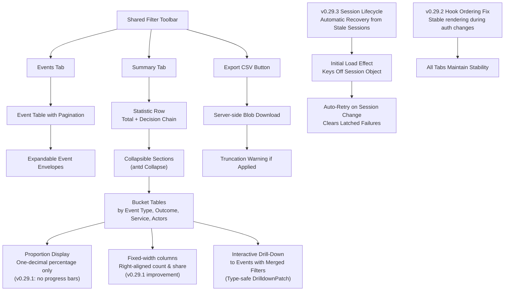

**Diagram sources**
- [AuditView.tsx:101-484](file://products/operator-portal/web-ui/app/src/views/audit/AuditView.tsx#L101-L484)
- [AuditSummaryPanel.tsx:115-210](file://products/operator-portal/web-ui/app/src/views/audit/AuditSummaryPanel.tsx#L115-L210)

#### Summary Panel Components
- **Headline Statistics**: Total events count plus four decision-chain step counters (confirmation_decided, execution_requested, execution_completed, execution_rejected)
- **Collapsible Analytics**: Four bucket tables organized by event type, outcome, service, and top actors
- **Interactive Elements**: Every aggregate value is clickable for drill-down to filtered Events view
- **Visual Indicators**: Simplified proportion display with one-decimal percentages (v0.29.1: removed progress bars for cleaner presentation)
- **Fixed Layout**: Right-aligned numeric columns with fixed widths (88px each) for count and share, ensuring consistent table layout (v0.29.1 enhancement)
- **Zero-State Handling**: Empty posture when no events match current filters

#### Constants Management and Drift Guard
- **Centralized Constants**: Event types, emitter services, and outcomes moved to dedicated `constants.ts` file
- **Schema Drift Protection**: Vitest tests ensure constants remain synchronized with shared audit-event schema
- **Outcome Filter Integration**: New outcome select dropdown follows the same drift-guard pattern as other filters
- **Maintainable Configuration**: Single source of truth for audit-related configuration

**Section sources**
- [AuditView.tsx:1-484](file://products/operator-portal/web-ui/app/src/views/audit/AuditView.tsx#L1-L484)
- [AuditSummaryPanel.tsx:1-207](file://products/operator-portal/web-ui/app/src/views/audit/AuditSummaryPanel.tsx#L1-L207)
- [constants.ts:1-49](file://products/operator-portal/web-ui/app/src/views/audit/constants.ts#L1-L49)
- [AuditView.test.tsx:97-131](file://products/operator-portal/web-ui/app/src/views/__tests__/AuditView.test.tsx#L97-L131)

### Settings, Health, and Debug
- Identity pane shows sign-in state, username, roles, subject, and groups.
- Session pane displays active session and workspace session count.
- Platform pane probes gateway health endpoints and runtime metadata to display component readiness and versions.

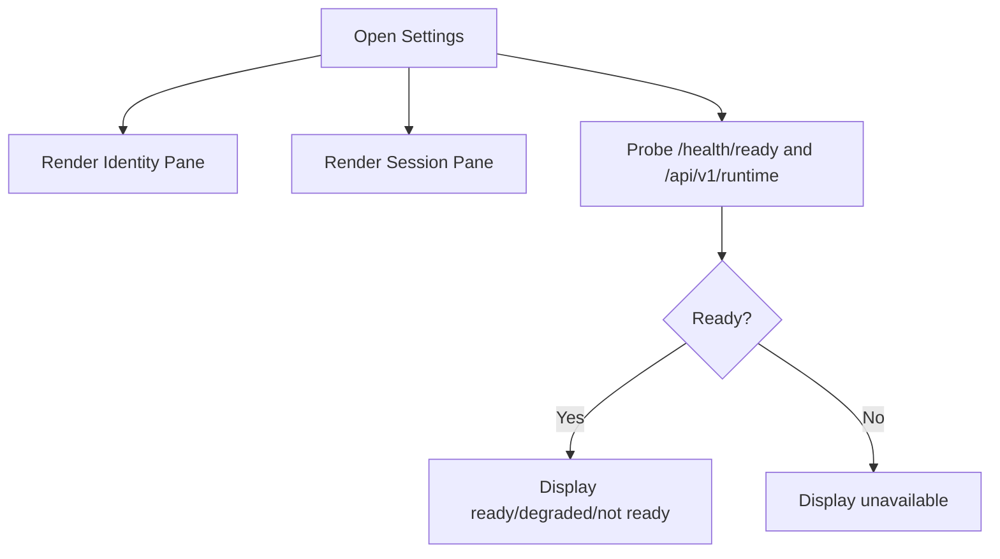

**Diagram sources**
- [SettingsView.tsx:1-200](file://products/operator-portal/web-ui/app/src/views/control/SettingsView.tsx#L1-L200)
- [nginx.conf:19-28](file://products/operator-portal/nginx.conf#L19-L28)

**Section sources**
- [SettingsView.tsx:1-200](file://products/operator-portal/web-ui/app/src/views/control/SettingsView.tsx#L1-L200)

### Deployment and Runtime Configuration
- Multi-stage build compiles SPA and copies dist into nginx image.
- Nginx serves immutable cached assets and SPA fallback; proxies /api/ and /health/ to gateway.
- Makefile defines image name and context; includes shared image rules.

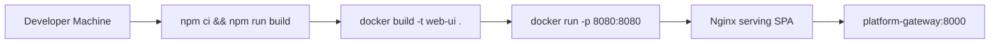

**Diagram sources**
- [Dockerfile:11-29](file://products/operator-portal/Dockerfile#L11-L29)
- [nginx.conf:1-43](file://products/operator-portal/nginx.conf#L1-L43)
- [Makefile:1-14](file://products/operator-portal/Makefile#L1-L14)

**Section sources**
- [Dockerfile:1-29](file://products/operator-portal/Dockerfile#L1-L29)
- [nginx.conf:1-43](file://products/operator-portal/nginx.conf#L1-L43)
- [Makefile:1-14](file://products/operator-portal/Makefile#L1-L14)

## Dependency Analysis
- UI layer depends on antd and Ant Design X components for layout, menus, tables, and chat bubbles.
- App shell composes AuthProvider and theme provider around the root component.
- Views depend on API client for data fetching; roles determine visibility and actions.
- Nginx routes static assets and proxies API traffic to the gateway.

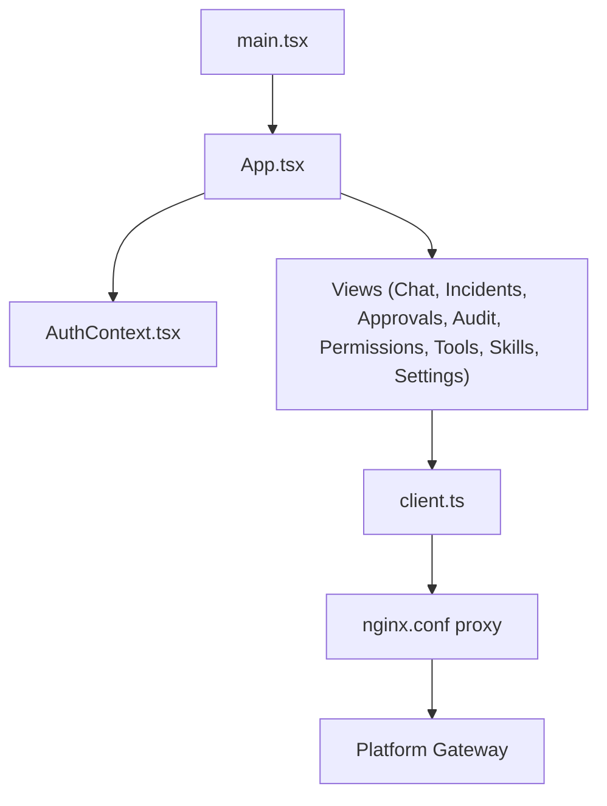

**Diagram sources**
- [main.tsx:1-18](file://products/operator-portal/web-ui/app/src/main.tsx#L1-L18)
- [App.tsx:1-422](file://products/operator-portal/web-ui/app/src/App.tsx#L1-L422)
- [client.ts:1-101](file://products/operator-portal/web-ui/app/src/api/client.ts#L1-L101)
- [nginx.conf:1-43](file://products/operator-portal/nginx.conf#L1-L43)

**Section sources**
- [main.tsx:1-18](file://products/operator-portal/web-ui/app/src/main.tsx#L1-L18)
- [App.tsx:1-422](file://products/operator-portal/web-ui/app/src/App.tsx#L1-L422)
- [client.ts:1-101](file://products/operator-portal/web-ui/app/src/api/client.ts#L1-L101)
- [nginx.conf:1-43](file://products/operator-portal/nginx.conf#L1-L43)

## Performance Considerations
- Immutable asset caching: Content-hashed assets under /assets/ are served with long-lived immutable cache headers to improve repeat load performance.
- SPA fallback: index.html is served with no-store to ensure immediate rollout without stale shell issues.
- Streaming: Long-lived SSE connections use proxy_read_timeout configured to support extended operations.
- Client-side state: Session workspace minimizes redundant network calls by maintaining local session lists and pinning incident sessions.
- **Lazy Loading**: Summary tab data is fetched only when the tab is activated, reducing initial page load time.
- **Efficient Filtering**: Shared filter state prevents redundant API calls when switching between tabs.
- **Optimized Rendering**: Collapsible sections reduce initial DOM complexity while providing rich interactivity.
- **Progressive Enhancement**: Zero-state handling prevents unnecessary computations when no data is available.
- **v0.29.1 Layout Optimization**: Fixed-width columns eliminate dynamic width recalculation overhead and prevent layout shifts during table rendering.
- **v0.29.2 Hook Stability**: Critical hook ordering fixes eliminate render instability during authentication state changes, improving perceived performance and reliability.
- **v0.29.3 Recovery Efficiency**: Automatic recovery from stale session transitions eliminates need for manual refresh operations, improving user experience and reducing support burden.
- **Enhanced Confirmation Card Performance**: Flow headline rendering uses conditional checks to avoid unnecessary DOM manipulation when flow metadata is absent, maintaining optimal performance for non-browser confirmation scenarios.
- **Parsed Element Labels Optimization**: Display hints are conditionally rendered only when available, preventing unnecessary DOM operations for non-browser tools.
- **Skills View Performance**: Lazy loading of skill details reduces initial page load time and network usage; only fetches full skill records when users explicitly click View.
- **Markdown Rendering Efficiency**: Escape-first markdown rendering optimizes security without sacrificing performance; code blocks and inline code are protected from transformation overhead.

[No sources needed since this section provides general guidance]

## Troubleshooting Guide
- Authentication errors: AuthContext surfaces authError messages; check OIDC callback completion and token refresh behavior.
- API failures: ApiError wraps non-ok responses with status and message; verify gateway reachability and bearer token presence.
- Gateway override: Use local storage key to redirect API calls during development or debugging.
- Health checks: Settings panel probes gateway health endpoints; if unavailable, inspect nginx proxy configuration and upstream service status.
- **Audit View Issues**: Check role permissions (auditor/platform-admin required); verify audit service availability; review structured error messages for specific failure scenarios.
- **CSV Export Problems**: Monitor truncation warnings; verify server-side export limits; check Content-Disposition headers for proper filename handling.
- **Summary Tab Issues**: Verify lazy loading behavior; check filter state synchronization; ensure collapse component renders correctly.
- **Drill-Down Navigation**: Confirm filter merging logic; verify Events tab loads with correct merged parameters; check cursor reset behavior.
- **v0.29.1 Table Layout Issues**: If audit summary tables show wrapping or misalignment, verify browser viewport width and antd table configuration; the fixed-width columns should prevent wrapping but may require minimum container width.
- **v0.29.2 Hook Ordering Issues**: If audit view exhibits unstable rendering during sign-out or token refresh, verify that all hooks execute before the role gate early return; check that authentication state changes don't cause unexpected unmounting.
- **v0.29.3 Stale Session Issues**: If audit view shows empty state after authentication changes, verify that the session object is properly updated; the automatic recovery mechanism should clear latched failures and retry automatically. Check that the initial-load effect is keyed on the session object and triggers on session changes.
- **Type Safety Issues**: Ensure DrilldownPatch type usage is correct when implementing custom drill-down functionality; verify filter merging maintains type safety.
- **Confirmation Card Flow Context Issues**: If browser flow headlines aren't displaying, verify that skill frontmatter contains valid title/description fields; check that flow metadata is properly propagated through the confirmation pipeline; ensure CSS classes are applied correctly for visual styling.
- **AgentStreamEvent Schema v9 Issues**: If flow_summary fields are missing from confirmation cards, verify that the backend is sending the new schema version and that decoder functions are properly parsing the flow metadata.
- **Display Hint Issues**: If parsed element labels aren't appearing, verify that browser automation tools are generating display_hint fields; check that the decoder is properly extracting display_hint from pending_calls; ensure the ChatView is rendering the displayHint property correctly.
- **Technical Details Expander Issues**: If technical details aren't collapsing properly, verify that the `
` element structure is correct and that the "Technical details" summary text is displaying as expected.
- **Skills View Issues**: Verify that the Skills inventory view loads correctly; check for network errors when clicking View buttons; ensure skill detail API endpoints are accessible.
- **SkillContentViewer Issues**: If skill content doesn't display properly, verify that the markdown renderer is working correctly; check for XSS protection issues; ensure the Rendered/Raw toggle functions properly.
- **Markdown Security Issues**: If skill content appears broken or unsafe, verify that the escape-first renderer is properly sanitizing HTML; check that hostile content like script tags are being escaped correctly.
- **Lazy Loading Performance**: If skills view feels slow, verify that skill details are only being fetched when View is clicked; check for excessive API calls; ensure loading states are displayed appropriately.

**Section sources**
- [AuthContext.tsx:40-85](file://products/operator-portal/web-ui/app/src/auth/AuthContext.tsx#L40-L85)
- [client.ts:8-16](file://products/operator-portal/web-ui/app/src/api/client.ts#L8-L16)
- [client.ts:25-36](file://products/operator-portal/web-ui/app/src/api/client.ts#L25-L36)
- [nginx.conf:8-28](file://products/operator-portal/nginx.conf#L8-L28)
- [AuditView.tsx:101-199](file://products/operator-portal/web-ui/app/src/views/audit/AuditView.tsx#L101-L199)
- [AuditView.test.tsx:97-131](file://products/operator-portal/web-ui/app/src/views/__tests__/AuditView.test.tsx#L97-L131)
- [SkillsView.test.tsx:94-107](file://products/operator-portal/web-ui/app/src/views/control/__tests__/SkillsView.test.tsx#L94-L107)
- [SkillContentViewer.test.tsx:65-77](file://products/operator-portal/web-ui/app/src/chat/__tests__/SkillContentViewer.test.tsx#L65-L77)

## Conclusion
The Operator Portal delivers a secure, role-aware admin interface with rich operational features including chat-driven troubleshooting, incident triage, approvals, **comprehensive audit trail with sophisticated tabbed interface, advanced analytics, and automatic recovery from stale session transitions**, and platform health diagnostics. Its deployment model combines a modern SPA with efficient nginx serving and robust proxying to backend services, enabling scalable and maintainable operator workflows. The recent complete redesign of the audit trail provides operators with powerful event inspection capabilities, interactive drill-down navigation, and comprehensive summary analytics for understanding system behavior and identifying patterns through collapsible sections, simplified proportion visualization, and decision-chain tracking. The v0.29.1 hardening further improves the user experience by removing progress bars from share columns and implementing fixed-width columns for more stable and readable table layouts. The v0.29.2 critical hook ordering fix ensures render stability during sign-out and token refresh scenarios, while enhanced type safety with DrilldownPatch provides compile-time enforcement of drill-down invariants. The v0.29.3 session lifecycle enhancement adds automatic recovery capabilities that prevent empty state rendering during stale session transitions, eliminating the need for manual refresh operations and providing a more resilient user experience. **The enhanced confirmation card system with browser flow context and parsed element labels provides operators with meaningful workflow descriptions, visual styling with background highlighting and tags, improved situational awareness when approving automated browser actions, and hidden technical details behind expanders for cleaner presentation.** The AgentStreamEvent schema v9 enhancement enables consistent flow summary support across both live streaming and durable record scenarios, ensuring operators see the same workflow context regardless of how they encounter confirmation requests. **The new Skills inventory enhancements with lazy loading and read-only content viewer provide operators with safe, performant access to skill documentation, enabling informed decisions about trusting skills to drive automated actions while maintaining security through escape-first markdown rendering and comprehensive testing coverage.**

[No sources needed since this section summarizes without analyzing specific files]

## Appendices

### Deployment Instructions
- Build and run:
  - Build the image using the product Makefile; the image name is web-ui and the context includes the repository root for VERSION injection.
  - Run the container exposing port 8080; configure reverse proxy or ingress to route to the container.
- Nginx configuration:
  - Static assets under /assets/ are immutable-cacheable.
  - /index.html is no-store with SPA fallback.
  - /api/ and /health/ are proxied to the platform gateway.

**Section sources**
- [Makefile:1-14](file://products/operator-portal/Makefile#L1-L14)
- [Dockerfile:11-29](file://products/operator-portal/Dockerfile#L11-L29)
- [nginx.conf:1-43](file://products/operator-portal/nginx.conf#L1-L43)

### Integration Points
- Identity broker: OIDC login, token refresh, and logout flows.
- Platform gateway: Proxies all /api/ calls; enforces policies and delegates to agent-platform and other services.
- Agent platform: Provides chat sessions and streaming responses.
- Policy center: Supplies approval queue and decision state surfaced in Approvals and Permissions views.
- **Audit service**: Provides durable audit trail with events, summary analytics, CSV export capabilities, and comprehensive filtering support.
- **Skills hub**: Provides skills inventory and detail endpoints for the enhanced Skills view with lazy loading capabilities.

**Section sources**
- [README.md:127-133](file://products/operator-portal/README.md#L127-L133)

### UI Customization and Accessibility
- Theme: Dark theme tokens defined in tokens.ts and applied via antd ConfigProvider; CSS custom properties mirror tokens for consistent styling.
- Accessibility: ARIA labels on navigation and user actions; keyboard-friendly menus and controls; responsive layout adapts to narrow screens with a drawer.
- **Enhanced Audit Interface**: Sophisticated tabbed interface provides intuitive navigation between detailed events and comprehensive summary analytics; shared filter toolbar ensures consistent user experience across tabs; collapsible sections improve information density while maintaining accessibility; v0.29.1 improvements provide more stable table layouts with fixed-width columns; v0.29.2 hook ordering ensures stable rendering during authentication state changes; v0.29.3 automatic recovery prevents empty states during session transitions.
- **Enhanced Confirmation Cards**: Browser flow context provides meaningful workflow descriptions with visual styling including background highlighting, origin tags, and risk classification indicators; parsed element labels display human-readable descriptions instead of raw technical details; technical implementation details are hidden behind collapsible expanders for cleaner presentation; accessible semantic HTML structure with appropriate heading levels and descriptive text; responsive design adapts to different screen sizes while maintaining readability.
- **Enhanced Skills Interface**: Lazy loading provides better performance and user experience; read-only content viewer ensures safe inspection of skill contents; Rendered/Raw toggle offers flexibility for different use cases; comprehensive accessibility support with ARIA labels and keyboard navigation; responsive modal design adapts to different screen sizes.

**Section sources**
- [tokens.ts:1-43](file://products/operator-portal/web-ui/app/src/theme/tokens.ts#L1-L43)
- [App.tsx:395-418](file://products/operator-portal/web-ui/app/src/App.tsx#L395-L418)
- [AuditView.tsx:298-361](file://products/operator-portal/web-ui/app/src/views/audit/AuditView.tsx#L298-L361)
- [SkillsView.tsx:121-175](file://products/operator-portal/web-ui/app/src/views/control/SkillsView.tsx#L121-L175)
- [SkillContentViewer.tsx:45-131](file://products/operator-portal/web-ui/app/src/chat/SkillContentViewer.tsx#L45-L131)

### Browser Compatibility
- Uses modern browser APIs such as Web Speech API for voice input and standard fetch/SSE patterns.
- SPA relies on ES modules and modern JavaScript features; ensure browsers support ES modules and required APIs.

**Section sources**
- [README.md:43-65](file://products/operator-portal/README.md#L43-L65)
- [index.html:1-14](file://products/operator-portal/web-ui/app/index.html#L1-L14)

### Enhanced Confirmation Card System
**Updated** The confirmation card system has been significantly enhanced with AgentStreamEvent schema v9 support for flow_summary fields and parsed element labels, enabling consistent workflow framing across both live and durable confirmation views while improving operator readability through human-readable descriptions and hidden technical details.

#### Flow Context Architecture
- **FlowSummary Interface**: Structured metadata including skill identification, target origin, human-readable titles, descriptions, and risk classification
- **Schema v9 Support**: Optional flow_summary field on confirmation_request frames carries bound browser-flow headline information
- **Display Hint Support**: Per-call display_hint field provides human-readable element descriptions for browser interaction tools
- **Conditional Rendering**: Flow headline displays only when relevant metadata is available, gracefully degrading to tool-level details
- **Type Safety**: Full TypeScript support ensures compile-time validation of flow metadata structure

#### Visual Enhancements and Readability Improvements
- **Background Highlighting**: Subtle background highlighting with left border accent to distinguish workflow context
- **Origin Tags**: Geekblue-tagged target origin identifiers for system/domain context
- **Risk Classification Tags**: Color-coded risk indicators (default for read, warning for write operations)
- **Typography Hierarchy**: Bold titles with reduced opacity descriptions for visual hierarchy
- **Parsed Element Labels**: Human-readable descriptions replace raw technical references for better operator understanding
- **Hidden Technical Details**: Raw parameters and implementation details folded behind collapsible "Technical details" expanders

#### Integration Features
- **Seamless Integration**: Renders above existing tool call list while maintaining backward compatibility
- **Metadata Propagation**: FlowSummary data flows through entire confirmation pipeline from stream frames to final rendering
- **Durable Record Support**: Flow context preserved in durable records and replayed consistently across approvals inbox and session detail views
- **Performance Optimization**: Conditional checks prevent unnecessary DOM manipulation when flow metadata is absent
- **Improved Operator Workflow**: Enhanced readability helps operators make informed decisions about browser automation actions

**Section sources**
- [ChatView.tsx:388-435](file://products/operator-portal/web-ui/app/src/chat/ChatView.tsx#L388-L435)
- [models.ts:70-79](file://products/operator-portal/web-ui/app/src/stream/models.ts#L70-L79)
- [decoder.ts:39-57](file://products/operator-portal/web-ui/app/src/stream/decoder.ts#L39-L57)
- [transcript.ts:116-133](file://products/operator-portal/web-ui/app/src/chat/transcript.ts#L116-L133)
- [agent-stream-event.schema.json:59-70](file://shared/shared-contracts/schemas/agent-stream-event.schema.json#L59-L70)
- [sessions.ts:53-66](file://products/operator-portal/web-ui/app/src/api/sessions.ts#L53-L66)

### Enhanced Audit Trail Features
**Completely Redesigned** The audit trail has been completely redesigned with advanced interactive features, further hardened in v0.29.1 for improved table stability and readability, v0.29.2 for critical hook ordering stability during authentication state changes, and v0.29.3 for automatic recovery from stale session transitions.

#### Sophisticated Tabbed Interface
- **Events Tab**: Cursor-paginated table of audit events with expandable verbatim envelopes
- **Summary Tab**: Comprehensive aggregates with collapsible sections, interactive drill-down, and visual analytics
- **Shared Filter Toolbar**: Consistent filtering across both tabs for username, event type, outcome, service, and time ranges

#### Interactive Drill-Down System
- **Click-to-Navigate**: Any aggregate value in Summary tab triggers drill-down to Events tab
- **Merged Filters**: Drill-down merges selected dimension into current filters without resetting existing filters
- **Automatic Refresh**: Events tab automatically reloads with merged filter parameters
- **Cursor Reset**: Navigation resets pagination cursor for clean starting point
- **Type-Safe Patches**: DrilldownPatch type ensures compile-time enforcement of valid filter combinations

#### Advanced Summary Analytics
- **Headline Statistics**: New statistic row showing total events plus four decision-chain steps (confirmation_decided, execution_requested, execution_completed, execution_rejected)
- **Collapsible Sections**: Four bucket tables organized using antd Collapse component with default expansion
- **Proportion Visualization**: One-decimal percentage display only (v0.29.1: removed progress bars for cleaner presentation)
- **Fixed-Width Columns**: Right-aligned count and share columns with 88px fixed width for stable layout (v0.29.1 enhancement)
- **Interactive Elements**: All aggregate values are clickable for drill-down navigation
- **Zero-State Handling**: Empty posture when no events match current filters

#### Enhanced Filtering and Controls
- **Outcome Select Dropdown**: New outcome filter following drift-guard pattern with schema synchronization
- **Drift Guard Protection**: Automated tests ensure filter options stay synchronized with shared audit-event schema
- **Real-time Updates**: Filter changes apply immediately across both tabs with optimized API calls

#### CSV Export Functionality
- Server-side blob download with proper Content-Disposition filename handling
- Truncation warnings when export limits are exceeded (AUDIT_EXPORT_MAX_ROWS)
- Structured error handling for permission denials and service unavailability

#### Critical Hook Ordering Stability (v0.29.2)
- **Hook Order Preservation**: All hooks execute before role gate early returns to maintain stable rendering
- **Authentication State Changes**: Resolves render instability during sign-out and token refresh scenarios
- **Comprehensive Test Coverage**: Regression tests verify hook order preservation across authentication state transitions
- **Consistent Behavior**: Ensures React's rules of hooks are followed even when role gates change dynamically

#### Automatic Recovery from Stale Sessions (v0.29.3)
- **Stale Session Detection**: Identifies when the shell renders under expired stored sessions during boot window
- **Automatic Retry Logic**: Clears latched failures and retries initial load when session object changes
- **Seamless Recovery**: Eliminates need for manual refresh operations when authentication state transitions occur
- **Comprehensive Testing**: Regression tests simulate stale-session 401 → fresh sign-in sequences and verify automatic recovery

**Section sources**
- [AuditView.tsx:101-484](file://products/operator-portal/web-ui/app/src/views/audit/AuditView.tsx#L101-L484)
- [AuditSummaryPanel.tsx:1-207](file://products/operator-portal/web-ui/app/src/views/audit/AuditSummaryPanel.tsx#L1-L207)
- [constants.ts:1-49](file://products/operator-portal/web-ui/app/src/views/audit/constants.ts#L1-L49)
- [AuditView.test.tsx:97-131](file://products/operator-portal/web-ui/app/src/views/__tests__/AuditView.test.tsx#L97-L131)
- [AuditView.test.tsx:174-226](file://products/operator-portal/web-ui/app/src/views/__tests__/AuditView.test.tsx#L174-L226)

### Enhanced Skills Inventory Features
**New** The Skills inventory has been enhanced with lazy loading capabilities and a comprehensive read-only content viewer that provides safe inspection of skill documentation before trusting them to drive automated actions.

#### Lazy Loading Architecture
- **On-Demand Detail Fetching**: Skill details (including full body content) are only fetched when users explicitly click the View button
- **Optimized Network Usage**: List payloads omit skill bodies by contract, reducing initial load time and bandwidth usage
- **Individual Loading States**: Each skill row displays its own loading indicator during detail retrieval
- **Error Isolation**: Failed detail fetches display inline errors without affecting the rest of the skills list

#### SkillContentViewer Component
- **Read-Only Modal Interface**: Opens skill details in a modal dialog with prominent metadata display (title, source, version, tags, web_target)
- **Dual View Modes**: Segmented control switches between rendered markdown view and raw source view
- **Secure Markdown Rendering**: Uses escape-first renderer that prevents XSS attacks while preserving formatting
- **Bounded Scrolling**: Content area has maximum height with scrollable overflow for large skill documents
- **Accessibility Support**: ARIA labels and keyboard navigation throughout the viewer interface

#### Security Features
- **Escape-First Rendering**: All HTML characters are escaped before markdown processing to prevent XSS attacks
- **Code Block Protection**: Fenced code blocks and inline code are protected from markdown transformation
- **Link Validation**: Only http(s) protocol links are rendered as clickable URLs; other protocols are displayed as plain text
- **Hostile Content Handling**: Script tags, event handlers, and other malicious content are safely escaped and displayed as literal text

#### API Integration
- **Namespaced Skill Support**: Handles namespaced skill IDs (e.g., "sre-alerting/reset-password") with proper URL encoding
- **Gateway Proxy Integration**: Connects with platform gateway's `/api/v1/skills/{skill_id:path}` endpoint
- **Type Safety**: TypeScript interfaces define skill record shapes for compile-time validation and IDE support

#### Testing and Quality Assurance
- **Component Testing**: Comprehensive test coverage for both SkillsView and SkillContentViewer components
- **Security Testing**: Validates that hostile content is properly escaped and never executed
- **Integration Testing**: Verifies lazy loading behavior and API integration patterns
- **User Experience Testing**: Ensures proper loading states, error handling, and view toggling functionality

**Section sources**
- [SkillsView.tsx:1-175](file://products/operator-portal/web-ui/app/src/views/control/SkillsView.tsx#L1-L175)
- [SkillContentViewer.tsx:1-131](file://products/operator-portal/web-ui/app/src/chat/SkillContentViewer.tsx#L1-L131)
- [markdown.ts:1-198](file://products/operator-portal/web-ui/app/src/chat/markdown.ts#L1-L198)
- [SkillsView.test.tsx:1-107](file://products/operator-portal/web-ui/app/src/views/control/__tests__/SkillsView.test.tsx#L1-L107)
- [SkillContentViewer.test.tsx:1-86](file://products/operator-portal/web-ui/app/src/chat/__tests__/SkillContentViewer.test.tsx#L1-L86)