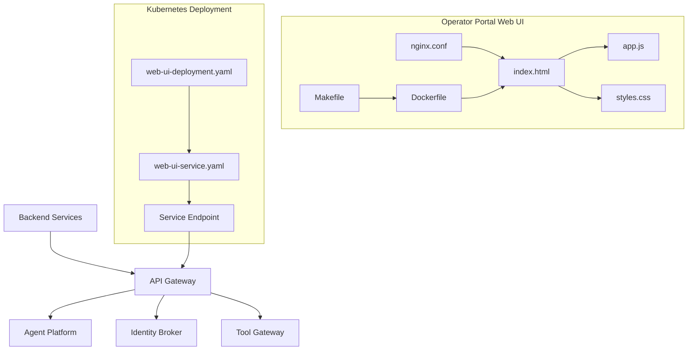
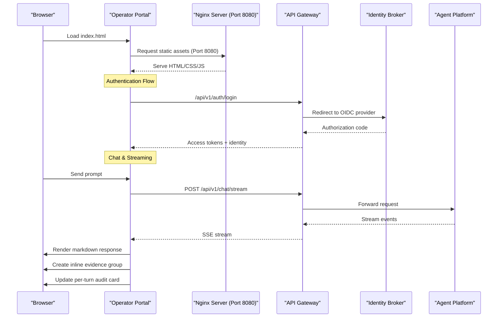
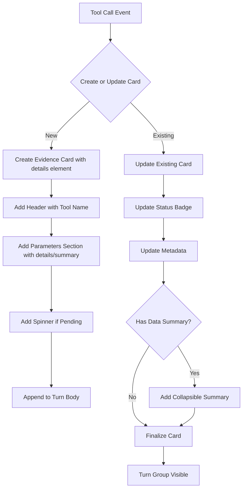

# Operator Portal

<cite>
**Referenced Files in This Document**
- [index.html](file://products/operator-portal/web-ui/index.html)
- [app.js](file://products/operator-portal/web-ui/app.js)
- [styles.css](file://products/operator-portal/web-ui/styles.css)
- [nginx.conf](file://products/operator-portal/nginx.conf)
- [Dockerfile](file://products/operator-portal/Dockerfile)
- [Makefile](file://products/operator-portal/Makefile)
- [README.md](file://products/operator-portal/README.md)
- [web-ui-deployment.yaml](file://shared/platform-ops/gitops/dev-k8s/base/operator-portal/web-ui-deployment.yaml)
- [web-ui-service.yaml](file://shared/platform-ops/gitops/dev-k8s/base/operator-portal/web-ui-service.yaml)
- [image.mk](file://mk/image.mk)
</cite>

## Update Summary
**Changes Made**
- Replaced separate evidence drawer with inline per-turn evidence system
- Implemented turn-scoped state management with currentTurn object and evidenceTurns array
- Added collapsible turn groups rendered directly after agent responses
- Enhanced live call statistics with real-time status tracking (pending, success, error, denied)
- Improved streaming behavior with sticky smart-scroll functionality
- Updated CSS styling for enhanced visual hierarchy and improved user experience
- Refined JavaScript logic for evidence panel state management and per-turn audit cards

## Table of Contents
1. [Introduction](#introduction)
2. [Project Structure](#project-structure)
3. [Core Components](#core-components)
4. [Architecture Overview](#architecture-overview)
5. [Detailed Component Analysis](#detailed-component-analysis)
6. [Inline Per-Turn Evidence System](#inline-per-turn-evidence-system)
7. [Authentication and Security](#authentication-and-security)
8. [Markdown Rendering System](#markdown-rendering-system)
9. [Real-time Streaming Interface](#real-time-streaming-interface)
10. [Deployment Guide](#deployment-guide)
11. [UI Customization](#ui-customization)
12. [Accessibility Features](#accessibility-features)
13. [Browser Compatibility](#browser-compatibility)
14. [Troubleshooting Guide](#troubleshooting-guide)
15. [Conclusion](#conclusion)

## Introduction

The Operator Portal is a modern web-based administrative interface designed for platform administration and monitoring within the Luban AIOPS ecosystem. Built with vanilla JavaScript and HTML/CSS, it provides operators with a sophisticated chat-based interface for interacting with AI agents, monitoring service health, tracking resource utilization, and managing operational controls across the platform's microservices architecture.

The portal serves as a centralized control plane for platform administrators, offering real-time visibility into system status through an interactive chat interface, comprehensive evidence panels for tool execution tracking, configuration management capabilities, and administrative functions necessary for maintaining the AI-powered agent platform infrastructure.

**Updated** The portal now features a significantly enhanced inline per-turn evidence system that replaces the previous separate evidence drawer. The new implementation provides turn-scoped state management, collapsible turn groups rendered directly after agent responses, live call statistics with real-time status tracking, and improved streaming behavior with sticky smart-scroll functionality that respects user reading positions.

## Project Structure

The Operator Portal follows a clean, modular architecture with separation of concerns between presentation layer (HTML), styling (CSS), and application logic (JavaScript). The project structure is organized as follows:



**Diagram sources**
- [index.html](file://products/operator-portal/web-ui/index.html)
- [app.js](file://products/operator-portal/web-ui/app.js)
- [nginx.conf](file://products/operator-portal/nginx.conf)
- [web-ui-deployment.yaml](file://shared/platform-ops/gitops/dev-k8s/base/operator-portal/web-ui-deployment.yaml)

**Section sources**
- [index.html](file://products/operator-portal/web-ui/index.html)
- [app.js](file://products/operator-portal/web-ui/app.js)
- [styles.css](file://products/operator-portal/web-ui/styles.css)

## Core Components

The Operator Portal consists of several key components that work together to provide a comprehensive administrative interface:

### Frontend Architecture
- **Chat-Based Interface**: Modern single-page application with real-time streaming responses
- **Inline Per-Turn Evidence System**: Sophisticated turn-scoped evidence grouping with collapsible groups rendered directly after agent responses
- **Authentication System**: OIDC integration with automatic token refresh and session management
- **Markdown Renderer**: Comprehensive text formatting with syntax highlighting support
- **Responsive Design**: Dark theme with mobile-first approach and accessibility features

### Backend Integration
- **Streaming API Client**: Real-time communication with backend services via Server-Sent Events
- **Authentication Handler**: Seamless integration with identity broker for secure access
- **Session Management**: Persistent session handling with automatic refresh mechanisms
- **Error Handling**: Comprehensive error management with user-friendly feedback

### Enhanced Inline Evidence System
- **Per-turn Evidence Grouping**: Organized evidence by conversation turns with collapsible groups rendered inline
- **Turn-based Organization**: Each conversation turn maintains its own evidence context and state using currentTurn object
- **Live Status Metrics**: Real-time counters for pending, success, error, and denied states with formatCounts function
- **Per-turn Audit Cards**: Comprehensive aggregation of tool executions per conversation turn with tabular display
- **Sticky Smart-scroll**: Intelligent scrolling behavior that respects user reading position during streaming
- **Metadata Display**: Source systems, duration, risk levels, and execution timestamps

### Deployment Components
- **Container Image**: Dockerized application using nginxinc/nginx-unprivileged:1.27-alpine for non-root execution
- **Kubernetes Resources**: Deployment and service definitions with enhanced security context
- **Configuration Management**: Environment-specific settings and secrets

**Updated** The evidence panel system has been completely redesigned as an inline per-turn evidence system with turn-scoped state management, collapsible turn groups rendered directly after agent responses, live status metrics, per-turn audit cards, and intelligent streaming behavior with sticky smart-scroll functionality.

**Section sources**
- [app.js](file://products/operator-portal/web-ui/app.js)
- [Dockerfile](file://products/operator-portal/Dockerfile)
- [web-ui-deployment.yaml](file://shared/platform-ops/gitops/dev-k8s/base/operator-portal/web-ui-deployment.yaml)

## Architecture Overview

The Operator Portal follows a modern single-page application (SPA) architecture built with vanilla JavaScript, providing a responsive and interactive user experience without relying on heavy frameworks.



**Diagram sources**
- [index.html](file://products/operator-portal/web-ui/index.html)
- [app.js](file://products/operator-portal/web-ui/app.js)
- [nginx.conf](file://products/operator-portal/nginx.conf)

The architecture emphasizes simplicity, performance, and maintainability while providing enterprise-grade functionality for platform operations.

## Detailed Component Analysis

### HTML Structure and Layout

The main HTML document defines the semantic structure of the operator portal, organizing content into logical sections for the chat-based interface:

- **Top Bar**: Navigation, user authentication status, and global controls
- **Chat Main Area**: Primary interaction space with message history and real-time streaming where evidence groups are rendered inline
- **Input Bar**: Fixed bottom input area for prompts and commands
- **Settings Drawer**: Collapsible configuration panel for debugging and setup

### JavaScript Application Logic

The JavaScript application implements core functionality including:

#### Chat Interface Management
- **Real-time Streaming**: Server-Sent Events for live response updates
- **Message History**: Persistent conversation display with user and agent messages
- **Sticky Smart-scroll**: Intelligent scrolling that respects user reading position during streaming
- **Input Handling**: Keyboard shortcuts and form validation

#### Enhanced Inline Evidence System
- **Per-turn Evidence Grouping**: Organizes evidence by conversation turns with collapsible groups rendered inline after agent responses
- **Turn-based Organization**: Uses currentTurn object to track active conversation turn with anchor, group, body, summaryLine, counts, entries, and cardMap properties
- **Evidence Turn Management**: Lazy creation of evidence groups on first tool frame with ensureCurrentTurn function
- **Live Status Metrics**: Real-time counters tracking pending, success, error, and denied states with formatCounts function
- **Per-turn Audit Cards**: Comprehensive aggregation of tool executions with metadata display in tabular format
- **Evidence Summary**: Dynamic summary line showing current turn statistics with collapsible details element

#### Authentication State Management
- **OIDC Integration**: Complete login flow with authorization code exchange
- **Token Refresh**: Automatic background refresh 60 seconds before expiry
- **Session Persistence**: Secure storage of authentication state in sessionStorage
- **Identity Normalization**: Support for custom identity contexts and group membership

#### Markdown Rendering Engine
- **Comprehensive Formatting**: Headers, lists, code blocks, tables, links, and blockquotes
- **Syntax Highlighting**: Language-specific code block styling
- **Security**: HTML escaping and safe content rendering
- **Performance**: Efficient string processing and DOM manipulation

**Updated** The evidence panel system has been completely redesigned as an inline per-turn evidence system with turn-scoped state management, collapsible turn groups rendered directly after agent responses, live status metrics, per-turn audit cards, and improved streaming behavior with sticky smart-scroll.

**Section sources**
- [app.js](file://products/operator-portal/web-ui/app.js)

### CSS Styling System

The styling system provides a comprehensive design foundation with:

#### Design Tokens
- **Dark Theme**: Modern color palette optimized for extended use
- **Typography Scale**: Inter font family with responsive sizing
- **Spacing System**: Consistent margins and padding throughout
- **Animation Effects**: Smooth transitions and loading indicators

#### Component Styles
- **Chat Messages**: Distinct styling for user and agent messages
- **Inline Evidence Groups**: Professional collapsible interface with native browser details element behavior
- **Per-turn Groups**: Enhanced styling for turn-based evidence organization with evidence-turn class
- **Audit Cards**: Table-based layout for comprehensive tool execution tracking with audit-card class
- **Settings Panel**: Grid-based layout for configuration options
- **Responsive Design**: Mobile-first approach with adaptive layouts

#### Accessibility Features
- **High Contrast**: WCAG 2.1 AA compliant color ratios
- **Keyboard Navigation**: Full keyboard operability with visible focus indicators
- **Screen Reader Support**: Semantic HTML and ARIA labels
- **Reduced Motion**: Respects user motion preferences

**Section sources**
- [styles.css](file://products/operator-portal/web-ui/styles.css)

## Inline Per-Turn Evidence System

The Evidence Panel has been completely redesigned as an inline per-turn evidence grouping system with turn-based organization, providing superior accessibility and user experience for tool execution visualization.

### Per-turn Evidence Grouping Architecture

The evidence panel now uses a sophisticated per-turn grouping system that organizes evidence by conversation turns:

- **Current Turn Management**: Uses `currentTurn` object to track the active conversation turn with properties including anchor, group, body, summaryLine, counts, entries, and cardMap
- **Lazy Group Creation**: Evidence groups are created lazily on the first tool frame using ensureCurrentTurn function to avoid empty groups for purely conversational turns
- **Collapsible Turn Groups**: Each turn is wrapped in a collapsible `<details>` element with evidence-turn class for better organization
- **Automatic Turn Creation**: New turns are created at the start of each streamPrompt() call with fresh state
- **Turn Lifecycle**: Turns are automatically cleaned up when stream completes or errors occur

### Live Status Metrics

The evidence system includes a dynamic summary line that provides real-time status information:

- **Call Counters**: Total number of tool calls in the current turn tracked in currentTurn.counts.calls
- **Status Breakdown**: Separate counts for pending, success, error, and denied states updated in real-time
- **Real-time Updates**: Instant reflection of tool execution status changes through renderToolResult function
- **Compact Display**: Condensed summary format using formatCounts function that fits in the evidence group summary
- **Visual Indicators**: Color-coded status badges with pending (gray), success (green), error (red), and denied (red) states

### Per-turn Audit Cards

Each conversation turn generates a comprehensive audit card that aggregates all tool executions:

- **Turn Aggregation**: Groups all tool calls from a single user prompt/response cycle in currentTurn.entries array
- **Tabular Display**: Clean table format showing tool name, status, timing, and metadata with columns for tool, status, executed at, duration, risk, and source
- **Request Context**: Includes session ID and request ID for traceability displayed in evidence-meta section
- **Expandable Details**: Native collapsible behavior with details element for detailed inspection
- **Metadata Display**: Source systems, duration, risk levels, and execution timestamps

### Sticky Smart-scroll Behavior

The streaming interface now includes intelligent scrolling behavior:

- **User Position Awareness**: Detects when users are near the bottom of the chat using isNearBottom function with threshold parameter
- **Non-disruptive Scrolling**: Only auto-scrolls when users are actively reading using scrollToBottom function with force parameter
- **Respectful Interaction**: Doesn't yank viewport away from content users are examining during streaming updates
- **Smooth Experience**: Maintains natural reading flow during streaming updates with proper scroll positioning

### Evidence Card Implementation



**Diagram sources**
- [app.js:472-597](file://products/operator-portal/web-ui/app.js#L472-L597)
- [index.html:21-27](file://products/operator-portal/web-ui/index.html#L21-L27)

### Status Management System

The enhanced evidence panel tracks multiple execution states with visual indicators:

- **Pending**: Initial state with spinner animation and gray badge, incremented in renderToolCall function
- **Success**: Green badge indicating successful completion, decremented pending count in renderToolResult
- **Error**: Red badge with error details and codes, displays error message in evidence-meta section
- **Denied**: Security-related denials with policy enforcement context, styled with warning colors

### Metadata and Context

Each evidence card displays relevant execution metadata:

- **Source Systems**: Originating service or component from evidence.source_system
- **Duration Metrics**: Execution time in milliseconds from evidence.duration_ms
- **Risk Levels**: Security classification of operations from evidence.risk_level
- **Execution Timestamps**: When operations were performed from evidence.executed_at
- **Audit Trail**: Comprehensive per-turn aggregation with renderAuditCard function

**Section sources**
- [app.js:446-643](file://products/operator-portal/web-ui/app.js#L446-L643)
- [index.html:21-27](file://products/operator-portal/web-ui/index.html#L21-L27)
- [styles.css:322-445](file://products/operator-portal/web-ui/styles.css#L322-L445)

## Authentication and Security

The Operator Portal implements comprehensive authentication and security features using OpenID Connect (OIDC) protocol with automatic session management.

### OIDC Integration Flow

The authentication system supports complete OIDC flows:

- **Login Initiation**: Redirect to identity provider with PKCE flow
- **Code Exchange**: Secure authorization code exchange for tokens
- **State Validation**: CSRF protection with state parameter verification
- **Session Storage**: Secure token storage in sessionStorage

### Token Management

Automatic token lifecycle management ensures seamless user experience:

- **Access Token Refresh**: Silent refresh 60 seconds before expiration
- **Refresh Token Handling**: Background renewal of expired sessions
- **Graceful Degradation**: Fallback to cached identity when refresh fails
- **Logout Support**: Complete logout with ID token hint

### Security Context

Enhanced security measures protect against common vulnerabilities:

- **Non-root Execution**: Container runs as unprivileged user (UID 101)
- **Security Context**: Proper Kubernetes security policies applied
- **CORS Configuration**: Strict cross-origin request policies
- **Content Security**: Safe HTML rendering with proper escaping

### Identity Management

Flexible identity handling supports various scenarios:

- **Authenticated Users**: Full access with verified identity
- **Demo Mode**: Local development with simulated identities
- **Group Membership**: Role-based access control integration
- **Custom Claims**: Support for organization-specific identity attributes

**Section sources**
- [app.js:107-413](file://products/operator-portal/web-ui/app.js#L107-L413)
- [web-ui-deployment.yaml:22-27](file://shared/platform-ops/gitops/dev-k8s/base/operator-portal/web-ui-deployment.yaml#L22-L27)

## Markdown Rendering System

The Operator Portal includes a comprehensive markdown rendering engine that transforms plain text into rich, formatted HTML content for display in the chat interface.

### Supported Markdown Features

The renderer supports extensive markdown syntax:

- **Headers**: Six levels of heading hierarchy (h1-h6)
- **Text Formatting**: Bold, italic, strikethrough, and emphasis
- **Lists**: Ordered and unordered lists with nested support
- **Code Blocks**: Syntax-highlighted code with language specification
- **Inline Code**: Monospace formatting for inline code snippets
- **Links**: Hyperlinks with external target support
- **Blockquotes**: Nested quote blocks with visual styling
- **Tables**: Structured data presentation with headers and alignment
- **Horizontal Rules**: Visual separators for content organization

### Security Considerations

The markdown renderer implements multiple security measures:

- **HTML Escaping**: All user input is escaped before processing using escapeHtml function
- **Safe Link Handling**: External links open in new tabs with security attributes
- **XSS Prevention**: No raw HTML injection or script execution
- **Content Sanitization**: Removal of potentially dangerous elements

### Performance Optimization

Efficient rendering ensures smooth user experience:

- **Incremental Processing**: Progressive text updates during streaming
- **DOM Manipulation**: Minimal DOM operations for optimal performance
- **Memory Management**: Proper cleanup of temporary objects
- **String Processing**: Optimized regex patterns for fast parsing

### Styling and Theming

Consistent visual presentation across all rendered content:

- **Theme Integration**: Dark theme with accent colors and proper contrast
- **Code Styling**: Monospace fonts with syntax highlighting support
- **Responsive Design**: Adapts to different screen sizes and orientations
- **Accessibility**: Proper semantic markup for screen readers

**Section sources**
- [app.js:21-87](file://products/operator-portal/web-ui/app.js#L21-L87)
- [styles.css:245-321](file://products/operator-portal/web-ui/styles.css#L245-L321)

## Real-time Streaming Interface

The Operator Portal implements a sophisticated real-time streaming interface using Server-Sent Events (SSE) for live chat responses and tool execution updates.

### Streaming Architecture

The streaming system handles real-time communication efficiently:

- **Server-Sent Events**: Native browser API for server-to-client updates
- **Event Parsing**: Robust JSON event parsing with error handling
- **Buffer Management**: Efficient text buffer handling for large responses
- **Connection Recovery**: Automatic reconnection on network interruptions

### Message Type Handling

Different event types are processed appropriately:

- **Message Delta**: Incremental text updates for streaming responses
- **Tool Calls**: Evidence drawer updates for tool execution via renderToolCall function
- **Tool Results**: Completion notifications with status and data via renderToolResult function
- **Stream Completion**: Finalization signals for response ending

### User Experience Features

Intuitive streaming interface enhances usability:

- **Sticky Smart-scroll**: Intelligent scrolling that respects user reading position
- **Placeholder Handling**: Graceful handling of empty or delayed responses
- **Error Display**: User-friendly error messages for connection issues
- **Loading States**: Visual feedback during streaming operations

### Performance Considerations

Optimized for high-frequency updates:

- **Batch Processing**: Efficient event batching for better performance
- **DOM Updates**: Minimal DOM manipulation for smooth animations
- **Memory Management**: Proper cleanup of streaming resources
- **Network Efficiency**: Connection reuse and request optimization

**Section sources**
- [app.js:666-780](file://products/operator-portal/web-ui/app.js#L666-L780)

## Deployment Guide

### Prerequisites

Before deploying the Operator Portal, ensure you have the following prerequisites:

- **Kubernetes Cluster**: Version 1.20 or higher
- **Helm**: Version 3.x for package management
- **kubectl**: Latest stable version configured for your cluster
- **Nginx Ingress Controller**: For external access routing
- **TLS Certificates**: Valid certificates for HTTPS access
- **Identity Provider**: OIDC-compatible identity provider (Keycloak, Auth0, etc.)

### Container Image Build

Build the container image using the provided Makefile:

```bash
cd products/operator-portal
make build
make push
```

### Kubernetes Deployment

Deploy the portal using the provided Kubernetes manifests:

```bash
# Create namespace
kubectl create namespace operator-portal

# Apply deployment
kubectl apply -f shared/platform-ops/gitops/dev-k8s/base/operator-portal/web-ui-deployment.yaml

# Apply service
kubectl apply -f shared/platform-ops/gitops/dev-k8s/base/operator-portal/web-ui-service.yaml
```

### Nginx Configuration

The nginx configuration handles static file serving and reverse proxy setup on port 8080:

- **Static Asset Serving**: Optimized delivery of HTML, CSS, and JavaScript files
- **API Proxying**: Reverse proxy to platform gateway for backend communication
- **Streaming Support**: Configured for long-lived connections and SSE streams with proxy_buffering off
- **Security Headers**: Content Security Policy and other security headers
- **Compression**: Gzip compression for reduced bandwidth usage
- **Non-root Execution**: Runs as unprivileged user for enhanced security

### Environment Configuration

Configure environment variables for the portal deployment:

- **API Gateway URL**: Backend API gateway endpoint
- **Authentication Provider**: Identity broker configuration
- **Logging Level**: Debug, info, warning, or error levels
- **Feature Flags**: Enable/disable specific features

**Updated** Port configuration remains at 8080 for non-root nginx execution with nginxinc/nginx-unprivileged:1.27-alpine base image. The enhanced inline per-turn evidence system with turn-scoped state management and collapsible turn groups is now fully integrated and accessible.

**Section sources**
- [nginx.conf](file://products/operator-portal/nginx.conf)
- [Dockerfile](file://products/operator-portal/Dockerfile)
- [web-ui-deployment.yaml](file://shared/platform-ops/gitops/dev-k8s/base/operator-portal/web-ui-deployment.yaml)
- [web-ui-service.yaml](file://shared/platform-ops/gitops/dev-k8s/base/operator-portal/web-ui-service.yaml)
- [image.mk](file://mk/image.mk)

## UI Customization

The Operator Portal supports extensive UI customization to match organizational branding and preferences.

### Theme Customization

- **Color Schemes**: Primary, secondary, and accent colors via CSS custom properties
- **Typography**: Font families, sizes, and line heights
- **Layout Options**: Compact, standard, and spacious layouts
- **Dark/Light Mode**: Automatic or manual theme switching

### Branding Elements

- **Logo Integration**: Custom logo placement and sizing
- **Favicon Support**: Custom browser tab icons
- **Page Titles**: Customizable page titles and meta descriptions
- **Watermarking**: Optional watermark overlay for sensitive environments

### Layout Customization

- **Widget Configuration**: Show/hide dashboard widgets
- **Column Layouts**: Adjustable grid layouts for different screen sizes
- **Navigation Structure**: Customizable navigation menus
- **Responsive Breakpoints**: Mobile-first responsive design

### Accessibility Customization

- **High Contrast Mode**: Enhanced contrast for better visibility
- **Screen Reader Support**: ARIA labels and semantic markup
- **Keyboard Navigation**: Full keyboard operability
- **Font Scaling**: Support for increased font sizes

**Section sources**
- [styles.css](file://products/operator-portal/web-ui/styles.css)

## Accessibility Features

The Operator Portal is designed with accessibility as a first-class concern, ensuring usability for users with disabilities.

### WCAG Compliance

- **WCAG 2.1 AA Compliance**: Meets Web Content Accessibility Guidelines
- **Semantic HTML**: Proper use of semantic elements and landmarks
- **ARIA Labels**: Comprehensive ARIA attributes for assistive technologies
- **Keyboard Navigation**: Full keyboard operability with visible focus indicators

### Screen Reader Support

- **Descriptive Alt Text**: Meaningful alternative text for images and icons
- **Form Labels**: Properly associated form labels and instructions
- **Error Messages**: Descriptive error messages with suggestions
- **Status Updates**: Live regions for dynamic content updates

### Visual Accessibility

- **Color Contrast**: Minimum 4.5:1 contrast ratio for normal text
- **Text Resizing**: Support for up to 200% text zoom
- **Focus Indicators**: Clear visual focus indicators
- **Reduced Motion**: Respect for user motion preferences

### Cognitive Accessibility

- **Simple Language**: Clear and concise language throughout
- **Consistent Layout**: Predictable navigation and interaction patterns
- **Error Prevention**: Helpful error messages and recovery options
- **Progress Indicators**: Clear feedback for long-running operations

**Section sources**
- [styles.css](file://products/operator-portal/web-ui/styles.css)
- [index.html](file://products/operator-portal/web-ui/index.html)

## Browser Compatibility

The Operator Portal supports modern web browsers with progressive enhancement for broader compatibility.

### Supported Browsers

- **Chrome**: Version 90+ (recommended)
- **Firefox**: Version 88+
- **Safari**: Version 14+
- **Edge**: Version 90+
- **Mobile Safari**: iOS 14+
- **Android Chrome**: Android 10+

### Feature Support

- **ES6+ JavaScript**: Modern JavaScript features with polyfills
- **CSS Grid and Flexbox**: Flexible layout systems
- **Web APIs**: Fetch API, Local Storage, Service Workers, Server-Sent Events
- **Media Queries**: Responsive design capabilities
- **Canvas API**: Chart and graph rendering

### Polyfills and Fallbacks

- **CoreJS**: JavaScript feature polyfills for older browsers
- **Autoprefixer**: CSS vendor prefixing for cross-browser compatibility
- **Babel Transpilation**: ES6+ to ES5 transpilation when needed
- **Graceful Degradation**: Essential functionality works across all supported browsers

### Performance Considerations

- **Lazy Loading**: Deferred loading of non-critical resources
- **Code Splitting**: Modular JavaScript bundles for faster initial load
- **Image Optimization**: Modern image formats with fallbacks
- **Caching Strategy**: Efficient caching for optimal performance

**Section sources**
- [Dockerfile](file://products/operator-portal/Dockerfile)
- [app.js](file://products/operator-portal/web-ui/app.js)

## Troubleshooting Guide

Common issues and their solutions when working with the Operator Portal.

### Connection Issues

**Problem**: Cannot connect to backend services
**Solution**: 
- Verify API gateway URL configuration
- Check network connectivity and firewall rules
- Confirm authentication credentials are valid
- Review nginx configuration for proper routing on port 8080

### Authentication Problems

**Problem**: Login failures or session timeouts
**Solution**:
- Verify identity broker connectivity
- Check token expiration and refresh mechanisms
- Ensure CORS policies allow the portal domain
- Review browser cookie settings and privacy modes

### Performance Issues

**Problem**: Slow dashboard loading or unresponsive interface
**Solution**:
- Check browser developer tools for console errors
- Verify network request timing and response sizes
- Review server-side API performance and database queries
- Optimize image and asset loading strategies

### Deployment Issues

**Problem**: Kubernetes deployment failures
**Solution**:
- Check pod logs for error messages
- Verify resource quotas and limits
- Ensure proper RBAC permissions
- Validate configuration secrets and configmaps
- Confirm non-root execution permissions are properly configured

### Port Configuration Issues

**Problem**: Service not accessible on expected port
**Solution**:
- Verify nginx is listening on port 8080
- Check Kubernetes service port mappings
- Ensure ingress controller routes traffic correctly
- Review firewall rules allowing port 8080

### Streaming Message Issues

**Problem**: Stream completes with no visible text or missing delta events
**Solution**:
- Verify streaming endpoint returns proper event format with 'type' field
- Check that message_delta events contain valid delta content
- Ensure stream completion events are properly handled
- Review browser console for JavaScript errors in streaming logic
- Confirm nginx proxy configuration allows streaming responses

### Inline Evidence System Issues

**Problem**: Evidence groups not appearing or showing incorrect data
**Solution**:
- Verify tool_call and tool_result events are being sent
- Check evidence group visibility and CSS styling for evidence-turn class
- Review browser console for JavaScript errors in ensureCurrentTurn function
- Ensure proper event type detection in streamEventType function
- Verify evidence card creation and update logic in renderToolCall and renderToolResult functions
- Check that HTML details elements are properly structured with evidence-turn-body class
- Confirm per-turn evidence grouping is working correctly with currentTurn object

### Per-turn Evidence Issues

**Problem**: Evidence not grouped by turns or turn groups not collapsing
**Solution**:
- Verify currentTurn object is properly maintained with all required properties
- Check turn creation logic in streamPrompt function and ensureCurrentTurn function
- Ensure collapsible turn groups are created with proper details elements and evidence-turn class
- Review turn counter increment and turn limit enforcement in formatCounts function
- Check evidence summary rendering for turn statistics with evidence-summary class

### Authentication State Issues

**Problem**: Authentication state not persisting or refreshing incorrectly
**Solution**:
- Check sessionStorage for proper token storage
- Verify OIDC callback handling and state validation
- Review automatic token refresh scheduling with scheduleTokenRefresh function
- Ensure proper logout and session cleanup procedures

### Sticky Scroll Issues

**Problem**: Auto-scroll not working correctly during streaming
**Solution**:
- Verify chat-main element has proper overflow and height settings
- Check isNearBottom function logic for scroll threshold calculation
- Ensure scrollToBottom function is called appropriately during streaming
- Review CSS for any conflicting overflow or positioning styles

**Updated** Added troubleshooting guidance for the enhanced inline per-turn evidence system, including turn-scoped state management, collapsible turn groups, live status metrics, sticky smart-scroll behavior, and per-turn audit card generation.

**Section sources**
- [app.js](file://products/operator-portal/web-ui/app.js)

## Conclusion

The Operator Portal provides a comprehensive, accessible, and customizable web interface for platform administration and monitoring within the Luban AIOPS ecosystem. Built with vanilla JavaScript and modern web standards, it delivers enterprise-grade functionality while maintaining simplicity and performance.

The recent enhancements introduce a significantly improved inline per-turn evidence system that replaces the previous separate evidence drawer. The new implementation provides turn-scoped state management with currentTurn object, collapsible turn groups rendered directly after agent responses, live status metrics with real-time tool execution tracking, per-turn audit cards for comprehensive execution history, and intelligent streaming behavior with sticky smart-scroll functionality that respects user reading positions.

Key strengths of the portal include its modular architecture, extensive customization options, strong accessibility features, and seamless integration with backend services. The deployment process is streamlined through containerization and Kubernetes-native configurations, making it suitable for both development and production environments.

**Updated** Recent enhancements include the complete redesign of the evidence panel system as an inline per-turn evidence system with turn-scoped state management, collapsible turn groups rendered directly after agent responses, live status metrics for real-time tool execution tracking, per-turn audit cards for comprehensive execution history, and improved streaming behavior with sticky smart-scroll functionality. These improvements significantly enhance the operator experience by providing intuitive interaction patterns, deep visibility into agent behavior, and reliable real-time communication with backend services.

The enhanced inline per-turn evidence system provides unprecedented visibility into agent tool execution, enabling operators to understand and debug complex workflows in real-time. The turn-scoped state management with currentTurn object ensures excellent organization and accessibility. The per-turn audit cards offer comprehensive aggregation of tool executions with detailed metadata display in tabular format.

For ongoing maintenance and enhancement, the codebase follows best practices for vanilla JavaScript development, ensuring long-term maintainability and ease of contribution. The comprehensive documentation and troubleshooting guides support effective operation and problem resolution.

Future enhancements may include additional dashboard widgets, advanced analytics capabilities, mobile app integration, expanded customization options, and enhanced collaboration features to meet evolving operational requirements.