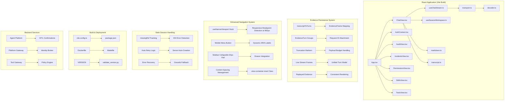
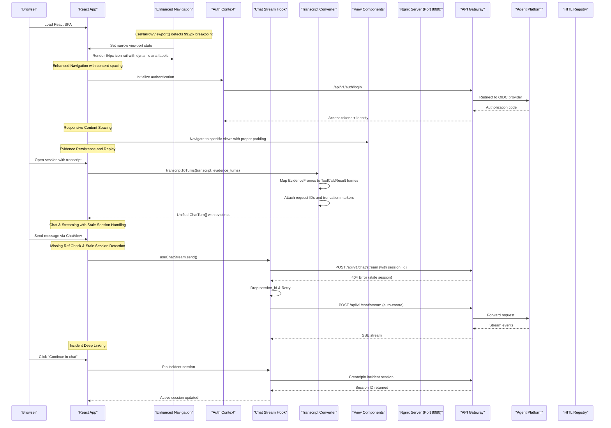

# Operator Portal

<cite>
**Referenced Files in This Document**
- [App.tsx](file://products/operator-portal/web-ui/app/src/App.tsx)
- [global.css](file://products/operator-portal/web-ui/app/src/theme/global.css)
- [ChatView.tsx](file://products/operator-portal/web-ui/app/src/chat/ChatView.tsx)
- [markdown.ts](file://products/operator-portal/web-ui/app/src/chat/markdown.ts)
- [useChatStream.ts](file://products/operator-portal/web-ui/app/src/stream/useChatStream.ts)
- [transport.ts](file://products/operator-portal/web-ui/app/src/stream/transport.ts)
- [AuthContext.tsx](file://products/operator-portal/web-ui/app/src/auth/AuthContext.tsx)
- [useSessionWorkspace.ts](file://products/operator-portal/web-ui/app/src/sessions/useSessionWorkspace.ts)
- [roles.ts](file://products/operator-portal/web-ui/app/src/roles.ts)
- [tokens.ts](file://products/operator-portal/web-ui/app/src/theme/tokens.ts)
- [version.ts](file://products/operator-portal/web-ui/app/src/version.ts)
- [vite.config.ts](file://products/operator-portal/web-ui/app/vite.config.ts)
- [package.json](file://products/operator-portal/web-ui/app/package.json)
- [index.html](file://products/operator-portal/web-ui/app/index.html)
- [nginx.conf](file://products/operator-portal/nginx.conf)
- [Dockerfile](file://products/operator-portal/Dockerfile)
- [Makefile](file://products/operator-portal/Makefile)
- [README.md](file://products/operator-portal/README.md)
- [web-ui-deployment.yaml](file://shared/platform-ops/gitops/dev-k8s/base/operator-portal/web-ui-deployment.yaml)
- [web-ui-service.yaml](file://shared/platform-ops/gitops/dev-k8s/base/operator-portal/web-ui-service.yaml)
- [image.mk](file://mk/image.mk)
- [VERSION](file://VERSION)
- [validate_version.py](file://shared/shared-contracts/scripts/validate_version.py)
- [hitl_confirmations.py](file://products/agent-platform/src/agent_service/services/hitl_confirmations.py)
- [2026-08-21-hitl-confirmation-bridging.md](file://docs/agentic-aiops-platform/release-notes/2026-08-21-hitl-confirmation-bridging.md)
- [AuditView.tsx](file://products/operator-portal/web-ui/app/src/views/audit/AuditView.tsx)
- [IncidentsView.tsx](file://products/operator-portal/web-ui/app/src/views/incidents/IncidentsView.tsx)
- [PermissionsView.tsx](file://products/operator-portal/web-ui/app/src/views/control/PermissionsView.tsx)
- [SkillsView.tsx](file://products/operator-portal/web-ui/app/src/views/control/SkillsView.tsx)
- [ToolsView.tsx](file://products/operator-portal/web-ui/app/src/views/control/ToolsView.tsx)
- [useSpeechRecognition.ts](file://products/operator-portal/web-ui/app/src/voice/useSpeechRecognition.ts)
- [languages.ts](file://products/operator-portal/web-ui/app/src/voice/languages.ts)
- [markdown.test.ts](file://products/operator-portal/web-ui/app/src/chat/__tests__/markdown.test.ts)
- [useChatStream.test.ts](file://products/operator-portal/web-ui/app/src/stream/__tests__/useChatStream.test.ts)
- [transcript.ts](file://products/operator-portal/web-ui/app/src/chat/transcript.ts)
- [sessions.ts](file://products/operator-portal/web-ui/app/src/api/sessions.ts)
- [transcript.test.ts](file://products/operator-portal/web-ui/app/src/chat/__tests__/transcript.test.ts)
</cite>

## Update Summary
**Changes Made**
- Enhanced evidence persistence system to display persisted evidence alongside live conversation data with unified rendering
- Added request ID display in evidence cards for both streamed and replayed evidence
- Implemented truncation markers showing payload size limits and budget constraints
- Unified handling of streamed and replayed evidence through consistent transcript-to-turn conversion
- Added comprehensive test coverage for evidence persistence and replay functionality

## Table of Contents
1. [Introduction](#introduction)
2. [Project Structure](#project-structure)
3. [Core Components](#core-components)
4. [Architecture Overview](#architecture-overview)
5. [Detailed Component Analysis](#detailed-component-analysis)
6. [Enhanced Navigation System](#enhanced-navigation-system)
7. [Role-Gated Audit Trail System](#role-gated-audit-trail-system)
8. [HITL Confirmation Card System](#hitl-confirmation-card-system)
9. [Authentication and Security](#authentication-and-security)
10. [Markdown Rendering System](#markdown-rendering-interface)
11. [Real-time Streaming Interface](#real-time-streaming-interface)
12. [Evidence Persistence and Replay System](#evidence-persistence-and-replay-system)
13. [Skills Integration and Cited Guidance](#skills-integration-and-cited-guidance)
14. [Permission Matrix and Workspace Resources](#permission-matrix-and-workspace-resources)
15. [Multi-Session Workspace Management](#multi-session-workspace-management)
16. [Voice Input Support](#voice-input-support)
17. [Incident Triage and Deep Linking](#incident-triage-and-deep-linking)
18. [Deployment Guide](#deployment-guide)
19. [UI Customization](#ui-customization)
20. [Accessibility Features](#accessibility-features)
21. [Browser Compatibility](#browser-compatibility)
22. [Troubleshooting Guide](#troubleshooting-guide)
23. [Conclusion](#conclusion)

## Introduction

The Operator Portal is a modern web-based administrative interface designed for platform administration and monitoring within the Luban AIOPS ecosystem. The portal has been completely rebuilt using React 18, TypeScript, and Vite, replacing the previous vanilla JavaScript implementation. It provides operators with a sophisticated two-column shell interface featuring a persistent sidebar for navigation and a main content area for interactive operations. The portal serves as a centralized control plane for platform administrators, offering real-time visibility into system status through an interactive chat interface, comprehensive evidence panels for tool execution tracking, configuration management capabilities, and administrative functions necessary for maintaining the AI-powered agent platform infrastructure.

**Updated** The portal now features enhanced evidence persistence capabilities that display persisted evidence alongside live conversation data, including request ID display, truncation markers, and unified handling of streamed and replayed evidence. The evidence system ensures consistency between live streaming and session replay, providing operators with complete traceability regardless of whether they observe tool executions in real-time or review them from stored transcripts. **Critical Enhancement**: The evidence persistence system includes comprehensive truncation markers that clearly indicate when payloads have been evicted due to storage budgets, ensuring operators always understand the completeness of displayed evidence.

## Project Structure

The Operator Portal follows a modular React architecture with clear separation of concerns between components, hooks, utilities, and styling:



**Diagram sources**
- [App.tsx:56-70](file://products/operator-portal/web-ui/app/src/App.tsx#L56-L70)
- [App.tsx:288-307](file://products/operator-portal/web-ui/app/src/App.tsx#L288-L307)
- [App.tsx:334-357](file://products/operator-portal/web-ui/app/src/App.tsx#L334-L357)
- [ChatView.tsx:320-350](file://products/operator-portal/web-ui/app/src/chat/ChatView.tsx#L320-L350)
- [ChatView.tsx:513-596](file://products/operator-portal/web-ui/app/src/chat/ChatView.tsx#L513-L596)
- [transcript.ts:55-70](file://products/operator-portal/web-ui/app/src/chat/transcript.ts#L55-L70)
- [sessions.ts:11-42](file://products/operator-portal/web-ui/app/src/api/sessions.ts#L11-L42)
- [useChatStream.ts:245-268](file://products/operator-portal/web-ui/app/src/stream/useChatStream.ts#L245-L268)
- [markdown.ts:67-91](file://products/operator-portal/web-ui/app/src/chat/markdown.ts#L67-L91)
- [markdown.test.ts:59-77](file://products/operator-portal/web-ui/app/src/chat/__tests__/markdown.test.ts#L59-L77)

**Section sources**
- [App.tsx](file://products/operator-portal/web-ui/app/src/App.tsx)
- [package.json](file://products/operator-portal/web-ui/app/package.json)
- [vite.config.ts](file://products/operator-portal/web-ui/app/vite.config.ts)

## Core Components

The Operator Portal consists of several key React components and hooks that work together to provide a comprehensive administrative interface:

### Frontend Architecture
- **React 18 Components**: Modern component-based architecture with hooks for state management
- **Ant Design Integration**: Professional UI components with dark theme customization
- **Two-Column Shell Layout**: Persistent sidebar with responsive mobile drawer support
- **Enhanced Sectioned Navigation**: Organized navigation with Chat, Control, and Workspace sections
- **Chat-Based Interface**: Real-time streaming responses with turn-based conversation management
- **Inline Per-Turn Evidence System**: Sophisticated turn-scoped evidence grouping with collapsible groups
- **HITL Confirmation Cards**: Inline approval surfaces for ASK-gated tool executions with Approve/Deny buttons
- **Skills Integration**: Enhanced evidence cards with "Cited guidance" chips displaying matched skills
- **Authentication System**: OIDC integration with automatic token refresh and session management
- **Enhanced Markdown Renderer**: Comprehensive text formatting with XSS prevention and syntax highlighting support
- **Responsive Design**: Dark theme with mobile-first approach and accessibility features

### Backend Integration
- **Streaming API Client**: Robust Server-Sent Events implementation with error handling and reconnection
- **HITL Confirmation Bridge**: Seamless integration with agent-platform confirmation registry for pending tool approvals
- **Authentication Handler**: Secure integration with identity broker for authentication and authorization
- **Enhanced Session Management**: Multi-session support with transcript caching, workspace persistence, and defensive parsing
- **Error Handling**: Comprehensive error management with user-friendly feedback and recovery for multiple failure types
- **API v6 Compliance**: Backend schema compliance for risk level handling in pending calls

### Enhanced User Interface
- **Persistent Sidebar**: Branding, identity management, and function navigation with Ant Design Menu
- **User Card System**: Avatar display with initials, username badge, and role information
- **Role-Based Navigation**: Conditional visibility based on user roles and permissions
- **Mobile Drawer**: Off-canvas navigation for narrow screens with proper focus management
- **Settings & Debug Panel**: Configuration management and debugging tools

### Enhanced Navigation System
- **Persistent 64px Icon Rail**: Fixed-width collapsed sidebar that maintains navigation access across all views
- **Responsive Breakpoint Detection**: useNarrowViewport() hook for precise 992px breakpoint handling
- **Collapsible Sidebar**: Desktop sidebar with collapse/expand functionality and consistent layout anchoring
- **Drawer Integration**: Mobile-specific off-canvas navigation below lg breakpoint with proper positioning
- **Dynamic Accessibility**: Context-aware aria-labels that change based on viewport and sidebar state
- **Content Spacing Management**: Automatic padding adjustments via .view-container-inset class

### Sticky Request Banner System
- **IntersectionObserver Implementation**: Tracks when user messages scroll out of viewport
- **Context Maintenance**: Displays sticky banner showing original request during long conversations
- **Visual Correlation**: Maintains relationship between user requests and extended responses
- **Performance Optimization**: Efficient observer cleanup and memory management

### HITL Confirmation System
- **Inline Approval Cards**: Warning-toned bordered cards for pending tool confirmations
- **Role-Based Controls**: Approve/Deny buttons visible only to authorized roles
- **Stream Continuation**: Automatic resumption of parked replies upon decision with SSE streaming
- **Evidence Integration**: Seamless integration with existing evidence card system
- **Status Management**: Visual indicators showing awaiting decision, approved, denied, or expired states

### Stale Session Handling System
- **Missing Reference Tracking**: Uses `missingRef` to track sessions that return 404 errors during history loading
- **Automatic Retry Logic**: When stream opening encounters 404 errors, automatically drops stale session references and retries without session ID
- **Graceful Fallback**: Falls back to server-side session auto-creation when stale sessions are detected
- **Error Recovery**: Handles both successful retries and permanent failures with appropriate user feedback

### Version Management and Cache Busting
- **Version Synchronization**: PLATFORM_VERSION constant injected at build time from root VERSION file
- **Cache-Busting Mechanism**: Query parameter versioning ensures proper client-side caching behavior
- **Validation System**: Automated version consistency checks across all platform components
- **Deployment Consistency**: Coordinated versioning across all platform services

**Updated** The interface now includes enhanced navigation with a persistent 64px icon rail that maintains consistent layout anchoring across all views, improved responsive behavior with precise 992px breakpoint detection, better menu group title handling in collapsed states, and enhanced mobile drawer navigation. The navigation system now maintains accessibility across all views while providing consistent layout anchoring through dynamic aria-labels and proper content spacing management. **Critical Enhancement**: The evidence persistence system now provides unified rendering of both live streamed and replayed evidence, with request ID display, truncation markers, and consistent visual presentation regardless of evidence source. Recent improvements include enhanced authentication state management with proper disabled states for unauthenticated users, improved markdown table rendering with proper header/body separation, visual consistency improvements including inline brand display with platform version tags, and comprehensive test coverage for markdown rendering functionality ensuring robust XSS prevention and security measures. **Critical Enhancement**: The streaming system includes robust stale session handling with automatic retry logic and missing session reference tracking to prevent errors from deleted or expired sessions.

**Section sources**
- [App.tsx:56-70](file://products/operator-portal/web-ui/app/src/App.tsx#L56-L70)
- [App.tsx:288-307](file://products/operator-portal/web-ui/app/src/App.tsx#L288-L307)
- [App.tsx:334-357](file://products/operator-portal/web-ui/app/src/App.tsx#L334-L357)
- [ChatView.tsx:1-790](file://products/operator-portal/web-ui/app/src/chat/ChatView.tsx#L1-L790)
- [useChatStream.ts:1-405](file://products/operator-portal/web-ui/app/src/stream/useChatStream.ts#L1-L405)

## Architecture Overview

The Operator Portal follows a modern React single-page application architecture built with TypeScript and Vite, providing type safety and enhanced developer experience while maintaining performance and maintainability.



**Diagram sources**
- [App.tsx:56-70](file://products/operator-portal/web-ui/app/src/App.tsx#L56-L70)
- [App.tsx:288-307](file://products/operator-portal/web-ui/app/src/App.tsx#L288-L307)
- [App.tsx:334-357](file://products/operator-portal/web-ui/app/src/App.tsx#L334-L357)
- [ChatView.tsx:320-350](file://products/operator-portal/web-ui/app/src/chat/ChatView.tsx#L320-L350)
- [ChatView.tsx:513-596](file://products/operator-portal/web-ui/app/src/chat/ChatView.tsx#L513-L596)
- [transcript.ts:72-106](file://products/operator-portal/web-ui/app/src/chat/transcript.ts#L72-L106)
- [sessions.ts:52-60](file://products/operator-portal/web-ui/app/src/api/sessions.ts#L52-L60)
- [useChatStream.ts:245-268](file://products/operator-portal/web-ui/app/src/stream/useChatStream.ts#L245-L268)
- [IncidentsView.tsx:219-228](file://products/operator-portal/web-ui/app/src/views/incidents/IncidentsView.tsx#L219-L228)
- [useSessionWorkspace.ts:136-159](file://products/operator-portal/web-ui/app/src/sessions/useSessionWorkspace.ts#L136-L159)
- [useChatStream.ts:191-314](file://products/operator-portal/web-ui/app/src/stream/useChatStream.ts#L191-L314)
- [transport.ts:75-100](file://products/operator-portal/web-ui/app/src/stream/transport.ts#L75-L100)

The architecture emphasizes type safety, component composition, and maintainable state management while providing enterprise-grade functionality for platform operations. The React hooks pattern enables clean separation of concerns and reusable logic across components. **Enhanced with evidence persistence** that provides unified rendering of both live streamed and replayed evidence, ensuring operators see consistent evidence cards regardless of whether they're observing tool executions in real-time or reviewing them from stored transcripts. **Critical Enhancement**: The streaming system includes robust stale session handling with automatic retry logic and missing session reference tracking to prevent errors from deleted or expired sessions.

## Detailed Component Analysis

### React Application Structure

The main React application implements a component-based architecture with clear separation of concerns:

#### App Component
- **Layout Management**: Ant Design Layout with responsive sidebar and content areas
- **Navigation State**: Active view management with role-based visibility controls
- **Enhanced Mobile Support**: Persistent 64px icon rail with responsive drawer integration
- **Loading States**: Proper loading indicators during authentication and data fetching
- **View Routing**: Dynamic routing to different view components (chat, incidents, audit, permissions, tools, skills)

#### Enhanced Navigation Implementation
- **useNarrowViewport Hook**: Custom hook for responsive breakpoint detection at 992px
- **Persistent 64px Icon Rail**: Collapsed sidebar that maintains navigation access across all views
- **Drawer Integration**: Mobile-specific off-canvas navigation below lg breakpoint
- **Dynamic ARIA Labels**: Context-aware accessibility labels that change based on viewport and sidebar state
- **Content Spacing Management**: Automatic padding adjustments via .view-container-inset class

#### Enhanced View Components
- **AuditView**: Role-gated audit trail with filtering and pagination
- **IncidentsView**: Incident triage with auto-refresh, manual intake, and detail views
- **PermissionsView**: Live permission matrix display from policy bundle
- **SkillsView**: Browseable skills inventory with source/tag filtering
- **ToolsView**: Read-only tools catalog with risk tier information

#### Authentication Context
- **OIDC Integration**: Complete OpenID Connect flow with PKCE support
- **Token Management**: Automatic refresh and session persistence
- **Error Handling**: Graceful error handling with user feedback
- **State Management**: Centralized authentication state across components

### Enhanced Navigation System

The React implementation provides sophisticated navigation with Ant Design components and enhanced mobile responsiveness:

#### Sectioned Navigation
- **Control Section**: Incidents, Audit trail, and Permissions views
- **Workspace Section**: Tools, Skills, and Settings views
- **Role-Based Visibility**: Dynamic menu items based on user roles
- **Automatic Section Hiding**: Sections hide when all entries are hidden

#### Mobile Responsive Design
- **Persistent 64px Icon Rail**: Fixed-width collapsed sidebar with consistent layout anchoring
- **Responsive Breakpoint Detection**: useNarrowViewport() hook for precise 992px breakpoint handling
- **Drawer Navigation**: Off-canvas sidebar for mobile devices with proper positioning
- **Touch-Friendly**: Larger touch targets and swipe gestures
- **Focus Management**: Proper keyboard navigation and screen reader support
- **Breakpoint Handling**: Correct 992px breakpoint for mobile/desktop switching

### Session Workspace Management

The multi-session workspace provides comprehensive session management with enhanced defensive parsing:

#### Session List
- **Real-Time Updates**: 30-second polling for session list updates
- **Active Session Persistence**: Session selection persists across page reloads
- **Pinned Sessions**: Support for incident deep-link sessions
- **Delete Operations**: Safe session deletion with conflict resolution

#### Transcript Management
- **Lazy Loading**: Sessions load transcripts on demand
- **Caching**: In-memory caching prevents redundant API calls
- **History Seeding**: Resumed sessions render like live conversations
- **Defensive Parsing**: Enhanced parseStored function handles malformed or corrupted session data

### Stale Session Handling Implementation

The chat interface now includes comprehensive stale session handling to prevent errors from deleted or expired sessions:

#### Missing Reference Tracking
- **missingRef Usage**: Uses `useRef(new Set<string>())` to track sessions that return 404 errors during history loading
- **Prevention Logic**: When a session is known to be missing, sets session to null to prevent stream pointer usage
- **Auto-Creation Flow**: Next message automatically creates fresh session instead of failing

#### Automatic Retry Logic
- **404 Detection**: When stream opening encounters 404 errors, automatically drops stale session references
- **Retry Mechanism**: Retries once without session ID to trigger server-side auto-creation
- **Error Propagation**: If retry also fails, surfaces appropriate error to user
- **Session State Management**: Clears sessionIdRef.current to prevent future attempts with stale session

#### Error Recovery Strategies
- **Graceful Degradation**: Falls back to empty session when history loading fails
- **User Feedback**: Provides clear error messages for different failure scenarios
- **Recovery Options**: Offers retry mechanisms and alternative actions for failed operations

### Sticky Request Banner System

The chat interface includes a sophisticated sticky request banner system that maintains conversation context during long interactions:

#### IntersectionObserver Implementation
- **User Message Tracking**: Monitors when user bubbles scroll out of the chat viewport
- **Context Preservation**: Displays sticky banner showing original user request during extended responses
- **Performance Optimization**: Efficient observer setup and cleanup to prevent memory leaks
- **Scroll Container Awareness**: Observes within the chat-messages container for accurate visibility detection

#### Visual Design and Behavior
- **Sticky Positioning**: Banner appears when user message scrolls out of view
- **Compact Display**: Shows truncated request text with "Request" label
- **Hover Information**: Full request text available via title attribute
- **Smooth Transitions**: CSS transitions for banner appearance and disappearance

#### Conversation Context Benefits
- **Long Reply Support**: Maintains correlation between requests and extended responses
- **Evidence Panel Context**: Keeps user intent visible during expanded evidence review
- **Multi-turn Clarity**: Helps operators track conversation flow during complex interactions
- **Accessibility**: Provides additional context for screen readers and keyboard navigation

### HITL Confirmation System

The inline confirmation card provides a focused interface for reviewing and deciding on tool executions:

#### Card Components
- **Warning Header**: Yellow-bordered card with "Tool confirmation required" title and "awaiting decision" status badge
- **Message Display**: Clear explanation of why confirmation is needed
- **Tool Details**: Expandable sections showing tool name and parameters for review
- **Action Buttons**: Prominent Approve (green) and Deny (red) buttons for authorized users
- **Status Line**: Real-time status updates showing "Approving…"/"Denying…" during processing

#### Role-Based Visibility
- **Authorized Roles**: platform-admin, approver, operator, developer roles can see and interact with confirmation buttons
- **Read-Only Access**: Other roles see a message indicating they cannot approve or deny tool confirmations
- **Server-Side Enforcement**: Gateway validates chat:confirm permission on every confirmation request

#### Visual Feedback
- **Pending State**: Yellow border and pulsing status indicator while awaiting decision
- **Processing State**: Disabled buttons with "Approving…"/"Denying…" status during decision processing
- **Resolved State**: Border changes to standard gray, buttons disabled, final status displayed
- **Error Handling**: Clear error messages for network failures, timeouts, and permission issues

### Version Management and Cache Busting
- **Version Synchronization**: PLATFORM_VERSION constant injected at build time from root VERSION file
- **Cache-Busting Mechanism**: Query parameter versioning ensures proper client-side caching behavior
- **Validation System**: Automated version consistency checks across all platform components
- **Deployment Consistency**: Coordinated versioning across all platform services

**Updated** The React architecture provides better type safety, component reusability, and maintainability while preserving all existing functionality from the legacy implementation. The new view components provide dedicated interfaces for different operational tasks. Enhanced session management now includes defensive parsing to handle edge cases in stored session data. The enhanced navigation system includes a persistent 64px icon rail that maintains consistent layout anchoring across all views, improved responsive behavior with precise 992px breakpoint detection, better menu group title handling in collapsed states, and enhanced mobile drawer navigation with proper positioning and z-index management. The new sticky request banner system enhances conversation usability during long interactions. **Critical Enhancement**: The evidence persistence system provides unified rendering of both live streamed and replayed evidence, ensuring operators see consistent evidence cards with request ID display and truncation markers regardless of evidence source. The stale session handling system now includes comprehensive missing reference tracking and automatic retry logic to prevent errors from deleted or expired sessions, ensuring more reliable chat functionality.

**Section sources**
- [App.tsx:56-70](file://products/operator-portal/web-ui/app/src/App.tsx#L56-L70)
- [App.tsx:288-307](file://products/operator-portal/web-ui/app/src/App.tsx#L288-L307)
- [App.tsx:334-357](file://products/operator-portal/web-ui/app/src/App.tsx#L334-L357)
- [ChatView.tsx:1-790](file://products/operator-portal/web-ui/app/src/chat/ChatView.tsx#L1-L790)
- [useChatStream.ts:1-405](file://products/operator-portal/web-ui/app/src/stream/useChatStream.ts#L1-L405)
- [useSessionWorkspace.ts:1-174](file://products/operator-portal/web-ui/app/src/sessions/useSessionWorkspace.ts#L1-L174)

### CSS Styling System

The styling system maintains design consistency while leveraging Ant Design's theming with enhanced navigation support:

#### Design Tokens
- **Dark Theme**: Modern color palette optimized for extended use
- **Typography Scale**: Inter font family with responsive sizing
- **Spacing System**: Consistent margins and padding throughout
- **Animation Effects**: Smooth transitions and loading indicators

#### Component Styles
- **User Card**: Avatar display with initials, username badge, and role information
- **Navigation Items**: Clean button styling with active state indicators
- **Chat Messages**: Distinct styling for user and agent messages
- **Evidence Panels**: Professional collapsible interface with native browser details element behavior
- **Cited Guidance Chips**: Specialized styling for skill citation chips
- **Audit Trail Tables**: Responsive tables with sticky headers and expandable detail rows
- **Settings Panel**: Grid-based layout for configuration options
- **Mobile Drawer**: Slide-in navigation with backdrop overlay

#### Enhanced Navigation Styling
- **Persistent 64px Icon Rail**: Fixed-width collapsed sidebar with consistent layout anchoring
- **Responsive Breakpoints**: Correct 992px breakpoint for mobile/desktop switching
- **Content Spacing Management**: Automatic adjustment via .view-container-inset class for non-flush views
- **Sidebar Brand Padding**: Proper spacing to prevent content overlap with navigation trigger
- **Chat View Padding**: Specific padding adjustments for flush chat views to avoid header overlap

#### Sticky Request Banner Styling
- **Sticky Positioning**: Fixed positioning when user message scrolls out of view
- **Compact Design**: Minimal visual footprint with essential request information
- **Transition Effects**: Smooth appearance and disappearance animations
- **Hover States**: Full request text availability through title attributes

#### HITL Confirmation Card Styling
- **Warning Border**: Yellow border indicating pending decision required
- **Locked State**: Border changes to standard when confirmation is resolved
- **Action Buttons**: Green approve button and red deny button with hover effects
- **Status Messages**: Clear status indicators for awaiting decision, approving/denying, and final states

**Section sources**
- [global.css:66-119](file://products/operator-portal/web-ui/app/src/theme/global.css#L66-L119)
- [global.css:121-132](file://products/operator-portal/web-ui/app/src/theme/global.css#L121-L132)
- [global.css:365-407](file://products/operator-portal/web-ui/app/src/theme/global.css#L365-L407)
- [global.css:409-444](file://products/operator-portal/web-ui/app/src/theme/global.css#L409-L444)
- [tokens.ts:1-43](file://products/operator-portal/web-ui/app/src/theme/tokens.ts#L1-L43)

## Enhanced Navigation System

The Operator Portal features a sophisticated navigation system with sectioned organization and role-based visibility controls, implemented using Ant Design components with enhanced mobile responsiveness and a persistent 64px icon rail for consistent layout anchoring.

### Sectioned Navigation Architecture

The navigation system organizes functions into logical sections with automatic visibility management:

#### Control Section
- **Incidents**: Incident triage and management interface with auto-refresh
- **Audit Trail**: Durable audit event inspection with role-based access
- **Permissions**: Live permission matrix display showing role-action relationships

#### Workspace Section  
- **Tools**: Read-only catalog of available tools with filtering capabilities
- **Skills**: Browseable inventory of available skills with source and tag filtering
- **Settings**: Configuration management and debugging tools

#### Automatic Section Visibility
- **Dynamic Hiding**: Sections automatically hide when all their entries are hidden due to role restrictions
- **Role-Based Filtering**: Individual navigation items hidden based on user roles and authentication status
- **Server-Side Enforcement**: All navigation items enforce server-side permissions on every request

### Enhanced Mobile Navigation Implementation

The mobile navigation system provides seamless cross-device experience with a persistent 64px icon rail and enhanced drawer navigation:

#### Persistent 64px Icon Rail
- **Fixed Width**: Maintains consistent layout anchoring across all views with 64px width
- **Icon-Only Mode**: Shows only icons with tooltips when sidebar is collapsed
- **Consistent Anchoring**: Ensures all views align uniformly to the right of the rail
- **Menu Group Titles**: Hidden in collapsed state with visual dividers instead of clipped text

#### useNarrowViewport Hook
- **Responsive Breakpoint Detection**: Custom hook that monitors viewport width changes at 992px breakpoint
- **Media Query Integration**: Uses window.matchMedia for efficient breakpoint detection
- **Event Listener Management**: Proper cleanup of media query event listeners
- **State Management**: Maintains narrow viewport state for conditional rendering

#### Drawer Integration
- **Off-Canvas Navigation**: Slide-in sidebar from left side of screen
- **Proper Width**: 260px width matching desktop sidebar for consistency
- **Close Behavior**: Automatic closing on navigation item selection
- **Backdrop Support**: Semi-transparent backdrop for focus indication

#### Dynamic Accessibility
- **Context-Aware ARIA Labels**: Labels change based on viewport state and sidebar status
- **Screen Reader Support**: Proper labeling for "Open navigation", "Show navigation", and "Hide navigation"
- **Keyboard Navigation**: Full keyboard operability with visible focus indicators

#### Content Spacing Management
- **.view-container-inset Class**: Applied when sidebar is absent or folded for proper content spacing
- **Automatic Padding**: 64px left padding for non-flush views to accommodate navigation trigger
- **Chat View Handling**: Specific padding for session-panel-header in flush chat views
- **Brand Block Adjustment**: Proper padding for sidebar brand block to avoid overlap

### Navigation Implementation Details

The React implementation uses Ant Design Menu with dynamic item generation and enhanced accessibility:

#### Menu Configuration
```typescript
const items = useMemo<MenuProps["items"]>(() => {
  const entries: MenuProps["items"] = [
    { key: "chat", icon: <MessageOutlined />, label: "Chat" },
  ];
  // Control section items...
  // Workspace section items...
  return entries;
}, [roles, signedIn]);
```

#### Dynamic ARIA Labels
- **Narrow Viewport**: "Open navigation" when drawer is closed
- **Desktop Collapsed**: "Show navigation" when sidebar is collapsed
- **Desktop Expanded**: "Hide navigation" when sidebar is expanded
- **Context-Aware**: Labels automatically update based on current state

#### Role-Based Access Control

The navigation system implements comprehensive role-based access control:

#### Required Roles for Different Functions
- **Audit Trail**: Requires "auditor" or "platform-admin" roles
- **Incidents**: Requires specific incident-related roles
- **Permissions/Tools/Skills**: Available to all authenticated users
- **Chat**: Available to all users regardless of role

#### Client-Side and Server-Side Enforcement
- **Client-Side Gating**: Immediate visual feedback by hiding unauthorized navigation items
- **Server-Side Validation**: Gateway re-enforces permissions on every API request
- **Graceful Fallback**: Users automatically redirected to chat if they lose required roles

**Updated** The navigation system now provides enhanced mobile experience with a persistent 64px icon rail that maintains consistent layout anchoring across all views, improved responsive behavior with precise 992px breakpoint detection, better menu group title handling in collapsed states with visual dividers instead of clipped text, and enhanced mobile drawer navigation with proper positioning and z-index management. The navigation system maintains accessibility across all views while providing consistent layout anchoring through dynamic aria-labels and proper content spacing management.

**Section sources**
- [App.tsx:56-70](file://products/operator-portal/web-ui/app/src/App.tsx#L56-70)
- [App.tsx:288-307](file://products/operator-portal/web-ui/app/src/App.tsx#L288-L307)
- [App.tsx:334-357](file://products/operator-portal/web-ui/app/src/App.tsx#L334-L357)
- [global.css:66-119](file://products/operator-portal/web-ui/app/src/theme/global.css#L66-L119)
- [roles.ts:1-34](file://products/operator-portal/web-ui/app/src/roles.ts#L1-L34)

## Role-Gated Audit Trail System

The Operator Portal implements a comprehensive audit trail system with role-based access control and advanced filtering capabilities, integrated into the React component architecture.

### Role-Based Access Control

The audit trail view is protected by role-based access control:

- **Required Roles**: Users must have either "auditor" or "platform-admin" roles to access audit trail
- **Client-Side Gating**: Audit trail navigation item hidden unless user has required roles
- **Server-Side Enforcement**: Gateway re-enforces audit:read permission on every request
- **Automatic View Switching**: If user loses required roles, automatically switches back to chat view

### Audit Trail Interface

The AuditView component provides comprehensive event inspection capabilities:

#### Filter Toolbar
- **Username Filter**: Search by specific username
- **Event Type Filter**: Filter by event types (tool_invoked, policy_decision, token_exchange, etc.)
- **Service Filter**: Filter by originating service (tool-gateway, platform-gateway, identity-service)
- **Date Range Filters**: Since and until datetime-local inputs for temporal filtering
- **Refresh Button**: Reload current filtered results

#### Event Display
- **Table Format**: Clean tabular display with columns for timestamp, type, service, outcome, actor, and request ID
- **Expandable Details**: Click any row to reveal full event envelope JSON
- **Status Indicators**: Color-coded outcomes with negative outcomes highlighted in red
- **Pagination**: Cursor-based pagination with "Load more" button for large result sets

#### Data Management
- **Lazy Loading**: Events loaded only when audit view is activated
- **State Preservation**: Filter selections and loaded data preserved during navigation
- **Error Handling**: Graceful error display with user-friendly messages
- **Loading States**: Visual feedback during data loading operations

### Security Considerations

The audit trail system implements multiple security layers:

- **Role Verification**: Client-side role checking before rendering audit view
- **Server-Side Validation**: Gateway enforces audit:read permission on all requests
- **Request Context**: Includes x-request-id for traceability
- **Authentication Required**: All audit requests require valid authentication tokens

**Section sources**
- [AuditView.tsx:1-250](file://products/operator-portal/web-ui/app/src/views/audit/AuditView.tsx#L1-L250)
- [App.tsx:62-91](file://products/operator-portal/web-ui/app/src/App.tsx#L62-L91)
- [roles.ts:4-12](file://products/operator-portal/web-ui/app/src/roles.ts#L4-L12)

## HITL Confirmation Card System

The Operator Portal includes comprehensive Human-in-the-Loop (HITL) confirmation bridging that allows operators to approve or deny ASK-gated tool executions directly within the chat interface, implemented with React components and hooks.

### HITL Confirmation Architecture

The HITL system bridges the gap between automated agent tool execution and human oversight:

#### Confirmation Request Flow
- **ASK-Gated Tools**: When the kernel encounters a tool requiring user confirmation, it parks the reply and emits a `confirmation_request` SSE frame
- **Inline Card Rendering**: The portal renders an inline approval card with warning-toned border and detailed tool information
- **Role-Based Controls**: Approve/Deny buttons are only visible to authorized roles (platform-admin, approver, operator, developer)
- **Stream Continuation**: Upon decision, the parked reply resumes with the operator's choice applied

#### Confirmation Registry Management
- **In-Memory Storage**: Per-process confirmation registry manages pending confirmations with unique IDs
- **TTL Expiry**: Confirmations expire after a timeout period, preventing indefinite parking
- **Single-Flight Claims**: Atomic claim mechanism prevents duplicate confirmations
- **Owner Verification**: Ensures only the original requester can confirm their own parked calls

#### Stream Continuation Handling
- **SSE Resume**: The confirm endpoint returns a resumed SSE stream containing the remainder of the parked reply
- **Evidence Context Preservation**: Tool frames from the resumed reply attach to the same turn group as the original request
- **Nested Confirmations**: Supports chained confirmations where a resumed turn may park again on another ASK-gated tool
- **Error Recovery**: Handles mid-stream errors, timeouts, and connection issues gracefully

### Confirmation Card Interface

The inline confirmation card provides a focused interface for reviewing and deciding on tool executions:

#### Card Components
- **Warning Header**: Yellow-bordered card with "Tool confirmation required" title and "awaiting decision" status badge
- **Message Display**: Clear explanation of why confirmation is needed
- **Tool Details**: Expandable sections showing tool name and parameters for review
- **Action Buttons**: Prominent Approve (green) and Deny (red) buttons for authorized users
- **Status Line**: Real-time status updates showing "Approving…"/"Denying…" during processing

#### Role-Based Visibility
- **Authorized Roles**: platform-admin, approver, operator, developer roles can see and interact with confirmation buttons
- **Read-Only Access**: Other roles see a message indicating they cannot approve or deny tool confirmations
- **Server-Side Enforcement**: Gateway validates chat:confirm permission on every confirmation request

#### Visual Feedback
- **Pending State**: Yellow border and pulsing status indicator while awaiting decision
- **Processing State**: Disabled buttons with "Approving…"/"Denying…" status during decision processing
- **Resolved State**: Border changes to standard gray, buttons disabled, final status displayed
- **Error Handling**: Clear error messages for network failures, timeouts, and permission issues

### Backend Integration

The HITL system integrates seamlessly with the agent-platform confirmation registry:

#### Confirmation Lifecycle
1. **Registration**: When kernel parks a reply, agent-platform registers the confirmation in memory with unique ID
2. **Frontend Rendering**: Portal receives confirmation_request frame and renders inline approval card
3. **Decision Processing**: User clicks Approve/Deny, portal sends decision to gateway
4. **Registry Claim**: Agent-platform claims the confirmation atomically to prevent duplicates
5. **Reply Resume**: Kernel resumes parked reply with decision applied (approve executes tools, deny reports refusal)
6. **Stream Continuation**: Resumed reply streams back to portal, updating evidence and completing the interaction

#### Security and Safety
- **Deny-by-Default**: All tool executions require explicit approval unless on auto-allow list
- **Owner Verification**: Only the original requester can confirm their own parked calls
- **TTL Protection**: Expired confirmations fail closed rather than auto-executing
- **Audit Trail**: All confirmation decisions are recorded in durable audit events

### User Experience Benefits

The HITL confirmation system provides several operational benefits:

#### Enhanced Safety
- **Human Oversight**: Operators can review potentially risky tool executions before they run
- **Contextual Information**: Full tool parameters visible for informed decision-making
- **Immediate Feedback**: Real-time status updates during decision processing

#### Improved Workflow
- **Inline Interface**: No need to switch contexts or navigate away from chat
- **Streamlined Process**: Single-click approval or denial with immediate effect
- **Evidence Integration**: Decisions appear alongside other tool execution evidence

#### Operational Transparency
- **Clear Status**: Visual indicators show confirmation state throughout the process
- **Audit Trail**: All decisions recorded with timestamps and user context
- **Error Recovery**: Graceful handling of network issues and timeouts

**Updated** The HITL confirmation system represents a significant enhancement to the operator portal, enabling safe automation of complex workflows while maintaining human oversight for critical operations. The React implementation provides better state management and component reusability. Backend API v6 schema compliance ensures proper risk level handling in pending calls.

**Section sources**
- [ChatView.tsx:218-297](file://products/operator-portal/web-ui/app/src/chat/ChatView.tsx#L218-L297)
- [useChatStream.ts:284-372](file://products/operator-portal/web-ui/app/src/stream/useChatStream.ts#L284-L372)
- [global.css:409-444](file://products/operator-portal/web-ui/app/src/theme/global.css#L409-L444)

## Authentication and Security

The Operator Portal implements comprehensive authentication and security features using OpenID Connect (OIDC) protocol with automatic session management, built with React Context for state management.

### OIDC Integration Flow

The authentication system supports complete OIDC flows:

- **Login Initiation**: Redirect to identity provider with PKCE flow
- **Code Exchange**: Secure authorization code exchange for tokens
- **State Validation**: CSRF protection with state parameter verification
- **Session Storage**: Secure token storage in sessionStorage

### Token Management

Automatic token lifecycle management ensures seamless user experience:

- **Access Token Refresh**: Silent refresh 60 seconds before expiration
- **Refresh Token Handling**: Background renewal of expired sessions
- **Graceful Degradation**: Fallback to cached identity when refresh fails
- **Logout Support**: Complete logout with ID token hint

### Security Context

Enhanced security measures protect against common vulnerabilities:

- **Non-root Execution**: Container runs as unprivileged user (UID 101)
- **Security Context**: Proper Kubernetes security policies applied
- **CORS Configuration**: Strict cross-origin request policies
- **Content Security**: Safe HTML rendering with proper escaping

### Identity Management

Flexible identity handling supports various scenarios:

- **Authenticated Users**: Full access with verified identity
- **Demo Mode**: Local development with simulated identities
- **Group Membership**: Role-based access control integration
- **Custom Claims**: Support for organization-specific identity attributes

### User Interface Enhancements

The authentication system integrates seamlessly with the React UI:

- **User Card Display**: Avatar with initials, username badge, and role information
- **Login/Logout Buttons**: Icon-only buttons with tooltip support
- **Role-Based Navigation**: Conditional visibility of audit trail based on user roles
- **Session Persistence**: Automatic session restoration on page reload
- **Disabled States**: Proper disabled states for unauthenticated users in session creation controls

**Updated** The authentication system now includes enhanced disabled states for unauthenticated users, particularly in session creation controls where the "New" button is properly disabled with appropriate tooltips explaining the requirement to sign in first. This improves user experience by providing clear feedback about action availability.

**Section sources**
- [AuthContext.tsx:1-110](file://products/operator-portal/web-ui/app/src/auth/AuthContext.tsx#L1-L110)
- [App.tsx:157-195](file://products/operator-portal/web-ui/app/src/App.tsx#L157-L195)
- [ChatView.tsx:414-427](file://products/operator-portal/web-ui/app/src/chat/ChatView.tsx#L414-L427)

## Markdown Rendering System

The Operator Portal includes a comprehensive markdown rendering engine that transforms plain text into rich, formatted HTML content for display in the chat interface, implemented as a reusable React utility with enhanced XSS prevention.

### Enhanced Security Measures

The renderer now implements comprehensive XSS prevention measures:

- **Comprehensive HTML Escaping**: All user input is escaped before processing using escapeHtml function with proper quote escaping
- **Protocol Filtering**: JavaScript and data protocols are blocked to prevent malicious link injection
- **Safe Link Handling**: External links open in new tabs with security attributes
- **XSS Prevention**: No raw HTML injection or script execution
- **Content Sanitization**: Removal of potentially dangerous elements

### Supported Markdown Features

The renderer supports extensive markdown syntax:

- **Headers**: Six levels of heading hierarchy (h1-h6)
- **Text Formatting**: Bold, italic, strikethrough, and emphasis
- **Lists**: Ordered and unordered lists with nested support
- **Code Blocks**: Syntax-highlighted code with language specification
- **Inline Code**: Monospace formatting for inline code snippets
- **Links**: Hyperlinks with external target support (restricted to http(s))
- **Blockquotes**: Nested quote blocks with visual styling
- **Tables**: Structured data presentation with proper header/body separation using thead/tbody structure
- **Horizontal Rules**: Visual separators for content organization

### Enhanced Table Rendering

The table rendering system now provides proper semantic structure:

- **Header/Body Separation**: Tables are rendered with distinct `<thead>` and `<tbody>` sections
- **Semantic Markup**: Proper use of `<th>` for headers and `<td>` for data cells
- **Single Table Generation**: All table content rendered in one table element instead of disconnected stacked tables
- **Alignment Support**: Proper handling of alignment markers in table separator rows
- **Consistent Structure**: Eliminates the previous issue of header and body being split into separate tables

### Security Test Coverage

Comprehensive test coverage ensures XSS prevention effectiveness:

- **JavaScript Protocol Blocking**: Tests verify javascript: URLs are refused and rendered as plain text
- **Data Protocol Blocking**: Tests ensure data: URLs are blocked to prevent HTML injection
- **Quote Escape Testing**: Tests validate quote-based attribute breakout prevention
- **Empty Input Handling**: Tests confirm proper handling of empty input strings
- **Table Structure Validation**: Tests verify proper thead/tbody structure in rendered tables

### Performance Optimization

Efficient rendering ensures smooth user experience:

- **Incremental Processing**: Progressive text updates during streaming
- **DOM Manipulation**: Minimal DOM operations for optimal performance
- **Memory Management**: Proper cleanup of temporary objects
- **String Processing**: Optimized regex patterns for fast parsing

### Styling and Theming

Consistent visual presentation across all rendered content:

- **Theme Integration**: Dark theme with accent colors and proper contrast
- **Code Styling**: Monospace fonts with syntax highlighting support
- **Responsive Design**: Adapts to different screen sizes and orientations
- **Accessibility**: Proper semantic markup for screen readers

**Updated** The markdown rendering system now includes enhanced XSS prevention with comprehensive quote escaping and protocol filtering for javascript: and data: URLs. The table rendering has been significantly improved with proper header/body separation using thead/tbody structure, eliminating the previous issue of disconnected stacked tables. Comprehensive test coverage ensures robust security validation and proper table structure generation.

**Section sources**
- [markdown.ts:1-104](file://products/operator-portal/web-ui/app/src/chat/markdown.ts#L1-L104)
- [ChatView.tsx:351-367](file://products/operator-portal/web-ui/app/src/chat/ChatView.tsx#L351-L367)
- [markdown.test.ts:1-83](file://products/operator-portal/web-ui/app/src/chat/__tests__/markdown.test.ts#L1-L83)
- [global.css:238-313](file://products/operator-portal/web-ui/app/src/theme/global.css#L238-L313)

## Real-time Streaming Interface

The Operator Portal implements a sophisticated real-time streaming interface using Server-Sent Events (SSE) for live chat responses and tool execution updates, built with React hooks for state management with enhanced error handling.

### Enhanced Streaming Architecture

The streaming system handles real-time communication efficiently with improved error handling:

- **Server-Sent Events**: Native browser API for server-to-client updates
- **Event Parsing**: Robust JSON event parsing with comprehensive error handling
- **Buffer Management**: Efficient text buffer handling for large responses
- **Connection Recovery**: Automatic reconnection on network interruptions
- **Ownership Handling**: Enhanced stream ownership management during session switches to prevent data contamination

### Stale Session Handling Implementation

The streaming system now includes comprehensive stale session handling to prevent errors from deleted or expired sessions:

#### 404 Error Detection and Recovery
- **Automatic Detection**: When stream opening encounters 404 errors, recognizes stale session references
- **Session Pointer Dropping**: Automatically clears `sessionIdRef.current` to prevent future attempts with stale session
- **Retry Mechanism**: Retries once without session ID to trigger server-side auto-creation
- **Error Propagation**: If retry also fails, surfaces appropriate error to user with detailed messaging

#### Graceful Fallback Strategies
- **Server Auto-Creation**: Falls back to creating new sessions when stale sessions are detected
- **User Experience**: Maintains conversation flow without interrupting user workflow
- **Error Messaging**: Provides clear feedback when operations fail after retry attempts
- **State Management**: Properly manages session state during retry attempts

### Message Type Handling

Different event types are processed appropriately with refined error handling:

- **Message Delta**: Incremental text updates for streaming responses
- **Tool Calls**: Evidence drawer updates for tool execution via renderToolCall function
- **Tool Results**: Completion notifications with status and data via renderToolResult function
- **Stream Completion**: Finalization signals for response ending
- **Confirmation Requests**: HITL approval cards for ASK-gated tool executions
- **Confirmation Results**: Status updates for confirmation decisions
- **Error Types**: Specific handling for network errors, authentication failures, and streaming interruptions

### User Experience Features

Intuitive streaming interface enhances usability:

- **Sticky Smart-scroll**: Intelligent scrolling that respects user reading position
- **Placeholder Handling**: Graceful handling of empty or delayed responses
- **Error Display**: User-friendly error messages for connection issues
- **Loading States**: Visual feedback during streaming operations

### Performance Considerations

Optimized for high-frequency updates:

- **Batch Processing**: Efficient event batching for better performance
- **DOM Updates**: Minimal DOM manipulation for smooth animations
- **Memory Management**: Proper cleanup of streaming resources
- **Network Efficiency**: Connection reuse and request optimization

### Enhanced Streaming Features

The React implementation includes additional streaming enhancements:

- **Thinking Indicator**: Animated placeholder shown while agent processes requests
- **Sidebar Pulse**: Visual indicator in sidebar showing active streaming state
- **Turn Scoping**: Each conversation turn maintains its own evidence context
- **HITL Integration**: Seamless handling of confirmation requests within streaming flow
- **Error Recovery**: Graceful handling of streaming errors with user feedback
- **Session Management**: Multi-session support with per-session turn caching and ownership validation

**Updated** The streaming interface now includes enhanced stale session handling with automatic 404 error detection, session pointer dropping, and retry logic that falls back to server-side session auto-creation. These improvements ensure more reliable streaming performance and better user experience when dealing with deleted or expired sessions.

**Section sources**
- [useChatStream.ts:195-282](file://products/operator-portal/web-ui/app/src/stream/useChatStream.ts#L195-L282)
- [transport.ts:75-117](file://products/operator-portal/web-ui/app/src/stream/transport.ts#L75-L117)
- [global.css:134-230](file://products/operator-portal/web-ui/app/src/theme/global.css#L134-L230)

## Evidence Persistence and Replay System

The Operator Portal now includes comprehensive evidence persistence capabilities that allow operators to view persisted tool execution evidence alongside live conversation data, ensuring complete traceability regardless of whether they observe tool executions in real-time or review them from stored transcripts.

### Evidence Persistence Architecture

The evidence persistence system provides unified rendering of both live streamed and replayed evidence through a consistent transcript-to-turn conversion pipeline:

#### Transcript Conversion Pipeline
- **EvidenceFrame Mapping**: Converts stored evidence frames to live stream frame shapes for consistent rendering
- **Request ID Attachment**: Attaches request IDs from evidence groups to turns for traceability
- **Truncation Marker Handling**: Preserves store-added truncation markers for budget-evicted payloads
- **Turn Index Mapping**: Maps evidence groups to assistant turns using deterministic turn_index values

#### Unified Evidence Rendering
- **Consistent Component Path**: Both live stream and replayed evidence use the same EvidencePanel and EvidenceCard components
- **Prop Parity**: Replayed evidence produces identical props to live stream evidence for consistent visual presentation
- **Metadata Preservation**: Risk levels, execution times, and source systems are preserved in replayed evidence
- **Data Handling**: Full data payloads, summaries, and error information are maintained in replayed evidence

### Evidence Frame Structure

The evidence persistence system uses a structured format for storing and retrieving tool execution evidence:

#### EvidenceTurn Structure
- **turn_index**: Deterministic mapping to assistant turn ordinal (0-based)
- **request_id**: Unique identifier for traceability across the system
- **created_at**: Timestamp for evidence group creation
- **frames**: Array of EvidenceFrame objects containing tool_call and tool_result data

#### EvidenceFrame Schema
- **type**: "tool_call" or "tool_result" frame types
- **call_id**: Unique identifier linking related tool calls and results
- **tool_name**: Name of the executed tool
- **parameters**: Tool invocation parameters
- **status**: Execution status (success, error, denied)
- **evidence**: Metadata including execution time, duration, risk level, and source system
- **data**: Full payload data (may be null if evicted by budget)
- **data_summary**: Summary data when full payload is not available
- **error**: Error information with code and message
- **truncated**: Store-added truncation marker with reason and original character count

### Truncation Marker System

The evidence persistence system includes comprehensive truncation markers that clearly indicate when payloads have been evicted due to storage budgets:

#### Truncation Reasons
- **entry_cap**: Individual entry size limits exceeded
- **session_budget**: Total session evidence budget exceeded
- **original_chars**: Character count of original payload before truncation

#### Visual Indicators
- **Always Visible**: Truncation markers are always displayed, never silently dropped
- **Contextual Information**: Shows reason for truncation and original payload size when available
- **Budget Eviction**: Clearly indicates when metadata is preserved but data payload was evicted
- **Preview Indication**: Notes that displayed content is partial when truncation occurs

### Evidence Replay Implementation

The evidence replay system ensures consistency between live streaming and session replay:

#### Transcript-to-Turn Conversion
- **transcriptToTurns Function**: Converts SPEC-022 transcript shape into chat turn model
- **Evidence Attachment**: Attaches persisted evidence groups to corresponding assistant turns
- **Out-of-Range Handling**: Safely handles evidence groups that outlive truncated transcripts
- **Frame Mapping**: Converts stored frames to exact live stream frame shapes for prop parity

#### Test Coverage
- **Frame Shape Validation**: Ensures replayed frames match live stream frame shapes exactly
- **Truncation Marker Preservation**: Verifies truncation markers are preserved in replayed evidence
- **Out-of-Range Handling**: Tests graceful handling of evidence groups beyond transcript bounds
- **Null Evidence Handling**: Validates behavior when evidence store is unavailable or empty

### User Experience Benefits

The evidence persistence system provides several operational benefits:

#### Complete Traceability
- **Consistent Evidence**: Same evidence cards whether observed live or reviewed later
- **Request ID Display**: Traceable request IDs for cross-referencing with audit logs
- **Execution Metadata**: Full execution context including timing, risk levels, and source systems
- **Budget Awareness**: Clear indication of payload limitations and truncation reasons

#### Operational Efficiency
- **Historical Review**: Ability to review past tool executions without relying on live observation
- **Incident Investigation**: Complete evidence context for post-incident analysis
- **Training and Onboarding**: Learning from historical tool execution patterns
- **Compliance Auditing**: Complete audit trail of all tool executions with full context

### Integration with Existing Features

The evidence persistence system integrates seamlessly with existing portal features:

#### Session Management
- **Transcript Availability**: Clear indication when sessions have no recorded transcript yet
- **Evidence Availability**: Separate handling for transcript vs. evidence availability
- **Fallback Behavior**: Graceful degradation when evidence store is unavailable
- **Error Handling**: Non-fatal evidence store failures don't prevent session viewing

#### Chat Interface
- **Unified Rendering**: Evidence panels appear identically for live and replayed evidence
- **Interactive Elements**: Parameter expansion, result data viewing, and error display work consistently
- **Status Indicators**: Success, error, and denied statuses are preserved in replayed evidence
- **HITL Integration**: Confirmation cards work consistently for both live and replayed evidence

**Updated** The evidence persistence system represents a significant enhancement to the operator portal, providing complete traceability of tool executions regardless of whether they were observed live or reviewed from stored transcripts. The system includes comprehensive truncation markers that clearly indicate payload limitations, request ID display for cross-referencing, and unified rendering that ensures consistent visual presentation. **Critical Enhancement**: The evidence persistence system ensures operators always understand the completeness of displayed evidence through clear truncation markers and budget eviction indicators.

**Section sources**
- [transcript.ts:1-107](file://products/operator-portal/web-ui/app/src/chat/transcript.ts#L1-L107)
- [sessions.ts:11-42](file://products/operator-portal/web-ui/app/src/api/sessions.ts#L11-L42)
- [transcript.test.ts:71-184](file://products/operator-portal/web-ui/app/src/chat/__tests__/transcript.test.ts#L71-L184)
- [ChatView.tsx:167-243](file://products/operator-portal/web-ui/app/src/chat/ChatView.tsx#L167-L243)

## Skills Integration and Cited Guidance

The Operator Portal includes comprehensive skills integration with "Cited guidance" chips that provide enhanced operational visibility when skills.* tools successfully execute, implemented as React components.

### Cited Guidance System Architecture

The cited guidance system automatically detects and displays matched skills from successful skills.* tool executions:

#### Skill Detection Logic
- **Success Status Check**: Only processes tool results with "success" status
- **Data Summary Validation**: Ensures data_summary exists and is not truncated
- **Tool Type Recognition**: Handles different skills.* tool types (search, list, get)
- **Entry Extraction**: Extracts skill entries based on tool type (matches, skills, or single data)

#### Chip Generation Process
- **Validation Filtering**: Filters out invalid entries without skill_id
- **Title Generation**: Creates user-friendly titles from skill data or falls back to skill_id
- **Element Creation**: Generates clickable chip elements with proper styling
- **Integration**: Seamlessly integrates with existing evidence card system

#### Visual Presentation
- **Chip Design**: Professional chip styling with borders, background, and proper spacing
- **Typography**: Clear title display with monospace font for skill IDs
- **Layout**: Flexbox-based layout with proper wrapping and gaps
- **Responsiveness**: Adapts to different screen sizes and content lengths

### Implementation Details

The cited guidance system is implemented through React components:

#### Evidence Panel Integration
- **Conditional Rendering**: Only renders for skills.* tools with valid citations
- **Duplicate Prevention**: Prevents multiple rendering of same evidence card
- **Element Construction**: Builds DOM structure for cited guidance section
- **Styling Application**: Applies proper CSS classes for visual presentation

### User Experience Benefits

The cited guidance system provides several operational benefits:

#### Enhanced Traceability
- **Skill Reference**: Clear indication of which team-owned guidance was used
- **Namespaced IDs**: Precise identification of specific skill versions
- **Visual Feedback**: Immediate recognition of skills usage in tool execution

#### Improved Operational Visibility
- **Quick Reference**: At-a-glance understanding of guidance sources
- **Click-to-Copy**: Easy copying of skill IDs for further investigation
- **Contextual Information**: Title and ID displayed together for clarity

#### Integration with Existing Features
- **Evidence Cards**: Seamless integration with existing evidence system
- **Turn Scoping**: Proper association with conversation turns
- **Status Tracking**: Works alongside existing success/error/denied status indicators

### Styling and Design

The cited guidance chips follow the established design system:

#### Visual Design
- **Color Scheme**: Uses existing design tokens for consistency
- **Typography**: Mix of regular and monospace fonts for readability
- **Spacing**: Proper margins and padding for visual hierarchy
- **Borders**: Subtle borders to distinguish chips from other content

#### Responsive Behavior
- **Flexbox Layout**: Automatic wrapping for multiple chips
- **Text Overflow**: Ellipsis handling for long skill titles
- **Touch Friendly**: Adequate sizing for mobile interaction
- **Screen Reader Support**: Proper ARIA attributes and semantic markup

**Section sources**
- [ChatView.tsx:132-216](file://products/operator-portal/web-ui/app/src/chat/ChatView.tsx#L132-L216)
- [global.css:295-340](file://products/operator-portal/web-ui/app/src/theme/global.css#L295-L340)

## Permission Matrix and Workspace Resources

The Operator Portal provides comprehensive visibility into platform permissions and workspace resources through dedicated views, integrated into the React component architecture.

### Live Permission Matrix

The PermissionsView component displays the current role-action matrix evaluated from the enforced policy bundle:

#### Permission Matrix Features
- **Real-Time Updates**: Fetches latest policy bundle from `/api/v1/policy/matrix` endpoint
- **Role-Action Grid**: Tabular display showing which roles can perform which actions
- **Status Badges**: Visual indicators (allow/deny) for each role-action combination
- **Bundle Metadata**: Shows policy version, source, and scope information

#### Implementation Details
- **Automatic Loading**: Loads on view activation to ensure fresh data
- **Error Handling**: Graceful error display with user-friendly messages
- **Status Updates**: Shows count of roles and actions evaluated
- **Server-Side Enforcement**: Gateway re-enforces policy:read permission on every request

### Tools Catalog

The ToolsView component provides a read-only inventory of available tools in the workspace:

#### Tools Catalog Features
- **Complete Tool Listing**: Displays all registered tools with name, description, category, and risk level
- **Empty State Handling**: Shows helpful message when no tools are available
- **Status Indicators**: Shows total count of registered tools
- **Read-Only Access**: No modification capabilities, ensuring safety
- **Confirmation Requirements**: Shows whether confirmation is required or auto-allowed based on risk level

#### Data Source
- **API Endpoint**: `/api/v1/tools` returns array of tool objects
- **Field Mapping**: Maps tool properties to table columns (name, description, category, risk_level)
- **Server-Side Validation**: Gateway enforces tools:list permission on every request

### Skills Inventory

The SkillsView component offers browseable access to available skills with filtering capabilities:

#### Skills Inventory Features
- **Comprehensive Listing**: Shows skill title, source, tags, version, and last updated timestamp
- **Advanced Filtering**: Supports filtering by source and tag parameters
- **Pagination Support**: Handles large skill inventories with limit parameter
- **Total Count Display**: Shows both filtered results and total available skills

#### Filtering System
- **Source Filter**: Filter skills by their source identifier
- **Tag Filter**: Filter skills by associated tags
- **Query Building**: Dynamically constructs URL parameters based on filter values
- **Auto-Refresh**: Re-loads data when filter values change

### Workspace Resource Discovery

The combined workspace views provide comprehensive resource discovery capabilities:

#### Unified Resource View
- **Centralized Access**: All workspace resources accessible from sidebar navigation
- **Consistent Interface**: Uniform table-based display across tools and skills
- **Status Feedback**: Clear status messages indicating resource availability
- **Role-Based Access**: Sign-in required for workspace resource views

#### Security Model
- **Authentication Required**: All workspace views require signed-in session
- **Server-Side Enforcement**: Gateway validates permissions on every request
- **Read-Only Operations**: All workspace views are read-only for safety
- **Policy Compliance**: Views respect current policy bundle and role assignments

**Updated** The workspace resource discovery system provides operators with comprehensive visibility into platform capabilities, enabling better understanding of available tools and skills while maintaining strict security boundaries through role-based access control. Backend API v6 schema compliance ensures proper risk level handling in pending calls.

**Section sources**
- [PermissionsView.tsx:1-99](file://products/operator-portal/web-ui/app/src/views/control/PermissionsView.tsx#L1-L99)
- [ToolsView.tsx:1-88](file://products/operator-portal/web-ui/app/src/views/control/ToolsView.tsx#L1-L88)
- [SkillsView.tsx:1-132](file://products/operator-portal/web-ui/app/src/views/control/SkillsView.tsx#L1-L132)
- [App.tsx:62-136](file://products/operator-portal/web-ui/app/src/App.tsx#L62-L136)

## Multi-Session Workspace Management

The Operator Portal now includes comprehensive multi-session workspace management, allowing operators to maintain multiple concurrent conversations with different contexts and histories, enhanced with defensive session parsing and stale session handling.

### Enhanced Session Workspace Architecture

The session workspace provides a comprehensive interface for managing multiple conversations with improved data integrity:

#### Session List Management
- **Real-Time Updates**: 30-second polling for session list updates
- **Active Session Persistence**: Current session selection persists across page reloads
- **Pinned Sessions**: Support for incident deep-link sessions that appear even before server list catches up
- **Delete Operations**: Safe session deletion with conflict resolution for pending confirmations

#### Transcript Management
- **Lazy Loading**: Sessions load transcripts on demand to optimize performance
- **Caching Strategy**: In-memory caching prevents redundant API calls for the same session
- **History Seeding**: Resumed sessions render like live conversations with proper turn history
- **Transcript Availability**: Clear indication when sessions have no recorded transcript yet
- **Defensive Parsing**: Enhanced parseStored function handles malformed or corrupted session data

### Stale Session Handling Integration

The session workspace now includes comprehensive stale session handling to prevent errors from deleted or expired sessions:

#### Missing Reference Tracking
- **missingRef Implementation**: Uses `useRef(new Set<string>())` to track sessions that return 404 errors
- **Prevention Logic**: Known-missing sessions are set to null to prevent stream pointer usage
- **Auto-Creation Flow**: Next message automatically creates fresh session instead of failing
- **State Management**: Proper session state management during stale session detection

#### Error Recovery Strategies
- **Graceful Degradation**: Falls back to empty session when history loading fails
- **User Feedback**: Provides clear error messages for different failure scenarios
- **Recovery Options**: Offers retry mechanisms and alternative actions for failed operations
- **Session Restoration**: Proper restoration of session state after error recovery

### Session Panel Interface

The session panel provides intuitive session management:

#### Session Display
- **Session Titles**: User-friendly titles with fallback to session IDs
- **Activity Indicators**: Last active timestamps with relative time formatting
- **Pending Confirmation Flags**: Visual indicators for sessions with pending confirmations
- **Delete Actions**: Safe deletion with confirmation dialogs

#### Session Operations
- **Create New Sessions**: One-click session creation with automatic activation
- **Session Switching**: Seamless switching between sessions with state preservation
- **Deep Linking**: Support for incident-specific session deep links
- **Error Handling**: Graceful handling of network errors and session conflicts

### Integration with Chat Interface

The session workspace integrates seamlessly with the chat interface:

#### Turn State Management
- **Per-Session Caching**: Each session maintains its own turn history in memory
- **Stream Attachment**: New messages attach to the correct session context
- **Confirmation Anchoring**: HITL confirmations remain bound to their originating sessions
- **State Restoration**: Session state restored when switching back to previously viewed sessions
- **Ownership Validation**: Enhanced stream ownership handling during session switches to prevent data contamination

#### User Experience Benefits
- **Context Preservation**: Each conversation maintains its own context and history
- **Parallel Workflows**: Operators can work on multiple incidents simultaneously
- **Quick Context Switching**: Easy switching between different operational contexts
- **Session Organization**: Clear visual organization of related conversations

**Updated** The multi-session workspace now includes enhanced defensive parsing in the parseStored function to handle edge cases in stored session data, improved stream ownership handling during session switches to prevent cross-session data contamination, and comprehensive stale session handling with missing reference tracking to prevent errors from deleted or expired sessions. These improvements ensure more reliable session management and better data integrity.

**Section sources**
- [useSessionWorkspace.ts:1-174](file://products/operator-portal/web-ui/app/src/sessions/useSessionWorkspace.ts#L1-L174)
- [ChatView.tsx:389-490](file://products/operator-portal/web-ui/app/src/chat/ChatView.tsx#L389-L490)
- [ChatView.tsx:496-790](file://products/operator-portal/web-ui/app/src/chat/ChatView.tsx#L496-L790)

## Voice Input Support

The Operator Portal now includes comprehensive voice input support, allowing operators to submit messages using speech recognition while maintaining full compatibility with existing text-based workflows.

### Voice Input Architecture

The voice input system integrates seamlessly with the existing chat interface:

#### Input Modality Support
- **Modality Metadata**: Voice inputs are tagged with `input_modality: "voice"` metadata
- **Backend Recording**: Voice modality is recorded for audit purposes without affecting policy decisions
- **Transcription Handling**: Speech-to-text conversion happens client-side before sending to backend
- **Policy Neutrality**: Voice modality never changes policy enforcement or HITL outcomes

#### User Interface Integration
- **Sender Component**: Ant Design Sender component with built-in voice recording support
- **Visual Indicators**: Clear feedback during voice recording and transcription
- **Fallback Handling**: Graceful degradation when voice input is unavailable
- **Accessibility**: Proper ARIA labels and keyboard navigation support

### Technical Implementation

The voice input system leverages modern web APIs:

#### Speech Recognition
- **Web Speech API**: Browser-native speech recognition for supported browsers
- **Language Detection**: Automatic language detection with fallback to default language
- **Continuous Recognition**: Support for continuous speech recognition during longer inputs
- **Error Handling**: Graceful handling of speech recognition failures

#### Audio Processing
- **Audio Capture**: Direct audio capture from microphone with quality settings
- **Format Conversion**: Automatic format conversion for backend compatibility
- **Compression**: Audio compression for efficient network transmission
- **Privacy**: Client-side processing ensures audio data doesn't leave the browser unnecessarily

### Language Selection and Management

The voice input system includes comprehensive language management:

#### Language Configuration
- **Supported Languages**: English (US) and Chinese (Mandarin) with extensible language list
- **Browser Locale Detection**: Automatic language detection based on browser settings
- **Local Storage Persistence**: User's language preference saved in localStorage
- **Fallback Handling**: Graceful fallback to English when preferred language is unavailable

#### Recognition Control
- **Manual Start/Stop**: Explicit control over speech recognition sessions
- **Error Recovery**: Comprehensive error handling with user-friendly messages
- **Resource Management**: Proper cleanup of speech recognition resources
- **Performance Optimization**: Efficient recognition session management

### User Experience Benefits

Voice input provides several operational benefits:

#### Enhanced Productivity
- **Hands-Free Operation**: Operators can input commands while performing other tasks
- **Natural Language**: More natural conversation flow compared to typing
- **Speed**: Faster input for experienced operators familiar with voice commands
- **Accessibility**: Improved accessibility for operators with motor impairments

#### Operational Flexibility
- **Mobile Support**: Better input method for mobile devices with limited keyboard access
- **Emergency Situations**: Quick command entry during critical incidents
- **Multitasking**: Ability to monitor systems while verbally commanding actions
- **Reduced Typing Fatigue**: Alternative input method for extended operational periods

### Security and Privacy Considerations

The voice input system implements appropriate security measures:

#### Privacy Protection
- **Client-Side Processing**: Speech recognition occurs locally in the browser
- **No Audio Storage**: Transcribed text is sent immediately without storing audio
- **Permission Requirements**: Explicit user permission required for microphone access
- **Browser Security**: Leverages browser security model for microphone access

#### Audit and Compliance
- **Input Logging**: All voice inputs logged with modality metadata for audit trails
- **Transparency**: Clear indication when voice input is being used
- **Compliance**: Meets organizational requirements for input method logging
- **Data Minimization**: Only transcribed text stored, not audio recordings

**Section sources**
- [useSpeechRecognition.ts:1-135](file://products/operator-portal/web-ui/app/src/voice/useSpeechRecognition.ts#L1-L135)
- [languages.ts:1-60](file://products/operator-portal/web-ui/app/src/voice/languages.ts#L1-L60)
- [useChatStream.ts:80-85](file://products/operator-portal/web-ui/app/src/stream/useChatStream.ts#L80-L85)
- [transport.ts:31-50](file://products/operator-portal/web-ui/app/src/stream/transport.ts#L31-L50)
- [ChatView.tsx:725-784](file://products/operator-portal/web-ui/app/src/chat/ChatView.tsx#L725-L784)

## Incident Triage and Deep Linking

The Operator Portal includes comprehensive incident triage capabilities with automated connector dispatches and seamless deep linking to chat sessions, implemented through the IncidentsView component.

### Incident Management Architecture

The incident management system provides end-to-end incident handling from creation to resolution:

#### Incident List View
- **Auto-Refresh**: 15-second automatic refresh for real-time incident updates
- **Filtering**: Status, severity, and source-based filtering capabilities
- **Manual Intake**: Form-based incident creation with title, summary, severity, and labels
- **Detail Navigation**: Click-to-view incident details with comprehensive information

#### Incident Detail View
- **Comprehensive Information**: Full incident metadata including timestamps, labels, and status
- **Triage Report**: Automated triage analysis with severity assessment and next steps
- **Connector Dispatches**: Track external system integrations and their status
- **Chat Deep Linking**: Seamless transition to chat for continued incident investigation

### Deep Linking Implementation

The deep linking system enables seamless workflow transitions between incidents and chat:

#### Session Pinning
- **Automatic Session Creation**: Incident-specific sessions created when navigating from incidents to chat
- **Session Identification**: Unique session IDs generated for each incident context
- **Context Preservation**: Incident context maintained throughout chat conversation
- **Visual Indicators**: Clear indication of pinned incident sessions in workspace panel

#### Workflow Integration
- **One-Click Transition**: "Continue in chat" button for immediate workflow continuation
- **Context Transfer**: Incident information automatically included in chat context
- **Session Management**: Pinned sessions persist across page reloads and navigation
- **Role-Based Access**: Incident viewing and action capabilities controlled by user roles

### Triage Automation

The triage system provides automated incident analysis and response coordination:

#### Automated Analysis
- **Severity Assessment**: AI-powered severity classification with confidence scoring
- **Evidence Gathering**: Automated collection of relevant system information
- **Hypothesis Generation**: Potential root cause analysis with supporting evidence
- **Next Steps Recommendation**: Actionable recommendations prioritized by urgency

#### Connector Integration
- **External System Dispatch**: Automated notifications to external monitoring and alerting systems
- **Status Tracking**: Real-time status updates for connector communications
- **Error Handling**: Robust error handling with retry logic and failure reporting
- **Audit Trail**: Complete audit logging of all connector interactions

### User Interface Features

The incident management interface provides intuitive operation:

#### List View Features
- **Compact Display**: Efficient listing of multiple incidents with key information
- **Status Visualization**: Color-coded status badges for quick incident assessment
- **Filter Toolbar**: Advanced filtering with status, severity, and source options
- **Bulk Actions**: Capability to perform actions on multiple incidents

#### Detail View Features
- **Rich Information Display**: Comprehensive incident information with expandable sections
- **Interactive Elements**: Clickable elements for triage execution and chat navigation
- **Evidence Presentation**: Formatted display of triage reports and supporting evidence
- **Action Buttons**: Contextual actions based on incident status and user permissions

### Security and Access Control

The incident management system implements comprehensive security measures:

#### Role-Based Access
- **View Permissions**: Separate roles for viewing vs. acting on incidents
- **Action Validation**: Server-side validation of all incident operations
- **Audit Logging**: Complete audit trail of all incident interactions
- **Data Isolation**: Proper scoping of incident data based on user permissions

#### Data Integrity
- **Input Validation**: Comprehensive validation of incident data submissions
- **Conflict Resolution**: Handling of concurrent modifications and race conditions
- **Data Persistence**: Reliable storage of incident data with backup and recovery
- **Audit Compliance**: Full compliance with audit requirements for incident handling

**Section sources**
- [IncidentsView.tsx:1-600](file://products/operator-portal/web-ui/app/src/views/incidents/IncidentsView.tsx#L1-L600)
- [App.tsx:219-228](file://products/operator-portal/web-ui/app/src/App.tsx#L219-L228)
- [useSessionWorkspace.ts:136-159](file://products/operator-portal/web-ui/app/src/sessions/useSessionWorkspace.ts#L136-L159)

## Deployment Guide

### Prerequisites

Before deploying the Operator Portal, ensure you have the following prerequisites:

- **Kubernetes Cluster**: Version 1.20 or higher
- **Helm**: Version 3.x for package management
- **kubectl**: Latest stable version configured for your cluster
- **Nginx Ingress Controller**: For external access routing
- **TLS Certificates**: Valid certificates for HTTPS access
- **Identity Provider**: OIDC-compatible identity provider (Keycloak, Auth0, etc.)
- **Node.js**: Version 22+ for local development

### React Application Build

Build the React application using Vite:

```bash
cd products/operator-portal/web-ui/app
npm install
npm run build
```

### Legacy Application Support

The legacy vanilla JavaScript application remains available for backward compatibility:

```bash
cd products/operator-portal
# Legacy build process
make build
make push
```

### Kubernetes Deployment

Deploy the portal using the provided Kubernetes manifests:

```bash
# Create namespace
kubectl create namespace operator-portal

# Apply deployment
kubectl apply -f shared/platform-ops/gitops/dev-k8s/base/operator-portal/web-ui-deployment.yaml

# Apply service
kubectl apply -f shared/platform-ops/gitops/dev-k8s/base/operator-portal/web-ui-service.yaml
```

### Nginx Configuration

The nginx configuration handles static file serving and reverse proxy setup on port 8080:

- **Static Asset Serving**: Optimized delivery of HTML, CSS, and JavaScript files
- **API Proxying**: Reverse proxy to platform gateway for backend communication
- **Streaming Support**: Configured for long-lived connections and SSE streams with proxy_buffering off
- **Security Headers**: Content Security Policy and other security headers
- **Compression**: Gzip compression for reduced bandwidth usage
- **Non-root Execution**: Runs as unprivileged user for enhanced security
- **Cache Control**: No-store headers for all static assets to prevent caching issues
- **React SPA Routing**: Support for client-side routing with fallback to index.html

### Environment Configuration

Configure environment variables for the portal deployment:

- **API Gateway URL**: Backend API gateway endpoint
- **Authentication Provider**: Identity broker configuration
- **Logging Level**: Debug, info, warning, or error levels
- **Feature Flags**: Enable/disable specific features

### Version Management and Cache Busting

The deployment process includes enhanced version management:

- **Platform Version**: PLATFORM_VERSION set to v0.8.1 for consistency across the platform ecosystem
- **Build-Time Injection**: Version injected at build time from root VERSION file
- **Cache-Busting**: Query parameter versioning ensures proper client-side caching behavior
- **Version Validation**: Automated validation ensures all platform components use consistent versions
- **Deployment Coordination**: Coordinated versioning across all platform services

**Updated** The deployment now supports both the new React/TypeScript application and the legacy vanilla JavaScript implementation, with enhanced HITL confirmation bridging system, improved navigation system with persistent 64px icon rail that maintains consistent layout anchoring across all views, enhanced responsive behavior with precise 992px breakpoint detection, better menu group title handling in collapsed states, enhanced mobile drawer navigation with proper positioning and z-index management, dynamic aria-labels that adapt based on viewport state and sidebar status, and restructured styling with .view-container-inset class for proper content spacing. The nginx configuration remains optimized for streaming support and non-root execution while supporting the new permission matrix and workspace resource endpoints. Enhanced security measures include improved XSS prevention and defensive session parsing. The sticky request banner system and enhanced markdown rendering with proper table structure are also supported in the deployment. **Critical Enhancement**: The deployment now includes support for the enhanced stale session handling system that automatically detects and recovers from deleted or expired sessions, ensuring more reliable chat functionality, and the comprehensive evidence persistence system that provides unified rendering of both live streamed and replayed evidence with request ID display and truncation markers.

**Section sources**
- [nginx.conf](file://products/operator-portal/nginx.conf)
- [Dockerfile](file://products/operator-portal/Dockerfile)
- [vite.config.ts:14-28](file://products/operator-portal/web-ui/app/vite.config.ts#L14-L28)
- [package.json:9-13](file://products/operator-portal/web-ui/app/package.json#L9-L13)

## UI Customization

The Operator Portal supports extensive UI customization to match organizational branding and preferences, with both legacy CSS and React component customization options.

### Theme Customization

- **Color Schemes**: Primary, secondary, and accent colors via CSS custom properties and Ant Design theme configuration
- **Typography**: Font families, sizes, and line heights
- **Layout Options**: Compact, standard, and spacious layouts
- **Dark/Light Mode**: Automatic or manual theme switching

### Branding Elements

- **Logo Integration**: Custom logo placement and sizing
- **Favicon Support**: Custom browser tab icons
- **Page Titles**: Customizable page titles and meta descriptions
- **Watermarking**: Optional watermark overlay for sensitive environments

### Layout Customization

- **Widget Configuration**: Show/hide dashboard widgets
- **Column Layouts**: Adjustable grid layouts for different screen sizes
- **Navigation Structure**: Customizable navigation menus
- **Responsive Breakpoints**: Mobile-first responsive design

### Accessibility Customization

- **High Contrast Mode**: Enhanced contrast for better visibility
- **Screen Reader Support**: ARIA labels and semantic markup
- **Keyboard Navigation**: Full keyboard operability
- **Font Scaling**: Support for increased font sizes

### Enhanced Customization Options

The React implementation provides additional customization points:

- **Component Theming**: Ant Design theme configuration for consistent styling
- **Custom Components**: Extensible component architecture for custom functionality
- **CSS Modules**: Scoped styling for component-specific customization
- **Design Tokens**: Centralized design token management for brand consistency
- **Sidebar Width**: Adjustable sidebar width for different screen densities
- **User Card Layout**: Customizable user card appearance and positioning
- **Navigation Item Styling**: Custom styling for navigation items and active states
- **Mobile Drawer Behavior**: Configurable drawer animation and positioning
- **Section Label Styling**: Customizable appearance for navigation section labels
- **HITL Confirmation Card Styling**: Customizable appearance for approval cards with warning borders and action buttons
- **Cited Guidance Styling**: Customizable chip appearance and behavior for skills integration
- **Permission Matrix Styling**: Customizable table styling for permission displays
- **Workspace Resource Styling**: Customizable table layouts for tools and skills catalogs
- **Incident View Styling**: Customizable appearance for incident triage interface with status badges and action buttons
- **Voice Input Styling**: Customizable appearance for voice input controls and language selection
- **Enhanced Navigation Styling**: Customizable appearance for persistent 64px icon rail, hamburger menu button, positioning, and responsive behavior with consistent layout anchoring
- **Sticky Request Banner Styling**: Customizable appearance and behavior for conversation context banners
- **Brand Display Styling**: Customizable inline brand display with platform version tags
- **Stale Session Handling Styling**: Customizable appearance for stale session error messages and recovery indicators
- **Evidence Persistence Styling**: Customizable appearance for evidence cards, truncation markers, and request ID display

**Section sources**
- [global.css:66-119](file://products/operator-portal/web-ui/app/src/theme/global.css#L66-L119)
- [tokens.ts:1-43](file://products/operator-portal/web-ui/app/src/theme/tokens.ts#L1-L43)

## Accessibility Features

The Operator Portal is designed with accessibility as a first-class concern, ensuring usability for users with disabilities, with enhanced support in the React implementation.

### WCAG Compliance

- **WCAG 2.1 AA Compliance**: Meets Web Content Accessibility Guidelines
- **Semantic HTML**: Proper use of semantic elements and landmarks
- **ARIA Labels**: Comprehensive ARIA attributes for assistive technologies
- **Keyboard Navigation**: Full keyboard operability with visible focus indicators

### Screen Reader Support

- **Descriptive Alt Text**: Meaningful alternative text for images and icons
- **Form Labels**: Properly associated form labels and instructions
- **Error Messages**: Descriptive error messages with suggestions
- **Status Updates**: Live regions for dynamic content updates

### Visual Accessibility

- **Color Contrast**: Minimum 4.5:1 contrast ratio for normal text
- **Text Resizing**: Support for up to 200% text zoom
- **Focus Indicators**: Clear visual focus indicators
- **Reduced Motion**: Respect for user motion preferences

### Cognitive Accessibility

- **Simple Language**: Clear and concise language throughout
- **Consistent Layout**: Predictable navigation and interaction patterns
- **Error Prevention**: Helpful error messages and recovery options
- **Progress Indicators**: Clear feedback for long-running operations

### Enhanced Accessibility Features

The React implementation includes additional accessibility improvements:

- **Component Structure**: Proper semantic structure with nav and main landmarks
- **Sidebar Navigation**: Accessible navigation with proper ARIA attributes
- **User Card**: Accessible user identity display with proper labeling
- **Mobile Drawer**: Accessible off-canvas navigation with proper focus management
- **Enhanced Navigation**: Persistent 64px icon rail with dynamic aria-labels that adapt based on viewport state and sidebar status
- **HITL Confirmation Cards**: Accessible approval interfaces with proper ARIA labels and keyboard navigation
- **Audit Trail**: Accessible table with proper headers and expandable details
- **Cited Guidance Chips**: Accessible chip elements with proper labeling and keyboard navigation
- **Permission Matrix**: Accessible table with proper headers and status badges
- **Workspace Resources**: Accessible tables for tools and skills catalogs with proper headers
- **Voice Input**: Accessible voice input with proper feedback and error handling
- **Incident Views**: Accessible incident management interface with proper form labels and status announcements
- **Deep Linking**: Accessible navigation between incidents and chat with proper focus management
- **Sticky Request Banner**: Accessible conversation context maintenance with proper ARIA labels and keyboard navigation support
- **Stale Session Handling**: Accessible error messages and recovery indicators for stale session detection and retry operations
- **Evidence Persistence**: Accessible evidence cards with proper ARIA labels for truncation markers and request ID display

**Section sources**
- [global.css:66-119](file://products/operator-portal/web-ui/app/src/theme/global.css#L66-L119)
- [App.tsx:334-357](file://products/operator-portal/web-ui/app/src/App.tsx#L334-L357)
- [index.html:1-291](file://products/operator-portal/web-ui/app/index.html#L1-L291)

## Browser Compatibility

The Operator Portal supports modern web browsers with progressive enhancement for broader compatibility, with the React implementation providing enhanced compatibility through transpilation.

### Supported Browsers

- **Chrome**: Version 90+ (recommended)
- **Firefox**: Version 88+
- **Safari**: Version 14+
- **Edge**: Version 90+
- **Mobile Safari**: iOS 14+
- **Android Chrome**: Android 10+

### Feature Support

- **ES6+ JavaScript**: Modern JavaScript features with polyfills
- **CSS Grid and Flexbox**: Flexible layout systems
- **Web APIs**: Fetch API, Local Storage, Service Workers, Server-Sent Events
- **Media Queries**: Responsive design capabilities
- **Canvas API**: Chart and graph rendering

### Polyfills and Fallbacks

- **CoreJS**: JavaScript feature polyfills for older browsers
- **Autoprefixer**: CSS vendor prefixing for cross-browser compatibility
- **Babel Transpilation**: ES6+ to ES5 transpilation when needed
- **Graceful Degradation**: Essential functionality works across all supported browsers

### Enhanced Feature Compatibility

The React implementation maintains broad browser compatibility:

- **React 18**: Broad browser support with automatic polyfilling
- **TypeScript**: Compiled to compatible JavaScript for target browsers
- **Vite Build**: Optimized bundling with browser-specific optimizations
- **CSS Grid**: Used for two-column layout with fallbacks for older browsers
- **CSS Custom Properties**: Theme customization with fallback values
- **Modern JavaScript**: ES6+ features with appropriate polyfills
- **Responsive Design**: Mobile-first approach with progressive enhancement
- **Enhanced Navigation**: Cross-browser support for persistent 64px icon rail, responsive breakpoints, and drawer functionality
- **HITL Confirmation Cards**: Inline approval interfaces compatible with all modern browsers
- **Skills Integration**: Cited guidance chips work across all supported browsers
- **Permission Matrix**: Table-based displays compatible with all modern browsers
- **Workspace Resources**: Standard HTML tables with broad browser support
- **Voice Input**: Graceful degradation when Web Speech API is unavailable
- **Incident Views**: Full browser compatibility for incident management interface
- **Deep Linking**: Cross-browser support for session pinning and navigation
- **Sticky Request Banner**: IntersectionObserver support with graceful fallbacks for older browsers
- **Stale Session Handling**: Cross-browser support for 404 error detection and retry logic with graceful fallbacks
- **Evidence Persistence**: Cross-browser support for evidence replay with proper fallbacks when evidence store is unavailable

**Section sources**
- [Dockerfile](file://products/operator-portal/Dockerfile)
- [package.json:6-8](file://products/operator-portal/web-ui/app/package.json#L6-L8)

## Troubleshooting Guide

Common issues and their solutions when working with the Operator Portal.

### Connection Issues

**Problem**: Cannot connect to backend services
**Solution**: 
- Verify API gateway URL configuration
- Check network connectivity and firewall rules
- Confirm authentication credentials are valid
- Review nginx configuration for proper routing on port 8080

### Authentication Problems

**Problem**: Login failures or session timeouts
**Solution**:
- Verify identity broker connectivity
- Check token expiration and refresh mechanisms
- Ensure CORS policies allow the portal domain
- Review browser cookie settings and privacy modes

### Performance Issues

**Problem**: Slow dashboard loading or unresponsive interface
**Solution**:
- Check browser developer tools for console errors
- Verify network request timing and response sizes
- Review server-side API performance and database queries
- Optimize image and asset loading strategies

### Deployment Issues

**Problem**: Kubernetes deployment failures
**Solution**:
- Check pod logs for error messages
- Verify resource quotas and limits
- Ensure proper RBAC permissions
- Validate configuration secrets and configmaps
- Confirm non-root execution permissions are properly configured

### Port Configuration Issues

**Problem**: Service not accessible on expected port
**Solution**:
- Verify nginx is listening on port 8080
- Check Kubernetes service port mappings
- Ensure ingress controller routes traffic correctly
- Review firewall rules allowing port 8080

### Streaming Message Issues

**Problem**: Stream completes with no visible text or missing delta events
**Solution**:
- Verify streaming endpoint returns proper event format with 'type' field
- Check that message_delta events contain valid delta content
- Ensure stream completion events are properly handled
- Review browser console for JavaScript errors in streaming logic
- Confirm nginx proxy configuration allows streaming responses

### React Application Issues

**Problem**: React application fails to load or render incorrectly
**Solution**:
- Check browser console for JavaScript errors
- Verify React dependencies are properly installed
- Ensure Vite build completed successfully
- Check for TypeScript compilation errors
- Verify React component imports are correct

### Session Management Issues

**Problem**: Sessions not loading or switching incorrectly
**Solution**:
- Verify session API endpoints are accessible
- Check browser console for session-related errors
- Ensure session storage is properly configured
- Verify session persistence across page reloads
- Check for session conflict errors during deletion
- **Updated**: Check for malformed session data that may be handled by defensive parsing

### Stale Session Handling Issues

**Problem**: Sessions returning 404 errors or failing to establish streams
**Solution**:
- Verify that missingRef tracking is properly detecting 404 errors during history loading
- Check that automatic retry logic is functioning when stream opening encounters 404 errors
- Ensure session pointer dropping is working correctly to prevent future attempts with stale sessions
- Verify that server-side session auto-creation is triggered when stale sessions are detected
- Check browser console for JavaScript errors in stale session handling logic
- Review network requests to confirm retry attempts are being made without session_id parameter

### Evidence Persistence Issues

**Problem**: Evidence not appearing in replayed sessions or inconsistent evidence display
**Solution**:
- Verify that evidence_turns are properly returned from session detail API
- Check that transcriptToTurns function is correctly mapping EvidenceFrames to ToolCall/Result frames
- Ensure request IDs are properly attached to turns from evidence groups
- Verify truncation markers are preserved in replayed evidence
- Check browser console for JavaScript errors in evidence attachment logic
- Review network requests to confirm evidence data is being retrieved successfully
- Verify that EvidenceTurn groups are properly mapped to assistant turns by turn_index

### Voice Input Issues

**Problem**: Voice input not working or transcription failing
**Solution**:
- Verify browser supports Web Speech API
- Check microphone permissions are granted
- Ensure microphone is not blocked by browser security settings
- Verify network connectivity for cloud-based speech recognition
- Check for speech recognition service availability
- Review language selection configuration in voice settings

### Navigation Issues

**Problem**: Navigation sections not displaying correctly or items hidden unexpectedly
**Solution**:
- Verify user has appropriate roles for accessing specific sections
- Check client-side role detection in React components
- Ensure server-side permissions are properly configured
- Review browser console for role detection errors
- Confirm navigation section visibility logic is working correctly

### Enhanced Navigation Issues

**Problem**: Persistent 64px icon rail not appearing or behaving incorrectly across screen sizes
**Solution**:
- Verify useNarrowViewport() hook is properly detecting viewport changes at 992px breakpoint
- Check that .mobile-menu-button class has correct display property and fixed positioning
- Ensure z-index values (100) are not conflicting with other elements
- Verify dynamic aria-labels are updating correctly based on viewport and sidebar state
- Check that .view-container-inset class is properly applied when sidebar is absent or folded
- Review browser console for JavaScript errors in navigation logic
- Test on actual devices or use browser developer tools device emulation

### Responsive Layout Issues

**Problem**: Layout breaking or content overlapping on different screen sizes
**Solution**:
- Verify CSS media queries are properly defined
- Check that responsive breakpoints are correctly set at 992px
- Ensure proper padding adjustments for mobile menu button
- Verify view container padding is correctly applied for non-flush views
- Check that chat view padding adjustments are working properly
- Review flexbox and grid layouts for proper responsive behavior

### Permission Matrix Issues

**Problem**: Permission matrix not loading or showing incorrect permissions
**Solution**:
- Verify user is authenticated (required for permissions view)
- Check /api/v1/policy/matrix endpoint is accessible
- Review browser console for API call errors
- Ensure gateway has proper policy:read permissions
- Verify policy bundle is properly configured on backend

### Workspace Resource Issues

**Problem**: Tools or Skills catalogs not loading or showing empty results
**Solution**:
- Verify user is authenticated (required for workspace views)
- Check /api/v1/tools and /api/v1/skills endpoints are accessible
- Review browser console for API call errors
- Ensure gateway has proper tools:list and skills:read permissions
- Verify workspace resources are properly registered in backend services

### Skills Integration Issues

**Problem**: Cited guidance chips not appearing for skills.* tools
**Solution**:
- Verify skills.* tools return success status with proper data_summary structure
- Check that data_summary contains skill_id and title fields
- Ensure tool_name starts with "skills." prefix
- Review browser console for JavaScript errors in citedSkills function
- Verify CSS classes are properly applied for chip styling
- Check that _truncated flag is not set in data_summary

### HITL Confirmation Card Issues

**Problem**: Confirmation cards not appearing or buttons not working
**Solution**:
- Verify user has appropriate roles (platform-admin, approver, operator, developer) for confirmation
- Check that confirmation_request events are being received in the stream
- Ensure /api/v1/chat/confirm endpoint is accessible and properly configured
- Review browser console for JavaScript errors in confirmation handling
- Verify confirmation registry is properly initialized in agent-platform
- Check that confirm_id values are properly passed between frontend and backend

### Stream Continuation Issues

**Problem**: Stream doesn't resume after confirmation decision
**Solution**:
- Verify confirmation decision is properly sent to backend
- Check that agent-platform confirmation registry is functioning
- Ensure resumed stream events are properly handled in frontend
- Review network requests for confirmation endpoint responses
- Check for proper error handling in sendConfirmation function

### Role-Based Access Issues

**Problem**: Navigation items hidden despite having correct roles
**Solution**:
- Verify user has required roles in identity system
- Check client-side role detection functions in React components
- Ensure server-side permissions are properly enforced
- Review browser console for role detection errors
- Confirm identity normalization is working correctly

### Version and Cache Issues

**Problem**: Outdated static assets being served after deployment
**Solution**:
- Verify cache-busting query parameters are present in HTML references
- Check that nginx is serving files with no-store headers
- Clear browser cache and hard refresh the page
- Verify VERSION file matches PLATFORM_VERSION in app.js
- Ensure validate-version script passes during build process
- Check React build output for proper asset hashing

### Incident Management Issues

**Problem**: Incidents not loading or triage not working
**Solution**:
- Verify user has appropriate incident viewing roles
- Check /api/v1/incidents endpoint is accessible
- Review browser console for API call errors
- Ensure incident service is properly configured
- Verify connector dispatches are properly configured
- Check for incident creation form validation errors

### Deep Linking Issues

**Problem**: Unable to navigate from incidents to chat or session pinning fails
**Solution**:
- Verify incident detail view has "Continue in chat" button
- Check that incident session pinning function is called correctly
- Ensure workspace session management is properly initialized
- Verify incident session IDs are properly generated and managed
- Check for JavaScript errors in incident-to-chat navigation flow
- Verify session persistence across page reloads

### Voice Input Language Issues

**Problem**: Voice input language not working as expected
**Solution**:
- Verify selected language is supported by browser
- Check language selection is properly persisted in localStorage
- Ensure browser locale detection is working correctly
- Verify language codes are properly formatted
- Check for speech recognition service availability for selected language

### Enhanced Error Handling Issues

**Problem**: Various error types not handled properly
**Solution**:
- **Network Errors**: Check network connectivity and API endpoint availability
- **Authentication Failures**: Verify token validity and refresh mechanisms
- **Streaming Interruptions**: Check SSE connection stability and reconnection logic
- **Session Switching Errors**: Verify stream ownership handling during session transitions
- **Malformed Data**: Check defensive parsing for corrupted session data
- **Backend API Issues**: Verify API v6 schema compliance for risk level handling
- **Navigation Errors**: Check responsive breakpoint handling and drawer initialization
- **Content Spacing Issues**: Verify .view-container-inset class application and proper padding calculations
- **Stale Session Errors**: Check 404 error detection and retry logic for deleted or expired sessions
- **Evidence Persistence Errors**: Check evidence store availability and transcript-to-turn conversion logic

### Sticky Request Banner Issues

**Problem**: Sticky request banner not appearing or behaving incorrectly
**Solution**:
- Verify IntersectionObserver is properly initialized and observing user message elements
- Check that .turn-request-banner.visible class is being applied when user message scrolls out of view
- Ensure chat-messages container is properly identified for observer root
- Verify CSS styles for sticky positioning and transitions are correctly applied
- Check browser console for JavaScript errors in IntersectionObserver logic
- Test with long conversations to verify banner appears when user message scrolls out of viewport

### Markdown Rendering Issues

**Problem**: Markdown not rendering correctly or security vulnerabilities detected
**Solution**:
- Verify renderMarkdown function is properly escaping HTML content
- Check that javascript: and data: protocols are being blocked in link processing
- Ensure table rendering produces proper thead/tbody structure instead of disconnected tables
- Review test coverage for XSS prevention and quote escaping
- Check browser console for JavaScript errors in markdown processing
- Verify that all user input is properly escaped before HTML injection

### Enhanced Authentication Issues

**Problem**: Authentication state not properly managing disabled states for unauthenticated users
**Solution**:
- Verify that session creation controls are properly disabled when user is not authenticated
- Check that appropriate tooltips are displayed explaining authentication requirements
- Ensure disabled states are consistently applied across all unauthenticated user interactions
- Review browser console for JavaScript errors in authentication state management
- Test session creation workflow with unauthenticated user to verify proper disabled behavior

**Updated** Added comprehensive troubleshooting guidance for the enhanced navigation system, including persistent 64px icon rail issues, useNarrowViewport() hook problems, responsive breakpoint detection issues, drawer integration problems, dynamic aria-labels not updating correctly, and proper handling of .view-container-inset class for content spacing. Also added guidance for version and cache-related issues introduced by the cache-busting mechanism, and enhanced error handling for different failure types including network errors, authentication failures, and streaming interruptions. New sections cover sticky request banner issues, markdown rendering problems with proper table structure, enhanced authentication state management for unauthenticated users, comprehensive stale session handling troubleshooting for 404 errors and retry logic failures, and evidence persistence troubleshooting for transcript-to-turn conversion and evidence attachment issues.

**Section sources**
- [App.tsx:56-70](file://products/operator-portal/web-ui/app/src/App.tsx#L56-L70)
- [App.tsx:288-307](file://products/operator-portal/web-ui/app/src/App.tsx#L288-L307)
- [App.tsx:334-357](file://products/operator-portal/web-ui/app/src/App.tsx#L334-L357)
- [global.css:66-119](file://products/operator-portal/web-ui/app/src/theme/global.css#L66-L119)
- [ChatView.tsx:1-790](file://products/operator-portal/web-ui/app/src/chat/ChatView.tsx#L1-L790)
- [useChatStream.ts:1-405](file://products/operator-portal/web-ui/app/src/stream/useChatStream.ts#L1-L405)
- [IncidentsView.tsx:1-600](file://products/operator-portal/web-ui/app/src/views/incidents/IncidentsView.tsx#L1-L600)
- [useSpeechRecognition.ts:1-135](file://products/operator-portal/web-ui/app/src/voice/useSpeechRecognition.ts#L1-L135)
- [markdown.ts:67-91](file://products/operator-portal/web-ui/app/src/chat/markdown.ts#L67-L91)
- [markdown.test.ts:59-77](file://products/operator-portal/web-ui/app/src/chat/__tests__/markdown.test.ts#L59-L77)
- [useChatStream.test.ts:380-432](file://products/operator-portal/web-ui/app/src/stream/__tests__/useChatStream.test.ts#L380-L432)
- [transcript.ts:55-70](file://products/operator-portal/web-ui/app/src/chat/transcript.ts#L55-L70)
- [transcript.test.ts:109-184](file://products/operator-portal/web-ui/app/src/chat/__tests__/transcript.test.ts#L109-L184)

## Conclusion

The Operator Portal provides a comprehensive, accessible, and customizable web interface for platform administration and monitoring within the Luban AIOPS ecosystem. The complete rebuild using React 18, TypeScript, and Vite delivers enterprise-grade functionality while maintaining simplicity and performance.

**Updated** The recent enhancements include an enhanced navigation system with a persistent 64px icon rail that maintains consistent layout anchoring across all views, improved responsive behavior with precise 992px breakpoint detection, better menu group title handling in collapsed states with visual dividers instead of clipped text, and enhanced mobile drawer navigation with proper positioning and z-index management. The navigation system now maintains accessibility across all views while providing consistent layout anchoring through dynamic aria-labels and proper content spacing management. Additional improvements include comprehensive mobile navigation with proper positioning and z-index management, enhanced security measures with improved XSS prevention in markdown rendering through comprehensive quote escaping and protocol filtering, improved session management with defensive parseStored function to handle malformed or corrupted session data, enhanced stream ownership handling during session switches to prevent cross-session data contamination, refined error handling for different failure types including network errors, authentication failures, and streaming interruptions, and backend API v6 schema compliance for risk level handling in pending calls. **Critical Enhancement**: The platform now includes comprehensive stale session handling with automatic 404 error detection, missing reference tracking, and retry logic that automatically drops stale session references and falls back to server-side session auto-creation, ensuring more reliable chat functionality even when backend sessions become invalid. **Critical Enhancement**: The evidence persistence system provides unified rendering of both live streamed and replayed evidence, ensuring operators see consistent evidence cards with request ID display and truncation markers regardless of evidence source.

Key strengths of the enhanced portal include its modular React architecture, extensive customization options, strong accessibility features, seamless integration with backend services, comprehensive HITL confirmation bridging capabilities, enhanced skills integration capabilities, improved navigation organization with sectioned grouping and persistent 64px icon rail for consistent layout anchoring, robust multi-session workspace management, comprehensive incident triage with automated workflows, voice input support for hands-free operation, seamless deep linking between incidents and collaborative chat sessions, and enhanced mobile navigation with proper responsive behavior below 992px breakpoint. The enhanced security measures ensure protection against XSS attacks while maintaining full functionality. **Critical Enhancement**: The stale session handling system provides robust error recovery for deleted or expired sessions, ensuring reliable chat functionality even in challenging network conditions or backend service issues. **Critical Enhancement**: The evidence persistence system ensures complete traceability of tool executions regardless of whether they were observed live or reviewed from stored transcripts, with comprehensive truncation markers that clearly indicate payload limitations.

The React/TypeScript implementation represents a significant advancement in developer experience and code maintainability, while preserving all existing functionality from the legacy vanilla JavaScript implementation. The enhanced navigation system with persistent 64px icon rail provides consistent layout anchoring across all views, while the useNarrowViewport() hook enables precise responsive breakpoint detection. The enhanced security measures, including comprehensive XSS prevention and defensive session parsing, ensure robust protection against common web vulnerabilities. The HITL confirmation system enables safe automation of complex workflows while maintaining human oversight for critical operations. The inline approval interface provides immediate feedback and seamless integration with the existing evidence system, while role-based controls ensure only authorized personnel can make decisions on sensitive tool executions. The new view components provide dedicated interfaces for different operational tasks, improving workflow efficiency and user experience. **Critical Enhancement**: The stale session handling system ensures reliable chat functionality by automatically detecting and recovering from deleted or expired sessions, preventing user-facing errors and maintaining conversation continuity. **Critical Enhancement**: The evidence persistence system ensures operators always understand the completeness of displayed evidence through clear truncation markers and budget eviction indicators.

**Additional Recent Enhancements:**
- **Sticky Request Banner System**: IntersectionObserver-based conversation context maintenance that keeps user requests visible during long replies and expanded evidence panels
- **Enhanced Markdown Table Rendering**: Proper semantic structure with thead/tbody separation instead of disconnected stacked tables
- **Comprehensive Test Coverage**: Robust XSS prevention testing including protocol filtering, quote escaping, and table structure validation
- **Improved Authentication State Management**: Proper disabled states for unauthenticated users in session creation controls with appropriate tooltips
- **Visual Consistency Improvements**: Inline brand display with platform version tags and full-width evidence panels for better readability
- **Critical Stale Session Handling**: Comprehensive missing reference tracking and automatic retry logic for 404 errors during stream opening, ensuring reliable chat functionality even when backend sessions become invalid
- **Evidence Persistence and Replay**: Unified rendering of both live streamed and replayed evidence with request ID display, truncation markers, and consistent visual presentation
- **Comprehensive Evidence Testing**: Test coverage for evidence frame mapping, truncation marker preservation, and out-of-range handling

Future enhancements may include additional dashboard widgets, advanced analytics capabilities, mobile app integration, expanded customization options, enhanced collaboration features, further improvements to the HITL confirmation system, continued refinement of the navigation and resource discovery interfaces, expanded support for more complex multi-step approval workflows, additional voice input capabilities to meet evolving operational requirements, enhanced incident triage automation, expanded connector integrations, improved collaborative features for multi-operator incident response, and continued focus on mobile navigation optimization and responsive design improvements. Continued focus on security enhancements and user experience improvements will drive future development efforts. **Ongoing Enhancement**: Continued refinement of stale session handling and error recovery mechanisms to ensure maximum reliability in production environments. **Ongoing Enhancement**: Continued improvement of evidence persistence capabilities to provide even more comprehensive traceability and operational insights.