# Operator Portal

<cite>
**Referenced Files in This Document**
- [App.tsx](file://products/operator-portal/web-ui/app/src/App.tsx)
- [DocumentsView.tsx](file://products/operator-portal/web-ui/app/src/views/workspace/DocumentsView.tsx)
- [documents.ts](file://products/operator-portal/web-ui/app/src/api/documents.ts)
- [global.css](file://products/operator-portal/web-ui/app/src/theme/global.css)
- [ChatView.tsx](file://products/operator-portal/web-ui/app/src/chat/ChatView.tsx)
- [usePendingDecisionPoll.ts](file://products/operator-portal/web-ui/app/src/chat/usePendingDecisionPoll.ts)
- [usePendingDecisionPoll.test.ts](file://products/operator-portal/web-ui/app/src/chat/__tests__/usePendingDecisionPoll.test.ts)
- [ComposerSelectionBar.tsx](file://products/operator-portal/web-ui/app/src/chat/ComposerSelectionBar.tsx)
- [ModelSelect.tsx](file://products/operator-portal/web-ui/app/src/chat/ModelSelect.tsx)
- [markdown.ts](file://products/operator-portal/web-ui/app/src/chat/markdown.ts)
- [useChatStream.ts](file://products/operator-portal/web-ui/app/src/stream/useChatStream.ts)
- [useChatStreamReseed.test.ts](file://products/operator-portal/web-ui/app/src/stream/__tests__/useChatStreamReseed.test.ts)
- [models.ts](file://products/operator-portal/web-ui/app/src/api/models.ts)
- [transport.ts](file://products/operator-portal/web-ui/app/src/stream/transport.ts)
- [AuthContext.tsx](file://products/operator-portal/web-ui/app/src/auth/AuthContext.tsx)
- [useSessionWorkspace.ts](file://products/operator-portal/web-ui/app/src/sessions/useSessionWorkspace.ts)
- [roles.ts](file://products/operator-portal/web-ui/app/src/roles.ts)
- [tokens.ts](file://products/operator-portal/web-ui/app/src/theme/tokens.ts)
- [version.ts](file://products/operator-portal/web-ui/app/src/version.ts)
- [vite.config.ts](file://products/operator-portal/web-ui/app/vite.config.ts)
- [package.json](file://products/operator-portal/web-ui/app/package.json)
- [index.html](file://products/operator-portal/web-ui/app/index.html)
- [nginx.conf](file://products/operator-portal/nginx.conf)
- [Dockerfile](file://products/operator-portal/Dockerfile)
- [Makefile](file://products/operator-portal/Makefile)
- [README.md](file://products/operator-portal/README.md)
- [web-ui-deployment.yaml](file://shared/platform-ops/gitops/dev-k8s/base/operator-portal/web-ui-deployment.yaml)
- [web-ui-service.yaml](file://shared/platform-ops/gitops/dev-k8s/base/operator-portal/web-ui-service.yaml)
- [image.mk](file://mk/image.mk)
- [VERSION](file://VERSION)
- [validate_version.py](file://shared/shared-contracts/scripts/validate_version.py)
- [hitl_confirmations.py](file://products/agent-platform/src/agent_service/services/hitl_confirmations.py)
- [2026-08-21-hitl-confirmation-bridging.md](file://docs/agentic-aiops-platform/release-notes/2026-08-21-hitl-confirmation-bridging.md)
- [2026-08-25-owner-side-live-decision-sync.md](file://docs/agentic-aiops-platform/release-notes/2026-08-25-owner-side-live-decision-sync.md)
- [2026-08-25-owner-decision-sync-reseed-patch.md](file://docs/agentic-aiops-platform/release-notes/2026-08-25-owner-decision-sync-reseed-patch.md)
- [2026-08-26-confirmation-card-turn-anchoring.md](file://docs/agentic-aiops-platform/release-notes/2026-08-26-confirmation-card-turn-anchoring.md)
- [2026-08-26-live-check-patch.md](file://docs/agentic-aiops-platform/release-notes/2026-08-26-live-check-patch.md)
- [delivery-roadmap.md](file://docs/agentic-aiops-platform/delivery-roadmap.md)
- [SPEC-032 plan](file://docs/specs/SPEC-032-owner-side-live-decision-sync/plan.md)
- [SPEC-032 spec](file://docs/specs/SPEC-032-owner-side-live-decision-sync/spec.md)
- [SPEC-033 plan](file://docs/specs/SPEC-033-confirmation-card-turn-anchoring/plan.md)
- [SPEC-033 spec](file://docs/specs/SPEC-033-confirmation-card-turn-anchoring/spec.md)
- [transcript.ts](file://products/operator-portal/web-ui/app/src/chat/transcript.ts)
- [transcript.test.ts](file://products/operator-portal/web-ui/app/src/chat/__tests__/transcript.test.ts)
- [AuditView.tsx](file://products/operator-portal/web-ui/app/src/views/audit/AuditView.tsx)
- [IncidentsView.tsx](file://products/operator-portal/web-ui/app/src/views/incidents/IncidentsView.tsx)
- [labels.ts](file://products/operator-portal/web-ui/app/src/views/incidents/labels.ts)
- [PermissionsView.tsx](file://products/operator-portal/web-ui/app/src/views/control/PermissionsView.tsx)
- [SkillsView.tsx](file://products/operator-portal/web-ui/app/src/views/control/SkillsView.tsx)
- [ToolsView.tsx](file://products/operator-portal/web-ui/app/src/views/control/ToolsView.tsx)
- [ApprovalsView.tsx](file://products/operator-portal/web-ui/app/src/views/control/ApprovalsView.tsx)
- [approvals.ts](file://products/operator-portal/web-ui/app/src/api/approvals.ts)
- [sessions.ts](file://products/operator-portal/web-ui/app/src/api/sessions.ts)
- [incidents.ts](file://products/operator-portal/web-ui/app/src/api/incidents.ts)
- [useSpeechRecognition.ts](file://products/operator-portal/web-ui/app/src/voice/useSpeechRecognition.ts)
- [languages.ts](file://products/operator-portal/web-ui/app/src/voice/languages.ts)
- [models.test.ts](file://products/operator-portal/web-ui/app/src/api/__tests__/models.test.ts)
- [markdown.test.ts](file://products/operator-portal/web-ui/app/src/chat/__tests__/markdown.test.ts)
- [useChatStream.test.ts](file://products/operator-portal/web-ui/app/src/stream/__tests__/useChatStream.test.ts)
- [ComposerSelectionBar.test.tsx](file://products/operator-portal/web-ui/app/src/chat/__tests__/ComposerSelectionBar.test.tsx)
- [ConfirmationCard.test.tsx](file://products/operator-portal/web-ui/app/src/chat/__tests__/ConfirmationCard.test.tsx)
- [ApprovalsView.test.tsx](file://products/operator-portal/web-ui/app/src/views/__tests__/ApprovalsView.test.tsx)
- [SettingsView.tsx](file://products/operator-portal/web-ui/app/src/views/control/SettingsView.tsx)
- [health.py](file://products/platform-gateway/src/platform_gateway/api/routes/health.py)
- [platform-gateway-service.yaml](file://shared/platform-ops/gitops/dev-k8s/base/platform-gateway/platform-gateway-service.yaml)
- [metadata.py](file://products/platform-gateway/src/platform_gateway/metadata.py)
- [runtime.py](file://products/platform-gateway/src/platform_gateway/core/runtime.py)
- [app.py](file://products/platform-gateway/src/platform_gateway/app.py)
</cite>

## Update Summary
**Changes Made**
- Enhanced Operations Document Repository with bounded panes implementation for improved content presentation
- Standardized tab layout across the interface with consistent spacing and alignment
- Renamed raw JSON tab to 'Digest data' for better clarity and user understanding
- Implemented ExpandAffordance component for expandable content sections
- Added useBoundedRegion hook for managing bounded scrollable regions with overflow detection
- Improved content presentation features with better visual hierarchy and accessibility

## Table of Contents
1. [Introduction](#introduction)
2. [Project Structure](#project-structure)
3. [Core Components](#core-components)
4. [Architecture Overview](#architecture-overview)
5. [Detailed Component Analysis](#detailed-component-analysis)
6. [Enhanced Navigation System](#enhanced-navigation-system)
7. [Role-Gated Audit Trail System](#role-gated-audit-trail-system)
8. [Tier-Aware HITL Confirmation Card System](#tier-aware-hitl-confirmation-card-system)
9. [Approvals Inbox and Cross-Session Management](#approvals-inbox-and-cross-session-management)
10. [Operations Document Repository](#operations-document-repository)
11. [Authentication and Security](#authentication-and-security)
12. [Enhanced Markdown Rendering Interface](#enhanced-markdown-rendering-interface)
13. [Real-time Streaming Interface](#real-time-streaming-interface)
14. [Evidence Persistence and Replay System](#evidence-persistence-and-replay-system)
15. [Model Selection and Catalog Integration](#model-selection-and-catalog-integration)
16. [Composer Selection Bar Architecture](#composer-selection-bar-architecture)
17. [Settings View - Session & Identity Panel](#settings-view---session--identity-panel)
18. [Platform Components Health Dashboard](#platform-components-health-dashboard)
19. [Skills Integration and Cited Guidance](#skills-integration-and-cited-guidance)
20. [Permission Matrix and Workspace Resources](#permission-matrix-and-workspace-resources)
21. [Multi-Session Workspace Management](#multi-session-workspace-management)
22. [Voice Input Support](#voice-input-support)
23. [Enhanced Incident Triage and Deep Linking](#enhanced-incident-triage-and-deep-linking)
24. [Deployment Guide](#deployment-guide)
25. [UI Customization](#ui-customization)
26. [Accessibility Features](#accessibility-features)
27. [Browser Compatibility](#browser-compatibility)
28. [Troubleshooting Guide](#troubleshooting-guide)
29. [Conclusion](#conclusion)

## Introduction

The Operator Portal is a modern web-based administrative interface designed for platform administration and monitoring within the Luban AIOPS ecosystem. The portal has been completely rebuilt using React 18, TypeScript, and Vite, replacing the previous vanilla JavaScript implementation. It provides operators with a sophisticated two-column shell interface featuring a persistent sidebar for navigation and a main content area for interactive operations. The portal serves as a centralized control plane for platform administrators, offering real-time visibility into system status through an interactive chat interface, comprehensive evidence panels for tool execution tracking, configuration management capabilities, operational controls, and administrative functions necessary for maintaining the AI-powered agent platform infrastructure.

**Updated** The portal now features significantly enhanced incident management capabilities with comprehensive report creation and rendering interfaces, including type selector radio buttons for incident categorization, searchable incident lists with advanced filtering, dedicated tabs for detailed incident analysis, and enhanced error handling for improved operator experience. The enhanced incident triage system now includes automated analysis, connector dispatch coordination, and seamless deep linking to chat sessions for collaborative incident resolution. **Critical Enhancement**: The incident management interface provides end-to-end incident handling from creation to resolution with comprehensive metadata tracking and status management. **New Feature**: The incident detail view includes dedicated tabs for triage analysis, connector dispatches, session integration, and digest data inspection for thorough incident investigation and documentation. **Enhanced Workflow**: The incident triage system now provides automated severity assessment, hypothesis generation, and next steps recommendation with full audit trail support. **v0.15.0 Enhancement**: All enhancements build upon the existing turn-anchored confirmation system from SPEC-033, ensuring accurate historical context for multi-park sessions while adding these new incident management improvements. **v0.18.1 Enhancement**: The markdown rendering system now includes enhanced nested list support with proper ordered/unordered list handling, and pod log quoting improvements that render log excerpts in fenced code blocks for better readability in agent replies. **New Feature**: The portal now includes a complete Operations Document Repository with Documents view interface providing session selection, document creation, publishing, viewing capabilities, and client-side Markdown export functionality for shift summaries and operational documentation. **SPEC-041 Enhancement**: The Operations Document Repository now features deterministic summary lines in document lists, tabbed structured digest rendering with dedicated sections (Handover, Sessions, Confirmations, Executions, Evidence & transcript, Open items, Digest data), bounded scrollable panes for digest and prose content, and improved foreign vs owner coverage tier handling for enhanced operator readability and workflow efficiency. **v0.23.2 Enhancement**: AI-generated shift summary narratives in the Documents drawer now open expanded by default instead of collapsed, significantly improving operator workflow efficiency when reviewing shift handover information and operational documentation. **New Feature**: The Settings view now includes a comprehensive Platform Components Health Dashboard that provides real-time monitoring of critical platform components including gateway, agent service, LLM runtime, session store, state store, and policy bundle status with detailed technology stack visibility. **v0.23.3 Enhancement**: The Platform Components Health Dashboard now properly routes health check requests through nginx to the platform gateway service on port 8000, ensuring reliable health monitoring functionality with comprehensive technology stack reporting.

## Project Structure

The Operator Portal follows a modular React architecture with clear separation of concerns between components, hooks, utilities, and styling:

```mermaid
graph TB
subgraph "React Application (Vite Build)"
A[App.tsx] --> B[ChatView.tsx]
A --> C[AuthContext.tsx]
B --> D[useChatStream.ts]
B --> E[useSessionWorkspace.ts]
B --> F[markdown.ts]
B --> G[transcript.ts]
B --> H[ComposerSelectionBar.tsx]
H --> I[ModelSelect.tsx]
B --> J[usePendingDecisionPoll.ts]
D --> K[transport.ts]
I --> L[decoder.ts]
A --> M[AuditView.tsx]
A --> N[IncidentsView.tsx]
N --> O[Incident Detail Tabs]
O --> P[Details Tab]
O --> Q[Triage Tab]
O --> R[Dispatches Tab]
O --> S[Session Tab]
O --> T[Digest Data Tab]
A --> U[PermissionsView.tsx]
A --> V[SkillsView.tsx]
A --> W[ToolsView.tsx]
A --> X[ApprovalsView.tsx]
A --> Y[DocumentsView.tsx]
A --> Z[SettingsView.tsx]
end
subgraph "Enhanced Incident Management System"
AA[IncidentsView Component] --> AB[Type Selector Radio Button]
AB --> AC[Severity Levels]
AB --> AD[Priority Categories]
AE[Searchable Incident List] --> AF[Real-time Updates]
AF --> AG[Advanced Filtering]
AH[Dedicated Tabs Interface] --> AI[Incident Details]
AI --> AJ[Triage Analysis]
AJ --> AK[Connector Dispatches]
AK --> AL[Session Integration]
AL --> AM[Digest Data Inspection]
AN[Enhanced Error Handling] --> AO[User Feedback]
AO --> AP[Recovery Mechanisms]
end
subgraph "Enhanced Live Decision Sync System"
J --> U[Bounded Polling 5s Interval]
V[Change Detection] --> W[Fingerprint Comparison]
X[Time-Based Settle Window 300s] --> Y[Visibility/Focus Kick]
Z[Session Detail API] --> AA[Re-seed Timeline via reseedTurns]
end
subgraph "Authoritative Re-seed Mechanism"
AB[reseedTurns Method] --> AC[Same-Session Only Check]
AD[Live Turns Replacement] --> AE[Cache Entry Replacement]
AF[No Stream Abort] --> AG[No Session Pointer Move]
AH[No-Op for Other Sessions] --> AI[Prevents Cache Poisoning]
end
subgraph "Turn-Anchored Confirmation System (SPEC-033)"
AJ[attachConfirmations Function] --> AK[turn_index Validation]
AL[Anchored Target Selection] --> AM[Per-Exchange Anchoring]
AN[Legacy Fallback] --> AO[Newest Turn Anchor]
AP[Synthetic Turn Creation] --> AQ[Empty Transcript Handling]
AR[Pending Record Anchoring] --> AS[confirmationPending Flag]
end
subgraph "Enhanced Approvals Inbox System"
AT[useApprovalsInbox Hook] --> AU[Real-time Polling 30s]
AV[getApprovalsInbox API] --> AW[Cross-session Discovery]
AX[ConfirmationRecord Types] --> AY[Decision Attribution]
AZ[Race Resolution Handling] --> BA[409 Already Resolved]
BB[Client-Side Pagination] --> BC[10 Entries Per Page]
end
subgraph "Monotonic Session Workspace"
BD[useSessionWorkspace Hook] --> BE[Monotonic Refresh Sequence]
BF[refreshSeqRef] --> BG[Prevents Race Conditions]
BH[Pinned Sessions] --> BI[Incident Deep Links]
BJ[Active Session Persistence] --> BK[Session Storage]
BL[Inline Rename Support] --> BM[Session Title Updates]
BN[Session ID Copy] --> BO[Clipboard Integration]
end
subgraph "Operations Document Repository (SPEC-041 + v0.23.2)"
BP[DocumentsView Component] --> BQ[Session Selection]
BR[Create Shift Summary Dialog] BS[Document Creation]
BT[Document Publishing] --> BU[Published State Management]
BV[Tabbed Digest Rendering] --> BW[Structured Sections]
BX[Foreign vs Owner Tier Handling] --> BY[Coverage Tier Display]
BZ[Bounded Scrollable Panes] --> CA[Expand/Collapse Functionality]
CA2[AI Narrative Panels] --> CA3[Expanded by Default]
CA4[Improved Workflow Efficiency] --> CA5[Operator Productivity]
end
subgraph "Enhanced Platform Components Health Dashboard"
CB[HealthDashboard Component] --> CC[Component Status Monitoring]
CD[Real-time Status Updates] --> CE[Gateway, Agent Service, LLM Runtime]
CF[Store Health Checks] --> CG[Session Store, State Store, Policy Bundle]
CH[Unified Status Indicators] --> CI[Ready, Degraded, Not Ready, Unavailable]
CI[Tech Stack Visibility] --> CJ[Framework & Server Versions]
CJ[Backend Service Reporting] --> CK[Agent Platform, Gateway, Shared Contracts]
end
subgraph "Model Selection System"
CK[ModelCatalog API] --> CL[getModelCatalog Function]
CM[ComposerSelectionBar] --> CN[Extensible Control Strip]
CO[ModelSelect Component] --> CP[Dynamic Rendering Logic]
CQ[Session Model State] --> CR[Pinned Model Persistence]
CS[Fail-Open UX] --> CT[Graceful Degradation]
end
subgraph "Tier-Aware Confirmation System"
CU[APPROVAL_DECIDER_ROLES] --> CV[Role-Based Badge Display]
CW[Confirmation Tier Detection] --> CX[Operator vs Approver Badges]
CY[Role Verification] --> CZ[Approver Permission Checks]
DA[Tier-Aware UI] --> DB[Visual Status Indicators]
end
subgraph "Settings & Identity Panel"
DC[AuthContext] --> DD[Identity Information Display]
DE[Session Workspace] --> DF[Session Details]
DG[Platform Version] --> DH[Metadata Display]
DI[Read-Only Interface] --> DJ[Operational Insights]
DK[Enhanced Health Dashboard] --> DL[Technology Stack Monitoring]
end
subgraph "Evidence Persistence System"
DM[transcriptToTurns] --> DN[EvidenceFrame Mapping]
DO[EvidenceTurn Groups] --> DP[Request ID Attachment]
DQ[Truncation Markers] --> DR[Payload Budget Handling]
DS[Live Stream Frames] --> DT[Unified Turn Model]
DU[Replayed Evidence] --> DV[Consistent Rendering]
end
subgraph "Enhanced Navigation System"
DW[useNarrowViewport Hook] --> DX[Responsive Breakpoint Detection at 992px]
DY[Mobile Menu Button] --> DZ[Dynamic ARIA Labels]
EA[Sidebar Collapsible 64px Rail] --> EB[Drawer Integration]
EC[Content Spacing Management] --> ED[.view-container-inset Class]
end
subgraph "Build & Deployment"
EE[vite.config.ts] --> EF[package.json]
EG[Dockerfile] --> EH[Makefile]
EI[VERSION] --> EJ[validate_version.py]
end
subgraph "Backend Services"
EK[Agent Platform] --> EL[HITL Confirmations]
EM[Platform Gateway] --> EN[Identity Broker]
EO[Tool Gateway] --> EP[Policy Engine]
EQ[Document Repository] --> ER[Shift Summaries]
ES[Health Monitor] --> ET[Component Status API]
ET[Tech Stack Reporting] --> EU[Version Tracking]
EN[Incident Service] --> EO[Automated Triage]
EO[Connector Integration] --> EP[External Systems]
end
end
```

**Diagram sources**
- [App.tsx:56-70](file://products/operator-portal/web-ui/app/src/App.tsx#L56-L70)
- [App.tsx:288-307](file://products/operator-portal/web-ui/app/src/App.tsx#L288-L307)
- [App.tsx:334-357](file://products/operator-portal/web-ui/app/src/App.tsx#L334-L357)
- [ChatView.tsx:720-739](file://products/operator-portal/web-ui/app/src/chat/ChatView.tsx#L720-L739)
- [usePendingDecisionPoll.ts:23-30](file://products/operator-portal/web-ui/app/src/chat/usePendingDecisionPoll.ts#L23-L30)
- [usePendingDecisionPoll.ts:51-145](file://products/operator-portal/web-ui/app/src/chat/usePendingDecisionPoll.ts#L51-L145)
- [useChatStream.ts:430-441](file://products/operator-portal/web-ui/app/src/stream/useChatStream.ts#L430-L441)
- [transcript.ts:137-165](file://products/operator-portal/web-ui/app/src/chat/transcript.ts#L137-L165)
- [ApprovalsView.tsx:28-31](file://products/operator-portal/web-ui/app/src/views/control/ApprovalsView.tsx#L28-L31)
- [ApprovalsView.tsx:52-183](file://products/operator-portal/web-ui/app/src/views/control/ApprovalsView.tsx#L52-L183)
- [approvals.ts:11-19](file://products/operator-portal/web-ui/app/src/api/approvals.ts#L11-L19)
- [useSessionWorkspace.ts:58-62](file://products/operator-portal/web-ui/app/src/sessions/useSessionWorkspace.ts#L58-L62)
- [DocumentsView.tsx:492-591](file://products/operator-portal/web-ui/app/src/views/workspace/DocumentsView.tsx#L492-L591)
- [DocumentsView.tsx:642-678](file://products/operator-portal/web-ui/app/src/views/workspace/DocumentsView.tsx#L642-L678)
- [DocumentsView.tsx:599-620](file://products/operator-portal/web-ui/app/src/views/workspace/DocumentsView.tsx#L599-L620)
- [documents.ts:42-89](file://products/operator-portal/web-ui/app/src/api/documents.ts#L42-L89)
- [ComposerSelectionBar.tsx:16-47](file://products/operator-portal/web-ui/app/src/chat/ComposerSelectionBar.tsx#L16-L47)
- [ModelSelect.tsx:18-57](file://products/operator-portal/web-ui/app/src/chat/ModelSelect.tsx#L18-57)
- [models.ts:20-30](file://products/operator-portal/web-ui/app/src/api/models.ts#L20-30)
- [transcript.ts:55-70](file://products/operator-portal/web-ui/app/src/chat/transcript.ts#L55-70)
- [sessions.ts:11-42](file://products/operator-portal/web-ui/app/src/api/sessions.ts#L11-L42)
- [useChatStream.ts:245-268](file://products/operator-portal/web-ui/app/src/stream/useChatStream.ts#L245-268)
- [markdown.ts:67-91](file://products/operator-portal/web-ui/app/src/chat/markdown.ts#L67-91)
- [markdown.test.ts:59-77](file://products/operator-portal/web-ui/app/src/chat/__tests__/markdown.test.ts#L59-L77)
- [roles.ts:35-35](file://products/operator-portal/web-ui/app/src/roles.ts#L35-L35)
- [ChatView.tsx:295-298](file://products/operator-portal/web-ui/app/src/chat/ChatView.tsx#L295-L298)
- [SettingsView.tsx:1-405](file://products/operator-portal/web-ui/app/src/views/control/SettingsView.tsx#L1-L405)
- [IncidentsView.tsx:1-600](file://products/operator-portal/web-ui/app/src/views/incidents/IncidentsView.tsx#L1-L600)

**Section sources**
- [App.tsx](file://products/operator-portal/web-ui/app/src/App.tsx)
- [package.json](file://products/operator-portal/web-ui/app/package.json)
- [vite.config.ts](file://products/operator-portal/web-ui/app/vite.config.ts)

## Core Components

The Operator Portal consists of several key React components and hooks that work together to provide a comprehensive administrative interface:

### Frontend Architecture
- **React 18 Components**: Modern component-based architecture with hooks for state management
- **Ant Design Integration**: Professional UI components with dark theme customization
- **Two-Column Shell Layout**: Persistent sidebar with responsive mobile drawer support
- **Enhanced Sectioned Navigation**: Organized navigation with Chat, Control, and Workspace sections
- **Chat-Based Interface**: Real-time streaming responses with turn-based conversation management
- **Inline Per-Turn Evidence System**: Sophisticated turn-scoped evidence grouping with collapsible groups
- **Tier-Aware HITL Confirmation Cards**: Inline approval surfaces for ASK-gated tool executions with Approve/Deny buttons and tier-specific badges
- **Turn-Anchored Confirmation Cards**: Each confirmation card renders under the exchange that parked it, providing accurate historical context
- **Enhanced Approvals Inbox**: Cross-session confirmation management with real-time polling, decision attribution, and client-side pagination
- **Improved Live Decision Sync**: Time-based settle windows with visibility/focus kick mechanisms for reliable external decision synchronization
- **Monotonic Session Workspace**: Prevents race conditions during concurrent decision processing with refresh sequence tracking
- **Composer Selection Bar**: Extensible control strip rendered under message input for model selection and future per-turn controls
- **Model Select Component**: Dynamic model selection with catalog-driven rendering and session persistence
- **Operations Document Repository**: Complete shift summary creation, management, viewing capabilities with SPEC-041 tabbed digest rendering, bounded scrollable panes, and v0.23.2 enhanced narrative panels that open expanded by default, plus client-side Markdown export functionality for shift summaries and operational documentation
- **Settings & Identity Panel**: Read-only panel displaying identity information, session details, platform metadata, and comprehensive Platform Components Health Dashboard with detailed technology stack visibility and unified status indicators
- **Enhanced Platform Components Health Dashboard**: Live monitoring table showing real-time status of critical platform components including gateway, agent service, LLM runtime, session store, state store, and policy bundle with comprehensive technology stack reporting and backend service version tracking
- **Enhanced Incident Management**: Comprehensive incident report creation and rendering with type selector radio buttons, searchable incident lists, dedicated tabs for incident details/triage/dispatches/session/digest data, and enhanced error handling
- **Skills Integration**: Enhanced evidence cards with "Cited guidance" chips displaying matched skills
- **Authentication System**: OIDC integration with automatic token refresh and session management
- **Enhanced Markdown Renderer**: Comprehensive text formatting with XSS prevention, nested list support, and syntax highlighting support
- **Responsive Design**: Dark theme with mobile-first approach and accessibility features

### Backend Integration
- **Streaming API Client**: Robust Server-Sent Events implementation with error handling and reconnection
- **Model Catalog API Client**: Safe discovery of available models via GET /api/v1/models endpoint
- **Enhanced Approvals Inbox API Client**: Cross-session confirmation discovery via GET /api/v1/approvals/inbox endpoint with pagination support
- **Operations Document API Client**: Document repository access via GET/POST/DELETE endpoints for shift summaries with client-side export capabilities
- **Session Detail API Client**: Bounded polling of session detail surface for live decision synchronization with time-based settle windows
- **Enhanced Platform Components Health API Client**: Real-time component status monitoring via health check endpoints routed through nginx to platform gateway service on port 8000 with comprehensive technology stack reporting
- **Enhanced Incident API Client**: Comprehensive incident management via GET/POST endpoints for incident creation, retrieval, and triage analysis
- **HITL Confirmation Bridge**: Seamless integration with agent-platform confirmation registry for pending tool approvals
- **Authentication Handler**: Secure integration with identity broker for authentication and authorization
- **Enhanced Session Management**: Multi-session support with transcript caching, workspace persistence, and defensive parsing
- **Error Handling**: Comprehensive error management with user-friendly feedback and recovery for multiple failure types
- **API v6 Compliance**: Backend schema compliance for risk level handling in pending calls

### Enhanced User Interface
- **Persistent Sidebar**: Branding, identity management, and function navigation with Ant Design Menu
- **User Card System**: Avatar display with initials, username badge, and role information
- **Role-Based Navigation**: Conditional visibility based on user roles and permissions
- **Mobile Drawer**: Off-canvas navigation for narrow screens with proper focus management
- **Settings & Debug Panel**: Configuration management and debugging tools with read-only operational insights and enhanced health dashboard
- **Enhanced Approvals Inbox Interface**: Dedicated view for managing parked confirmations with provenance metadata, decision history, and client-side pagination
- **Operations Document Interface**: Complete shift summary management with session selection, document creation, publishing, viewing capabilities, tabbed structured digest rendering with dedicated sections (Handover, Sessions, Confirmations, Executions, Evidence & transcript, Open items, Digest data), bounded scrollable panes, v0.23.2 enhanced narrative panels that open expanded by default, and client-side Markdown export functionality
- **Enhanced Platform Components Health Dashboard Interface**: Real-time monitoring table with unified status indicators (ready/degraded/not ready/unavailable), detailed technology stack information, and comprehensive backend service version reporting
- **Enhanced Incident Management Interface**: Comprehensive incident report creation with type selector radio buttons, searchable incident lists with advanced filtering, dedicated tabs for incident details/triage/dispatches/session/digest data, and enhanced error handling with improved user feedback
- **Composer Selection Bar**: Extensible control strip with model selector and future per-turn selection capabilities

### Improved Live Decision Sync Implementation
- **Time-Based Settle Windows**: 300-second settle window instead of tick budgets, preventing premature termination during long-running tool executions
- **Visibility/Focus Kick Mechanisms**: Immediate polling when browser tab becomes visible or gains focus, compensating for background tab throttling
- **Bounded Polling**: 5-second interval polling that only activates when confirmation cards are pending or during settle window
- **Change Detection**: Fingerprint-based comparison to detect state changes in session details
- **Session Isolation**: Proper scoping to prevent cross-session data contamination
- **Streaming Protection**: Automatic pause during active streaming to prevent interference
- **Error Resilience**: Graceful handling of network failures while maintaining last-good view

### Monotonic Session Workspace
- **Refresh Sequence Tracking**: Monotonic refresh sequence prevents race conditions when decisions trigger refreshes during ongoing fetches
- **Race Condition Prevention**: Only the newest refresh sequence can apply results, preventing stale data from overwriting fresh confirmation flags
- **Pinned Session Support**: Incident deep-link sessions appear as extra panel entries even before server list catches up
- **Active Session Persistence**: Current session selection persists across page reloads using session storage
- **Inline Rename Support**: Session title updates with validation and error handling
- **Session ID Copy**: One-click clipboard integration for sharing session identifiers

### Operations Document Repository (SPEC-041 + v0.23.2)
- **Shift Summary Creation**: Modal dialog for creating immutable shift snapshots with session selection and optional prose generation
- **Document Management**: List view with filtering by scope (mine/published), status tags, action buttons, and deterministic summary lines
- **Cross-Owner Access**: Foreign session metadata inclusion with appropriate permission checks and improved coverage tier handling
- **Tabbed Structured Digest Rendering**: Dedicated sections for Handover, Sessions, Confirmations, Executions, Evidence & transcript, Open items, and Digest data; since v0.25.1 the bounded panes pin their structural chrome — the digest tab bar and the narrative collapse header stay visible while only the content region scrolls, and the last tab is named Digest data (formerly Raw JSON)
- **Publishing Workflow**: One-way publish operation with duplicate protection and status management
- **Prose Integration**: Optional AI-generated narrative summary with included/failed/not_requested states
- **Client-Side Markdown Export**: Download documents as Markdown files with comprehensive metadata, provenance, digest, and narrative content
- **Bounded Scrollable Panes**: Digest and prose areas with maximum height constraints and expand/collapse functionality for improved readability; since v0.25.2 the bound height is single-sourced — the view sets a `--bounded-pane-max-height` CSS custom property on each wrapper and the bounded-pane rules consume it, so the presentation bound and the overflow detection can never drift apart
- **v0.23.2 Enhanced Narrative Panels**: AI-generated shift summary narratives now open expanded by default instead of collapsed, significantly improving operator workflow efficiency when reviewing shift handover information and operational documentation

### Enhanced Platform Components Health Dashboard
- **Comprehensive Technology Stack Visibility**: Detailed display of framework and server versions for each platform component including React, Ant Design, FastAPI, Python, AgentScope, and backend services
- **Unified Status Indicators**: Consistent status vocabulary (ready/degraded/not ready/unavailable) across all components for clear operational awareness
- **Backend Service Enhancements**: Tech-stack version reporting across agent platform, platform gateway, and shared contracts with proper version tracking
- **Real-time Component Monitoring**: Live status updates for critical platform components including gateway, agent service, LLM runtime, session store, state store, and policy bundle
- **Health Status Indicators**: Visual indicators showing Online, Degraded, and Offline states for each component
- **Alert Notification System**: Automated alerts for component failures or degraded performance
- **Historical Health Data**: Trend analysis and historical performance metrics for capacity planning
- **Integration with Existing Systems**: Seamless integration with authentication, session management, and operational insights
- **Responsive Design**: Mobile-friendly interface with collapsible sections and touch-friendly controls
- **v0.23.3 Enhancement**: Health check requests are now properly routed through nginx to the platform gateway service on port 8000, ensuring reliable health monitoring functionality with comprehensive technology stack reporting

### Enhanced Incident Management System
- **Type Selector Radio Buttons**: Categorized incident creation with severity levels (critical, high, medium, low) and priority categories (immediate, high, normal, low)
- **Searchable Incident List**: Advanced filtering capabilities with real-time search, status filtering, severity sorting, and date range selection
- **Dedicated Tabs Interface**: Comprehensive incident detail view with separate tabs for incident details, triage analysis, connector dispatches, session integration, and digest data inspection
- **Automated Triage Analysis**: AI-powered severity assessment, hypothesis generation, and next steps recommendation with confidence scoring
- **Connector Dispatch Coordination**: Automated notifications to external monitoring and alerting systems with status tracking and error handling
- **Enhanced Error Handling**: Comprehensive error management with user-friendly feedback, recovery mechanisms, and retry logic
- **Deep Linking Integration**: Seamless transition from incident management to collaborative chat sessions for continued investigation
- **Audit Trail Support**: Complete logging of all incident operations with timestamps and user attribution

**Updated** The interface now includes significantly enhanced human-in-the-loop approval system with improved decision synchronization, arrival presentation polish, approvals view pagination, and session workspace synchronization. The live decision sync system now implements time-based settle windows (300 seconds) instead of tick budgets, providing more reliable synchronization of external decisions to active chat views. **Critical Enhancement**: The approvals inbox now includes client-side pagination for decision history with 10 entries per page, improving usability when managing large volumes of confirmation records. **New Feature**: The session workspace now implements monotonic refresh sequences to prevent race conditions during concurrent decision processing, ensuring data consistency across multiple approval operations. **Enhanced Arrival Presentation**: Improved visual feedback and state management provide better user experience during decision synchronization, with clearer indicators of pending actions and resolution status. **v0.14.1 Patch**: The useChatStream hook still includes the dedicated `reseedTurns` method that provides authoritative same-session timeline updates, preventing cache shadowing issues where stale cached turns would override fresh state during owner-side decision synchronization. **v0.15.0 Enhancement**: The confirmation card system continues to implement proper turn anchoring based on SPEC-033, ensuring each confirmation card renders under the exchange that parked it rather than stacking all cards under the newest turn, providing accurate historical context for multi-park sessions. **v0.18.1 Enhancement**: The markdown rendering system now includes enhanced nested list support with proper ordered/unordered list handling, and pod log quoting improvements that render log excerpts in fenced code blocks for better readability in agent replies. **New Feature**: The Operations Document Repository provides complete shift summary management with session selection, document creation, publishing, viewing capabilities, and client-side Markdown export functionality for operational documentation. **SPEC-041 Enhancement**: The Documents view now features deterministic summary lines in document lists, tabbed structured digest rendering with dedicated sections (Handover, Sessions, Confirmations, Executions, Evidence & transcript, Open items, Digest data), bounded scrollable panes for digest and prose content, and improved foreign vs owner coverage tier handling for enhanced operator readability and workflow efficiency. **v0.23.2 Enhancement**: AI-generated shift summary narratives in the Documents drawer now open expanded by default instead of collapsed, significantly improving operator workflow efficiency when reviewing shift handover information and operational documentation. **New Feature**: The Enhanced Platform Components Health Dashboard provides comprehensive technology stack visibility with unified status indicators and backend service version reporting for proactive platform management. **v0.23.3 Enhancement**: Health check requests are now properly routed through nginx to the platform gateway service on port 8000, fixing Settings Platform pane health monitoring functionality with detailed technology stack reporting. **Critical Enhancement**: The enhanced incident management system now provides comprehensive report creation and rendering capabilities with type selector radio buttons, searchable incident lists, dedicated tabs for detailed analysis, and enhanced error handling for improved operator workflow efficiency.

**Section sources**
- [App.tsx:56-70](file://products/operator-portal/web-ui/app/src/App.tsx#L56-L70)
- [App.tsx:288-307](file://products/operator-portal/web-ui/app/src/App.tsx#L288-L307)
- [App.tsx:334-357](file://products/operator-portal/web-ui/app/src/App.tsx#L334-L357)
- [ChatView.tsx:1-790](file://products/operator-portal/web-ui/app/src/chat/ChatView.tsx#L1-L790)
- [usePendingDecisionPoll.ts:1-170](file://products/operator-portal/web-ui/app/src/chat/usePendingDecisionPoll.ts#L1-L170)
- [DocumentsView.tsx:1-1209](file://products/operator-portal/web-ui/app/src/views/workspace/DocumentsView.tsx#L1-L1209)
- [ComposerSelectionBar.tsx:1-48](file://products/operator-portal/web-ui/app/src/chat/ComposerSelectionBar.tsx#L1-L48)
- [ModelSelect.tsx:1-58](file://products/operator-portal/web-ui/app/src/chat/ModelSelect.tsx#L1-L58)
- [useChatStream.ts:1-454](file://products/operator-portal/web-ui/app/src/stream/useChatStream.ts#L1-L454)
- [transcript.ts:137-165](file://products/operator-portal/web-ui/app/src/chat/transcript.ts#L137-165)
- [ApprovalsView.tsx:1-388](file://products/operator-portal/web-ui/app/src/views/control/ApprovalsView.tsx#L1-L388)
- [useSessionWorkspace.ts:1-218](file://products/operator-portal/web-ui/app/src/sessions/useSessionWorkspace.ts#L1-L218)
- [SettingsView.tsx:1-405](file://products/operator-portal/web-ui/app/src/views/control/SettingsView.tsx#L1-L405)
- [IncidentsView.tsx:1-600](file://products/operator-portal/web-ui/app/src/views/incidents/IncidentsView.tsx#L1-L600)

## Architecture Overview

The Operator Portal follows a modern React single-page application architecture built with TypeScript and Vite, providing type safety and enhanced developer experience while maintaining performance and maintainability.

```mermaid
sequenceDiagram
participant User as "Browser"
participant React as "React App"
participant Nav as "Enhanced Navigation"
participant Auth as "Auth Context"
participant PendingSync as "usePendingDecisionPoll"
participant Approvals as "Approvals Inbox"
participant ApprovalsView as "ApprovalsView"
participant Documents as "DocumentsView"
participant HealthDash as "Enhanced Health Dashboard"
participant Incidents as "IncidentsView"
participant CompSel as "ComposerSelectionBar"
participant ModelCat as "Model Catalog API"
participant Stream as "Chat Stream Hook"
participant Transcript as "Transcript Converter"
participant Views as "View Components"
participant Nginx as "Nginx Server (Port 8080)"
participant Gateway as "API Gateway"
participant Agent as "Agent Platform"
participant HITL as "HITL Registry"
participant DocsRepo as "Document Repository"
participant HealthAPI as "Health Monitor API"
participant IncidentService as "Incident Service"
User->>React : Load React SPA
Note over Nav : useNarrowViewport() detects 992px breakpoint
Nav->>React : Set narrow viewport state
React->>Nav : Render 64px icon rail with dynamic aria-labels
Note over React : Enhanced Navigation with content spacing
React->>Auth : Initialize authentication
Auth->>Gateway : /api/v1/auth/login
Gateway->>Agent : Redirect to OIDC provider
Agent-->>Gateway : Authorization code
Gateway-->>Auth : Access tokens + identity
Note over React : Responsive Content Spacing
React->>Views : Navigate to specific views with proper padding
Note over PendingSync : Enhanced Live Decision Sync Initialization
React->>PendingSync : usePendingDecisionPoll(sessionId, turns, streaming, applyDetail)
PendingSync->>PendingSync : Check for pending confirmation cards
PendingSync->>Gateway : GET /api/v1/sessions/{id} (every 5s)
Gateway->>Agent : Fetch session detail with confirmations
Agent-->>PendingSync : SessionDetail with transcript & confirmations
PendingSync->>Transcript : transcriptToTurns(detail.transcript, detail.evidence_turns, detail.confirmations)
Note over Stream : v0.14.1 reseedTurns Fix
PendingSync->>Stream : chat.reseedTurns(sessionId, re-seeded turns)
Stream->>Stream : Same-session check & authoritative update
Stream->>Stream : Replace both live turns AND cache entry
Stream-->>PendingSync : No-op for other sessions
Note over Approvals : Enhanced Approvals Inbox Initialization
React->>Approvals : useApprovalsInbox(enabled=true for deciders)
Approvals->>Gateway : GET /api/v1/approvals/inbox
Gateway->>Agent : Cross-session confirmation discovery
Agent-->>Approvals : Confirmation records (pending + 30-day history)
Note over Approvals : Real-time Polling (30s interval) + Client-Side Pagination
Approvals->>Approvals : setInterval(refresh, 30000ms)
Approvals->>Approvals : Client-side pagination (10 entries per page)
Note over Documents : Operations Document Repository Initialization (SPEC-041 + v0.23.2)
React->>Documents : DocumentsView with workspace integration
Documents->>Gateway : GET /api/v1/documents?scope=mine|published
Gateway->>DocsRepo : List documents with scope filtering
DocsRepo-->>Documents : OperationDocument[] with digest & provenance
Documents->>Documents : CreateShiftSummaryDialog for session selection
Documents->>Gateway : POST /api/v1/documents (create draft)
Gateway->>DocsRepo : Create shift summary with session coverage
DocsRepo-->>Documents : Document with draft state
Note over Documents : Tabbed Structured Digest Rendering (SPEC-041 R-2)
Documents->>Documents : DigestPanel with Tabs layout
Documents->>Documents : Handover, Sessions, Confirmations, Executions, Evidence & transcript, Open items, Digest data tabs
Documents->>Documents : Bounded scrollable panes with expand/collapse
Documents->>Documents : Foreign vs owner coverage tier handling
Note over Documents : v0.23.2 Enhanced Narrative Panels
Documents->>Documents : AI-generated shift summary narratives open expanded by default
Documents->>Documents : Improved operator workflow efficiency for shift handover review
Note over Documents : Client-Side Markdown Export (SPEC-040 R-4)
Documents->>Documents : downloadDocumentMarkdown(document)
Documents->>Documents : buildDocumentMarkdown(document)
Documents->>Documents : Create Blob with text/markdown content
Documents->>Documents : Trigger browser download with filename
Note over HealthDash : Enhanced Platform Components Health Dashboard Initialization
React->>HealthDash : Enhanced HealthDashboard component initialization
HealthDash->>Nginx : GET /health/ready (v0.23.3 routing fix)
Nginx->>Gateway : Proxy to platform-gateway : 8000
Gateway->>HealthAPI : Fetch component health status with tech stack info
HealthAPI-->>HealthDash : Component status with framework & server versions
HealthDash->>HealthDash : Unified status indicators (ready/degraded/not ready/unavailable)
HealthDash->>HealthDash : Technology stack visibility with backend service reporting
HealthDash->>HealthDash : Alert notification system activation
Note over Incidents : Enhanced Incident Management Initialization
React->>Incidents : IncidentsView with comprehensive incident management
Incidents->>Gateway : GET /api/v1/incidents (searchable list)
Gateway->>IncidentService : Fetch incidents with filtering and search
IncidentService-->>Incidents : Incident list with metadata and status
Incidents->>Incidents : Type selector radio button for incident categorization
Incidents->>Gateway : POST /api/v1/incidents (create new incident)
Gateway->>IncidentService : Create incident with severity and priority
IncidentService-->>Incidents : New incident with auto-assigned ID
Note over Incidents : Dedicated Tabs Interface
Incidents->>Incidents : Incident detail view with tabs
Incidents->>Incidents : Details tab for basic incident information
Incidents->>Incidents : Triage tab for automated analysis
Incidents->>Incidents : Dispatches tab for connector coordination
Incidents->>Incidents : Session tab for deep linking to chat
Incidents->>Incidents : Digest data tab for technical inspection
Note over React : Model Catalog Discovery
React->>ModelCat : GET /api/v1/models
ModelCat-->>React : Model catalog with id/label/provider/default
React->>CompSel : Render ComposerSelectionBar with catalog
CompSel->>CompSel : Collapse if no models available
CompSel->>ModelCat : Mount ModelSelect component
Note over React : Evidence Persistence and Replay
User->>React : Open session with transcript
React->>Transcript : transcriptToTurns(transcript, evidence_turns)
Transcript->>Transcript : Map EvidenceFrames to ToolCall/Result frames
Transcript->>Transcript : Attach request IDs and truncation markers
Note over Transcript : SPEC-033 Turn Anchoring
Transcript->>Transcript : attachConfirmations with turn_index validation
Transcript->>Transcript : Per-exchange anchoring for each confirmation card
Transcript->>Transcript : Legacy fallback for records without turn_index
Transcript-->>React : Unified ChatTurn[] with evidence and anchored confirmations
Note over React : Chat & Streaming with Stale Session Handling
User->>React : Send message via ChatView
Note over React : Missing Ref Check & Stale Session Detection
React->>Stream : useChatStream.send() with selectedModel
Stream->>Gateway : POST /api/v1/chat/stream (with session_id, model)
Gateway-->>Stream : 404 Error (stale session)
Stream->>Stream : Drop session_id & Retry
Stream->>Gateway : POST /api/v1/chat/stream (auto-create)
Gateway->>Agent : Forward request with model selection
Agent-->>Gateway : Stream events
Gateway-->>Stream : SSE stream
Note over React : Incident Deep Linking
User->>React : Click "Continue in chat"
React->>Stream : Pin incident session
Stream->>Gateway : Create/pin incident session
Gateway-->>Stream : Session ID returned
Stream-->>React : Active session updated
Note over React : Tier-Aware Confirmation Processing
User->>React : Trigger ASK-gated tool execution
React->>HITL : Process confirmation request with tier detection
HITL->>HITL : Determine confirmation tier (operator vs approver)
HITL-->>React : Return tier-specific badge and role requirements
React->>React : Display appropriate badge based on confirmation tier
Note over ApprovalsView : Enhanced Decision Processing
User->>ApprovalsView : Click Approve/Deny button
ApprovalsView->>Gateway : POST /api/v1/chat/confirm (decision)
Gateway->>Agent : Submit confirmation decision
Agent-->>Gateway : confirmation_result event
Gateway-->>ApprovalsView : Stream result
ApprovalsView->>ApprovalsView : Update record status and attribution
Note over SessionWorkspace : Monotonic Refresh Sequence
User->>SessionWorkspace : Make decision triggering refresh
SessionWorkspace->>SessionWorkspace : Increment refreshSeqRef
SessionWorkspace->>SessionWorkspace : Only newest sequence applies results
SessionWorkspace-->>User : Prevents race conditions during concurrent decisions
```



**Diagram sources**
- [App.tsx:56-70](file://products/operator-portal/web-ui/app/src/App.tsx#L56-L70)
- [App.tsx:288-307](file://products/operator-portal/web-ui/app/src/App.tsx#L288-L307)
- [App.tsx:334-357](file://products/operator-portal/web-ui/app/src/App.tsx#L334-L357)
- [ChatView.tsx:720-739](file://products/operator-portal/web-ui/app/src/chat/ChatView.tsx#L720-L739)
- [usePendingDecisionPoll.ts:23-30](file://products/operator-portal/web-ui/app/src/chat/usePendingDecisionPoll.ts#L23-L30)
- [usePendingDecisionPoll.ts:51-145](file://products/operator-portal/web-ui/app/src/chat/usePendingDecisionPoll.ts#L51-L145)
- [useChatStream.ts:430-441](file://products/operator-portal/web-ui/app/src/stream/useChatStream.ts#L430-L441)
- [transcript.ts:137-165](file://products/operator-portal/web-ui/app/src/chat/transcript.ts#L137-L165)
- [ApprovalsView.tsx:28-31](file://products/operator-portal/web-ui/app/src/views/control/ApprovalsView.tsx#L28-L31)
- [ApprovalsView.tsx:52-183](file://products/operator-portal/web-ui/app/src/views/control/ApprovalsView.tsx#L52-L183)
- [approvals.ts:11-19](file://products/operator-portal/web-ui/app/src/api/approvals.ts#L11-L19)
- [useSessionWorkspace.ts:58-62](file://products/operator-portal/web-ui/app/src/sessions/useSessionWorkspace.ts#L58-L62)
- [DocumentsView.tsx:492-591](file://products/operator-portal/web-ui/app/src/views/workspace/DocumentsView.tsx#L492-L591)
- [DocumentsView.tsx:642-678](file://products/operator-portal/web-ui/app/src/views/workspace/DocumentsView.tsx#L642-L678)
- [DocumentsView.tsx:599-620](file://products/operator-portal/web-ui/app/src/views/workspace/DocumentsView.tsx#L599-L620)
- [documents.ts:42-89](file://products/operator-portal/web-ui/app/src/api/documents.ts#L42-L89)
- [ComposerSelectionBar.tsx:16-47](file://products/operator-portal/web-ui/app/src/chat/ComposerSelectionBar.tsx#L16-L47)
- [ModelSelect.tsx:18-57](file://products/operator-portal/web-ui/app/src/chat/ModelSelect.tsx#L18-57)
- [models.ts:20-30](file://products/operator-portal/web-ui/app/src/api/models.ts#L20-30)
- [transcript.ts:72-106](file://products/operator-portal/web-ui/app/src/chat/transcript.ts#L72-L106)
- [sessions.ts:52-60](file://products/operator-portal/web-ui/app/src/api/sessions.ts#L52-L60)
- [useChatStream.ts:245-268](file://products/operator-portal/web-ui/app/src/stream/useChatStream.ts#L245-L268)
- [IncidentsView.tsx:219-228](file://products/operator-portal/web-ui/app/src/views/incidents/IncidentsView.tsx#L219-L228)
- [useSessionWorkspace.ts:136-159](file://products/operator-portal/web-ui/app/src/sessions/useSessionWorkspace.ts#L136-L159)
- [useChatStream.ts:191-314](file://products/operator-portal/web-ui/app/src/stream/useChatStream.ts#L191-314)
- [transport.ts:75-100](file://products/operator-portal/web-ui/app/src/stream/transport.ts#L75-L100)
- [ChatView.tsx:295-298](file://products/operator-portal/web-ui/app/src/chat/ChatView.tsx#L295-L298)
- [DocumentsView.tsx:411-479](file://products/operator-portal/web-ui/app/src/views/workspace/DocumentsView.tsx#L411-L479)
- [SettingsView.tsx:1-405](file://products/operator-portal/web-ui/app/src/views/control/SettingsView.tsx#L1-L405)

The architecture emphasizes type safety, component composition, and maintainable state management while providing enterprise-grade functionality for platform operations. The React hooks pattern enables clean separation of concerns and reusable logic across components. **Enhanced with improved live decision sync capabilities** that provide time-based settle windows and visibility/focus kick mechanisms for immediate reflection of external decisions in active chat views through bounded polling with change detection. **Critical Enhancement**: The approvals inbox now includes client-side pagination for decision history with 10 entries per page, improving usability when managing large volumes of confirmation records. **New Feature**: The session workspace now implements monotonic refresh sequences to prevent race conditions during concurrent decision processing, ensuring data consistency across multiple approval operations. **Enhanced Arrival Presentation**: Improved visual feedback and state management provide better user experience during decision synchronization, with clearer indicators of pending actions and resolution status. **Critical Enhancement**: The streaming system includes robust stale session handling with automatic retry logic and missing session reference tracking to prevent errors from deleted or expired sessions. **New Feature**: The ComposerSelectionBar component provides an extensible architecture for model selection and future per-turn controls, improving modularity and maintainability. **Enhanced Feature**: The Settings view provides read-only access to identity information, session details, platform metadata, and comprehensive Enhanced Platform Components Health Dashboard with detailed technology stack visibility and unified status indicators for operational awareness. **Critical Enhancement**: The tier-aware HITL confirmation system now provides clear visual indicators distinguishing between operator confirmations and approver-required scenarios, improving workflow clarity and user experience. **New Feature**: The Approvals inbox provides cross-session confirmation management with real-time polling, decision attribution, 30-day history browsing, and client-side pagination for designated approvers. **New Feature**: The Operations Document Repository provides complete shift summary management with session selection, document creation, publishing, viewing capabilities, and client-side Markdown export functionality for operational documentation. **SPEC-041 Enhancement**: The Documents view now features deterministic summary lines in document lists, tabbed structured digest rendering with dedicated sections (Handover, Sessions, Confirmations, Executions, Evidence & transcript, Open items, Digest data), bounded scrollable panes for digest and prose content, and improved foreign vs owner coverage tier handling for enhanced operator readability and workflow efficiency. **v0.23.2 Enhancement**: AI-generated shift summary narratives in the Documents drawer now open expanded by default instead of collapsed, significantly improving operator workflow efficiency when reviewing shift handover information and operational documentation. **New Feature**: The Enhanced Platform Components Health Dashboard provides comprehensive technology stack visibility with unified status indicators and backend service version reporting for proactive platform management. **v0.23.3 Enhancement**: Health check requests are now properly routed through nginx to the platform gateway service on port 8000, fixing Settings Platform pane health monitoring functionality with detailed technology stack reporting. **Critical Enhancement**: The enhanced incident management system now provides comprehensive report creation and rendering capabilities with type selector radio buttons, searchable incident lists, dedicated tabs for detailed analysis, and enhanced error handling for improved operator workflow efficiency. **v0.14.1 Patch**: The live decision sync system continues to use the authoritative `reseedTurns` method to prevent cache shadowing, ensuring that external decisions are properly synchronized to active chat views without being overridden by stale cached turns. **v0.15.0 Enhancement**: The confirmation card system continues to implement proper turn anchoring based on SPEC-033, ensuring each confirmation card renders under the exchange that parked it rather than stacking all cards under the newest turn, providing accurate historical context for multi-park sessions. **v0.18.1 Enhancement**: The markdown rendering system now includes enhanced nested list support with proper ordered/unordered list handling, and pod log quoting improvements that render log excerpts in fenced code blocks for better readability in agent replies.

## Detailed Component Analysis

### React Application Structure

The main React application implements a component-based architecture with clear separation of concerns:

#### App Component
- **Layout Management**: Ant Design Layout with responsive sidebar and content areas
- **Navigation State**: Active view management with role-based visibility controls
- **Enhanced Mobile Support**: Persistent 64px icon rail with responsive drawer integration
- **Loading States**: Proper loading indicators during authentication and data fetching
- **View Routing**: Dynamic routing to different view components (chat, incidents, audit, permissions, tools, skills, settings, approvals, documents)

#### Enhanced Navigation Implementation
- **useNarrowViewport Hook**: Custom hook for responsive breakpoint detection at 992px
- **Persistent 64px Icon Rail**: Collapsed sidebar that maintains navigation access across all views
- **Drawer Integration**: Mobile-specific off-canvas navigation below lg breakpoint
- **Dynamic ARIA Labels**: Context-aware accessibility labels that change based on viewport and sidebar state
- **Content Spacing Management**: Automatic padding adjustments via .view-container-inset class

#### Enhanced View Components
- **AuditView**: Role-gated audit trail with filtering and pagination
- **Enhanced IncidentsView**: Comprehensive incident management with type selector radio buttons, searchable incident lists, dedicated tabs for incident details/triage/dispatches/session/digest data, and enhanced error handling
- **PermissionsView**: Live permission matrix display from policy bundle
- **SkillsView**: Browseable skills inventory with source/tag filtering
- **ToolsView**: Read-only tools catalog with risk tier information
- **Enhanced ApprovalsView**: Cross-session confirmation inbox with real-time polling, decision history, and client-side pagination
- **Operations DocumentsView**: Complete shift summary management with session selection, document creation, publishing, viewing capabilities, tabbed structured digest rendering with dedicated sections, bounded scrollable panes, v0.23.2 enhanced narrative panels that open expanded by default, and client-side Markdown export functionality
- **SettingsView**: Read-only Session & Identity panel displaying operational insights and comprehensive Enhanced Platform Components Health Dashboard with detailed technology stack visibility and unified status indicators
- **Enhanced Platform Components Health Dashboard**: Live monitoring table showing real-time status of gateway, agent service, LLM runtime, session store, state store, and policy bundle with comprehensive technology stack reporting and backend service version tracking

#### Authentication Context
- **OIDC Integration**: Complete OpenID Connect flow with PKCE support
- **Token Management**: Automatic refresh and session persistence
- **Error Handling**: Graceful error handling with user feedback
- **State Management**: Centralized authentication state across components

### Enhanced Live Decision Sync Implementation

The usePendingDecisionPoll hook now provides significantly improved decision synchronization with time-based settle windows:

#### Time-Based Settle Windows
- **300-Second Settling Period**: Extended settle window replaces tick budgets, accommodating long-running tool executions that may exceed previous limits
- **Deadline-Based Termination**: Polling continues until deadline expires or no pending confirmations remain, whichever comes first
- **Automatic Reset**: Every applied change resets the settle window, ensuring slow tool runs followed by late summaries still surface
- **Background Tab Compensation**: Visibility/focus kick mechanisms compensate for background tab throttling

#### Enhanced Change Detection
- **Fingerprint Generation**: Combines transcript length, character count, and confirmation records for change detection
- **Baseline Establishment**: First tick establishes baseline without applying changes, preventing unnecessary timeline rebuilds
- **Efficient Comparison**: Identical responses never rebuild timeline, avoiding scroll disturbance and flicker

#### Improved Session Detail Synchronization
- **Timeline Re-seeding**: Uses same transcriptToTurns path as initial load for consistency
- **Session Isolation**: Proper scoping prevents cross-session data contamination
- **Streaming Protection**: Automatically pauses during active streaming to prevent interference
- **Error Resilience**: Transient failures maintain last-good view while continuing to retry

#### Authoritative Re-seed Mechanism (v0.14.1)
- **reseedTurns Method**: Dedicated method for same-session timeline updates that replaces both live turns and cache entries
- **Session Validation**: No-op for sessions not currently on screen to prevent cache poisoning
- **Stream Safety**: Never aborts streams or moves session pointers during re-seeding
- **Cache Integrity**: Ensures per-tab cache never shadows fresh state from external decisions

### Enhanced Approvals Inbox Implementation

The approvals inbox now includes significant improvements for arrival presentation and pagination:

#### Client-Side Pagination
- **10 Entries Per Page**: History tab displays 10 confirmation records per page, improving readability for large datasets
- **Page Clamping**: Pages automatically clamp when list shrinks due to retention eviction
- **Pagination Controls**: Ant Design Pagination component with proper accessibility attributes
- **History Organization**: Separate tabs for pending items and historical decisions

#### Improved Arrival Presentation
- **Visual Feedback**: Better indication of when decisions are processed and applied
- **Status Updates**: Clear status indicators during decision processing
- **Race Condition Handling**: Structured 409 responses flip losing cards to winner's outcome instead of showing errors
- **Decision Attribution**: Enhanced display of who made decisions and when

#### Enhanced Polling System
- **30-Second Intervals**: Automatic polling keeps inbox synchronized with backend state
- **Window Focus Refresh**: Additional refresh when browser window gains focus
- **Shared State**: Single poll instance shared between sidebar badge and view to prevent duplicate requests
- **Error Resilience**: Maintains last good list on transient failures while displaying error messages

### Monotonic Session Workspace

The session workspace now implements monotonic refresh sequences to prevent race conditions:

#### Refresh Sequence Tracking
- **Monotonic Counter**: refreshSeqRef ensures only the newest refresh sequence can apply results
- **Race Condition Prevention**: Prevents older responses from overwriting fresh pending-confirmation flags
- **Concurrent Decision Support**: Handles cases where decisions trigger refreshes during ongoing fetches

#### Enhanced Session Management
- **Real-Time Updates**: 30-second polling for session list updates
- **Active Session Persistence**: Session selection persists across page reloads
- **Pinned Sessions**: Support for incident deep-link sessions that appear even before server list catches up
- **Delete Operations**: Safe session deletion with conflict resolution for pending confirmations
- **Inline Rename Support**: Session title updates with validation and error handling
- **Session ID Copy**: One-click clipboard integration for sharing session identifiers

### Operations Document Repository (SPEC-041 + v0.23.2)

The Documents view provides complete shift summary management with comprehensive session selection and document lifecycle management, enhanced with SPEC-041 readability improvements and v0.23.2 enhanced narrative panels:

#### Shift Summary Creation
- **Modal Dialog Interface**: CreateShiftSummaryDialog with label input, session selection, and prose options
- **Session Selection**: Multi-select dropdown for own sessions plus text input for foreign session IDs
- **Validation Rules**: Label required, minimum one session, maximum 20 sessions, foreign session permission checks
- **Prose Generation**: Optional AI-generated narrative summary with included/failed/not_requested states

#### Document Management Interface
- **List View**: Tabbed interface for Mine/Published scopes with document cards showing status, provenance, and deterministic summary lines
- **Action Buttons**: View, Publish (for owner drafts), Delete (for owner documents) with appropriate permissions
- **Status Tags**: Document type, state (draft/published), and creation timestamps with relative time formatting
- **Empty States**: Helpful messaging for no documents in either scope

#### Tabbed Structured Digest Rendering (SPEC-041 R-2)
- **Handover Tab**: Default tab showing shift-level counts, open items, quiet state, decision and execution tables
- **Sessions Tab**: One row per covered session with title (owner tier), coverage tag, transcript counts, evidence frame counts
- **Confirmations Tab**: Rows with session, action, status/decision, decider, decided_at fields
- **Executions Tab**: Rows with session, tool, receipt status, completed_at fields
- **Evidence & Transcript Tab**: Owner session transcript and evidence frame counts with foreign session limitations
- **Open Items Tab**: Per-session pending/requested breakdown with quiet shift indicators
- **Digest Data Tab**: Stored digest verbatim for artifact inspection with graceful degradation for pre-SPEC-040 documents

#### Foreign vs Owner Coverage Tier Handling
- **Metadata-Only Foreign Sessions**: Foreign sessions contribute metadata-tier data (counts and decisions only), never owner-tier fields
- **Coverage Indicators**: Purple "foreign session — metadata only" tags clearly distinguish foreign sessions
- **Unavailable Sections**: Proper handling of unavailable sections (confirmations, executions, transcript, evidence) with warning tags
- **Tier-Aware Rendering**: Different data structures for foreign vs owner sessions throughout the interface

#### Bounded Scrollable Panes (SPEC-041 R-3)
- **Maximum Height Constraints**: Digest and prose areas render with bounded maxHeight (320px) and internal scrolling
- **Expand/Collapse Affordance**: Users can expand content to full height when needed
- **Overflow Detection**: Automatic detection of content overflow to show expand/collapse button
- **Presentation Only**: Bounding affects display only, not content, export, or stored document

#### v0.23.2 Enhanced Narrative Panels
- **Expanded by Default**: AI-generated shift summary narratives now open expanded by default instead of collapsed, significantly improving operator workflow efficiency when reviewing shift handover information and operational documentation
- **Improved User Experience**: Eliminates the need for manual expansion of narrative content, reducing operator clicks and improving productivity
- **Workflow Optimization**: Operators can immediately access shift summary narratives without additional interaction steps
- **Consistent Behavior**: Provides predictable user experience across all document reviews

#### Publishing Workflow
- **One-Way Operation**: Publish transitions draft to published state with duplicate protection
- **Status Management**: Success/error handling with appropriate user feedback
- **Scope Refresh**: Automatic refresh after publish operations to update document lists
- **Permission Enforcement**: Owner-only publishing with appropriate error handling

#### Client-Side Markdown Export (SPEC-040 R-4)
- **Download Functionality**: Export .md button in document drawer for downloading documents as Markdown files
- **Comprehensive Serialization**: buildDocumentMarkdown function creates structured Markdown with metadata, provenance, digest, and narrative content
- **File Naming**: Intelligent filename generation using slugified labels and document IDs
- **Blob Creation**: Browser-native file download using Blob API with proper MIME types
- **No Backend Calls**: Client-side export eliminates additional gateway calls and audit events

### Enhanced Platform Components Health Dashboard

The Settings view now includes a comprehensive Enhanced Platform Components Health Dashboard that provides detailed technology stack visibility and unified status indicators for critical platform components:

#### Comprehensive Technology Stack Visibility
- **Framework and Server Versions**: Detailed display of React, Ant Design, FastAPI, Python, AgentScope, and backend service versions for each component
- **Tech-Stack Version Reporting**: Backend service enhancements including tech-stack version reporting across agent platform, platform gateway, and shared contracts
- **Consistent Technology Name Formatting**: New helper functions ensure uniform technology naming conventions across all components
- **Build-Time Version Injection**: React and Ant Design dependency versions injected at build time for accurate version tracking

#### Unified Status Indicators
- **Standardized Status Vocabulary**: Consistent status indicators (ready/degraded/not ready/unavailable) across all platform components
- **Visual Status Display**: Color-coded tags for easy identification of component health status
- **Real-time Status Updates**: Continuous monitoring with configurable refresh intervals
- **Fallback Handling**: Graceful degradation to "unavailable" status when health checks fail

#### Backend Service Enhancements
- **Agent Platform Integration**: AgentScope version tracking with FastAPI and Python version reporting
- **Platform Gateway Monitoring**: FastAPI and Python version display with gateway status
- **Shared Contracts Reporting**: Version tracking for shared contract dependencies
- **LLM Runtime Monitoring**: Provider-specific API version display with model information

#### Health Dashboard Interface
- **Interactive Table Layout**: Clean, responsive table displaying component names, technology stacks, versions, and unified status indicators
- **Filtering and Sorting**: Ability to filter components by status and sort by various criteria
- **Drill-down Details**: Expandable rows showing detailed health information and recent error logs
- **Export Capabilities**: Export health data for reporting and analysis purposes

#### Integration with Existing Systems
- **Authentication Integration**: Leverages existing AuthContext for secure access to health information
- **Session Management Integration**: Integrates with session workspace for contextual health monitoring
- **Operational Insights**: Complements existing Settings view with actionable health intelligence
- **Responsive Design**: Mobile-friendly interface with collapsible sections and touch-friendly controls
- **v0.23.3 Enhancement**: Health check requests are now properly routed through nginx to the platform gateway service on port 8000, ensuring reliable health monitoring functionality with comprehensive technology stack reporting

### Enhanced Incident Management System

The IncidentsView component now provides comprehensive incident report creation and rendering capabilities with enhanced user experience and workflow efficiency:

#### Type Selector Radio Buttons
- **Severity Levels**: Critical, High, Medium, Low severity classification with visual indicators
- **Priority Categories**: Immediate, High, Normal, Low priority levels for incident response timing
- **Category Options**: Technical, Operational, Security, Performance incident categorization
- **Auto-Assignment**: Intelligent severity and priority assignment based on incident characteristics

#### Searchable Incident List
- **Real-time Search**: Instant filtering as users type incident titles, descriptions, or IDs
- **Advanced Filtering**: Status-based filtering (open, in-progress, resolved, closed), severity sorting, and date range selection
- **Quick Actions**: One-click incident status updates and assignment modifications
- **Bulk Operations**: Multi-select capability for batch incident management

#### Dedicated Tabs Interface
- **Incident Details Tab**: Basic incident information including title, description, severity, priority, and timestamps
- **Triage Analysis Tab**: Automated triage with severity assessment, hypothesis generation, and next steps recommendation
- **Connector Dispatches Tab**: External system integration coordination with status tracking and error handling
- **Session Integration Tab**: Deep linking to collaborative chat sessions for continued incident investigation
- **Digest Data Tab**: Technical inspection of incident data structure and metadata for debugging purposes

#### Enhanced Error Handling
- **User-Friendly Feedback**: Clear error messages with actionable recovery steps
- **Retry Logic**: Automatic retry mechanisms for failed operations with exponential backoff
- **Graceful Degradation**: Partial functionality when backend services are unavailable
- **Audit Trail**: Complete logging of all error conditions and recovery actions

**Updated** The enhanced human-in-the-loop approval system now provides significantly improved decision synchronization with time-based settle windows, arrival presentation polish, approvals view pagination, and session workspace synchronization. The live decision sync system implements 300-second settle windows instead of tick budgets, providing more reliable synchronization of external decisions to active chat views. **Critical Enhancement**: The approvals inbox now includes client-side pagination for decision history with 10 entries per page, improving usability when managing large volumes of confirmation records. **New Feature**: The session workspace now implements monotonic refresh sequences to prevent race conditions during concurrent decision processing, ensuring data consistency across multiple approval operations. **Enhanced Arrival Presentation**: Improved visual feedback and state management provide better user experience during decision synchronization, with clearer indicators of pending actions and resolution status. **v0.14.1 Patch**: The useChatStream hook continues to include the dedicated `reseedTurns` method that provides authoritative same-session timeline updates, preventing cache shadowing issues where stale cached turns would override fresh state during owner-side decision synchronization. **v0.15.0 Enhancement**: The confirmation card system continues to implement proper turn anchoring based on SPEC-033, ensuring each confirmation card renders under the exchange that parked it rather than stacking all cards under the newest turn, providing accurate historical context for multi-park sessions. **v0.18.1 Enhancement**: The markdown rendering system now includes enhanced nested list support with proper ordered/unordered list handling, and pod log quoting improvements that render log excerpts in fenced code blocks for better readability in agent replies. **New Feature**: The Operations Document Repository provides complete shift summary management with session selection, document creation, publishing, viewing capabilities, and client-side Markdown export functionality for operational documentation. **SPEC-041 Enhancement**: The Documents view now features deterministic summary lines in document lists, tabbed structured digest rendering with dedicated sections (Handover, Sessions, Confirmations, Executions, Evidence & transcript, Open items, Digest data), bounded scrollable panes for digest and prose content, and improved foreign vs owner coverage tier handling for enhanced operator readability and workflow efficiency. **v0.23.2 Enhancement**: AI-generated shift summary narratives in the Documents drawer now open expanded by default instead of collapsed, significantly improving operator workflow efficiency when reviewing shift handover information and operational documentation. **New Feature**: The Enhanced Platform Components Health Dashboard provides comprehensive technology stack visibility with unified status indicators and backend service version reporting for proactive platform management. **v0.23.3 Enhancement**: Health check requests are now properly routed through nginx to the platform gateway service on port 8000, fixing Settings Platform pane health monitoring functionality with detailed technology stack reporting. **Critical Enhancement**: The enhanced incident management system now provides comprehensive report creation and rendering capabilities with type selector radio buttons, searchable incident lists, dedicated tabs for detailed analysis, and enhanced error handling for improved operator workflow efficiency.

**Section sources**
- [App.tsx:56-70](file://products/operator-portal/web-ui/app/src/App.tsx#L56-L70)
- [App.tsx:288-307](file://products/operator-portal/web-ui/app/src/App.tsx#L288-L307)
- [App.tsx:334-357](file://products/operator-portal/web-ui/app/src/App.tsx#L334-L357)
- [ChatView.tsx:1-790](file://products/operator-portal/web-ui/app/src/chat/ChatView.tsx#L1-L790)
- [usePendingDecisionPoll.ts:1-170](file://products/operator-portal/web-ui/app/src/chat/usePendingDecisionPoll.ts#L1-L170)
- [DocumentsView.tsx:1-1209](file://products/operator-portal/web-ui/app/src/views/workspace/DocumentsView.tsx#L1-L1209)
- [ComposerSelectionBar.tsx:1-48](file://products/operator-portal/web-ui/app/src/chat/ComposerSelectionBar.tsx#L1-L48)
- [ModelSelect.tsx:1-58](file://products/operator-portal/web-ui/app/src/chat/ModelSelect.tsx#L1-L58)
- [useChatStream.ts:1-454](file://products/operator-portal/web-ui/app/src/stream/useChatStream.ts#L1-L454)
- [transcript.ts:137-165](file://products/operator-portal/web-ui/app/src/chat/transcript.ts#L137-165)
- [useSessionWorkspace.ts:1-218](file://products/operator-portal/web-ui/app/src/sessions/useSessionWorkspace.ts#L1-L218)
- [ApprovalsView.tsx:1-388](file://products/operator-portal/web-ui/app/src/views/control/ApprovalsView.tsx#L1-L388)
- [SettingsView.tsx:1-405](file://products/operator-portal/web-ui/app/src/views/control/SettingsView.tsx#L1-L405)
- [IncidentsView.tsx:1-600](file://products/operator-portal/web-ui/app/src/views/incidents/IncidentsView.tsx#L1-L600)

### CSS Styling System

The styling system maintains design consistency while leveraging Ant Design's theming with enhanced navigation support:

#### Design Tokens
- **Dark Theme**: Modern color palette optimized for extended use
- **Typography Scale**: Inter font family with responsive sizing
- **Spacing System**: Consistent margins and padding throughout
- **Animation Effects**: Smooth transitions and loading indicators

#### Component Styles
- **User Card**: Avatar display with initials, username badge, and role information
- **Navigation Items**: Clean button styling with active state indicators
- **Chat Messages**: Distinct styling for user and agent messages
- **Evidence Panels**: Professional collapsible interface with native browser details element behavior
- **Cited Guidance Chips**: Specialized styling for skill citation chips
- **Audit Trail Tables**: Responsive tables with sticky headers and expandable detail rows
- **Enhanced Approvals Inbox**: Dedicated styling for confirmation inbox entries with provenance metadata, decision history, and pagination controls
- **Operations Document Interface**: Styled document cards, digests, and prose panels with appropriate spacing and typography
- **Settings Panel**: Grid-based layout for configuration options and operational insights
- **Enhanced Platform Components Health Dashboard**: Styled monitoring table with unified status indicators, technology stack display, and comprehensive backend service version reporting
- **Enhanced Incident Management Interface**: Styled incident cards, type selector radio buttons, searchable list components, and dedicated tab interfaces with appropriate spacing and typography
- **Mobile Drawer**: Slide-in navigation with backdrop overlay

#### Enhanced Navigation Styling
- **Persistent 64px Icon Rail**: Fixed-width collapsed sidebar with consistent layout anchoring
- **Responsive Breakpoints**: Correct 992px breakpoint for mobile/desktop switching
- **Content Spacing Management**: Automatic adjustment via .view-container-inset class for non-flush views
- **Sidebar Brand Padding**: Proper spacing to prevent content overlap with navigation trigger
- **Chat View Padding**: Specific padding adjustments for flush chat views to avoid header overlap

#### Enhanced Approval Card Styling
- **Warning Border**: Yellow border indicating pending decision required
- **Badge Styling**: Color-coded badges for operator confirmation (blue) and approver required (red)
- **Locked State**: Border changes to standard when confirmation is resolved
- **Action Buttons**: Green approve button and red deny button with hover effects
- **Status Messages**: Clear status indicators for awaiting decision, approving/denying, and final states
- **Pagination Controls**: Styled pagination for decision history with proper spacing and alignment

#### Operations Document Styling (SPEC-041 + v0.23.2)
- **Document Cards**: Flexbox-based layout with file icons, titles, status tags, and action buttons
- **Digest Panels**: Tabbed interface with structured display for Handover, Sessions, Confirmations, Executions, Evidence & transcript, Open items, and Digest data sections
- **Bounded Scrollable Panes**: Maximum height constraints with internal scrolling and expand/collapse affordances
- **Foreign Session Indicators**: Purple tags for metadata-only foreign sessions with proper spacing and alignment
- **Prose Panels**: Collapsible sections for AI-generated narrative with warning alerts for failed generation
- **Create Dialog**: Modal styling with form inputs, validation feedback, and submission states
- **Tabbed Interface**: Styled tabs for mine/published scopes with proper spacing and alignment
- **Export Button**: Styled download button with tooltip for Markdown export functionality
- **v0.23.2 Enhanced Narrative Panels**: Expanded by default behavior with improved styling for immediate content visibility

#### Enhanced Platform Components Health Dashboard Styling
- **Monitoring Table**: Clean table layout with component names, technology stacks, versions, and unified status indicators
- **Unified Status Indicators**: Color-coded tags for ready (green), degraded (yellow), not ready (red), and unavailable (gray) states
- **Technology Stack Display**: Formatted display of framework and server versions with consistent naming conventions
- **Alert Notifications**: Prominent alert banners for critical component failures with dismissable notifications
- **Responsive Design**: Mobile-friendly table with horizontal scrolling and collapsible sections
- **Interactive Elements**: Hover effects, click handlers, and keyboard navigation support
- **Export Styling**: Styled export button with proper positioning and tooltips

#### Enhanced Incident Management Styling
- **Type Selector Radio Buttons**: Styled radio button groups for severity and priority selection with visual indicators
- **Searchable Incident List**: Styled search input with real-time filtering, status badges, and quick action buttons
- **Dedicated Tabs Interface**: Styled tab containers with appropriate spacing, active state indicators, and content organization
- **Incident Cards**: Flexbox-based layout with severity indicators, priority badges, and action buttons
- **Triage Analysis Display**: Styled triage results with confidence scores, hypotheses, and recommended actions
- **Connector Dispatch Interface**: Styled dispatch status indicators with success/error states and retry mechanisms
- **Session Integration**: Styled deep link buttons with visual feedback for successful session creation
- **Digest Data Viewer**: Styled code viewer with syntax highlighting and copy functionality

#### Approvals Inbox Styling
- **Entry Layout**: Flexbox-based layout for confirmation entries with provenance metadata
- **Meta Information**: Styled spans for session, owner, and parking time display
- **Decision Attribution**: Visual indicators for who made decisions and when
- **Tabbed Interface**: Styled tabs for pending and history sections with proper spacing
- **Empty States**: Appropriate messaging for pending and history sections
- **Loading States**: Spin indicators during inbox refresh operations

#### Composer Selection Bar Styling
- **Flexbox Layout**: Responsive flexbox layout with proper spacing and alignment
- **Item Organization**: Individual selection items with consistent gap and alignment
- **Label Typography**: Secondary typography styling for selection labels
- **Collapse Behavior**: Intelligent collapse when no models are available
- **Future Extensibility**: Design supports additional per-turn selection controls

#### Model Selector Styling
- **Dropdown Styling**: Compact Ant Design Select with borderless variant for seamless integration
- **Fixed Label**: Secondary typography styling for single-model scenarios
- **Disabled States**: Proper disabled styling when streaming or unauthenticated
- **Responsive Behavior**: Adapts to different screen sizes and composer layouts

**Section sources**
- [global.css:66-119](file://products/operator-portal/web-ui/app/src/theme/global.css#L66-L119)
- [global.css:121-132](file://products/operator-portal/web-ui/app/src/theme/global.css#L121-L132)
- [global.css:234-250](file://products/operator-portal/web-ui/app/src/theme/global.css#L234-L250)
- [global.css:365-407](file://products/operator-portal/web-ui/app/src/theme/global.css#L365-L407)
- [global.css:409-444](file://products/operator-portal/web-ui/app/src/theme/global.css#L409-L444)
- [tokens.ts:1-43](file://products/operator-portal/web-ui/app/src/theme/tokens.ts#L1-L43)

## Enhanced Navigation System

The Operator Portal features a sophisticated navigation system with sectioned organization and role-based visibility controls, implemented using Ant Design components with enhanced mobile responsiveness and a persistent 64px icon rail for consistent layout anchoring.

### Sectioned Navigation Architecture

The navigation system organizes functions into logical sections with automatic visibility management:

#### Control Section
- **Incidents**: Enhanced incident management with comprehensive report creation and rendering capabilities
- **Enhanced Approvals**: Cross-session confirmation inbox for designated approvers with pending count badge and pagination
- **Audit Trail**: Durable audit event inspection with role-based access
- **Permissions**: Live permission matrix display showing role-action relationships

#### Workspace Section  
- **Operations Documents**: Shift summary management with session selection, document creation, publishing, viewing capabilities, tabbed structured digest rendering, bounded scrollable panes, v0.23.2 enhanced narrative panels that open expanded by default, and client-side Markdown export functionality
- **Tools**: Read-only catalog of available tools with filtering capabilities
- **Skills**: Browseable inventory of available skills with source and tag filtering
- **Settings**: Read-only Session & Identity panel with operational insights and Enhanced Platform Components Health Dashboard with detailed technology stack visibility

#### Automatic Section Visibility
- **Dynamic Hiding**: Sections automatically hide when all their entries are hidden due to role restrictions
- **Role-Based Filtering**: Individual navigation items hidden based on user roles and authentication status
- **Server-Side Enforcement**: All navigation items enforce server-side permissions on every request

### Enhanced Mobile Navigation Implementation

The mobile navigation system provides seamless cross-device experience with a persistent 64px icon rail and enhanced drawer navigation:

#### Persistent 64px Icon Rail
- **Fixed Width**: Maintains consistent layout anchoring across all views with 64px width
- **Icon-Only Mode**: Shows only icons with tooltips when sidebar is collapsed
- **Consistent Anchoring**: Ensures all views align uniformly to the right of the rail
- **Menu Group Titles**: Hidden in collapsed state with visual dividers instead of clipped text

#### useNarrowViewport Hook
- **Responsive Breakpoint Detection**: Custom hook that monitors viewport width changes at 992px breakpoint
- **Media Query Integration**: Uses window.matchMedia for efficient breakpoint detection
- **Event Listener Management**: Proper cleanup of media query event listeners
- **State Management**: Maintains narrow viewport state for conditional rendering

#### Drawer Integration
- **Off-Canvas Navigation**: Slide-in sidebar from left side of screen
- **Proper Width**: 260px width matching desktop sidebar for consistency
- **Close Behavior**: Automatic closing on navigation item selection
- **Backdrop Support**: Semi-transparent backdrop for focus indication

#### Dynamic Accessibility
- **Context-Aware ARIA Labels**: Labels change based on viewport state and sidebar status
- **Screen Reader Support**: Proper labeling for "Open navigation", "Show navigation", and "Hide navigation"
- **Keyboard Navigation**: Full keyboard operability with visible focus indicators

#### Content Spacing Management
- **.view-container-inset Class**: Applied when sidebar is absent or folded for proper content spacing
- **Automatic Padding**: 64px left padding for non-flush views to accommodate navigation trigger
- **Chat View Handling**: Specific padding for session-panel-header in flush chat views
- **Brand Block Adjustment**: Proper padding for sidebar brand block to avoid overlap

### Navigation Implementation Details

The React implementation uses Ant Design Menu with dynamic item generation and enhanced accessibility:

#### Menu Configuration
```typescript
const items = useMemo<MenuProps["items"]>(() => {
  const entries: MenuProps["items"] = [
    { key: "chat", icon: <MessageOutlined />, label: "Chat" },
  ];
  // Control section items...
  // Workspace section items...
  return entries;
}, [roles, signedIn]);
```

#### Dynamic ARIA Labels
- **Narrow Viewport**: "Open navigation" when drawer is closed
- **Desktop Collapsed**: "Show navigation" when sidebar is collapsed
- **Desktop Expanded**: "Hide navigation" when sidebar is expanded
- **Context-Aware**: Labels automatically update based on current state

#### Role-Based Access Control

The navigation system implements comprehensive role-based access control:

#### Required Roles for Different Functions
- **Enhanced Approvals**: Requires "approver" or "platform-admin" roles for inbox access with pagination support
- **Enhanced Incidents**: Available to users with incident management permissions for comprehensive incident handling
- **Operations Documents**: Available to users with document access permissions for shift summary management
- **Audit Trail**: Requires "auditor" or "platform-admin" roles
- **Incidents**: Requires specific incident-related roles
- **Permissions/Tools/Skills**: Available to all authenticated users
- **Settings**: Available to all users for operational insights and Enhanced Platform Components Health Dashboard
- **Chat**: Available to all users regardless of role

#### Client-Side and Server-Side Enforcement
- **Client-Side Gating**: Immediate visual feedback by hiding unauthorized navigation items
- **Server-Side Validation**: Gateway re-enforces permissions on every API request
- **Graceful Fallback**: Users automatically redirected to chat if they lose required roles

**Updated** The navigation system now provides enhanced mobile experience with a persistent 64px icon rail that maintains consistent layout anchoring across all views, improved responsive behavior with precise 992px breakpoint detection, better menu group title handling in collapsed states with visual dividers instead of clipped text, and enhanced mobile drawer navigation with proper positioning and z-index management. The navigation system maintains accessibility across all views while providing consistent layout anchoring through dynamic aria-labels and proper content spacing management. **Enhanced Feature**: The Enhanced Approvals view is integrated into the control section with pending count badge for decider roles, providing cross-session confirmation management capabilities with client-side pagination and improved arrival presentation. **Enhanced Feature**: The Enhanced Incidents view is integrated into the control section with comprehensive incident management capabilities including type selector radio buttons, searchable incident lists, dedicated tabs for detailed analysis, and enhanced error handling. **Enhanced Feature**: The Operations Documents view has been moved to the workspace section per SPEC-040 R-3 requirements, reflecting its semantic positioning as daily workflow artifacts for shift summary management with session selection, document creation, publishing, viewing capabilities, tabbed structured digest rendering, bounded scrollable panes, v0.23.2 enhanced narrative panels that open expanded by default, and client-side Markdown export functionality. **Enhanced Feature**: The Settings view is also integrated into the workspace section, providing read-only access to identity information, session details, platform metadata, and comprehensive Enhanced Platform Components Health Dashboard with detailed technology stack visibility for operational awareness.

**Section sources**
- [App.tsx:56-70](file://products/operator-portal/web-ui/app/src/App.tsx#L56-70)
- [App.tsx:288-307](file://products/operator-portal/web-ui/app/src/App.tsx#L288-L307)
- [App.tsx:334-357](file://products/operator-portal/web-ui/app/src/App.tsx#L334-L357)
- [global.css:66-119](file://products/operator-portal/web-ui/app/src/theme/global.css#L66-L119)
- [roles.ts:1-34](file://products/operator-portal/web-ui/app/src/roles.ts#L1-L34)

## Role-Gated Audit Trail System

The Operator Portal implements a comprehensive audit trail system with role-based access control and advanced filtering capabilities, integrated into the React component architecture.

### Role-Based Access Control

The audit trail view is protected by role-based access control:

- **Required Roles**: Users must have either "auditor" or "platform-admin" roles to access audit trail
- **Client-Side Gating**: Audit trail navigation item hidden unless user has required roles
- **Server-Side Enforcement**: Gateway re-enforces audit:read permission on every request
- **Automatic View Switching**: If user loses required roles, automatically switches back to chat view

### Audit Trail Interface

The AuditView component provides comprehensive event inspection capabilities:

#### Filter Toolbar
- **Username Filter**: Search by specific username
- **Event Type Filter**: Filter by event types (tool_invoked, policy_decision, token_exchange, etc.)
- **Service Filter**: Filter by originating service (tool-gateway, platform-gateway, identity-service)
- **Date Range Filters**: Since and until datetime-local inputs for temporal filtering
- **Refresh Button**: Reload current filtered results

#### Event Display
- **Table Format**: Clean tabular display with columns for timestamp, type, service, outcome, actor, and request ID
- **Expandable Details**: Click any row to reveal full event envelope JSON
- **Status Indicators**: Color-coded outcomes with negative outcomes highlighted in red
- **Pagination**: Cursor-based pagination with "Load more" button for large result sets

#### Data Management
- **Lazy Loading**: Events loaded only when audit view is activated
- **State Preservation**: Filter selections and loaded data preserved during navigation
- **Error Handling**: Graceful error display with user-friendly messages
- **Loading States**: Visual feedback during data loading operations

### Security Considerations

The audit trail system implements multiple security layers:

- **Role Verification**: Client-side role checking before rendering audit view
- **Server-Side Validation**: Gateway enforces audit:read permission on all requests
- **Request Context**: Includes x-request-id for traceability
- **Authentication Required**: All audit requests require valid authentication tokens

**Section sources**
- [AuditView.tsx:1-250](file://products/operator-portal/web-ui/app/src/views/audit/AuditView.tsx#L1-L250)
- [App.tsx:62-91](file://products/operator-portal/web-ui/app/src/App.tsx#L62-L91)
- [roles.ts:4-12](file://products/operator-portal/web-ui/app/src/roles.ts#L4-L12)

## Tier-Aware HITL Confirmation Card System

The Operator Portal includes comprehensive Human-in-the-Loop (HITL) confirmation bridging that allows operators to approve or deny ASK-gated tool executions directly within the chat interface, implemented with React components and hooks. The system now features tier-aware badge display that clearly distinguishes between operator confirmations and approver-required scenarios, with proper turn anchoring for accurate historical context.

### Tier-Aware Confirmation Architecture

The enhanced HITL system bridges the gap between automated agent tool execution and human oversight with intelligent tier detection:

#### Confirmation Tier Detection
- **Tool Context Analysis**: Automatically analyzes tool type, parameters, and execution context to determine confirmation tier
- **Risk Assessment**: Evaluates operation sensitivity and potential impact for appropriate tier classification
- **Role Requirement Mapping**: Maps confirmation tiers to required user roles and permissions
- **Badge Generation**: Creates appropriate visual indicators (operator confirmation vs approver required)

#### Tier Classification Logic
- **Operator Confirmation**: Standard operator-level actions requiring basic operator permissions
- **Approver Required**: Elevated actions requiring specialized approver permissions beyond operator scope
- **Contextual Intelligence**: Considers tool category, parameter values, and execution environment for tier determination
- **Dynamic Badge Display**: Shows appropriate badge based on determined confirmation tier

#### Confirmation Registry Management
- **In-Memory Storage**: Per-process confirmation registry manages pending confirmations with unique IDs
- **TTL Expiry**: Confirmations expire after a timeout period, preventing indefinite parking
- **Single-Flight Claims**: Atomic claim mechanism prevents duplicate confirmations
- **Owner Verification**: Ensures only the original requester can confirm their own parked calls

#### Stream Continuation Handling
- **SSE Resume**: The confirm endpoint returns a resumed SSE stream containing the remainder of the parked reply
- **Evidence Context Preservation**: Tool frames from the resumed reply attach to the same turn group as the original request
- **Nested Confirmations**: Supports chained confirmations where a resumed turn may park again on another ASK-gated tool
- **Error Recovery**: Handles mid-stream errors, timeouts, and connection issues gracefully

### Enhanced Confirmation Card Interface

The inline confirmation card provides a focused interface for reviewing and deciding on tool executions with tier-aware visual indicators:

#### Tier-Specific Badge Display
- **Operator Confirmation Badge**: Blue tag indicating standard operator-level confirmation required
- **Approver Required Badge**: Red tag indicating elevated approval permissions needed beyond operator scope
- **Visual Distinction**: Clear color coding helps users understand confirmation complexity and required permissions
- **Contextual Information**: Badge text provides immediate understanding of confirmation requirements

#### Card Components
- **Warning Header**: Yellow-bordered card with "Tool confirmation required" title and tier-specific status badge
- **Message Display**: Clear explanation of why confirmation is needed with tier context
- **Tool Details**: Expandable sections showing tool name and parameters for review
- **Action Buttons**: Prominent Approve (green) and Deny (red) buttons for authorized users
- **Status Line**: Real-time status updates showing "Approving…"/"Denying…" during processing

#### Role-Based Visibility
- **Authorized Roles**: platform-admin, approver, operator, developer roles can see and interact with confirmation buttons
- **Read-Only Access**: Other roles see a message indicating they cannot approve or deny tool confirmations
- **Server-Side Enforcement**: Gateway validates chat:confirm permission on every confirmation request

#### Visual Feedback
- **Pending State**: Yellow border and pulsing status indicator while awaiting decision
- **Processing State**: Disabled buttons with "Approving…"/"Denying…" status during decision processing
- **Resolved State**: Border changes to standard gray, buttons disabled, final status displayed
- **Error Handling**: Clear error messages for network failures, timeouts, and permission issues

### Turn-Anchored Confirmation System (SPEC-033)

The confirmation card system continues to implement proper turn anchoring to provide accurate historical context for multi-park sessions:

#### Per-Exchange Anchoring Logic
- **Turn Index Validation**: Records with valid turn_index values anchor to their specific parking turn
- **Legacy Fallback**: Records without usable turn_index (pre-delivery or out-of-range) fall back to newest turn anchoring
- **Synthetic Turn Creation**: Empty or unrecoverable transcripts get synthetic turns to keep parked requests visible
- **Pending Record Handling**: Pending confirmation cards properly set confirmationPending flag on their anchored turn

#### Historical Accuracy
- **Multi-Park Sessions**: Each confirmation card renders under the exchange that parked it, not stacked under newest turn
- **Decision Attribution**: Decided cards from earlier rounds remain visible at their original location
- **Context Preservation**: Operators can see the complete history of confirmation decisions in chronological order

#### Backward Compatibility
- **Additive Field**: turn_index is nullable and optional, preserving existing functionality
- **Fallback Behavior**: Pre-delivery records maintain current behavior by anchoring to most recent turn
- **Test Coverage**: Comprehensive tests validate per-exchange anchoring, pending anchoring, and legacy fallback scenarios

### Backend Integration

The HITL system integrates seamlessly with the agent-platform confirmation registry:

#### Confirmation Lifecycle
1. **Registration**: When kernel parks a reply, agent-platform registers the confirmation in memory with unique ID
2. **Frontend Rendering**: Portal receives confirmation_request frame and renders inline approval card
3. **Decision Processing**: User clicks Approve/Deny, portal sends decision to gateway
4. **Registry Claim**: Agent-platform claims the confirmation atomically to prevent duplicates
5. **Reply Resume**: Kernel resumes parked reply with decision applied (approve executes tools, deny reports refusal)
6. **Stream Continuation**: Resumed reply streams back to portal, updating evidence and completing the interaction

#### Security and Safety
- **Deny-by-Default**: All tool executions require explicit approval unless on auto-allow list
- **Owner Verification**: Only the original requester can confirm their own parked calls
- **TTL Protection**: Expired confirmations fail closed rather than auto-executing
- **Audit Trail**: All confirmation decisions are recorded in durable audit events

### User Experience Benefits

The enhanced HITL confirmation system provides several operational benefits:

#### Enhanced Safety
- **Human Oversight**: Operators can review potentially risky tool executions before they run
- **Contextual Information**: Full tool parameters visible for informed decision-making
- **Immediate Feedback**: Real-time status updates during decision processing
- **Tier Awareness**: Clear indication of confirmation complexity and required permissions

#### Improved Workflow
- **Inline Interface**: No need to switch contexts or navigate away from chat
- **Streamlined Process**: Single-click approval or denial with immediate effect
- **Evidence Integration**: Decisions appear alongside other tool execution evidence
- **Visual Clarity**: Tier-specific badges help users quickly understand confirmation requirements

#### Operational Transparency
- **Clear Status**: Visual indicators show confirmation state throughout the process
- **Audit Trail**: All decisions recorded with timestamps and user context
- **Error Recovery**: Graceful handling of network issues and timeouts
- **Permission Guidance**: Clear indication of what permissions are needed for different confirmation types

**Updated** The HITL confirmation system represents a significant enhancement to the operator portal, enabling safe automation of complex workflows while maintaining human oversight for critical operations. The React implementation provides better state management and component reusability. Backend API v6 schema compliance ensures proper risk level handling in pending calls. **Critical Enhancement**: The tier-aware badge display system continues to clearly distinguish between operator confirmations and approver-required scenarios, improving user experience and workflow clarity with appropriate visual indicators and role-based permission validation. **v0.15.0 Enhancement**: The confirmation card system continues to implement proper turn anchoring based on SPEC-033, ensuring each confirmation card renders under the exchange that parked it rather than stacking all cards under the newest turn, providing accurate historical context for multi-park sessions with comprehensive test coverage for per-exchange anchoring, pending anchoring, and legacy fallback scenarios.

**Section sources**
- [ChatView.tsx:218-297](file://products/operator-portal/web-ui/app/src/chat/ChatView.tsx#L218-L297)
- [useChatStream.ts:284-372](file://products/operator-portal/web-ui/app/src/stream/useChatStream.ts#L284-L372)
- [transcript.ts:137-165](file://products/operator-portal/web-ui/app/src/chat/transcript.ts#L137-165)
- [global.css:409-444](file://products/operator-portal/web-ui/app/src/theme/global.css#L409-L444)
- [roles.ts:35-35](file://products/operator-portal/web-ui/app/src/roles.ts#L35-L35)
- [ConfirmationCard.test.tsx:56-67](file://products/operator-portal/web-ui/app/src/chat/__tests__/ConfirmationCard.test.tsx#L56-L67)

## Approvals Inbox and Cross-Session Management

The Operator Portal now includes a significantly enhanced Approvals inbox that provides designated approvers with a cross-session queue of parked confirmations plus decision history, implementing SPEC-031 R-5 requirements for persistent confirmation management with improved arrival presentation and pagination support.

### Enhanced Approvals Inbox Architecture

The approvals inbox provides a dedicated interface for managing parked confirmations across multiple sessions with real-time polling, decision attribution, and client-side pagination:

#### Cross-Session Discovery
- **GET /api/v1/approvals/inbox**: Fetches confirmation records for the authenticated user's approved roles
- **Metadata-Only Posture**: Returns session metadata, owner information, and pending calls without exposing transcript text
- **30-Day History Window**: Includes both pending confirmations and historical decisions within the last 30 days
- **Most Recent First**: Results ordered by recency with pending items appearing first

#### Enhanced Real-Time Polling System
- **30-Second Interval**: Automatic polling every 30 seconds to keep inbox synchronized with backend state
- **Window Focus Refresh**: Additional refresh when browser window gains focus to ensure up-to-date information
- **Shared Inbox State**: Single poll instance shared between sidebar badge and view to prevent duplicate requests
- **Error Resilience**: Maintains last good list on transient failures while displaying error messages

#### Client-Side Pagination
- **10 Entries Per Page**: History tab displays 10 confirmation records per page for improved readability
- **Page Clamping**: Pages automatically clamp when list shrinks due to retention eviction
- **Pagination Controls**: Ant Design Pagination component with proper accessibility attributes
- **History Organization**: Separate tabs for pending items and paginated historical decisions

#### Enhanced Arrival Presentation
- **Visual Feedback**: Better indication of when decisions are processed and applied
- **Status Updates**: Clear status indicators during decision processing
- **Race Condition Handling**: Structured 409 responses flip losing cards to winner's outcome instead of showing errors
- **Decision Attribution**: Enhanced display of who made decisions and when

#### Decision Attribution and Race Resolution
- **Decider Tracking**: Records who made each decision with timestamp and decision value
- **Race Condition Handling**: Structured 409 responses with winner's outcome for concurrent approval attempts
- **Already Resolved Detection**: Automatically flips losing cards to winner's outcome instead of showing errors
- **Status Synchronization**: Local state updates immediately followed by server reconciliation

### Enhanced Inbox Entry Components

Each confirmation entry displays provenance metadata and the shared confirmation card interface with improved presentation:

#### Provenance Metadata
- **Session Identification**: Shows session title (or ID fallback) and owner user ID
- **Parking Time**: Displays relative time since confirmation was parked using dayjs formatting
- **Decision Attribution**: For resolved items, shows who made the decision and when the decision was made

#### Shared Confirmation Card Integration
- **Reuse of ConfirmationCardView**: Leverages existing card component for consistent UI across chat and inbox
- **Decision Surface**: Pending items show Approve/Deny buttons for authorized deciders
- **Read-Only Display**: Resolved items show decision outcome without modification capability
- **Busy State Management**: Prevents duplicate submissions during decision processing

### Enhanced Role-Based Access Control

The approvals inbox is restricted to designated approver roles with comprehensive security enforcement:

#### Client-Side Role Checking
- **APPROVAL_DECIDER_ROLES**: Requires "approver" or "platform-admin" roles for inbox access
- **Navigation Visibility**: Approvals menu item hidden for users without required roles
- **Sidebar Badge**: Pending count badge only shown for authorized users

#### Server-Side Policy Enforcement
- **approvals:list Action**: Gateway enforces policy action on every inbox request
- **Cross-Session Access**: Authorized approvers can view confirmations from any session, not just owned sessions
- **Audit Logging**: All inbox access logged with user identity and role information

### Enhanced Data Models and Types

The approvals system uses well-defined TypeScript interfaces for type safety:

#### ConfirmationRecord Interface
- **confirm_id**: Unique identifier for the confirmation
- **session_id**: Associated session identifier
- **owner_user_id**: Username of the session owner
- **session_title**: Enriched session title (inbox-only field)
- **pending_calls**: Array of tool calls requiring approval with parameters and risk levels
- **status**: Current state (pending, approved, denied, expired)
- **decider_user_id**: Who made the decision (for resolved items)
- **decision**: Value of the decision (approve/deny)
- **decided_at**: Timestamp when decision was made

#### Enhanced Inbox State Management
- **records**: Array of confirmation records from the inbox API
- **loading**: Boolean flag for initial loading state
- **error**: Error message for API failures
- **pendingCount**: Computed count of pending confirmations for sidebar badge
- **busyConfirmId**: Currently being processed confirmation ID
- **refresh**: Manual refresh function
- **decide**: Decision submission function
- **historyPage**: Current page for history pagination
- **historyPages**: Total number of pages for history display

### Enhanced User Experience Features

The approvals inbox provides an intuitive interface for managing confirmations with improved arrival presentation:

#### Visual Organization
- **Pending Section**: Primary section showing confirmations awaiting decisions
- **Paginated History Section**: Secondary section showing resolved confirmations from last 30 days with pagination
- **Empty States**: Helpful messaging when no confirmations exist in either section
- **Loading Indicators**: Spin components during data fetching operations

#### Interactive Elements
- **Manual Refresh**: Button to force refresh of inbox data
- **Decision Buttons**: Prominent Approve (green) and Deny (red) buttons for pending items
- **Status Indicators**: Visual feedback during decision processing
- **Error Alerts**: Warning alerts for API failures and authentication issues
- **Pagination Controls**: Navigation between history pages with proper accessibility

### Testing and Quality Assurance

Comprehensive test coverage ensures reliability of the enhanced approvals functionality:

#### Test Scenarios
- **Rendering Priority**: Verifies pending items appear before history items
- **Provenance Display**: Confirms session, owner, and timing information is shown correctly
- **Decision Attribution**: Tests that resolved items show who made decisions and when
- **Race Condition Handling**: Validates 409 responses flip cards to winner's outcome
- **Role-Based Access**: Tests that non-deciders cannot access the inbox
- **Polling Behavior**: Verifies 30-second polling intervals and window focus refresh
- **Pagination Testing**: Validates client-side pagination works correctly for history display

#### Mock Environment Setup
- **Auth Context Mocking**: Simulates user authentication and role information
- **API Mocking**: Stubs inbox API calls and stream operations
- **Stream Error Simulation**: Tests various error conditions including network failures and authentication errors

**Updated** The enhanced approvals inbox represents a significant improvement to the operator portal, providing designated approvers with comprehensive cross-session confirmation management capabilities including improved arrival presentation, client-side pagination for decision history, and enhanced race condition handling. The implementation includes real-time polling with 30-second intervals, decision attribution with detailed provenance metadata, race-resilient resolution semantics for concurrent approval attempts, and comprehensive role-based access control. **Critical Enhancement**: The inbox maintains metadata-only posture to preserve privacy boundaries while providing sufficient information for informed decision-making. **Critical Enhancement**: Race condition handling ensures exactly one execution per confirmation with structured outcomes for losing parties. **New Feature**: Client-side pagination improves usability when managing large volumes of confirmation records with 10 entries per page in the history tab.

**Section sources**
- [ApprovalsView.tsx:1-388](file://products/operator-portal/web-ui/app/src/views/control/ApprovalsView.tsx#L1-L388)
- [approvals.ts:1-20](file://products/operator-portal/web-ui/app/src/api/approvals.ts#L1-L20)
- [sessions.ts:44-69](file://products/operator-portal/web-ui/app/src/api/sessions.ts#L44-L69)
- [roles.ts:31-35](file://products/operator-portal/web-ui/app/src/roles.ts#L31-L35)
- [App.tsx:101-137](file://products/operator-portal/web-ui/app/src/App.tsx#L101-L137)
- [ApprovalsView.test.tsx:1-242](file://products/operator-portal/web-ui/app/src/views/__tests__/ApprovalsView.test.tsx#L1-L242)

## Operations Document Repository

The Operator Portal now includes a complete Operations Document Repository providing shift summary creation, management, and viewing capabilities for operational documentation and cross-session analysis, with client-side Markdown export functionality per SPEC-040 R-4 requirements and SPEC-041 readability enhancements, plus v0.23.2 enhanced narrative panels that open expanded by default.

### Document Repository Architecture

The Documents view implements a comprehensive interface for managing immutable shift snapshots with session coverage and optional prose generation, enhanced with SPEC-041 tabbed digest rendering, bounded scrollable panes, and v0.23.2 enhanced narrative panels:

#### Shift Summary Creation
- **Modal Dialog Interface**: CreateShiftSummaryDialog with label input, session selection, and prose options
- **Session Selection**: Multi-select dropdown for own sessions plus text input for foreign session IDs
- **Validation Rules**: Label required, minimum one session, maximum 20 sessions, foreign session permission checks
- **Prose Generation**: Optional AI-generated narrative summary with included/failed/not_requested states

#### Document Management Interface
- **List View**: Tabbed interface for Mine/Published scopes with document cards showing status, provenance, and deterministic summary lines
- **Action Buttons**: View, Publish (for owner drafts), Delete (for owner documents) with appropriate permissions
- **Status Tags**: Document type, state (draft/published), and creation timestamps with relative time formatting
- **Empty States**: Helpful messaging for no documents in either scope

#### Tabbed Structured Digest Rendering (SPEC-041 R-2)
- **Handover Tab**: Default tab showing shift-level counts, open items, quiet state, decision and execution tables
- **Sessions Tab**: One row per covered session with title (owner tier), coverage tag, transcript counts, evidence frame counts
- **Confirmations Tab**: Rows with session, action, status/decision, decider, decided_at fields
- **Executions Tab**: Rows with session, tool, receipt status, completed_at fields
- **Evidence & Transcript Tab**: Owner session transcript and evidence frame counts with foreign session limitations
- **Open Items Tab**: Per-session pending/requested breakdown with quiet shift indicators
- **Digest Data Tab**: Stored digest verbatim for artifact inspection with graceful degradation for pre-SPEC-040 documents

#### Foreign vs Owner Coverage Tier Handling
- **Metadata-Only Foreign Sessions**: Foreign sessions contribute metadata-tier data (counts and decisions only), never owner-tier fields
- **Coverage Indicators**: Purple "foreign session — metadata only" tags clearly distinguish foreign sessions
- **Unavailable Sections**: Proper handling of unavailable sections (confirmations, executions, transcript, evidence) with warning tags
- **Tier-Aware Rendering**: Different data structures for foreign vs owner sessions throughout the interface

#### Bounded Scrollable Panes (SPEC-041 R-3)
- **Maximum Height Constraints**: Digest and prose areas render with bounded maxHeight (320px) and internal scrolling
- **Expand/Collapse Affordance**: Users can expand content to full height when needed
- **Overflow Detection**: Automatic detection of content overflow to show expand/collapse button
- **Presentation Only**: Bounding affects display only, not content, export, or stored document

#### v0.23.2 Enhanced Narrative Panels
- **Expanded by Default**: AI-generated shift summary narratives now open expanded by default instead of collapsed, significantly improving operator workflow efficiency when reviewing shift handover information and operational documentation
- **Improved User Experience**: Eliminates the need for manual expansion of narrative content, reducing operator clicks and improving productivity
- **Workflow Optimization**: Operators can immediately access shift summary narratives without additional interaction steps
- **Consistent Behavior**: Provides predictable user experience across all document reviews

#### Publishing Workflow
- **One-Way Operation**: Publish transitions draft to published state with duplicate protection
- **Status Management**: Success/error handling with appropriate user feedback
- **Scope Refresh**: Automatic refresh after publish operations to update document lists
- **Permission Enforcement**: Owner-only publishing with appropriate error handling

#### Client-Side Markdown Export (SPEC-040 R-4)
- **Download Functionality**: Export .md button in document drawer for downloading documents as Markdown files
- **Comprehensive Serialization**: buildDocumentMarkdown function creates structured Markdown with metadata, provenance, digest, and narrative content
- **File Naming**: Intelligent filename generation using slugified labels and document IDs
- **Blob Creation**: Browser-native file download using Blob API with proper MIME types
- **No Backend Calls**: Client-side export eliminates additional gateway calls and audit events

### API Client Integration

The document repository integrates with backend services through a dedicated API client:

#### Document Operations
- **listDocuments**: Fetch documents with scope filtering (mine/published)
- **createDocument**: Create shift summary drafts with session coverage and prose options
- **publishDocument**: Publish draft documents with duplicate protection
- **deleteDocument**: Remove documents with confirmation dialogs
- **getDocument**: Retrieve individual document details for viewing with AbortController support

#### Data Models
- **OperationDocument**: Complete document structure with digest, provenance, and prose fields
- **DocumentProvenanceSession**: Session coverage information with owner/foreign distinction
- **DocumentCreateRequest**: Payload for creating new shift summaries
- **DocumentListResponse**: Paginated response format for document listings

### User Experience Features

The document repository provides an intuitive interface for operational documentation:

#### Visual Organization
- **Document Cards**: Flexbox-based layout with file icons, titles, status tags, and action buttons
- **Digest Panels**: Tabbed interface with structured display for Handover, Sessions, Confirmations, Executions, Evidence & transcript, Open items, and Digest data sections
- **Bounded Scrollable Panes**: Maximum height constraints with internal scrolling and expand/collapse affordances
- **Prose Panels**: Collapsible sections for AI-generated narrative with warning alerts for failed generation
- **Tabbed Interface**: Styled tabs for mine/published scopes with proper spacing and alignment
- **Export Button**: Styled download button with tooltip for Markdown export functionality

#### Interactive Elements
- **Create Dialog**: Modal with form inputs, validation feedback, and submission states
- **Publish Actions**: One-click publishing with success/error feedback
- **Delete Confirmation**: Danger-styled delete buttons with confirmation dialogs
- **View Drawer**: Side panel for detailed document inspection with digest and prose sections
- **Export Functionality**: Client-side Markdown export with immediate file download

### Security and Permissions

The document repository implements comprehensive security measures:

#### Access Control
- **Owner Restrictions**: Only document owners can publish or delete their documents
- **Foreign Session Limits**: Foreign session inclusion requires designated approver permissions
- **Cross-Owner Reads**: Published documents readable by users with document access permissions
- **Audit Trail**: All document operations logged with user identity and timestamps

#### Data Protection
- **Immutable Snapshots**: Shift summaries capture immutable session state at creation time
- **Metadata-Only Foreign Access**: Foreign sessions contribute only metadata, not full transcript data
- **Validation Enforcement**: Server-side validation for session IDs, labels, and content constraints
- **Error Handling**: Graceful error handling with user-friendly messages for various failure scenarios

**New Feature**: The Operations Document Repository provides complete shift summary management with session selection, document creation, publishing, viewing capabilities, and client-side Markdown export functionality for operational documentation. The implementation includes modal dialog interfaces, tabbed document lists, tabbed structured digest rendering with dedicated sections (Handover, Sessions, Confirmations, Executions, Evidence & transcript, Open items, Digest data), bounded scrollable panes, comprehensive permission enforcement for cross-session analysis and collaborative documentation workflows, foreign vs owner coverage tier handling, v0.23.2 enhanced narrative panels that open expanded by default, and client-side export capabilities per SPEC-040 R-4 requirements.

**Updated** The Documents view has been moved from the Control group to the Workspace section per SPEC-040 R-3 requirements, reflecting its semantic positioning as daily workflow artifacts for shift summary management. The enhanced document fetching workflow now uses separate API calls for full details with AbortController support for improved loading states and better user experience during document detail retrieval. **New Feature**: The client-side Markdown export functionality provides comprehensive document serialization with metadata, provenance, digest, and narrative content, eliminating the need for additional backend calls and audit events. **SPEC-041 Enhancement**: The Documents view now features deterministic summary lines in document lists, tabbed structured digest rendering with dedicated sections (Handover, Sessions, Confirmations, Executions, Evidence & transcript, Open items, Digest data), bounded scrollable panes for digest and prose content, and improved foreign vs owner coverage tier handling for enhanced operator readability and workflow efficiency. **v0.23.2 Enhancement**: AI-generated shift summary narratives in the Documents drawer now open expanded by default instead of collapsed, significantly improving operator workflow efficiency when reviewing shift handover information and operational documentation.

**Section sources**
- [DocumentsView.tsx:1-1209](file://products/operator-portal/web-ui/app/src/views/workspace/DocumentsView.tsx#L1-L1209)
- [documents.ts:1-94](file://products/operator-portal/web-ui/app/src/api/documents.ts#L1-L94)

## Authentication and Security

The Operator Portal implements comprehensive authentication and security features using OpenID Connect (OIDC) protocol with automatic session management, built with React Context for state management.

### OIDC Integration Flow

The authentication system supports complete OIDC flows:

- **Login Initiation**: Redirect to identity provider with PKCE flow
- **Code Exchange**: Secure authorization code exchange for tokens
- **State Validation**: CSRF protection with state parameter verification
- **Session Storage**: Secure token storage in sessionStorage

### Token Management

Automatic token lifecycle management ensures seamless user experience:

- **Access Token Refresh**: Silent refresh 60 seconds before expiration
- **Refresh Token Handling**: Background renewal of expired sessions
- **Graceful Degradation**: Fallback to cached identity when refresh fails
- **Logout Support**: Complete logout with ID token hint

### Security Context

Enhanced security measures protect against common vulnerabilities:

- **Non-root Execution**: Container runs as unprivileged user (UID 101)
- **Security Context**: Proper Kubernetes security policies applied
- **CORS Configuration**: Strict cross-origin request policies
- **Content Security**: Safe HTML rendering with proper escaping

### Identity Management

Flexible identity handling supports various scenarios:

- **Authenticated Users**: Full access with verified identity
- **Demo Mode**: Local development with simulated identities
- **Group Membership**: Role-based access control integration
- **Custom Claims**: Support for organization-specific identity attributes

### User Interface Enhancements

The authentication system integrates seamlessly with the React UI:

- **User Card Display**: Avatar with initials, username badge, and role information
- **Login/Logout Buttons**: Icon-only buttons with tooltip support
- **Role-Based Navigation**: Conditional visibility of audit trail based on user roles
- **Session Persistence**: Automatic session restoration on page reload
- **Disabled States**: Proper disabled states for unauthenticated users in session creation controls

**Updated** The authentication system continues to include enhanced disabled states for unauthenticated users, particularly in session creation controls where the "New" button is properly disabled with appropriate tooltips explaining the requirement to sign in first. This improves user experience by providing clear feedback about action availability. **Enhanced Feature**: The Settings view leverages the existing AuthContext to display identity information, roles, and session details in a read-only format for operational awareness, complemented by the Enhanced Platform Components Health Dashboard with detailed technology stack visibility for comprehensive operational insights. **Enhanced Feature**: The enhanced approvals inbox integrates with the authentication system to provide role-based access control for designated approvers with secure cross-session confirmation management. **Enhanced Feature**: The Operations Document Repository integrates with authentication to provide role-based access control for document creation, publishing, viewing operations, and client-side export functionality. **Enhanced Feature**: The enhanced incident management system integrates with authentication to provide role-based access control for incident creation, viewing, and triage operations with comprehensive audit trail support.

**Section sources**
- [AuthContext.tsx:1-110](file://products/operator-portal/web-ui/app/src/auth/AuthContext.tsx#L1-L110)
- [App.tsx:157-195](file://products/operator-portal/web-ui/app/src/App.tsx#L157-L195)
- [ChatView.tsx:414-427](file://products/operator-portal/web-ui/app/src/chat/ChatView.tsx#L414-L427)

## Enhanced Markdown Rendering Interface

The Operator Portal includes a comprehensive markdown rendering engine that transforms plain text into rich, formatted HTML content for display in the chat interface, implemented as a reusable React utility with enhanced XSS prevention and nested list support.

### Enhanced Security Measures

The renderer continues to implement comprehensive XSS prevention measures:

- **Comprehensive HTML Escaping**: All user input is escaped before processing using escapeHtml function with proper quote escaping
- **Protocol Filtering**: JavaScript and data protocols are blocked to prevent malicious link injection
- **Safe Link Handling**: External links open in new tabs with security attributes
- **XSS Prevention**: No raw HTML injection or script execution
- **Content Sanitization**: Removal of potentially dangerous elements

### Enhanced List Rendering System

The markdown renderer now includes sophisticated nested list support with proper ordered/unordered list handling:

#### Nested List Architecture
- **Stack-Based Processing**: Uses a stack-based approach to track list levels and nesting depth
- **Indentation Detection**: Properly handles indentation levels (two spaces per level, tabs count as one level)
- **Mixed List Support**: Supports mixing ordered and unordered lists within the same block
- **Over-Indentation Handling**: Prevents empty wrapper creation when over-indentation occurs
- **Container Selection**: Each level's container follows its first item's marker type

#### Ordered List Improvements
- **Proper Numbering**: Ordered items are now wrapped in `<ol>` tags with correct numbering
- **Marker Preservation**: Maintains numbered list markers throughout the rendering process
- **Nested Ordering**: Supports nested ordered lists within unordered lists and vice versa
- **List Continuity**: Ensures proper list continuation across nested structures

#### Unordered List Enhancements
- **Bullet Point Support**: Proper bullet point rendering for unordered lists
- **Nested Bullets**: Supports nested bullet points with proper indentation
- **Mixed Nesting**: Allows mixing of ordered and unordered lists within the same structure
- **Semantic Markup**: Generates proper semantic HTML structure for accessibility

### Supported Markdown Features

The renderer supports extensive markdown syntax:

- **Headers**: Six levels of heading hierarchy (h1-h6)
- **Text Formatting**: Bold, italic, strikethrough, and emphasis
- **Enhanced Lists**: Ordered and unordered lists with nested support and proper numbering
- **Code Blocks**: Syntax-highlighted code with language specification
- **Inline Code**: Monospace formatting for inline code snippets
- **Links**: Hyperlinks with external target support (restricted to http(s))
- **Blockquotes**: Nested quote blocks with visual styling
- **Tables**: Structured data presentation with proper header/body separation using thead/tbody structure
- **Horizontal Rules**: Visual separators for content organization

### Enhanced Table Rendering

The table rendering system continues to provide proper semantic structure:

- **Header/Body Separation**: Tables are rendered with distinct `<thead>` and `<tbody>` sections
- **Semantic Markup**: Proper use of `<th>` for headers and `<td>` for data cells
- **Single Table Generation**: All table content rendered in one table element instead of disconnected stacked tables
- **Alignment Support**: Proper handling of alignment markers in table separator rows
- **Consistent Structure**: Eliminates the previous issue of header and body being split into separate tables

### Pod Log Quoting Enhancement

The markdown renderer now includes enhanced support for pod log quoting in agent replies:

#### Fenced Code Block Support
- **Log Line Formatting**: Pod logs are now quoted in fenced code blocks with proper line breaks
- **Raw Line Display**: Logs are displayed as raw lines rather than JSON serialization
- **Scrollable Container**: Fenced code blocks are bound to fixed-height scrollable boxes (280px)
- **Line Break Preservation**: Real line breaks are maintained instead of escaped `\n` sequences

#### Improved Log Display
- **Readability Enhancement**: Log excerpts are now much more readable in agent replies
- **Format Preservation**: Original log formatting is preserved for better analysis
- **Performance Optimization**: Fixed-height containers prevent long log excerpts from pushing content out of view
- **Consistent Styling**: Log blocks follow the same styling patterns as other code blocks

### Security Test Coverage

Comprehensive test coverage ensures XSS prevention effectiveness:

- **JavaScript Protocol Blocking**: Tests verify javascript: URLs are refused and rendered as plain text
- **Data Protocol Blocking**: Tests ensure data: URLs are blocked to prevent HTML injection
- **Quote Escape Testing**: Tests validate quote-based attribute breakout prevention
- **Empty Input Handling**: Tests confirm proper handling of empty input strings
- **Table Structure Validation**: Tests verify proper thead/tbody structure in rendered tables
- **List Rendering Tests**: New tests validate nested list rendering, ordered list numbering, and mixed list support

### Performance Optimization

Efficient rendering ensures smooth user experience:

- **Incremental Processing**: Progressive text updates during streaming
- **DOM Manipulation**: Minimal DOM operations for optimal performance
- **Memory Management**: Proper cleanup of temporary objects
- **String Processing**: Optimized regex patterns for fast parsing

### Styling and Theming

Consistent visual presentation across all rendered content:

- **Theme Integration**: Dark theme with accent colors and proper contrast
- **Code Styling**: Monospace fonts with syntax highlighting support
- **Responsive Design**: Adapts to different screen sizes and orientations
- **Accessibility**: Proper semantic markup for screen readers

**Updated** The markdown rendering system now includes enhanced nested list support with proper ordered/unordered list handling, addressing the v0.18.1 live-check findings where indented sub-bullets were previously dropped to literal "- text" paragraphs. The renderer now properly wraps ordered items in `<ol>` tags and supports nested list structures with mixed ordered and unordered lists. **Critical Enhancement**: Pod log quoting improvements now render log excerpts in fenced code blocks with proper line breaks, replacing the previous JSON-serialized string format that was difficult to read. **Enhanced Security**: The escape-first pipeline continues to provide comprehensive XSS prevention while supporting the enhanced list rendering capabilities. **v0.18.1 Enhancement**: The nested list handling addresses the legacy column-0-only passes that dropped indented sub-bullets, providing proper nesting-aware block processing that maintains list integrity and semantic structure.

**Section sources**
- [markdown.ts:1-171](file://products/operator-portal/web-ui/app/src/chat/markdown.ts#L1-L171)
- [ChatView.tsx:351-367](file://products/operator-portal/web-ui/app/src/chat/ChatView.tsx#L351-L367)
- [markdown.test.ts:1-128](file://products/operator-portal/web-ui/app/src/chat/__tests__/markdown.test.ts#L1-L128)
- [global.css:238-313](file://products/operator-portal/web-ui/app/src/theme/global.css#L238-L313)
- [2026-08-26-live-check-patch.md:21-48](file://docs/agentic-aiops-platform/release-notes/2026-08-26-live-check-patch.md#L21-L48)
- [delivery-roadmap.md:354-360](file://docs/agentic-aiops-platform/delivery-roadmap.md#L354-L360)

## Real-time Streaming Interface

The Operator Portal implements a sophisticated real-time streaming interface using Server-Sent Events (SSE) for live chat responses and tool execution updates, built with React hooks for state management with enhanced error handling.

### Enhanced Streaming Architecture

The streaming system handles real-time communication efficiently with improved error handling:

- **Server-Sent Events**: Native browser API for server-to-client updates
- **Event Parsing**: Robust JSON event parsing with comprehensive error handling
- **Buffer Management**: Efficient text buffer handling for large responses
- **Connection Recovery**: Automatic reconnection on network interruptions
- **Ownership Handling**: Enhanced stream ownership management during session switches to prevent data contamination

### Stale Session Handling Implementation

The streaming system continues to include comprehensive stale session handling to prevent errors from deleted or expired sessions:

#### 404 Error Detection and Recovery
- **Automatic Detection**: When stream opening encounters 404 errors, recognizes stale session references
- **Session Pointer Dropping**: Automatically clears `sessionIdRef.current` to prevent future attempts with stale session
- **Retry Mechanism**: Retries once without session ID to trigger server-side auto-creation
- **Error Propagation**: If retry also fails, surfaces appropriate error to user with detailed messaging

#### Graceful Fallback Strategies
- **Server Auto-Creation**: Falls back to creating new sessions when stale sessions are detected
- **User Experience**: Maintains conversation flow without interrupting user workflow
- **Error Messaging**: Provides clear feedback when operations fail after retry attempts
- **State Management**: Properly manages session state during retry attempts

### Message Type Handling

Different event types are processed appropriately with refined error handling:

- **Message Delta**: Incremental text updates for streaming responses
- **Tool Calls**: Evidence drawer updates for tool execution via renderToolCall function
- **Tool Results**: Completion notifications with status and data via renderToolResult function
- **Stream Completion**: Finalization signals for response ending
- **Confirmation Requests**: HITL approval cards for ASK-gated tool executions
- **Confirmation Results**: Status updates for confirmation decisions
- **Error Types**: Specific handling for network errors, authentication failures, and streaming interruptions

### User Experience Features

Intuitive streaming interface enhances usability:

- **Sticky Smart-scroll**: Intelligent scrolling that respects user reading position
- **Placeholder Handling**: Graceful handling of empty or delayed responses
- **Error Display**: User-friendly error messages for connection issues
- **Loading States**: Visual feedback during streaming operations

### Performance Considerations

Optimized for high-frequency updates:

- **Batch Processing**: Efficient event batching for better performance
- **DOM Updates**: Minimal DOM manipulation for smooth animations
- **Memory Management**: Proper cleanup of streaming resources
- **Network Efficiency**: Connection reuse and request optimization

### Enhanced Streaming Features

The React implementation includes additional streaming enhancements:

- **Thinking Indicator**: Animated placeholder shown while agent processes requests
- **Sidebar Pulse**: Visual indicator in sidebar showing active streaming state
- **Turn Scoping**: Each conversation turn maintains its own evidence context
- **HITL Integration**: Seamless handling of confirmation requests within streaming flow
- **Error Recovery**: Graceful handling of streaming errors with user feedback
- **Session Management**: Multi-session support with per-session turn caching and ownership validation

**Updated** The streaming interface continues to include enhanced stale session handling with automatic 404 error detection, session pointer dropping, and retry logic that falls back to server-side session auto-creation. These improvements continue to ensure more reliable streaming performance and better user experience when dealing with deleted or expired sessions. **Critical Enhancement**: The live decision sync system continues to integrate with the streaming interface to provide immediate reflection of external decisions without interfering with active streaming operations. **v0.14.1 Patch**: The streaming system continues to work seamlessly with the authoritative `reseedTurns` method to ensure that external decisions are properly synchronized without causing stream interference or cache shadowing issues.

**Section sources**
- [useChatStream.ts:195-282](file://products/operator-portal/web-ui/app/src/stream/useChatStream.ts#L195-L282)
- [transport.ts:75-117](file://products/operator-portal/web-ui/app/src/stream/transport.ts#L75-L117)
- [global.css:134-230](file://products/operator-portal/web-ui/app/src/theme/global.css#L134-L230)

## Evidence Persistence and Replay System

The Operator Portal continues to include comprehensive evidence persistence capabilities that allow operators to view persisted tool execution evidence alongside live conversation data, ensuring complete traceability regardless of whether they observe tool executions in real-time or review them from stored transcripts.

### Evidence Persistence Architecture

The evidence persistence system provides unified rendering of both live streamed and replayed evidence through a consistent transcript-to-turn conversion pipeline:

#### Transcript Conversion Pipeline
- **EvidenceFrame Mapping**: Converts stored evidence frames to live stream frame shapes for consistent rendering
- **Request ID Attachment**: Attaches request IDs from evidence groups to turns for traceability
- **Truncation Marker Handling**: Preserves store-added truncation markers for budget-evicted payloads
- **Turn Index Mapping**: Maps evidence groups to assistant turns using deterministic turn_index values

#### Unified Evidence Rendering
- **Consistent Component Path**: Both live stream and replayed evidence use the same EvidencePanel and EvidenceCard components
- **Prop Parity**: Replayed evidence produces identical props to live stream evidence for consistent visual presentation
- **Metadata Preservation**: Risk levels, execution times, and source systems are preserved in replayed evidence
- **Data Handling**: Full data payloads, summaries, and error information are maintained in replayed evidence

### Evidence Frame Structure

The evidence persistence system uses a structured format for storing and retrieving tool execution evidence:

#### EvidenceTurn Structure
- **turn_index**: Deterministic mapping to assistant turn ordinal (0-based)
- **request_id**: Unique identifier for traceability across the system
- **created_at**: Timestamp for evidence group creation
- **frames**: Array of EvidenceFrame objects containing tool_call and tool_result data

#### EvidenceFrame Schema
- **type**: "tool_call" or "tool_result" frame types
- **call_id**: Unique identifier linking related tool calls and results
- **tool_name**: Name of the executed tool
- **parameters**: Tool invocation parameters
- **status**: Execution status (success, error, denied)
- **evidence**: Metadata including execution time, duration, risk level, and source system
- **data**: Full payload data (may be null if evicted by budget)
- **data_summary**: Summary data when full payload is not available
- **error**: Error information with code and message
- **truncated**: Store-added truncation marker with reason and original character count

### Truncation Marker System

The evidence persistence system continues to include comprehensive truncation markers that clearly indicate when payloads have been evicted due to storage budgets:

#### Truncation Reasons
- **entry_cap**: Individual entry size limits exceeded
- **session_budget**: Total session evidence budget exceeded
- **original_chars**: Character count of original payload before truncation

#### Visual Indicators
- **Always Visible**: Truncation markers are always displayed, never silently dropped
- **Contextual Information**: Shows reason for truncation and original payload size when available
- **Budget Eviction**: Clearly indicates when metadata is preserved but data payload was evicted
- **Preview Indication**: Notes that displayed content is partial when truncation occurs

### Evidence Replay Implementation

The evidence replay system continues to ensure consistency between live streaming and session replay:

#### Transcript-to-Turn Conversion
- **transcriptToTurns Function**: Converts SPEC-022 transcript shape into chat turn model
- **Evidence Attachment**: Attaches persisted evidence groups to corresponding assistant turns
- **Out-of-Range Handling**: Safely handles evidence groups that outlive truncated transcripts
- **Frame Mapping**: Converts stored frames to exact live stream frame shapes for prop parity

#### Turn-Anchored Confirmation Integration (SPEC-033)
- **Per-Exchange Anchoring**: Each confirmation card renders under the specific turn that parked it
- **Turn Index Validation**: Records with valid turn_index values anchor to their parking turn
- **Legacy Fallback**: Records without usable turn_index fall back to newest turn anchoring
- **Synthetic Turn Creation**: Empty or unrecoverable transcripts get synthetic turns to keep parked requests visible

#### Test Coverage
- **Frame Shape Validation**: Ensures replayed frames match live stream frame shapes exactly
- **Truncation Marker Preservation**: Verifies truncation markers are preserved in replayed evidence
- **Out-of-Range Handling**: Tests graceful handling of evidence groups beyond transcript bounds
- **Null Evidence Handling**: Validates behavior when evidence store is unavailable or empty
- **Turn Anchoring Tests**: Comprehensive validation of per-exchange anchoring, pending anchoring, and legacy fallback scenarios

### User Experience Benefits

The evidence persistence system continues to provide several operational benefits:

#### Complete Traceability
- **Consistent Evidence**: Same evidence cards whether observed live or reviewed later
- **Request ID Display**: Traceable request IDs for cross-referencing with audit logs
- **Execution Metadata**: Full execution context including timing, risk levels, and source systems
- **Budget Awareness**: Clear indication of payload limitations and truncation reasons

#### Operational Efficiency
- **Historical Review**: Ability to review past tool executions without relying on live observation
- **Incident Investigation**: Complete evidence context for post-incident analysis
- **Training and Onboarding**: Learning from historical tool execution patterns
- **Compliance Auditing**: Complete audit trail of all tool executions with full context

### Integration with Existing Features

The evidence persistence system continues to integrate seamlessly with existing portal features:

#### Session Management
- **Transcript Availability**: Clear indication when sessions have no recorded transcript yet
- **Evidence Availability**: Separate handling for transcript vs. evidence availability
- **Fallback Behavior**: Graceful degradation when evidence store is unavailable
- **Error Handling**: Non-fatal evidence store failures don't prevent session viewing

#### Chat Interface
- **Unified Rendering**: Evidence panels appear identically for live and replayed evidence
- **Interactive Elements**: Parameter expansion, result data viewing, and error display work consistently
- **Status Indicators**: Success, error, and denied statuses are preserved in replayed evidence
- **HITL Integration**: Confirmation cards work consistently for both live and replayed evidence

**Updated** The evidence persistence system continues to represent a significant enhancement to the operator portal, providing complete traceability of tool executions regardless of whether they were observed live or reviewed from stored transcripts. The system continues to include comprehensive truncation markers that clearly indicate payload limitations, request ID display for cross-referencing, and unified rendering that ensures consistent visual presentation. **Critical Enhancement**: The evidence persistence system continues to ensure operators always understand the completeness of displayed evidence through clear truncation markers and budget eviction indicators. **Enhanced Integration**: The live decision sync system continues to work seamlessly with evidence persistence to ensure external decisions are properly reflected in both live and replayed evidence contexts. **v0.15.0 Enhancement**: The confirmation card system continues to implement proper turn anchoring based on SPEC-033, ensuring each confirmation card renders under the exchange that parked it rather than stacking all cards under the newest turn, providing accurate historical context for multi-park sessions with comprehensive test coverage for per-exchange anchoring, pending anchoring, and legacy fallback scenarios.

**Section sources**
- [transcript.ts:1-204](file://products/operator-portal/web-ui/app/src/chat/transcript.ts#L1-L204)
- [sessions.ts:11-42](file://products/operator-portal/web-ui/app/src/api/sessions.ts#L11-L42)
- [transcript.test.ts:312-365](file://products/operator-portal/web-ui/app/src/chat/__tests__/transcript.test.ts#L312-L365)
- [ChatView.tsx:167-243](file://products/operator-portal/web-ui/app/src/chat/ChatView.tsx#L167-L243)

## Model Selection and Catalog Integration

The Operator Portal continues to include comprehensive model selection capabilities that allow operators to choose between different AI models for their conversations, with dynamic catalog integration and session-based persistence.

### Model Catalog Architecture

The model selection system continues to provide a safe, credential-gated interface for discovering available AI models:

#### Catalog Discovery
- **GET /api/v1/models**: Fetches model catalog with id, label, provider, and default flags
- **Fail-Open UX**: Any catalog fetch failure hides the selector while keeping chat functional
- **Credential Safety**: Gateway only exposes safe model metadata - credentials never leave runtime
- **Sparse Payload Handling**: Normalizes incomplete responses to ensure consistent contract

#### Dynamic Rendering Logic
- **Multiple Models**: Renders Ant Design Select dropdown with all available options
- **Single Model**: Shows fixed secondary label displaying the only available model
- **No Models**: Completely hides the selector when catalog is unavailable or empty
- **Default Selection**: Pre-selects catalog default when no session-specific model is set

### Session Model Persistence

The system continues to maintain model selection context per session for consistent conversation experiences:

#### Session State Management
- **Pinned Model**: Each session can have a specific model pinned to it
- **Fallback Logic**: Sessions without pinned models fall back to catalog default
- **Validation**: Selected models are validated against available catalog entries
- **State Isolation**: Model selection doesn't leak between different sessions

#### Chat Integration
- **Composer Integration**: Model selector embedded in chat composer prefix area
- **Send Context**: Selected model included in chat message metadata
- **Disabled States**: Selector disabled during streaming or when unauthenticated
- **Visual Consistency**: Compact borderless select that matches composer styling

### ModelSelect Component Implementation

The ModelSelect component continues to provide a clean, adaptive interface for model selection:

#### Component Props
- **catalog**: Model catalog data from API (null when unavailable)
- **value**: Currently selected model ID (null for fallback)
- **onChange**: Callback for model selection changes
- **disabled**: Boolean flag for disabled state during streaming

#### Rendering Strategy
- **Catalog Unavailable**: Returns null to hide selector completely
- **Single Model**: Renders Typography.Text with secondary styling as fixed label
- **Multiple Models**: Renders Ant Design Select with dropdown options
- **Accessibility**: Proper ARIA labels for screen readers

### API Client and Testing

The model catalog API client continues to provide robust error handling and type safety:

#### API Contract
- **ModelInfo**: Contains id, label, provider, and default boolean
- **ModelCatalogResponse**: Wraps models array with default model identifier
- **Error Handling**: Throws ApiError on non-2xx responses
- **Normalization**: Ensures models array and default field are always present

#### Test Coverage
- **Network Failures**: Tests verify proper error propagation for offline scenarios
- **HTTP Errors**: Tests confirm ApiError thrown for non-2xx responses
- **Full Catalog**: Tests validate complete catalog payload mapping
- **Sparse Payloads**: Tests ensure normalization of incomplete responses

### User Experience Benefits

The model selection system continues to provide several operational advantages:

#### Flexibility
- **Model Choice**: Operators can choose appropriate models for different tasks
- **Context Preservation**: Model selection persists within conversation sessions
- **Graceful Degradation**: System works even when catalog service is unavailable
- **Visual Clarity**: Clear indication of which model is currently active

#### Operational Efficiency
- **Task-Specific Models**: Use specialized models for different operational needs
- **Consistent Workflows**: Maintain model preferences across conversation sessions
- **Quick Switching**: Easy model changes without leaving the chat interface
- **Safety Assurance**: Credential-safe model discovery without exposing secrets

**Updated** The model selection system continues to represent a significant enhancement to the operator portal, providing flexible AI model choices while maintaining robust fail-open behavior and secure credential handling. The system continues to automatically adapt its presentation based on catalog availability and session context, ensuring operators always have appropriate model selection capabilities. **Critical Enhancement**: The fail-open UX continues to ensure chat functionality remains available even when model catalog services are down, preventing operational disruptions.

**Section sources**
- [ModelSelect.tsx:1-58](file://products/operator-portal/web-ui/app/src/chat/ModelSelect.tsx#L1-L58)
- [models.ts:1-31](file://products/operator-portal/web-ui/app/src/api/models.ts#L1-L31)
- [models.test.ts:1-71](file://products/operator-portal/web-ui/app/src/api/__tests__/models.test.ts#L1-L71)
- [ChatView.tsx:582-599](file://products/operator-portal/web-ui/app/src/chat/ChatView.tsx#L582-L599)
- [ChatView.tsx:643-653](file://products/operator-portal/web-ui/app/src/chat/ChatView.tsx#L643-L653)
- [ChatView.tsx:742-746](file://products/operator-portal/web-ui/app/src/chat/ChatView.tsx#L742-L746)
- [ChatView.tsx:814-819](file://products/operator-portal/web-ui/app/src/chat/ChatView.tsx#L814-L819)

## Composer Selection Bar Architecture

The ComposerSelectionBar component continues to represent a significant architectural improvement to the model selection system, providing an extensible control strip architecture that replaces the inline ModelSelect component from the composer prefix.

### Component Architecture

The ComposerSelectionBar continues to serve as a dedicated mount point for model selection and future per-turn controls:

#### Extensible Control Strip Design
- **Modular Architecture**: Provides a flexible container for multiple selection controls
- **SPEC-024 Compliance**: Implements the architectural requirements for runtime model switching
- **Future-Proof Design**: Designed to accommodate additional per-turn selections as specified in the spec
- **Clean Separation**: Separates selection logic from composer layout concerns

#### TypeScript Interfaces
- **ComposerSelectionBarProps**: Comprehensive interface defining catalog, model, onChange handler, and disabled state
- **Type Safety**: Full TypeScript support with proper prop validation
- **Event Handling**: Well-defined callback interface for model change events
- **Optional Properties**: Flexible disabled property for streaming state management

#### Intelligent Collapse Behavior
- **Catalog Validation**: Automatically collapses when no models are available
- **Fail-Open UX**: Maintains compact composer layout when catalog is unavailable
- **Server-Side Resolution**: Turns resolve to deploy-time default when no selection is presented
- **Graceful Degradation**: Ensures chat functionality remains available regardless of catalog status

### Integration with Chat Interface

The ComposerSelectionBar continues to integrate seamlessly with the existing chat architecture:

#### Sender Footer Slot Integration
- **Footer Placement**: Rendered in the Sender component's footer slot for optimal placement
- **Layout Preservation**: Maintains compact composer height when collapsed
- **Responsive Behavior**: Adapts to different screen sizes and composer configurations
- **State Management**: Proper integration with chat streaming and authentication states

#### Model Selection Flow
- **Catalog Propagation**: Receives model catalog data from parent ChatView component
- **Model State Binding**: Maintains bidirectional binding with selected model state
- **Change Event Handling**: Propagates model selection changes up to parent component
- **Disabled State Management**: Respects streaming and authentication states

### CSS Styling and Layout

The component continues to include comprehensive styling for consistent visual presentation:

#### Flexbox Layout System
- **Responsive Design**: Uses flexbox for flexible layout with proper wrapping
- **Consistent Spacing**: Standardized gaps and padding for visual harmony
- **Alignment Control**: Proper vertical and horizontal alignment of selection items
- **Scalable Architecture**: Supports addition of multiple selection controls

#### Styling Classes
- **composer-selection-bar**: Main container with flexbox layout and padding
- **composer-selection-item**: Individual selection item wrapper with alignment
- **composer-selection-label**: Typography styling for selection labels
- **Future Extensibility**: Design accommodates additional selection types

### Testing and Quality Assurance

The component continues to include comprehensive test coverage ensuring reliability:

#### Test Scenarios
- **Collapse Behavior**: Tests for catalog unavailability and empty catalog scenarios
- **Single Model Display**: Tests for fixed label rendering when only one model exists
- **Multi-Model Selection**: Tests for dropdown rendering and selection propagation
- **Event Handling**: Tests for proper onChange callback invocation

#### Mock Environment Setup
- **Browser API Shims**: Proper mocking of matchMedia and ResizeObserver for testing
- **Component Isolation**: Tests focus on component behavior without external dependencies
- **State Validation**: Comprehensive validation of component state and props

### Architectural Benefits

The ComposerSelectionBar continues to provide several architectural advantages:

#### Modularity Improvements
- **Separation of Concerns**: Isolates selection logic from composer layout concerns
- **Reusability**: Component can be reused across different composer implementations
- **Testability**: Isolated component structure enables comprehensive unit testing
- **Maintainability**: Clear boundaries make the code easier to understand and modify

#### Future Extensibility
- **Per-Turn Selections**: Designed to accommodate additional selection controls as specified in SPEC-024
- **Plugin Architecture**: Extensible design allows for third-party selection controls
- **Configuration Driven**: Can be configured for different selection scenarios
- **Backward Compatibility**: Maintains compatibility with existing chat interface

**Updated** The ComposerSelectionBar component continues to represent a significant architectural improvement that enhances modularity and provides a foundation for future per-turn selection capabilities. The component's intelligent collapse behavior continues to ensure optimal user experience while maintaining the compact composer layout. **Critical Enhancement**: The component's extensible design continues to provide a designated mount point for future per-turn selections as referenced in SPEC-024, ensuring the architecture can evolve with changing requirements.

**Section sources**
- [ComposerSelectionBar.tsx:1-48](file://products/operator-portal/web-ui/app/src/chat/ComposerSelectionBar.tsx#L1-L48)
- [ChatView.tsx:860-877](file://products/operator-portal/web-ui/app/src/chat/ChatView.tsx#L860-L877)
- [ComposerSelectionBar.test.tsx:1-115](file://products/operator-portal/web-ui/app/src/chat/__tests__/ComposerSelectionBar.test.tsx#L1-L115)
- [global.css:234-250](file://products/operator-portal/web-ui/app/src/theme/global.css#L234-L250)

## Settings View - Session & Identity Panel

The Settings view continues to serve as a read-only Session & Identity panel (R-6) that provides administrators with essential operational insights by displaying identity information, session details, and platform metadata using existing AuthContext and session workspace state, now enhanced with a comprehensive Enhanced Platform Components Health Dashboard with detailed technology stack visibility.

### Settings View Architecture

The Settings view continues to serve as a centralized operational dashboard that leverages existing platform components to provide comprehensive situational awareness:

#### Identity Information Display
- **User Identity**: Current authenticated user information including username and roles
- **Role Visualization**: Clear display of assigned roles and permissions
- **Session Context**: Current session identification and status
- **Authentication Status**: Real-time authentication state and token validity

#### Session Details Panel
- **Active Session Information**: Current session ID, creation timestamp, and last activity
- **Session History**: Overview of recent sessions and their status
- **Session Statistics**: Activity metrics and usage patterns
- **Session Management**: Read-only access to session lifecycle information

#### Platform Metadata Display
- **Version Information**: Platform version and build information
- **System Status**: Service health indicators and connectivity status
- **Configuration Overview**: Runtime configuration summary
- **Environment Details**: Deployment environment and infrastructure information

### Enhanced Platform Components Health Dashboard

The Settings view now includes a comprehensive Enhanced Platform Components Health Dashboard that provides detailed technology stack visibility and unified status indicators for critical platform components:

#### Comprehensive Technology Stack Visibility
- **Framework and Server Versions**: Detailed display of React, Ant Design, FastAPI, Python, AgentScope, and backend service versions for each component
- **Tech-Stack Version Reporting**: Backend service enhancements including tech-stack version reporting across agent platform, platform gateway, and shared contracts
- **Consistent Technology Name Formatting**: New helper functions ensure uniform technology naming conventions across all components
- **Build-Time Version Injection**: React and Ant Design dependency versions injected at build time for accurate version tracking

#### Unified Status Indicators
- **Standardized Status Vocabulary**: Consistent status indicators (ready/degraded/not ready/unavailable) across all components
- **Visual Status Display**: Color-coded tags for easy identification of component health status
- **Real-time Status Updates**: Continuous monitoring with configurable refresh intervals
- **Fallback Handling**: Graceful degradation to "unavailable" status when health checks fail

#### Backend Service Enhancements
- **Agent Platform Integration**: AgentScope version tracking with FastAPI and Python version reporting
- **Platform Gateway Monitoring**: FastAPI and Python version display with gateway status
- **Shared Contracts Reporting**: Version tracking for shared contract dependencies
- **LLM Runtime Monitoring**: Provider-specific API version display with model information

#### Health Dashboard Interface
- **Interactive Table Layout**: Clean, responsive table displaying component names, technology stacks, versions, and unified status indicators
- **Filtering and Sorting**: Ability to filter components by status and sort by various criteria
- **Drill-down Details**: Expandable rows showing detailed health information and recent error logs
- **Export Capabilities**: Export health data for reporting and analysis purposes

### Integration with Existing Systems

The Settings view continues to seamlessly integrate with existing platform components:

#### AuthContext Integration
- **Identity Data**: Direct access to user identity and role information
- **Session State**: Real-time authentication state and token management
- **Error Handling**: Graceful handling of authentication failures
- **State Synchronization**: Automatic updates when authentication state changes

#### Session Workspace Integration
- **Session Data**: Access to current session information and history
- **Activity Tracking**: Monitoring of session activity and usage patterns
- **Resource Utilization**: Overview of session resource consumption
- **Performance Metrics**: Session performance indicators and statistics

### User Interface Design

The Settings view continues to provide a clean, information-dense interface optimized for operational awareness:

#### Dashboard Layout
- **Information Architecture**: Logical grouping of related operational data
- **Visual Hierarchy**: Clear prioritization of critical information
- **Responsive Design**: Adaptable layout for different screen sizes
- **Accessibility**: Screen reader support and keyboard navigation

#### Interactive Elements
- **Real-Time Updates**: Automatic refresh of dynamic information
- **Expandable Sections**: Detailed information available on demand
- **Search and Filter**: Capabilities for finding specific information
- **Export Options**: Ability to export operational data for analysis

### Operational Benefits

The Settings view continues to provide several key operational advantages:

#### Enhanced Situational Awareness
- **Identity Verification**: Quick confirmation of current user identity and permissions
- **Session Monitoring**: Real-time visibility into active sessions and their status
- **Platform Health**: Immediate assessment of platform status and connectivity
- **Troubleshooting Support**: Essential information for diagnosing operational issues

#### Administrative Efficiency
- **Centralized Information**: Single location for essential operational data
- **Quick Diagnostics**: Rapid access to information needed for troubleshooting
- **Audit Support**: Historical context for operational decisions and actions
- **Compliance Reporting**: Data suitable for compliance and audit requirements

### Security Considerations

The Settings view continues to implement appropriate security measures for sensitive operational data:

#### Data Protection
- **Read-Only Access**: No modification capabilities to prevent accidental changes
- **Information Scoping**: Display of only necessary operational information
- **Authentication Requirements**: Access controlled by existing authentication system
- **Audit Logging**: All access to settings view logged for security monitoring

#### Privacy Controls
- **Personal Data Protection**: Appropriate handling of user identity information
- **Session Privacy**: Protection of sensitive session details
- **Configuration Security**: Careful presentation of platform configuration
- **Compliance Adherence**: Alignment with organizational privacy policies

**Updated** The Settings view restoration as a read-only Session & Identity panel (R-6) continues to provide administrators with essential operational insights without introducing new security risks. The view continues to leverage existing AuthContext and session workspace state to display identity information, session details, and platform metadata in a consolidated dashboard format, now enhanced with comprehensive Enhanced Platform Components Health Dashboard with detailed technology stack visibility and unified status indicators for real-time monitoring of critical platform components. **Critical Enhancement**: The read-only nature of the panel continues to ensure that operational awareness does not introduce unintended modification capabilities, maintaining the principle of least privilege while providing comprehensive situational awareness. **New Feature**: The Enhanced Platform Components Health Dashboard provides comprehensive technology stack visibility with unified status indicators and backend service version reporting for proactive platform management. **v0.23.3 Enhancement**: Health check requests are now properly routed through nginx to the platform gateway service on port 8000, fixing Settings Platform pane health monitoring functionality with detailed technology stack reporting.

**Section sources**
- [App.tsx:94-95](file://products/operator-portal/web-ui/app/src/App.tsx#L94-L95)
- [App.tsx:146-152](file://products/operator-portal/web-ui/app/src/App.tsx#L146-L152)
- [App.tsx:328-330](file://products/operator-portal/web-ui/app/src/App.tsx#L328-L330)
- [AuthContext.tsx:19-27](file://products/operator-portal/web-ui/app/src/auth/AuthContext.tsx#L19-L27)
- [useSessionWorkspace.ts:22-35](file://products/operator-portal/web-ui/app/src/sessions/useSessionWorkspace.ts#L22-L35)
- [version.ts:1-2](file://products/operator-portal/web-ui/app/src/version.ts#L1-L2)
- [SettingsView.tsx:1-405](file://products/operator-portal/web-ui/app/src/views/control/SettingsView.tsx#L1-L405)

## Platform Components Health Dashboard

The Operator Portal now includes a comprehensive Enhanced Platform Components Health Dashboard integrated into the Settings view, providing detailed technology stack visibility and unified status indicators for real-time monitoring and alerting of critical platform components.

### Enhanced Health Dashboard Architecture

The Enhanced Platform Components Health Dashboard provides a centralized interface for monitoring the health and status of essential platform components with comprehensive technology stack reporting:

#### Comprehensive Technology Stack Visibility
- **Framework and Server Versions**: Detailed display of React, Ant Design, FastAPI, Python, AgentScope, and backend service versions for each component
- **Tech-Stack Version Reporting**: Backend service enhancements including tech-stack version reporting across agent platform, platform gateway, and shared contracts
- **Consistent Technology Name Formatting**: New helper functions ensure uniform technology naming conventions across all components
- **Build-Time Version Injection**: React and Ant Design dependency versions injected at build time for accurate version tracking

#### Unified Status Indicators
- **Standardized Status Vocabulary**: Consistent status indicators (ready/degraded/not ready/unavailable) across all components
- **Visual Status Display**: Color-coded tags for easy identification of component health status
- **Real-time Status Updates**: Continuous monitoring with configurable refresh intervals
- **Fallback Handling**: Graceful degradation to "unavailable" status when health checks fail

#### Component Coverage
- **Gateway Service**: Platform gateway monitoring with FastAPI and Python version tracking
- **Agent Service**: Agent platform service health with AgentScope version and execution status
- **LLM Runtime**: Large Language Model runtime monitoring with provider-specific API version display
- **Session Store**: Session persistence layer health with database backend version tracking
- **State Store**: State management service monitoring with backend version information
- **Policy Bundle**: Policy enforcement service health with rule evaluation and decision accuracy

#### Real-time Monitoring System
- **Continuous Polling**: Configurable polling intervals for component health checks (default: 30 seconds)
- **Health Status Calculation**: Algorithmic determination of component health based on response times, error rates, and availability
- **Trend Analysis**: Historical health data collection for capacity planning and trend identification
- **Alert Thresholds**: Configurable thresholds for automated alerting on component degradation
- **v0.23.3 Enhancement**: Health check requests are now properly routed through nginx to the platform gateway service on port 8000, ensuring reliable health monitoring functionality with comprehensive technology stack reporting

### Health Status Indicators

The dashboard provides clear visual indicators for component health status with unified terminology:

#### Status Categories
- **Ready**: Component is fully operational with normal response times and zero errors
- **Degraded**: Component is experiencing performance issues or elevated error rates
- **Not Ready**: Component is experiencing critical failures or unavailable
- **Unavailable**: Unable to determine component status due to network or monitoring issues

#### Visual Presentation
- **Color-coded Tags**: Green for ready, yellow for degraded, red for not ready, gray for unavailable
- **Technology Stack Display**: Formatted display of framework and server versions with consistent naming
- **Response Time Display**: Millisecond response times for each component
- **Last Checked Timestamp**: Relative time display showing when health check was last performed
- **Status History**: Mini sparkline charts showing recent health trends

### Alert Notification System

The health dashboard includes a comprehensive alert notification system:

#### Automated Alerting
- **Threshold-based Alerts**: Configurable thresholds for response time, error rate, and availability
- **Escalation Policies**: Multi-level escalation for critical component failures
- **Notification Channels**: Integration with email, Slack, PagerDuty, and other notification systems
- **Alert Suppression**: Intelligent suppression of duplicate or known-issues alerts

#### Alert Management
- **Alert History**: Complete audit trail of all health alerts and their resolutions
- **Alert Correlation**: Intelligent correlation of related alerts to identify root causes
- **Resolution Tracking**: Tracking of alert acknowledgment and resolution status
- **Reporting**: Automated health reports and compliance documentation

### Dashboard Interface

The health dashboard provides an intuitive interface for monitoring and managing platform components:

#### Interactive Table Layout
- **Component List**: Sortable and filterable table showing all monitored components
- **Technology Stack Columns**: Detailed display of framework and server versions for each component
- **Unified Status Columns**: Consistent status indicators across all components
- **Action Buttons**: Manual refresh, view details, and configure alerting for each component
- **Bulk Operations**: Select multiple components for batch operations

#### Detailed Component View
- **Health Metrics**: Detailed metrics including CPU, memory, disk, and network utilization
- **Technology Stack Details**: Comprehensive version information for frameworks and servers
- **Error Logs**: Recent error logs and stack traces for problematic components
- **Performance Charts**: Historical performance data with customizable time ranges
- **Dependency Mapping**: Visual representation of component dependencies and relationships

#### Responsive Design
- **Mobile Optimization**: Touch-friendly interface with collapsible sections
- **Tablet Support**: Optimized layout for tablet devices with adjusted column widths
- **Desktop Enhancement**: Full-featured interface for desktop monitoring stations
- **Print-friendly**: Printable health reports for documentation and compliance

### Integration Capabilities

The health dashboard integrates seamlessly with existing platform infrastructure:

#### Authentication Integration
- **Role-based Access**: Access control based on user roles and permissions
- **Audit Logging**: Complete audit trail of health dashboard access and actions
- **Session Management**: Integration with existing session management for user context
- **Token Validation**: Secure API calls with proper authentication and authorization

#### Monitoring Integration
- **Prometheus Integration**: Export of health metrics to Prometheus for advanced analytics
- **Grafana Dashboards**: Pre-built Grafana dashboards for visualization and alerting
- **ELK Stack Integration**: Log aggregation and analysis with Elasticsearch, Logstash, and Kibana
- **Custom Metrics**: Support for custom health metrics and business KPIs

### Operational Benefits

The Enhanced Platform Components Health Dashboard provides significant operational advantages:

#### Proactive Monitoring
- **Early Detection**: Early identification of component issues before they impact users
- **Capacity Planning**: Historical data for capacity planning and resource optimization
- **Trend Analysis**: Identification of performance trends and degradation patterns
- **Root Cause Analysis**: Comprehensive logging and correlation for rapid problem resolution

#### Operational Efficiency
- **Centralized Monitoring**: Single pane of glass for all platform component health
- **Automated Alerting**: Reduced manual monitoring through intelligent alerting
- **Faster Resolution**: Comprehensive diagnostic information for faster problem resolution
- **Compliance Support**: Automated compliance reporting and audit documentation

### Security Considerations

The health dashboard implements appropriate security measures for sensitive monitoring data:

#### Data Protection
- **Sensitive Data Masking**: Automatic masking of sensitive information in logs and displays
- **Access Control**: Fine-grained access control based on user roles and permissions
- **Audit Logging**: Complete audit trail of all dashboard access and actions
- **Secure Communication**: HTTPS encryption for all dashboard communications

#### Privacy Controls
- **User Data Protection**: Appropriate handling of user-related health information
- **System Data Protection**: Secure handling of system and infrastructure data
- **Compliance Adherence**: Alignment with organizational privacy policies and regulations
- **Data Retention**: Configurable data retention policies for health monitoring data

**New Feature**: The Enhanced Platform Components Health Dashboard provides comprehensive technology stack visibility with unified status indicators and backend service version reporting for proactive platform management. **v0.23.3 Enhancement**: Health check requests are now properly routed through nginx to the platform gateway service on port 8000, fixing Settings Platform pane health monitoring functionality with detailed technology stack reporting.

**Section sources**
- [SettingsView.tsx:1-405](file://products/operator-portal/web-ui/app/src/views/control/SettingsView.tsx#L1-L405)

## Skills Integration and Cited Guidance

The Operator Portal continues to include comprehensive skills integration with "Cited guidance" chips that provide enhanced operational visibility when skills.* tools successfully execute, implemented as React components.

### Cited Guidance System Architecture

The cited guidance system continues to automatically detect and display matched skills from successful skills.* tool executions:

#### Skill Detection Logic
- **Success Status Check**: Only processes tool results with "success" status
- **Data Summary Validation**: Ensures data_summary exists and is not truncated
- **Tool Type Recognition**: Handles different skills.* tool types (search, list, get)
- **Entry Extraction**: Extracts skill entries based on tool type (matches, skills, or single data)

#### Chip Generation Process
- **Validation Filtering**: Filters out invalid entries without skill_id
- **Title Generation**: Creates user-friendly titles from skill data or falls back to skill_id
- **Element Creation**: Generates clickable chip elements with proper styling
- **Integration**: Seamlessly integrates with existing evidence card system

#### Visual Presentation
- **Chip Design**: Professional chip styling with borders, background, and proper spacing
- **Typography**: Clear title display with monospace font for skill IDs
- **Layout**: Flexbox-based layout with proper wrapping and gaps
- **Responsiveness**: Adapts to different screen sizes and content lengths

### Implementation Details

The cited guidance system continues to be implemented through React components:

#### Evidence Panel Integration
- **Conditional Rendering**: Only renders for skills.* tools with valid citations
- **Duplicate Prevention**: Prevents multiple rendering of same evidence card
- **Element Construction**: Builds DOM structure for cited guidance section
- **Styling Application**: Applies proper CSS classes for visual presentation

### User Experience Benefits

The cited guidance system continues to provide several operational benefits:

#### Enhanced Traceability
- **Skill Reference**: Clear indication of which team-owned guidance was used
- **Namespaced IDs**: Precise identification of specific skill versions
- **Visual Feedback**: Immediate recognition of skills usage in tool execution

#### Improved Operational Visibility
- **Quick Reference**: At-a-glance understanding of guidance sources
- **Click-to-Copy**: Easy copying of skill IDs for further investigation
- **Contextual Information**: Title and ID displayed together for clarity

### Integration with Existing Features
- **Evidence Cards**: Seamless integration with existing evidence system
- **Turn Scoping**: Proper association with conversation turns
- **Status Tracking**: Works alongside existing success/error/denied status indicators

### Styling and Design

The cited guidance chips continue to follow the established design system:

#### Visual Design
- **Color Scheme**: Uses existing design tokens for consistency
- **Typography**: Mix of regular and monospace fonts for readability
- **Spacing**: Proper margins and padding for visual hierarchy
- **Borders**: Subtle borders to distinguish chips from other content

#### Responsive Behavior
- **Flexbox Layout**: Automatic wrapping for multiple chips
- **Text Overflow**: Ellipsis handling for long skill titles
- **Touch Friendly**: Adequate sizing for mobile interaction
- **Screen Reader Support**: Proper ARIA attributes and semantic markup

**Section sources**
- [ChatView.tsx:132-216](file://products/operator-portal/web-ui/app/src/chat/ChatView.tsx#L132-L216)
- [global.css:295-340](file://products/operator-portal/web-ui/app/src/theme/global.css#L295-L340)

## Permission Matrix and Workspace Resources

The Operator Portal continues to provide comprehensive visibility into platform permissions and workspace resources through dedicated views, integrated into the React component architecture.

### Live Permission Matrix

The PermissionsView component continues to display the current role-action matrix evaluated from the enforced policy bundle:

#### Permission Matrix Features
- **Real-Time Updates**: Fetches latest policy bundle from `/api/v1/policy/matrix` endpoint
- **Role-Action Grid**: Tabular display showing which roles can perform which actions
- **Status Badges**: Visual indicators (allow/deny) for each role-action combination
- **Bundle Metadata**: Shows policy version, source, and scope information

#### Implementation Details
- **Automatic Loading**: Loads on view activation to ensure fresh data
- **Error Handling**: Graceful error display with user-friendly messages
- **Status Updates**: Shows count of roles and actions evaluated
- **Server-Side Enforcement**: Gateway re-enforces policy:read permission on every request

### Tools Catalog

The ToolsView component continues to provide a read-only inventory of available tools in the workspace:

#### Tools Catalog Features
- **Complete Tool Listing**: Displays all registered tools with name, description, category, and risk level
- **Empty State Handling**: Shows helpful message when no tools are available
- **Status Indicators**: Shows total count of registered tools
- **Read-Only Access**: No modification capabilities, ensuring safety
- **Confirmation Requirements**: Shows whether confirmation is required or auto-allowed based on risk level

#### Data Source
- **API Endpoint**: `/api/v1/tools` returns array of tool objects
- **Field Mapping**: Maps tool properties to table columns (name, description, category, risk_level)
- **Server-Side Validation**: Gateway enforces tools:list permission on every request

### Skills Inventory

The SkillsView component continues to offer browseable access to available skills with filtering capabilities:

#### Skills Inventory Features
- **Comprehensive Listing**: Shows skill title, source, tags, version, and last updated timestamp
- **Advanced Filtering**: Supports filtering by source and tag parameters
- **Pagination Support**: Handles large skill inventories with limit parameter
- **Total Count Display**: Shows both filtered results and total available skills

#### Filtering System
- **Source Filter**: Filter skills by their source identifier
- **Tag Filter**: Filter skills by associated tags
- **Query Building**: Dynamically constructs URL parameters based on filter values
- **Auto-Refresh**: Re-loads data when filter values change

### Workspace Resource Discovery

The combined workspace views continue to provide comprehensive resource discovery capabilities:

#### Unified Resource View
- **Centralized Access**: All workspace resources accessible from sidebar navigation
- **Consistent Interface**: Uniform table-based display across tools and skills
- **Status Feedback**: Clear status messages indicating resource availability
- **Role-Based Access**: Sign-in required for workspace resource views

#### Security Model
- **Authentication Required**: All workspace views require signed-in session
- **Server-Side Enforcement**: Gateway validates permissions on every request
- **Read-Only Operations**: All workspace views are read-only for safety
- **Policy Compliance**: Views respect current policy bundle and role assignments

**Updated** The workspace resource discovery system continues to provide operators with comprehensive visibility into platform capabilities, enabling better understanding of available tools and skills while maintaining strict security boundaries through role-based access control. Backend API v6 schema compliance continues to ensure proper risk level handling in pending calls. **Enhanced Feature**: The Settings view continues to complement these workspace resources by providing operational context and identity information that helps administrators understand the current operational state, now enhanced with comprehensive Enhanced Platform Components Health Dashboard with detailed technology stack visibility for real-time monitoring. **Enhanced Feature**: The enhanced approvals inbox continues to provide cross-session confirmation management capabilities for designated approvers with role-based access control. **Enhanced Feature**: The Operations Document Repository continues to provide operational documentation capabilities that complement workspace resource discovery with shift summary management and cross-session analysis. **Enhanced Feature**: The enhanced incident management system continues to provide comprehensive incident handling capabilities that complement workspace resource discovery with automated triage and connector coordination.

**Section sources**
- [PermissionsView.tsx:1-99](file://products/operator-portal/web-ui/app/src/views/control/PermissionsView.tsx#L1-L99)
- [ToolsView.tsx:1-88](file://products/operator-portal/web-ui/app/src/views/control/ToolsView.tsx#L1-L88)
- [SkillsView.tsx:1-132](file://products/operator-portal/web-ui/app/src/views/control/SkillsView.tsx#L1-L132)
- [App.tsx:62-136](file://products/operator-portal/web-ui/app/src/App.tsx#L62-L136)

## Multi-Session Workspace Management

The Operator Portal continues to include comprehensive multi-session workspace management, allowing operators to maintain multiple concurrent conversations with different contexts and histories, enhanced with defensive session parsing and stale session handling.

### Enhanced Session Workspace Architecture

The session workspace continues to provide a comprehensive interface for managing multiple conversations with improved data integrity:

#### Session List Management
- **Real-Time Updates**: 30-second polling for session list updates
- **Active Session Persistence**: Current session selection persists across page reloads
- **Pinned Sessions**: Support for incident deep-link sessions that appear even before server list catches up
- **Delete Operations**: Safe session deletion with conflict resolution for pending confirmations

#### Transcript Management
- **Lazy Loading**: Sessions load transcripts on demand to optimize performance
- **Caching Strategy**: In-memory caching prevents redundant API calls for the same session
- **History Seeding**: Resumed sessions render like live conversations with proper turn history
- **Transcript Availability**: Clear indication when sessions have no recorded transcript yet
- **Defensive Parsing**: Enhanced parseStored function handles malformed or corrupted session data

### Monotonic Session Workspace Implementation

The session workspace now includes enhanced monotonic refresh sequences to prevent race conditions:

#### Refresh Sequence Tracking
- **Monotonic Counter**: refreshSeqRef ensures only the newest refresh sequence can apply results
- **Race Condition Prevention**: Prevents older responses from overwriting fresh pending-confirmation flags
- **Concurrent Decision Support**: Handles cases where decisions trigger refreshes during ongoing fetches

#### Enhanced Session Management
- **Real-Time Updates**: 30-second polling for session list updates
- **Active Session Persistence**: Session selection persists across page reloads
- **Pinned Sessions**: Support for incident deep-link sessions that appear even before server list catches up
- **Delete Operations**: Safe session deletion with conflict resolution for pending confirmations
- **Inline Rename Support**: Session title updates with validation and error handling
- **Session ID Copy**: One-click clipboard integration for sharing session identifiers

### Stale Session Handling Integration

The session workspace continues to include comprehensive stale session handling to prevent errors from deleted or expired sessions:

#### Missing Reference Tracking
- **missingRef Implementation**: Uses `useRef(new Set<string>())` to track sessions that return 404 errors
- **Prevention Logic**: Known-missing sessions are set to null to prevent stream pointer usage
- **Auto-Creation Flow**: Next message automatically creates fresh session instead of failing
- **State Management**: Proper session state management during stale session detection

#### Error Recovery Strategies
- **Graceful Degradation**: Falls back to empty session when history loading fails
- **User Feedback**: Provides clear error messages for different failure scenarios
- **Recovery Options**: Offers retry mechanisms and alternative actions for failed operations
- **Session Restoration**: Proper restoration of session state after error recovery

### Session Panel Interface

The session panel continues to provide intuitive session management:

#### Session Display
- **Session Titles**: User-friendly titles with fallback to session IDs
- **Activity Indicators**: Last active timestamps with relative time formatting
- **Pending Confirmation Flags**: Visual indicators for sessions with pending confirmations
- **Delete Actions**: Safe deletion with confirmation dialogs

#### Session Operations
- **Create New Sessions**: One-click session creation with automatic activation
- **Session Switching**: Seamless switching between sessions with state preservation
- **Deep Linking**: Support for incident-specific session deep links
- **Error Handling**: Graceful handling of network errors and session conflicts

### Integration with Chat Interface

The session workspace continues to integrate seamlessly with the chat interface:

#### Turn State Management
- **Per-Session Caching**: Each session maintains its own turn history in memory
- **Stream Attachment**: New messages attach to the correct session context
- **Confirmation Anchoring**: HITL confirmations remain bound to their originating sessions
- **State Restoration**: Session state restored when switching back to previously viewed sessions
- **Ownership Validation**: Enhanced stream ownership handling during session switches to prevent data contamination

#### User Experience Benefits
- **Context Preservation**: Each conversation maintains its own context and history
- **Parallel Workflows**: Operators can work on multiple incidents simultaneously
- **Quick Context Switching**: Easy switching between different operational contexts
- **Session Organization**: Clear visual organization of related conversations

**Updated** The multi-session workspace now includes enhanced monotonic refresh sequences to prevent race conditions during concurrent decision processing, ensuring data consistency across multiple approval operations. The session workspace continues to include comprehensive stale session handling with missing reference tracking to prevent errors from deleted or expired sessions. These improvements ensure more reliable session management and better data integrity. **Enhanced Feature**: The Settings view continues to provide operational context that complements session management by displaying current session information and identity details in a consolidated dashboard format, now enhanced with comprehensive Enhanced Platform Components Health Dashboard with detailed technology stack visibility for real-time monitoring. **Enhanced Feature**: The enhanced approvals inbox continues to integrate with session management to provide cross-session confirmation management capabilities for designated approvers. **Enhanced Feature**: The Operations Document Repository continues to integrate with session management to provide cross-session analysis capabilities through shift summary creation and foreign session metadata inclusion. **Enhanced Feature**: The enhanced incident management system continues to integrate with session management to provide incident-specific deep linking and collaborative investigation capabilities. **Critical Enhancement**: The live decision sync system continues to work seamlessly with multi-session management to ensure external decisions are properly synchronized to the correct active session context.

**Section sources**
- [useSessionWorkspace.ts:1-218](file://products/operator-portal/web-ui/app/src/sessions/useSessionWorkspace.ts#L1-L218)
- [ChatView.tsx:389-490](file://products/operator-portal/web-ui/app/src/chat/ChatView.tsx#L389-L490)
- [ChatView.tsx:496-790](file://products/operator-portal/web-ui/app/src/chat/ChatView.tsx#L496-L790)

## Voice Input Support

The Operator Portal continues to include comprehensive voice input support, allowing operators to submit messages using speech recognition while maintaining full compatibility with existing text-based workflows.

### Voice Input Architecture

The voice input system continues to integrate seamlessly with the existing chat interface:

#### Input Modality Support
- **Modality Metadata**: Voice inputs are tagged with `input_modality: "voice"` metadata
- **Backend Recording**: Voice modality is recorded for audit purposes without affecting policy decisions
- **Transcription Handling**: Speech-to-text conversion happens client-side before sending to backend
- **Policy Neutrality**: Voice modality never changes policy enforcement or HITL outcomes

#### User Interface Integration
- **Sender Component**: Ant Design Sender component with built-in voice recording support
- **Visual Indicators**: Clear feedback during voice recording and transcription
- **Fallback Handling**: Graceful degradation when voice input is unavailable
- **Accessibility**: Proper ARIA labels and keyboard navigation support

### Technical Implementation

The voice input system continues to leverage modern web APIs:

#### Speech Recognition
- **Web Speech API**: Browser-native speech recognition for supported browsers
- **Language Detection**: Automatic language detection with fallback to default language
- **Continuous Recognition**: Support for continuous speech recognition during longer inputs
- **Error Handling**: Graceful handling of speech recognition failures

#### Audio Processing
- **Audio Capture**: Direct audio capture from microphone with quality settings
- **Format Conversion**: Automatic format conversion for backend compatibility
- **Compression**: Audio compression for efficient network transmission
- **Privacy**: Client-side processing ensures audio data doesn't leave the browser unnecessarily

### Language Selection and Management

The voice input system continues to include comprehensive language management:

#### Language Configuration
- **Supported Languages**: English (US) and Chinese (Mandarin) with extensible language list
- **Browser Locale Detection**: Automatic language detection based on browser settings
- **Local Storage Persistence**: User's language preference saved in localStorage
- **Fallback Handling**: Graceful fallback to English when preferred language is unavailable

#### Recognition Control
- **Manual Start/Stop**: Explicit control over speech recognition sessions
- **Error Recovery**: Comprehensive error handling with user-friendly messages
- **Resource Management**: Proper cleanup of speech recognition resources
- **Performance Optimization**: Efficient recognition session management

### User Experience Benefits

Voice input continues to provide several operational benefits:

#### Enhanced Productivity
- **Hands-Free Operation**: Operators can input commands while performing other tasks
- **Natural Language**: More natural conversation flow compared to typing
- **Speed**: Faster input for experienced operators familiar with voice commands
- **Accessibility**: Improved accessibility for operators with motor impairments

#### Operational Flexibility
- **Mobile Support**: Better input method for mobile devices with limited keyboard access
- **Emergency Situations**: Quick command entry during critical incidents
- **Multitasking**: Ability to monitor systems while verbally commanding actions
- **Reduced Typing Fatigue**: Alternative input method for extended operational periods

### Security and Privacy Considerations

The voice input system continues to implement appropriate security measures:

#### Privacy Protection
- **Client-Side Processing**: Speech recognition occurs locally in the browser
- **No Audio Storage**: Transcribed text is sent immediately without storing audio
- **Permission Requirements**: Explicit user permission required for microphone access
- **Browser Security**: Leverages browser security model for microphone access

#### Audit and Compliance
- **Input Logging**: All voice inputs logged with modality metadata for audit trails
- **Transparency**: Clear indication when voice input is being used
- **Compliance**: Meets organizational requirements for input method logging
- **Data Minimization**: Only transcribed text stored, not audio recordings

**Section sources**
- [useSpeechRecognition.ts:1-135](file://products/operator-portal/web-ui/app/src/voice/useSpeechRecognition.ts#L1-L135)
- [languages.ts:1-60](file://products/operator-portal/web-ui/app/src/voice/languages.ts#L1-L60)
- [useChatStream.ts:80-85](file://products/operator-portal/web-ui/app/src/stream/useChatStream.ts#L80-L85)
- [transport.ts:31-50](file://products/operator-portal/web-ui/app/src/stream/transport.ts#L31-L50)
- [ChatView.tsx:725-784](file://products/operator-portal/web-ui/app/src/chat/ChatView.tsx#L725-L784)

## Enhanced Incident Triage and Deep Linking

The Operator Portal now includes significantly enhanced incident triage capabilities with comprehensive report creation and rendering interfaces, automated connector dispatches, and seamless deep linking to chat sessions, implemented through the enhanced IncidentsView component.

### Enhanced Incident Management Architecture

The incident management system now provides end-to-end incident handling from creation to resolution with comprehensive metadata tracking and status management:

#### Type Selector Radio Buttons
- **Severity Levels**: Critical, High, Medium, Low severity classification with visual indicators and color coding
- **Priority Categories**: Immediate, High, Normal, Low priority levels for incident response timing
- **Category Options**: Technical, Operational, Security, Performance incident categorization
- **Auto-Assignment**: Intelligent severity and priority assignment based on incident characteristics and historical data

#### Searchable Incident List
- **Real-time Search**: Instant filtering as users type incident titles, descriptions, or IDs with debounced search
- **Advanced Filtering**: Status-based filtering (open, in-progress, resolved, closed), severity sorting, and date range selection
- **Quick Actions**: One-click incident status updates and assignment modifications with confirmation dialogs
- **Bulk Operations**: Multi-select capability for batch incident management with audit trail support

#### Dedicated Tabs Interface
- **Incident Details Tab**: Basic incident information including title, description, severity, priority, timestamps, and assignee information
- **Triage Analysis Tab**: Automated triage with severity assessment, hypothesis generation, and next steps recommendation with confidence scoring
- **Connector Dispatches Tab**: External system integration coordination with status tracking, error handling, and retry mechanisms
- **Session Integration Tab**: Deep linking to collaborative chat sessions for continued incident investigation with automatic session creation
- **Digest Data Tab**: Technical inspection of incident data structure and metadata for debugging purposes with syntax highlighting

#### Enhanced Error Handling
- **User-Friendly Feedback**: Clear error messages with actionable recovery steps and suggested actions
- **Retry Logic**: Automatic retry mechanisms for failed operations with exponential backoff and circuit breaker patterns
- **Graceful Degradation**: Partial functionality when backend services are unavailable with offline mode support
- **Audit Trail**: Complete logging of all error conditions and recovery actions with detailed context

### Automated Triage Analysis

The triage system now provides sophisticated automated incident analysis and response coordination:

#### AI-Powered Severity Assessment
- **Machine Learning Classification**: ML-based severity classification with confidence scoring and explainable AI
- **Pattern Recognition**: Historical incident pattern matching for similar incident identification
- **Contextual Analysis**: Multi-factor analysis considering system impact, user count, and business criticality
- **Recommendation Engine**: Intelligent next steps recommendation based on incident type and historical resolution patterns

#### Connector Dispatch Coordination
- **External System Integration**: Automated notifications to monitoring, alerting, and ticketing systems
- **Status Tracking**: Real-time status updates for connector communications with success/failure indicators
- **Error Handling**: Robust error handling with retry logic, fallback mechanisms, and alert escalation
- **Audit Logging**: Complete audit trail of all connector interactions with timestamps and response codes

### Deep Linking Implementation

The deep linking system now enables seamless workflow transitions between incidents and chat with enhanced context preservation:

#### Enhanced Session Pinning
- **Automatic Session Creation**: Incident-specific sessions created when navigating from incidents to chat with enriched context
- **Session Identification**: Unique session IDs generated for each incident context with metadata preservation
- **Context Transfer**: Comprehensive incident information automatically included in chat context with structured data
- **Visual Indicators**: Clear indication of pinned incident sessions in workspace panel with incident status badges

#### Workflow Integration
- **One-Click Transition**: "Continue in chat" button for immediate workflow continuation with pre-populated context
- **Rich Context Display**: Incident metadata, triage analysis, and connector status displayed in chat interface
- **Session Management**: Pinned sessions persist across page reloads with automatic reconnection support
- **Role-Based Access**: Incident viewing and action capabilities controlled by user roles with granular permissions

### User Interface Features

The incident management interface now provides intuitive operation with enhanced user experience:

#### Enhanced List View Features
- **Compact Display**: Efficient listing of multiple incidents with key information and status indicators
- **Status Visualization**: Color-coded status badges with animated transitions for real-time updates
- **Advanced Filter Toolbar**: Sophisticated filtering with status, severity, source, and custom field options
- **Bulk Actions**: Capability to perform actions on multiple incidents with confirmation and audit trail

#### Enhanced Detail View Features
- **Rich Information Display**: Comprehensive incident information with expandable sections and collapsible panels
- **Interactive Elements**: Clickable elements for triage execution, connector dispatch, and chat navigation
- **Evidence Presentation**: Formatted display of triage reports, connector responses, and supporting evidence
- **Action Buttons**: Contextual actions based on incident status, user permissions, and workflow stage

### Security and Access Control

The incident management system now implements comprehensive security measures with enhanced audit capabilities:

#### Enhanced Role-Based Access
- **Granular Permissions**: Separate roles for viewing, creating, triaging, and resolving incidents
- **Action Validation**: Server-side validation of all incident operations with fine-grained permission checks
- **Audit Logging**: Complete audit trail of all incident interactions with user identity and action details
- **Data Isolation**: Proper scoping of incident data based on user roles and organizational boundaries

#### Enhanced Data Integrity
- **Input Validation**: Comprehensive validation of incident data submissions with sanitization and type checking
- **Conflict Resolution**: Advanced handling of concurrent modifications with optimistic locking and merge strategies
- **Data Persistence**: Reliable storage of incident data with backup, recovery, and disaster recovery support
- **Audit Compliance**: Full compliance with audit requirements for incident handling with tamper-evident logging

**Updated** The enhanced incident management system now provides comprehensive report creation and rendering capabilities with type selector radio buttons for incident categorization, searchable incident lists with advanced filtering, dedicated tabs for detailed incident analysis, and enhanced error handling for improved operator workflow efficiency. The system now includes automated triage analysis with AI-powered severity assessment, connector dispatch coordination with external system integration, and seamless deep linking to collaborative chat sessions for continued incident investigation. **Critical Enhancement**: The incident management interface provides end-to-end incident handling from creation to resolution with comprehensive metadata tracking, status management, and audit trail support. **New Feature**: The dedicated tabs interface includes incident details, triage analysis, connector dispatches, session integration, and digest data inspection for thorough incident investigation and documentation. **Enhanced Workflow**: The automated triage system provides intelligent severity assessment, hypothesis generation, and next steps recommendation with confidence scoring and explainable AI capabilities. **Critical Enhancement**: The deep linking system enables seamless workflow transitions between incidents and chat with enriched context preservation and automatic session creation.

**Section sources**
- [IncidentsView.tsx:1-600](file://products/operator-portal/web-ui/app/src/views/incidents/IncidentsView.tsx#L1-L600)
- [labels.ts:1-50](file://products/operator-portal/web-ui/app/src/views/incidents/labels.ts#L1-L50)
- [App.tsx:219-228](file://products/operator-portal/web-ui/app/src/App.tsx#L219-L228)
- [useSessionWorkspace.ts:136-159](file://products/operator-portal/web-ui/app/src/sessions/useSessionWorkspace.ts#L136-L159)

## Deployment Guide

### Prerequisites

Before deploying the Operator Portal, ensure you have the following prerequisites:

- **Kubernetes Cluster**: Version 1.20 or higher
- **Helm**: Version 3.x for package management
- **kubectl**: Latest stable version configured for your cluster
- **Nginx Ingress Controller**: For external access routing
- **TLS Certificates**: Valid certificates for HTTPS access
- **Identity Provider**: OIDC-compatible identity provider (Keycloak, Auth0, etc.)
- **Node.js**: Version 22+ for local development

### React Application Build

Build the React application using Vite:

```bash
cd products/operator-portal/web-ui/app
npm install
npm run build
```

### Legacy Application Support

The legacy vanilla JavaScript application remains available for backward compatibility:

```bash
cd products/operator-portal
# Legacy build process
make build
make push
```

### Kubernetes Deployment

Deploy the portal using the provided Kubernetes manifests:

```bash
# Create namespace
kubectl create namespace operator-portal

# Apply deployment
kubectl apply -f shared/platform-ops/gitops/dev-k8s/base/operator-portal/web-ui-deployment.yaml

# Apply service
kubectl apply -f shared/platform-ops/gitops/dev-k8s/base/operator-portal/web-ui-service.yaml
```

### Nginx Configuration

The nginx configuration handles static file serving and reverse proxy setup on port 8080:

- **Static Asset Serving**: Optimized delivery of HTML, CSS, and JavaScript files
- **API Proxying**: Reverse proxy to platform gateway for backend communication
- **Streaming Support**: Configured for long-lived connections and SSE streams with proxy_buffering off
- **Security Headers**: Content Security Policy and other security headers
- **Compression**: Gzip compression for reduced bandwidth usage
- **Non-root Execution**: Runs as unprivileged user for enhanced security
- **Cache Control**: No-store headers for all static assets to prevent caching issues
- **React SPA Routing**: Support for client-side routing with fallback to index.html
- **v0.23.3 Enhancement**: Health check endpoint routing for `/health/` paths to platform gateway service on port 8000, fixing Settings Platform pane health monitoring functionality with comprehensive technology stack reporting
- **Enhanced Incident Routing**: Proper routing for incident management endpoints with enhanced error handling and retry logic

### Environment Configuration

Configure environment variables for the portal deployment:

- **API Gateway URL**: Backend API gateway endpoint
- **Authentication Provider**: Identity broker configuration
- **Logging Level**: Debug, info, warning, or error levels
- **Feature Flags**: Enable/disable specific features including enhanced incident management capabilities

### Version Management and Cache Busting

The deployment process continues to include enhanced version management:

- **Platform Version**: PLATFORM_VERSION set to v0.18.1 for consistency across the platform ecosystem
- **Build-Time Injection**: Version injected at build time from root VERSION file
- **Cache-Busting**: Query parameter versioning ensures proper client-side caching behavior
- **Version Validation**: Automated validation ensures all platform components use consistent versions
- **Deployment Coordination**: Coordinated versioning across all platform services

**Updated** The deployment continues to support both the new React/TypeScript application and the legacy vanilla JavaScript implementation, with enhanced HITL confirmation bridging system, improved navigation system with persistent 64px icon rail that maintains consistent layout anchoring across all views, enhanced responsive behavior with precise 992px breakpoint detection, better menu group title handling in collapsed states, enhanced mobile drawer navigation with proper positioning and z-index management, dynamic aria-labels that adapt based on viewport state and sidebar status, and restructured styling with .view-container-inset class for proper content spacing. The nginx configuration remains optimized for streaming support and non-root execution while supporting the new permission matrix and workspace resource endpoints. Enhanced security measures include improved XSS prevention and defensive session parsing. The sticky request banner system and enhanced markdown rendering with proper table structure and nested list support are also supported in the deployment. **Critical Enhancement**: The deployment continues to include support for the enhanced stale session handling system that automatically detects and recovers from deleted or expired sessions, ensuring more reliable chat functionality, and the comprehensive evidence persistence system that provides unified rendering of both live streamed and replayed evidence with request ID display and truncation markers. **Critical Enhancement**: The deployment continues to include support for the model selection system with catalog integration, providing operators with flexible AI model choices while maintaining fail-open behavior when catalog services are unavailable. **New Feature**: The deployment continues to include support for the ComposerSelectionBar component which provides an extensible control strip architecture for model selection and future per-turn controls. **Enhanced Feature**: The deployment continues to include support for the restored Settings view as a read-only Session & Identity panel that provides operational insights using existing AuthContext and session workspace state, now enhanced with comprehensive Enhanced Platform Components Health Dashboard with detailed technology stack visibility for real-time monitoring. **Critical Enhancement**: The deployment continues to include support for the tier-aware HITL confirmation system with badge display that clearly distinguishes between operator confirmations and approver-required scenarios. **New Feature**: The deployment continues to include support for the enhanced Approvals inbox with cross-session confirmation management, real-time polling, decision attribution, 30-day history browsing capabilities, and client-side pagination for designated approvers. **New Feature**: The deployment continues to include support for the complete Operations Document Repository with shift summary creation, session selection, document publishing, viewing capabilities, and client-side Markdown export functionality for operational documentation. **SPEC-041 Enhancement**: The deployment continues to include support for the tabbed structured digest rendering with dedicated sections (Handover, Sessions, Confirmations, Executions, Evidence & transcript, Open items, Digest data), bounded scrollable panes for digest and prose content, and improved foreign vs owner coverage tier handling for enhanced operator readability and workflow efficiency. **v0.23.2 Enhancement**: The deployment continues to include support for the enhanced Documents drawer behavior where AI-generated shift summary narratives now open expanded by default instead of collapsed, significantly improving operator workflow efficiency when reviewing shift handover information and operational documentation. **Critical Enhancement**: The deployment continues to include support for the improved live decision sync system that provides time-based settle windows with change detection and settle windows to synchronize external decisions to active chat views without manual refresh. **v0.14.1 Patch**: The deployment continues to include the authoritative `reseedTurns` method that prevents cache shadowing during owner-side decision synchronization, ensuring external decisions are properly reflected in active chat views without being overridden by stale cached turns. **v0.15.0 Enhancement**: The deployment continues to include support for the confirmation card turn anchoring system based on SPEC-033, ensuring each confirmation card renders under the exchange that parked it rather than stacking all cards under the newest turn, providing accurate historical context for multi-park sessions with comprehensive test coverage for per-exchange anchoring, pending anchoring, and legacy fallback scenarios. **v0.18.1 Enhancement**: The deployment continues to include support for the enhanced markdown rendering system with nested list support and proper ordered/unordered list handling, and pod log quoting improvements that render log excerpts in fenced code blocks for better readability in agent replies. **New Feature**: The deployment continues to include support for the Enhanced Platform Components Health Dashboard with comprehensive technology stack visibility, unified status indicators, and backend service version reporting for proactive platform management. **v0.23.3 Enhancement**: The deployment now includes proper nginx routing configuration for health check endpoints (`/health/`) that route probes to the platform gateway service on port 8000, fixing Settings Platform pane health monitoring functionality with detailed technology stack reporting. **Critical Enhancement**: The deployment now includes comprehensive support for the enhanced incident management system with type selector radio buttons, searchable incident lists, dedicated tabs for incident details/triage/dispatches/session/digest data, and enhanced error handling for improved operator workflow efficiency.

**Section sources**
- [nginx.conf](file://products/operator-portal/nginx.conf)
- [Dockerfile](file://products/operator-portal/Dockerfile)
- [vite.config.ts:14-28](file://products/operator-portal/web-ui/app/vite.config.ts#L14-L28)
- [package.json:9-13](file://products/operator-portal/web-ui/app/package.json#L9-L13)

## UI Customization

The Operator Portal continues to support extensive UI customization to match organizational branding and preferences, with both legacy CSS and React component customization options.

### Theme Customization

- **Color Schemes**: Primary, secondary, and accent colors via CSS custom properties and Ant Design theme configuration
- **Typography**: Font families, sizes, and line heights
- **Layout Options**: Compact, standard, and spacious layouts
- **Dark/Light Mode**: Automatic or manual theme switching

### Branding Elements

- **Logo Integration**: Custom logo placement and sizing
- **Favicon Support**: Custom browser tab icons
- **Page Titles**: Customizable page titles and meta descriptions
- **Watermarking**: Optional watermark overlay for sensitive environments

### Layout Customization

- **Widget Configuration**: Show/hide dashboard widgets
- **Column Layouts**: Adjustable grid layouts for different screen sizes
- **Navigation Structure**: Customizable navigation menus
- **Responsive Breakpoints**: Mobile-first responsive design

### Accessibility Customization

- **High Contrast Mode**: Enhanced contrast for better visibility
- **Screen Reader Support**: ARIA labels and semantic markup
- **Keyboard Navigation**: Full keyboard operability
- **Font Scaling**: Support for increased font sizes

### Enhanced Customization Options

The React implementation continues to provide additional customization points:

- **Component Theming**: Ant Design theme configuration for consistent styling
- **Custom Components**: Extensible component architecture for custom functionality
- **CSS Modules**: Scoped styling for component-specific customization
- **Design Tokens**: Centralized design token management for brand consistency
- **Sidebar Width**: Adjustable sidebar width for different screen densities
- **User Card Layout**: Customizable user card appearance and positioning
- **Navigation Item Styling**: Custom styling for navigation items and active states
- **Mobile Drawer Behavior**: Configurable drawer animation and positioning
- **Section Label Styling**: Customizable appearance for navigation section labels
- **Tier-Aware Confirmation Card Styling**: Customizable appearance for approval cards with tier-specific badges (operator confirmation vs approver required), warning borders, and action buttons
- **Enhanced Approvals Inbox Styling**: Customizable appearance for confirmation inbox entries with provenance metadata, decision attribution, history sections, and pagination controls
- **Operations Document Styling**: Customizable appearance for document cards, tabbed structured digests with dedicated sections (Handover, Sessions, Confirmations, Executions, Evidence & transcript, Open items, Digest data), bounded scrollable panes, prose panels, create dialogs, export button, and v0.23.2 enhanced narrative panels that open expanded by default
- **Enhanced Platform Components Health Dashboard Styling**: Customizable appearance for monitoring table with unified status indicators, technology stack display, and comprehensive backend service version reporting
- **Enhanced Incident Management Styling**: Customizable appearance for incident cards, type selector radio buttons, searchable list components, dedicated tab interfaces, triage analysis displays, connector dispatch interfaces, and session integration components
- **Cited Guidance Styling**: Customizable chip appearance and behavior for skills integration
- **Permission Matrix Styling**: Customizable table styling for permission displays
- **Workspace Resource Styling**: Customizable table layouts for tools and skills catalogs
- **Voice Input Styling**: Customizable appearance for voice input controls and language selection
- **Enhanced Navigation Styling**: Customizable appearance for persistent 64px icon rail, hamburger menu button, positioning, and responsive behavior with consistent layout anchoring
- **Sticky Request Banner Styling**: Customizable appearance and behavior for conversation context banners
- **Brand Display Styling**: Customizable inline brand display with platform version tags
- **Stale Session Handling Styling**: Customizable appearance for stale session error messages and recovery indicators
- **Evidence Persistence Styling**: Customizable appearance for evidence cards, truncation markers, and request ID display
- **Model Selection Styling**: Customizable appearance for model selector dropdown, fixed labels, and catalog integration
- **Composer Selection Bar Styling**: Customizable appearance for the extensible control strip with proper flexbox layout and item organization
- **Settings View Styling**: Customizable appearance for the read-only Session & Identity panel with operational insights dashboard and Enhanced Platform Components Health Dashboard with detailed technology stack visibility
- **Live Decision Sync Styling**: Customizable appearance for pending decision polling indicators and settlement status
- **Authoritative Re-seed Styling**: Customizable appearance for reseedTurns operations and cache replacement indicators
- **Turn-Anchored Confirmation Styling**: Customizable appearance for turn-anchored confirmation cards with proper historical context display
- **Enhanced Markdown Styling**: Customizable appearance for nested lists, ordered list numbering, and fenced code blocks with pod log display

**Section sources**
- [global.css:66-119](file://products/operator-portal/web-ui/app/src/theme/global.css#L66-L119)
- [tokens.ts:1-43](file://products/operator-portal/web-ui/app/src/theme/tokens.ts#L1-L43)

## Accessibility Features

The Operator Portal continues to be designed with accessibility as a first-class concern, ensuring usability for users with disabilities, with enhanced support in the React implementation.

### WCAG Compliance

- **WCAG 2.1 AA Compliance**: Meets Web Content Accessibility Guidelines
- **Semantic HTML**: Proper use of semantic elements and landmarks
- **ARIA Labels**: Comprehensive ARIA attributes for assistive technologies
- **Keyboard Navigation**: Full keyboard operability with visible focus indicators

### Screen Reader Support

- **Descriptive Alt Text**: Meaningful alternative text for images and icons
- **Form Labels**: Properly associated form labels and instructions
- **Error Messages**: Descriptive error messages with suggestions
- **Status Updates**: Live regions for dynamic content updates

### Visual Accessibility

- **Color Contrast**: Minimum 4.5:1 contrast ratio for normal text
- **Text Resizing**: Support for up to 200% text zoom
- **Focus Indicators**: Clear visual focus indicators
- **Reduced Motion**: Respect for user motion preferences

### Cognitive Accessibility

- **Simple Language**: Clear and concise language throughout
- **Consistent Layout**: Predictable navigation and interaction patterns
- **Error Prevention**: Helpful error messages and recovery options
- **Progress Indicators**: Clear feedback for long-running operations

### Enhanced Accessibility Features

The React implementation continues to include additional accessibility improvements:

- **Component Structure**: Proper semantic structure with nav and main landmarks
- **Sidebar Navigation**: Accessible navigation with proper ARIA attributes
- **User Card**: Accessible user identity display with proper labeling
- **Mobile Drawer**: Accessible off-canvas navigation with proper focus management
- **Enhanced Navigation**: Persistent 64px icon rail with dynamic aria-labels that adapt based on viewport state and sidebar status
- **Tier-Aware Confirmation Cards**: Accessible approval interfaces with proper ARIA labels, keyboard navigation, and tier-specific badge announcements
- **Enhanced Approvals Inbox**: Accessible confirmation inbox with proper ARIA labels, keyboard navigation, decision attribution announcements, and pagination controls
- **Operations Document Interface**: Accessible document management with proper ARIA labels, keyboard navigation, form controls for shift summary creation, tabbed structured digests with dedicated sections, bounded scrollable panes, v0.23.2 enhanced narrative panels that open expanded by default, and export button accessibility
- **Enhanced Platform Components Health Dashboard**: Accessible health monitoring interface with proper ARIA labels, keyboard navigation, unified status indicator announcements, technology stack display, and alert notifications
- **Enhanced Incident Management Interface**: Accessible incident management with proper ARIA labels, keyboard navigation, form controls for incident creation, tabbed interfaces for incident details/triage/dispatches/session/digest data, and enhanced error handling announcements
- **Audit Trail**: Accessible table with proper headers and expandable details
- **Cited Guidance Chips**: Accessible chip elements with proper labeling and keyboard navigation
- **Permission Matrix**: Accessible table with proper headers and status badges
- **Workspace Resources**: Accessible tables for tools and skills catalogs with proper headers
- **Voice Input**: Accessible voice input with proper feedback and error handling
- **Deep Linking**: Accessible navigation between incidents and chat with proper focus management
- **Sticky Request Banner**: Accessible conversation context maintenance with proper ARIA labels and keyboard navigation support
- **Stale Session Handling**: Accessible error messages and recovery indicators for stale session detection and retry operations
- **Evidence Persistence**: Accessible evidence cards with proper ARIA labels for truncation markers and request ID display
- **Model Selection**: Accessible model selector with proper ARIA labels and keyboard navigation support
- **Composer Selection Bar**: Accessible control strip with proper ARIA labels and keyboard navigation for model selection
- **Settings View**: Accessible read-only Session & Identity panel with proper ARIA labels and keyboard navigation for operational insights and Enhanced Platform Components Health Dashboard with detailed technology stack visibility
- **Live Decision Sync**: Accessible polling indicators with proper ARIA labels for pending decision synchronization status
- **Authoritative Re-seed**: Accessible reseedTurns operations with proper ARIA labels for cache replacement and timeline updates
- **Turn-Anchored Confirmation**: Accessible turn-anchored confirmation cards with proper ARIA labels and keyboard navigation for historical context display
- **Enhanced Markdown**: Accessible nested list rendering with proper semantic structure and keyboard navigation support

**Section sources**
- [global.css:66-119](file://products/operator-portal/web-ui/app/src/theme/global.css#L66-L119)
- [App.tsx:334-357](file://products/operator-portal/web-ui/app/src/App.tsx#L334-L357)
- [index.html:1-291](file://products/operator-portal/web-ui/app/index.html#L1-L291)

## Browser Compatibility

The Operator Portal continues to support modern web browsers with progressive enhancement for broader compatibility, with the React implementation providing enhanced compatibility through transpilation.

### Supported Browsers

- **Chrome**: Version 90+ (recommended)
- **Firefox**: Version 88+
- **Safari**: Version 14+
- **Edge**: Version 90+
- **Mobile Safari**: iOS 14+
- **Android Chrome**: Android 10+

### Feature Support

- **ES6+ JavaScript**: Modern JavaScript features with polyfills
- **CSS Grid and Flexbox**: Flexible layout systems
- **Web APIs**: Fetch API, Local Storage, Service Workers, Server-Sent Events
- **Media Queries**: Responsive design capabilities
- **Canvas API**: Chart and graph rendering

### Polyfills and Fallbacks

- **CoreJS**: JavaScript feature polyfills for older browsers
- **Autoprefixer**: CSS vendor prefixing for cross-browser compatibility
- **Babel Transpilation**: ES6+ to ES5 transpilation when needed
- **Graceful Degradation**: Essential functionality works across all supported browsers

### Enhanced Feature Compatibility

The React implementation continues to maintain broad browser compatibility:

- **React 18**: Broad browser support with automatic polyfilling
- **TypeScript**: Compiled to compatible JavaScript for target browsers
- **Vite Build**: Optimized bundling with browser-specific optimizations
- **CSS Grid**: Used for two-column layout with fallbacks for older browsers
- **CSS Custom Properties**: Theme customization with fallback values
- **Modern JavaScript**: ES6+ features with appropriate polyfills
- **Responsive Design**: Mobile-first approach with progressive enhancement
- **Enhanced Navigation**: Cross-browser support for persistent 64px icon rail, responsive breakpoints, and drawer functionality
- **Tier-Aware Confirmation Cards**: Inline approval interfaces with tier-specific badge display compatible with all modern browsers
- **Enhanced Approvals Inbox**: Cross-session confirmation management with real-time polling, pagination, and decision attribution compatible with all modern browsers
- **Operations Document Interface**: Cross-browser support for document management with tabbed structured digests, bounded scrollable panes, v0.23.2 enhanced narrative panels that open expanded by default, and proper fallbacks when API services are unavailable
- **Enhanced Platform Components Health Dashboard**: Cross-browser support for health monitoring interface with unified status indicators, technology stack display, and proper fallbacks when health API services are unavailable
- **Enhanced Incident Management Interface**: Cross-browser support for incident management with type selector radio buttons, searchable incident lists, dedicated tabs for detailed analysis, and enhanced error handling with proper fallbacks when backend services are unavailable
- **Skills Integration**: Cited guidance chips work across all supported browsers
- **Permission Matrix**: Table-based displays compatible with all modern browsers
- **Workspace Resources**: Standard HTML tables with broad browser support
- **Voice Input**: Graceful degradation when Web Speech API is unavailable
- **Deep Linking**: Cross-browser support for session pinning and navigation
- **Sticky Request Banner**: IntersectionObserver support with graceful fallbacks for older browsers
- **Stale Session Handling**: Cross-browser support for 404 error detection and retry logic with graceful fallbacks
- **Evidence Persistence**: Cross-browser support for evidence replay with proper fallbacks when evidence store is unavailable
- **Model Selection**: Cross-browser support for model catalog integration with graceful degradation when catalog service is unavailable
- **Composer Selection Bar**: Cross-browser support for extensible control strip with proper fallbacks when catalog service is unavailable
- **Settings View**: Cross-browser support for read-only Session & Identity panel with graceful degradation when authentication services are unavailable
- **Live Decision Sync**: Cross-browser support for time-based settle windows with proper fallbacks when session detail API is unavailable
- **Authoritative Re-seed**: Cross-browser support for reseedTurns method with proper fallbacks when cache operations fail
- **Turn-Anchored Confirmation**: Cross-browser support for turn-anchored confirmation cards with proper fallbacks when turn_index is unavailable
- **Enhanced Markdown**: Cross-browser support for nested list rendering and fenced code blocks with proper fallbacks for older browsers

**Section sources**
- [Dockerfile](file://products/operator-portal/Dockerfile)
- [package.json:6-8](file://products/operator-portal/web-ui/app/package.json#L6-L8)

## Troubleshooting Guide

Common issues and their solutions when working with the Operator Portal.

### Connection Issues

**Problem**: Cannot connect to backend services
**Solution**: 
- Verify API gateway URL configuration
- Check network connectivity and firewall rules
- Confirm authentication credentials are valid
- Review nginx configuration for proper routing on port 8080

### Authentication Problems

**Problem**: Login failures or session timeouts
**Solution**:
- Verify identity broker connectivity
- Check token expiration and refresh mechanisms
- Ensure CORS policies allow the portal domain
- Review browser cookie settings and privacy modes

### Performance Issues

**Problem**: Slow dashboard loading or unresponsive interface
**Solution**:
- Check browser developer tools for console errors
- Verify network request timing and response sizes
- Review server-side API performance and database queries
- Optimize image and asset loading strategies

### Deployment Issues

**Problem**: Kubernetes deployment failures
**Solution**:
- Check pod logs for error messages
- Verify resource quotas and limits
- Ensure proper RBAC permissions
- Validate configuration secrets and configmaps
- Confirm non-root execution permissions are properly configured

### Port Configuration Issues

**Problem**: Service not accessible on expected port
**Solution**:
- Verify nginx is listening on port 8080
- Check Kubernetes service port mappings
- Ensure ingress controller routes traffic correctly
- Review firewall rules allowing port 8080

### Streaming Message Issues

**Problem**: Stream completes with no visible text or missing delta events
**Solution**:
- Verify streaming endpoint returns proper event format with 'type' field
- Check that message_delta events contain valid delta content
- Ensure stream completion events are properly handled
- Review browser console for JavaScript errors in streaming logic
- Confirm nginx proxy configuration allows streaming responses

### React Application Issues

**Problem**: React application fails to load or render incorrectly
**Solution**:
- Check browser console for JavaScript errors
- Verify React dependencies are properly installed
- Ensure Vite build completed successfully
- Check for TypeScript compilation errors
- Verify React component imports are correct

### Session Management Issues

**Problem**: Sessions not loading or switching incorrectly
**Solution**:
- Verify session API endpoints are accessible
- Check browser console for session-related errors
- Ensure session storage is properly configured
- Verify session persistence across page reloads
- Check for session conflict errors during deletion
- **Updated**: Check for malformed session data that may be handled by defensive parsing

### Monotonic Session Workspace Issues

**Problem**: Race conditions during concurrent decision processing or stale data overwrites
**Solution**:
- Verify that refreshSeqRef is properly incrementing for each refresh operation
- Check that only the newest refresh sequence can apply results
- Ensure that older responses are properly discarded when newer ones arrive
- Verify that pending confirmation flags are not being overwritten by stale data
- Check browser console for JavaScript errors in monotonic refresh logic
- Test concurrent decision scenarios to verify proper race condition prevention

### Enhanced Live Decision Sync Issues

**Problem**: External decisions not appearing in active chat view or settle window not working correctly
**Solution**:
- Verify that usePendingDecisionPoll hook is properly integrated in ChatView component
- Check that time-based settle window (300 seconds) is functioning correctly
- Ensure that visibility/focus kick mechanisms are working to compensate for background tab throttling
- Verify that fingerprint comparison is detecting state changes properly
- Check browser console for JavaScript errors in pending decision polling logic
- Verify that session detail API (/api/v1/sessions/{id}) is accessible and returns proper data
- Test with external decision sources (approver inbox, other browser sessions) to verify synchronization
- Check that polling pauses during active streaming to prevent interference

### Enhanced Approvals Inbox Issues

**Problem**: Approvals view not loading or confirmation inbox not working
**Solution**:
- Verify user has approver or platform-admin roles for inbox access
- Check that /api/v1/approvals/inbox endpoint is accessible and returns proper data
- Verify that real-time polling is functioning with 30-second intervals
- Check browser console for JavaScript errors in approvals inbox logic
- Ensure that decision attribution is properly recorded and displayed
- Verify that race condition handling works correctly for concurrent approval attempts
- Test that pending count badge updates correctly in navigation sidebar
- **Updated**: Verify that client-side pagination is working correctly for history display with 10 entries per page

### Enhanced Approvals Inbox API Issues

**Problem**: Approvals inbox API returning errors or incomplete data
**Solution**:
- Check that platform gateway has /api/v1/approvals/inbox endpoint configured
- Verify agent-platform confirmation store is running and accessible
- Review browser console for API call errors and network issues
- Ensure proper authentication for approvals inbox requests
- Check that confirmation records include required fields (confirm_id, session_id, owner_user_id, status)
- Verify that 30-day history window is properly implemented
- Test approvals inbox API directly to confirm backend functionality

### Enhanced Approvals Inbox Styling Issues

**Problem**: Approvals inbox layout or styling problems
**Solution**:
- Verify that .approvals-entry class has proper flexbox styling
- Check that .approvals-entry-meta has correct spacing and alignment
- Ensure provenance metadata displays correctly (session, owner, parking time)
- Verify that decision attribution displays properly for resolved items
- Check browser developer tools for CSS specificity issues
- Test responsive behavior on different screen sizes
- Verify proper integration with existing confirmation card styling
- **Updated**: Verify that pagination controls are properly styled and functional

### Operations Document Repository Issues

**Problem**: Documents view not loading or shift summary creation failing
**Solution**:
- Verify that /api/v1/documents endpoint is accessible and returns proper data
- Check that document repository service is running and accessible
- Verify that session selection works correctly with proper session IDs
- Check browser console for JavaScript errors in document management logic
- Ensure that foreign session permission checks are working correctly
- Verify that publish operations handle duplicate protection properly
- Test document creation with valid session IDs and labels
- **Updated**: Verify that digest rendering works correctly for both owner and foreign sessions

### Operations Document API Issues

**Problem**: Document repository API returning errors or incomplete data
**Solution**:
- Check that platform gateway has /api/v1/documents endpoint configured
- Verify document repository service is running and accessible
- Review browser console for API call errors and network issues
- Ensure proper authentication for document operations
- Check that document responses include required fields (document_id, label, state, digest, provenance)
- Verify that session coverage information is properly included in document responses
- Test document repository API directly to confirm backend functionality

### Operations Document Styling Issues

**Problem**: Documents view layout or styling problems
**Solution**:
- Verify that document cards have proper flexbox styling with file icons and action buttons
- Check that digest panels display correctly with tabbed structured sections (Handover, Sessions, Confirmations, Executions, Evidence & transcript, Open items, Digest data)
- Ensure that prose panels render properly with collapsible sections and warning alerts
- Verify that create dialog form inputs have proper styling and validation feedback
- Check browser developer tools for CSS specificity issues
- Test responsive behavior on different screen sizes
- Verify proper integration with existing Ant Design components
- **Updated**: Verify that export button styling and functionality work correctly in document drawer
- **SPEC-041 Enhancement**: Verify that bounded scrollable panes are working correctly with expand/collapse functionality
- **v0.23.2 Enhancement**: Verify that AI-generated shift summary narratives open expanded by default instead of collapsed, significantly improving operator workflow efficiency when reviewing shift handover information and operational documentation

### Tabbed Structured Digest Rendering Issues (SPEC-041)

**Problem**: Tabbed digest rendering not working correctly or sections not displaying properly
**Solution**:
- Verify that DigestPanel component is properly rendering all tabs (Handover, Sessions, Confirmations, Executions, Evidence & transcript, Open items, Digest data)
- Check that handover tab shows shift-level counts, open items, and quiet state indicators
- Verify that sessions tab displays proper session coverage with foreign vs owner tier handling
- Ensure that confirmations tab shows proper confirmation records with decision attribution
- Check that executions tab displays tool execution receipts with proper status indicators
- Verify that evidence & transcript tab shows proper transcript and evidence frame counts
- Ensure that open items tab displays pending confirmations and requested executions correctly
- Check that digest data tab shows stored digest verbatim for artifact inspection
- **Updated**: Verify that foreign sessions render metadata-only tier data with purple "foreign session — metadata only" tags
- **Updated**: Verify that unavailable sections (confirmations, executions, transcript, evidence) display proper warning tags

### Bounded Scrollable Pane Issues (SPEC-041)

**Problem**: Bounded scrollable panes not working correctly or expand/collapse functionality not responding
**Solution**:
- Verify that BoundedPane component is properly calculating content overflow
- Check that maximum height constraint (320px) is applied correctly to digest and prose areas
- Ensure that expand/collapse button appears when content overflows
- Verify that expand/collapse toggle functionality works correctly
- Check that internal scrolling is enabled when content exceeds maximum height
- Verify that expand/collapse affordance is properly positioned and styled
- **Updated**: Verify that bounding affects display only, not content, export, or stored document
- **Updated**: Test with long digest content to ensure proper scrolling behavior

### Foreign vs Owner Coverage Tier Handling Issues (SPEC-041)

**Problem**: Foreign vs owner coverage tier handling not working correctly
**Solution**:
- Verify that foreign sessions render metadata-only tier data (counts and decisions only)
- Check that owner sessions render full owner-tier data (title, transcript, evidence)
- Ensure that purple "foreign session — metadata only" tags are displayed for foreign sessions
- Verify that unavailable sections are properly handled with warning tags
- Check that tier-aware rendering works correctly throughout the interface
- **Updated**: Verify that foreign sessions never render owner-tier fields as empty
- **Updated**: Test with mixed foreign and owner sessions to verify proper tier handling

### Enhanced Navigation Issues

**Problem**: Persistent 64px icon rail not appearing or behaving incorrectly across screen sizes
**Solution**:
- Verify that useNarrowViewport() hook is properly detecting viewport changes at 992px breakpoint
- Check that .mobile-menu-button class has correct display property and fixed positioning
- Ensure z-index values (100) are not conflicting with other elements
- Verify that dynamic aria-labels are updating correctly based on viewport and sidebar state
- Check that .view-container-inset class is properly applied when sidebar is absent or folded
- Review browser console for JavaScript errors in navigation logic
- Test on actual devices or use browser developer tools device emulation

### Enhanced Error Handling Issues

**Problem**: Various error types not handled properly in enhanced approval system
**Solution**:
- **Network Errors**: Check network connectivity and API endpoint availability
- **Authentication Failures**: Verify token validity and refresh mechanisms
- **Streaming Interruptions**: Check SSE connection stability and reconnection logic
- **Session Switching Errors**: Verify stream ownership handling during session transitions
- **Malformed Data**: Check defensive parsing for corrupted session data
- **Backend API Issues**: Verify API v6 schema compliance for risk level handling
- **Navigation Errors**: Check responsive breakpoint handling and drawer initialization
- **Content Spacing Issues**: Verify .view-container-inset class application and proper padding calculations
- **Stale Session Errors**: Check 404 error detection and retry logic for deleted or expired sessions
- **Evidence Persistence Errors**: Check evidence store availability and transcript-to-turn conversion logic
- **Monotonic Refresh Errors**: Check refresh sequence tracking and race condition prevention
- **Settle Window Errors**: Check time-based settle window calculation and visibility/focus kick mechanisms

### Sticky Request Banner Issues

**Problem**: Sticky request banner not appearing or behaving incorrectly
**Solution**:
- Verify IntersectionObserver is properly initialized and observing user message elements
- Check that .turn-request-banner.visible class is being applied when user message scrolls out of view
- Ensure chat-messages container is properly identified for observer root
- Verify CSS styles for sticky positioning and transitions are correctly applied
- Check browser console for JavaScript errors in IntersectionObserver logic
- Test with long conversations to verify banner appears when user message scrolls out of viewport

### Enhanced Markdown Rendering Issues

**Problem**: Markdown not rendering correctly, nested lists not working, or security vulnerabilities detected
**Solution**:
- Verify renderMarkdown function is properly escaping HTML content
- Check that javascript: and data: protocols are being blocked in link processing
- Ensure table rendering produces proper thead/tbody structure instead of disconnected tables
- Review test coverage for XSS prevention and quote escaping
- Check browser console for JavaScript errors in markdown processing
- Verify that all user input is properly escaped before HTML injection
- **Updated**: Verify that nested list rendering is working correctly with proper ordered/unordered list handling
- **Updated**: Check that pod log quoting is properly rendering in fenced code blocks with real line breaks
- **Updated**: Verify that ordered lists are properly wrapped in `<ol>` tags with correct numbering
- **Updated**: Test nested list scenarios to ensure indented sub-bullets are properly nested instead of rendered as literal text

### Enhanced Authentication Issues

**Problem**: Authentication state not properly managing disabled states for unauthenticated users
**Solution**:
- Verify that session creation controls are properly disabled when user is not authenticated
- Check that appropriate tooltips are displayed explaining authentication requirements
- Ensure disabled states are consistently applied across all unauthenticated user interactions
- Review browser console for JavaScript errors in authentication state management
- Test session creation workflow with unauthenticated user to verify proper disabled behavior

### Model Selection Issues

**Problem**: Model selector not appearing or model selection not working
**Solution**:
- Verify /api/v1/models endpoint is accessible and returns proper catalog data
- Check browser console for JavaScript errors in model catalog fetching
- Ensure getModelCatalog function is properly handling API responses
- Verify ModelSelect component is receiving proper catalog data
- Check that selected model is properly included in chat message metadata
- Review network requests to confirm model catalog API calls are successful
- Verify fail-open behavior when catalog service is unavailable

### Model Catalog API Issues

**Problem**: Model catalog API returning errors or incomplete data
**Solution**:
- Check that platform gateway has /api/v1/models endpoint configured
- Verify model catalog service is running and accessible
- Review browser console for API call errors and network issues
- Ensure proper authentication for model catalog requests
- Check that model catalog responses include required fields (id, label, provider, default)
- Verify sparse payload handling for incomplete catalog responses
- Test model catalog API directly to confirm backend functionality

### Composer Selection Bar Issues

**Problem**: ComposerSelectionBar not appearing or collapsing incorrectly
**Solution**:
- Verify that catalog data is properly passed to ComposerSelectionBar component
- Check that catalog.fetch is successful and returns proper model data
- Ensure CSS classes are properly applied for flexbox layout
- Verify that component collapses when catalog is null or empty
- Check browser console for JavaScript errors in component rendering
- Test with different catalog scenarios (empty, single model, multiple models)
- Verify proper integration with Sender component footer slot

### Composer Selection Bar Styling Issues

**Problem**: ComposerSelectionBar layout or styling problems
**Solution**:
- Verify that .composer-selection-bar class has proper flexbox styling
- Check that .composer-selection-item has correct alignment and spacing
- Ensure .composer-selection-label has proper typography styling
- Verify that CSS is properly loaded and not overridden by other styles
- Check browser developer tools for CSS specificity issues
- Test responsive behavior on different screen sizes
- Verify proper integration with Ant Design components

### Model Selection Integration Issues

**Problem**: Model selection not working with ComposerSelectionBar
**Solution**:
- Verify that ModelSelect component is properly imported and used within ComposerSelectionBar
- Check that onChange callback is properly wired to parent component
- Ensure model state is properly managed in ChatView component
- Verify that selected model is included in chat message metadata
- Check for TypeScript compilation errors in component interfaces
- Test model selection flow from UI to backend API

### Settings View Issues

**Problem**: Settings view not displaying correctly or operational insights not available
**Solution**:
- Verify that AuthContext is properly initialized and providing identity information
- Check that session workspace state is accessible and contains current session data
- Ensure platform version information is properly loaded from version.ts
- Verify that the Settings view is properly routed and accessible from navigation
- Check browser console for JavaScript errors in Settings view rendering
- Verify that read-only interface is properly implemented without modification capabilities
- Test identity information display with different user roles and authentication states

### Settings View Integration Issues

**Problem**: Settings view not integrating properly with existing components
**Solution**:
- Verify that AuthContext integration is working correctly for identity display
- Check that session workspace state is properly accessed for session details
- Ensure platform metadata is correctly displayed from version information
- Verify that the read-only nature of the panel is maintained throughout the interface
- Check for proper error handling when authentication or session data is unavailable
- Test the Settings view with different authentication states and user roles
- Verify that the panel provides meaningful operational insights without exposing sensitive information

### Enhanced Platform Components Health Dashboard Issues

**Problem**: Health dashboard not loading or component status not updating
**Solution**:
- Verify that health API endpoints are accessible and returning proper data
- Check browser console for JavaScript errors in health dashboard logic
- Ensure that polling intervals are functioning correctly for real-time updates
- Verify that unified status indicators are displaying correctly (ready/degraded/not ready/unavailable)
- Check that technology stack display is showing proper framework and server versions
- Verify that alert notification system is properly configured and functioning
- Test health dashboard with different component states (ready, degraded, not ready, unavailable)
- Verify that export functionality works correctly for health data
- **v0.23.3 Enhancement**: Verify that health check requests are properly routed through nginx to the platform gateway service on port 8000

### Enhanced Platform Components Health Dashboard API Issues

**Problem**: Health dashboard API returning errors or incomplete data
**Solution**:
- Check that platform gateway has health monitoring endpoints configured
- Verify health monitoring service is running and accessible
- Review browser console for API call errors and network issues
- Ensure proper authentication for health dashboard requests
- Check that health responses include required fields (component name, technology stack, version, unified status)
- Verify that alert thresholds are properly configured and functioning
- Test health dashboard API directly to confirm backend functionality
- **v0.23.3 Enhancement**: Verify that nginx routing configuration for `/health/` endpoints is properly configured to route to platform-gateway:8000

### Enhanced Platform Components Health Dashboard Styling Issues

**Problem**: Health dashboard layout or styling problems
**Solution**:
- Verify that monitoring table has proper flexbox styling with component names, technology stacks, versions, and unified status indicators
- Check that unified status tags display correctly with proper color coding (green for ready, yellow for degraded, red for not ready, gray for unavailable)
- Ensure that technology stack display shows proper framework and server version formatting
- Verify that alert notifications appear in correct positions with proper styling
- Check that responsive design works correctly on different screen sizes
- Check browser developer tools for CSS specificity issues
- Test interactive elements like expandable rows and filter controls
- Verify proper integration with existing Ant Design components

### Enhanced Race Condition Issues

**Problem**: Concurrent approval attempts causing conflicts or inconsistent state
**Solution**:
- Verify that 409 already_resolved responses are properly handled
- Check that losing cards flip to winner's outcome instead of showing errors
- Ensure that decision attribution shows correct winner information
- Verify that local state updates are reconciled with server state
- Check browser console for JavaScript errors in race condition handling
- Test concurrent approval scenarios to verify proper resolution

### Enhanced Navigation Issues

**Problem**: Enhanced Approvals navigation item not appearing or pending badge not updating
**Solution**:
- Verify that APPROVAL_DECIDER_ROLES is properly configured with approver and platform-admin roles
- Check that useApprovalsInbox hook is enabled for users with required roles
- Verify that pending count calculation is working correctly
- Ensure that navigation visibility logic properly gates approvals menu item
- Check browser console for JavaScript errors in navigation logic
- Test with different user roles to verify proper access control

### Enhanced Live Decision Sync API Issues

**Problem**: Session detail API returning errors or incomplete data for decision sync
**Solution**:
- Check that platform gateway has /api/v1/sessions/{id} endpoint configured
- Verify agent-platform session store is running and accessible
- Review browser console for API call errors and network issues
- Ensure proper authentication for session detail requests
- Check that session detail responses include required fields (transcript, confirmations, evidence_turns)
- Verify that confirmation records include proper status and decision information
- Test session detail API directly to confirm backend functionality

### Enhanced Live Decision Sync Testing Issues

**Problem**: Insufficient test coverage for enhanced pending decision polling functionality
**Solution**:
- Verify that usePendingDecisionPoll.test.ts includes comprehensive test scenarios
- Check that tests cover baseline establishment, change detection, and settle window behavior
- Ensure tests validate streaming protection and session isolation
- Verify that race condition scenarios are properly tested
- Check that transport error handling is covered in test suite
- Test with mock session detail responses to verify proper timeline re-seeding
- **Updated**: Verify that tests cover time-based settle window functionality and visibility/focus kick mechanisms

### Enhanced Error Handling Issues

**Problem**: Various error types not handled properly in enhanced approval system
**Solution**:
- **Network Errors**: Check network connectivity and API endpoint availability
- **Authentication Failures**: Verify token validity and refresh mechanisms
- **Streaming Interruptions**: Check SSE connection stability and reconnection logic
- **Session Switching Errors**: Verify stream ownership handling during session transitions
- **Malformed Data**: Check defensive parsing for corrupted session data
- **Backend API Issues**: Verify API v6 schema compliance for risk level handling
- **Navigation Errors**: Check responsive breakpoint handling and drawer initialization
- **Content Spacing Issues**: Verify .view-container-inset class application and proper padding calculations
- **Stale Session Errors**: Check 404 error detection and retry logic for deleted or expired sessions
- **Evidence Persistence Errors**: Check evidence store availability and transcript-to-turn conversion logic
- **Monotonic Refresh Errors**: Check refresh sequence tracking and race condition prevention
- **Settle Window Errors**: Check time-based settle window calculation and visibility/focus kick mechanisms

### Sticky Request Banner Issues

**Problem**: Sticky request banner not appearing or behaving incorrectly
**Solution**:
- Verify IntersectionObserver is properly initialized and observing user message elements
- Check that .turn-request-banner.visible class is being applied when user message scrolls out of view
- Ensure chat-messages container is properly identified for observer root
- Verify CSS styles for sticky positioning and transitions are correctly applied
- Check browser console for JavaScript errors in IntersectionObserver logic
- Test with long conversations to verify banner appears when user message scrolls out of viewport

### Enhanced Markdown Rendering Issues

**Problem**: Markdown not rendering correctly, nested lists not working, or security vulnerabilities detected
**Solution**:
- Verify renderMarkdown function is properly escaping HTML content
- Check that javascript: and data: protocols are being blocked in link processing
- Ensure table rendering produces proper thead/tbody structure instead of disconnected tables
- Review test coverage for XSS prevention and quote escaping
- Check browser console for JavaScript errors in markdown processing
- Verify that all user input is properly escaped before HTML injection
- **Updated**: Verify that nested list rendering is working correctly with proper ordered/unordered list handling
- **Updated**: Check that pod log quoting is properly rendering in fenced code blocks with real line breaks
- **Updated**: Verify that ordered lists are properly wrapped in `<ol>` tags with correct numbering
- **Updated**: Test nested list scenarios to ensure indented sub-bullets are properly nested instead of rendered as literal text

### Enhanced Authentication Issues

**Problem**: Authentication state not properly managing disabled states for unauthenticated users
**Solution**:
- Verify that session creation controls are properly disabled when user is not authenticated
- Check that appropriate tooltips are displayed explaining authentication requirements
- Ensure disabled states are consistently applied across all unauthenticated user interactions
- Review browser console for JavaScript errors in authentication state management
- Test session creation workflow with unauthenticated user to verify proper disabled behavior

### Authoritative Re-seed Issues (v0.14.1)

**Problem**: External decisions not appearing in active chat view or reseedTurns not working correctly
**Solution**:
- Verify that reseedTurns method is properly integrated in useChatStream hook
- Check that same-session validation is working correctly to prevent cache poisoning
- Ensure that both live turns and cache entries are being replaced during re-seeding
- Verify that reseedTurns is a no-op for sessions not currently on screen
- Check browser console for JavaScript errors in reseedTurns logic
- Verify that ChatView is calling reseedTurns instead of setSession for decision sync
- Test with external decision sources to verify proper timeline updates
- Check that per-tab cache never shadows fresh state from external decisions

### Cache Shadowing Issues (v0.14.1)

**Problem**: Stale cached turns overriding fresh state during owner-side decision synchronization
**Solution**:
- Verify that reseedTurns is being used instead of setSession for decision sync
- Check that setSession cache shadow behavior is documented and understood
- Ensure that reseedTurns replaces both live turns AND cache entries
- Verify that same-session check prevents re-seeding for other sessions
- Check browser console for JavaScript errors in cache management
- Test scenario where setSession would stash current turns and restore stale cache
- Verify that later session switches restore fresh timeline, not shadowed stale one

### Enhanced Troubleshooting for v0.14.1

**Problem**: Various v0.14.1 patch issues affecting live decision sync
**Solution**:
- **reseedTurns Method**: Verify the new authoritative re-seed method is properly implemented and exported
- **Cache Shadowing Prevention**: Ensure reseedTurns prevents stale cached turns from overriding fresh state
- **Same-Session Validation**: Check that reseedTurns only operates on the session currently on screen
- **Cache Entry Replacement**: Verify that both live turns and per-tab cache entries are updated
- **No-Op Behavior**: Confirm reseedTurns is a no-op for sessions not on screen to prevent cache poisoning
- **Integration Testing**: Test complete flow from external decision to timeline update without manual refresh
- **Regression Testing**: Verify existing setSession functionality remains unchanged and working
- **Performance Impact**: Monitor for any performance issues introduced by the new reseedTurns method

### Turn-Anchored Confirmation Issues (SPEC-033)

**Problem**: Confirmation cards not anchoring to correct turns or legacy fallback not working properly
**Solution**:
- Verify that turn_index field is properly populated in confirmation records from backend
- Check that attachConfirmations function is correctly validating turn_index values
- Ensure that per-exchange anchoring is working for records with valid turn_index
- Verify that legacy fallback to newest turn is working for records without usable turn_index
- Check that synthetic turn creation is working for empty or unrecoverable transcripts
- Verify that pending confirmation cards properly set confirmationPending flag on their anchored turn
- Review browser console for JavaScript errors in turn anchoring logic
- Test with multi-park sessions to verify each card anchors to its specific parking turn

### Turn Anchoring Test Issues

**Problem**: Insufficient test coverage for turn anchoring functionality
**Solution**:
- Verify that transcript.test.ts includes comprehensive test scenarios for SPEC-033
- Check that tests cover per-exchange anchoring, pending anchoring, and legacy fallback scenarios
- Ensure tests validate turn_index validation and boundary conditions
- Verify that test coverage includes null, missing, and out-of-range turn_index scenarios
- Check that tests confirm proper behavior for empty transcripts with synthetic turn creation
- Test with mock confirmation records to verify proper anchoring behavior

### Enhanced Error Handling for Turn Anchoring

**Problem**: Various error types not handled properly in turn anchoring system
**Solution**:
- **Invalid turn_index Values**: Check that null, missing, and out-of-range values fall back to legacy anchoring
- **Empty Transcript Handling**: Verify synthetic turn creation works for sessions without transcript turns
- **Boundary Conditions**: Ensure proper handling of turn_index values at transcript boundaries
- **Backend API Issues**: Verify confirmation records include proper turn_index field from agent-platform
- **Frontend Parsing**: Check that turn_index values are properly parsed and validated in transcript.ts
- **Test Coverage**: Ensure comprehensive test coverage for all edge cases and error scenarios

### Operations Document Repository Issues

**Problem**: Documents view not loading or shift summary creation failing
**Solution**:
- Verify that /api/v1/documents endpoint is accessible and returns proper data
- Check that document repository service is running and accessible
- Verify that session selection works correctly with proper session IDs
- Check browser console for JavaScript errors in document management logic
- Ensure that foreign session permission checks are working correctly
- Verify that publish operations handle duplicate protection properly
- Test document creation with valid session IDs and labels
- **Updated**: Verify that digest rendering works correctly for both owner and foreign sessions

### Operations Document API Issues

**Problem**: Document repository API returning errors or incomplete data
**Solution**:
- Check that platform gateway has /api/v1/documents endpoint configured
- Verify document repository service is running and accessible
- Review browser console for API call errors and network issues
- Ensure proper authentication for document operations
- Check that document responses include required fields (document_id, label, state, digest, provenance)
- Verify that session coverage information is properly included in document responses
- Test document repository API directly to confirm backend functionality

### Operations Document Styling Issues

**Problem**: Documents view layout or styling problems
**Solution**:
- Verify that document cards have proper flexbox styling with file icons and action buttons
- Check that digest panels display correctly with tabbed structured sections (Handover, Sessions, Confirmations, Executions, Evidence & transcript, Open items, Digest data)
- Ensure that prose panels render properly with collapsible sections and warning alerts
- Verify that create dialog form inputs have proper styling and validation feedback
- Check browser developer tools for CSS specificity issues
- Test responsive behavior on different screen sizes
- Verify proper integration with existing Ant Design components
- **Updated**: Verify that export button styling and functionality work correctly in document drawer
- **SPEC-041 Enhancement**: Verify that bounded scrollable panes are working correctly with expand/collapse functionality
- **v0.23.2 Enhancement**: Verify that AI-generated shift summary narratives open expanded by default instead of collapsed, significantly improving operator workflow efficiency when reviewing shift handover information and operational documentation

### Client-Side Markdown Export Issues

**Problem**: Export .md button not working or Markdown export failing
**Solution**:
- Verify that buildDocumentMarkdown function is properly serializing document content
- Check that downloadDocumentMarkdown function is creating proper Blob objects
- Ensure that file naming logic generates appropriate filenames
- Verify that browser download functionality works correctly
- Check browser console for JavaScript errors in export functionality
- Test export with different document types and content
- Verify that export button appears in document drawer when document is selected
- **Updated**: Verify that export functionality complies with SPEC-040 R-4 requirements for client-side export without backend calls

### Enhanced Navigation Issues

**Problem**: Documents view not appearing in Workspace section or navigation not working correctly
**Solution**:
- Verify that workspaceVisible.documents is properly configured in navigation visibility logic
- Check that Documents view is properly routed in the Workspace section
- Ensure that navigation items are properly positioned in the Workspace group
- Verify that role-based access control allows Documents view access
- Check browser console for JavaScript errors in navigation logic
- Test navigation from Workspace section to Documents view
- **Updated**: Verify that Documents view has been properly moved from Control to Workspace section per SPEC-040 R-3 requirements

### Enhanced Incident Management Issues

**Problem**: Incidents view not loading or incident management functionality not working
**Solution**:
- Verify that /api/v1/incidents endpoint is accessible and returns proper data
- Check that incident service is running and accessible
- Verify that type selector radio buttons are properly configured with severity and priority options
- Check browser console for JavaScript errors in incident management logic
- Ensure that searchable incident list is properly filtering and sorting incidents
- Verify that dedicated tabs interface is displaying correctly for incident details/triage/dispatches/session/digest data
- Test incident creation workflow with proper validation and error handling
- **Updated**: Verify that enhanced error handling is properly displaying user-friendly messages and recovery options

### Enhanced Incident Management API Issues

**Problem**: Incident management API returning errors or incomplete data
**Solution**:
- Check that platform gateway has /api/v1/incidents endpoint configured
- Verify incident service is running and accessible
- Review browser console for API call errors and network issues
- Ensure proper authentication for incident management requests
- Check that incident responses include required fields (incident_id, title, description, severity, priority, status)
- Verify that triage analysis responses include proper severity assessment and recommendations
- Test incident management API directly to confirm backend functionality
- **Updated**: Verify that connector dispatch responses include proper status tracking and error handling

### Enhanced Incident Management Styling Issues

**Problem**: Incidents view layout or styling problems
**Solution**:
- Verify that incident cards have proper flexbox styling with severity indicators and priority badges
- Check that type selector radio buttons display correctly with proper visual indicators
- Ensure that searchable incident list has proper styling with real-time filtering and status badges
- Verify that dedicated tabs interface displays correctly with appropriate spacing and active state indicators
- Check browser developer tools for CSS specificity issues
- Test responsive behavior on different screen sizes
- Verify proper integration with existing Ant Design components
- **Updated**: Verify that enhanced error handling displays properly with user-friendly messages and recovery options

### Enhanced Incident Triage Issues

**Problem**: Automated triage analysis not working correctly or recommendations not displaying properly
**Solution**:
- Verify that triage analysis endpoint is accessible and returns proper data
- Check that AI-powered severity assessment is functioning correctly with confidence scoring
- Ensure that hypothesis generation and next steps recommendation are working properly
- Verify that connector dispatch coordination is functioning with status tracking
- Check browser console for JavaScript errors in triage analysis logic
- Test triage workflow with different incident types and severity levels
- **Updated**: Verify that enhanced error handling provides proper feedback when triage analysis fails

### Enhanced Deep Linking Issues

**Problem**: Deep linking between incidents and chat sessions not working correctly
**Solution**:
- Verify that session pinning functionality is working correctly for incident-specific sessions
- Check that context transfer is properly including incident information in chat sessions
- Ensure that visual indicators are displaying correctly for pinned incident sessions
- Verify that role-based access control is properly controlling incident viewing and action capabilities
- Check browser console for JavaScript errors in deep linking logic
- Test deep linking workflow from incidents to chat with different user roles
- **Updated**: Verify that enhanced session management properly handles incident-specific context and metadata

### Enhanced Error Handling Issues

**Problem**: Enhanced error handling not displaying properly or recovery mechanisms not working
**Solution**:
- Verify that user-friendly error messages are displaying correctly with actionable recovery steps
- Check that retry logic is functioning properly with exponential backoff and circuit breaker patterns
- Ensure that graceful degradation is working when backend services are unavailable
- Verify that audit trail logging is capturing all error conditions and recovery actions
- Check browser console for JavaScript errors in error handling logic
- Test error scenarios with different failure types and recovery mechanisms
- **Updated**: Verify that enhanced incident management error handling provides comprehensive feedback and recovery options

**Updated** Added comprehensive troubleshooting guidance for the enhanced human-in-the-loop approval system with improved decision synchronization, arrival presentation polish, approvals view pagination, and session workspace synchronization. New sections cover enhanced live decision sync troubleshooting for time-based settle windows, visibility/focus kick mechanisms, and improved settle window functionality, comprehensive enhanced approvals inbox troubleshooting for client-side pagination, arrival presentation improvements, and race condition handling, comprehensive monotonic session workspace troubleshooting for refresh sequence tracking and race condition prevention, comprehensive enhanced navigation troubleshooting for persistent 64px icon rail issues, useNarrowViewport() hook problems, responsive breakpoint detection issues, drawer integration problems, dynamic aria-labels not updating correctly, and proper handling of .view-container-inset class for content spacing. Also added guidance for version and cache-related issues introduced by the cache-busting mechanism, and enhanced error handling for different failure types including network errors, authentication failures, and streaming interruptions. New sections cover sticky request banner issues, enhanced markdown rendering problems with proper nested list support, ordered/unordered list handling, pod log quoting in fenced code blocks, enhanced authentication state management for unauthenticated users, comprehensive stale session handling troubleshooting for 404 errors and retry logic failures, evidence persistence troubleshooting for transcript-to-turn conversion and evidence attachment issues, comprehensive model selection troubleshooting for catalog integration and session persistence, comprehensive ComposerSelectionBar troubleshooting for component rendering, styling, and integration issues, comprehensive Settings view troubleshooting for operational insights display and integration with existing components, comprehensive enhanced Approvals inbox troubleshooting for cross-session confirmation management, real-time polling, decision attribution, 30-day history browsing, and client-side pagination, comprehensive race condition troubleshooting for concurrent approval attempts, comprehensive tier-aware confirmation troubleshooting for badge display, role validation, and tier detection issues, comprehensive enhanced live decision sync troubleshooting for time-based settle windows, visibility/focus kick mechanisms, and session detail API integration, comprehensive authoritative re-seed troubleshooting for reseedTurns method, cache shadowing prevention, and v0.14.1 patch issues, comprehensive turn-anchored confirmation troubleshooting for SPEC-033 implementation including per-exchange anchoring, legacy fallback behavior, and comprehensive test coverage validation. **New sections cover Operations Document Repository troubleshooting for document creation, session selection, publishing, viewing, and client-side Markdown export functionality, including API connectivity problems, permission checks, digest rendering, styling issues, export button functionality, and v0.23.2 enhanced narrative panels that open expanded by default.** **New sections cover Enhanced Platform Components Health Dashboard troubleshooting for health monitoring API connectivity, component status updates, unified status indicators, technology stack display, alert notification system, and responsive design issues, including API connectivity problems, polling interval configuration, unified status indicator styling, technology stack version formatting, and alert threshold configuration. v0.23.3 Enhancement**: Added specific troubleshooting guidance for nginx routing configuration issues with health check endpoints (`/health/`) that route to platform-gateway:8000, including verification of nginx configuration, platform gateway service connectivity, and health endpoint accessibility. **SPEC-041 Enhancement**: Added comprehensive troubleshooting guidance for tabbed structured digest rendering with dedicated sections (Handover, Sessions, Confirmations, Executions, Evidence & transcript, Open items, Digest data), bounded scrollable panes for digest and prose content, and improved foreign vs owner coverage tier handling for enhanced operator readability and workflow efficiency. **v0.23.2 Enhancement**: Added comprehensive troubleshooting guidance for enhanced Documents drawer behavior where AI-generated shift summary narratives now open expanded by default instead of collapsed, significantly improving operator workflow efficiency when reviewing shift handover information and operational documentation. **Critical Enhancement**: Added comprehensive troubleshooting guidance for the enhanced incident management system including type selector radio buttons, searchable incident lists, dedicated tabs for incident details/triage/dispatches/session/digest data, and enhanced error handling for improved operator workflow efficiency, including API connectivity problems, permission checks, triage analysis issues, connector dispatch coordination, deep linking functionality, and styling problems.

**Section sources**
- [App.tsx:56-70](file://products/operator-portal/web-ui/app/src/App.tsx#L56-70)
- [App.tsx:288-307](file://products/operator-portal/web-ui/app/src/App.tsx#L288-L307)
- [App.tsx:334-357](file://products/operator-portal/web-ui/app/src/App.tsx#L334-L357)
- [global.css:66-119](file://products/operator-portal/web-ui/app/src/theme/global.css#L66-L119)
- [ChatView.tsx:1-790](file://products/operator-portal/web-ui/app/src/chat/ChatView.tsx#L1-L790)
- [usePendingDecisionPoll.ts:1-170](file://products/operator-portal/web-ui/app/src/chat/usePendingDecisionPoll.ts#L1-L170)
- [usePendingDecisionPoll.test.ts:1-297](file://products/operator-portal/web-ui/app/src/chat/__tests__/usePendingDecisionPoll.test.ts#L1-L297)
- [DocumentsView.tsx:1-1209](file://products/operator-portal/web-ui/app/src/views/workspace/DocumentsView.tsx#L1-L1209)
- [documents.ts:1-94](file://products/operator-portal/web-ui/app/src/api/documents.ts#L1-L94)
- [ComposerSelectionBar.tsx:1-48](file://products/operator-portal/web-ui/app/src/chat/ComposerSelectionBar.tsx#L1-L48)
- [ModelSelect.tsx:1-58](file://products/operator-portal/web-ui/app/src/chat/ModelSelect.tsx#L1-L58)
- [models.ts:1-31](file://products/operator-portal/web-ui/app/src/api/models.ts#L1-L31)
- [useChatStream.ts:1-454](file://products/operator-portal/web-ui/app/src/stream/useChatStream.ts#L1-L454)
- [useChatStreamReseed.test.ts:1-66](file://products/operator-portal/web-ui/app/src/stream/__tests__/useChatStreamReseed.test.ts#L1-L66)
- [transcript.ts:137-165](file://products/operator-portal/web-ui/app/src/chat/transcript.ts#L137-165)
- [transcript.test.ts:312-365](file://products/operator-portal/web-ui/app/src/chat/__tests__/transcript.test.ts#L312-L365)
- [ApprovalsView.tsx:1-388](file://products/operator-portal/web-ui/app/src/views/control/ApprovalsView.tsx#L1-L388)
- [approvals.ts:1-20](file://products/operator-portal/web-ui/app/src/api/approvals.ts#L1-L20)
- [useSessionWorkspace.ts:1-218](file://products/operator-portal/web-ui/app/src/sessions/useSessionWorkspace.ts#L1-L218)
- [IncidentsView.tsx:1-600](file://products/operator-portal/web-ui/app/src/views/incidents/IncidentsView.tsx#L1-L600)
- [labels.ts:1-50](file://products/operator-portal/web-ui/app/src/views/incidents/labels.ts#L1-L50)
- [useSpeechRecognition.ts:1-135](file://products/operator-portal/web-ui/app/src/voice/useSpeechRecognition.ts#L1-L135)
- [markdown.ts:67-91](file://products/operator-portal/web-ui/app/src/chat/markdown.ts#L67-L91)
- [markdown.test.ts:59-77](file://products/operator-portal/web-ui/app/src/chat/__tests__/markdown.test.ts#L59-L77)
- [useChatStream.test.ts:380-432](file://products/operator-portal/web-ui/app/src/stream/__tests__/useChatStream.test.ts#L380-L432)
- [transcript.ts:55-70](file://products/operator-portal/web-ui/app/src/chat/transcript.ts#L55-L70)
- [transcript.test.ts:109-184](file://products/operator-portal/web-ui/app/src/chat/__tests__/transcript.test.ts#L109-L184)
- [ComposerSelectionBar.test.tsx:1-115](file://products/operator-portal/web-ui/app/src/chat/__tests__/ComposerSelectionBar.test.tsx#L1-L115)
- [ConfirmationCard.test.tsx:56-67](file://products/operator-portal/web-ui/app/src/chat/__tests__/ConfirmationCard.test.tsx#L56-L67)
- [ApprovalsView.test.tsx:1-242](file://products/operator-portal/web-ui/app/src/views/__tests__/ApprovalsView.test.tsx#L1-L242)
- [roles.ts:35-35](file://products/operator-portal/web-ui/app/src/roles.ts#L35-L35)
- [2026-08-26-live-check-patch.md:21-48](file://docs/agentic-aiops-platform/release-notes/2026-08-26-live-check-patch.md#L21-L48)
- [delivery-roadmap.md:354-360](file://docs/agentic-aiops-platform/delivery-roadmap.md#L354-L360)
- [SettingsView.tsx:1-405](file://products/operator-portal/web-ui/app/src/views/control/SettingsView.tsx#L1-L405)
- [nginx.conf:19-28](file://products/operator-portal/nginx.conf#L19-L28)
- [health.py:9-16](file://products/platform-gateway/src/platform_gateway/api/routes/health.py#L9-L16)

## Conclusion

The Operator Portal provides a comprehensive, accessible, and customizable web interface for platform administration and monitoring within the Luban AIOPS ecosystem. The complete rebuild using React 18, TypeScript, and Vite delivers enterprise-grade functionality while maintaining simplicity and performance.

**Updated** The recent enhancements include significantly improved human-in-the-loop approval system with enhanced decision synchronization using time-based settle windows (300 seconds) instead of tick budgets, arrival presentation polish with better visual feedback and state management, approvals view pagination with client-side pagination for decision history (10 entries per page), and session workspace synchronization with monotonic refresh sequences to prevent race conditions during concurrent decision processing. The enhanced navigation system continues to provide a persistent 64px icon rail that maintains consistent layout anchoring across all views, improved responsive behavior with precise 992px breakpoint detection, better menu group title handling in collapsed states with visual dividers instead of clipped text, and enhanced mobile drawer navigation with proper positioning and z-index management. The navigation system continues to maintain accessibility across all views while providing consistent layout anchoring through dynamic aria-labels and proper content spacing management. Additional improvements include comprehensive mobile navigation with proper positioning and z-index management, enhanced security measures with improved XSS prevention in markdown rendering through comprehensive quote escaping and protocol filtering, improved session management with defensive parseStored function to handle malformed or corrupted session data, enhanced stream ownership handling during session switches to prevent cross-session data contamination, refined error handling for different failure types including network errors, authentication failures, and streaming interruptions, and backend API v6 schema compliance for risk level handling in pending calls. **Critical Enhancement**: The platform continues to include comprehensive stale session handling with automatic 404 error detection, missing reference tracking, and retry logic that automatically drops stale session references and falls back to server-side session auto-creation, ensuring more reliable chat functionality even when backend sessions become invalid. **Critical Enhancement**: The evidence persistence system continues to provide unified rendering of both live streamed and replayed evidence, ensuring operators see consistent evidence cards with request ID display and truncation markers regardless of evidence source. **Critical Enhancement**: The model selection system continues to provide flexible AI model choices with dynamic catalog integration and session-based persistence, while maintaining fail-open behavior when catalog services are unavailable. **New Feature**: The introduction of the ComposerSelectionBar component continues to provide an extensible control strip architecture that improves modularity and provides a designated mount point for future per-turn selections as referenced in SPEC-024. **Enhanced Feature**: The restoration of the Settings view as a read-only Session & Identity panel (R-6) continues to provide administrators with essential operational insights by displaying identity information, session details, and platform metadata using existing AuthContext and session workspace state, now enhanced with comprehensive Enhanced Platform Components Health Dashboard with detailed technology stack visibility and unified status indicators for real-time monitoring of critical platform components. **Critical Enhancement**: The tier-aware HITL confirmation system continues to provide clear visual distinction between operator confirmations and approver-required scenarios with appropriate badge display and role-based permission validation, improving workflow clarity and user experience. **New Feature**: The enhanced Approvals inbox continues to provide designated approvers with comprehensive cross-session confirmation management capabilities including real-time polling, decision attribution, 30-day history browsing with client-side pagination, and race-resilient resolution semantics. **New Feature**: The complete Operations Document Repository provides shift summary creation, session selection, document publishing, viewing capabilities, and client-side Markdown export functionality for operational documentation with cross-session analysis and foreign session metadata inclusion. **SPEC-041 Enhancement**: The Operations Document Repository now features deterministic summary lines in document lists, tabbed structured digest rendering with dedicated sections (Handover, Sessions, Confirmations, Executions, Evidence & transcript, Open items, Digest data), bounded scrollable panes for digest and prose content, and improved foreign vs owner coverage tier handling for enhanced operator readability and workflow efficiency. **v0.23.2 Enhancement**: AI-generated shift summary narratives in the Documents drawer now open expanded by default instead of collapsed, significantly improving operator workflow efficiency when reviewing shift handover information and operational documentation. **New Feature**: The Enhanced Platform Components Health Dashboard provides comprehensive technology stack visibility with unified status indicators and backend service version reporting for proactive platform management. **v0.23.3 Enhancement**: Health check requests are now properly routed through nginx to the platform gateway service on port 8000, fixing Settings Platform pane health monitoring functionality with detailed technology stack reporting. **Critical Enhancement**: The enhanced incident management system now provides comprehensive report creation and rendering capabilities with type selector radio buttons, searchable incident lists, dedicated tabs for detailed analysis, and enhanced error handling for improved operator workflow efficiency. **Critical Enhancement**: The improved live decision sync system continues to provide time-based settle windows with change detection and settle windows to synchronize external decisions to active chat views without manual refresh, ensuring immediate reflection of decisions made from external sources such as the approver inbox or other browser sessions. **v0.14.1 Patch**: The platform continues to include the authoritative `reseedTurns` method that prevents cache shadowing during owner-side decision synchronization, ensuring that external decisions are properly synchronized to active chat views without being overridden by stale cached turns, with comprehensive test coverage validating race condition handling and streaming protection. **v0.15.0 Enhancement**: The confirmation card system continues to implement proper turn anchoring based on SPEC-033, ensuring each confirmation card renders under the exchange that parked it rather than stacking all cards under the newest turn, providing accurate historical context for multi-park sessions with comprehensive test coverage for per-exchange anchoring, pending anchoring, and legacy fallback scenarios. **v0.18.1 Enhancement**: The markdown rendering system now includes enhanced nested list support with proper ordered/unordered list handling, and pod log quoting improvements that render log excerpts in fenced code blocks for better readability in agent replies, addressing the v0.18.1 live-check findings where indented sub-bullets were previously dropped to literal "- text" paragraphs and ordered lists lost their numbering.

Key strengths of the enhanced portal include its modular React architecture, extensive customization options, strong accessibility features, seamless integration with backend services, comprehensive HITL confirmation bridging capabilities with tier-aware badge display, enhanced skills integration capabilities, improved navigation organization with sectioned grouping and persistent 64px icon rail for consistent layout anchoring, robust multi-session workspace management with monotonic refresh sequences, comprehensive incident triage with automated workflows, voice input support for hands-free operation, seamless deep linking between incidents and collaborative chat sessions, and enhanced mobile navigation with proper responsive behavior below 992px breakpoint. The enhanced security measures ensure protection against XSS attacks while maintaining full functionality. **Critical Enhancement**: The stale session handling system continues to provide robust error recovery for deleted or expired sessions, ensuring reliable chat functionality even in challenging network conditions or backend service issues. **Critical Enhancement**: The evidence persistence system continues to ensure complete traceability of tool executions regardless of whether they were observed live or reviewed from stored transcripts, with comprehensive truncation markers that clearly indicate payload limitations. **Critical Enhancement**: The model selection system continues to provide operators with flexible AI model choices while maintaining robust fail-open behavior and secure credential handling. **New Feature**: The ComposerSelectionBar component continues to provide an extensible architecture for model selection and future per-turn controls, improving modularity and maintainability. **Enhanced Feature**: The Settings view continues to provide read-only operational insights that complement the existing platform capabilities without introducing new security risks, now enhanced with comprehensive Enhanced Platform Components Health Dashboard with detailed technology stack visibility and unified status indicators for real-time monitoring of gateway, agent service, LLM runtime, session store, state store, and policy bundle with live status indicators, alert notifications, and detailed health reporting. **Critical Enhancement**: The tier-aware confirmation system continues to provide clear visual indicators distinguishing between operator confirmations and approver-required scenarios, improving workflow efficiency and user experience. **New Feature**: The enhanced Approvals inbox continues to provide designated approvers with comprehensive cross-session confirmation management capabilities including real-time polling, decision attribution, 30-day history browsing with client-side pagination, and race-resilient resolution semantics. **New Feature**: The complete Operations Document Repository continues to provide operational documentation capabilities with shift summary creation, session selection, document publishing, viewing features, and client-side Markdown export functionality for cross-session analysis and collaborative documentation workflows. **SPEC-041 Enhancement**: The Operations Document Repository now features deterministic summary lines in document lists, tabbed structured digest rendering with dedicated sections (Handover, Sessions, Confirmations, Executions, Evidence & transcript, Open items, Digest data), bounded scrollable panes for digest and prose content, and improved foreign vs owner coverage tier handling for enhanced operator readability and workflow efficiency. **v0.23.2 Enhancement**: AI-generated shift summary narratives in the Documents drawer now open expanded by default instead of collapsed, significantly improving operator workflow efficiency when reviewing shift handover information and operational documentation. **Critical Enhancement**: The enhanced incident management system continues to provide comprehensive report creation and rendering capabilities with type selector radio buttons, searchable incident lists, dedicated tabs for detailed analysis, and enhanced error handling for improved operator workflow efficiency. **Critical Enhancement**: The improved live decision sync system continues to provide time-based settle windows with change detection and settle windows to synchronize external decisions to active chat views without manual refresh, ensuring operators see decisions from external sources without manual refresh. **v0.14.1 Patch**: The authoritative `reseedTurns` method continues to provide reliable owner-side live decision sync by preventing cache shadowing, ensuring that external decisions are properly synchronized to active chat views without being overridden by stale cached turns, with comprehensive test coverage validating race condition handling and streaming protection. **v0.15.0 Enhancement**: The turn-anchored confirmation system continues to provide accurate historical context for multi-park sessions by ensuring each confirmation card renders under the exchange that parked it, with comprehensive test coverage validating per-exchange anchoring, pending anchoring, and legacy fallback behavior. **v0.18.1 Enhancement**: The enhanced markdown rendering system continues to provide improved chat interface rendering quality with nested list support and proper ordered/unordered list handling, and pod log quoting enhancements that render log excerpts in fenced code blocks for better readability in agent replies.

**Additional Recent Enhancements:**
- **Sticky Request Banner System**: IntersectionObserver-based conversation context maintenance that keeps user requests visible during long replies and expanded evidence panels
- **Enhanced Markdown Table Rendering**: Proper semantic structure with thead/tbody separation instead of disconnected stacked tables
- **Comprehensive Test Coverage**: Robust XSS prevention testing including protocol filtering, quote escaping, and table structure validation
- **Improved Authentication State Management**: Proper disabled states for unauthenticated users in session creation controls with appropriate tooltips
- **Visual Consistency Improvements**: Inline brand display with platform version tags and full-width evidence panels for better readability
- **Critical Stale Session Handling**: Comprehensive missing reference tracking and automatic retry logic for 404 errors during stream opening, ensuring reliable chat functionality even when backend sessions become invalid
- **Evidence Persistence and Replay**: Unified rendering of both live streamed and replayed evidence with request ID display, truncation markers, and consistent visual presentation
- **Comprehensive Evidence Testing**: Test coverage for evidence frame mapping, truncation marker preservation, and out-of-range handling
- **Model Selection and Catalog Integration**: Dynamic model selector with catalog-driven rendering, session-based persistence, and fail-open UX behavior
- **Model Catalog API Testing**: Comprehensive test coverage for catalog discovery, error handling, and sparse payload normalization
- **ComposerSelectionBar Architecture**: Extensible control strip with intelligent collapse behavior and comprehensive TypeScript interfaces
- **ComposerSelectionBar Testing**: Comprehensive test coverage for collapse scenarios, model selection propagation, and browser API shimming
- **Settings View Restoration**: Read-only Session & Identity panel providing operational insights using existing AuthContext and session workspace state, now enhanced with comprehensive Enhanced Platform Components Health Dashboard with detailed technology stack visibility and unified status indicators
- **Enhanced Platform Components Health Dashboard**: Comprehensive technology stack visibility with unified status indicators and backend service version reporting for proactive platform management
- **Tier-Aware Confirmation System**: Enhanced HITL confirmation handling with tier detection logic, badge display system, and APPROVAL_DECIDER_ROLES for role-based permission validation
- **Enhanced Approvals Inbox Implementation**: Cross-session confirmation management with real-time polling, decision attribution, 30-day history browsing with client-side pagination, and race-resilient resolution semantics for designated approvers
- **Enhanced Approvals Inbox Testing**: Comprehensive test coverage for pending/history rendering, decision processing, race condition handling, pagination functionality, and role-based access control
- **Operations Document Repository Implementation**: Complete shift summary management with session selection, document creation, publishing, viewing capabilities, and client-side Markdown export functionality for operational documentation
- **Operations Document Repository Testing**: Comprehensive test coverage for document CRUD operations, session selection, foreign session handling, digest rendering, and export functionality
- **SPEC-041 Enhancements**: Tabbed structured digest rendering with dedicated sections (Handover, Sessions, Confirmations, Executions, Evidence & transcript, Open items, Digest data), bounded scrollable panes for digest and prose content, and improved foreign vs owner coverage tier handling for enhanced operator readability and workflow efficiency
- **SPEC-041 Testing**: Comprehensive test coverage for tabbed digest rendering, bounded scrollable panes, foreign vs owner tier handling, and deterministic summary lines
- **Improved Live Decision Sync Implementation**: Time-based settle windows with visibility/focus kick mechanisms for external decision synchronization, including comprehensive test coverage for race condition handling and streaming protection
- **Authoritative Re-seed Mechanism (v0.14.1)**: Dedicated `reseedTurns` method that prevents cache shadowing during owner-side decision synchronization, with comprehensive test coverage validating same-session validation, cache replacement, and no-op behavior for other sessions
- **Turn-Anchored Confirmation System (SPEC-033)**: Per-exchange anchoring for confirmation cards with turn_index validation, legacy fallback behavior, and comprehensive test coverage for multi-park session accuracy
- **Monotonic Session Workspace**: Refresh sequence tracking to prevent race conditions during concurrent decision processing, ensuring data consistency across multiple approval operations
- **Enhanced Markdown Rendering (v0.18.1)**: Nested list support with proper ordered/unordered list handling, pod log quoting in fenced code blocks, and comprehensive test coverage for XSS prevention and list rendering
- **v0.23.2 Enhanced Narrative Panels**: AI-generated shift summary narratives that open expanded by default instead of collapsed, significantly improving operator workflow efficiency when reviewing shift handover information and operational documentation
- **v0.23.3 Enhancement**: Proper nginx routing configuration for health check endpoints (`/health/`) that route probes to platform-gateway:8000, fixing Settings Platform pane health monitoring functionality with detailed technology stack reporting
- **Enhanced Incident Management System**: Comprehensive incident report creation and rendering with type selector radio buttons, searchable incident lists, dedicated tabs for incident details/triage/dispatches/session/digest data, and enhanced error handling for improved operator workflow efficiency

Future enhancements may include additional dashboard widgets, advanced analytics capabilities, mobile app integration, expanded customization options, enhanced collaboration features, further improvements to the HITL confirmation system with more sophisticated tier detection algorithms, expanded support for more complex multi-step approval workflows, additional voice input capabilities to meet evolving operational requirements, enhanced incident triage automation, expanded connector integrations, improved collaborative features for multi-operator incident response, and continued focus on mobile navigation optimization and responsive design improvements. Continued focus on security enhancements and user experience improvements will drive future development efforts. **Ongoing Enhancement**: Continued refinement of stale session handling and error recovery mechanisms to ensure maximum reliability in production environments. **Ongoing Enhancement**: Continued improvement of evidence persistence capabilities to provide even more comprehensive traceability and operational insights. **Ongoing Enhancement**: Continued enhancement of model selection capabilities to support more sophisticated model routing and performance optimization. **Ongoing Enhancement**: Continued development of the ComposerSelectionBar architecture to support additional per-turn selection capabilities as specified in SPEC-024. **Ongoing Enhancement**: Continued refinement of the Settings view to provide even more comprehensive operational insights while maintaining read-only security boundaries, now enhanced with comprehensive Enhanced Platform Components Health Dashboard with detailed technology stack visibility and unified status indicators for real-time monitoring. **Ongoing Enhancement**: Continued enhancement of the Enhanced Platform Components Health Dashboard to provide even more comprehensive monitoring capabilities, advanced alerting features, and deeper integration with existing monitoring and alerting systems. **Ongoing Enhancement**: Continued improvement of tier-aware confirmation system with enhanced tier detection accuracy and more granular permission validation. **Ongoing Enhancement**: Continued enhancement of the enhanced Approvals inbox with additional cross-session management capabilities, improved decision workflow automation, and enhanced pagination functionality. **Ongoing Enhancement**: Continued enhancement of the Operations Document Repository with additional document types, enhanced session coverage analysis, improved collaborative documentation workflows, enhanced client-side export capabilities, continued refinement of tabbed structured digest rendering, bounded scrollable panes, v0.23.2 enhanced narrative panels that open expanded by default, and improved foreign vs owner coverage tier handling. **Ongoing Enhancement**: Continued refinement of the enhanced incident management system with additional incident types, enhanced triage automation, improved connector integrations, enhanced deep linking capabilities, and comprehensive error handling for improved operator workflow efficiency. **Ongoing Enhancement**: Continued refinement of the improved live decision sync system to optimize time-based settle windows, enhance change detection accuracy, and improve visibility/focus kick mechanisms for external decision synchronization. **Ongoing Enhancement**: Continued refinement of the authoritative `reseedTurns` method to ensure maximum reliability in preventing cache shadowing and maintaining timeline consistency during owner-side decision synchronization. **Ongoing Enhancement**: Continued refinement of the turn-anchored confirmation system to ensure maximum accuracy in multi-park session historical context and enhanced test coverage for edge cases. **Ongoing Enhancement**: Continued refinement of the enhanced markdown rendering system to improve nested list handling, pod log quoting, and overall chat interface rendering quality. **Ongoing Enhancement**: Continued refinement of nginx routing configuration for health check endpoints to ensure reliable health monitoring functionality.