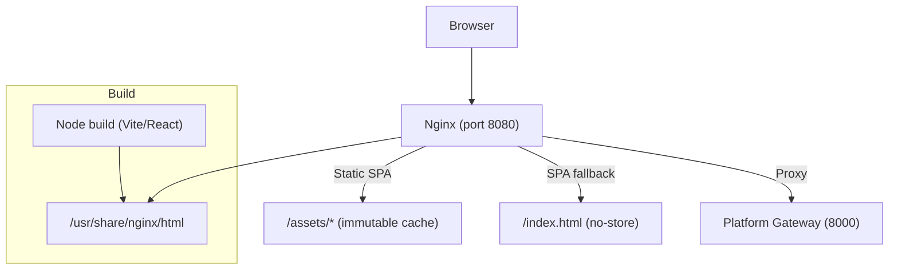
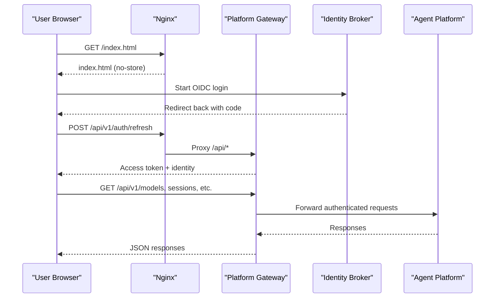
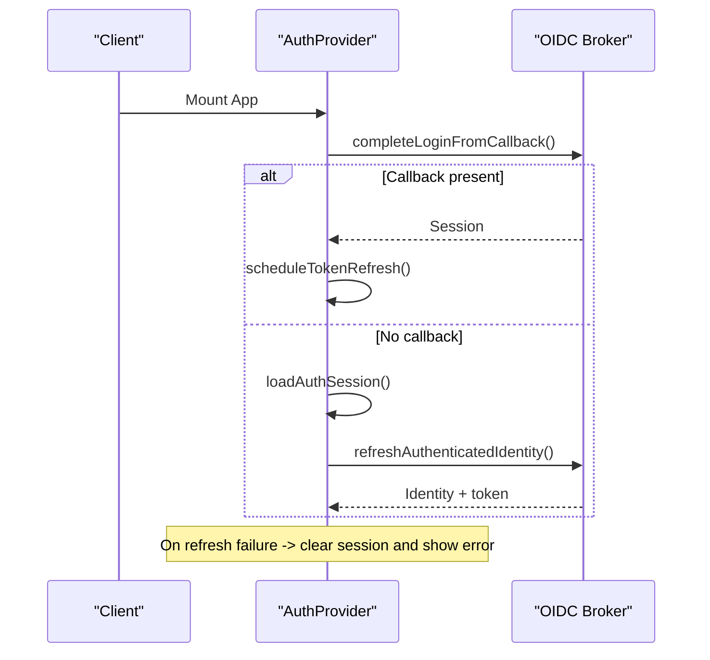
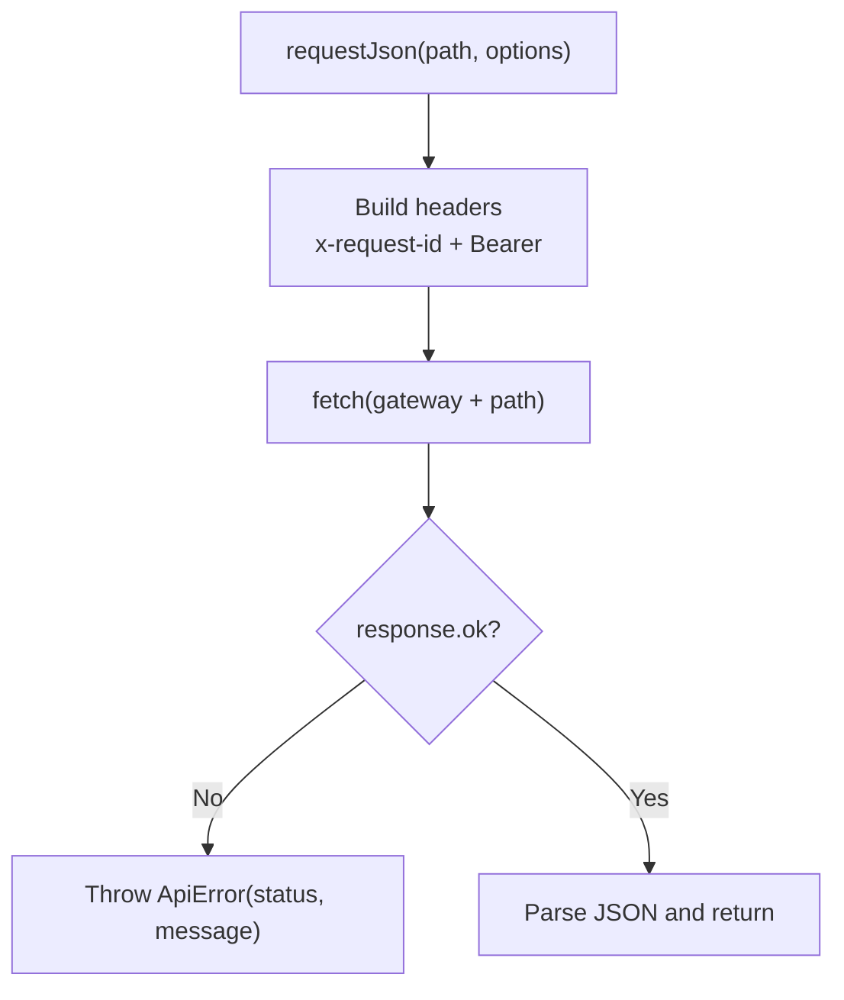
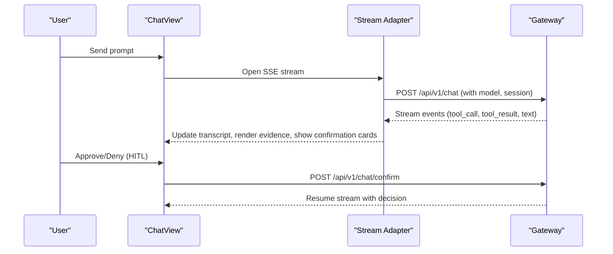
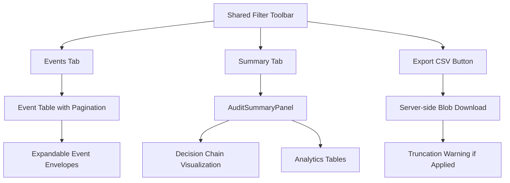
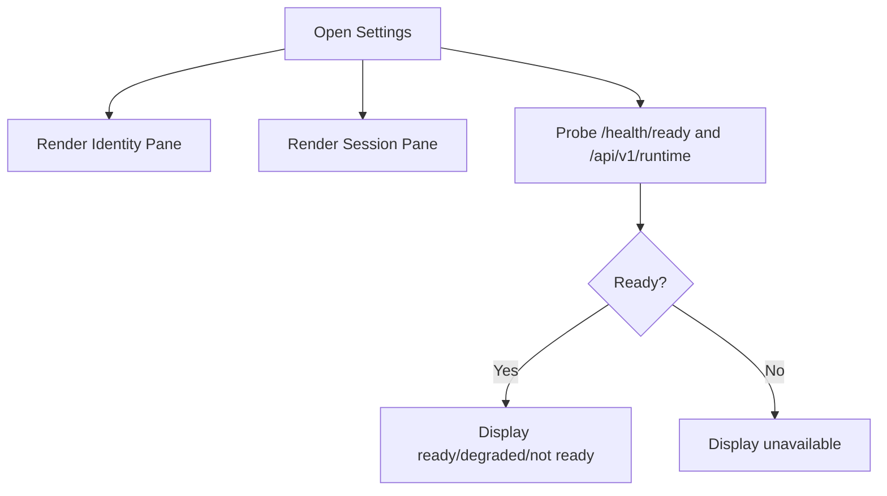
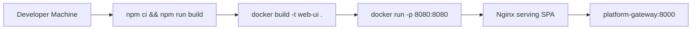
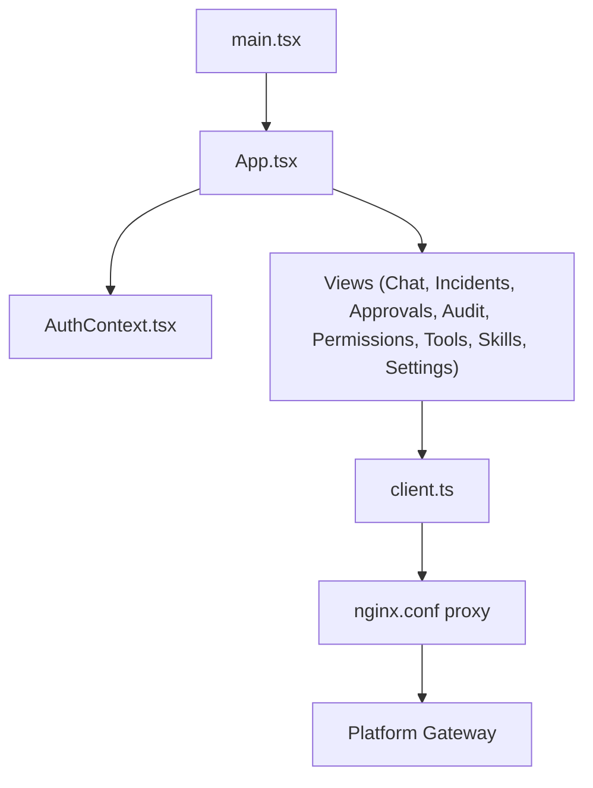

# Operator Portal

<cite>
**Referenced Files in This Document**
- [README.md](file://products/operator-portal/README.md)
- [Dockerfile](file://products/operator-portal/Dockerfile)
- [Makefile](file://products/operator-portal/Makefile)
- [nginx.conf](file://products/operator-portal/nginx.conf)
- [index.html](file://products/operator-portal/web-ui/app/index.html)
- [main.tsx](file://products/operator-portal/web-ui/app/src/main.tsx)
- [App.tsx](file://products/operator-portal/web-ui/app/src/App.tsx)
- [AuthContext.tsx](file://products/operator-portal/web-ui/app/src/auth/AuthContext.tsx)
- [client.ts](file://products/operator-portal/web-ui/app/src/api/client.ts)
- [ChatView.tsx](file://products/operator-portal/web-ui/app/src/chat/ChatView.tsx)
- [SettingsView.tsx](file://products/operator-portal/web-ui/app/src/views/control/SettingsView.tsx)
- [AuditView.tsx](file://products/operator-portal/web-ui/app/src/views/audit/AuditView.tsx)
- [AuditSummaryPanel.tsx](file://products/operator-portal/web-ui/app/src/views/audit/AuditSummaryPanel.tsx)
- [constants.ts](file://products/operator-portal/web-ui/app/src/views/audit/constants.ts)
- [tokens.ts](file://products/operator-portal/web-ui/app/src/theme/tokens.ts)
</cite>

## Update Summary
**Changes Made**
- Enhanced audit view with tabbed interface including Events and Summary tabs sharing common filter toolbar
- Added AuditSummaryPanel component for displaying summary data with proper formatting and sorting
- Integrated CSV export functionality with proper error handling and truncation warnings
- Moved constants for emitter services and event types to dedicated constants file
- Updated audit trail section with new tabbed interface capabilities

## Table of Contents
1. [Introduction](#introduction)
2. [Project Structure](#project-structure)
3. [Core Components](#core-components)
4. [Architecture Overview](#architecture-overview)
5. [Detailed Component Analysis](#detailed-component-analysis)
6. [Dependency Analysis](#dependency-analysis)
7. [Performance Considerations](#performance-considerations)
8. [Troubleshooting Guide](#troubleshooting-guide)
9. [Conclusion](#conclusion)
10. [Appendices](#appendices)

## Introduction
The Operator Portal is the operator-facing web application for platform administration and monitoring. It provides a modern SPA shell with role-based navigation, chat-driven interactions, incident triage, approval workflows, enhanced audit trail viewing with tabbed interface, permissions inspection, and workspace resource browsing. The portal authenticates via OIDC through the identity broker, proxies API calls to the platform gateway, and serves a static bundle via nginx with immutable asset caching and SPA fallback.

Key capabilities include:
- Chat and streaming responses with tool evidence and inline human-in-the-loop confirmations
- Incident management with triage reports and live runs
- Approval queue with pending decision badges and actions
- **Enhanced read-only audit trail with tabbed interface (Events and Summary tabs), shared filter toolbar, CSV export with truncation warnings, and summary analytics**
- Permissions matrix view sourced from policy enforcement
- Workspace views for tools and skills catalogs
- Settings & Debug panel showing session, identity, and platform component health

**Section sources**
- [README.md:1-137](file://products/operator-portal/README.md#L1-L137)

## Project Structure
The Operator Portal product ships a multi-stage Docker image that builds a Vite/React SPA and serves it with nginx. The runtime exposes port 8080, serves hashed assets immutably, keeps index.html no-store for immediate rollouts, and proxies /api/ and /health/ to the platform gateway.

**Diagram sources**
- [Dockerfile:1-29](file://products/operator-portal/Dockerfile#L1-L29)
- [nginx.conf:1-43](file://products/operator-portal/nginx.conf#L1-L43)

**Section sources**
- [Dockerfile:1-29](file://products/operator-portal/Dockerfile#L1-L29)
- [nginx.conf:1-43](file://products/operator-portal/nginx.conf#L1-L43)
- [Makefile:1-14](file://products/operator-portal/Makefile#L1-L14)

## Core Components
- Application shell and routing: React app root, theme provider, auth provider, and view router with sidebar sections and responsive drawer.
- Authentication: OIDC login flow, token refresh scheduling, and session persistence; roles drive UI visibility and feature gating.
- API client: Centralized fetch wrapper adding bearer tokens and request IDs, with configurable gateway URL override.
- Chat workspace: Session list, message composer, model selector, voice input, streaming SSE transport, tool evidence rendering, and HITL confirmation cards.
- Control views: Approvals inbox, **enhanced audit trail with tabbed interface**, permissions matrix, settings & debug, incidents triage.
- Workspace views: Tools catalog and skills inventory with filters.
- Theme and accessibility: Dark theme tokens mirrored into CSS custom properties; ARIA labels and keyboard-friendly controls.

**Section sources**
- [App.tsx:1-422](file://products/operator-portal/web-ui/app/src/App.tsx#L1-L422)
- [AuthContext.tsx:1-110](file://products/operator-portal/web-ui/app/src/auth/AuthContext.tsx#L1-L110)
- [client.ts:1-101](file://products/operator-portal/web-ui/app/src/api/client.ts#L1-L101)
- [ChatView.tsx:1-200](file://products/operator-portal/web-ui/app/src/chat/ChatView.tsx#L1-L200)
- [SettingsView.tsx:1-200](file://products/operator-portal/web-ui/app/src/views/control/SettingsView.tsx#L1-L200)
- [AuditView.tsx:1-425](file://products/operator-portal/web-ui/app/src/views/audit/AuditView.tsx#L1-L425)
- [tokens.ts:1-43](file://products/operator-portal/web-ui/app/src/theme/tokens.ts#L1-L43)

## Architecture Overview
The portal follows a thin-client architecture:
- Frontend: React SPA built with Vite, served by nginx with immutable asset caching and SPA fallback.
- Auth: OIDC via identity broker; access tokens are attached to requests.
- Backend integration: All API calls go through nginx proxy to the platform gateway, which enforces policies and delegates to agent-platform, policy-center, and other services.

**Diagram sources**
- [nginx.conf:8-28](file://products/operator-portal/nginx.conf#L8-L28)
- [AuthContext.tsx:40-71](file://products/operator-portal/web-ui/app/src/auth/AuthContext.tsx#L40-L71)
- [client.ts:65-92](file://products/operator-portal/web-ui/app/src/api/client.ts#L65-L92)

## Detailed Component Analysis

### Application Shell and Navigation
- Two-column layout with collapsible sidebar and off-canvas drawer on narrow screens.
- Role-based menu items grouped under Control and Workspace sections; section headers hide when all entries are hidden.
- User card shows initials, username, roles, sign-in/sign-out buttons, and platform version chip.

**Diagram sources**
- [App.tsx:287-422](file://products/operator-portal/web-ui/app/src/App.tsx#L287-L422)

**Section sources**
- [App.tsx:1-422](file://products/operator-portal/web-ui/app/src/App.tsx#L1-L422)

### Authentication and Session Management
- OIDC login initiated from UI; callback completed at startup; existing sessions restored from storage.
- Token refresh scheduled before expiry; failures clear session and prompt re-authentication.
- Roles extracted from identity context and used to gate UI features and API calls.

**Diagram sources**
- [AuthContext.tsx:31-85](file://products/operator-portal/web-ui/app/src/auth/AuthContext.tsx#L31-L85)

**Section sources**
- [AuthContext.tsx:1-110](file://products/operator-portal/web-ui/app/src/auth/AuthContext.tsx#L1-L110)

### API Client and Request Correlation
- Centralized request function attaches x-request-id and Authorization header when signed in.
- Gateway URL can be overridden via local storage key for development/debugging.
- Errors are wrapped in ApiError with status and message.

**Diagram sources**
- [client.ts:38-92](file://products/operator-portal/web-ui/app/src/api/client.ts#L38-L92)

**Section sources**
- [client.ts:1-101](file://products/operator-portal/web-ui/app/src/api/client.ts#L1-L101)

### Chat Workspace and Streaming
- Session workspace manages multiple sessions, titles, last-active timestamps, and pinned incident sessions.
- Model selector integrates with /api/v1/models; selection persists per session.
- Voice input uses Web Speech API with language preference persisted locally.
- Tool evidence rendered as collapsible cards with status badges and optional full output expander.
- Inline HITL confirmation cards post decisions to /api/v1/chat/confirm; server-side enforcement applies.

**Diagram sources**
- [ChatView.tsx:1-200](file://products/operator-portal/web-ui/app/src/chat/ChatView.tsx#L1-L200)

**Section sources**
- [ChatView.tsx:1-200](file://products/operator-portal/web-ui/app/src/chat/ChatView.tsx#L1-L200)
- [README.md:43-126](file://products/operator-portal/README.md#L43-L126)

### Enhanced Audit Trail with Tabbed Interface
**Updated** The audit trail view has been significantly enhanced with a sophisticated tabbed interface that provides both detailed event inspection and high-level summary analytics.

#### Tabbed Interface Architecture
- **Shared Filter Toolbar**: Both Events and Summary tabs share a common filter interface for username, event type, service, and time range filtering
- **Events Tab**: Displays cursor-paginated audit events with expandable verbatim envelopes showing full event details
- **Summary Tab**: Shows deterministic envelope-column aggregates including total events, decision chain visualization, and bucketed analytics

#### Key Features
- **Role-Based Access**: Requires auditor or platform-admin roles with server-side enforcement
- **Structured Error Handling**: Provides actionable error messages for different failure scenarios (403, 502, 503)
- **CSV Export**: Server-side blob download with Content-Disposition filename support and truncation warnings
- **Real-time Filtering**: Filters apply consistently across both tabs with lazy loading for summary data

**Diagram sources**
- [AuditView.tsx:95-425](file://products/operator-portal/web-ui/app/src/views/audit/AuditView.tsx#L95-L425)
- [AuditSummaryPanel.tsx:51-107](file://products/operator-portal/web-ui/app/src/views/audit/AuditSummaryPanel.tsx#L51-L107)

#### Constants Management
- **Centralized Constants**: Event types and emitter services moved to dedicated `constants.ts` file
- **Schema Drift Protection**: Vitest tests ensure constants remain synchronized with shared audit-event schema
- **Maintainable Configuration**: Single source of truth for audit-related configuration

**Section sources**
- [AuditView.tsx:1-425](file://products/operator-portal/web-ui/app/src/views/audit/AuditView.tsx#L1-L425)
- [AuditSummaryPanel.tsx:1-107](file://products/operator-portal/web-ui/app/src/views/audit/AuditSummaryPanel.tsx#L1-L107)
- [constants.ts:1-44](file://products/operator-portal/web-ui/app/src/views/audit/constants.ts#L1-L44)

### Settings, Health, and Debug
- Identity pane shows sign-in state, username, roles, subject, and groups.
- Session pane displays active session and workspace session count.
- Platform pane probes gateway health endpoints and runtime metadata to display component readiness and versions.

**Diagram sources**
- [SettingsView.tsx:1-200](file://products/operator-portal/web-ui/app/src/views/control/SettingsView.tsx#L1-L200)
- [nginx.conf:19-28](file://products/operator-portal/nginx.conf#L19-L28)

**Section sources**
- [SettingsView.tsx:1-200](file://products/operator-portal/web-ui/app/src/views/control/SettingsView.tsx#L1-L200)

### Deployment and Runtime Configuration
- Multi-stage build compiles SPA and copies dist into nginx image.
- Nginx serves immutable cached assets and SPA fallback; proxies /api/ and /health/ to gateway.
- Makefile defines image name and context; includes shared image rules.

**Diagram sources**
- [Dockerfile:11-29](file://products/operator-portal/Dockerfile#L11-L29)
- [nginx.conf:1-43](file://products/operator-portal/nginx.conf#L1-L43)
- [Makefile:1-14](file://products/operator-portal/Makefile#L1-L14)

**Section sources**
- [Dockerfile:1-29](file://products/operator-portal/Dockerfile#L1-L29)
- [nginx.conf:1-43](file://products/operator-portal/nginx.conf#L1-L43)
- [Makefile:1-14](file://products/operator-portal/Makefile#L1-L14)

## Dependency Analysis
- UI layer depends on antd and Ant Design X components for layout, menus, tables, and chat bubbles.
- App shell composes AuthProvider and theme provider around the root component.
- Views depend on API client for data fetching; roles determine visibility and actions.
- Nginx routes static assets and proxies API traffic to the gateway.

**Diagram sources**
- [main.tsx:1-18](file://products/operator-portal/web-ui/app/src/main.tsx#L1-L18)
- [App.tsx:1-422](file://products/operator-portal/web-ui/app/src/App.tsx#L1-L422)
- [client.ts:1-101](file://products/operator-portal/web-ui/app/src/api/client.ts#L1-L101)
- [nginx.conf:1-43](file://products/operator-portal/nginx.conf#L1-L43)

**Section sources**
- [main.tsx:1-18](file://products/operator-portal/web-ui/app/src/main.tsx#L1-L18)
- [App.tsx:1-422](file://products/operator-portal/web-ui/app/src/App.tsx#L1-L422)
- [client.ts:1-101](file://products/operator-portal/web-ui/app/src/api/client.ts#L1-L101)
- [nginx.conf:1-43](file://products/operator-portal/nginx.conf#L1-L43)

## Performance Considerations
- Immutable asset caching: Content-hashed assets under /assets/ are served with long-lived immutable cache headers to improve repeat load performance.
- SPA fallback: index.html is served with no-store to ensure immediate rollout without stale shell issues.
- Streaming: Long-lived SSE connections use proxy_read_timeout configured to support extended operations.
- Client-side state: Session workspace minimizes redundant network calls by maintaining local session lists and pinning incident sessions.
- **Lazy Loading**: Summary tab data is fetched only when the tab is activated, reducing initial page load time.
- **Efficient Filtering**: Shared filter state prevents redundant API calls when switching between tabs.

[No sources needed since this section provides general guidance]

## Troubleshooting Guide
- Authentication errors: AuthContext surfaces authError messages; check OIDC callback completion and token refresh behavior.
- API failures: ApiError wraps non-ok responses with status and message; verify gateway reachability and bearer token presence.
- Gateway override: Use local storage key to redirect API calls during development or debugging.
- Health checks: Settings panel probes gateway health endpoints; if unavailable, inspect nginx proxy configuration and upstream service status.
- **Audit View Issues**: Check role permissions (auditor/platform-admin required); verify audit service availability; review structured error messages for specific failure scenarios.
- **CSV Export Problems**: Monitor truncation warnings; verify server-side export limits; check Content-Disposition headers for proper filename handling.

**Section sources**
- [AuthContext.tsx:40-85](file://products/operator-portal/web-ui/app/src/auth/AuthContext.tsx#L40-L85)
- [client.ts:8-16](file://products/operator-portal/web-ui/app/src/api/client.ts#L8-L16)
- [client.ts:25-36](file://products/operator-portal/web-ui/app/src/api/client.ts#L25-L36)
- [nginx.conf:8-28](file://products/operator-portal/nginx.conf#L8-L28)
- [AuditView.tsx:67-83](file://products/operator-portal/web-ui/app/src/views/audit/AuditView.tsx#L67-L83)

## Conclusion
The Operator Portal delivers a secure, role-aware admin interface with rich operational features including chat-driven troubleshooting, incident triage, approvals, **enhanced audit trail with tabbed interface and analytics**, and platform health diagnostics. Its deployment model combines a modern SPA with efficient nginx serving and robust proxying to backend services, enabling scalable and maintainable operator workflows. The recent enhancements to the audit trail provide operators with comprehensive event inspection capabilities and powerful summary analytics for understanding system behavior and identifying patterns.

[No sources needed since this section summarizes without analyzing specific files]

## Appendices

### Deployment Instructions
- Build and run:
  - Build the image using the product Makefile; the image name is web-ui and the context includes the repository root for VERSION injection.
  - Run the container exposing port 8080; configure reverse proxy or ingress to route to the container.
- Nginx configuration:
  - Static assets under /assets/ are immutable-cacheable.
  - /index.html is no-store with SPA fallback.
  - /api/ and /health/ are proxied to the platform gateway.

**Section sources**
- [Makefile:1-14](file://products/operator-portal/Makefile#L1-L14)
- [Dockerfile:11-29](file://products/operator-portal/Dockerfile#L11-L29)
- [nginx.conf:1-43](file://products/operator-portal/nginx.conf#L1-L43)

### Integration Points
- Identity broker: OIDC login, token refresh, and logout flows.
- Platform gateway: Proxies all /api/ calls; enforces policies and delegates to agent-platform and other services.
- Agent platform: Provides chat sessions and streaming responses.
- Policy center: Supplies approval queue and decision state surfaced in Approvals and Permissions views.
- **Audit service**: Provides durable audit trail with events, summary analytics, and CSV export capabilities.

**Section sources**
- [README.md:127-133](file://products/operator-portal/README.md#L127-L133)

### UI Customization and Accessibility
- Theme: Dark theme tokens defined in tokens.ts and applied via antd ConfigProvider; CSS custom properties mirror tokens for consistent styling.
- Accessibility: ARIA labels on navigation and user actions; keyboard-friendly menus and controls; responsive layout adapts to narrow screens with a drawer.
- **Enhanced Audit Interface**: Tabbed interface provides intuitive navigation between detailed events and summary analytics; shared filter toolbar ensures consistent user experience across tabs.

**Section sources**
- [tokens.ts:1-43](file://products/operator-portal/web-ui/app/src/theme/tokens.ts#L1-L43)
- [App.tsx:395-418](file://products/operator-portal/web-ui/app/src/App.tsx#L395-L418)
- [AuditView.tsx:275-328](file://products/operator-portal/web-ui/app/src/views/audit/AuditView.tsx#L275-L328)

### Browser Compatibility
- Uses modern browser APIs such as Web Speech API for voice input and standard fetch/SSE patterns.
- SPA relies on ES modules and modern JavaScript features; ensure browsers support ES modules and required APIs.

**Section sources**
- [README.md:43-65](file://products/operator-portal/README.md#L43-L65)
- [index.html:1-14](file://products/operator-portal/web-ui/app/index.html#L1-L14)

### Enhanced Audit Trail Features
**New** The audit trail has been significantly enhanced with advanced features:

#### Tabbed Interface
- **Events Tab**: Cursor-paginated table of audit events with expandable verbatim envelopes
- **Summary Tab**: Deterministic aggregates showing total events, decision chain visualization, and bucketed analytics
- **Shared Filter Toolbar**: Consistent filtering across both tabs for username, event type, service, and time ranges

#### CSV Export Functionality
- Server-side blob download with proper Content-Disposition filename handling
- Truncation warnings when export limits are exceeded (AUDIT_EXPORT_MAX_ROWS)
- Structured error handling for permission denials and service unavailability

#### Summary Analytics
- Decision chain visualization showing confirmation → execution flow
- Bucketed analytics by event type, outcome, service, and top actors
- Real-time filtering with lazy loading for optimal performance

**Section sources**
- [AuditView.tsx:95-425](file://products/operator-portal/web-ui/app/src/views/audit/AuditView.tsx#L95-L425)
- [AuditSummaryPanel.tsx:1-107](file://products/operator-portal/web-ui/app/src/views/audit/AuditSummaryPanel.tsx#L1-L107)
- [constants.ts:1-44](file://products/operator-portal/web-ui/app/src/views/audit/constants.ts#L1-L44)