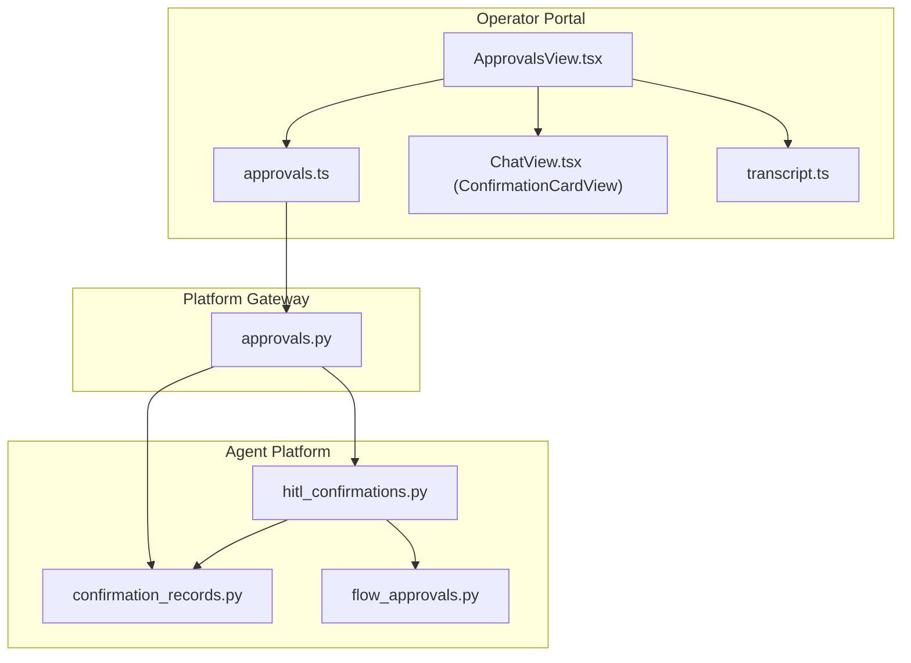
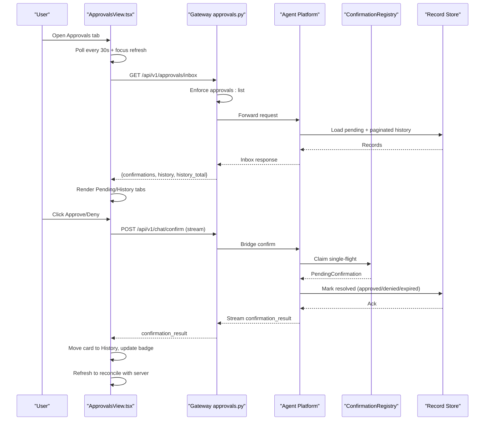
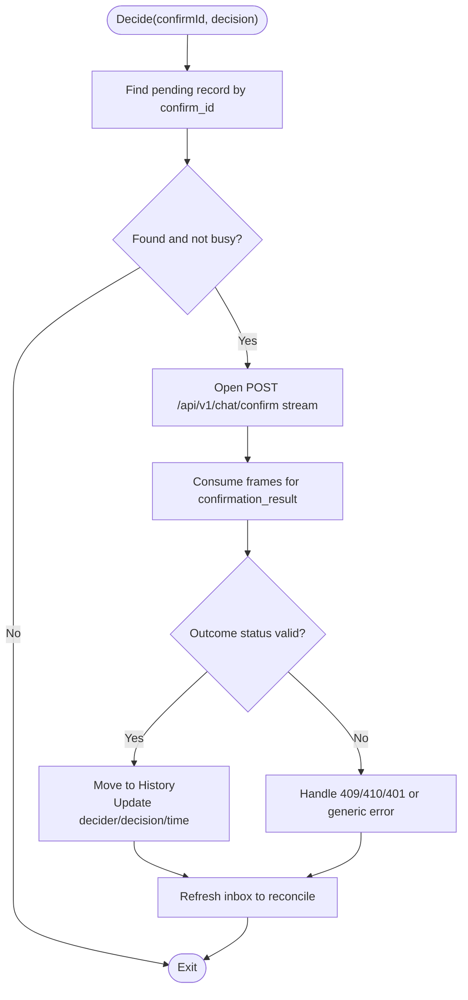
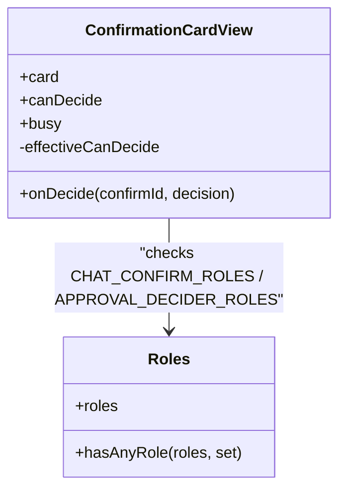
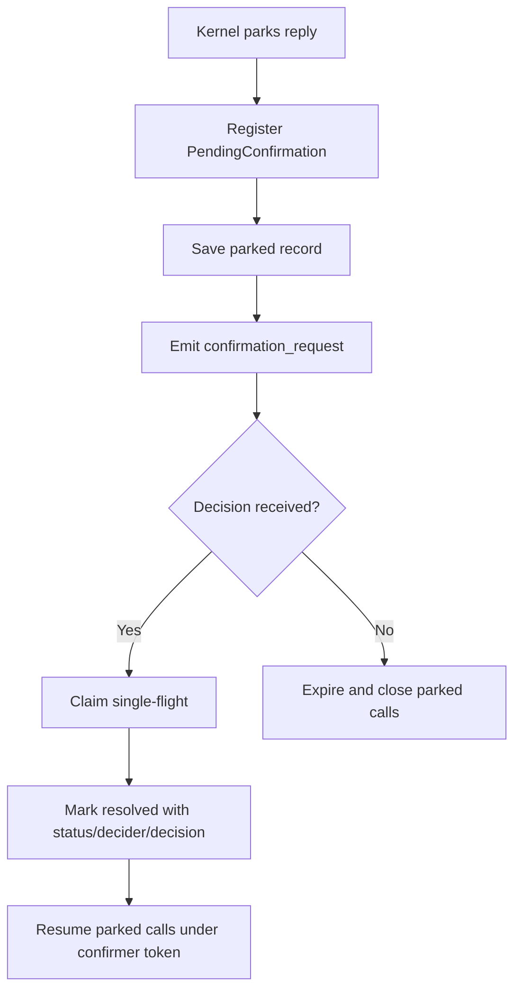
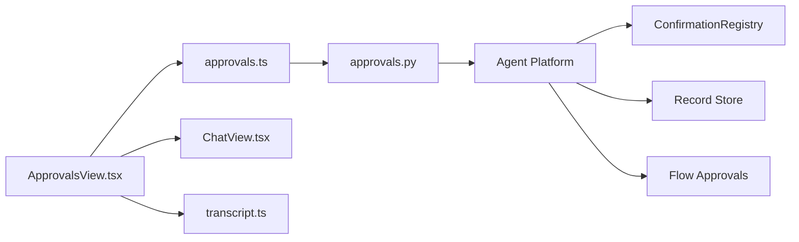

# Approval Workflow

<cite>
**Referenced Files in This Document**
- [ApprovalsView.tsx](file://products/operator-portal/web-ui/app/src/views/control/ApprovalsView.tsx)
- [approvals.ts](file://products/operator-portal/web-ui/app/src/api/approvals.ts)
- [sessions.ts](file://products/operator-portal/web-ui/app/src/api/sessions.ts)
- [transcript.ts](file://products/operator-portal/web-ui/app/src/chat/transcript.ts)
- [ChatView.tsx](file://products/operator-portal/web-ui/app/src/chat/ChatView.tsx)
- [flow_approvals.py](file://products/agent-platform/src/agent_service/services/flow_approvals.py)
- [hitl_confirmations.py](file://products/agent-platform/src/agent_service/services/hitl_confirmations.py)
- [confirmation_records.py](file://products/agent-platform/src/agent_service/services/confirmation_records.py)
- [approvals.py](file://products/platform-gateway/src/platform_gateway/api/routes/approvals.py)
- [SPEC-031-approval-inbox-persistent-confirmation/spec.md](file://docs/specs/SPEC-031-approval-inbox-persistent-confirmation/spec.md)
- [2026-08-25-approval-inbox-persistent-confirmation.md](file://docs/agentic-aiops-platform/release-notes/2026-08-25-approval-inbox-persistent-confirmation.md)
</cite>

## Table of Contents
1. Introduction
2. Project Structure
3. Core Components
4. Architecture Overview
5. Detailed Component Analysis
6. Dependency Analysis
7. Performance Considerations
8. Troubleshooting Guide
9. Conclusion

## Introduction
This document explains the human-in-the-loop approval workflow that lets designated approvers review and decide on pending, potentially mutating actions initiated by agents. It focuses on the ApprovalsView component, decision cards with action details and risk assessments, approval/rejection flows, real-time polling, decision synchronization between inbox and active sessions, badge notifications, confirmation dialogs, audit trail generation, role-based visibility, and security considerations.

## Project Structure
The approval workflow spans three layers:
- Operator portal UI: renders the approvals inbox, decision cards, and handles user interactions.
- Platform gateway: enforces policy for listing approvals and relays decisions to the agent service.
- Agent platform: parks confirmations, persists durable records, manages flow-scoped approvals, and resumes parked calls after a decision.

**Diagram sources**
- [ApprovalsView.tsx:1-441](file://products/operator-portal/web-ui/app/src/views/control/ApprovalsView.tsx#L1-L441)
- [approvals.ts:1-38](file://products/operator-portal/web-ui/app/src/api/approvals.ts#L1-L38)
- [ChatView.tsx:354-593](file://products/operator-portal/web-ui/app/src/chat/ChatView.tsx#L354-L593)
- [transcript.ts:170-200](file://products/operator-portal/web-ui/app/src/chat/transcript.ts#L170-L200)
- [approvals.py:19-58](file://products/platform-gateway/src/platform_gateway/api/routes/approvals.py#L19-L58)
- [hitl_confirmations.py:1-595](file://products/agent-platform/src/agent_service/services/hitl_confirmations.py#L1-L595)
- [confirmation_records.py:1-744](file://products/agent-platform/src/agent_service/services/confirmation_records.py#L1-L744)
- [flow_approvals.py:1-274](file://products/agent-platform/src/agent_service/services/flow_approvals.py#L1-L274)

**Section sources**
- [ApprovalsView.tsx:1-441](file://products/operator-portal/web-ui/app/src/views/control/ApprovalsView.tsx#L1-L441)
- [approvals.py:19-58](file://products/platform-gateway/src/platform_gateway/api/routes/approvals.py#L19-L58)
- [confirmation_records.py:1-744](file://products/agent-platform/src/agent_service/services/confirmation_records.py#L1-L744)

## Core Components
- ApprovalsView and useApprovalsInbox: render pending and history tabs, poll for updates, handle decisions, and manage pagination.
- ConfirmationCardView: displays per-call details, risk levels, change-request projections, and approve/deny buttons gated by roles.
- Approvals API client: fetches inbox data with server-side pagination for history.
- Gateway approvals route: enforces approvals:list policy and proxies to agent service.
- Confirmation registry and records: park/resume confirmations, persist outcomes, and support race handling and expiry.
- Flow approvals: scope auto-signing authority to browser flows with TTL and identity checks.

**Section sources**
- [ApprovalsView.tsx:69-241](file://products/operator-portal/web-ui/app/src/views/control/ApprovalsView.tsx#L69-L241)
- [ChatView.tsx:354-593](file://products/operator-portal/web-ui/app/src/chat/ChatView.tsx#L354-L593)
- [approvals.ts:21-37](file://products/operator-portal/web-ui/app/src/api/approvals.ts#L21-L37)
- [approvals.py:19-58](file://products/platform-gateway/src/platform_gateway/api/routes/approvals.py#L19-L58)
- [hitl_confirmations.py:452-595](file://products/agent-platform/src/agent_service/services/hitl_confirmations.py#L452-L595)
- [confirmation_records.py:52-91](file://products/agent-platform/src/agent_service/services/confirmation_records.py#L52-L91)
- [flow_approvals.py:167-259](file://products/agent-platform/src/agent_service/services/flow_approvals.py#L167-L259)

## Architecture Overview
End-to-end flow from UI to backend and back:

**Diagram sources**
- [ApprovalsView.tsx:88-225](file://products/operator-portal/web-ui/app/src/views/control/ApprovalsView.tsx#L88-L225)
- [approvals.py:19-58](file://products/platform-gateway/src/platform_gateway/api/routes/approvals.py#L19-L58)
- [hitl_confirmations.py:496-576](file://products/agent-platform/src/agent_service/services/hitl_confirmations.py#L496-L576)
- [confirmation_records.py:584-604](file://products/agent-platform/src/agent_service/services/confirmation_records.py#L584-L604)

## Detailed Component Analysis

### ApprovalsView and useApprovalsInbox
- Polling: The hook polls every 30 seconds and on window focus to keep the inbox fresh without overwhelming the server. It preserves the last known lists on transient errors and marks loading only until first load.
- Tabs: Pending shows actionable items; History shows decided records with server-side pagination using offset and total.
- Decision flow: On approve/deny, it opens a stream to the chat confirm endpoint, consumes the confirmation_result frame, moves the card to history, triggers an immediate session panel refresh via callback, and then re-syncs with the server.
- Race handling: A 409 already_resolved response flips the card to the winner’s outcome with attribution; a 410 marks expired; 401 prompts sign-in.
- Badge: pendingCount is derived from pending items and exposed for sidebar badges.

**Diagram sources**
- [ApprovalsView.tsx:156-225](file://products/operator-portal/web-ui/app/src/views/control/ApprovalsView.tsx#L156-L225)

**Section sources**
- [ApprovalsView.tsx:69-241](file://products/operator-portal/web-ui/app/src/views/control/ApprovalsView.tsx#L69-L241)
- [approvals.ts:21-37](file://products/operator-portal/web-ui/app/src/api/approvals.ts#L21-L37)

### ConfirmationCardView and Role-Based Visibility
- Risk assessment: Each pending call carries risk_level and optional action; batches with tools:mutate are flagged as tier_2 requiring designated approvers.
- Visibility controls: Buttons are disabled unless the current user has the required roles; a note explains why approval is unavailable when roles are insufficient.
- Change requests: For action-type cards, a display-only projection summarizes the effect with masked sensitive values.

**Diagram sources**
- [ChatView.tsx:354-593](file://products/operator-portal/web-ui/app/src/chat/ChatView.tsx#L354-L593)

**Section sources**
- [ChatView.tsx:354-593](file://products/operator-portal/web-ui/app/src/chat/ChatView.tsx#L354-L593)

### Inbox Entry and Card Rendering
- Provenance header: Shows session title or id, owner, parked time, and if decided, who decided and when.
- Shared card: Reuses ConfirmationCardView so inbox and owner transcript render identically.
- Mapping: Uses confirmationRecordToCard to convert stored records into view-models, including flow summaries and change-request projections.

**Section sources**
- [ApprovalsView.tsx:243-298](file://products/operator-portal/web-ui/app/src/views/control/ApprovalsView.tsx#L243-L298)
- [transcript.ts:170-200](file://products/operator-portal/web-ui/app/src/chat/transcript.ts#L170-L200)

### Backend: Confirmation Registry and Durable Records
- Parking: When the kernel parks a reply due to ASK permission, a PendingConfirmation is registered with tool calls, risk levels, gateway names, and optional flow headline.
- Single flight: claim() atomically reserves a pending confirmation to prevent double-resume; expire paths also claim to avoid races.
- Persistence: make_record creates a durable row; mark_resolved writes once with status, decider, decision, and timestamp. Postgres supports startup sweep to close stale pending rows beyond the HITL timeout.
- Inbox queries: load_pending_inbox returns all pending; load_inbox_history returns server-paginated decided records within a retention window.

**Diagram sources**
- [hitl_confirmations.py:468-576](file://products/agent-platform/src/agent_service/services/hitl_confirmations.py#L468-L576)
- [confirmation_records.py:52-91](file://products/agent-platform/src/agent_service/services/confirmation_records.py#L52-L91)
- [confirmation_records.py:584-604](file://products/agent-platform/src/agent_service/services/confirmation_records.py#L584-L604)

**Section sources**
- [hitl_confirmations.py:47-181](file://products/agent-platform/src/agent_service/services/hitl_confirmations.py#L47-L181)
- [confirmation_records.py:141-244](file://products/agent-platform/src/agent_service/services/confirmation_records.py#L141-L244)
- [confirmation_records.py:492-686](file://products/agent-platform/src/agent_service/services/confirmation_records.py#L492-L686)

### Browser Flow Authority and Auto-Signing
- Flow context: Tracks the bound browser flow identity (skill_id, origin) and metadata used for card headlines and intent display.
- Flow approval: After approving the first write in a flow, subsequent writes in the same flow can be auto-signed while the flow identity matches and TTL is valid.
- Invalidation: Certain gateway refusal codes kill the flow binding and clear both context and approval stores to prevent stale authority.

**Section sources**
- [flow_approvals.py:41-75](file://products/agent-platform/src/agent_service/services/flow_approvals.py#L41-L75)
- [flow_approvals.py:78-122](file://products/agent-platform/src/agent_service/services/flow_approvals.py#L78-L122)
- [flow_approvals.py:167-259](file://products/agent-platform/src/agent_service/services/flow_approvals.py#L167-L259)

## Dependency Analysis
- UI depends on:
  - approvals.ts for inbox list
  - ChatView.tsx for shared confirmation card rendering
  - transcript.ts for mapping stored records to cards
- Gateway depends on:
  - Policy engine to enforce approvals:list
  - Agent service to provide inbox data and bridge confirmations
- Agent platform depends on:
  - ConfirmationRegistry for hot-path single-flight control
  - Record store for durability and inbox queries
  - Flow approvals for scoped auto-signing

**Diagram sources**
- [ApprovalsView.tsx:1-441](file://products/operator-portal/web-ui/app/src/views/control/ApprovalsView.tsx#L1-L441)
- [approvals.ts:1-38](file://products/operator-portal/web-ui/app/src/api/approvals.ts#L1-L38)
- [approvals.py:19-58](file://products/platform-gateway/src/platform_gateway/api/routes/approvals.py#L19-L58)
- [hitl_confirmations.py:452-595](file://products/agent-platform/src/agent_service/services/hitl_confirmations.py#L452-L595)
- [confirmation_records.py:1-744](file://products/agent-platform/src/agent_service/services/confirmation_records.py#L1-L744)
- [flow_approvals.py:1-274](file://products/agent-platform/src/agent_service/services/flow_approvals.py#L1-L274)

**Section sources**
- [approvals.py:19-58](file://products/platform-gateway/src/platform_gateway/api/routes/approvals.py#L19-L58)
- [confirmation_records.py:693-744](file://products/agent-platform/src/agent_service/services/confirmation_records.py#L693-L744)

## Performance Considerations
- Polling interval: 30 seconds balances freshness with server load; additional refresh on window focus improves responsiveness.
- Server-side pagination: History uses offset and total to avoid large payloads and enable stable paging even when retention evicts older entries.
- Best-effort persistence: Record store failures degrade gracefully to in-memory behavior, keeping the UI usable.
- Single-flight claims: Prevent duplicate resuming and reduce redundant work during concurrent decisions.

[No sources needed since this section provides general guidance]

## Troubleshooting Guide
- 409 already_resolved: Indicates another approver won the race; the inbox flips the card to the winner’s outcome with attribution.
- 410 Gone: Indicates the confirmation expired before a decision could be applied; the card becomes read-only with expiration messaging.
- 401 Unauthorized: Prompts the user to sign in; the inbox will not allow decisions until authenticated.
- Empty states: Pending tab shows “No confirmations are waiting for a decision”; History tab shows “No decisions in the last 30 days.”
- Stale pending rows: On startup, the record store closes pending rows that exceed the HITL confirmation timeout to avoid orphaned parks.

**Section sources**
- [ApprovalsView.tsx:197-225](file://products/operator-portal/web-ui/app/src/views/control/ApprovalsView.tsx#L197-L225)
- [transcript.ts:101-116](file://products/operator-portal/web-ui/app/src/chat/transcript.ts#L101-L116)
- [confirmation_records.py:521-541](file://products/agent-platform/src/agent_service/services/confirmation_records.py#L521-L541)

## Conclusion
The approval workflow provides a secure, auditable, and user-friendly mechanism for human oversight of agent-initiated actions. The ApprovalsView offers a clear interface for reviewing and deciding pending items, with robust mechanisms for real-time updates, race resolution, and consistent rendering across surfaces. Role-based controls and policy enforcement ensure only authorized users can act, while durable records and audit trails preserve accountability. Flow-scoped approvals streamline repeated operations safely within bounded contexts.