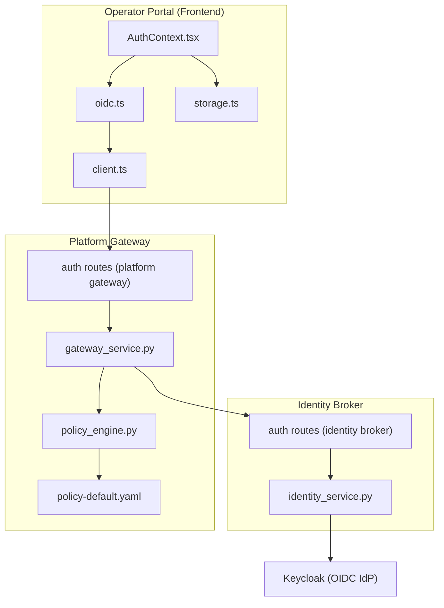
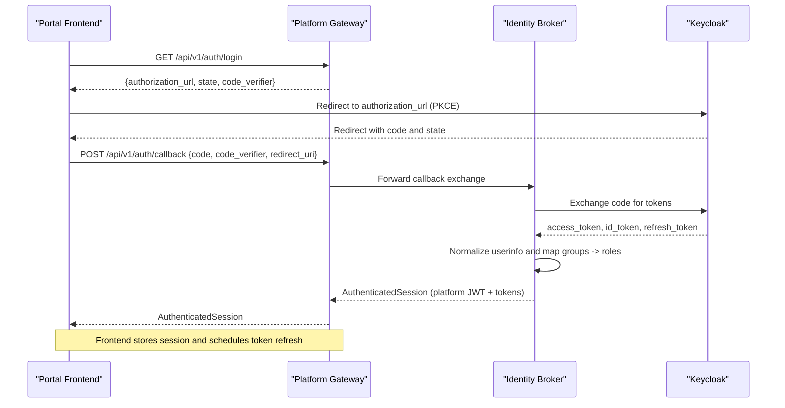
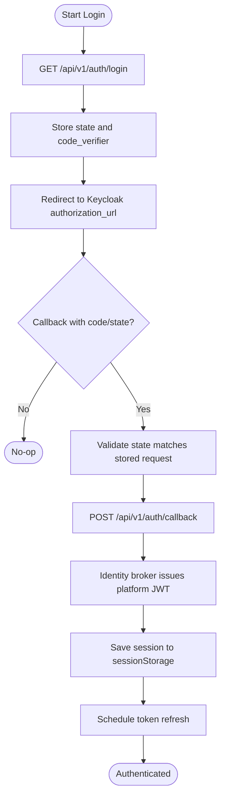
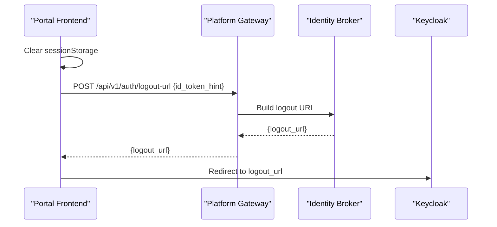
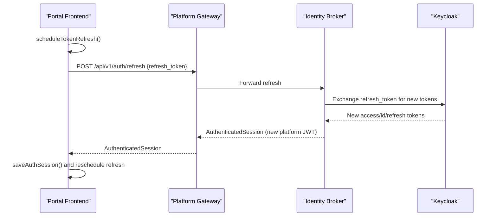
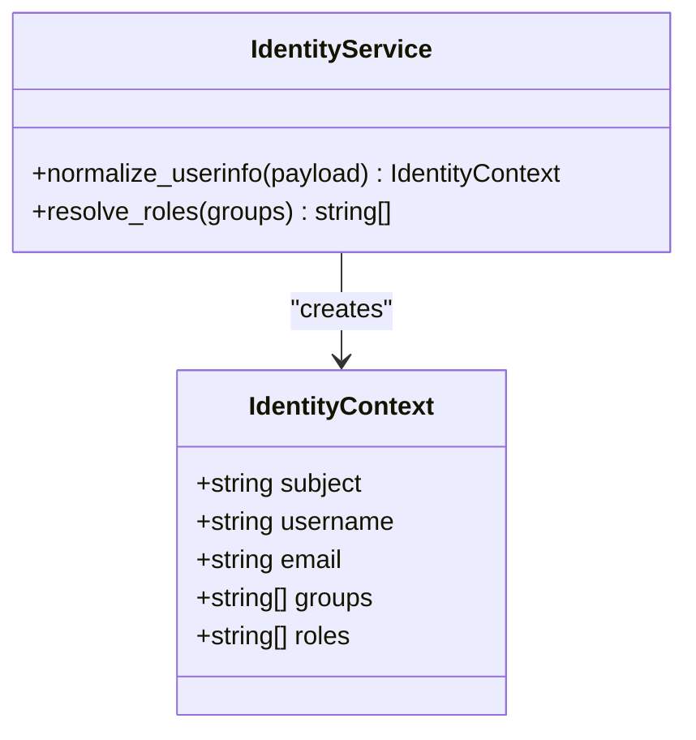
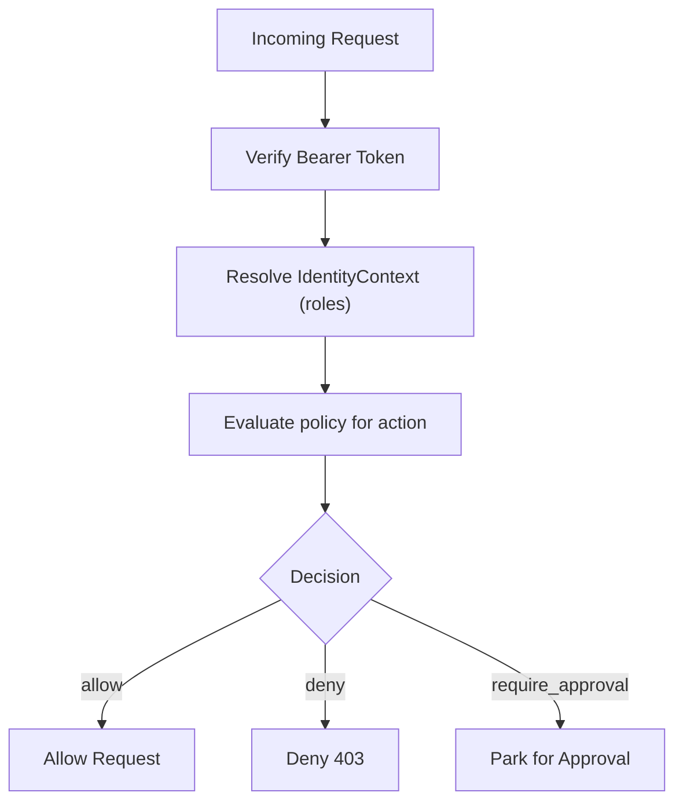
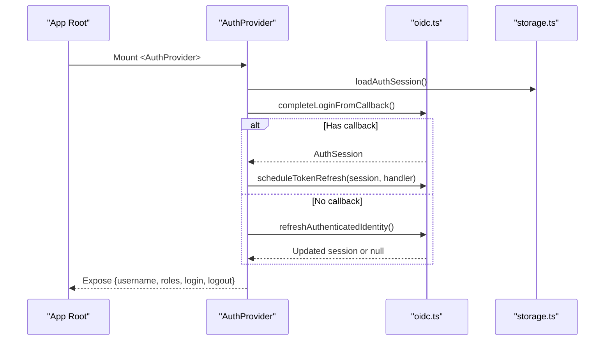
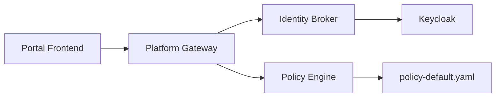

# Authentication & Authorization

<cite>
**Referenced Files in This Document**
- [AuthContext.tsx](file://products/operator-portal/web-ui/app/src/auth/AuthContext.tsx)
- [oidc.ts](file://products/operator-portal/web-ui/app/src/auth/oidc.ts)
- [storage.ts](file://products/operator-portal/web-ui/app/src/auth/storage.ts)
- [client.ts](file://products/operator-portal/web-ui/app/src/api/client.ts)
- [identity_service.py](file://products/identity-broker/src/identity_service/services/identity_service.py)
- [auth routes (identity broker)](file://products/identity-broker/src/identity_service/api/routes/auth.py)
- [auth routes (platform gateway)](file://products/platform-gateway/src/platform_gateway/api/routes/auth.py)
- [gateway service (identity resolution and policy enforcement)](file://products/platform-gateway/src/platform_gateway/services/gateway_service.py)
- [policy engine](file://products/platform-gateway/src/platform_gateway/services/policy_engine.py)
- [policy-default.yaml](file://shared/shared-contracts/policies/policy-default.yaml)
- [PermissionsView.tsx](file://products/operator-portal/web-ui/app/src/views/control/PermissionsView.tsx)
</cite>

## Table of Contents
1. Introduction
2. Project Structure
3. Core Components
4. Architecture Overview
5. Detailed Component Analysis
6. Dependency Analysis
7. Performance Considerations
8. Troubleshooting Guide
9. Conclusion

## Introduction
This document explains the portal’s authentication and authorization system, focusing on:
- OIDC integration with Keycloak via the identity broker and platform gateway
- Login/logout flows, token management, and session persistence
- Role-based access control (RBAC) using predefined roles and policy rules
- The AuthContext provider pattern for authentication state management
- How roles gate access to views and features
- Security considerations, token refresh mechanisms, and error handling

## Project Structure
The authentication and authorization system spans three layers:
- Frontend (operator portal): React components manage login, logout, token refresh, and role-aware UI rendering
- Identity Broker: OIDC client-facing endpoints that perform PKCE, exchange codes, issue platform JWTs, and handle refresh/logout
- Platform Gateway: Verifies tokens locally, resolves identities, enforces policies, and proxies authenticated requests

**Diagram sources**
- [AuthContext.tsx:31-100](file://products/operator-portal/web-ui/app/src/auth/AuthContext.tsx#L31-L100)
- [oidc.ts:38-88](file://products/operator-portal/web-ui/app/src/auth/oidc.ts#L38-L88)
- [storage.ts:1-64](file://products/operator-portal/web-ui/app/src/auth/storage.ts#L1-L64)
- [client.ts:85-120](file://products/operator-portal/web-ui/app/src/api/client.ts#L85-L120)
- [auth routes (identity broker):34-81](file://products/identity-broker/src/identity_service/api/routes/auth.py#L34-L81)
- [identity_service.py:88-192](file://products/identity-broker/src/identity_service/services/identity_service.py#L88-L192)
- [auth routes (platform gateway):21-112](file://products/platform-gateway/src/platform_gateway/api/routes/auth.py#L21-L112)
- [gateway service (identity resolution and policy enforcement):206-300](file://products/platform-gateway/src/platform_gateway/services/gateway_service.py#L206-L300)
- [policy engine:1-28](file://products/platform-gateway/src/platform_gateway/services/policy_engine.py#L1-L28)
- [policy-default.yaml:1-200](file://shared/shared-contracts/policies/policy-default.yaml#L1-L200)

**Section sources**
- [AuthContext.tsx:31-100](file://products/operator-portal/web-ui/app/src/auth/AuthContext.tsx#L31-L100)
- [oidc.ts:38-88](file://products/operator-portal/web-ui/app/src/auth/oidc.ts#L38-L88)
- [identity_service.py:88-192](file://products/identity-broker/src/identity_service/services/identity_service.py#L88-L192)
- [auth routes (platform gateway):21-112](file://products/platform-gateway/src/platform_gateway/api/routes/auth.py#L21-L112)
- [gateway service (identity resolution and policy enforcement):206-300](file://products/platform-gateway/src/platform_gateway/services/gateway_service.py#L206-L300)
- [policy-default.yaml:1-200](file://shared/shared-contracts/policies/policy-default.yaml#L1-L200)

## Core Components
- OIDC login flow with PKCE and state validation
- Token refresh with silent background refresh
- Session persistence in browser sessionStorage per tab
- Identity resolution and policy enforcement at the platform gateway
- Role mapping from Keycloak groups to platform roles
- Policy-driven RBAC with deny-by-default and approval tiers

**Section sources**
- [oidc.ts:75-156](file://products/operator-portal/web-ui/app/src/auth/oidc.ts#L75-L156)
- [oidc.ts:18-73](file://products/operator-portal/web-ui/app/src/auth/oidc.ts#L18-L73)
- [storage.ts:1-64](file://products/operator-portal/web-ui/app/src/auth/storage.ts#L1-L64)
- [identity_service.py:24-38](file://products/identity-broker/src/identity_service/services/identity_service.py#L24-L38)
- [gateway service (identity resolution and policy enforcement):206-300](file://products/platform-gateway/src/platform_gateway/services/gateway_service.py#L206-L300)
- [policy engine:1-28](file://products/platform-gateway/src/platform_gateway/services/policy_engine.py#L1-L28)

## Architecture Overview
End-to-end OIDC login and subsequent request authorization:

**Diagram sources**
- [oidc.ts:75-88](file://products/operator-portal/web-ui/app/src/auth/oidc.ts#L75-L88)
- [oidc.ts:114-156](file://products/operator-portal/web-ui/app/src/auth/oidc.ts#L114-L156)
- [auth routes (platform gateway):21-57](file://products/platform-gateway/src/platform_gateway/api/routes/auth.py#L21-L57)
- [auth routes (identity broker):44-71](file://products/identity-broker/src/identity_service/api/routes/auth.py#L44-L71)
- [identity_service.py:142-192](file://products/identity-broker/src/identity_service/services/identity_service.py#L142-L192)

## Detailed Component Analysis

### OIDC Login Flow (PKCE, State Validation, Callback)
- The frontend initiates login by requesting a login URL and storing state/code_verifier
- The user authenticates with Keycloak; the browser is redirected back with a code
- The frontend exchanges the code for an AuthenticatedSession via the platform gateway, which delegates to the identity broker
- The identity broker exchanges the code with Keycloak, fetches userinfo, maps groups to roles, issues a platform JWT, and returns it

**Diagram sources**
- [oidc.ts:75-88](file://products/operator-portal/web-ui/app/src/auth/oidc.ts#L75-L88)
- [oidc.ts:114-156](file://products/operator-portal/web-ui/app/src/auth/oidc.ts#L114-L156)
- [auth routes (platform gateway):32-57](file://products/platform-gateway/src/platform_gateway/api/routes/auth.py#L32-L57)
- [auth routes (identity broker):44-71](file://products/identity-broker/src/identity_service/api/routes/auth.py#L44-L71)
- [identity_service.py:88-192](file://products/identity-broker/src/identity_service/services/identity_service.py#L88-L192)

**Section sources**
- [oidc.ts:75-156](file://products/operator-portal/web-ui/app/src/auth/oidc.ts#L75-L156)
- [auth routes (platform gateway):32-57](file://products/platform-gateway/src/platform_gateway/api/routes/auth.py#L32-L57)
- [auth routes (identity broker):44-71](file://products/identity-broker/src/identity_service/api/routes/auth.py#L44-L71)
- [identity_service.py:88-192](file://products/identity-broker/src/identity_service/services/identity_service.py#L88-L192)

### Logout Flow
- The frontend clears local session and calls the gateway logout endpoint
- The gateway builds a Keycloak logout URL including id_token_hint and post_logout_redirect_uri
- The browser redirects to Keycloak to terminate the session

**Diagram sources**
- [oidc.ts:158-181](file://products/operator-portal/web-ui/app/src/auth/oidc.ts#L158-L181)
- [auth routes (platform gateway):85-94](file://products/platform-gateway/src/platform_gateway/api/routes/auth.py#L85-L94)
- [auth routes (identity broker):73-81](file://products/identity-broker/src/identity_service/api/routes/auth.py#L73-L81)
- [identity_service.py:214-227](file://products/identity-broker/src/identity_service/services/identity_service.py#L214-L227)

**Section sources**
- [oidc.ts:158-181](file://products/operator-portal/web-ui/app/src/auth/oidc.ts#L158-L181)
- [auth routes (platform gateway):85-94](file://products/platform-gateway/src/platform_gateway/api/routes/auth.py#L85-L94)
- [auth routes (identity broker):73-81](file://products/identity-broker/src/identity_service/api/routes/auth.py#L73-L81)
- [identity_service.py:214-227](file://products/identity-broker/src/identity_service/services/identity_service.py#L214-L227)

### Token Refresh and Session Persistence
- On boot, the AuthProvider attempts to complete login from a callback or restore from sessionStorage
- If a valid session exists, a timer schedules a silent refresh before expiration
- Silent refresh calls the gateway refresh endpoint, which uses the identity broker to exchange the refresh token with Keycloak and issue a new platform JWT
- On failure, the session is cleared and the user is signed out

**Diagram sources**
- [AuthContext.tsx:40-71](file://products/operator-portal/web-ui/app/src/auth/AuthContext.tsx#L40-L71)
- [oidc.ts:38-73](file://products/operator-portal/web-ui/app/src/auth/oidc.ts#L38-L73)
- [auth routes (platform gateway):97-112](file://products/platform-gateway/src/platform_gateway/api/routes/auth.py#L97-L112)
- [auth routes (identity broker):214-231](file://products/identity-broker/src/identity_service/api/routes/auth.py#L214-L231)
- [identity_service.py:229-277](file://products/identity-broker/src/identity_service/services/identity_service.py#L229-L277)

**Section sources**
- [AuthContext.tsx:40-71](file://products/operator-portal/web-ui/app/src/auth/AuthContext.tsx#L40-L71)
- [oidc.ts:38-73](file://products/operator-portal/web-ui/app/src/auth/oidc.ts#L38-L73)
- [auth routes (platform gateway):97-112](file://products/platform-gateway/src/platform_gateway/api/routes/auth.py#L97-L112)
- [auth routes (identity broker):214-231](file://products/identity-broker/src/identity_service/api/routes/auth.py#L214-L231)
- [identity_service.py:229-277](file://products/identity-broker/src/identity_service/services/identity_service.py#L229-L277)
- [storage.ts:1-64](file://products/operator-portal/web-ui/app/src/auth/storage.ts#L1-L64)

### Role Mapping and Identity Context
- Keycloak groups are mapped to platform roles (e.g., ops-admins → platform-admin, ops-developers → developer)
- If no matching group is present, the default role is read-only-observer
- The identity context includes subject, username, email, groups, and resolved roles

**Diagram sources**
- [identity_service.py:24-38](file://products/identity-broker/src/identity_service/services/identity_service.py#L24-L38)
- [identity_service.py:114-139](file://products/identity-broker/src/identity_service/services/identity_service.py#L114-L139)

**Section sources**
- [identity_service.py:24-38](file://products/identity-broker/src/identity_service/services/identity_service.py#L24-L38)
- [identity_service.py:114-139](file://products/identity-broker/src/identity_service/services/identity_service.py#L114-L139)

### Policy Engine and RBAC
- The platform gateway verifies bearer tokens locally and resolves identity
- For each action, the gateway evaluates the policy bundle (deny-by-default)
- Policies define allow, deny, and require_approval outcomes with tiers and designated approvers
- The Permissions view renders the live matrix returned by the gateway

**Diagram sources**
- [gateway service (identity resolution and policy enforcement):206-300](file://products/platform-gateway/src/platform_gateway/services/gateway_service.py#L206-L300)
- [policy engine:1-28](file://products/platform-gateway/src/platform_gateway/services/policy_engine.py#L1-L28)
- [policy-default.yaml:1-200](file://shared/shared-contracts/policies/policy-default.yaml#L1-L200)
- [PermissionsView.tsx:1-94](file://products/operator-portal/web-ui/app/src/views/control/PermissionsView.tsx#L1-L94)

**Section sources**
- [gateway service (identity resolution and policy enforcement):206-300](file://products/platform-gateway/src/platform_gateway/services/gateway_service.py#L206-L300)
- [policy engine:1-28](file://products/platform-gateway/src/platform_gateway/services/policy_engine.py#L1-L28)
- [policy-default.yaml:1-200](file://shared/shared-contracts/policies/policy-default.yaml#L1-L200)
- [PermissionsView.tsx:1-94](file://products/operator-portal/web-ui/app/src/views/control/PermissionsView.tsx#L1-L94)

### AuthContext Provider Pattern and UI Gating
- The AuthProvider manages auth state (session, booting, errors), exposes username and roles, and provides login/logout actions
- It orchestrates login completion, session restoration, and token refresh scheduling
- Views can consume roles to conditionally render features; the gateway re-enforces permissions server-side

**Diagram sources**
- [AuthContext.tsx:31-100](file://products/operator-portal/web-ui/app/src/auth/AuthContext.tsx#L31-L100)
- [oidc.ts:114-156](file://products/operator-portal/web-ui/app/src/auth/oidc.ts#L114-L156)
- [oidc.ts:183-205](file://products/operator-portal/web-ui/app/src/auth/oidc.ts#L183-L205)
- [storage.ts:1-64](file://products/operator-portal/web-ui/app/src/auth/storage.ts#L1-L64)

**Section sources**
- [AuthContext.tsx:31-100](file://products/operator-portal/web-ui/app/src/auth/AuthContext.tsx#L31-L100)
- [oidc.ts:114-156](file://products/operator-portal/web-ui/app/src/auth/oidc.ts#L114-L156)
- [oidc.ts:183-205](file://products/operator-portal/web-ui/app/src/auth/oidc.ts#L183-L205)
- [storage.ts:1-64](file://products/operator-portal/web-ui/app/src/auth/storage.ts#L1-L64)

## Dependency Analysis
- Frontend depends on the platform gateway for all auth operations
- Platform gateway depends on the identity broker for OIDC flows and on the policy engine for authorization
- Identity broker depends on Keycloak for OIDC endpoints and issues platform JWTs
- Policy decisions are driven by the shared policy bundle

**Diagram sources**
- [client.ts:85-120](file://products/operator-portal/web-ui/app/src/api/client.ts#L85-L120)
- [auth routes (platform gateway):21-112](file://products/platform-gateway/src/platform_gateway/api/routes/auth.py#L21-L112)
- [auth routes (identity broker):34-231](file://products/identity-broker/src/identity_service/api/routes/auth.py#L34-L231)
- [identity_service.py:88-277](file://products/identity-broker/src/identity_service/services/identity_service.py#L88-L277)
- [policy engine:1-28](file://products/platform-gateway/src/platform_gateway/services/policy_engine.py#L1-L28)
- [policy-default.yaml:1-200](file://shared/shared-contracts/policies/policy-default.yaml#L1-L200)

**Section sources**
- [client.ts:85-120](file://products/operator-portal/web-ui/app/src/api/client.ts#L85-L120)
- [auth routes (platform gateway):21-112](file://products/platform-gateway/src/platform_gateway/api/routes/auth.py#L21-L112)
- [auth routes (identity broker):34-231](file://products/identity-broker/src/identity_service/api/routes/auth.py#L34-L231)
- [identity_service.py:88-277](file://products/identity-broker/src/identity_service/services/identity_service.py#L88-L277)
- [policy engine:1-28](file://products/platform-gateway/src/platform_gateway/services/policy_engine.py#L1-L28)
- [policy-default.yaml:1-200](file://shared/shared-contracts/policies/policy-default.yaml#L1-L200)

## Performance Considerations
- Token refresh is scheduled based on the access token expiry with a margin to avoid last-minute failures
- Silent refresh runs only when a refresh token is present; otherwise the session is cleared to prevent stale states
- Policy evaluation is local and deny-by-default minimizes unnecessary upstream calls
- Storage reads/writes are lightweight and guarded against malformed data

[No sources needed since this section provides general guidance]

## Troubleshooting Guide
Common authentication failures and their handling:
- Missing or malformed Authorization header: gateway rejects with 401
- Invalid or expired token: gateway returns 401 with reason
- OIDC callback state mismatch: frontend throws an error and clears pending state
- Refresh failure: frontend clears session and prompts re-login
- Policy denial: gateway returns 403 with action and reason details

**Section sources**
- [auth routes (platform gateway):60-83](file://products/platform-gateway/src/platform_gateway/api/routes/auth.py#L60-L83)
- [gateway service (identity resolution and policy enforcement):217-264](file://products/platform-gateway/src/platform_gateway/services/gateway_service.py#L217-L264)
- [oidc.ts:114-156](file://products/operator-portal/web-ui/app/src/auth/oidc.ts#L114-L156)
- [oidc.ts:52-73](file://products/operator-portal/web-ui/app/src/auth/oidc.ts#L52-L73)
- [auth routes (identity broker):69-71](file://products/identity-broker/src/identity_service/api/routes/auth.py#L69-L71)
- [auth routes (identity broker):229-231](file://products/identity-broker/src/identity_service/api/routes/auth.py#L229-L231)

## Conclusion
The portal implements a secure, policy-driven authentication and authorization system:
- OIDC login/logout flows are handled through the identity broker with PKCE and state validation
- Tokens are managed and refreshed silently to maintain sessions without user friction
- Roles derived from Keycloak groups drive fine-grained access control enforced by the platform gateway
- The AuthContext provider centralizes authentication state and integrates seamlessly with UI gating
- Policies provide explicit, auditable controls with support for approval workflows

[No sources needed since this section summarizes without analyzing specific files]