# Chat Interface

<cite>
**Referenced Files in This Document**
- [ChatView.tsx](file://products/operator-portal/web-ui/app/src/chat/ChatView.tsx)
- [useChatStream.ts](file://products/operator-portal/web-ui/app/src/stream/useChatStream.ts)
- [transport.ts](file://products/operator-portal/web-ui/app/src/stream/transport.ts)
- [decoder.ts](file://products/operator-portal/web-ui/app/src/stream/decoder.ts)
- [models.ts](file://products/operator-portal/web-ui/app/src/stream/models.ts)
- [ComposerSelectionBar.tsx](file://products/operator-portal/web-ui/app/src/chat/ComposerSelectionBar.tsx)
- [SkillContentViewer.tsx](file://products/operator-portal/web-ui/app/src/chat/SkillContentViewer.tsx)
- [SkillsView.tsx](file://products/operator-portal/web-ui/app/src/views/control/SkillsView.tsx)
- [transcript.ts](file://products/operator-portal/web-ui/app/src/chat/transcript.ts)
- [client.ts](file://products/operator-portal/web-ui/app/src/api/client.ts)
- [sessions.ts](file://products/operator-portal/web-ui/app/src/api/sessions.ts)
- [useRecoveryPoll.ts](file://products/operator-portal/web-ui/app/src/chat/useRecoveryPoll.ts)
- [secrets_connector.py](file://products/tool-gateway/src/tool_gateway/tools/secrets_connector.py)
- [secret_delivery.py](file://products/tool-gateway/src/tool_gateway/tools/secret_delivery.py)
- [tools.py](file://products/platform-gateway/src/platform_gateway/api/routes/tools.py)
- [SPEC-062 spec.md](file://docs/specs/SPEC-062-secure-password-generation-and-delivery/spec.md)
- [SPEC-063 spec.md](file://docs/specs/SPEC-063-crash-safe-execution/spec.md)
- [TurnGroup.test.tsx](file://products/operator-portal/web-ui/app/src/chat/__tests__/TurnGroup.test.tsx)
- [useChatStream.test.ts](file://products/operator-portal/web-ui/app/src/stream/__tests__/useChatStream.test.ts)
- [transport.test.ts](file://products/operator-portal/web-ui/app/src/stream/__tests__/transport.test.ts)
- [decoder.test.ts](file://products/operator-portal/web-ui/app/src/stream/__tests__/decoder.test.ts)
- [SkillContentViewer.test.tsx](file://products/operator-portal/web-ui/app/src/chat/__tests__/SkillContentViewer.test.tsx)
- [ExecutionRecovery.test.tsx](file://products/operator-portal/web-ui/app/src/chat/__tests__/ExecutionRecovery.test.tsx)
- [useRecoveryPoll.test.ts](file://products/operator-portal/web-ui/app/src/chat/__tests__/useRecoveryPoll.test.ts)
</cite>

## Update Summary
**Changes Made**
- Added execution recovery UI components with owner-visible polling and uncertainty-preserving status display
- Enhanced ChatView component with ExecutionRow, RecoveryDetail, and RecoveryPager for crash-safe execution reconciliation
- Integrated useRecoveryPoll hook for bounded observation windows with 120-second limits and visibility-aware polling
- Updated session management to include execution state awareness through execution_recovery_availability fields
- Added comprehensive error handling for uncertain outcomes including conflicting reports and unavailable ledgers
- Enhanced streaming architecture with execution recovery integration while preserving existing secret delivery functionality

## Table of Contents
1. [Introduction](#introduction)
2. [Project Structure](#project-structure)
3. [Core Components](#core-components)
4. [Architecture Overview](#architecture-overview)
5. [Detailed Component Analysis](#detailed-component-analysis)
6. [Execution Recovery System](#execution-recovery-system)
7. [One-Time Password Delivery System](#one-time-password-delivery-system)
8. [Composition Runbooks Feature](#composition-runbooks-feature)
9. [Dependency Analysis](#dependency-analysis)
10. [Performance Considerations](#performance-considerations)
11. [Troubleshooting Guide](#troubleshooting-guide)
12. [Conclusion](#conclusion)

## Introduction
This document explains the streaming chat interface that enables real-time agent interactions in the operator portal. It covers the ChatView component architecture, message rendering, and conversation history management; the Server-Sent Events (SSE) implementation via the useChatStream hook for real-time streaming, transport layer abstraction, and event decoding; composer functionality for user input, model selection, and tool invocation display; the execution recovery system with crash-safe operation and outcome reconciliation; the one-time password delivery system with secure handoff and expiration controls; composition runbooks with structured sub-skill lists and risk classification badges; as well as streaming performance optimizations, error recovery mechanisms, and accessibility features for screen readers and keyboard navigation.

## Project Structure
The chat interface is implemented in the operator portal web UI under the chat and stream modules:
- ChatView orchestrates session management, transcript rendering, evidence panels, confirmation cards, composer integration, execution recovery display, and one-time password delivery controls.
- useChatStream owns per-turn state, SSE lifecycle, HITL confirmations, session switching, turn caching, and secret delivery frame handling.
- useRecoveryPoll provides bounded, visibility-aware polling for unsettled executions with 120-second observation windows.
- transport provides fetch-based SSE opening, chunk consumption, and request ID propagation.
- decoder implements an incremental SSE line decoder and frame mapping to typed models, including secret delivery frames.
- ComposerSelectionBar hosts per-turn model selection when a catalog is available.
- SkillContentViewer renders skill details including composition runbooks with structured sub-skill lists.
- SkillsView displays skills inventory with risk classification badges.
- transcript converts persisted transcripts into turns for replay.
- client.ts provides secure API functions for secret redemption with clipboard integration.
- sessions.ts includes execution recovery projection types and pagination support.

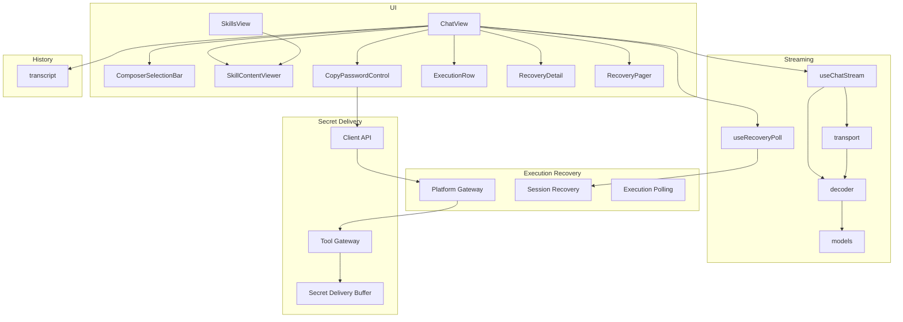

**Diagram sources**
- [ChatView.tsx:407-675](file://products/operator-portal/web-ui/app/src/chat/ChatView.tsx#L407-L675)
- [useRecoveryPoll.ts:1-234](file://products/operator-portal/web-ui/app/src/chat/useRecoveryPoll.ts#L1-L234)
- [useChatStream.ts:1-80](file://products/operator-portal/web-ui/app/src/stream/useChatStream.ts#L1-L80)
- [transport.ts:1-60](file://products/operator-portal/web-ui/app/src/stream/transport.ts#L1-L60)
- [decoder.ts:100-114](file://products/operator-portal/web-ui/app/src/stream/decoder.ts#L100-L114)
- [models.ts:56-61](file://products/operator-portal/web-ui/app/src/stream/models.ts#L56-L61)
- [client.ts:125-153](file://products/operator-portal/web-ui/app/src/api/client.ts#L125-L153)
- [sessions.ts:139-298](file://products/operator-portal/web-ui/app/src/api/sessions.ts#L139-L298)

**Section sources**
- [ChatView.tsx:407-675](file://products/operator-portal/web-ui/app/src/chat/ChatView.tsx#L407-L675)
- [useRecoveryPoll.ts:1-234](file://products/operator-portal/web-ui/app/src/chat/useRecoveryPoll.ts#L1-L234)
- [useChatStream.ts:1-80](file://products/operator-portal/web-ui/app/src/stream/useChatStream.ts#L1-L80)
- [transport.ts:1-60](file://products/operator-portal/web-ui/app/src/stream/transport.ts#L1-L60)
- [decoder.ts:100-114](file://products/operator-portal/web-ui/app/src/stream/decoder.ts#L100-L114)
- [models.ts:56-61](file://products/operator-portal/web-ui/app/src/stream/models.ts#L56-L61)
- [client.ts:125-153](file://products/operator-portal/web-ui/app/src/api/client.ts#L125-L153)
- [sessions.ts:139-298](file://products/operator-portal/web-ui/app/src/api/sessions.ts#L139-L298)

## Core Components
- ChatView: Renders sessions, messages, tool evidence, confirmation cards, composer, execution recovery display, and controls for skill drafting/graduation. Manages arrival highlighting, sticky request banners, execution recovery pagination, and one-time password delivery controls.
- useChatStream: Maintains per-turn state, accumulates deltas, handles tool frames, terminal events, confirmation requests/results, errors, session switching with abort, retry on stale session 404, and secret delivery frame processing.
- useRecoveryPoll: Provides bounded, visibility-aware polling for unsettled executions with 120-second observation windows, session scoping, and streaming suppression.
- transport: Opens SSE streams with auth headers and request IDs, reads chunks, and consumes them through the decoder. Encapsulates open failures and structured 409 detail parsing.
- decoder: Incrementally parses SSE blocks separated by double newlines, maps wire payloads to typed StreamFrame types, and safely ignores unknown or malformed frames. Includes secret delivery frame validation.
- ComposerSelectionBar: Displays a model selector when a model catalog is available; collapses otherwise.
- SkillContentViewer: Renders skill details including composition runbooks with structured sub-skill lists showing title, target, and notes, plus risk classification badges.
- SkillsView: Displays skills inventory with derived risk classification badges for compositions.
- transcript: Converts stored transcripts into ChatTurn arrays, attaching evidence and confirmations for replay parity with live streams.
- CopyPasswordControl: Handles one-time password redemption with expiration timers, clipboard integration, and security state management.
- ExecutionRow: Renders individual execution receipts with recovery projections, pagination, and uncertainty-preserving status display.
- RecoveryDetail: Displays read-only recovery information including labels, correlation facts, observations, and independent verification guidance.
- RecoveryPager: Manages paginated execution recovery records with availability warnings and last-view retention.

**Section sources**
- [ChatView.tsx:407-675](file://products/operator-portal/web-ui/app/src/chat/ChatView.tsx#L407-L675)
- [ChatView.tsx:595-749](file://products/operator-portal/web-ui/app/src/chat/ChatView.tsx#L595-L749)
- [ChatView.tsx:622-664](file://products/operator-portal/web-ui/app/src/chat/ChatView.tsx#L622-L664)
- [useChatStream.ts:135-501](file://products/operator-portal/web-ui/app/src/stream/useChatStream.ts#L135-L501)
- [useRecoveryPoll.ts:1-234](file://products/operator-portal/web-ui/app/src/chat/useRecoveryPoll.ts#L1-L234)
- [transport.ts:108-165](file://products/operator-portal/web-ui/app/src/stream/transport.ts#L108-L165)
- [decoder.ts:95-251](file://products/operator-portal/web-ui/app/src/stream/decoder.ts#L95-L251)
- [decoder.ts:100-114](file://products/operator-portal/web-ui/app/src/stream/decoder.ts#L100-L114)
- [ComposerSelectionBar.tsx:1-48](file://products/operator-portal/web-ui/app/src/chat/ComposerSelectionBar.tsx#L1-L48)
- [SkillContentViewer.tsx:45-193](file://products/operator-portal/web-ui/app/src/chat/SkillContentViewer.tsx#L45-L193)
- [SkillsView.tsx:93-139](file://products/operator-portal/web-ui/app/src/views/control/SkillsView.tsx#L93-L139)
- [transcript.ts:266-302](file://products/operator-portal/web-ui/app/src/chat/transcript.ts#L266-L302)

## Architecture Overview
The chat interface composes a React view with streaming adapters for both real-time messaging and execution recovery. The view renders messages, interactive elements, and execution recovery projections while the adapters manage SSE lifecycles, decodes events, and updates turn state. Transport abstracts network concerns and ensures consistent error handling and request correlation. The execution recovery system provides crash-safe operation with bounded observation windows and uncertainty-preserving status display. The one-time password delivery system provides secure credential handoff without exposing values in the stream or render tree. Composition runbooks extend the skill viewing experience with structured guidance for multi-step workflows.

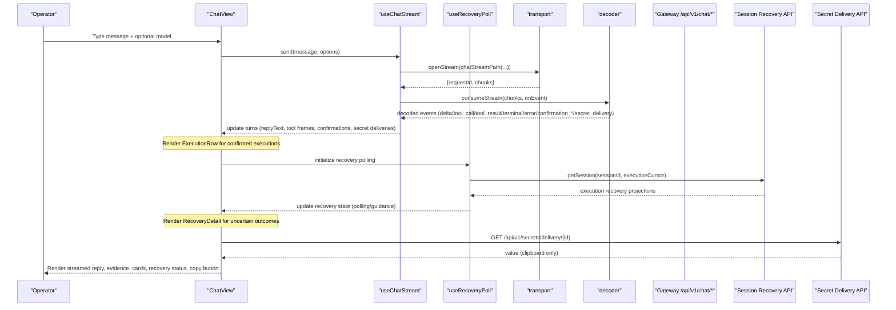

**Diagram sources**
- [useChatStream.ts:240-328](file://products/operator-portal/web-ui/app/src/stream/useChatStream.ts#L240-L328)
- [useRecoveryPoll.ts:175-207](file://products/operator-portal/web-ui/app/src/chat/useRecoveryPoll.ts#L175-L207)
- [transport.ts:111-165](file://products/operator-portal/web-ui/app/src/stream/transport.ts#L111-L165)
- [decoder.ts:227-251](file://products/operator-portal/web-ui/app/src/stream/decoder.ts#L227-L251)
- [ChatView.tsx:1801-1824](file://products/operator-portal/web-ui/app/src/chat/ChatView.tsx#L1801-L1824)
- [tools.py:39-58](file://products/platform-gateway/src/platform_gateway/api/routes/tools.py#L39-L58)

## Detailed Component Analysis

### ChatView: Message Rendering, Evidence, History, Recovery, and Secret Delivery
- TurnGroup renders user bubbles, assistant markdown content, loading indicators, post-approval "Agent is working…" indicator, tool evidence panel, confirmation cards, execution recovery display, and one-time password delivery controls.
- Arrival window and typewriter reveal animate newly landed text within a bounded time, respecting reduced-motion preferences.
- Sticky request banner keeps the user's prompt visible when the assistant reply scrolls out of view.
- EvidencePanel aggregates tool calls and results, shows status tags, parameters, execution metadata, truncation notices, and special rendering for screenshots.
- ConfirmationCardView displays pending approvals, flow summaries, change-request projections, technical details, and execution receipts, with role-based decision gating and integrated execution recovery display.
- ExecutionRow renders individual execution receipts with recovery projections, pagination controls, and uncertainty-preserving status labels.
- RecoveryDetail displays read-only recovery information including labels, correlation facts, observations, and independent verification guidance.
- RecoveryPager manages paginated execution recovery records with availability warnings and last-view retention.
- CopyPasswordControl renders one-time password redemption with expiration timers, clipboard integration, and security state management.
- Session actions include Draft as skill, Graduate as skill, Declare target, and Copy session id, each with appropriate role checks and error messaging.
- Transcript seeding uses transcriptToTurns to convert stored history into ChatTurn objects, preserving evidence, confirmations, secret deliveries, and execution recovery data for replay parity.

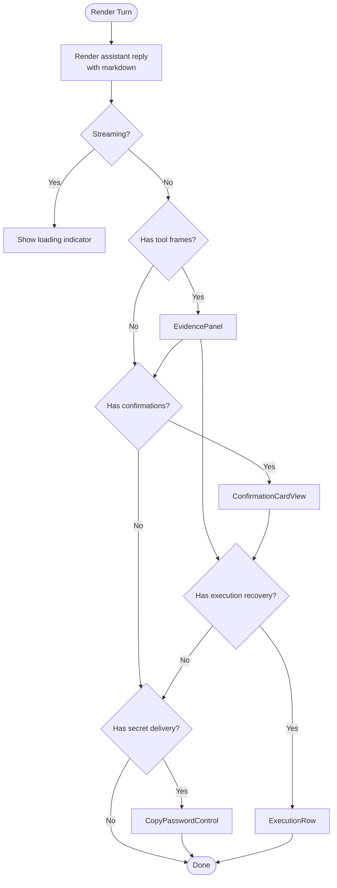

**Diagram sources**
- [ChatView.tsx:605-749](file://products/operator-portal/web-ui/app/src/chat/ChatView.tsx#L605-L749)
- [ChatView.tsx:622-664](file://products/operator-portal/web-ui/app/src/chat/ChatView.tsx#L622-L664)
- [ChatView.tsx:1672-1694](file://products/operator-portal/web-ui/app/src/chat/ChatView.tsx#L1672-L1694)
- [transcript.ts:266-302](file://products/operator-portal/web-ui/app/src/chat/transcript.ts#L266-L302)

**Section sources**
- [ChatView.tsx:98-314](file://products/operator-portal/web-ui/app/src/chat/ChatView.tsx#L98-L314)
- [ChatView.tsx:316-593](file://products/operator-portal/web-ui/app/src/chat/ChatView.tsx#L316-L593)
- [ChatView.tsx:407-675](file://products/operator-portal/web-ui/app/src/chat/ChatView.tsx#L407-L675)
- [ChatView.tsx:595-749](file://products/operator-portal/web-ui/app/src/chat/ChatView.tsx#L595-L749)
- [ChatView.tsx:622-664](file://products/operator-portal/web-ui/app/src/chat/ChatView.tsx#L622-L664)
- [ChatView.tsx:1672-1694](file://products/operator-portal/web-ui/app/src/chat/ChatView.tsx#L1672-L1694)
- [transcript.ts:266-302](file://products/operator-portal/web-ui/app/src/chat/transcript.ts#L266-L302)

### useChatStream: Streaming Lifecycle, Event Handling, Recovery, and Secret Delivery
- send creates a new turn, opens an SSE stream, and consumes events until completion or error.
- handleEvent accumulates delta text, records tool calls/results, marks terminal, manages confirmation cards and errors, and processes secret delivery frames.
- decide posts a confirmation decision and resumes the SSE stream bound to the parked turn, locking card states and completing the turn appropriately.
- Session switching aborts in-flight streams, stashes current turns, restores cached turns, and supports reseedTurns for authoritative timeline refresh.
- Error recovery includes:
  - Stale session 404: drops sessionId and retries once to auto-create.
  - Authentication failure 401: surfaces sign-in guidance.
  - Confirmation race 409: flips card to winner's outcome with attribution if present.
  - Expired confirmation 410: marks expired and completes the turn.
  - AbortError on switch: settles partial turns without leaving spinners.
  - Secret delivery expiration: handles expired delivery handles gracefully.

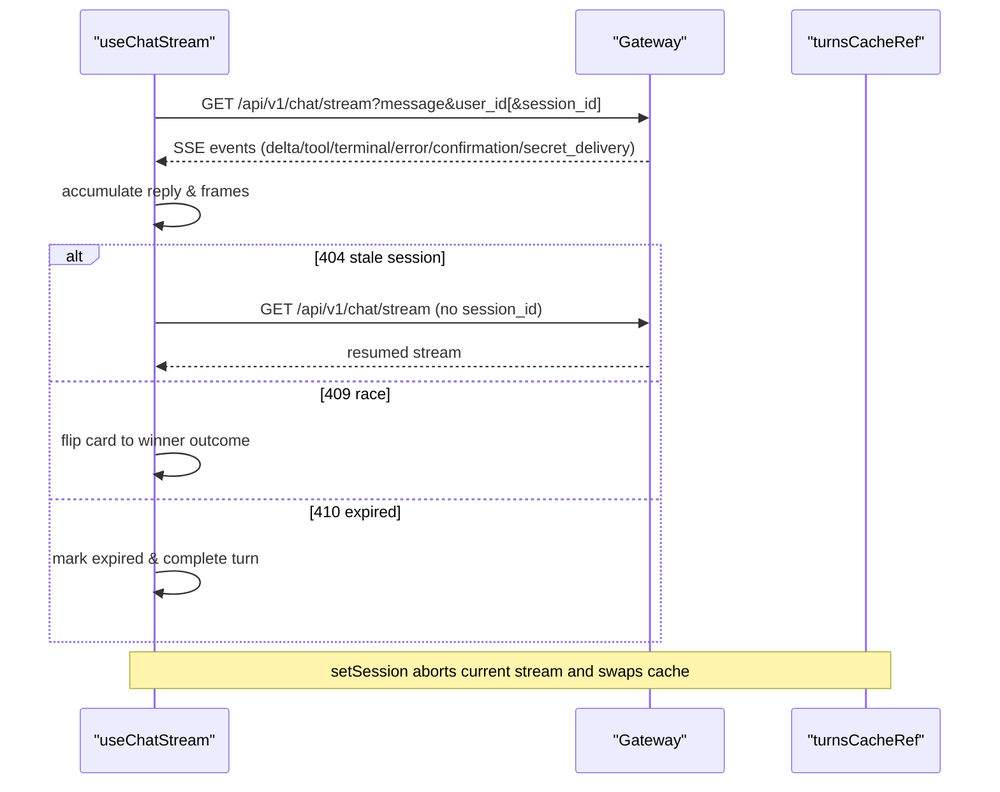

**Diagram sources**
- [useChatStream.ts:240-454](file://products/operator-portal/web-ui/app/src/stream/useChatStream.ts#L240-L454)
- [useChatStream.ts:456-488](file://products/operator-portal/web-ui/app/src/stream/useChatStream.ts#L456-L488)

**Section sources**
- [useChatStream.ts:167-328](file://products/operator-portal/web-ui/app/src/stream/useChatStream.ts#L167-L328)
- [useChatStream.ts:330-454](file://products/operator-portal/web-ui/app/src/stream/useChatStream.ts#L330-L454)
- [useChatStream.ts:456-488](file://products/operator-portal/web-ui/app/src/stream/useChatStream.ts#L456-L488)

### useRecoveryPoll: Bounded Observation Windows and Visibility-Aware Polling
- hasUnsettledExecution detects executions with available but unresolved recovery projections.
- recoveryFingerprint creates stable fingerprints for recovery data changes, excluding volatile timestamps.
- useRecoveryPoll manages bounded observation windows with 120-second limits, 2-second polling intervals, and visibility-aware behavior.
- Session scoping prevents cross-session polling leakage and clears state on session changes.
- Streaming suppression prevents conflicts with live message streaming.
- Graceful degradation shows refresh guidance after observation windows expire without hiding recorded outcomes.

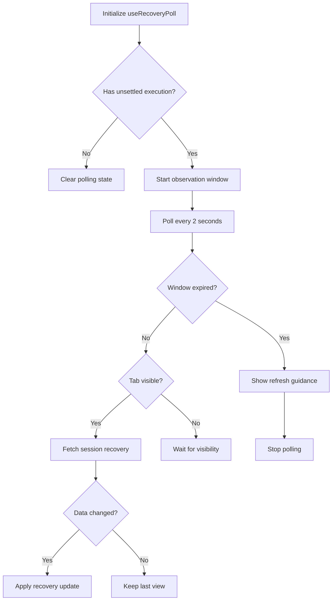

**Diagram sources**
- [useRecoveryPoll.ts:37-50](file://products/operator-portal/web-ui/app/src/chat/useRecoveryPoll.ts#L37-L50)
- [useRecoveryPoll.ts:175-207](file://products/operator-portal/web-ui/app/src/chat/useRecoveryPoll.ts#L175-L207)

**Section sources**
- [useRecoveryPoll.ts:1-234](file://products/operator-portal/web-ui/app/src/chat/useRecoveryPoll.ts#L1-L234)

### Transport Layer: Open, Consume, and Decode
- openStream builds authenticated requests with x-request-id, handles non-OK responses by throwing StreamOpenError with parsed detail when possible, and returns requestId plus a chunk source.
- readableToChunks adapts ReadableStream or AsyncIterable inputs to a uniform async generator.
- consumeStream drives the SseLineDecoder over UTF-8 decoded chunks, emitting only fully delimited events.
- chatStreamPath constructs query strings including message, user_id, optional session_id, input_modality, and model.

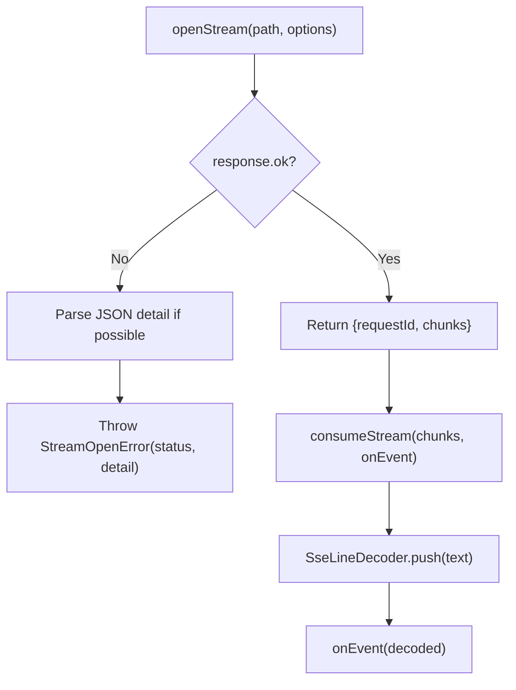

**Diagram sources**
- [transport.ts:111-165](file://products/operator-portal/web-ui/app/src/stream/transport.ts#L111-L165)
- [decoder.ts:227-251](file://products/operator-portal/web-ui/app/src/stream/decoder.ts#L227-L251)

**Section sources**
- [transport.ts:1-60](file://products/operator-portal/web-ui/app/src/stream/transport.ts#L1-L60)
- [transport.ts:88-165](file://products/operator-portal/web-ui/app/src/stream/transport.ts#L88-L165)

### Decoder: Frame Mapping and Robustness
- SseLineDecoder buffers raw text, splits on double newline, and yields decoded events only when complete.
- decodeEventBlock extracts session_id and maps payload to StreamFrame; unknown or malformed blocks are ignored to avoid breaking the stream.
- toFrame recognizes delta, terminal, tool_call, tool_result, confirmation_request, confirmation_result, error, and secret_delivery frames, normalizing fields and dropping unsupported actions gracefully.
- toSecretDeliveryFrame validates UUID format, channel type, and expiration timestamp for secret delivery frames.

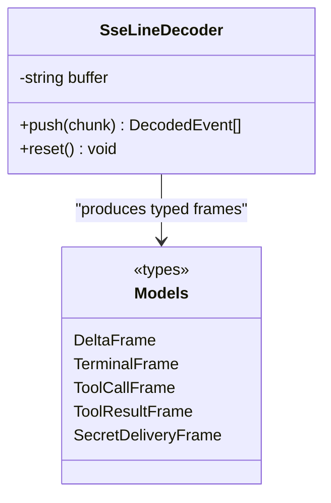

**Diagram sources**
- [decoder.ts:95-251](file://products/operator-portal/web-ui/app/src/stream/decoder.ts#L95-L251)
- [decoder.ts:100-114](file://products/operator-portal/web-ui/app/src/stream/decoder.ts#L100-L114)
- [models.ts:1-54](file://products/operator-portal/web-ui/app/src/stream/models.ts#L1-L54)
- [models.ts:56-61](file://products/operator-portal/web-ui/app/src/stream/models.ts#L56-L61)

**Section sources**
- [decoder.ts:95-251](file://products/operator-portal/web-ui/app/src/stream/decoder.ts#L95-L251)
- [decoder.ts:100-114](file://products/operator-portal/web-ui/app/src/stream/decoder.ts#L100-L114)
- [models.ts:1-54](file://products/operator-portal/web-ui/app/src/stream/models.ts#L1-L54)
- [models.ts:56-61](file://products/operator-portal/web-ui/app/src/stream/models.ts#L56-L61)

### Composer: Input, Model Selection, and Tool Invocation Display
- ComposerSelectionBar mounts under the message input and shows a model selector when a catalog is available; it collapses when no models are configured, letting server-side defaults apply.
- ChatView integrates the composer with voice input support and error alerts, and passes selected model to useChatStream.send via SendOptions.model.
- Tool invocations appear in the EvidencePanel with call/result pairing, status tags, parameter expansion, execution metadata, truncation notices, and specialized screenshot rendering.

**Section sources**
- [ComposerSelectionBar.tsx:1-48](file://products/operator-portal/web-ui/app/src/chat/ComposerSelectionBar.tsx#L1-L48)
- [ChatView.tsx:1697-1704](file://products/operator-portal/web-ui/app/src/chat/ChatView.tsx#L1697-L1704)
- [ChatView.tsx:98-314](file://products/operator-portal/web-ui/app/src/chat/ChatView.tsx#L98-L314)

## Execution Recovery System

### Overview
The execution recovery system provides crash-safe operation and outcome reconciliation for approved mutations. It displays durable-ledger state labels, correlation facts, observation histories, and uncertainty-preserving status information to operators. The system distinguishes between not_dispatched, dispatch_claimed, outcome_unknown, and result_recorded states, ensuring operators understand the certainty level of each execution outcome.

### Security Architecture
The system enforces several security guarantees:
- **Owner Scoping**: Recovery data is only accessible to the original session owner
- **Read-Only Access**: No mutation capabilities are exposed through recovery interfaces
- **Uncertainty Preservation**: Unknown outcomes are clearly distinguished from successful completions
- **Ledger Integrity**: Conflicting reports are flagged rather than silently resolved
- **Observation Bounds**: Historical observations are limited to prevent excessive data exposure
- **Independent Verification Guidance**: Operators are guided to verify target systems independently

### Implementation Components

#### Frontend Integration
The execution recovery system consists of several key components:

1. **recoveryLabel**: Maps ExecutionRecovery states to user-friendly labels and guidance notes
2. **RecoveryDetail**: Displays read-only recovery information with correlation facts and observation history
3. **ExecutionRow**: Renders individual execution receipts with recovery projections and pagination
4. **RecoveryPager**: Manages paginated execution recovery records with availability warnings
5. **useRecoveryPoll**: Provides bounded observation windows with visibility-aware polling

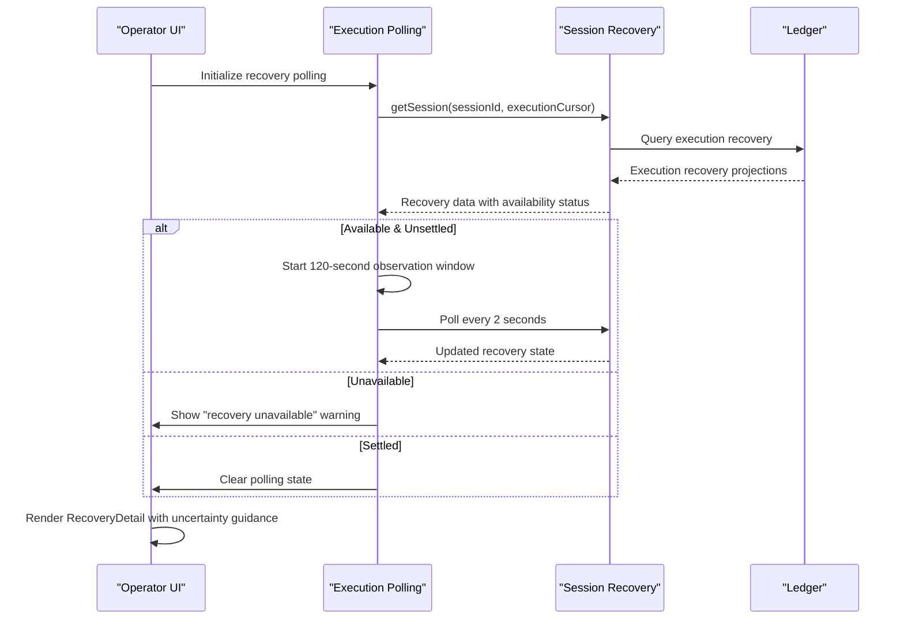

**Diagram sources**
- [ChatView.tsx:407-480](file://products/operator-portal/web-ui/app/src/chat/ChatView.tsx#L407-L480)
- [ChatView.tsx:485-578](file://products/operator-portal/web-ui/app/src/chat/ChatView.tsx#L485-L578)
- [ChatView.tsx:580-675](file://products/operator-portal/web-ui/app/src/chat/ChatView.tsx#L580-L675)
- [useRecoveryPoll.ts:175-207](file://products/operator-portal/web-ui/app/src/chat/useRecoveryPoll.ts#L175-L207)

### Data Flow and Validation
The execution recovery system follows a strict data flow with comprehensive validation:

- **Detection Phase**: hasUnsettledExecution identifies executions requiring recovery polling
- **Polling Phase**: useRecoveryPoll manages bounded observation windows with visibility awareness
- **Retrieval Phase**: Session recovery API provides owner-scoped execution projections
- **Rendering Phase**: Frontend components display uncertainty-preserving status and guidance
- **Pagination Phase**: RecoveryPager handles large observation histories with cursor-based navigation

### Testing and Validation
The system includes comprehensive test coverage:
- **State Labeling**: Verifies correct labels for all recovery states including late reports and conflicts
- **Polling Behavior**: Tests bounded observation windows, visibility awareness, and session scoping
- **Error Handling**: Validates graceful degradation for unavailable ledgers and transport failures
- **Pagination**: Ensures proper handling of truncated observation histories
- **Security**: Confirms owner scoping and read-only access patterns

**Section sources**
- [ChatView.tsx:407-675](file://products/operator-portal/web-ui/app/src/chat/ChatView.tsx#L407-L675)
- [useRecoveryPoll.ts:1-234](file://products/operator-portal/web-ui/app/src/chat/useRecoveryPoll.ts#L1-L234)
- [ExecutionRecovery.test.tsx:1-200](file://products/operator-portal/web-ui/app/src/chat/__tests__/ExecutionRecovery.test.tsx#L1-L200)
- [useRecoveryPoll.test.ts:1-390](file://products/operator-portal/web-ui/app/src/chat/__tests__/useRecoveryPoll.test.ts#L1-L390)

## One-Time Password Delivery System

### Overview
The one-time password delivery system provides secure credential handoff from agents to operators without exposing sensitive values in the stream, render tree, logs, or audit stores. When an agent generates a password using `secrets.generate_password` with `handoff='portal_copy'`, the system creates a temporary, single-use delivery handle that allows operators to securely copy the password to their clipboard through an authenticated gateway endpoint.

### Security Architecture
The system enforces several security guarantees:
- **No Projection**: The generated password never appears in conversation transcripts, evidence, titles, cards, or any human-readable projection
- **Single Use**: Each delivery handle can be redeemed exactly once, then immediately invalidated
- **Owner Scoping**: Redemption requires authentication matching the original session owner
- **TTL Expiration**: Delivery handles expire after a configurable time period (default 300 seconds)
- **Clipboard-Only Access**: Values are written directly to the clipboard without being displayed in the UI
- **Server-Side Storage**: Secrets are stored in ephemeral buffers (in-memory or Redis) with automatic cleanup

### Implementation Components

#### Frontend Integration
The `CopyPasswordControl` component renders a secure copy button with the following behavior:
- **State Management**: Tracks ready, copying, copied, and unavailable states
- **Expiration Handling**: Monitors delivery handle expiration and disables the button when expired
- **Security Validation**: Prevents multiple attempts and validates clipboard access
- **User Feedback**: Provides clear status messages about copy success, expiration, and unavailability

#### Backend Processing
The backend consists of three main layers:

1. **Tool Gateway**: Implements `secrets.generate_password` and `secrets.deliver` tools with proper validation and policy enforcement
2. **Platform Gateway**: Provides the `/api/v1/secrets/delivery/{delivery_id}` endpoint for secure redemption
3. **Secret Delivery Buffer**: Stores secrets with TTL and owner scoping, supporting both in-memory and Redis backends

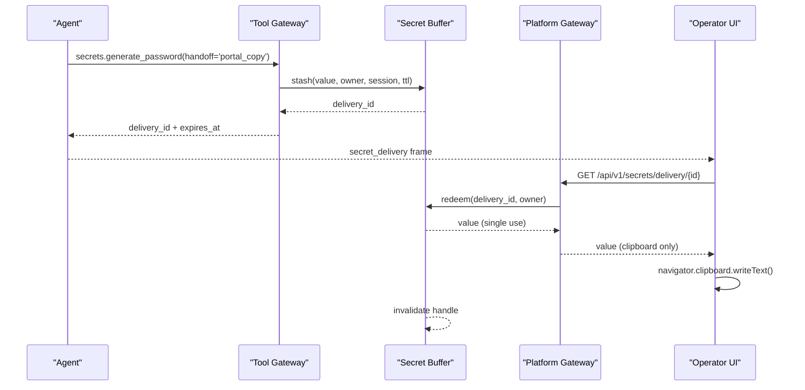

**Diagram sources**
- [secrets_connector.py:393-521](file://products/tool-gateway/src/tool_gateway/tools/secrets_connector.py#L393-L521)
- [secret_delivery.py:89-158](file://products/tool-gateway/src/tool_gateway/tools/secret_delivery.py#L89-L158)
- [tools.py:39-58](file://products/platform-gateway/src/platform_gateway/api/routes/tools.py#L39-L58)
- [client.ts:125-153](file://products/operator-portal/web-ui/app/src/api/client.ts#L125-L153)

### Data Flow and Validation
The secret delivery system follows a strict data flow with comprehensive validation:

- **Generation Phase**: Agent calls `secrets.generate_password` with policy constraints and handoff preference
- **Storage Phase**: Value is stashed in the delivery buffer with owner context and TTL
- **Rendering Phase**: Frontend receives `secret_delivery` frame with delivery metadata (never the value)
- **Redemption Phase**: Operator clicks copy button, triggering authenticated redemption
- **Cleanup Phase**: Handle is immediately invalidated after successful redemption

### Testing and Validation
The system includes comprehensive test coverage:
- **Single Use Enforcement**: Verifies handles cannot be reused after redemption
- **Expiration Handling**: Tests TTL-based expiration and graceful degradation
- **Owner Scoping**: Ensures only the original session owner can redeem
- **Clipboard Integration**: Validates clipboard write operations and error handling
- **Security State**: Confirms no plaintext values persist in storage or UI

**Section sources**
- [secrets_connector.py:393-521](file://products/tool-gateway/src/tool_gateway/tools/secrets_connector.py#L393-L521)
- [secrets_connector.py:524-653](file://products/tool-gateway/src/tool_gateway/tools/secrets_connector.py#L524-L653)
- [secret_delivery.py:89-158](file://products/tool-gateway/src/tool_gateway/tools/secret_delivery.py#L89-L158)
- [secret_delivery.py:167-229](file://products/tool-gateway/src/tool_gateway/tools/secret_delivery.py#L167-L229)
- [tools.py:39-58](file://products/platform-gateway/src/platform_gateway/api/routes/tools.py#L39-L58)
- [client.ts:125-153](file://products/operator-portal/web-ui/app/src/api/client.ts#L125-L153)
- [ChatView.tsx:622-664](file://products/operator-portal/web-ui/app/src/chat/ChatView.tsx#L622-L664)
- [decoder.ts:100-114](file://products/operator-portal/web-ui/app/src/stream/decoder.ts#L100-L114)
- [models.ts:56-61](file://products/operator-portal/web-ui/app/src/stream/models.ts#L56-L61)
- [SPEC-062 spec.md:171-186](file://docs/specs/SPEC-062-secure-password-generation-and-delivery/spec.md#L171-L186)
- [TurnGroup.test.tsx:70-117](file://products/operator-portal/web-ui/app/src/chat/__tests__/TurnGroup.test.tsx#L70-L117)

## Composition Runbooks Feature

### Overview
The composition runbooks feature enhances the operator portal chat interface to display structured guidance for multi-step workflows. When viewing a composition skill, operators see a structured list showing each sub-skill's title, target, and associated notes, along with derived risk classification badges that indicate the overall risk level of the composition.

### Sub-Skill Display Structure
The SkillContentViewer component renders composition runbooks with the following structure:

- **Ordered List**: Each sub-skill appears in the declared sequence, maintaining the intended workflow order
- **Resolved Title**: Shows the human-readable title from the sub-skill's metadata, falling back to skill_id if unresolved
- **Target Information**: Displays the web target when available, omitting it for infrastructure skills without web targets
- **Associated Notes**: Shows any plain-language notes provided by the composition author
- **Visual Hierarchy**: Uses typography and spacing to clearly distinguish between different information levels

### Risk Classification Badges
Compositions derive their risk classification automatically based on their sub-skills:

- **Write Risk**: If any sub-skill performs write operations, the composition derives a "write" risk class
- **Read Risk**: If all sub-skills are read-only, the composition derives a "read" risk class
- **Badge Display**: Risk badges use color coding (default for read, warning for write) consistent with confirmation cards
- **List Integration**: Risk badges appear in the skills inventory table alongside other skill metadata

### Implementation Details
The composition runbooks feature is implemented across several components:

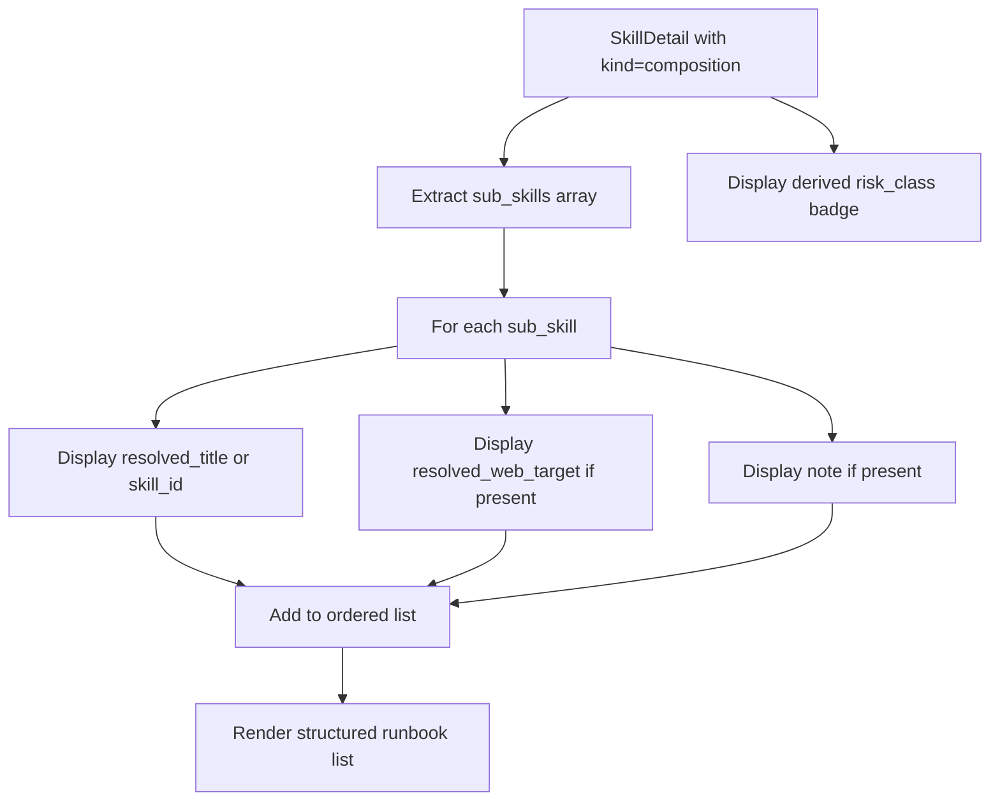

**Diagram sources**
- [SkillContentViewer.tsx:131-167](file://products/operator-portal/web-ui/app/src/chat/SkillContentViewer.tsx#L131-L167)
- [SkillsView.tsx:100-113](file://products/operator-portal/web-ui/app/src/views/control/SkillsView.tsx#L100-L113)

### Data Flow and Enrichment
The composition data flows through the system with read-path enrichment:

- **Authored Data**: Contains skill_id and optional note for each sub-skill
- **Enriched Data**: Skills-hub's read path adds resolved_title and resolved_web_target
- **Fallback Behavior**: Missing sub-skills degrade gracefully to show authored skill_id
- **Display Only**: The structured list is for review purposes only and doesn't enforce workflow execution

### Testing and Validation
The feature includes comprehensive test coverage:

- **Structured List Rendering**: Verifies ordered list with correct title, target, and note display
- **Fallback Behavior**: Tests graceful degradation when sub-skill titles are unresolved
- **Raw View Compatibility**: Ensures Raw view shows authored body verbatim without structured list
- **Non-Composition Skills**: Confirms no sub-skill list appears for regular skills

**Section sources**
- [SkillContentViewer.tsx:131-167](file://products/operator-portal/web-ui/app/src/chat/SkillContentViewer.tsx#L131-L167)
- [SkillsView.tsx:100-113](file://products/operator-portal/web-ui/app/src/views/control/SkillsView.tsx#L100-L113)
- [SkillContentViewer.test.tsx:113-172](file://products/operator-portal/web-ui/app/src/chat/__tests__/SkillContentViewer.test.tsx#L113-L172)

## Dependency Analysis
- ChatView depends on useChatStream for streaming state and decisions, on useRecoveryPoll for execution recovery polling, on transcript for history seeding, on ComposerSelectionBar for model selection, and on CopyPasswordControl for secret delivery handling.
- useChatStream depends on transport for SSE I/O and on decoder/models for event processing, including secret delivery frame handling.
- useRecoveryPoll depends on sessions API for execution recovery data and manages bounded observation windows.
- SkillContentViewer depends on renderMarkdown for safe HTML generation and displays composition runbooks when available.
- SkillsView depends on derived risk_class from skills-hub summary for badge display.
- transport depends on client utilities for auth headers and gateway URL resolution.
- decoder depends on models for type definitions, including SecretDeliveryFrame.
- Client API provides secure secret redemption with clipboard integration and security state management.

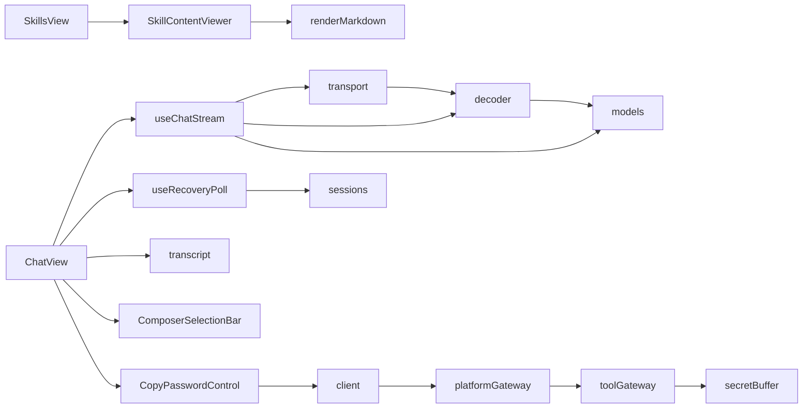

**Diagram sources**
- [ChatView.tsx:1-100](file://products/operator-portal/web-ui/app/src/chat/ChatView.tsx#L1-L100)
- [useChatStream.ts:1-80](file://products/operator-portal/web-ui/app/src/stream/useChatStream.ts#L1-L80)
- [useRecoveryPoll.ts:1-234](file://products/operator-portal/web-ui/app/src/chat/useRecoveryPoll.ts#L1-L234)
- [transport.ts:1-60](file://products/operator-portal/web-ui/app/src/stream/transport.ts#L1-L60)
- [decoder.ts:1-40](file://products/operator-portal/web-ui/app/src/stream/decoder.ts#L1-L40)
- [models.ts:1-54](file://products/operator-portal/web-ui/app/src/stream/models.ts#L1-L54)
- [models.ts:56-61](file://products/operator-portal/web-ui/app/src/stream/models.ts#L56-L61)
- [SkillContentViewer.tsx:1-193](file://products/operator-portal/web-ui/app/src/chat/SkillContentViewer.tsx#L1-L193)
- [SkillsView.tsx:93-139](file://products/operator-portal/web-ui/app/src/views/control/SkillsView.tsx#L93-L139)
- [client.ts:125-153](file://products/operator-portal/web-ui/app/src/api/client.ts#L125-L153)
- [sessions.ts:139-298](file://products/operator-portal/web-ui/app/src/api/sessions.ts#L139-L298)

**Section sources**
- [ChatView.tsx:1-100](file://products/operator-portal/web-ui/app/src/chat/ChatView.tsx#L1-L100)
- [useChatStream.ts:1-80](file://products/operator-portal/web-ui/app/src/stream/useChatStream.ts#L1-L80)
- [useRecoveryPoll.ts:1-234](file://products/operator-portal/web-ui/app/src/chat/useRecoveryPoll.ts#L1-L234)
- [transport.ts:1-60](file://products/operator-portal/web-ui/app/src/stream/transport.ts#L1-L60)
- [decoder.ts:1-40](file://products/operator-portal/web-ui/app/src/stream/decoder.ts#L1-L40)
- [models.ts:1-54](file://products/operator-portal/web-ui/app/src/stream/models.ts#L1-L54)
- [models.ts:56-61](file://products/operator-portal/web-ui/app/src/stream/models.ts#L56-L61)
- [SkillContentViewer.tsx:1-193](file://products/operator-portal/web-ui/app/src/chat/SkillContentViewer.tsx#L1-L193)
- [SkillsView.tsx:93-139](file://products/operator-portal/web-ui/app/src/views/control/SkillsView.tsx#L93-L139)
- [client.ts:125-153](file://products/operator-portal/web-ui/app/src/api/client.ts#L125-L153)
- [sessions.ts:139-298](file://products/operator-portal/web-ui/app/src/api/sessions.ts#L139-L298)

## Performance Considerations
- Typewriter reveal with arrival window: New reply text is revealed incrementally within a fixed time window, improving perceived responsiveness without blocking rendering. Reduced motion preference disables animation for accessibility.
- Segment breaks: Tool frames trigger paragraph breaks so subsequent text segments render cleanly, avoiding merged headings or sentences.
- Efficient decoding: SseLineDecoder emits events only on complete blocks, minimizing allocations and preventing partial frames from disrupting the stream.
- Abort on session switch: In-flight streams are aborted promptly to avoid unnecessary work and stale UI states.
- Collapsible selection bar: Model selector collapses when unavailable, keeping the composer compact and reducing layout shifts.
- Composition runbook rendering: Structured sub-skill lists are rendered efficiently with minimal DOM manipulation and fallback handling for missing data.
- Secret delivery optimization: One-time passwords are handled asynchronously with immediate UI feedback and background redemption processing.
- Memory management: Secret delivery handles are automatically cleaned up after expiration or redemption to prevent memory leaks.
- Execution recovery polling: Bounded observation windows prevent indefinite polling with 120-second limits and visibility-aware behavior.
- Recovery fingerprinting: Stable fingerprints prevent unnecessary re-renders during identical recovery data updates.
- Pagination efficiency: Execution recovery pagination uses cursor-based navigation to minimize data transfer and improve performance.

## Troubleshooting Guide
Common issues and their handling:
- Stale session 404: The hook detects a 404 on open, clears the session pointer, retries once without session_id, and updates the session id from the response. Verified by tests asserting URL changes and recovered reply text.
- Authentication 401: The hook surfaces a clear sign-in message to guide users back to authentication.
- Confirmation race 409: If another approver decided first, the card flips to the winner's outcome with attribution and completes the turn to prevent hung UI.
- Expired confirmation 410: The card is marked expired and the turn completes, avoiding a perpetual spinner.
- Malformed or unknown SSE frames: The decoder ignores non-data lines and malformed JSON, ensuring corrupt frames do not break the stream.
- Empty catalog: ComposerSelectionBar collapses when no models are configured, falling back to server-side defaults.
- Missing sub-skill titles: Composition runbooks gracefully fall back to displaying skill_id when resolved titles are unavailable.
- Unresolved web targets: Infrastructure skills without web targets simply omit the target line from the runbook display.
- Secret delivery expiration: CopyPasswordControl displays "Password expired" message and disables the copy button when delivery handles expire.
- Secret delivery unavailability: Handles invalid redemption attempts gracefully and suggests generating a new password.
- Clipboard access denied: Falls back to "Password unavailable" state when clipboard operations fail.
- Authentication required: Prevents secret redemption without proper authentication headers.
- Execution recovery unavailable: Shows "recovery unavailable" warning while preserving presentation row data.
- Recovery polling timeout: Displays refresh guidance after 120-second observation window expires without hiding recorded outcomes.
- Cross-session recovery leakage: Properly clears recovery state when sessions change to prevent data contamination.
- Streaming conflicts: Recovery polling is suppressed during live streaming to prevent conflicts with message updates.
- Transport errors in recovery: Retains last readable view and continues polling without treating errors as settled outcomes.

**Section sources**
- [useChatStream.ts:283-328](file://products/operator-portal/web-ui/app/src/stream/useChatStream.ts#L283-L328)
- [useChatStream.ts:392-454](file://products/operator-portal/web-ui/app/src/stream/useChatStream.ts#L392-L454)
- [useRecoveryPoll.ts:175-207](file://products/operator-portal/web-ui/app/src/chat/useRecoveryPoll.ts#L175-L207)
- [ChatView.tsx:657-675](file://products/operator-portal/web-ui/app/src/chat/ChatView.tsx#L657-L675)
- [decoder.ts:204-251](file://products/operator-portal/web-ui/app/src/stream/decoder.ts#L204-L251)
- [decoder.ts:100-114](file://products/operator-portal/web-ui/app/src/stream/decoder.ts#L100-L114)
- [ComposerSelectionBar.tsx:22-27](file://products/operator-portal/web-ui/app/src/chat/ComposerSelectionBar.tsx#L22-L27)
- [useChatStream.test.ts:645-672](file://products/operator-portal/web-ui/app/src/stream/__tests__/useChatStream.test.ts#L645-L672)
- [transport.test.ts:22-48](file://products/operator-portal/web-ui/app/src/stream/__tests__/transport.test.ts#L22-L48)
- [decoder.test.ts:385-438](file://products/operator-portal/web-ui/app/src/stream/__tests__/decoder.test.ts#L385-L438)
- [SkillContentViewer.test.tsx:141-152](file://products/operator-portal/web-ui/app/src/chat/__tests__/SkillContentViewer.test.tsx#L141-L152)
- [TurnGroup.test.tsx:92-117](file://products/operator-portal/web-ui/app/src/chat/__tests__/TurnGroup.test.tsx#L92-L117)
- [ExecutionRecovery.test.tsx:357-370](file://products/operator-portal/web-ui/app/src/chat/__tests__/ExecutionRecovery.test.tsx#L357-L370)
- [useRecoveryPoll.test.ts:362-390](file://products/operator-portal/web-ui/app/src/chat/__tests__/useRecoveryPoll.test.ts#L362-L390)

## Conclusion
The streaming chat interface combines a robust React view with resilient SSE adapters for both real-time messaging and execution recovery. ChatView renders rich conversations with evidence, approval workflows, execution recovery projections, and secret delivery controls, while useChatStream manages streaming lifecycles, event accumulation, and recovery paths. The useRecoveryPoll hook provides bounded observation windows with visibility-aware polling for crash-safe execution reconciliation. The transport and decoder layers provide reliable, incremental parsing and error-tolerant decoding. Composer functionality supports model selection and integrates seamlessly with streaming. The execution recovery system provides uncertainty-preserving status display with clear guidance for independent verification. The one-time password delivery system provides secure credential handoff with expiration controls and clipboard integration, ensuring sensitive values never enter the stream or render tree. The composition runbooks feature enhances the operator experience by providing structured guidance for multi-step workflows with clear visual hierarchy and risk classification. Performance optimizations like arrival windows, segment breaks, bounded polling, and efficient pagination enhance responsiveness, and accessibility features ensure inclusive interaction. Together, these components deliver a responsive, auditable, and operator-friendly chat experience with enhanced compositional guidance capabilities, secure secret delivery mechanisms, and crash-safe execution reconciliation.