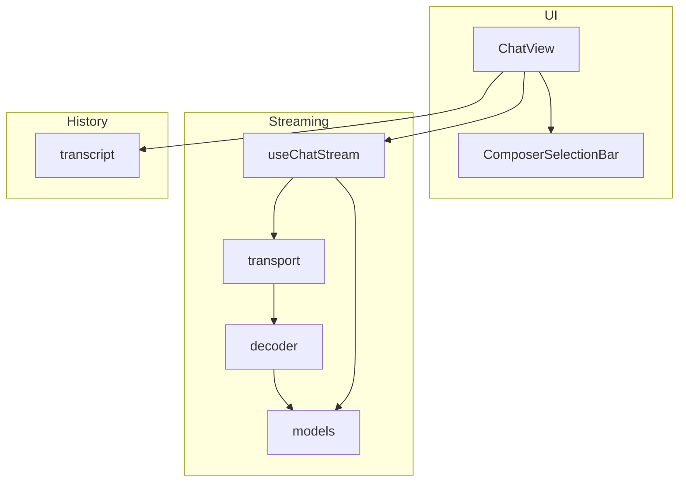
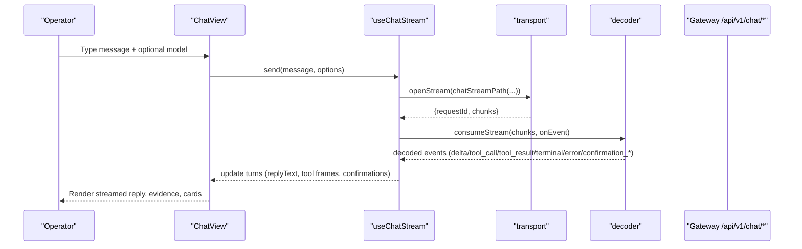
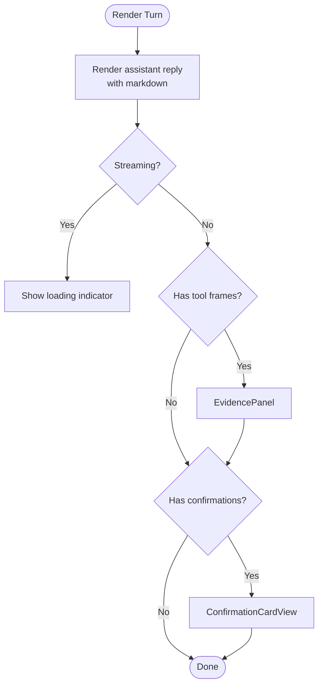
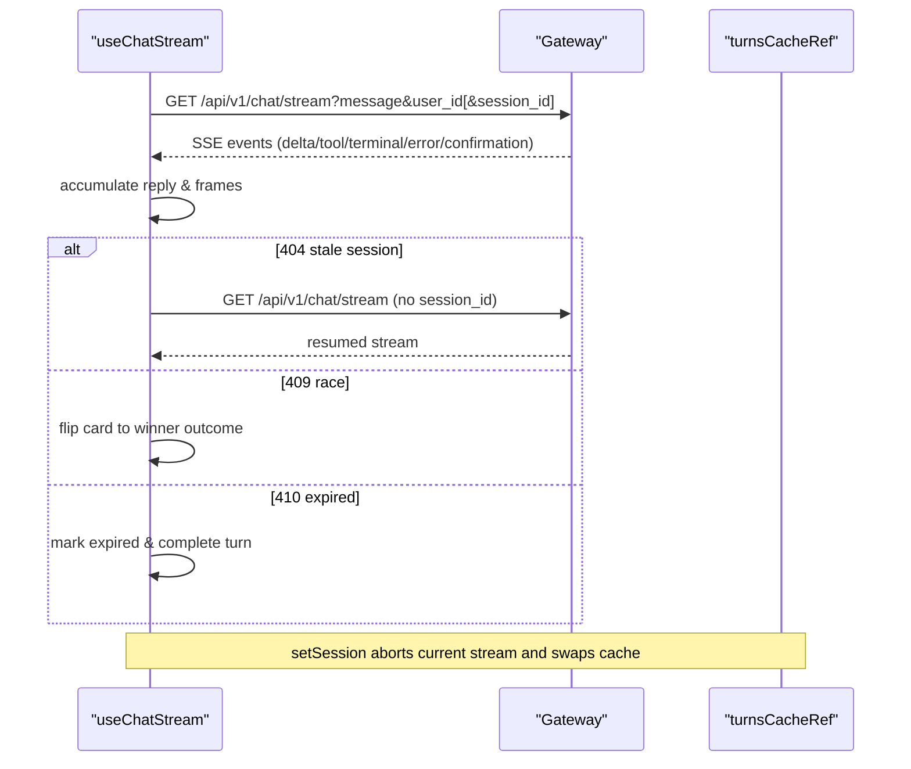
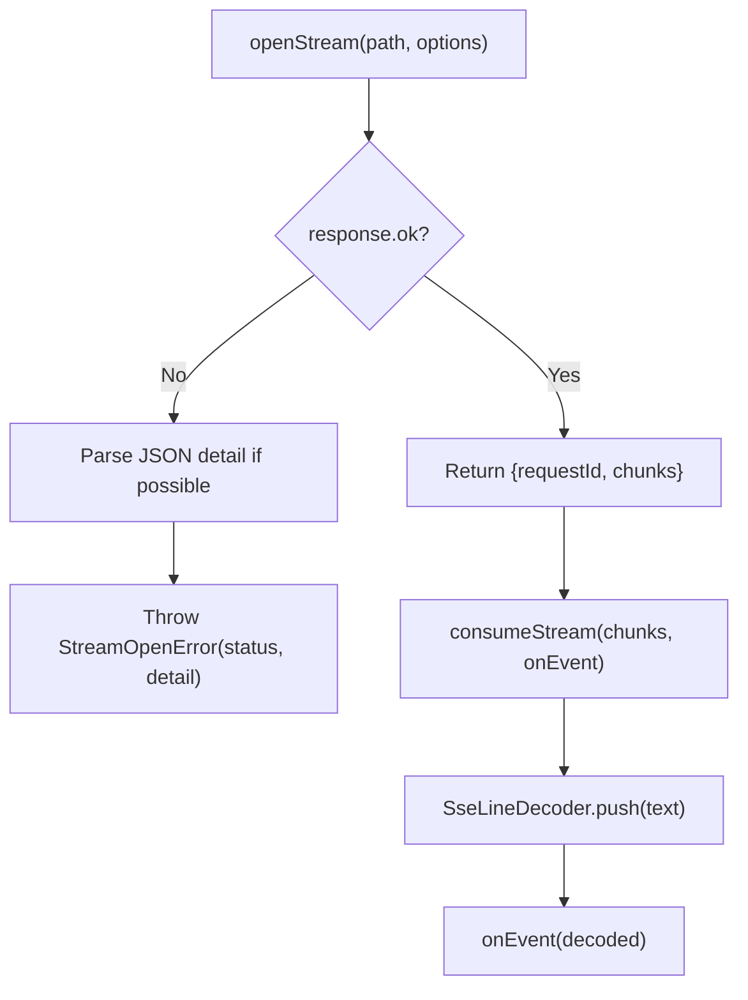
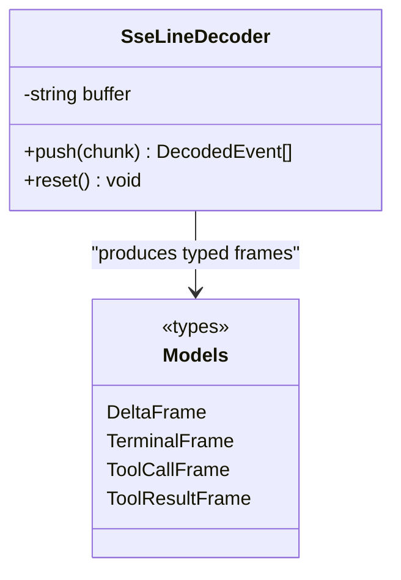
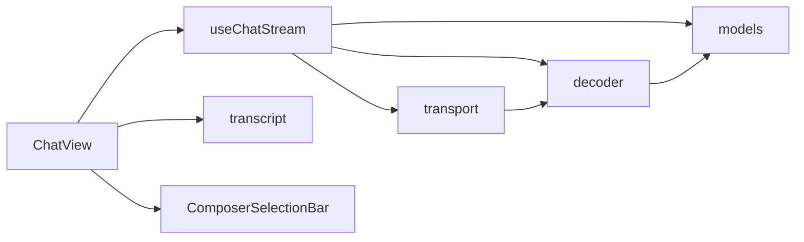

# Chat Interface

<cite>
**Referenced Files in This Document**
- [ChatView.tsx](file://products/operator-portal/web-ui/app/src/chat/ChatView.tsx)
- [useChatStream.ts](file://products/operator-portal/web-ui/app/src/stream/useChatStream.ts)
- [transport.ts](file://products/operator-portal/web-ui/app/src/stream/transport.ts)
- [decoder.ts](file://products/operator-portal/web-ui/app/src/stream/decoder.ts)
- [models.ts](file://products/operator-portal/web-ui/app/src/stream/models.ts)
- [ComposerSelectionBar.tsx](file://products/operator-portal/web-ui/app/src/chat/ComposerSelectionBar.tsx)
- [transcript.ts](file://products/operator-portal/web-ui/app/src/chat/transcript.ts)
- [useChatStream.test.ts](file://products/operator-portal/web-ui/app/src/stream/__tests__/useChatStream.test.ts)
- [transport.test.ts](file://products/operator-portal/web-ui/app/src/stream/__tests__/transport.test.ts)
- [decoder.test.ts](file://products/operator-portal/web-ui/app/src/stream/__tests__/decoder.test.ts)
</cite>

## Table of Contents
1. [Introduction](#introduction)
2. [Project Structure](#project-structure)
3. [Core Components](#core-components)
4. [Architecture Overview](#architecture-overview)
5. [Detailed Component Analysis](#detailed-component-analysis)
6. [Dependency Analysis](#dependency-analysis)
7. [Performance Considerations](#performance-considerations)
8. [Troubleshooting Guide](#troubleshooting-guide)
9. [Conclusion](#conclusion)

## Introduction
This document explains the streaming chat interface that enables real-time agent interactions in the operator portal. It covers the ChatView component architecture, message rendering, and conversation history management; the Server-Sent Events (SSE) implementation via the useChatStream hook for real-time streaming, transport layer abstraction, and event decoding; composer functionality for user input, model selection, and tool invocation display; as well as streaming performance optimizations, error recovery mechanisms, and accessibility features for screen readers and keyboard navigation.

## Project Structure
The chat interface is implemented in the operator portal web UI under the chat and stream modules:
- ChatView orchestrates session management, transcript rendering, evidence panels, confirmation cards, and composer integration.
- useChatStream owns per-turn state, SSE lifecycle, HITL confirmations, session switching, and turn caching.
- transport provides fetch-based SSE opening, chunk consumption, and request ID propagation.
- decoder implements an incremental SSE line decoder and frame mapping to typed models.
- ComposerSelectionBar hosts per-turn model selection when a catalog is available.
- transcript converts persisted transcripts into turns for replay.

**Diagram sources**
- [ChatView.tsx:1-100](file://products/operator-portal/web-ui/app/src/chat/ChatView.tsx#L1-L100)
- [useChatStream.ts:1-80](file://products/operator-portal/web-ui/app/src/stream/useChatStream.ts#L1-L80)
- [transport.ts:1-60](file://products/operator-portal/web-ui/app/src/stream/transport.ts#L1-L60)
- [decoder.ts:1-40](file://products/operator-portal/web-ui/app/src/stream/decoder.ts#L1-L40)
- [models.ts:1-54](file://products/operator-portal/web-ui/app/src/stream/models.ts#L1-L54)
- [transcript.ts:266-302](file://products/operator-portal/web-ui/app/src/chat/transcript.ts#L266-L302)

**Section sources**
- [ChatView.tsx:1-100](file://products/operator-portal/web-ui/app/src/chat/ChatView.tsx#L1-L100)
- [useChatStream.ts:1-80](file://products/operator-portal/web-ui/app/src/stream/useChatStream.ts#L1-L80)
- [transport.ts:1-60](file://products/operator-portal/web-ui/app/src/stream/transport.ts#L1-L60)
- [decoder.ts:1-40](file://products/operator-portal/web-ui/app/src/stream/decoder.ts#L1-L40)
- [models.ts:1-54](file://products/operator-portal/web-ui/app/src/stream/models.ts#L1-L54)
- [transcript.ts:266-302](file://products/operator-portal/web-ui/app/src/chat/transcript.ts#L266-L302)

## Core Components
- ChatView: Renders sessions, messages, tool evidence, confirmation cards, composer, and controls for skill drafting/graduation. Manages arrival highlighting and sticky request banners for long replies.
- useChatStream: Maintains per-turn state, accumulates deltas, handles tool frames, terminal events, confirmation requests/results, errors, session switching with abort, and retry on stale session 404.
- transport: Opens SSE streams with auth headers and request IDs, reads chunks, and consumes them through the decoder. Encapsulates open failures and structured 409 detail parsing.
- decoder: Incrementally parses SSE blocks separated by double newlines, maps wire payloads to typed StreamFrame types, and safely ignores unknown or malformed frames.
- ComposerSelectionBar: Displays a model selector when a model catalog is available; collapses otherwise.
- transcript: Converts stored transcripts into ChatTurn arrays, attaching evidence and confirmations for replay parity with live streams.

**Section sources**
- [ChatView.tsx:595-749](file://products/operator-portal/web-ui/app/src/chat/ChatView.tsx#L595-L749)
- [useChatStream.ts:135-501](file://products/operator-portal/web-ui/app/src/stream/useChatStream.ts#L135-L501)
- [transport.ts:108-165](file://products/operator-portal/web-ui/app/src/stream/transport.ts#L108-L165)
- [decoder.ts:95-251](file://products/operator-portal/web-ui/app/src/stream/decoder.ts#L95-L251)
- [ComposerSelectionBar.tsx:1-48](file://products/operator-portal/web-ui/app/src/chat/ComposerSelectionBar.tsx#L1-L48)
- [transcript.ts:266-302](file://products/operator-portal/web-ui/app/src/chat/transcript.ts#L266-L302)

## Architecture Overview
The chat interface composes a React view with a streaming adapter. The view renders messages and interactive elements while the adapter manages SSE lifecycles, decodes events, and updates turn state. Transport abstracts network concerns and ensures consistent error handling and request correlation.

**Diagram sources**
- [useChatStream.ts:240-328](file://products/operator-portal/web-ui/app/src/stream/useChatStream.ts#L240-L328)
- [transport.ts:111-165](file://products/operator-portal/web-ui/app/src/stream/transport.ts#L111-L165)
- [decoder.ts:227-251](file://products/operator-portal/web-ui/app/src/stream/decoder.ts#L227-L251)
- [ChatView.tsx:1672-1694](file://products/operator-portal/web-ui/app/src/chat/ChatView.tsx#L1672-L1694)

## Detailed Component Analysis

### ChatView: Message Rendering, Evidence, and History
- TurnGroup renders user bubbles, assistant markdown content, loading indicators, post-approval “Agent is working…” indicator, tool evidence panel, and confirmation cards.
- Arrival window and typewriter reveal animate newly landed text within a bounded time, respecting reduced-motion preferences.
- Sticky request banner keeps the user’s prompt visible when the assistant reply scrolls out of view.
- EvidencePanel aggregates tool calls and results, shows status tags, parameters, execution metadata, truncation notices, and special rendering for screenshots.
- ConfirmationCardView displays pending approvals, flow summaries, change-request projections, technical details, and execution receipts, with role-based decision gating.
- Session actions include Draft as skill, Graduate as skill, Declare target, and Copy session id, each with appropriate role checks and error messaging.
- Transcript seeding uses transcriptToTurns to convert stored history into ChatTurn objects, preserving evidence and confirmations for replay parity.

**Diagram sources**
- [ChatView.tsx:605-749](file://products/operator-portal/web-ui/app/src/chat/ChatView.tsx#L605-L749)
- [ChatView.tsx:1672-1694](file://products/operator-portal/web-ui/app/src/chat/ChatView.tsx#L1672-L1694)
- [transcript.ts:266-302](file://products/operator-portal/web-ui/app/src/chat/transcript.ts#L266-L302)

**Section sources**
- [ChatView.tsx:98-314](file://products/operator-portal/web-ui/app/src/chat/ChatView.tsx#L98-L314)
- [ChatView.tsx:316-593](file://products/operator-portal/web-ui/app/src/chat/ChatView.tsx#L316-L593)
- [ChatView.tsx:595-749](file://products/operator-portal/web-ui/app/src/chat/ChatView.tsx#L595-L749)
- [ChatView.tsx:1672-1694](file://products/operator-portal/web-ui/app/src/chat/ChatView.tsx#L1672-L1694)
- [transcript.ts:266-302](file://products/operator-portal/web-ui/app/src/chat/transcript.ts#L266-L302)

### useChatStream: Streaming Lifecycle, Event Handling, and Recovery
- send creates a new turn, opens an SSE stream, and consumes events until completion or error.
- handleEvent accumulates delta text, records tool calls/results, marks terminal, and manages confirmation cards and errors.
- decide posts a confirmation decision and resumes the SSE stream bound to the parked turn, locking card states and completing the turn appropriately.
- Session switching aborts in-flight streams, stashes current turns, restores cached turns, and supports reseedTurns for authoritative timeline refresh.
- Error recovery includes:
  - Stale session 404: drops sessionId and retries once to auto-create.
  - Authentication failure 401: surfaces sign-in guidance.
  - Confirmation race 409: flips card to winner’s outcome with attribution if present.
  - Expired confirmation 410: marks expired and completes the turn.
  - AbortError on switch: settles partial turns without leaving spinners.

**Diagram sources**
- [useChatStream.ts:240-454](file://products/operator-portal/web-ui/app/src/stream/useChatStream.ts#L240-L454)
- [useChatStream.ts:456-488](file://products/operator-portal/web-ui/app/src/stream/useChatStream.ts#L456-L488)

**Section sources**
- [useChatStream.ts:167-328](file://products/operator-portal/web-ui/app/src/stream/useChatStream.ts#L167-L328)
- [useChatStream.ts:330-454](file://products/operator-portal/web-ui/app/src/stream/useChatStream.ts#L330-L454)
- [useChatStream.ts:456-488](file://products/operator-portal/web-ui/app/src/stream/useChatStream.ts#L456-L488)

### Transport Layer: Open, Consume, and Decode
- openStream builds authenticated requests with x-request-id, handles non-OK responses by throwing StreamOpenError with parsed detail when possible, and returns requestId plus a chunk source.
- readableToChunks adapts ReadableStream or AsyncIterable inputs to a uniform async generator.
- consumeStream drives the SseLineDecoder over UTF-8 decoded chunks, emitting only fully delimited events.
- chatStreamPath constructs query strings including message, user_id, optional session_id, input_modality, and model.

**Diagram sources**
- [transport.ts:111-165](file://products/operator-portal/web-ui/app/src/stream/transport.ts#L111-L165)
- [decoder.ts:227-251](file://products/operator-portal/web-ui/app/src/stream/decoder.ts#L227-L251)

**Section sources**
- [transport.ts:1-60](file://products/operator-portal/web-ui/app/src/stream/transport.ts#L1-L60)
- [transport.ts:88-165](file://products/operator-portal/web-ui/app/src/stream/transport.ts#L88-L165)

### Decoder: Frame Mapping and Robustness
- SseLineDecoder buffers raw text, splits on double newline, and yields decoded events only when complete.
- decodeEventBlock extracts session_id and maps payload to StreamFrame; unknown or malformed blocks are ignored to avoid breaking the stream.
- toFrame recognizes delta, terminal, tool_call, tool_result, confirmation_request, confirmation_result, and error frames, normalizing fields and dropping unsupported actions gracefully.

**Diagram sources**
- [decoder.ts:95-251](file://products/operator-portal/web-ui/app/src/stream/decoder.ts#L95-L251)
- [models.ts:1-54](file://products/operator-portal/web-ui/app/src/stream/models.ts#L1-L54)

**Section sources**
- [decoder.ts:95-251](file://products/operator-portal/web-ui/app/src/stream/decoder.ts#L95-L251)
- [models.ts:1-54](file://products/operator-portal/web-ui/app/src/stream/models.ts#L1-L54)

### Composer: Input, Model Selection, and Tool Invocation Display
- ComposerSelectionBar mounts under the message input and shows a model selector when a catalog is available; it collapses when no models are configured, letting server-side defaults apply.
- ChatView integrates the composer with voice input support and error alerts, and passes selected model to useChatStream.send via SendOptions.model.
- Tool invocations appear in the EvidencePanel with call/result pairing, status tags, parameter expansion, execution metadata, truncation notices, and specialized screenshot rendering.

**Section sources**
- [ComposerSelectionBar.tsx:1-48](file://products/operator-portal/web-ui/app/src/chat/ComposerSelectionBar.tsx#L1-L48)
- [ChatView.tsx:1697-1704](file://products/operator-portal/web-ui/app/src/chat/ChatView.tsx#L1697-L1704)
- [ChatView.tsx:98-314](file://products/operator-portal/web-ui/app/src/chat/ChatView.tsx#L98-L314)

## Dependency Analysis
- ChatView depends on useChatStream for streaming state and decisions, on transcript for history seeding, and on ComposerSelectionBar for model selection.
- useChatStream depends on transport for SSE I/O and on decoder/models for event processing.
- transport depends on client utilities for auth headers and gateway URL resolution.
- decoder depends on models for type definitions.

**Diagram sources**
- [ChatView.tsx:1-100](file://products/operator-portal/web-ui/app/src/chat/ChatView.tsx#L1-L100)
- [useChatStream.ts:1-80](file://products/operator-portal/web-ui/app/src/stream/useChatStream.ts#L1-L80)
- [transport.ts:1-60](file://products/operator-portal/web-ui/app/src/stream/transport.ts#L1-L60)
- [decoder.ts:1-40](file://products/operator-portal/web-ui/app/src/stream/decoder.ts#L1-L40)
- [models.ts:1-54](file://products/operator-portal/web-ui/app/src/stream/models.ts#L1-L54)

**Section sources**
- [ChatView.tsx:1-100](file://products/operator-portal/web-ui/app/src/chat/ChatView.tsx#L1-L100)
- [useChatStream.ts:1-80](file://products/operator-portal/web-ui/app/src/stream/useChatStream.ts#L1-L80)
- [transport.ts:1-60](file://products/operator-portal/web-ui/app/src/stream/transport.ts#L1-L60)
- [decoder.ts:1-40](file://products/operator-portal/web-ui/app/src/stream/decoder.ts#L1-L40)
- [models.ts:1-54](file://products/operator-portal/web-ui/app/src/stream/models.ts#L1-L54)

## Performance Considerations
- Typewriter reveal with arrival window: New reply text is revealed incrementally within a fixed time window, improving perceived responsiveness without blocking rendering. Reduced motion preference disables animation for accessibility.
- Segment breaks: Tool frames trigger paragraph breaks so subsequent text segments render cleanly, avoiding merged headings or sentences.
- Efficient decoding: SseLineDecoder emits events only on complete blocks, minimizing allocations and preventing partial frames from disrupting the stream.
- Abort on session switch: In-flight streams are aborted promptly to avoid unnecessary work and stale UI states.
- Collapsible selection bar: Model selector collapses when unavailable, keeping the composer compact and reducing layout shifts.

[No sources needed since this section provides general guidance]

## Troubleshooting Guide
Common issues and their handling:
- Stale session 404: The hook detects a 404 on open, clears the session pointer, retries once without session_id, and updates the session id from the response. Verified by tests asserting URL changes and recovered reply text.
- Authentication 401: The hook surfaces a clear sign-in message to guide users back to authentication.
- Confirmation race 409: If another approver decided first, the card flips to the winner’s outcome with attribution and completes the turn to prevent hung UI.
- Expired confirmation 410: The card is marked expired and the turn completes, avoiding a perpetual spinner.
- Malformed or unknown SSE frames: The decoder ignores non-data lines and malformed JSON, ensuring corrupt frames do not break the stream.
- Empty catalog: ComposerSelectionBar collapses when no models are configured, falling back to server-side defaults.

**Section sources**
- [useChatStream.ts:283-328](file://products/operator-portal/web-ui/app/src/stream/useChatStream.ts#L283-L328)
- [useChatStream.ts:392-454](file://products/operator-portal/web-ui/app/src/stream/useChatStream.ts#L392-L454)
- [decoder.ts:204-251](file://products/operator-portal/web-ui/app/src/stream/decoder.ts#L204-L251)
- [ComposerSelectionBar.tsx:22-27](file://products/operator-portal/web-ui/app/src/chat/ComposerSelectionBar.tsx#L22-L27)
- [useChatStream.test.ts:645-672](file://products/operator-portal/web-ui/app/src/stream/__tests__/useChatStream.test.ts#L645-L672)
- [transport.test.ts:22-48](file://products/operator-portal/web-ui/app/src/stream/__tests__/transport.test.ts#L22-L48)
- [decoder.test.ts:385-438](file://products/operator-portal/web-ui/app/src/stream/__tests__/decoder.test.ts#L385-L438)

## Conclusion
The streaming chat interface combines a robust React view with a resilient SSE adapter. ChatView renders rich conversations with evidence and approval workflows, while useChatStream manages streaming lifecycles, event accumulation, and recovery paths. The transport and decoder layers provide reliable, incremental parsing and error-tolerant decoding. Composer functionality supports model selection and integrates seamlessly with streaming. Performance optimizations like arrival windows and segment breaks enhance responsiveness, and accessibility features ensure inclusive interaction. Together, these components deliver a responsive, auditable, and operator-friendly chat experience.