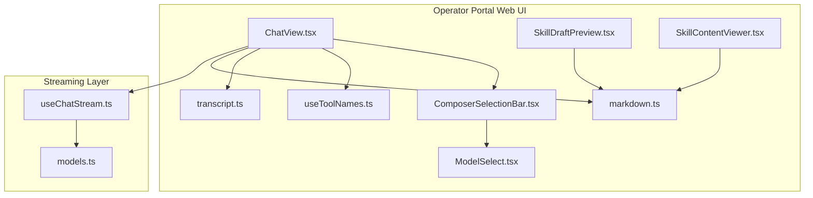
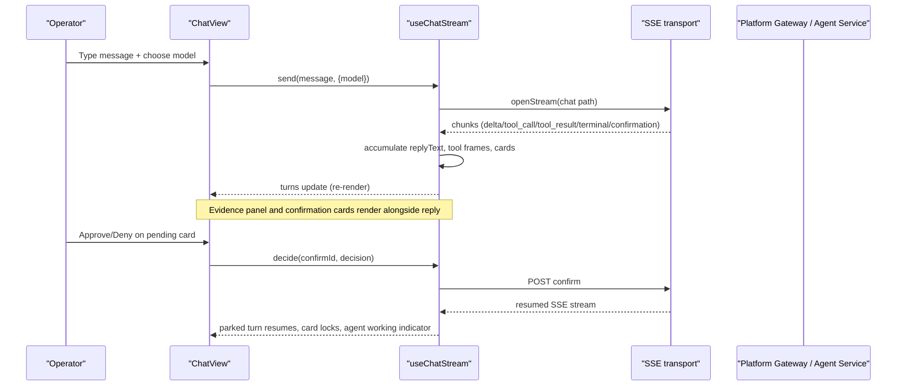
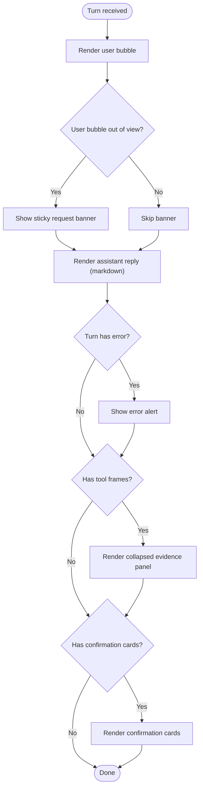
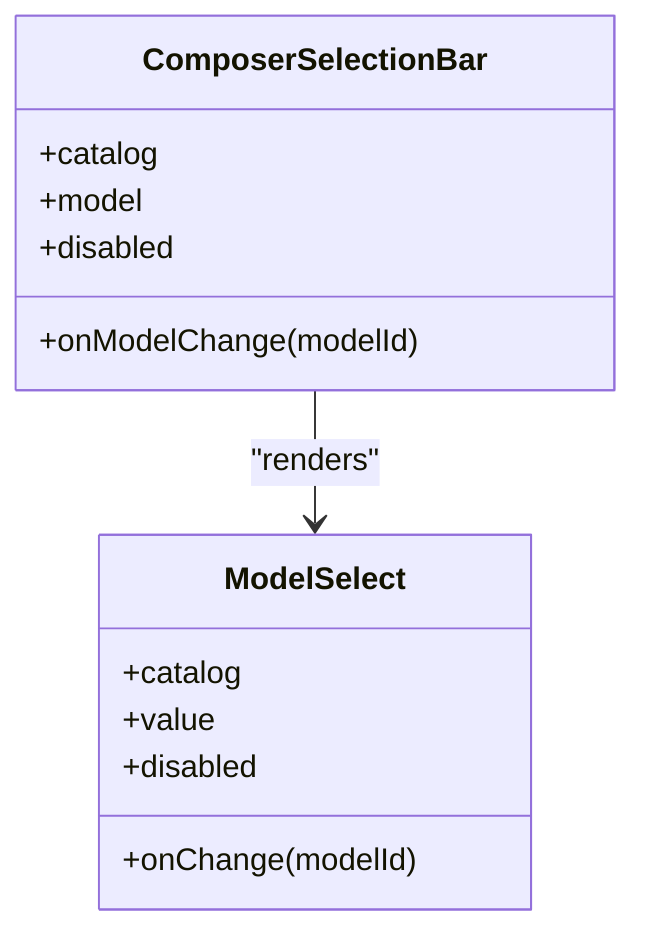
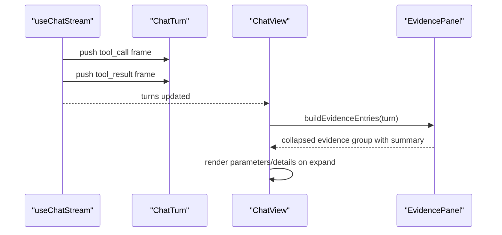
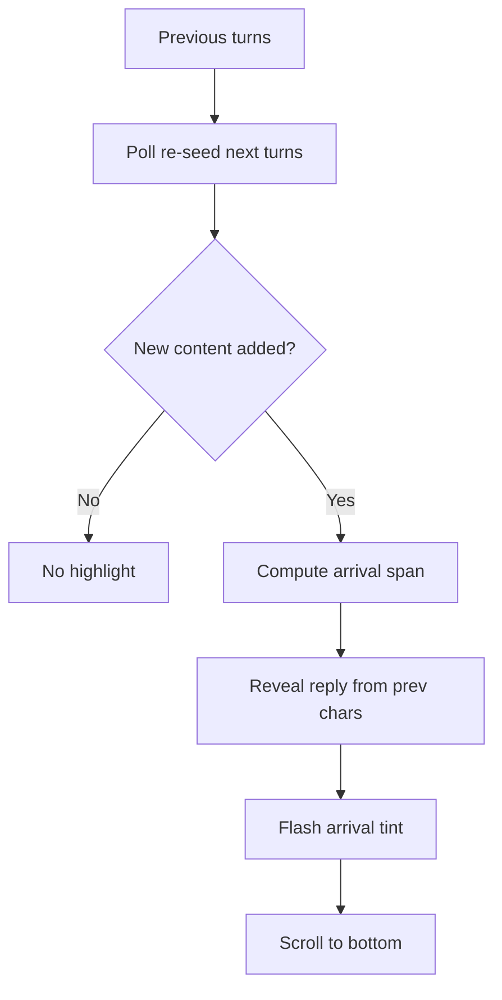
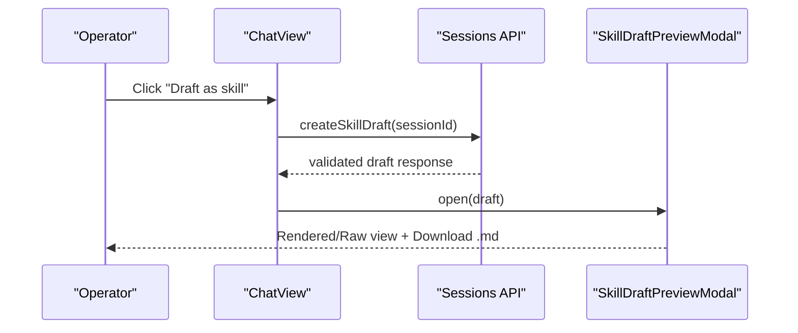
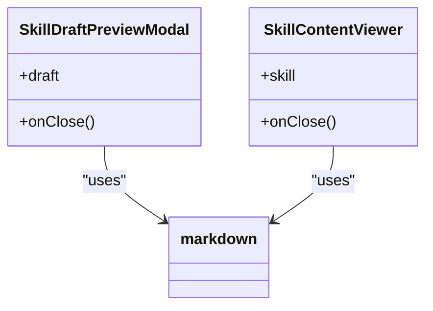
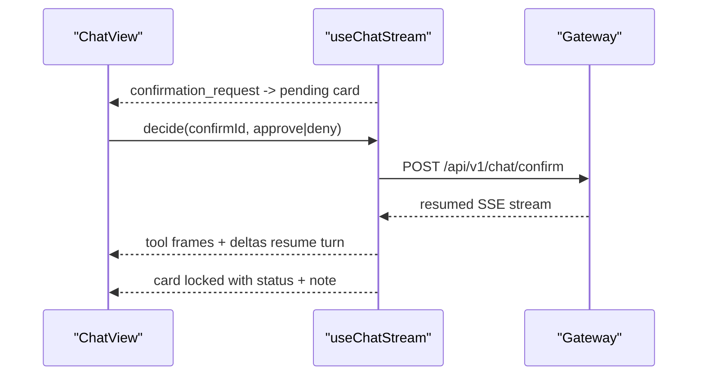
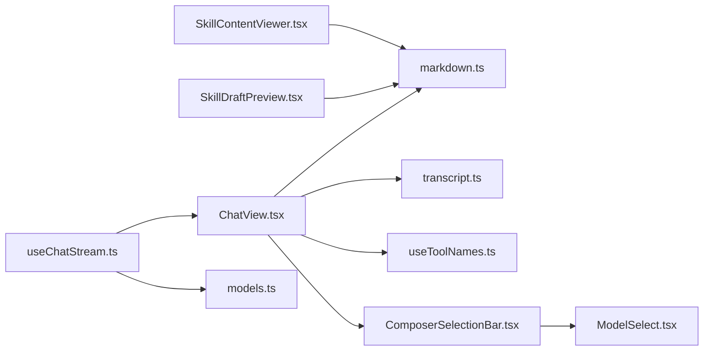

# Chat UI Components

<cite>
**Referenced Files in This Document**
- [ChatView.tsx](file://products/operator-portal/web-ui/app/src/chat/ChatView.tsx)
- [ComposerSelectionBar.tsx](file://products/operator-portal/web-ui/app/src/chat/ComposerSelectionBar.tsx)
- [ModelSelect.tsx](file://products/operator-portal/web-ui/app/src/chat/ModelSelect.tsx)
- [SkillDraftPreview.tsx](file://products/operator-portal/web-ui/app/src/chat/SkillDraftPreview.tsx)
- [SkillContentViewer.tsx](file://products/operator-portal/web-ui/app/src/chat/SkillContentViewer.tsx)
- [markdown.ts](file://products/operator-portal/web-ui/app/src/chat/markdown.ts)
- [transcript.ts](file://products/operator-portal/web-ui/app/src/chat/transcript.ts)
- [useToolNames.ts](file://products/operator-portal/web-ui/app/src/chat/useToolNames.ts)
- [useChatStream.ts](file://products/operator-portal/web-ui/app/src/stream/useChatStream.ts)
- [models.ts](file://products/operator-portal/web-ui/app/src/stream/models.ts)
</cite>

## Table of Contents
1. [Introduction](#introduction)
2. [Project Structure](#project-structure)
3. [Core Components](#core-components)
4. [Architecture Overview](#architecture-overview)
5. [Detailed Component Analysis](#detailed-component-analysis)
6. [Dependency Analysis](#dependency-analysis)
7. [Performance Considerations](#performance-considerations)
8. [Troubleshooting Guide](#troubleshooting-guide)
9. [Conclusion](#conclusion)

## Introduction
This document explains the chat user interface components that power the operator portal’s conversation workspace. It covers the main ChatView, the composer bar with model selection, message rendering for text, tools, and evidence, confirmation cards for human-in-the-loop approvals, skill draft and content preview panels, and how large conversations are scrolled and highlighted as new content arrives. It also documents markdown rendering safety, tool parameter visibility, and customization points for different operator workflows.

## Project Structure
The chat UI is implemented under the operator portal web application:
- Chat workspace and turn rendering live in a dedicated chat module.
- Streaming state management lives in a stream module that decodes server-sent events and maintains turns, sessions, and HITL cards.
- Markdown rendering and transcript seeding utilities support safe display and replay of historical conversations.

**Diagram sources**
- [ChatView.tsx:1-100](file://products/operator-portal/web-ui/app/src/chat/ChatView.tsx#L1-L100)
- [ComposerSelectionBar.tsx:1-48](file://products/operator-portal/web-ui/app/src/chat/ComposerSelectionBar.tsx#L1-L48)
- [ModelSelect.tsx:1-72](file://products/operator-portal/web-ui/app/src/chat/ModelSelect.tsx#L1-L72)
- [SkillDraftPreview.tsx:1-120](file://products/operator-portal/web-ui/app/src/chat/SkillDraftPreview.tsx#L1-L120)
- [SkillContentViewer.tsx:1-60](file://products/operator-portal/web-ui/app/src/chat/SkillContentViewer.tsx#L1-L60)
- [markdown.ts:184-301](file://products/operator-portal/web-ui/app/src/chat/markdown.ts#L184-L301)
- [transcript.ts:266-302](file://products/operator-portal/web-ui/app/src/chat/transcript.ts#L266-L302)
- [useToolNames.ts:1-46](file://products/operator-portal/web-ui/app/src/chat/useToolNames.ts#L1-L46)
- [useChatStream.ts:135-170](file://products/operator-portal/web-ui/app/src/stream/useChatStream.ts#L135-L170)
- [models.ts:1-182](file://products/operator-portal/web-ui/app/src/stream/models.ts#L1-L182)

**Section sources**
- [ChatView.tsx:1-100](file://products/operator-portal/web-ui/app/src/chat/ChatView.tsx#L1-L100)
- [useChatStream.ts:135-170](file://products/operator-portal/web-ui/app/src/stream/useChatStream.ts#L135-L170)

## Core Components
- ChatView: Orchestrates the conversation workspace, renders turns, evidence panels, confirmation cards, session actions (draft/graduate), and integrates streaming state and voice input.
- ComposerSelectionBar: Hosts the model selector and future per-turn selections; collapses when there is nothing to select.
- ModelSelect: Renders a grouped model dropdown from the catalog or shows a fixed label when only one model is configured.
- SkillDraftPreview: Read-only modal for skill drafts and graduated flows with rendered/raw views and client-side download.
- SkillContentViewer: Read-only viewer for ingested skills with metadata and rendered/raw toggle.
- Markdown renderer: Escape-first HTML generation with safe link handling, robust lists, tables, paragraphs, and code blocks.
- Transcript seeding: Converts stored transcripts, evidence groups, and confirmation records into live-like turns for replay.
- Stream hook: Manages SSE decoding, turn accumulation, HITL card lifecycle, session switching, and reseeded timelines.

**Section sources**
- [ChatView.tsx:595-749](file://products/operator-portal/web-ui/app/src/chat/ChatView.tsx#L595-L749)
- [ComposerSelectionBar.tsx:1-48](file://products/operator-portal/web-ui/app/src/chat/ComposerSelectionBar.tsx#L1-L48)
- [ModelSelect.tsx:1-72](file://products/operator-portal/web-ui/app/src/chat/ModelSelect.tsx#L1-L72)
- [SkillDraftPreview.tsx:1-120](file://products/operator-portal/web-ui/app/src/chat/SkillDraftPreview.tsx#L1-L120)
- [SkillContentViewer.tsx:1-60](file://products/operator-portal/web-ui/app/src/chat/SkillContentViewer.tsx#L1-L60)
- [markdown.ts:184-301](file://products/operator-portal/web-ui/app/src/chat/markdown.ts#L184-L301)
- [transcript.ts:266-302](file://products/operator-portal/web-ui/app/src/chat/transcript.ts#L266-L302)
- [useChatStream.ts:135-170](file://products/operator-portal/web-ui/app/src/stream/useChatStream.ts#L135-L170)

## Architecture Overview
The chat UI composes a streaming layer with presentation components. The stream hook owns the conversation timeline, while ChatView renders turns, evidence, and approval cards. Markdown rendering ensures safe display across all surfaces. Transcript seeding maps persisted data into the same turn model used by live streams.

**Diagram sources**
- [useChatStream.ts:240-328](file://products/operator-portal/web-ui/app/src/stream/useChatStream.ts#L240-L328)
- [useChatStream.ts:330-454](file://products/operator-portal/web-ui/app/src/stream/useChatStream.ts#L330-L454)
- [ChatView.tsx:605-749](file://products/operator-portal/web-ui/app/src/chat/ChatView.tsx#L605-L749)

## Detailed Component Analysis

### ChatView: Turn Rendering, Evidence, and Confirmation Cards
- TurnGroup renders user bubbles, assistant replies, error alerts, an “agent is working” indicator after approval, evidence panels, and confirmation cards in a strict order required by UX tests.
- Reply text is safely rendered via an escape-first markdown renderer; tool names are rewritten to canonical dotted forms using a registry-backed map.
- EvidencePanel aggregates tool calls and results, summarizes counts, and exposes collapsible details including parameters, execution metadata, truncation notices, and special-case screenshot rendering.
- ConfirmationCardView displays workflow headlines for browser flows, change-request projections for action cards, masked fields, technical details, and execution receipts. Role-based gating hides approve/deny buttons when approver roles are required.

**Diagram sources**
- [ChatView.tsx:605-749](file://products/operator-portal/web-ui/app/src/chat/ChatView.tsx#L605-L749)
- [ChatView.tsx:165-314](file://products/operator-portal/web-ui/app/src/chat/ChatView.tsx#L165-L314)
- [ChatView.tsx:354-593](file://products/operator-portal/web-ui/app/src/chat/ChatView.tsx#L354-L593)

**Section sources**
- [ChatView.tsx:605-749](file://products/operator-portal/web-ui/app/src/chat/ChatView.tsx#L605-L749)
- [ChatView.tsx:165-314](file://products/operator-portal/web-ui/app/src/chat/ChatView.tsx#L165-L314)
- [ChatView.tsx:354-593](file://products/operator-portal/web-ui/app/src/chat/ChatView.tsx#L354-L593)

### Composer Bar and Model Selection
- ComposerSelectionBar mounts the model selector and collapses when no models are available, preserving a compact composer shape.
- ModelSelect groups models by provider, selects a default when multiple exist, and shows a fixed label when only one model is configured. It degrades gracefully if the catalog fetch fails.

**Diagram sources**
- [ComposerSelectionBar.tsx:1-48](file://products/operator-portal/web-ui/app/src/chat/ComposerSelectionBar.tsx#L1-L48)
- [ModelSelect.tsx:1-72](file://products/operator-portal/web-ui/app/src/chat/ModelSelect.tsx#L1-L72)

**Section sources**
- [ComposerSelectionBar.tsx:1-48](file://products/operator-portal/web-ui/app/src/chat/ComposerSelectionBar.tsx#L1-L48)
- [ModelSelect.tsx:1-72](file://products/operator-portal/web-ui/app/src/chat/ModelSelect.tsx#L1-L72)

### Message Rendering: Text, Tools, and Evidence
- Text: Assistant replies are streamed as deltas and accumulated into replyText. Paragraph breaks are inserted after tool frames to keep block-level markdown readable.
- Tools: Tool call and result frames are appended to each turn. EvidencePanel builds entries from both calls and results, showing status tags, parameters, execution metadata, truncation notices, and specialized rendering for screenshots.
- Evidence persistence: When replaying a session, transcript seeding attaches persisted tool evidence to the matching turn by index so replay looks identical to live streaming.

**Diagram sources**
- [useChatStream.ts:167-238](file://products/operator-portal/web-ui/app/src/stream/useChatStream.ts#L167-L238)
- [ChatView.tsx:98-155](file://products/operator-portal/web-ui/app/src/chat/ChatView.tsx#L98-L155)
- [ChatView.tsx:165-314](file://products/operator-portal/web-ui/app/src/chat/ChatView.tsx#L165-L314)
- [transcript.ts:28-99](file://products/operator-portal/web-ui/app/src/chat/transcript.ts#L28-L99)

**Section sources**
- [useChatStream.ts:167-238](file://products/operator-portal/web-ui/app/src/stream/useChatStream.ts#L167-L238)
- [ChatView.tsx:98-155](file://products/operator-portal/web-ui/app/src/chat/ChatView.tsx#L98-L155)
- [ChatView.tsx:165-314](file://products/operator-portal/web-ui/app/src/chat/ChatView.tsx#L165-L314)
- [transcript.ts:28-99](file://products/operator-portal/web-ui/app/src/chat/transcript.ts#L28-L99)

### Conversation Threading and Scroll Management
- Threading: Each user message pairs with an assistant reply in a turn. Evidence and confirmation cards attach to the same turn group.
- Arrival highlighting: When a poll re-seeds the timeline, detectArrivalSpan computes where new content arrived. TurnGroup reveals reply text from the previous character offset so operators watch new words land within a short window.
- Sticky request banner: An IntersectionObserver pins a one-liner above the reply once the user bubble scrolls out of view, keeping long responses correlated with the original request.

**Diagram sources**
- [transcript.ts:304-329](file://products/operator-portal/web-ui/app/src/chat/transcript.ts#L304-L329)
- [ChatView.tsx:637-665](file://products/operator-portal/web-ui/app/src/chat/ChatView.tsx#L637-L665)
- [ChatView.tsx:672-683](file://products/operator-portal/web-ui/app/src/chat/ChatView.tsx#L672-L683)

**Section sources**
- [transcript.ts:304-329](file://products/operator-portal/web-ui/app/src/chat/transcript.ts#L304-L329)
- [ChatView.tsx:637-665](file://products/operator-portal/web-ui/app/src/chat/ChatView.tsx#L637-L665)
- [ChatView.tsx:672-683](file://products/operator-portal/web-ui/app/src/chat/ChatView.tsx#L672-L683)

### Composer Functionality: Markdown Support and Tool Parameter Editing
- Markdown support: The shared renderer escapes all source characters before introducing markup, restricts links to http(s), handles nested lists, tables, paragraphs, and fenced code safely.
- Tool parameters: Evidence cards expose parameters in a collapsible section. For action cards, a change-request projection may show a summarized effect sentence and decision-relevant fields, with secret values pre-masked.
- Draft skill creation: From the session header, authorized operators can generate a validated skill draft, preview it in a read-only modal, and download the markdown client-side without persisting anything on the platform.

**Diagram sources**
- [ChatView.tsx:780-800](file://products/operator-portal/web-ui/app/src/chat/ChatView.tsx#L780-L800)
- [SkillDraftPreview.tsx:61-87](file://products/operator-portal/web-ui/app/src/chat/SkillDraftPreview.tsx#L61-L87)
- [SkillDraftPreview.tsx:99-155](file://products/operator-portal/web-ui/app/src/chat/SkillDraftPreview.tsx#L99-L155)

**Section sources**
- [markdown.ts:184-301](file://products/operator-portal/web-ui/app/src/chat/markdown.ts#L184-L301)
- [ChatView.tsx:214-221](file://products/operator-portal/web-ui/app/src/chat/ChatView.tsx#L214-L221)
- [ChatView.tsx:470-541](file://products/operator-portal/web-ui/app/src/chat/ChatView.tsx#L470-L541)
- [SkillDraftPreview.tsx:61-87](file://products/operator-portal/web-ui/app/src/chat/SkillDraftPreview.tsx#L61-L87)
- [SkillDraftPreview.tsx:99-155](file://products/operator-portal/web-ui/app/src/chat/SkillDraftPreview.tsx#L99-L155)

### Skill Preview Panels
- SkillDraftPreviewModal: Displays mode badges (skeleton, generated, graduated), validation status, suggested filename, rendered/raw toggle, and graduation facts such as step count and target binding. Downloads raw markdown via a Blob without storing anything on the platform.
- SkillContentViewer: Reads ingested skill metadata and body, offers rendered/raw views, and emphasizes that skills are authored in Git and not persisted by the portal.

**Diagram sources**
- [SkillDraftPreview.tsx:99-260](file://products/operator-portal/web-ui/app/src/chat/SkillDraftPreview.tsx#L99-L260)
- [SkillContentViewer.tsx:29-131](file://products/operator-portal/web-ui/app/src/chat/SkillContentViewer.tsx#L29-L131)
- [markdown.ts:184-301](file://products/operator-portal/web-ui/app/src/chat/markdown.ts#L184-L301)

**Section sources**
- [SkillDraftPreview.tsx:99-260](file://products/operator-portal/web-ui/app/src/chat/SkillDraftPreview.tsx#L99-L260)
- [SkillContentViewer.tsx:29-131](file://products/operator-portal/web-ui/app/src/chat/SkillContentViewer.tsx#L29-L131)

### Human-in-the-Loop Confirmations
- Live flow: A confirmation_request frame parks the stream and creates a pending card. The operator approves or denies via decide, which opens a POST confirm stream that resumes the parked turn with tool frames and deltas.
- Durable replay: Confirmation records are mapped to cards with attribution notes and execution receipts, ensuring consistent behavior after re-login or session recovery.
- Role gating: Mutating batches require designated approver roles; otherwise, the UI indicates the request needs an approver.

**Diagram sources**
- [useChatStream.ts:199-234](file://products/operator-portal/web-ui/app/src/stream/useChatStream.ts#L199-L234)
- [useChatStream.ts:330-454](file://products/operator-portal/web-ui/app/src/stream/useChatStream.ts#L330-L454)
- [transcript.ts:170-234](file://products/operator-portal/web-ui/app/src/chat/transcript.ts#L170-L234)

**Section sources**
- [useChatStream.ts:199-234](file://products/operator-portal/web-ui/app/src/stream/useChatStream.ts#L199-L234)
- [useChatStream.ts:330-454](file://products/operator-portal/web-ui/app/src/stream/useChatStream.ts#L330-L454)
- [transcript.ts:170-234](file://products/operator-portal/web-ui/app/src/chat/transcript.ts#L170-L234)

### Responsive Design Patterns and Accessibility
- Responsive layout: The composer selection bar collapses when there is no model catalog, keeping the composer compact. Evidence panels use small collapse sizes and scrollable containers in modals.
- Accessibility: Components expose aria-label attributes for key controls (model selector, copy button, skill viewer close, draft download). The model selector uses semantic Select options grouped by provider.
- Customization: Tool name display is centralized through a registry-backed map, allowing consistent canonical names across text and evidence surfaces.

**Section sources**
- [ComposerSelectionBar.tsx:22-27](file://products/operator-portal/web-ui/app/src/chat/ComposerSelectionBar.tsx#L22-L27)
- [ModelSelect.tsx:31-41](file://products/operator-portal/web-ui/app/src/chat/ModelSelect.tsx#L31-L41)
- [ChatView.tsx:755-777](file://products/operator-portal/web-ui/app/src/chat/ChatView.tsx#L755-L777)
- [useToolNames.ts:1-46](file://products/operator-portal/web-ui/app/src/chat/useToolNames.ts#L1-L46)

## Dependency Analysis
The chat UI depends on a clear separation between streaming state and presentation:
- useChatStream owns turns, session switching, and HITL decisions; it emits updates consumed by ChatView.
- ChatView composes UI components and delegates streaming interactions to the hook.
- Markdown rendering is reused across reply text, skill drafts, and skill content viewers.
- Transcript seeding converts persisted data into the same turn model used by live streams.

**Diagram sources**
- [useChatStream.ts:135-170](file://products/operator-portal/web-ui/app/src/stream/useChatStream.ts#L135-L170)
- [ChatView.tsx:1-100](file://products/operator-portal/web-ui/app/src/chat/ChatView.tsx#L1-L100)
- [markdown.ts:184-301](file://products/operator-portal/web-ui/app/src/chat/markdown.ts#L184-L301)
- [transcript.ts:266-302](file://products/operator-portal/web-ui/app/src/chat/transcript.ts#L266-L302)
- [useToolNames.ts:1-46](file://products/operator-portal/web-ui/app/src/chat/useToolNames.ts#L1-L46)
- [ComposerSelectionBar.tsx:1-48](file://products/operator-portal/web-ui/app/src/chat/ComposerSelectionBar.tsx#L1-L48)
- [ModelSelect.tsx:1-72](file://products/operator-portal/web-ui/app/src/chat/ModelSelect.tsx#L1-L72)
- [SkillDraftPreview.tsx:1-120](file://products/operator-portal/web-ui/app/src/chat/SkillDraftPreview.tsx#L1-L120)
- [SkillContentViewer.tsx:1-60](file://products/operator-portal/web-ui/app/src/chat/SkillContentViewer.tsx#L1-L60)
- [models.ts:1-182](file://products/operator-portal/web-ui/app/src/stream/models.ts#L1-L182)

**Section sources**
- [useChatStream.ts:135-170](file://products/operator-portal/web-ui/app/src/stream/useChatStream.ts#L135-L170)
- [ChatView.tsx:1-100](file://products/operator-portal/web-ui/app/src/chat/ChatView.tsx#L1-L100)

## Performance Considerations
- Streaming efficiency: Delta accumulation avoids unnecessary re-renders by updating a single turn object; segment breaks ensure paragraph structure without extra processing.
- Large conversations: Arrival highlighting reveals only newly landed characters within a bounded time window, reducing jarring jumps and improving readability.
- Evidence rendering: Collapsed panels keep summaries visible while hiding heavy payloads until expanded; truncated payload markers inform operators about size limits without blocking the UI.
- Catalog caching: Tool name mapping is cached per page session to avoid repeated network requests.

[No sources needed since this section provides general guidance]

## Troubleshooting Guide
- Authentication errors: If the stream opens with an authentication error, the UI sets a user-facing error on the turn. Ensure the operator signs in from the sidebar first.
- Stale session pointer: A 404 during stream open drops the active session pointer and retries once to auto-create the session on the server side.
- Confirmation races: A 409 indicates another approver decided first; the card flips to the winner’s outcome with attribution and settles the turn.
- Expired confirmations: A 410 marks the card as expired and completes the turn to prevent a perpetual loading state.
- Session switch mid-stream: Aborted streams settle partial replies instead of leaving bubbles spinning indefinitely.

**Section sources**
- [useChatStream.ts:286-328](file://products/operator-portal/web-ui/app/src/stream/useChatStream.ts#L286-L328)
- [useChatStream.ts:392-454](file://products/operator-portal/web-ui/app/src/stream/useChatStream.ts#L392-L454)

## Conclusion
The chat UI provides a robust, accessible, and customizable conversation workspace. It renders text, tools, and evidence safely, supports human-in-the-loop approvals with durable replay, and offers skill authoring previews. Streaming state management keeps large conversations responsive, while role-based gates and clear indicators guide operators through complex workflows.

[No sources needed since this section summarizes without analyzing specific files]