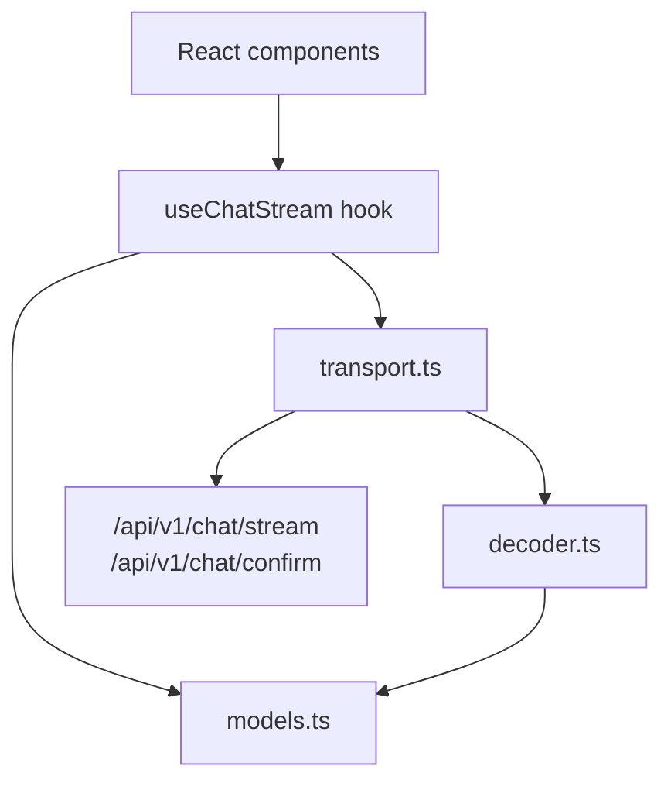
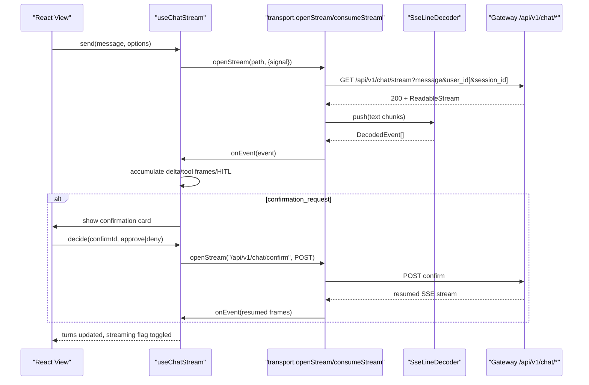
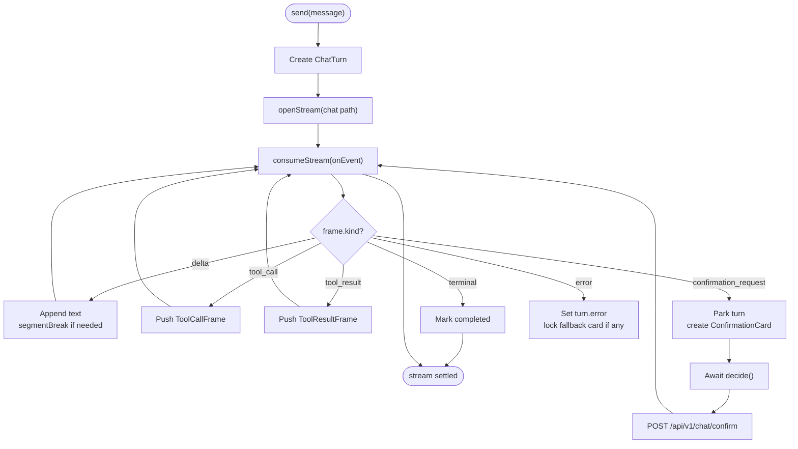
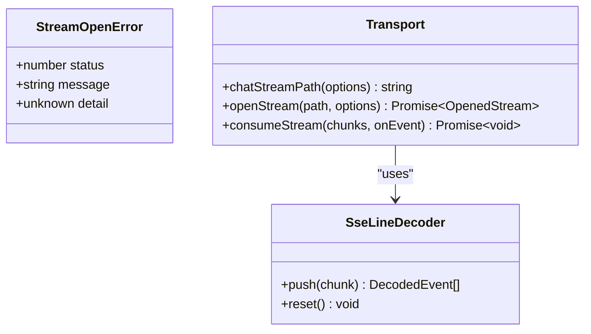
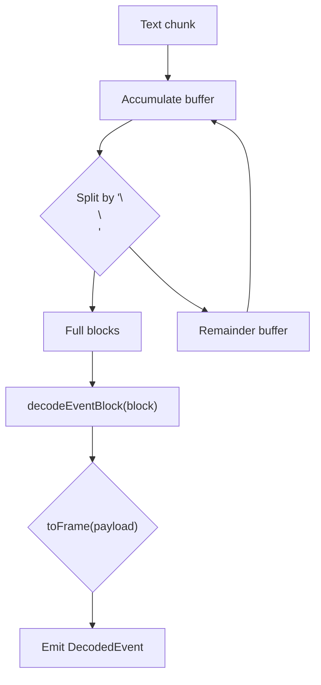
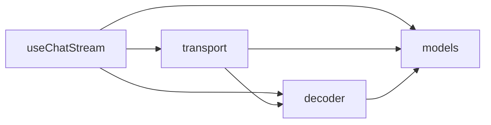

# Streaming Infrastructure

<cite>
**Referenced Files in This Document**
- [useChatStream.ts](file://products/operator-portal/web-ui/app/src/stream/useChatStream.ts)
- [transport.ts](file://products/operator-portal/web-ui/app/src/stream/transport.ts)
- [decoder.ts](file://products/operator-portal/web-ui/app/src/stream/decoder.ts)
- [models.ts](file://products/operator-portal/web-ui/app/src/stream/models.ts)
- [useChatStream.test.ts](file://products/operator-portal/web-ui/app/src/stream/__tests__/useChatStream.test.ts)
- [decoder.test.ts](file://products/operator-portal/web-ui/app/src/stream/__tests__/decoder.test.ts)
- [transport.test.ts](file://products/operator-portal/web-ui/app/src/stream/__tests__/transport.test.ts)
</cite>

## Table of Contents
1. Introduction
2. Project Structure
3. Core Components
4. Architecture Overview
5. Detailed Component Analysis
6. Dependency Analysis
7. Performance Considerations
8. Troubleshooting Guide
9. Conclusion

## Introduction
This document explains the real-time streaming infrastructure that powers live chat interactions in the operator portal. It focuses on:
- The useChatStream hook for managing SSE connections, automatic reconnection logic, and stream resumption after network interruptions or session changes.
- The transport layer abstraction that handles connection establishment, message framing, and error handling.
- The decoder module that parses server-sent events, handles different message types (text deltas, tool invocations, evidence), and maintains message ordering.
- Performance considerations such as backpressure handling and memory management for long conversations.

## Project Structure
The streaming stack lives under the operator portal’s web UI and is organized into three cohesive layers:
- Hook layer: useChatStream orchestrates turns, confirmation cards, and session state.
- Transport layer: transport manages HTTP requests, response bodies, abort signals, and chunk consumption.
- Decoder layer: decoder parses SSE frames into typed StreamFrame objects and buffers partial lines safely.

**Diagram sources**
- [useChatStream.ts:1-501](file://products/operator-portal/web-ui/app/src/stream/useChatStream.ts#L1-L501)
- [transport.ts:1-165](file://products/operator-portal/web-ui/app/src/stream/transport.ts#L1-L165)
- [decoder.ts:1-251](file://products/operator-portal/web-ui/app/src/stream/decoder.ts#L1-L251)
- [models.ts:1-182](file://products/operator-portal/web-ui/app/src/stream/models.ts#L1-L182)

**Section sources**
- [useChatStream.ts:1-501](file://products/operator-portal/web-ui/app/src/stream/useChatStream.ts#L1-L501)
- [transport.ts:1-165](file://products/operator-portal/web-ui/app/src/stream/transport.ts#L1-L165)
- [decoder.ts:1-251](file://products/operator-portal/web-ui/app/src/stream/decoder.ts#L1-L251)
- [models.ts:1-182](file://products/operator-portal/web-ui/app/src/stream/models.ts#L1-L182)

## Core Components
- useChatStream: Manages per-turn state, delta accumulation, tool call/evidence frames, HITL confirmation cards, session switching, and stream lifecycle.
- transport: Encapsulates fetch-based SSE opening, request headers, abort support, chunk iteration, and error mapping to a typed StreamOpenError.
- decoder: Incremental SSE line decoder with robust parsing for text deltas, terminal markers, tool calls/results, confirmation requests/results, and errors.
- models: Typed definitions for all stream frames, pending calls, flow summaries, execution receipts, and decoded events.

Key responsibilities:
- Delta accumulation preserves rendering order and paragraph breaks around tool frames.
- Confirmation flows park the turn, resume via POST /api/v1/chat/confirm, and lock cards on result/error/expiry/race conditions.
- Stale session recovery retries once without a session id when the gateway returns 404.
- AbortController ensures clean cancellation on session switches or component unmounts.

**Section sources**
- [useChatStream.ts:1-501](file://products/operator-portal/web-ui/app/src/stream/useChatStream.ts#L1-L501)
- [transport.ts:1-165](file://products/operator-portal/web-ui/app/src/stream/transport.ts#L1-L165)
- [decoder.ts:1-251](file://products/operator-portal/web-ui/app/src/stream/decoder.ts#L1-L251)
- [models.ts:1-182](file://products/operator-portal/web-ui/app/src/stream/models.ts#L1-L182)

## Architecture Overview
The streaming pipeline connects React components to the platform gateway over SSE. The hook composes transport and decoder to deliver typed events to the UI while preserving turn context and HITL semantics.

**Diagram sources**
- [useChatStream.ts:240-454](file://products/operator-portal/web-ui/app/src/stream/useChatStream.ts#L240-L454)
- [transport.ts:111-164](file://products/operator-portal/web-ui/app/src/stream/transport.ts#L111-L164)
- [decoder.ts:227-250](file://products/operator-portal/web-ui/app/src/stream/decoder.ts#L227-L250)

## Detailed Component Analysis

### useChatStream hook
Responsibilities:
- Turn lifecycle: create a ChatTurn, append deltas, mark completion on terminal or stream close, handle parked confirmations.
- Session management: track current sessionId, cache per-session turns, switch sessions by aborting in-flight streams and restoring cached history.
- HITL confirmation flow: park turns on confirmation_request, resume via POST /api/v1/chat/confirm, lock cards on results, errors, expiry (410), or race (409).
- Error handling: map 401 to sign-in prompt, retry once on 404 stale session, propagate other errors to turn.error.

**Diagram sources**
- [useChatStream.ts:167-327](file://products/operator-portal/web-ui/app/src/stream/useChatStream.ts#L167-L327)
- [useChatStream.ts:330-454](file://products/operator-portal/web-ui/app/src/stream/useChatStream.ts#L330-L454)

**Section sources**
- [useChatStream.ts:1-501](file://products/operator-portal/web-ui/app/src/stream/useChatStream.ts#L1-L501)

### Transport layer
Responsibilities:
- Build authenticated requests with x-request-id and auth headers.
- Open SSE streams for GET /api/v1/chat/stream and POST /api/v1/chat/confirm.
- Normalize non-OK responses into StreamOpenError with status and optional detail envelope.
- Iterate ReadableStream or AsyncIterable chunks and decode them incrementally.

**Diagram sources**
- [transport.ts:8-48](file://products/operator-portal/web-ui/app/src/stream/transport.ts#L8-L48)
- [transport.ts:61-164](file://products/operator-portal/web-ui/app/src/stream/transport.ts#L61-L164)
- [decoder.ts:227-250](file://products/operator-portal/web-ui/app/src/stream/decoder.ts#L227-L250)

**Section sources**
- [transport.ts:1-165](file://products/operator-portal/web-ui/app/src/stream/transport.ts#L1-L165)

### Decoder module
Responsibilities:
- Parse SSE data blocks, ignoring non-data lines and malformed JSON gracefully.
- Map event types to typed StreamFrame: delta, terminal, tool_call, tool_result, confirmation_request, confirmation_result, error.
- Maintain ordering by emitting events only when complete "\n\n"-delimited blocks arrive; partial trailing blocks are dropped until the next chunk completes them.

**Diagram sources**
- [decoder.ts:204-250](file://products/operator-portal/web-ui/app/src/stream/decoder.ts#L204-L250)

**Section sources**
- [decoder.ts:1-251](file://products/operator-portal/web-ui/app/src/stream/decoder.ts#L1-L251)

### Data models
The models define the contract between wire formats and UI state:
- StreamFrame variants: delta, terminal, tool_call, tool_result, confirmation_request, confirmation_result, error.
- PendingCall fields include risk_level, action, displayHint, and changeRequest projections for action cards.
- FlowSummary carries browser-flow headline metadata for flow-type approvals.
- ExecutionReceipt provides read-only signed execution details for approved calls.

These models ensure type safety across the hook, transport, and decoder boundaries.

**Section sources**
- [models.ts:1-182](file://products/operator-portal/web-ui/app/src/stream/models.ts#L1-L182)

## Dependency Analysis
- useChatStream depends on transport for I/O and decoder for parsing; it also consumes models for typing.
- transport depends on decoder for incremental parsing and on client utilities for auth and routing.
- decoder depends only on models for frame types.

**Diagram sources**
- [useChatStream.ts:1-501](file://products/operator-portal/web-ui/app/src/stream/useChatStream.ts#L1-L501)
- [transport.ts:1-165](file://products/operator-portal/web-ui/app/src/stream/transport.ts#L1-L165)
- [decoder.ts:1-251](file://products/operator-portal/web-ui/app/src/stream/decoder.ts#L1-L251)
- [models.ts:1-182](file://products/operator-portal/web-ui/app/src/stream/models.ts#L1-L182)

**Section sources**
- [useChatStream.ts:1-501](file://products/operator-portal/web-ui/app/src/stream/useChatStream.ts#L1-L501)
- [transport.ts:1-165](file://products/operator-portal/web-ui/app/src/stream/transport.ts#L1-L165)
- [decoder.ts:1-251](file://products/operator-portal/web-ui/app/src/stream/decoder.ts#L1-L251)
- [models.ts:1-182](file://products/operator-portal/web-ui/app/src/stream/models.ts#L1-L182)

## Performance Considerations
- Backpressure: consumeStream processes each chunk asynchronously and forwards decoded events immediately. For very high throughput, consider throttling UI updates or batching events per microtask to reduce render pressure.
- Memory management:
  - SseLineDecoder keeps an internal buffer and drops partial trailing blocks; this prevents memory growth from incomplete frames.
  - Turns accumulate replyText and tool frames; for long conversations, consider trimming older turns or virtualizing the view to avoid large DOM trees.
  - Per-session turn caching uses a Map keyed by sessionId; ensure stale sessions are evicted when tabs navigate away to prevent leaks.
- Network resilience:
  - Automatic retry on 404 stale session reduces user friction and avoids empty-stream UX defects.
  - AbortController usage ensures no orphaned listeners remain after session switches or unmounts.
- Rendering efficiency:
  - segmentBreak ensures new paragraphs after tool frames, improving readability without extra layout thrashing.
  - Avoid unnecessary re-renders by minimizing state bumps outside event handlers.

[No sources needed since this section provides general guidance]

## Troubleshooting Guide
Common issues and how the code addresses them:
- Authentication failures: 401 on stream open maps to a user-friendly sign-in message on the turn.
- Stale session pointer: 404 triggers a one-time retry without session_id to auto-create a new session.
- Confirmation races: 409 already_resolved flips the card to the winner’s outcome with attribution; 410 marks expired and settles the turn.
- Unexpected stream ends: terminal frames or stream closure complete turns; parked confirmations keep pending unless explicitly locked by error/result/expiry.
- Malformed SSE: decoder ignores non-data lines and invalid JSON, preventing corrupt frames from breaking the entire turn.

Validation references:
- Stale session retry behavior is asserted in tests.
- Decoder robustness against malformed input is covered by dedicated tests.
- Transport URL construction and modality parameters are verified in transport tests.

**Section sources**
- [useChatStream.ts:283-327](file://products/operator-portal/web-ui/app/src/stream/useChatStream.ts#L283-L327)
- [useChatStream.ts:392-451](file://products/operator-portal/web-ui/app/src/stream/useChatStream.ts#L392-L451)
- [decoder.ts:204-250](file://products/operator-portal/web-ui/app/src/stream/decoder.ts#L204-L250)
- [useChatStream.test.ts:640-693](file://products/operator-portal/web-ui/app/src/stream/__tests__/useChatStream.test.ts#L640-L693)
- [decoder.test.ts:385-438](file://products/operator-portal/web-ui/app/src/stream/__tests__/decoder.test.ts#L385-L438)
- [transport.test.ts:22-48](file://products/operator-portal/web-ui/app/src/stream/__tests__/transport.test.ts#L22-L48)

## Conclusion
The streaming infrastructure cleanly separates concerns across hook, transport, and decoder layers to deliver reliable, ordered, and interactive live chat experiences. It supports HITL workflows, resilient session handling, and robust parsing of SSE frames. With careful attention to backpressure and memory management, it scales well for long-running conversations and frequent session switches.