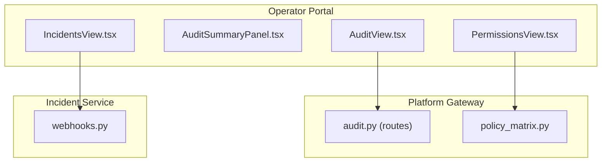
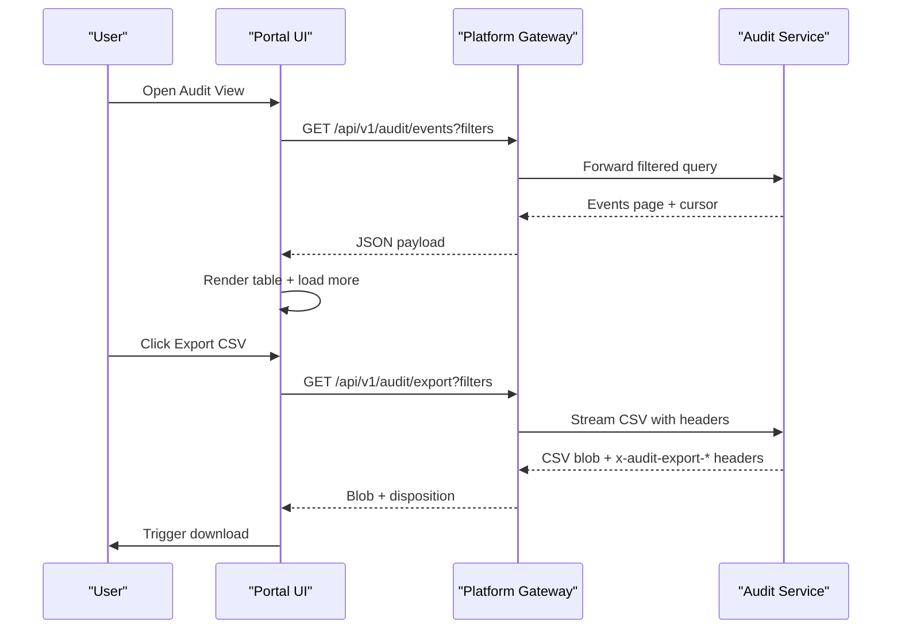
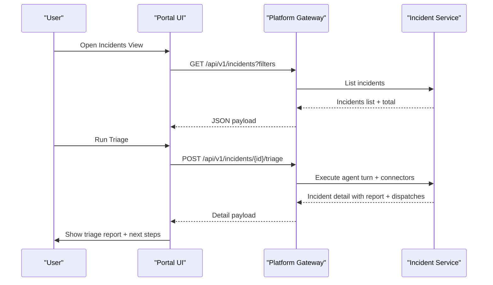
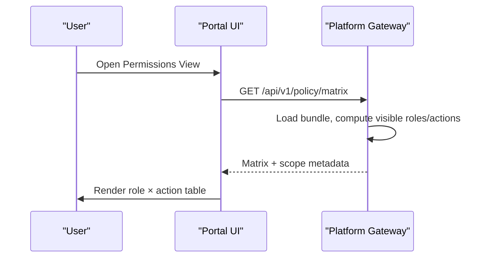
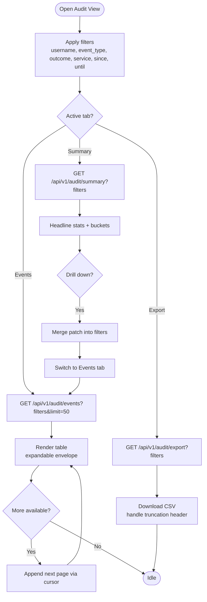
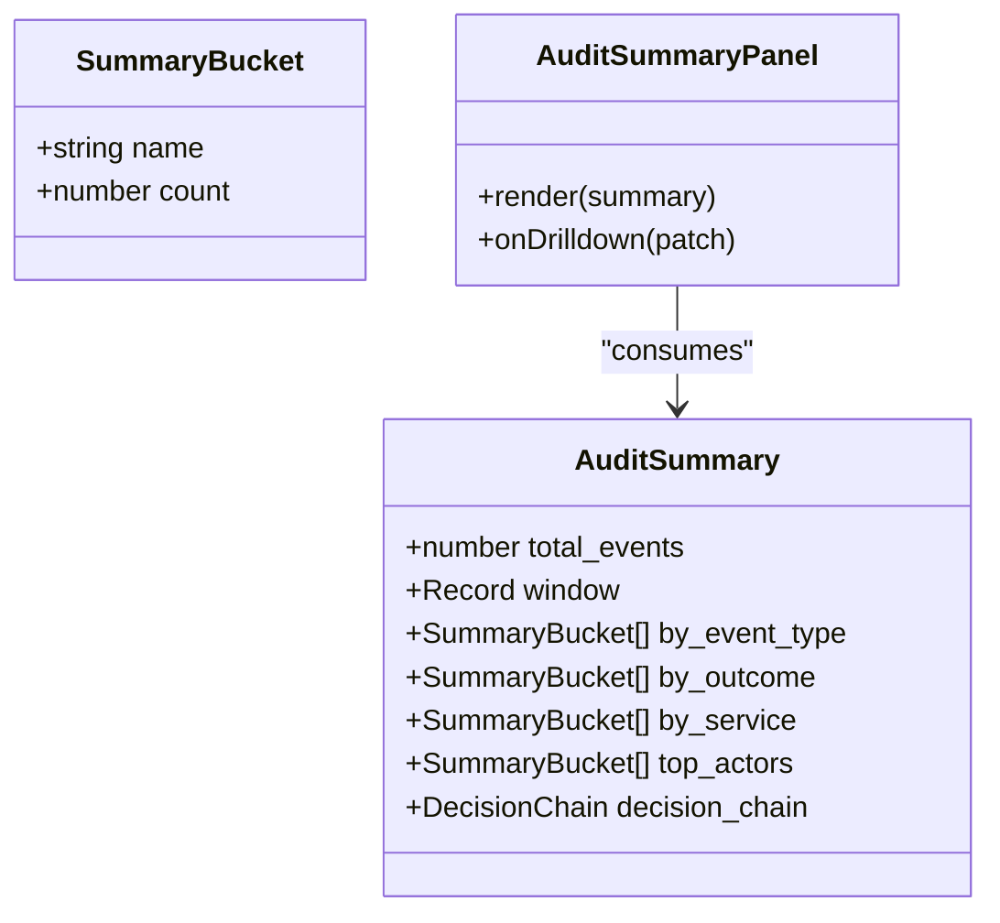
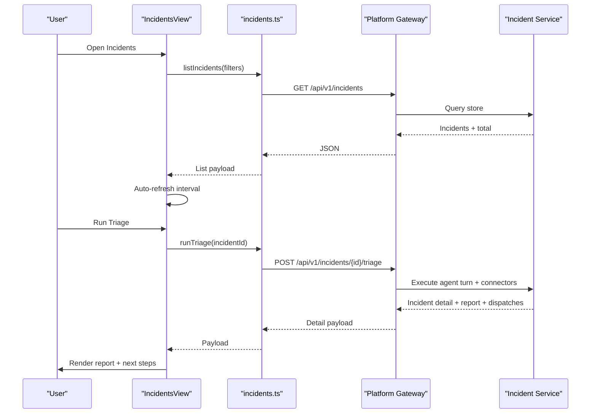
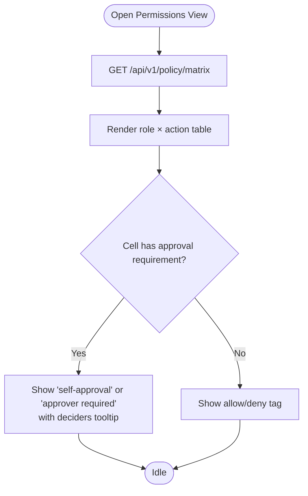
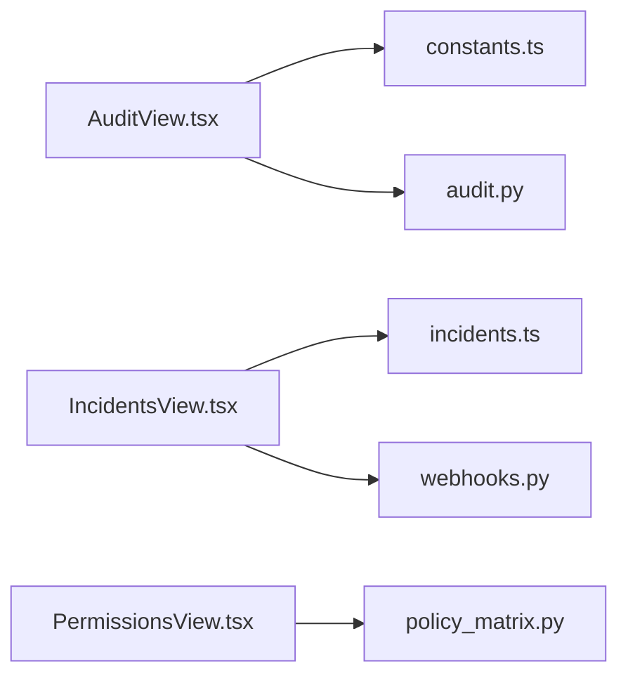

# Monitoring & Compliance

<cite>
**Referenced Files in This Document**
- [AuditView.tsx](file://products/operator-portal/web-ui/app/src/views/audit/AuditView.tsx)
- [AuditSummaryPanel.tsx](file://products/operator-portal/web-ui/app/src/views/audit/AuditSummaryPanel.tsx)
- [constants.ts](file://products/operator-portal/web-ui/app/src/views/audit/constants.ts)
- [IncidentsView.tsx](file://products/operator-portal/web-ui/app/src/views/incidents/IncidentsView.tsx)
- [incidents.ts](file://products/operator-portal/web-ui/app/src/api/incidents.ts)
- [PermissionsView.tsx](file://products/operator-portal/web-ui/app/src/views/control/PermissionsView.tsx)
- [App.tsx](file://products/operator-portal/web-ui/app/src/App.tsx)
- [audit.py](file://products/platform-gateway/src/platform_gateway/api/routes/audit.py)
- [policy_matrix.py](file://products/platform-gateway/src/platform_gateway/services/policy_matrix.py)
- [webhooks.py](file://products/incident-service/src/incident_service/api/routes/webhooks.py)
- [incident-guide.md](file://docs/guides/incident-guide.md)
- [test_reporting.py](file://products/audit-service/tests/test_reporting.py)
</cite>

## Table of Contents
1. [Introduction](#introduction)
2. [Project Structure](#project-structure)
3. [Core Components](#core-components)
4. [Architecture Overview](#architecture-overview)
5. [Detailed Component Analysis](#detailed-component-analysis)
6. [Dependency Analysis](#dependency-analysis)
7. [Performance Considerations](#performance-considerations)
8. [Troubleshooting Guide](#troubleshooting-guide)
9. [Conclusion](#conclusion)

## Introduction
This document explains the operator portal’s monitoring and compliance features with a focus on:
- Audit trail review, filtering, and CSV export for compliance reporting
- Incident alert management, triage workflows, and collaboration surfaces
- Permissions matrix display for current user permissions and role assignments
It also covers search and filtering capabilities, data visualization components, and export functionality aligned to regulatory requirements.

## Project Structure
The monitoring and compliance slice spans three main areas:
- Operator portal UI views for audit, incidents, and permissions
- Platform gateway routes that proxy and enforce policy for audit queries and exports
- Incident service endpoints that ingest alerts and expose incident data

**Diagram sources**
- [AuditView.tsx:101-240](file://products/operator-portal/web-ui/app/src/views/audit/AuditView.tsx#L101-L240)
- [audit.py:35-71](file://products/platform-gateway/src/platform_gateway/api/routes/audit.py#L35-L71)
- [IncidentsView.tsx:133-196](file://products/operator-portal/web-ui/app/src/views/incidents/IncidentsView.tsx#L133-L196)
- [webhooks.py:147-187](file://products/incident-service/src/incident_service/api/routes/webhooks.py#L147-L187)
- [PermissionsView.tsx:35-54](file://products/operator-portal/web-ui/app/src/views/control/PermissionsView.tsx#L35-L54)
- [policy_matrix.py:37-50](file://products/platform-gateway/src/platform_gateway/services/policy_matrix.py#L37-L50)

**Section sources**
- [AuditView.tsx:1-100](file://products/operator-portal/web-ui/app/src/views/audit/AuditView.tsx#L1-L100)
- [IncidentsView.tsx:1-60](file://products/operator-portal/web-ui/app/src/views/incidents/IncidentsView.tsx#L1-L60)
- [PermissionsView.tsx:1-30](file://products/operator-portal/web-ui/app/src/views/control/PermissionsView.tsx#L1-L30)
- [audit.py:35-71](file://products/platform-gateway/src/platform_gateway/api/routes/audit.py#L35-L71)
- [policy_matrix.py:37-50](file://products/platform-gateway/src/platform_gateway/services/policy_matrix.py#L37-L50)

## Core Components
- AuditView: Durable audit trail viewer with Events and Summary tabs, shared filters, pagination, drill-down, and bounded CSV export.
- IncidentsView: Incident list with filters, manual intake form, detail view with triage execution, connector dispatch status, and chat deep-linking.
- PermissionsView: Live role × action matrix from the gateway’s policy endpoint, including approval requirement indicators.

Key capabilities:
- Filtering by time range, event type, outcome, service, username; incidents filtered by status, severity, source
- Data visualization via tables, tags, statistics, collapsible sections
- Export to CSV for audit trails with truncation warnings and row counts
- Role-based visibility enforced client-side and re-enforced server-side

**Section sources**
- [AuditView.tsx:101-240](file://products/operator-portal/web-ui/app/src/views/audit/AuditView.tsx#L101-L240)
- [IncidentsView.tsx:103-226](file://products/operator-portal/web-ui/app/src/views/incidents/IncidentsView.tsx#L103-L226)
- [PermissionsView.tsx:30-127](file://products/operator-portal/web-ui/app/src/views/control/PermissionsView.tsx#L30-L127)

## Architecture Overview
End-to-end flows for audit review/export, incident triage, and permissions inspection.

**Diagram sources**
- [AuditView.tsx:134-157](file://products/operator-portal/web-ui/app/src/views/audit/AuditView.tsx#L134-L157)
- [AuditView.tsx:204-240](file://products/operator-portal/web-ui/app/src/views/audit/AuditView.tsx#L204-L240)
- [audit.py:35-71](file://products/platform-gateway/src/platform_gateway/api/routes/audit.py#L35-L71)

**Diagram sources**
- [IncidentsView.tsx:133-196](file://products/operator-portal/web-ui/app/src/views/incidents/IncidentsView.tsx#L133-L196)
- [incidents.ts:78-111](file://products/operator-portal/web-ui/app/src/api/incidents.ts#L78-L111)

**Diagram sources**
- [PermissionsView.tsx:35-54](file://products/operator-portal/web-ui/app/src/views/control/PermissionsView.tsx#L35-L54)
- [policy_matrix.py:37-50](file://products/platform-gateway/src/platform_gateway/services/policy_matrix.py#L37-L50)

## Detailed Component Analysis

### AuditView: Audit Trail Review, Filtering, and Export
- Role gating: Only users with auditor or platform-admin roles can access; errors are surfaced with actionable messages for 403/503/502.
- Shared filter toolbar drives both tabs and export:
  - Username, event type, outcome, service, since/until datetime range
  - Event types, outcomes, and emitter services are pinned to constants synchronized with the schema
- Events tab:
  - Cursor-based pagination with “Load more”
  - Expandable rows show verbatim event envelopes
  - Columns include occurred_at, event_type, service, outcome, actor, request_id
- Summary tab:
  - Headline statistics: total events and decision chain steps
  - Collapsible bucket tables: by event type, outcome, service, top actors
  - Drill-down buttons merge patches into filters and refresh the Events tab
- Export:
  - Streams CSV via gateway with Content-Disposition filename
  - Displays truncation warning and row count when limited
  - Uses request ID and auth headers for tracing

**Diagram sources**
- [AuditView.tsx:101-240](file://products/operator-portal/web-ui/app/src/views/audit/AuditView.tsx#L101-L240)
- [AuditView.tsx:270-286](file://products/operator-portal/web-ui/app/src/views/audit/AuditView.tsx#L270-L286)
- [AuditView.tsx:314-382](file://products/operator-portal/web-ui/app/src/views/audit/AuditView.tsx#L314-L382)

**Section sources**
- [AuditView.tsx:1-100](file://products/operator-portal/web-ui/app/src/views/audit/AuditView.tsx#L1-L100)
- [AuditView.tsx:101-240](file://products/operator-portal/web-ui/app/src/views/audit/AuditView.tsx#L101-L240)
- [AuditView.tsx:270-382](file://products/operator-portal/web-ui/app/src/views/audit/AuditView.tsx#L270-L382)
- [constants.ts:1-50](file://products/operator-portal/web-ui/app/src/views/audit/constants.ts#L1-L50)
- [audit.py:35-71](file://products/platform-gateway/src/platform_gateway/api/routes/audit.py#L35-L71)
- [test_reporting.py:232-263](file://products/audit-service/tests/test_reporting.py#L232-L263)

#### AuditSummaryPanel: Visualization and Drill-Down
- Presents total events and decision chain metrics
- Four collapsible sections with per-row share percentages
- Each bucket row is clickable to drill down into the Events tab with merged filters

**Diagram sources**
- [AuditSummaryPanel.tsx:10-28](file://products/operator-portal/web-ui/app/src/views/audit/AuditSummaryPanel.tsx#L10-L28)
- [AuditSummaryPanel.tsx:112-207](file://products/operator-portal/web-ui/app/src/views/audit/AuditSummaryPanel.tsx#L112-L207)

**Section sources**
- [AuditSummaryPanel.tsx:1-207](file://products/operator-portal/web-ui/app/src/views/audit/AuditSummaryPanel.tsx#L1-L207)

### IncidentsView: Alert Management, Triage, and Collaboration
- Role-based visibility and actions:
  - INCIDENT_VIEW_ROLES for listing and viewing
  - INCIDENT_ACT_ROLES for running triage and reporting
  - INCIDENT_SKILL_DRAFT_ROLES for drafting skills from incidents
- List view:
  - Filters: status, severity, source
  - Auto-refresh every 15 seconds while list is active
  - Manual “Report incident” form with title, summary, severity, labels
- Detail view:
  - Shows incident metadata, labels, summary
  - “Run triage” triggers an agent turn producing a validated triage report
  - Connector dispatch table shows status per target (e.g., audit sink)
  - “Continue in chat” deep-links only when the incident’s triage session is owned by the current user
  - Optional skill draft preview modal gated by policy

**Diagram sources**
- [IncidentsView.tsx:133-196](file://products/operator-portal/web-ui/app/src/views/incidents/IncidentsView.tsx#L133-L196)
- [incidents.ts:78-111](file://products/operator-portal/web-ui/app/src/api/incidents.ts#L78-L111)

**Section sources**
- [IncidentsView.tsx:103-226](file://products/operator-portal/web-ui/app/src/views/incidents/IncidentsView.tsx#L103-L226)
- [IncidentsView.tsx:238-259](file://products/operator-portal/web-ui/app/src/views/incidents/IncidentsView.tsx#L238-L259)
- [IncidentsView.tsx:421-621](file://products/operator-portal/web-ui/app/src/views/incidents/IncidentsView.tsx#L421-L621)
- [incidents.ts:78-144](file://products/operator-portal/web-ui/app/src/api/incidents.ts#L78-L144)
- [incident-guide.md:1-62](file://docs/guides/incident-guide.md#L1-L62)
- [webhooks.py:147-187](file://products/incident-service/src/incident_service/api/routes/webhooks.py#L147-L187)

### PermissionsView: Current User Permissions and Role Assignments
- Fetches live policy matrix from the gateway
- Renders role × action table with:
  - Allow/deny tags
  - Approval requirement tags indicating self-approval or approver required
  - Tooltip showing designated deciders
- Displays bundle version, source, and scope metadata

**Diagram sources**
- [PermissionsView.tsx:35-127](file://products/operator-portal/web-ui/app/src/views/control/PermissionsView.tsx#L35-L127)
- [policy_matrix.py:37-50](file://products/platform-gateway/src/platform_gateway/services/policy_matrix.py#L37-L50)

**Section sources**
- [PermissionsView.tsx:30-127](file://products/operator-portal/web-ui/app/src/views/control/PermissionsView.tsx#L30-L127)
- [policy_matrix.py:37-50](file://products/platform-gateway/src/platform_gateway/services/policy_matrix.py#L37-L50)

### Navigation and Role Visibility
- The sidebar conditionally shows Audit, Incidents, Approvals, and Permissions based on roles
- Control section groups menu entries dynamically

**Section sources**
- [App.tsx:111-120](file://products/operator-portal/web-ui/app/src/App.tsx#L111-L120)
- [App.tsx:174-224](file://products/operator-portal/web-ui/app/src/App.tsx#L174-L224)

## Dependency Analysis
- AuditView depends on:
  - Constants for filter vocabulary (event types, outcomes, emitter services)
  - Platform gateway audit routes for events, summary, and export
  - Audit service tests validate export respects filters and outcome enum validation
- IncidentsView depends on:
  - Incident service webhooks for alert intake and normalization
  - Incident API client for list, get, triage, report, and skill draft
- PermissionsView depends on:
  - Gateway policy matrix computation which scopes roles/actions per identity

**Diagram sources**
- [AuditView.tsx:101-240](file://products/operator-portal/web-ui/app/src/views/audit/AuditView.tsx#L101-L240)
- [constants.ts:1-50](file://products/operator-portal/web-ui/app/src/views/audit/constants.ts#L1-L50)
- [audit.py:35-71](file://products/platform-gateway/src/platform_gateway/api/routes/audit.py#L35-L71)
- [IncidentsView.tsx:133-196](file://products/operator-portal/web-ui/app/src/views/incidents/IncidentsView.tsx#L133-L196)
- [incidents.ts:78-144](file://products/operator-portal/web-ui/app/src/api/incidents.ts#L78-L144)
- [webhooks.py:147-187](file://products/incident-service/src/incident_service/api/routes/webhooks.py#L147-L187)
- [PermissionsView.tsx:35-127](file://products/operator-portal/web-ui/app/src/views/control/PermissionsView.tsx#L35-L127)
- [policy_matrix.py:37-50](file://products/platform-gateway/src/platform_gateway/services/policy_matrix.py#L37-L50)

**Section sources**
- [AuditView.tsx:101-240](file://products/operator-portal/web-ui/app/src/views/audit/AuditView.tsx#L101-L240)
- [IncidentsView.tsx:133-196](file://products/operator-portal/web-ui/app/src/views/incidents/IncidentsView.tsx#L133-L196)
- [PermissionsView.tsx:35-127](file://products/operator-portal/web-ui/app/src/views/control/PermissionsView.tsx#L35-L127)

## Performance Considerations
- Audit events use cursor-based pagination to limit initial payloads and support incremental loading
- Summary tab fetches aggregates lazily on tab activation and refresh
- Export streams CSV directly to avoid large in-memory payloads; truncation headers inform operators to narrow filters
- Incidents list auto-refreshes at 15-second intervals only while the list is active; detail mode disables it to reduce noise
- Policy matrix rendering is lightweight; table width is constrained to prevent layout thrash

[No sources needed since this section provides general guidance]

## Troubleshooting Guide
- Audit view errors:
  - 403 indicates missing audit:read permission; message guides to required policy action
  - 503 indicates audit service not configured on the gateway
  - 502 indicates audit service temporarily unavailable
- Export issues:
  - Truncated export warns about maximum rows; narrow filters to obtain full dataset
  - Row count header informs how many rows were included
- Incidents:
  - Running triage may fail if no validated report exists; error messaging guides to run triage first before drafting skills
  - Chat deep-link disabled when the incident’s triage session is expired or owned by another operator
- Permissions:
  - If matrix fails to load, check connectivity to the gateway and ensure the policy bundle is configured

**Section sources**
- [AuditView.tsx:72-88](file://products/operator-portal/web-ui/app/src/views/audit/AuditView.tsx#L72-L88)
- [AuditView.tsx:204-240](file://products/operator-portal/web-ui/app/src/views/audit/AuditView.tsx#L204-L240)
- [IncidentsView.tsx:451-479](file://products/operator-portal/web-ui/app/src/views/incidents/IncidentsView.tsx#L451-L479)
- [test_reporting.py:232-263](file://products/audit-service/tests/test_reporting.py#L232-L263)

## Conclusion
The operator portal provides robust monitoring and compliance capabilities:
- AuditView enables durable audit trail review with precise filtering, visual summaries, drill-downs, and compliant CSV export
- IncidentsView supports alert ingestion, triage workflows, and collaboration through connector dispatches and chat integration
- PermissionsView offers transparency into current permissions and approval requirements
Together, these features help operators investigate activity, respond to incidents, and demonstrate compliance with clear, auditable evidence.