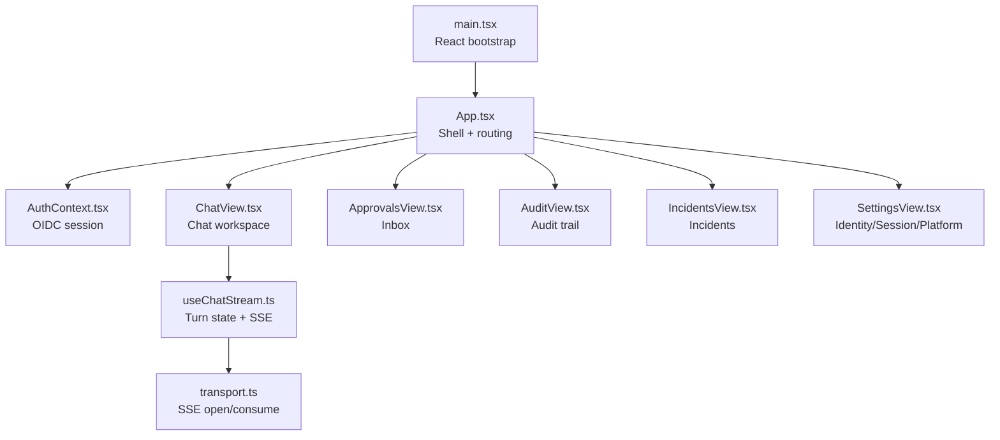
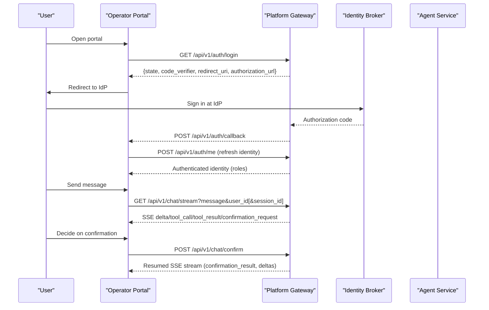
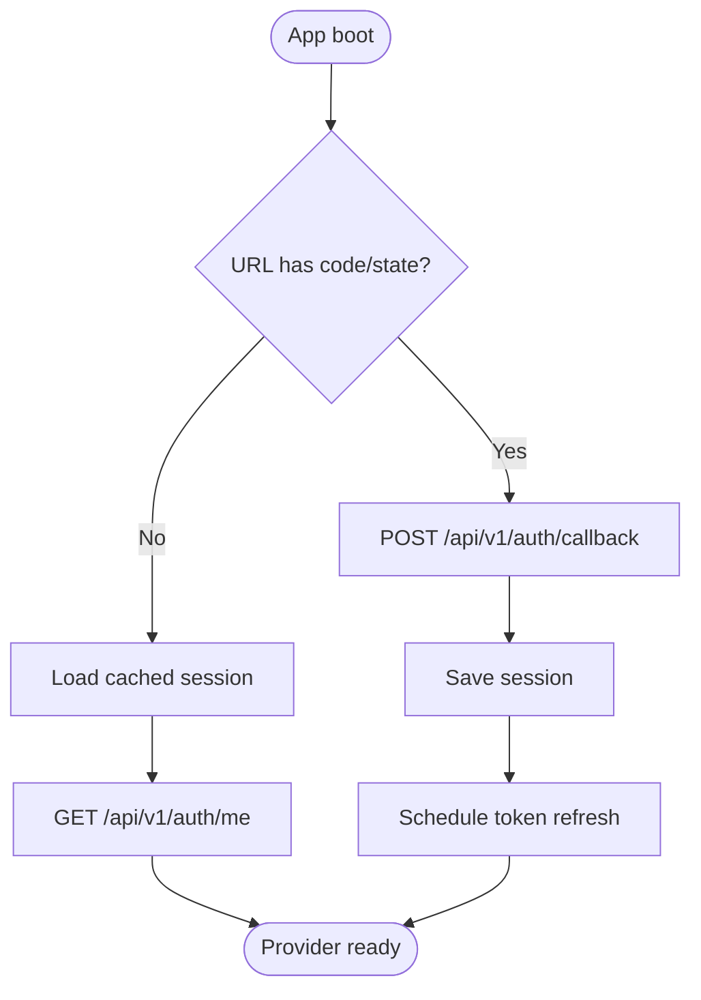
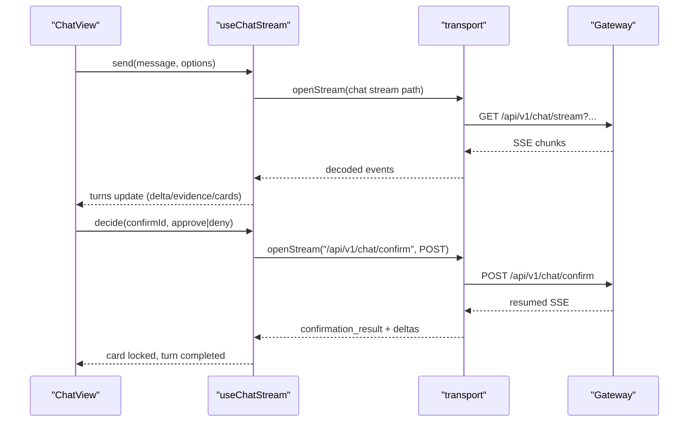
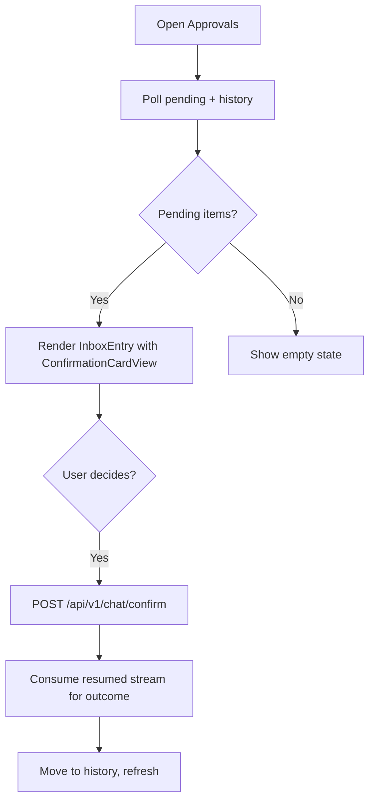
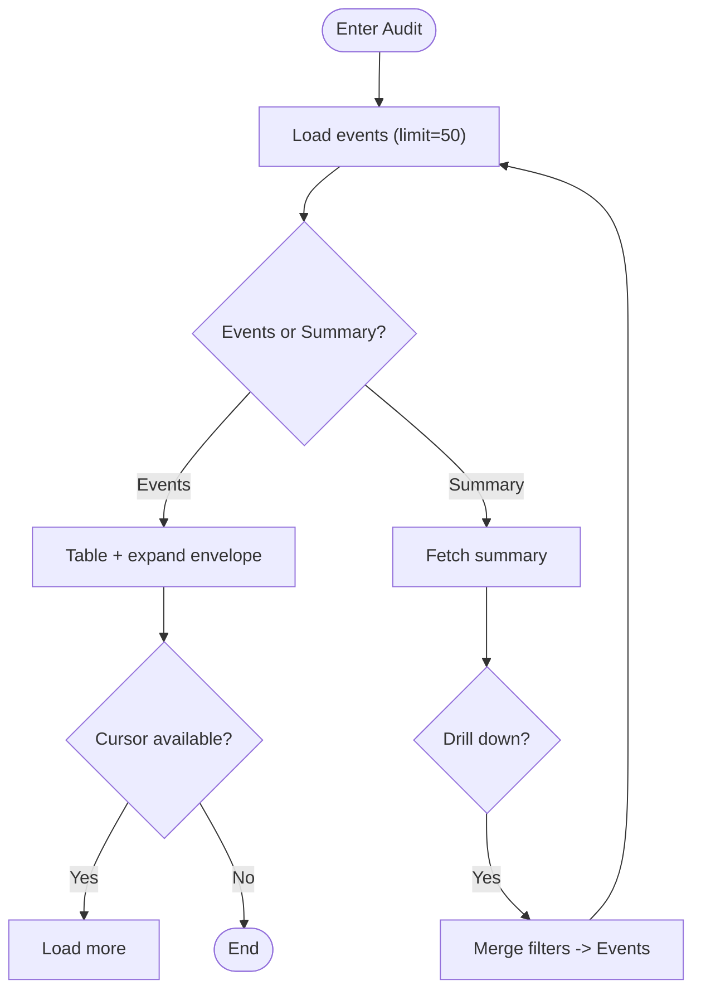
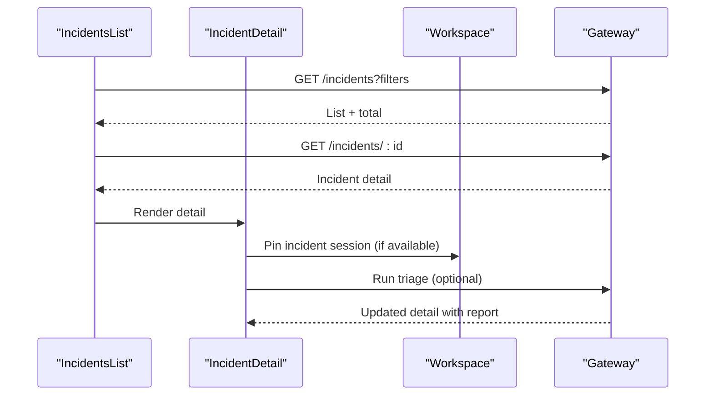
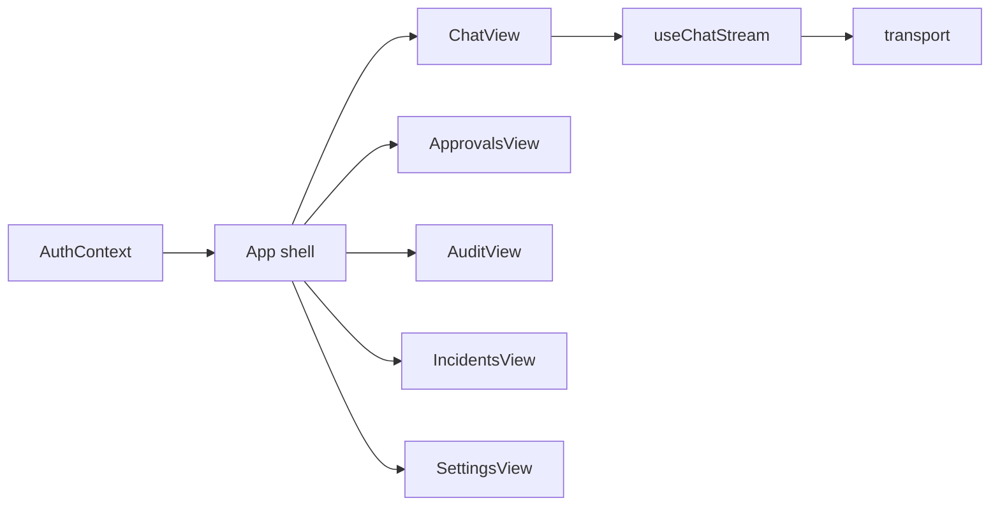

# Operator Portal

<cite>
**Referenced Files in This Document**
- [README.md](file://products/operator-portal/README.md)
- [package.json](file://products/operator-portal/web-ui/app/package.json)
- [main.tsx](file://products/operator-portal/web-ui/app/src/main.tsx)
- [App.tsx](file://products/operator-portal/web-ui/app/src/App.tsx)
- [AuthContext.tsx](file://products/operator-portal/web-ui/app/src/auth/AuthContext.tsx)
- [oidc.ts](file://products/operator-portal/web-ui/app/src/auth/oidc.ts)
- [useChatStream.ts](file://products/operator-portal/web-ui/app/src/stream/useChatStream.ts)
- [transport.ts](file://products/operator-portal/web-ui/app/src/stream/transport.ts)
- [ChatView.tsx](file://products/operator-portal/web-ui/app/src/chat/ChatView.tsx)
- [ApprovalsView.tsx](file://products/operator-portal/web-ui/app/src/views/control/ApprovalsView.tsx)
- [AuditView.tsx](file://products/operator-portal/web-ui/app/src/views/audit/AuditView.tsx)
- [IncidentsView.tsx](file://products/operator-portal/web-ui/app/src/views/incidents/IncidentsView.tsx)
- [SettingsView.tsx](file://products/operator-portal/web-ui/app/src/views/control/SettingsView.tsx)
</cite>

## Table of Contents
1. Introduction
2. Project Structure
3. Core Components
4. Architecture Overview
5. Detailed Component Analysis
6. Dependency Analysis
7. Performance Considerations
8. Troubleshooting Guide
9. Conclusion
10. Appendices

## Introduction
The Operator Portal is the React-based web interface for operators, approvers, and auditors. It provides:
- Chat sessions for agent interactions with streaming responses and human-in-the-loop confirmations
- An approvals inbox for reviewing and deciding on pending actions
- A durable audit trail view for compliance review
- An incidents panel for alert triage and collaboration
- Settings for inspecting identity, session state, and platform health

It runs as a single-page application built with Vite, TypeScript, and Ant Design (including Ant Design X), served by nginx and proxied to the platform gateway. Authentication uses OIDC via the platform gateway and identity broker, with silent token refresh and role-based UI gating.

**Section sources**
- [README.md:1-137](file://products/operator-portal/README.md#L1-L137)

## Project Structure
At a high level:
- The SPA entry mounts React under StrictMode, applies an Ant Design theme, and wraps the app with authentication context.
- App.tsx owns navigation, role-gated menu items, and two workspace instances (operation and development).
- Feature modules are organized by capability: chat, stream transport, auth, views (approvals, audit, incidents, settings), and utilities.

**Diagram sources**
- [main.tsx:1-18](file://products/operator-portal/web-ui/app/src/main.tsx#L1-L18)
- [App.tsx:304-461](file://products/operator-portal/web-ui/app/src/App.tsx#L304-L461)
- [AuthContext.tsx:31-110](file://products/operator-portal/web-ui/app/src/auth/AuthContext.tsx#L31-L110)
- [ChatView.tsx:1-800](file://products/operator-portal/web-ui/app/src/chat/ChatView.tsx#L1-L800)
- [useChatStream.ts:135-501](file://products/operator-portal/web-ui/app/src/stream/useChatStream.ts#L135-L501)
- [transport.ts:1-165](file://products/operator-portal/web-ui/app/src/stream/transport.ts#L1-L165)

**Section sources**
- [main.tsx:1-18](file://products/operator-portal/web-ui/app/src/main.tsx#L1-L18)
- [App.tsx:53-461](file://products/operator-portal/web-ui/app/src/App.tsx#L53-L461)
- [package.json:1-36](file://products/operator-portal/web-ui/app/package.json#L1-L36)

## Core Components
- Authentication provider: manages OIDC login, callback completion, silent refresh, logout, and exposes username/roles to the app.
- Session workspace: maintains per-mode session lists and active session pointer; used by Chat, Incidents, Documents, and Settings.
- Streaming chat adapter: accumulates turns, tool evidence frames, and HITL confirmation cards; supports session switching and re-seeding from transcripts.
- Views:
  - Approvals inbox polls pending confirmations and history, renders shared confirmation cards, and drives decisions over the same confirm stream.
  - Audit trail loads events with cursor pagination, summary aggregation, CSV export, and drill-down filters.
  - Incidents list/detail with auto-refresh, triage run, report form, connector dispatches, and deep-link into chat.
  - Settings shows identity claims, current session, and platform component health.

**Section sources**
- [AuthContext.tsx:31-110](file://products/operator-portal/web-ui/app/src/auth/AuthContext.tsx#L31-L110)
- [useChatStream.ts:135-501](file://products/operator-portal/web-ui/app/src/stream/useChatStream.ts#L135-L501)
- [ApprovalsView.tsx:69-441](file://products/operator-portal/web-ui/app/src/views/control/ApprovalsView.tsx#L69-L441)
- [AuditView.tsx:101-484](file://products/operator-portal/web-ui/app/src/views/audit/AuditView.tsx#L101-L484)
- [IncidentsView.tsx:103-699](file://products/operator-portal/web-ui/app/src/views/incidents/IncidentsView.tsx#L103-L699)
- [SettingsView.tsx:30-405](file://products/operator-portal/web-ui/app/src/views/control/SettingsView.tsx#L30-L405)

## Architecture Overview
The portal communicates exclusively through the platform gateway. Authentication flows through OIDC endpoints managed by the gateway and identity broker. Chat and confirmations use Server-Sent Events for real-time updates. Role checks gate UI elements; the gateway enforces authorization server-side.

**Diagram sources**
- [oidc.ts:75-156](file://products/operator-portal/web-ui/app/src/auth/oidc.ts#L75-L156)
- [oidc.ts:183-205](file://products/operator-portal/web-ui/app/src/auth/oidc.ts#L183-L205)
- [transport.ts:61-86](file://products/operator-portal/web-ui/app/src/stream/transport.ts#L61-L86)
- [transport.ts:111-148](file://products/operator-portal/web-ui/app/src/stream/transport.ts#L111-L148)
- [useChatStream.ts:240-328](file://products/operator-portal/web-ui/app/src/stream/useChatStream.ts#L240-L328)
- [useChatStream.ts:330-454](file://products/operator-portal/web-ui/app/src/stream/useChatStream.ts#L330-L454)

## Detailed Component Analysis

### Authentication and Session Management
- Login starts via gateway `/api/v1/auth/login`, redirects to IdP, and completes via `/api/v1/auth/callback` using PKCE state and code verifier stored in sessionStorage.
- On load, the provider attempts callback completion, then restores any existing session and schedules silent refresh before token expiry.
- Identity is refreshed via `/api/v1/auth/me`; failures clear the session and prompt re-authentication.
- Logout calls `/api/v1/auth/logout-url` and clears local state.

**Diagram sources**
- [AuthContext.tsx:40-71](file://products/operator-portal/web-ui/app/src/auth/AuthContext.tsx#L40-L71)
- [oidc.ts:75-156](file://products/operator-portal/web-ui/app/src/auth/oidc.ts#L75-L156)
- [oidc.ts:183-205](file://products/operator-portal/web-ui/app/src/auth/oidc.ts#L183-L205)

**Section sources**
- [AuthContext.tsx:31-110](file://products/operator-portal/web-ui/app/src/auth/AuthContext.tsx#L31-L110)
- [oidc.ts:15-73](file://products/operator-portal/web-ui/app/src/auth/oidc.ts#L15-L73)
- [oidc.ts:75-156](file://products/operator-portal/web-ui/app/src/auth/oidc.ts#L75-L156)
- [oidc.ts:158-205](file://products/operator-portal/web-ui/app/src/auth/oidc.ts#L158-L205)

### Streaming Chat Interface
- useChatStream owns turn state, tool evidence accumulation, and HITL confirmation cards.
- Sends messages via GET /api/v1/chat/stream with query parameters for user, optional session, modality, and model selection.
- Decodes SSE frames into deltas, tool calls/results, terminal markers, and confirmation requests/results.
- Supports session switching by aborting streams, caching turns per session, and restoring or seeding from transcript history.
- Confirmation decisions POST to /api/v1/chat/confirm; the response is the resumed SSE stream that continues rendering in place.

**Diagram sources**
- [useChatStream.ts:240-328](file://products/operator-portal/web-ui/app/src/stream/useChatStream.ts#L240-L328)
- [useChatStream.ts:330-454](file://products/operator-portal/web-ui/app/src/stream/useChatStream.ts#L330-L454)
- [transport.ts:61-86](file://products/operator-portal/web-ui/app/src/stream/transport.ts#L61-L86)
- [transport.ts:111-165](file://products/operator-portal/web-ui/app/src/stream/transport.ts#L111-L165)

**Section sources**
- [useChatStream.ts:135-501](file://products/operator-portal/web-ui/app/src/stream/useChatStream.ts#L135-L501)
- [transport.ts:1-165](file://products/operator-portal/web-ui/app/src/stream/transport.ts#L1-L165)
- [ChatView.tsx:1-800](file://products/operator-portal/web-ui/app/src/chat/ChatView.tsx#L1-L800)

### Approvals Inbox
- Polls pending confirmations and decision history every 30 seconds and on focus.
- Renders shared confirmation cards identical to those in chat, enabling consistent UX.
- Decisions reuse POST /api/v1/chat/confirm and consume the resumed stream to capture outcomes.
- Handles race conditions (409 already resolved) and expiration (410) gracefully, flipping cards to the winner’s outcome with attribution.

**Diagram sources**
- [ApprovalsView.tsx:69-241](file://products/operator-portal/web-ui/app/src/views/control/ApprovalsView.tsx#L69-L241)
- [ApprovalsView.tsx:243-441](file://products/operator-portal/web-ui/app/src/views/control/ApprovalsView.tsx#L243-L441)

**Section sources**
- [ApprovalsView.tsx:69-441](file://products/operator-portal/web-ui/app/src/views/control/ApprovalsView.tsx#L69-L441)

### Audit Trail
- Role-gated view for auditors/platform-admins.
- Loads events with cursor pagination and expandable verbatim envelopes.
- Provides a Summary tab with aggregates and drill-down that merges filters and reloads events.
- Exports CSV via blob download with truncation warnings when limits are hit.

**Diagram sources**
- [AuditView.tsx:101-240](file://products/operator-portal/web-ui/app/src/views/audit/AuditView.tsx#L101-L240)
- [AuditView.tsx:241-484](file://products/operator-portal/web-ui/app/src/views/audit/AuditView.tsx#L241-L484)

**Section sources**
- [AuditView.tsx:101-484](file://products/operator-portal/web-ui/app/src/views/audit/AuditView.tsx#L101-L484)

### Incidents Panel
- Role-gated incident list with filters and 15-second auto-refresh.
- Detail view includes triage report, connector dispatches, and “Continue in chat” deep link that pins the incident’s session into the chat workspace.
- Supports manual incident reporting and running triage; failed triage exposes raw agent output.

**Diagram sources**
- [IncidentsView.tsx:103-260](file://products/operator-portal/web-ui/app/src/views/incidents/IncidentsView.tsx#L103-L260)
- [IncidentsView.tsx:261-699](file://products/operator-portal/web-ui/app/src/views/incidents/IncidentsView.tsx#L261-L699)

**Section sources**
- [IncidentsView.tsx:103-699](file://products/operator-portal/web-ui/app/src/views/incidents/IncidentsView.tsx#L103-L699)

### Settings
- Read-only panes for Identity, Session, and Platform.
- Identity pane shows signed-in state, username, roles, subject, and groups.
- Session pane shows selected session and workspace session count.
- Platform pane probes gateway health and runtime metadata to display component status and versions.

**Section sources**
- [SettingsView.tsx:30-405](file://products/operator-portal/web-ui/app/src/views/control/SettingsView.tsx#L30-L405)

## Dependency Analysis
- The app shell composes feature views based on role visibility.
- AuthContext supplies identity and roles consumed by all views and components.
- Chat depends on the stream adapter and transport layer for SSE.
- Approvals reuses the same confirmation card and decision flow as Chat.
- Audit and Incidents fetch data via the gateway and render read-only surfaces.
- Settings reads health/runtime endpoints directly.

**Diagram sources**
- [App.tsx:304-461](file://products/operator-portal/web-ui/app/src/App.tsx#L304-L461)
- [AuthContext.tsx:31-110](file://products/operator-portal/web-ui/app/src/auth/AuthContext.tsx#L31-L110)
- [useChatStream.ts:135-501](file://products/operator-portal/web-ui/app/src/stream/useChatStream.ts#L135-L501)
- [transport.ts:1-165](file://products/operator-portal/web-ui/app/src/stream/transport.ts#L1-L165)

**Section sources**
- [App.tsx:53-461](file://products/operator-portal/web-ui/app/src/App.tsx#L53-L461)
- [AuthContext.tsx:31-110](file://products/operator-portal/web-ui/app/src/auth/AuthContext.tsx#L31-L110)

## Performance Considerations
- SSE streaming minimizes latency by pushing deltas and tool results incrementally.
- Per-session turn caching avoids re-fetching transcripts on session switches.
- Inbox polling interval balances freshness with network load; decisions trigger immediate refresh to keep UI consistent.
- Audit export uses blob downloads to avoid large JSON payloads in memory.
- Auto-refresh intervals are conservative (incidents 15s, approvals 30s) to reduce unnecessary requests.

[No sources needed since this section provides general guidance]

## Troubleshooting Guide
- Authentication errors:
  - If sign-in fails or token refresh fails, the session is cleared and the sidebar prompts re-authentication.
  - Stream requests returning 401 show a friendly message prompting sign-in.
- Confirmation races:
  - 409 responses indicate another approver decided first; the UI flips the card to the winner’s outcome with attribution.
  - 410 indicates the confirmation expired; the card locks and the turn completes.
- Audit access:
  - 403 indicates missing audit:read; 503/502 indicate service configuration or availability issues.
- Incidents:
  - “Continue in chat” is disabled if the incident’s triage session is not currently owned/visible in the workspace.

**Section sources**
- [oidc.ts:52-73](file://products/operator-portal/web-ui/app/src/auth/oidc.ts#L52-L73)
- [useChatStream.ts:283-328](file://products/operator-portal/web-ui/app/src/stream/useChatStream.ts#L283-L328)
- [useChatStream.ts:392-454](file://products/operator-portal/web-ui/app/src/stream/useChatStream.ts#L392-L454)
- [ApprovalsView.tsx:156-225](file://products/operator-portal/web-ui/app/src/views/control/ApprovalsView.tsx#L156-L225)
- [AuditView.tsx:72-88](file://products/operator-portal/web-ui/app/src/views/audit/AuditView.tsx#L72-L88)
- [IncidentsView.tsx:238-259](file://products/operator-portal/web-ui/app/src/views/incidents/IncidentsView.tsx#L238-L259)

## Conclusion
The Operator Portal delivers a secure, role-aware, real-time operator workspace. It integrates OIDC authentication, streams agent activity via SSE, and centralizes human-in-the-loop decisions in both chat and a dedicated approvals inbox. Compliance and observability are supported through a durable audit trail and an incidents triage workflow. The modular architecture and role-based UI make it extensible for future features while keeping the gateway as the authority for authorization.

[No sources needed since this section summarizes without analyzing specific files]

## Appendices

### Technology Stack and Browser Baseline
- Frontend: React, TypeScript, Vite, Ant Design and Ant Design X.
- Runtime: Node engine specified for development; production image builds static assets and serves them via nginx.
- Browser capabilities include multi-session workspace, voice input via Web Speech API, and responsive layouts with collapsible sidebar.

**Section sources**
- [package.json:1-36](file://products/operator-portal/web-ui/app/package.json#L1-L36)
- [README.md:37-88](file://products/operator-portal/README.md#L37-L88)