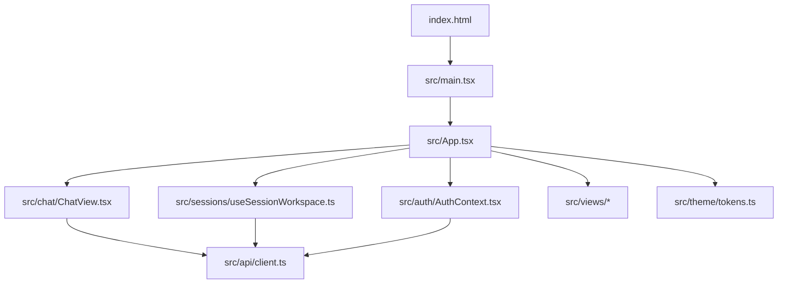
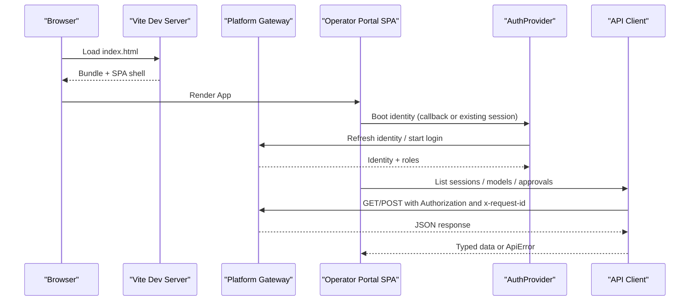
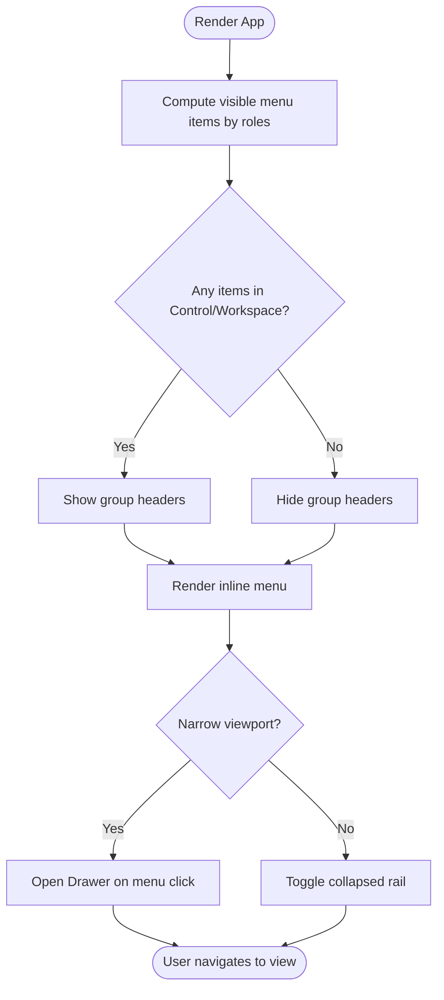
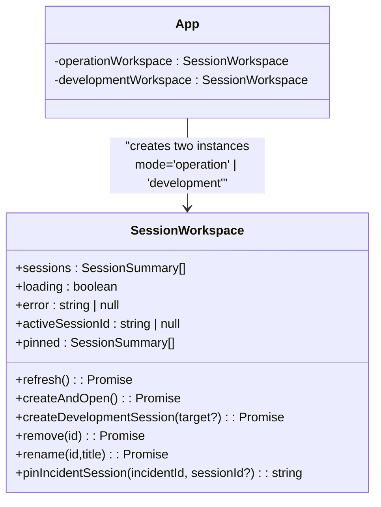
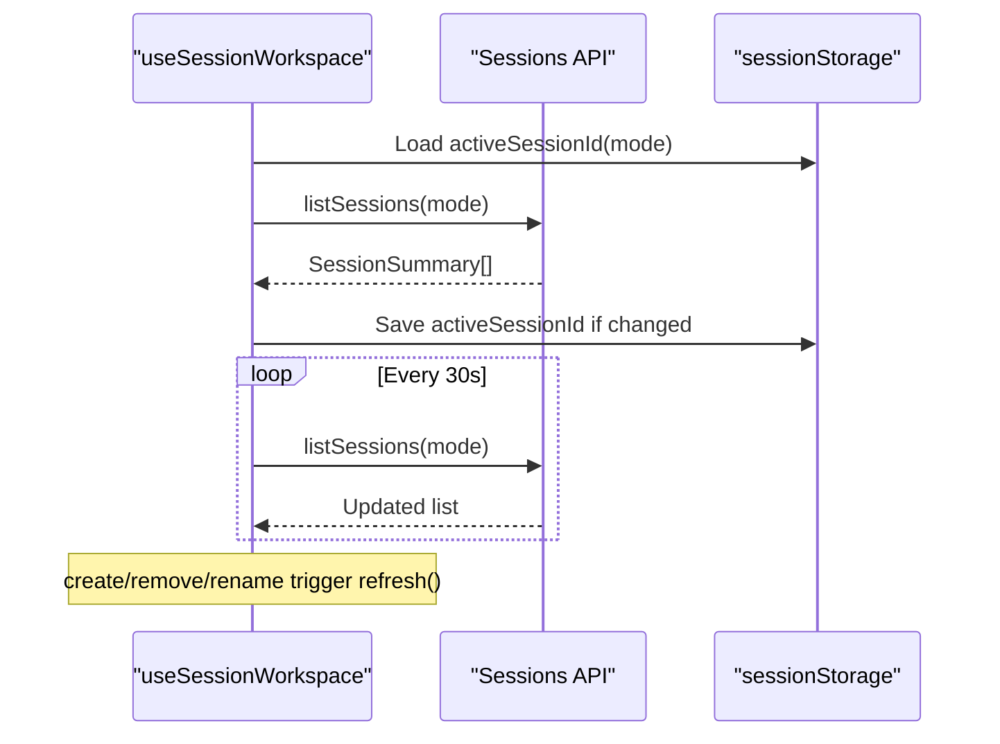
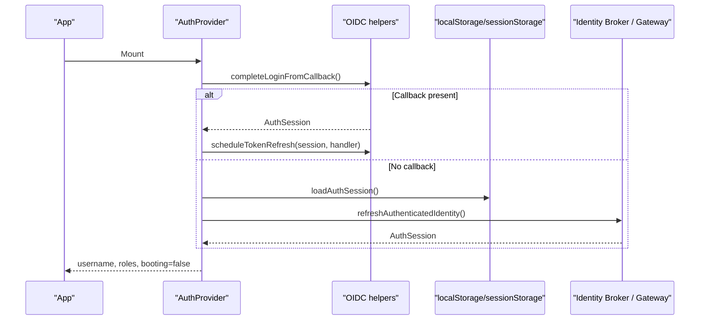
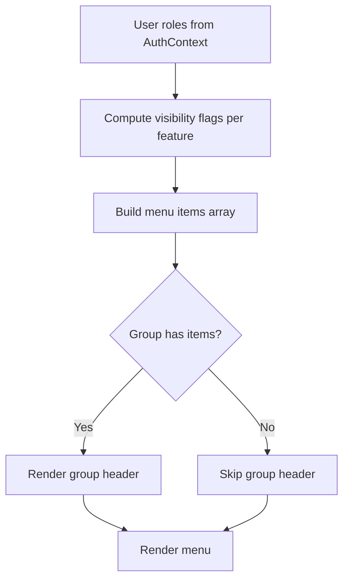
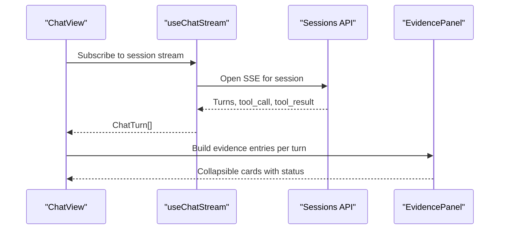
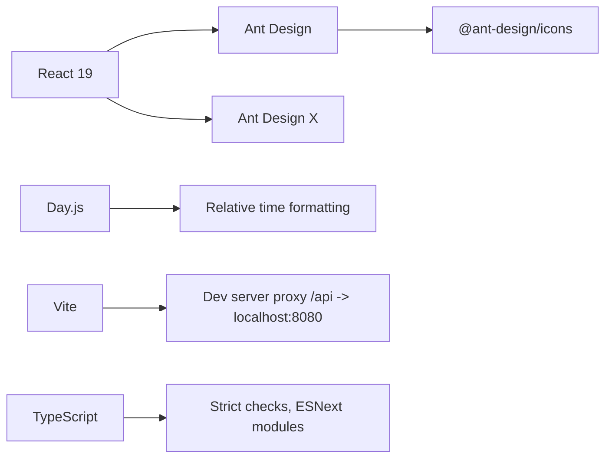

# Portal Architecture

<cite>
**Referenced Files in This Document**
- [README.md](file://products/operator-portal/README.md)
- [package.json](file://products/operator-portal/web-ui/app/package.json)
- [vite.config.ts](file://products/operator-portal/web-ui/app/vite.config.ts)
- [tsconfig.json](file://products/operator-portal/web-ui/app/tsconfig.json)
- [main.tsx](file://products/operator-portal/web-ui/app/src/main.tsx)
- [App.tsx](file://products/operator-portal/web-ui/app/src/App.tsx)
- [AuthContext.tsx](file://products/operator-portal/web-ui/app/src/auth/AuthContext.tsx)
- [roles.ts](file://products/operator-portal/web-ui/app/src/roles.ts)
- [useSessionWorkspace.ts](file://products/operator-portal/web-ui/app/src/sessions/useSessionWorkspace.ts)
- [client.ts](file://products/operator-portal/web-ui/app/src/api/client.ts)
- [tokens.ts](file://products/operator-portal/web-ui/app/src/theme/tokens.ts)
- [ChatView.tsx](file://products/operator-portal/web-ui/app/src/chat/ChatView.tsx)
</cite>

## Table of Contents
1. [Introduction](#introduction)
2. [Project Structure](#project-structure)
3. [Core Components](#core-components)
4. [Architecture Overview](#architecture-overview)
5. [Detailed Component Analysis](#detailed-component-analysis)
6. [Dependency Analysis](#dependency-analysis)
7. [Performance Considerations](#performance-considerations)
8. [Troubleshooting Guide](#troubleshooting-guide)
9. [Conclusion](#conclusion)

## Introduction
This document describes the Operator Portal’s React application architecture. It explains the Vite-based build system, TypeScript configuration, Ant Design and Ant Design X integration, the responsive shell with role-based navigation, dual workspace pattern for operation and development modes, session management, state organization, technology stack, dependency management, and build pipeline configuration. The portal is a single-page application built with Vite and React 19, styled via Ant Design with a dark theme, and communicates with backend services through a proxied gateway API.

## Project Structure
The operator portal lives under `products/operator-portal/web-ui/app`. Key areas:
- Build and configuration: `vite.config.ts`, `tsconfig.json`, `package.json`
- Application bootstrap: `src/main.tsx`
- Shell and routing: `src/App.tsx`
- Authentication: `src/auth/AuthContext.tsx`
- Role sets and visibility rules: `src/roles.ts`
- Session workspace (multi-session panel): `src/sessions/useSessionWorkspace.ts`
- API client and error handling: `src/api/client.ts`
- Theme tokens: `src/theme/tokens.ts`
- Chat workspace and evidence rendering: `src/chat/ChatView.tsx`
- Feature views: `src/views/*`

**Diagram sources**
- [main.tsx:9-16](file://products/operator-portal/web-ui/app/src/main.tsx#L9-L16)
- [App.tsx:304-458](file://products/operator-portal/web-ui/app/src/App.tsx#L304-L458)
- [useSessionWorkspace.ts:89-136](file://products/operator-portal/web-ui/app/src/sessions/useSessionWorkspace.ts#L89-L136)
- [ChatView.tsx:1-79](file://products/operator-portal/web-ui/app/src/chat/ChatView.tsx#L1-L79)
- [client.ts:72-100](file://products/operator-portal/web-ui/app/src/api/client.ts#L72-L100)
- [tokens.ts:23-42](file://products/operator-portal/web-ui/app/src/theme/tokens.ts#L23-L42)

**Section sources**
- [README.md:23-41](file://products/operator-portal/README.md#L23-L41)
- [package.json:9-34](file://products/operator-portal/web-ui/app/package.json#L9-L34)
- [vite.config.ts:27-52](file://products/operator-portal/web-ui/app/vite.config.ts#L27-L52)
- [tsconfig.json:1-19](file://products/operator-portal/web-ui/app/tsconfig.json#L1-L19)

## Core Components
- App shell and navigation: Provides a two-column layout with a collapsible sidebar and mobile drawer fallback. Menu items are grouped into Control and Workspace sections and hidden automatically when all entries in a section are not visible to the current user.
- Authentication context: Bootstraps OIDC login, handles callback completion, persists sessions, schedules token refresh, and exposes username and roles to the app.
- Session workspace: Manages multi-session lists, active session persistence per mode, polling, creation, deletion, renaming, and pinned incident sessions.
- API client: Centralized fetch wrapper that injects request IDs, bearer tokens, and converts non-OK responses into typed errors with optional detail payloads.
- Theme: Dark theme tokens applied via Ant Design ConfigProvider.

**Section sources**
- [App.tsx:74-302](file://products/operator-portal/web-ui/app/src/App.tsx#L74-L302)
- [App.tsx:304-458](file://products/operator-portal/web-ui/app/src/App.tsx#L304-L458)
- [AuthContext.tsx:31-100](file://products/operator-portal/web-ui/app/src/auth/AuthContext.tsx#L31-L100)
- [useSessionWorkspace.ts:89-283](file://products/operator-portal/web-ui/app/src/sessions/useSessionWorkspace.ts#L89-L283)
- [client.ts:1-121](file://products/operator-portal/web-ui/app/src/api/client.ts#L1-L121)
- [tokens.ts:1-43](file://products/operator-portal/web-ui/app/src/theme/tokens.ts#L1-L43)

## Architecture Overview
The portal renders a React tree wrapped by an Ant Design ConfigProvider with a custom dark theme and an AuthProvider. The root component manages view selection, responsive navigation, and dual workspace instances for operation and development modes. All network calls go through a shared API client that attaches authentication and request tracing headers.

**Diagram sources**
- [main.tsx:9-16](file://products/operator-portal/web-ui/app/src/main.tsx#L9-L16)
- [AuthContext.tsx:40-71](file://products/operator-portal/web-ui/app/src/auth/AuthContext.tsx#L40-L71)
- [client.ts:72-100](file://products/operator-portal/web-ui/app/src/api/client.ts#L72-L100)
- [vite.config.ts:41-47](file://products/operator-portal/web-ui/app/vite.config.ts#L41-L47)

## Detailed Component Analysis

### Application Shell and Responsive Navigation
- Layout uses Ant Design Layout with a Sider for the sidebar and a content area for views.
- On narrow viewports, a Drawer provides off-canvas navigation; a floating menu button toggles either the drawer or collapsed rail.
- Sidebar groups (“Control”, “Workspace”) hide their headers when all child items are hidden based on roles.
- Platform version is shown next to the brand logo.

**Diagram sources**
- [App.tsx:74-302](file://products/operator-portal/web-ui/app/src/App.tsx#L74-L302)
- [App.tsx:374-458](file://products/operator-portal/web-ui/app/src/App.tsx#L374-L458)

**Section sources**
- [App.tsx:74-302](file://products/operator-portal/web-ui/app/src/App.tsx#L74-L302)
- [App.tsx:374-458](file://products/operator-portal/web-ui/app/src/App.tsx#L374-L458)

### Dual Workspace Pattern (Operation vs Development)
- Two independent workspace instances are created: one for operation (Chat, Incidents, Documents, Settings) and one for development (Studio).
- Each instance has its own active session key namespace so switching between Chat and Studio does not interfere.
- Development workspace is only enabled for users with authoring roles; otherwise it remains disabled and does not poll.

**Diagram sources**
- [App.tsx:312-341](file://products/operator-portal/web-ui/app/src/App.tsx#L312-L341)
- [useSessionWorkspace.ts:15-26](file://products/operator-portal/web-ui/app/src/sessions/useSessionWorkspace.ts#L15-L26)
- [useSessionWorkspace.ts:89-136](file://products/operator-portal/web-ui/app/src/sessions/useSessionWorkspace.ts#L89-L136)

**Section sources**
- [App.tsx:312-341](file://products/operator-portal/web-ui/app/src/App.tsx#L312-L341)
- [useSessionWorkspace.ts:15-26](file://products/operator-portal/web-ui/app/src/sessions/useSessionWorkspace.ts#L15-L26)
- [useSessionWorkspace.ts:89-136](file://products/operator-portal/web-ui/app/src/sessions/useSessionWorkspace.ts#L89-L136)

### Session Management and Polling
- Sessions list is fetched on mount and every 30 seconds while authenticated.
- Active session ID is persisted per mode in session storage and restored on reload.
- Creation, deletion, and rename operations update the list and handle specific server statuses with user-friendly messages.
- Pinned incident sessions appear immediately even before the server list catches up.

**Diagram sources**
- [useSessionWorkspace.ts:73-87](file://products/operator-portal/web-ui/app/src/sessions/useSessionWorkspace.ts#L73-L87)
- [useSessionWorkspace.ts:107-136](file://products/operator-portal/web-ui/app/src/sessions/useSessionWorkspace.ts#L107-L136)
- [useSessionWorkspace.ts:151-238](file://products/operator-portal/web-ui/app/src/sessions/useSessionWorkspace.ts#L151-L238)
- [useSessionWorkspace.ts:240-266](file://products/operator-portal/web-ui/app/src/sessions/useSessionWorkspace.ts#L240-L266)

**Section sources**
- [useSessionWorkspace.ts:73-87](file://products/operator-portal/web-ui/app/src/sessions/useSessionWorkspace.ts#L73-L87)
- [useSessionWorkspace.ts:107-136](file://products/operator-portal/web-ui/app/src/sessions/useSessionWorkspace.ts#L107-L136)
- [useSessionWorkspace.ts:151-238](file://products/operator-portal/web-ui/app/src/sessions/useSessionWorkspace.ts#L151-L238)
- [useSessionWorkspace.ts:240-266](file://products/operator-portal/web-ui/app/src/sessions/useSessionWorkspace.ts#L240-L266)

### Authentication Flow
- On boot, the auth context completes any OIDC callback, loads an existing session, and refreshes the authenticated identity.
- Token refresh is scheduled ahead of expiry; failures clear the session and prompt re-authentication.
- Login/logout triggers OIDC flows and clears local session state.

**Diagram sources**
- [AuthContext.tsx:40-71](file://products/operator-portal/web-ui/app/src/auth/AuthContext.tsx#L40-L71)
- [AuthContext.tsx:73-85](file://products/operator-portal/web-ui/app/src/auth/AuthContext.tsx#L73-L85)

**Section sources**
- [AuthContext.tsx:40-85](file://products/operator-portal/web-ui/app/src/auth/AuthContext.tsx#L40-L85)

### Role-Based Menu Visibility
- Menu entries are conditionally rendered based on role sets defined centrally.
- Sections auto-hide when no items are visible for the current user.
- Some features (e.g., Studio) require higher-trust authoring roles.

**Diagram sources**
- [App.tsx:103-224](file://products/operator-portal/web-ui/app/src/App.tsx#L103-L224)
- [roles.ts:1-95](file://products/operator-portal/web-ui/app/src/roles.ts#L1-L95)

**Section sources**
- [App.tsx:103-224](file://products/operator-portal/web-ui/app/src/App.tsx#L103-L224)
- [roles.ts:1-95](file://products/operator-portal/web-ui/app/src/roles.ts#L1-L95)

### Chat Workspace and Evidence Rendering
- ChatView composes the session panel, SSE stream adapter, and transcript seeding to render live and replayed sessions consistently.
- Tool evidence is aggregated per turn and displayed as collapsible cards with status badges and expandable outputs.
- Voice input and model selection are integrated into the composer area.

**Diagram sources**
- [ChatView.tsx:1-79](file://products/operator-portal/web-ui/app/src/chat/ChatView.tsx#L1-L79)
- [ChatView.tsx:98-155](file://products/operator-portal/web-ui/app/src/chat/ChatView.tsx#L98-L155)

**Section sources**
- [ChatView.tsx:1-79](file://products/operator-portal/web-ui/app/src/chat/ChatView.tsx#L1-L79)
- [ChatView.tsx:98-155](file://products/operator-portal/web-ui/app/src/chat/ChatView.tsx#L98-L155)

## Dependency Analysis
- Runtime dependencies include React 19, Ant Design, Ant Design X, Day.js, and Ant Design Icons.
- Development dependencies include Vite, Vitest, TypeScript, and testing libraries.
- Vite config injects platform and dependency versions at build time and proxies `/api` to the gateway during development.
- TypeScript targets ES2022 with strict settings and bundler module resolution.

**Diagram sources**
- [package.json:15-34](file://products/operator-portal/web-ui/app/package.json#L15-L34)
- [vite.config.ts:41-47](file://products/operator-portal/web-ui/app/vite.config.ts#L41-L47)
- [tsconfig.json:1-19](file://products/operator-portal/web-ui/app/tsconfig.json#L1-L19)

**Section sources**
- [package.json:15-34](file://products/operator-portal/web-ui/app/package.json#L15-L34)
- [vite.config.ts:27-52](file://products/operator-portal/web-ui/app/vite.config.ts#L27-L52)
- [tsconfig.json:1-19](file://products/operator-portal/web-ui/app/tsconfig.json#L1-L19)

## Performance Considerations
- Session list polling runs every 30 seconds only when authenticated; intervals are cleared on unmount to avoid leaks.
- Monotonic refresh sequences prevent stale updates from out-of-order responses.
- Content-hashed assets enable immutable caching; the SPA shell is served without-store to ensure fresh navigation.
- Local dev proxy reduces cross-origin overhead and simplifies debugging.

[No sources needed since this section provides general guidance]

## Troubleshooting Guide
- Authentication errors surface in the sidebar footer alert; retry by signing in again.
- API errors are wrapped in a typed error with optional detail; use the last request ID exposed by the settings panel for correlation.
- Session deletion may fail with a conflict if a confirmation is pending; resolve the approval first.
- If the gateway URL needs overriding locally, use the provided setting mechanism.

**Section sources**
- [AuthContext.tsx:60-66](file://products/operator-portal/web-ui/app/src/auth/AuthContext.tsx#L60-L66)
- [client.ts:8-23](file://products/operator-portal/web-ui/app/src/api/client.ts#L8-L23)
- [client.ts:45-56](file://products/operator-portal/web-ui/app/src/api/client.ts#L45-L56)
- [client.ts:25-43](file://products/operator-portal/web-ui/app/src/api/client.ts#L25-L43)
- [useSessionWorkspace.ts:182-211](file://products/operator-portal/web-ui/app/src/sessions/useSessionWorkspace.ts#L182-L211)

## Conclusion
The Operator Portal implements a modern, role-aware React SPA with a robust dual-workspace model, resilient session management, and a clean separation between UI concerns and backend interactions. The Vite build pipeline injects runtime metadata, while Ant Design provides a consistent dark theme and accessible components. Role-based visibility ensures a safe and focused operator experience, with server-side enforcement complementing client-side gates.