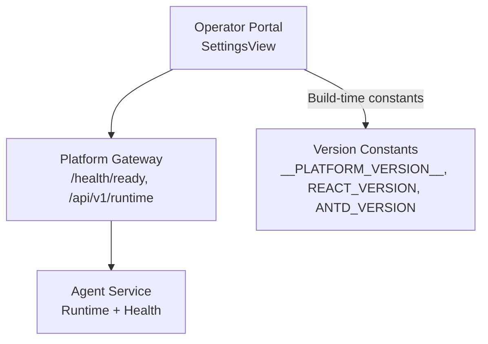
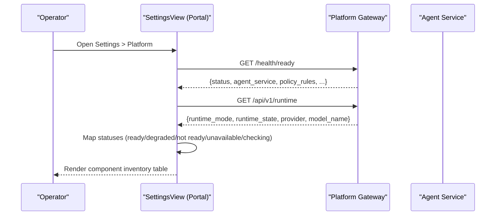
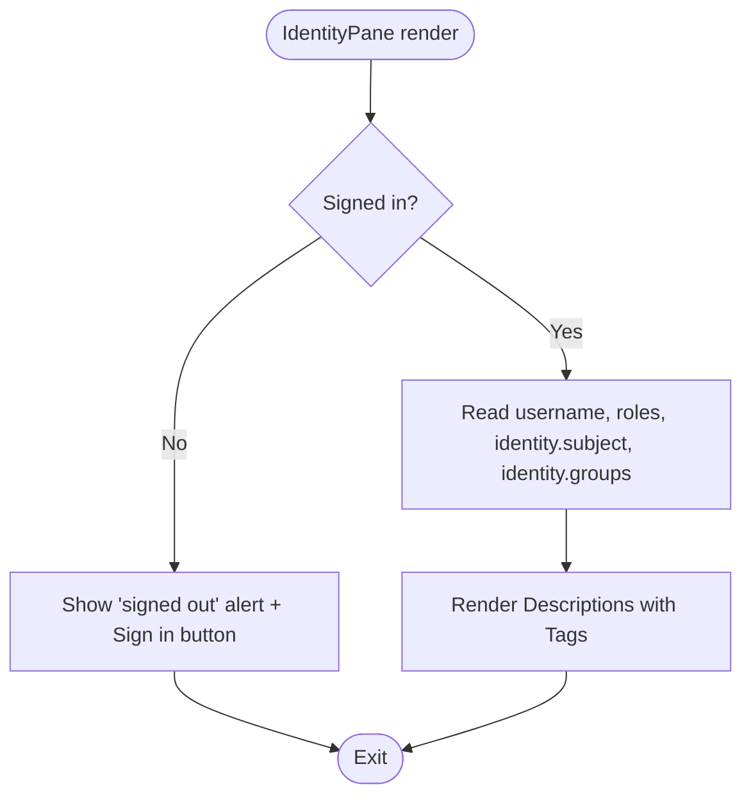
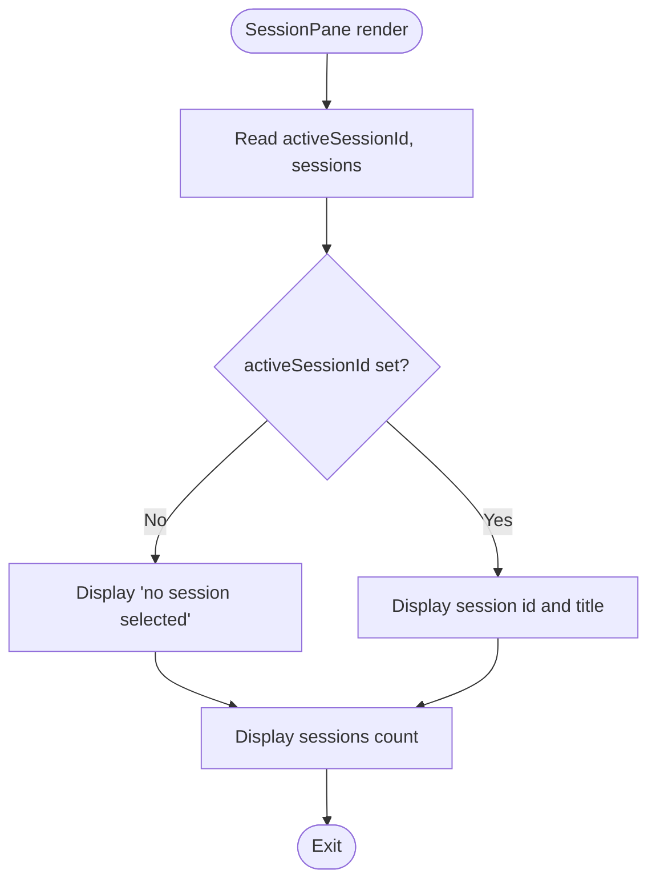
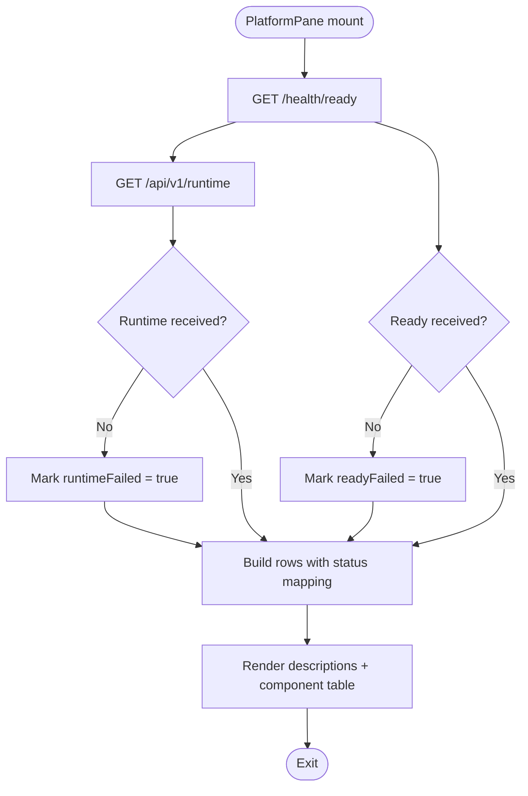
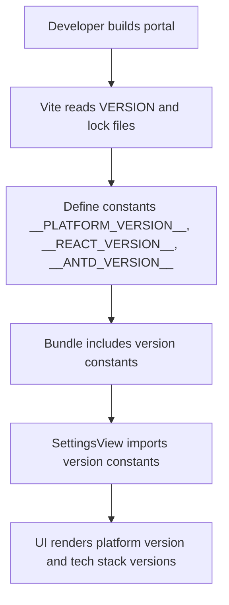
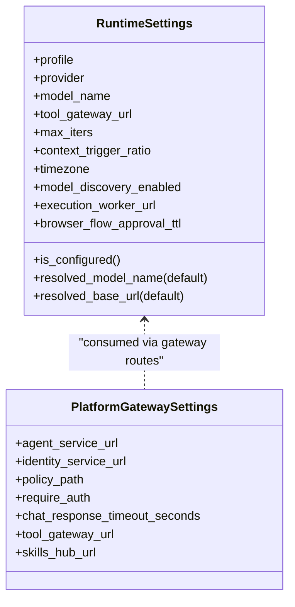
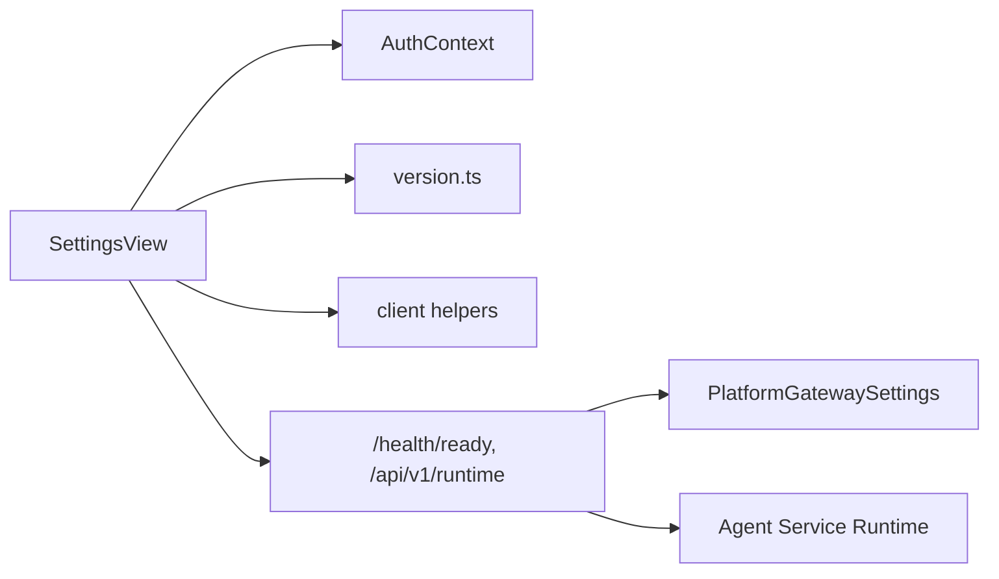

# Settings & Configuration

<cite>
**Referenced Files in This Document**
- [SettingsView.tsx](file://products/operator-portal/web-ui/app/src/views/control/SettingsView.tsx)
- [version.ts](file://products/operator-portal/web-ui/app/src/version.ts)
- [vite.config.ts](file://products/operator-portal/web-ui/app/vite.config.ts)
- [runtime.py (platform-gateway)](file://products/platform-gateway/src/platform_gateway/api/routes/runtime.py)
- [config.py (platform-gateway)](file://products/platform-gateway/src/platform_gateway/core/config.py)
- [runtime_settings.py (agent-service)](file://products/agent-platform/src/agent_service/runtime_settings.py)
- [configuration-reference.md](file://docs/guides/configuration-reference.md)
- [troubleshooting.md](file://docs/guides/troubleshooting.md)
- [test_runtime_settings.py (platform-gateway)](file://products/platform-gateway/tests/test_runtime_settings.py)
</cite>

## Table of Contents
1. Introduction
2. Project Structure
3. Core Components
4. Architecture Overview
5. Detailed Component Analysis
6. Dependency Analysis
7. Performance Considerations
8. Troubleshooting Guide
9. Conclusion

## Introduction
This document explains the operator-facing Settings and Configuration interface that lets you view platform version information, runtime configuration status, and environment-specific settings. It focuses on the SettingsView component, which is a read-only surface for identity, session, and platform state. It also documents how the portal injects build-time versions, how it queries live backend health and runtime metadata, and how these pieces integrate with the broader platform configuration system. Where relevant, links to the full configuration reference and troubleshooting guides are provided.

## Project Structure
The Settings experience lives in the operator portal web UI and integrates with platform services through well-defined endpoints:

- Operator portal SettingsView renders three read-only panes: Identity, Session, and Platform.
- The Platform pane displays:
  - Build-time platform version and tech stack versions injected at build time.
  - Live status and versions of key platform components by calling gateway health and runtime endpoints.
- Backend services expose configuration-driven surfaces:
  - Platform gateway exposes runtime metadata and readiness information used by the portal.
  - Agent service provides runtime configuration and health data surfaced via the gateway.

**Diagram sources**
- [SettingsView.tsx:194-357](file://products/operator-portal/web-ui/app/src/views/control/SettingsView.tsx#L194-L357)
- [runtime.py (platform-gateway):9-13](file://products/platform-gateway/src/platform_gateway/api/routes/runtime.py#L9-L13)
- [vite.config.ts:27-33](file://products/operator-portal/web-ui/app/vite.config.ts#L27-L33)
- [version.ts:1-6](file://products/operator-portal/web-ui/app/src/version.ts#L1-L6)

**Section sources**
- [SettingsView.tsx:1-405](file://products/operator-portal/web-ui/app/src/views/control/SettingsView.tsx#L1-L405)
- [vite.config.ts:1-54](file://products/operator-portal/web-ui/app/vite.config.ts#L1-L54)
- [runtime.py (platform-gateway):1-13](file://products/platform-gateway/src/platform_gateway/api/routes/runtime.py#L1-L13)

## Core Components
- SettingsView (operator portal)
  - Identity pane: shows sign-in state, username, roles, subject, and groups from client-side auth context; degrades to a sign-in prompt when signed out.
  - Session pane: shows selected session id, title, and total sessions from workspace state; explicitly handles no-session-selected state.
  - Platform pane: shows platform version, API origin, last request id, and a table of key platform components with technology, version, and status.
- Version injection
  - Build-time constants for platform version and tech stack versions are injected into the portal bundle and exposed via a small module consumed by SettingsView.
- Backend integration
  - Platform pane calls gateway endpoints to fetch readiness and runtime metadata, then maps responses to a consistent status vocabulary (ready, degraded, not ready, unavailable, checking).

**Section sources**
- [SettingsView.tsx:28-103](file://products/operator-portal/web-ui/app/src/views/control/SettingsView.tsx#L28-L103)
- [SettingsView.tsx:105-357](file://products/operator-portal/web-ui/app/src/views/control/SettingsView.tsx#L105-L357)
- [version.ts:1-6](file://products/operator-portal/web-ui/app/src/version.ts#L1-L6)
- [vite.config.ts:6-33](file://products/operator-portal/web-ui/app/vite.config.ts#L6-L33)

## Architecture Overview
The Settings page composes read-only views from client-side state and live backend signals. The Platform pane is the most configuration-sensitive area because it reflects the operational posture of the platform’s core services.

**Diagram sources**
- [SettingsView.tsx:194-357](file://products/operator-portal/web-ui/app/src/views/control/SettingsView.tsx#L194-L357)
- [runtime.py (platform-gateway):9-13](file://products/platform-gateway/src/platform_gateway/api/routes/runtime.py#L9-L13)

## Detailed Component Analysis

### SettingsView: Identity Pane
- Displays sign-in state, username, roles, optional subject, and groups.
- When signed out, shows an informational alert with a sign-in action instead of stale identity data.

**Diagram sources**
- [SettingsView.tsx:28-79](file://products/operator-portal/web-ui/app/src/views/control/SettingsView.tsx#L28-L79)

**Section sources**
- [SettingsView.tsx:28-79](file://products/operator-portal/web-ui/app/src/views/control/SettingsView.tsx#L28-L79)

### SettingsView: Session Pane
- Shows the active session id and title if present; otherwise shows an explicit “no session selected” message.
- Displays the number of sessions known to the workspace.

**Diagram sources**
- [SettingsView.tsx:81-103](file://products/operator-portal/web-ui/app/src/views/control/SettingsView.tsx#L81-L103)

**Section sources**
- [SettingsView.tsx:81-103](file://products/operator-portal/web-ui/app/src/views/control/SettingsView.tsx#L81-L103)

### SettingsView: Platform Pane
- Displays:
  - Platform version (build-time constant).
  - API origin and last request id (from portal client helpers).
  - A table of key platform components with technology, version, and status.
- Status mapping:
  - Gateway readiness: ok → ready; other values → degraded; missing or failed → unavailable/checking.
  - Agent service: ready → ready; not ready → not ready; missing or failed → unavailable/checking.
  - Agent runtime (LLM): ready → ready; not ready → not ready; missing or failed → unavailable/checking.
  - Session store and agent state stores: boolean readiness mapped to ready/not ready; unknown → unknown; unavailable/checking when backend is unreachable.
  - Policy bundle: counts rules; status always ready when available.

**Diagram sources**
- [SettingsView.tsx:194-357](file://products/operator-portal/web-ui/app/src/views/control/SettingsView.tsx#L194-L357)

**Section sources**
- [SettingsView.tsx:105-357](file://products/operator-portal/web-ui/app/src/views/control/SettingsView.tsx#L105-L357)

### Version Display Mechanism
- Build-time injection:
  - The portal reads the repository VERSION file and locks React and Ant Design versions from package-lock.json during build.
  - These constants are defined into the bundle and exported via a small module consumed by SettingsView.
- Runtime display:
  - SettingsView renders the platform version tag and lists React/Ant Design versions under the portal row in the component table.

**Diagram sources**
- [vite.config.ts:6-33](file://products/operator-portal/web-ui/app/vite.config.ts#L6-L33)
- [version.ts:1-6](file://products/operator-portal/web-ui/app/src/version.ts#L1-L6)
- [SettingsView.tsx:221-233](file://products/operator-portal/web-ui/app/src/views/control/SettingsView.tsx#L221-L233)

**Section sources**
- [vite.config.ts:1-54](file://products/operator-portal/web-ui/app/vite.config.ts#L1-L54)
- [version.ts:1-6](file://products/operator-portal/web-ui/app/src/version.ts#L1-L6)
- [SettingsView.tsx:221-233](file://products/operator-portal/web-ui/app/src/views/control/SettingsView.tsx#L221-L233)

### Configuration Validation and Integration Points
- Agent service runtime settings:
  - Parsed from environment variables with strict validation ranges and choices.
  - Validates kernel tuning knobs, timezone, discovery intervals, worker timeouts, and more.
  - Provides helper methods to resolve model names and base URLs.
- Platform gateway settings:
  - Reads downstream service URLs, token audiences, policy paths, timeouts, and feature toggles from environment.
  - Defaults ensure sensible behavior when variables are unset.
- Tests:
  - Validate default downstream URLs and require-auth parsing behavior.

**Diagram sources**
- [runtime_settings.py (agent-service):136-527](file://products/agent-platform/src/agent_service/runtime_settings.py#L136-L527)
- [config.py (platform-gateway):23-131](file://products/platform-gateway/src/platform_gateway/core/config.py#L23-L131)

**Section sources**
- [runtime_settings.py (agent-service):136-527](file://products/agent-platform/src/agent_service/runtime_settings.py#L136-L527)
- [config.py (platform-gateway):23-131](file://products/platform-gateway/src/platform_gateway/core/config.py#L23-L131)
- [test_runtime_settings.py (platform-gateway):7-37](file://products/platform-gateway/tests/test_runtime_settings.py#L7-L37)

## Dependency Analysis
- Frontend dependencies:
  - SettingsView depends on:
    - AuthContext for identity and session state.
    - Version constants for platform and tech stack versions.
    - Client helpers for gateway origin and last request id.
- Backend dependencies:
  - Platform gateway exposes runtime metadata and readiness used by the portal.
  - Agent service runtime configuration drives availability and capabilities surfaced through the gateway.

**Diagram sources**
- [SettingsView.tsx:18-26](file://products/operator-portal/web-ui/app/src/views/control/SettingsView.tsx#L18-L26)
- [runtime.py (platform-gateway):9-13](file://products/platform-gateway/src/platform_gateway/api/routes/runtime.py#L9-L13)
- [config.py (platform-gateway):23-131](file://products/platform-gateway/src/platform_gateway/core/config.py#L23-L131)

**Section sources**
- [SettingsView.tsx:18-26](file://products/operator-portal/web-ui/app/src/views/control/SettingsView.tsx#L18-L26)
- [runtime.py (platform-gateway):9-13](file://products/platform-gateway/src/platform_gateway/api/routes/runtime.py#L9-L13)
- [config.py (platform-gateway):23-131](file://products/platform-gateway/src/platform_gateway/core/config.py#L23-L131)

## Performance Considerations
- The Platform pane performs two lightweight GET requests on mount and caches results in local state; this keeps the UI responsive while reflecting live backend posture.
- Status labels use a small, deterministic mapping function to avoid repeated logic during render.
- Build-time version constants eliminate runtime lookups for portal version and tech stack versions.

[No sources needed since this section provides general guidance]

## Troubleshooting Guide
Common configuration issues visible or diagnosable via the Settings interface and related documentation:

- Platform pane shows unavailable or checking:
  - Indicates gateway readiness or runtime endpoint failures. Verify network reachability and service health.
  - See the configuration reference for required variables and defaults.
- Agent runtime shows not ready:
  - Often caused by missing or invalid LLM provider credentials or misconfigured runtime settings.
  - Use the configuration reference to validate provider, model name, and API key provisioning steps.
- Identity pane shows signed out:
  - Ensure OIDC configuration is correct and Keycloak is reachable.
  - Follow the portal login troubleshooting steps.
- Tool list empty or tools denied:
  - Confirm tool-gateway URL and connector configuration.
  - Review policy grants and mutating tool activation checklist.
- Audit events missing:
  - Check emitter *_AUDIT_SERVICE_URL and matching secrets; audit delivery is fire-and-forget and can degrade silently.

For detailed diagnostics and resolution steps, consult:
- Configuration Reference: full environment variable map, cross-service dependency chains, and secret contracts.
- Troubleshooting Guide: symptom-based diagnosis for common deployment and runtime issues.

**Section sources**
- [configuration-reference.md:1-747](file://docs/guides/configuration-reference.md#L1-L747)
- [troubleshooting.md:1-800](file://docs/guides/troubleshooting.md#L1-L800)

## Conclusion
The Settings interface provides operators with a clear, read-only view of identity, session, and platform state. The Platform pane is especially valuable for diagnosing configuration and runtime posture by combining build-time version constants with live backend signals. For deeper configuration details and step-by-step resolutions, refer to the configuration reference and troubleshooting guide linked above.