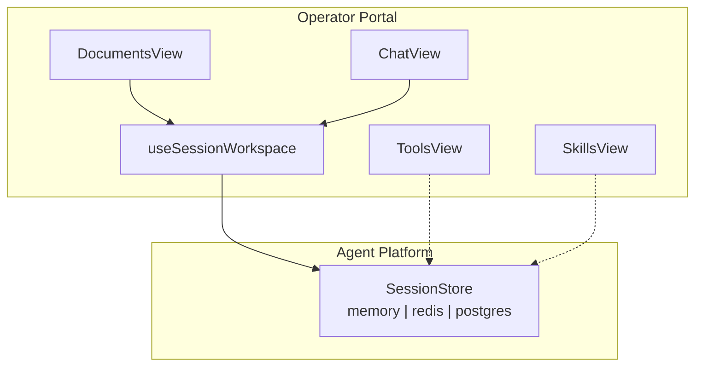
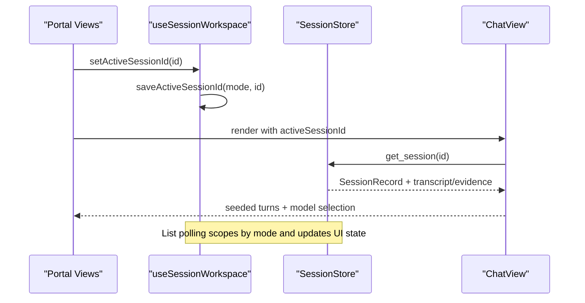
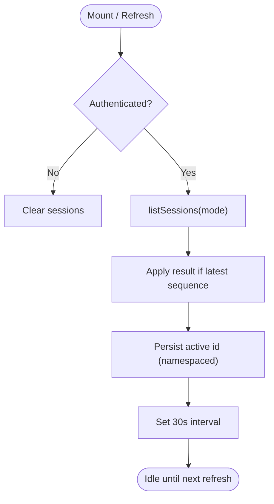
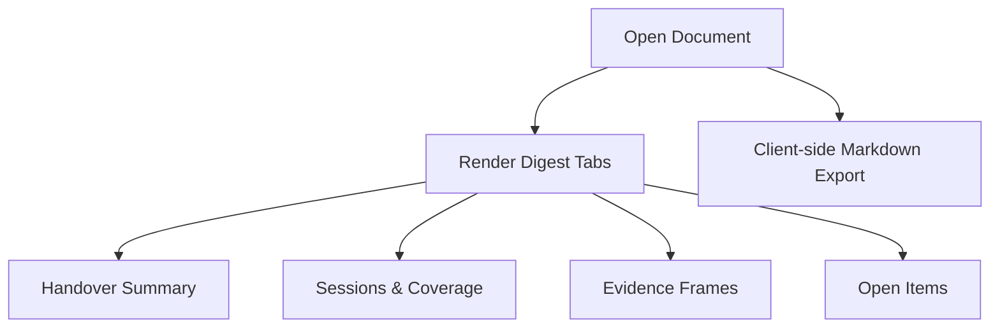
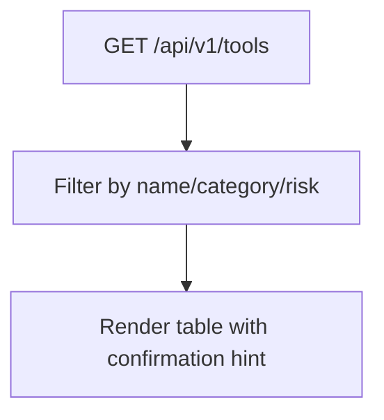
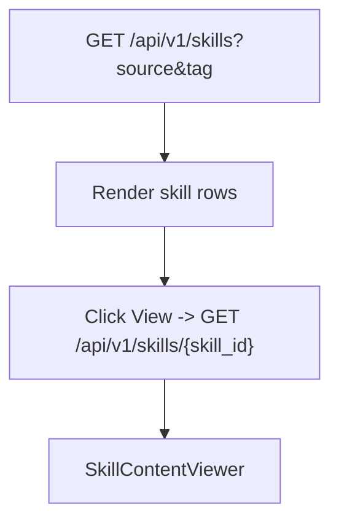
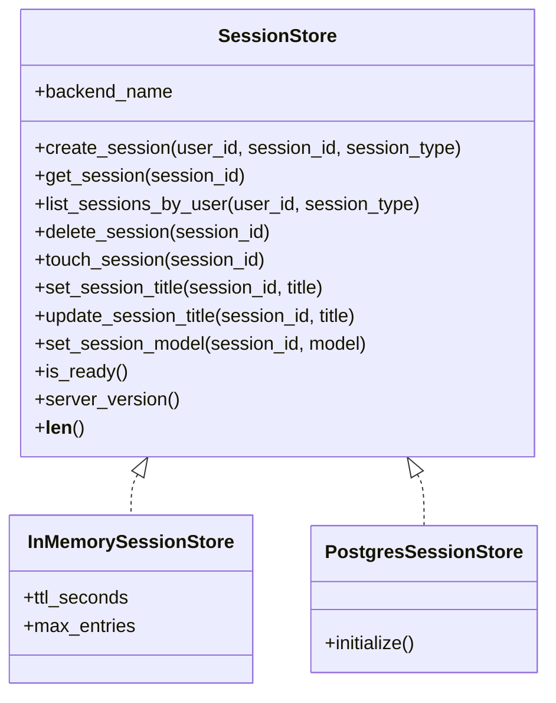
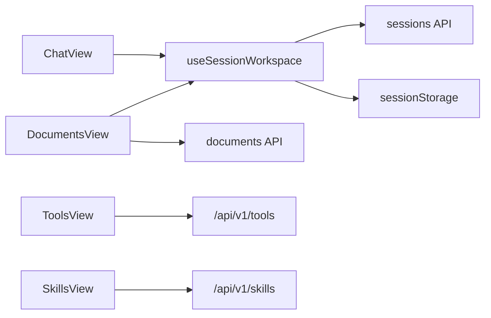

# Workspace Management

<cite>
**Referenced Files in This Document**
- [useSessionWorkspace.ts](file://products/operator-portal/web-ui/app/src/sessions/useSessionWorkspace.ts)
- [useSessionWorkspace.test.ts](file://products/operator-portal/web-ui/app/src/sessions/__tests__/useSessionWorkspace.test.ts)
- [DocumentsView.tsx](file://products/operator-portal/web-ui/app/src/views/workspace/DocumentsView.tsx)
- [ToolsView.tsx](file://products/operator-portal/web-ui/app/src/views/control/ToolsView.tsx)
- [SkillsView.tsx](file://products/operator-portal/web-ui/app/src/views/control/SkillsView.tsx)
- [documents.ts](file://products/operator-portal/web-ui/app/src/api/documents.ts)
- [ChatView.tsx](file://products/operator-portal/web-ui/app/src/chat/ChatView.tsx)
- [session_store.py](file://products/agent-platform/src/agent_service/services/session_store.py)
- [test_postgres_session_store.py](file://products/agent-platform/tests/test_postgres_session_store.py)
- [skills_connector.py](file://products/tool-gateway/src/tool_gateway/tools/skills_connector.py)
- [SPEC-040-shift-summary-handover-narrative/spec.md](file://docs/specs/SPEC-040-shift-summary-handover-narrative/spec.md)
- [SPEC-016-session-store-postgres-separation/spec.md](file://docs/specs/SPEC-016-session-store-postgres-separation/spec.md)
</cite>

## Table of Contents
1. Introduction
2. Project Structure
3. Core Components
4. Architecture Overview
5. Detailed Component Analysis
6. Dependency Analysis
7. Performance Considerations
8. Troubleshooting Guide
9. Conclusion

## Introduction
This document explains the workspace management system that provides persistent session state across portal views and coordinates operation and development sessions. It focuses on:
- The useSessionWorkspace hook for managing active sessions, list scoping by mode, creation, deletion, renaming, incident pinning, and cross-view synchronization.
- The Documents view for shift handover artifacts and incident reports.
- The Tools view for discovering available tools and their risk tiers.
- The Skills view for browsing operational guidance.
It also covers session lifecycle management, persistence strategies (client-side and server-side), and integration patterns with other portal views.

## Project Structure
The workspace management spans the operator portal UI and the agent platform backend:
- Operator portal UI:
  - Session workspace hook and tests under sessions.
  - Workspace and control views: Documents, Tools, Skills.
  - Chat integration for resuming sessions and model selection.
- Agent platform backend:
  - Pluggable session store with memory, Redis, and Postgres backends.
  - Environment-driven configuration and fail-open fallback behavior.

**Diagram sources**
- [useSessionWorkspace.ts:89-136](file://products/operator-portal/web-ui/app/src/sessions/useSessionWorkspace.ts#L89-L136)
- [DocumentsView.tsx:1-800](file://products/operator-portal/web-ui/app/src/views/workspace/DocumentsView.tsx#L1-L800)
- [ToolsView.tsx:23-170](file://products/operator-portal/web-ui/app/src/views/control/ToolsView.tsx#L23-L170)
- [SkillsView.tsx:34-175](file://products/operator-portal/web-ui/app/src/views/control/SkillsView.tsx#L34-L175)
- [ChatView.tsx:1309-1372](file://products/operator-portal/web-ui/app/src/chat/ChatView.tsx#L1309-L1372)
- [session_store.py:46-120](file://products/agent-platform/src/agent_service/services/session_store.py#L46-L120)

**Section sources**
- [useSessionWorkspace.ts:1-283](file://products/operator-portal/web-ui/app/src/sessions/useSessionWorkspace.ts#L1-L283)
- [DocumentsView.tsx:1-800](file://products/operator-portal/web-ui/app/src/views/workspace/DocumentsView.tsx#L1-L800)
- [ToolsView.tsx:1-170](file://products/operator-portal/web-ui/app/src/views/control/ToolsView.tsx#L1-L170)
- [SkillsView.tsx:1-175](file://products/operator-portal/web-ui/app/src/views/control/SkillsView.tsx#L1-L175)
- [ChatView.tsx:1309-1372](file://products/operator-portal/web-ui/app/src/chat/ChatView.tsx#L1309-L1372)
- [session_store.py:1-200](file://products/agent-platform/src/agent_service/services/session_store.py#L1-L200)

## Core Components
- useSessionWorkspace hook:
  - Manages a per-mode active session pointer persisted in sessionStorage.
  - Polls the session list at a fixed interval and applies monotonic refresh to avoid race conditions.
  - Creates, deletes, renames sessions; pins incident sessions as synthetic entries; supports “develop-as-you-go” creation with target validation.
- Documents view:
  - Renders deterministic digests for shift summaries and incident reports, including handover sections and open items.
  - Supports export and narrative display anchored to digest facts.
- Tools view:
  - Displays the tool catalog from the gateway with client-side filters and confirmation policy hints based on risk level.
- Skills view:
  - Lists skills with source/tag filters and opens a read-only content viewer for full skill details.
- Session store:
  - Pluggable backend with TTL-based eviction and environment-driven selection; fails open to memory when configured backend is unreachable.

**Section sources**
- [useSessionWorkspace.ts:54-123](file://products/operator-portal/web-ui/app/src/sessions/useSessionWorkspace.ts#L54-L123)
- [DocumentsView.tsx:102-525](file://products/operator-portal/web-ui/app/src/views/workspace/DocumentsView.tsx#L102-L525)
- [ToolsView.tsx:23-170](file://products/operator-portal/web-ui/app/src/views/control/ToolsView.tsx#L23-L170)
- [SkillsView.tsx:34-175](file://products/operator-portal/web-ui/app/src/views/control/SkillsView.tsx#L34-L175)
- [session_store.py:128-200](file://products/agent-platform/src/agent_service/services/session_store.py#L128-L200)

## Architecture Overview
The workspace layer coordinates UI state and server-backed session data:
- Client-side persistence:
  - Active session id is namespaced by mode (operation vs development) in sessionStorage.
  - Pinned incident sessions are maintained locally until the server list catches up.
- Server-side persistence:
  - Sessions are stored via a pluggable SessionStore with TTL and optional Postgres backend.
  - List operations can be scoped by session_type for multi-workspace isolation.
- Cross-view synchronization:
  - ChatView consumes the active session id to load transcripts, evidence, and confirmations.
  - Documents view composes immutable snapshots from durable stores into digests.
  - Tools and Skills views provide discovery surfaces that complement operational workflows.

**Diagram sources**
- [useSessionWorkspace.ts:73-143](file://products/operator-portal/web-ui/app/src/sessions/useSessionWorkspace.ts#L73-L143)
- [ChatView.tsx:1309-1372](file://products/operator-portal/web-ui/app/src/chat/ChatView.tsx#L1309-L1372)
- [session_store.py:46-120](file://products/agent-platform/src/agent_service/services/session_store.py#L46-L120)

## Detailed Component Analysis

### useSessionWorkspace Hook
Responsibilities:
- Namespaced active session persistence per mode.
- Periodic list refresh with monotonic sequence guards.
- Session lifecycle: create (including develop-as-you-go), delete, rename.
- Incident pinning with synthetic operation-typed entries.
- Error handling with anti-enumeration messages and status-specific feedback.

Key behaviors:
- Mode scoping ensures Chat (operation) and Studio (development) do not share active pointers or lists.
- Pinning adds immediate visibility for incident triage sessions before server list sync.
- Development session creation validates targets and returns structured outcomes for inline reporting.

**Diagram sources**
- [useSessionWorkspace.ts:89-136](file://products/operator-portal/web-ui/app/src/sessions/useSessionWorkspace.ts#L89-L136)
- [useSessionWorkspace.ts:138-180](file://products/operator-portal/web-ui/app/src/sessions/useSessionWorkspace.ts#L138-L180)

**Section sources**
- [useSessionWorkspace.ts:1-283](file://products/operator-portal/web-ui/app/src/sessions/useSessionWorkspace.ts#L1-L283)
- [useSessionWorkspace.test.ts:59-147](file://products/operator-portal/web-ui/app/src/sessions/__tests__/useSessionWorkspace.test.ts#L59-L147)

### Documents View
Purpose:
- Create, manage, publish, and read operations documents (shift summaries and incident reports).
- Render deterministic digests with tabs for handover, sessions, evidence, and open items.
- Provide Markdown export and digest-anchored narrative display.

Highlights:
- Handover section shows counts, pending confirmations, requested executions, and open sessions.
- Foreign coverage renders metadata-only entries with clear labeling.
- Creation-time posture maps specific error codes to operator-friendly messages.

**Diagram sources**
- [DocumentsView.tsx:279-525](file://products/operator-portal/web-ui/app/src/views/workspace/DocumentsView.tsx#L279-L525)
- [DocumentsView.tsx:1-101](file://products/operator-portal/web-ui/app/src/views/workspace/DocumentsView.tsx#L1-L101)

**Section sources**
- [DocumentsView.tsx:1-800](file://products/operator-portal/web-ui/app/src/views/workspace/DocumentsView.tsx#L1-L800)
- [documents.ts:1-13](file://products/operator-portal/web-ui/app/src/api/documents.ts#L1-L13)
- [SPEC-040-shift-summary-handover-narrative/spec.md:1-113](file://docs/specs/SPEC-040-shift-summary-handover-narrative/spec.md#L1-L113)

### Tools View
Purpose:
- Discover registered tools and understand execution policy implications via risk levels.

Capabilities:
- Fetches catalog from the gateway and applies client-side filters (name, category, risk).
- Indicates whether confirmation is required or auto-allowed based on risk tier.

**Diagram sources**
- [ToolsView.tsx:33-101](file://products/operator-portal/web-ui/app/src/views/control/ToolsView.tsx#L33-L101)

**Section sources**
- [ToolsView.tsx:1-170](file://products/operator-portal/web-ui/app/src/views/control/ToolsView.tsx#L1-L170)

### Skills View
Purpose:
- Browse operational guidance (skills) with source and tag filters.
- Open a read-only viewer for full skill content.

Behavior:
- Lists summaries without bodies; detail fetch occurs lazily when viewing.
- Encodes skill identifiers for gateway path routing.

**Diagram sources**
- [SkillsView.tsx:46-79](file://products/operator-portal/web-ui/app/src/views/control/SkillsView.tsx#L46-L79)
- [skills_connector.py:158-195](file://products/tool-gateway/src/tool_gateway/tools/skills_connector.py#L158-L195)

**Section sources**
- [SkillsView.tsx:1-175](file://products/operator-portal/web-ui/app/src/views/control/SkillsView.tsx#L1-L175)
- [skills_connector.py:158-357](file://products/tool-gateway/src/tool_gateway/tools/skills_connector.py#L158-L357)

### Session Lifecycle and Persistence
- Client-side:
  - Active session id is saved per mode in sessionStorage and restored on mount.
  - Pinned incident sessions appear immediately in the panel.
- Server-side:
  - SessionStore supports memory, Redis, and Postgres backends with TTL-based eviction.
  - Environment variables select backend and configure TTL; unknown backends fail startup; Postgres failures fall back to memory with metrics.
  - session_type is a birth property and influences list scoping.

**Diagram sources**
- [session_store.py:46-120](file://products/agent-platform/src/agent_service/services/session_store.py#L46-L120)
- [session_store.py:128-200](file://products/agent-platform/src/agent_service/services/session_store.py#L128-L200)

**Section sources**
- [session_store.py:1-200](file://products/agent-platform/src/agent_service/services/session_store.py#L1-L200)
- [test_postgres_session_store.py:317-346](file://products/agent-platform/tests/test_postgres_session_store.py#L317-L346)
- [SPEC-016-session-store-postgres-separation/spec.md:58-88](file://docs/specs/SPEC-016-session-store-postgres-separation/spec.md#L58-L88)

## Dependency Analysis
- useSessionWorkspace depends on:
  - API clients for sessions (list/create/delete/rename).
  - sessionStorage for active session persistence.
  - ChatView consumes active session id to seed conversation state.
- DocumentsView depends on:
  - Documents API and incident APIs for creation and reading.
  - SessionWorkspace for context-aware navigation and pinning.
- ToolsView and SkillsView depend on:
  - Gateway endpoints for tool and skill catalogs.
  - SkillContentViewer for detailed rendering.

**Diagram sources**
- [useSessionWorkspace.ts:1-143](file://products/operator-portal/web-ui/app/src/sessions/useSessionWorkspace.ts#L1-L143)
- [DocumentsView.tsx:47-57](file://products/operator-portal/web-ui/app/src/views/workspace/DocumentsView.tsx#L47-L57)
- [ToolsView.tsx:33-50](file://products/operator-portal/web-ui/app/src/views/control/ToolsView.tsx#L33-L50)
- [SkillsView.tsx:46-79](file://products/operator-portal/web-ui/app/src/views/control/SkillsView.tsx#L46-L79)

**Section sources**
- [useSessionWorkspace.ts:1-143](file://products/operator-portal/web-ui/app/src/sessions/useSessionWorkspace.ts#L1-L143)
- [DocumentsView.tsx:1-101](file://products/operator-portal/web-ui/app/src/views/workspace/DocumentsView.tsx#L1-L101)
- [ToolsView.tsx:23-101](file://products/operator-portal/web-ui/app/src/views/control/ToolsView.tsx#L23-L101)
- [SkillsView.tsx:34-79](file://products/operator-portal/web-ui/app/src/views/control/SkillsView.tsx#L34-L79)

## Performance Considerations
- Monotonic refresh sequences prevent stale list updates during concurrent decisions or polls.
- 30-second polling balances freshness with network overhead.
- Client-side filtering reduces re-renders and avoids extra server calls for Tools and Skills views.
- Lazy loading of skill detail minimizes payload size until needed.
- SessionStore TTL and eviction keep memory usage bounded; Postgres backend offloads persistence with efficient queries.

[No sources needed since this section provides general guidance]

## Troubleshooting Guide
Common issues and resolutions:
- Stale active session after tab reload:
  - Ensure the correct mode key is used; operation and development keys are separate.
  - Verify sessionStorage contains the expected key for the current mode.
- Delete conflicts:
  - A 409 indicates an outstanding confirmation; resolve it before deleting.
  - A 404 returns a neutral message to avoid enumeration; refresh the list to reconcile.
- Rename errors:
  - Titles must meet length constraints; invalid input returns a specific message.
- Missing or expired sessions:
  - ChatView marks known-missing sessions to avoid streaming stale ids; first send may auto-create the session.
- Backend availability:
  - If Postgres is unreachable, the service falls back to memory; check metrics and logs for fallback events.

**Section sources**
- [useSessionWorkspace.ts:151-238](file://products/operator-portal/web-ui/app/src/sessions/useSessionWorkspace.ts#L151-L238)
- [ChatView.tsx:1309-1372](file://products/operator-portal/web-ui/app/src/chat/ChatView.tsx#L1309-L1372)
- [session_store.py:949-969](file://products/agent-platform/src/agent_service/services/session_store.py#L949-L969)

## Conclusion
The workspace management system unifies session state across portal views through a robust hook, deterministic document digests, and discovery surfaces for tools and skills. It combines client-side persistence with server-side durability, supports multi-mode isolation, and integrates tightly with chat and incident workflows. The design emphasizes reliability (monotonic refresh, TTL eviction, fail-open backends), clarity (digest-anchored narratives, explicit risk tiers), and operability (pinning, export, filtering).

[No sources needed since this section summarizes without analyzing specific files]