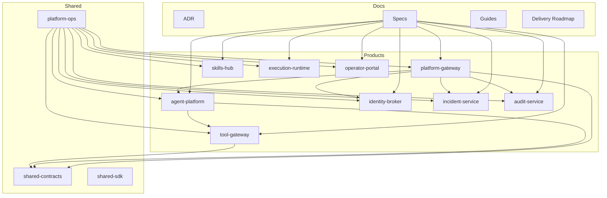
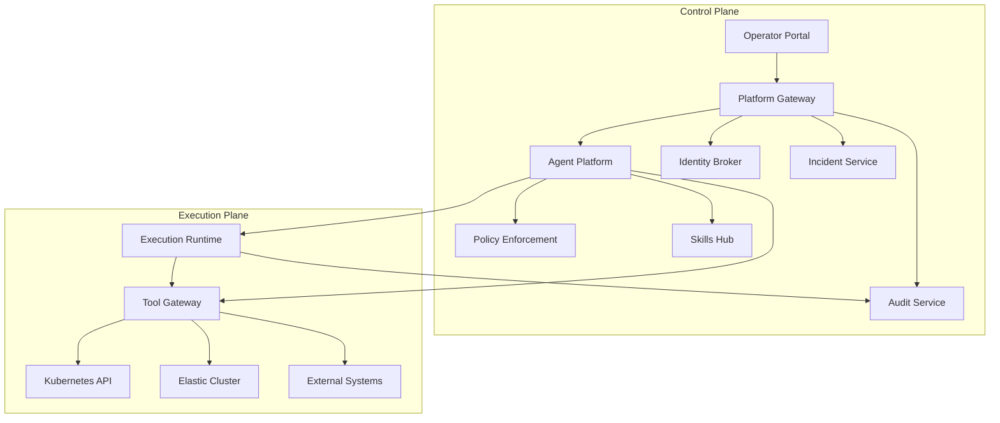
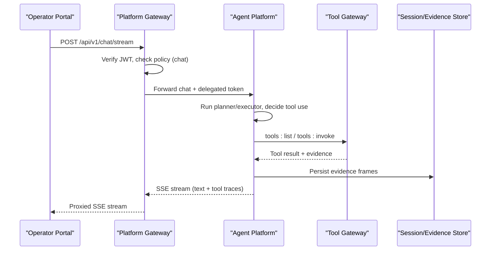
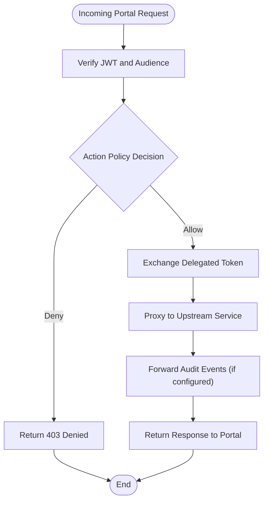
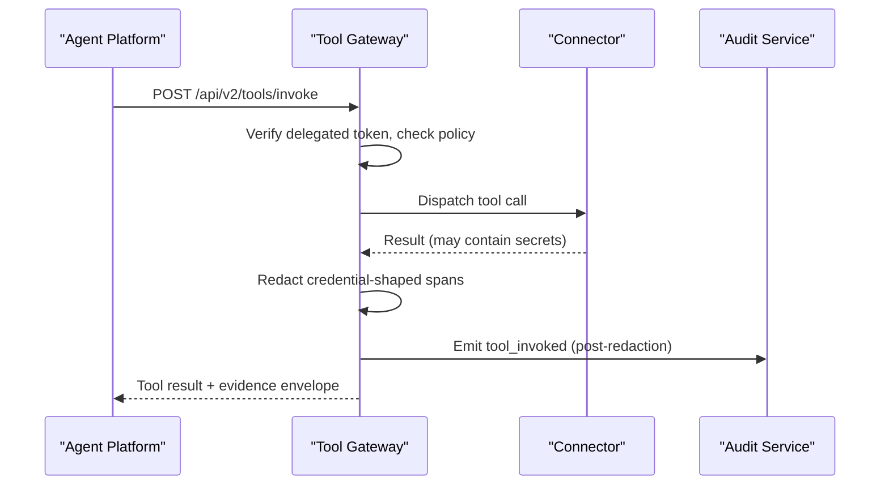
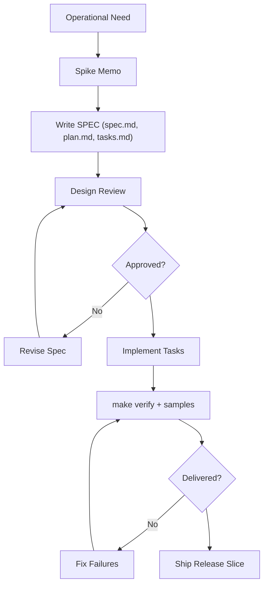
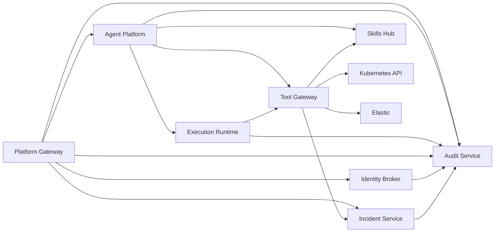

# Platform Overview

<cite>
**Referenced Files in This Document**
- [README.md](file://README.md)
- [delivery-roadmap.md](file://docs/agentic-aiops-platform/delivery-roadmap.md)
- [part-1-decision-matrix.md](file://docs/agentic-aiops-platform/part-1-decision-matrix.md)
- [part-2-reference-architecture.md](file://docs/agentic-aiops-platform/part-2-reference-architecture.md)
- [specs/README.md](file://docs/specs/README.md)
- [architecture-overview.md](file://docs/guides/architecture-overview.md)
- [agent-platform README.md](file://products/agent-platform/README.md)
- [platform-gateway README.md](file://products/platform-gateway/README.md)
- [tool-gateway README.md](file://products/tool-gateway/README.md)
</cite>

## Table of Contents
1. Introduction
2. Project Structure
3. Core Components
4. Architecture Overview
5. Detailed Component Analysis
6. Dependency Analysis
7. Performance Considerations
8. Troubleshooting Guide
9. Conclusion

## Introduction
Luban AIOPS is an enterprise-grade agentic AIOps workspace designed to help operations teams triage incidents faster, follow guided procedures with confidence, and execute secure operational actions under clear identity, policy, approval, and audit controls. It combines a streaming operator portal, an AgentScope-based runtime kernel, a platform gateway for authentication and policy enforcement, a tool gateway for normalized connector access, and durable audit and knowledge services. The result is a control-plane-first platform that treats automated operations as auditable, approval-gated workflows rather than ad hoc scripts or chat-only assistants.

The platform solves common operational problems:
- Fragmented tools and runbooks across systems and teams
- Unclear ownership and weak attribution for automated actions
- Risky automation without human oversight or durable evidence
- Slow incident triage due to scattered context and manual correlation
- Difficulty scaling operator expertise across shifts and environments

By separating identity, policy, and execution concerns while keeping product boundaries explicit, Luban enables incremental delivery of capabilities through a spec-driven development workflow. Each release adds one major value theme, validated end-to-end by operators before moving forward.

**Section sources**
- [README.md:1-92](file://README.md#L1-L92)
- [delivery-roadmap.md:1-554](file://docs/agentic-aiops-platform/delivery-roadmap.md#L1-L554)

## Project Structure
At the top level, the repository is organized into three primary areas:
- products/: Product-oriented projects that deliver core platform capabilities such as agent orchestration, portal access, tool execution, identity federation, skills ingestion, incident triage, audit storage, and isolated execution workers.
- shared/: Shared contracts, SDKs, and platform operations assets including API schemas, policy bundles, observability conventions, and GitOps overlays for Kubernetes deployment.
- docs/: Architecture records, design decisions, delivery roadmap, spec-driven development workflow, operator guides, and workspace model documents.

This structure enforces product ownership, explicit integration points, and shared contracts so each capability can evolve independently while remaining interoperable.

**Diagram sources**
- [README.md:15-55](file://README.md#L15-L55)
- [architecture-overview.md:8-24](file://docs/guides/architecture-overview.md#L8-L24)

**Section sources**
- [README.md:15-55](file://README.md#L15-L55)

## Core Components
The platform’s core components are implemented as distinct products with clear responsibilities:

- Agent Platform (agent-platform): Runtime and orchestration kernel based on AgentScope 2.0. It manages sessions, conversation state, event streaming, agent coordination, and interaction with policy, knowledge, and tool services. It exposes a platform-owned HTTP+SSE contract at /api/v2/, centralizes runtime construction, and implements cross-cutting kernel behavior via middleware hooks. It also supports per-turn model selection, live model discovery, evidence persistence, and HITL confirmation bridging.

- Platform Gateway (platform-gateway): Portal-facing edge service that verifies portal bearer tokens, applies deny-by-default action policies, proxies chat and session traffic to agent-platform, exchanges tokens for short-lived delegated tokens via identity-broker, relays auth/runtime endpoints, proxies audit queries and incidents surfaces, and forwards policy/session/chat lifecycle audit events.

- Tool Gateway (tool-gateway): Standardized tool and connector access layer providing normalized MCP-compatible tool exposure, connector dispatch (Kubernetes, Elastic, skills-hub, incidents, browser web-checks), tool policy enforcement, output redaction, and structured evidence envelopes. It does not own approval logic or portal routes; those remain in platform-gateway.

- Identity Broker (identity-broker): Enterprise identity service handling SSO, token issuance, group normalization, and identity propagation.

- Skills Hub (skills-hub): Federated skill ingestion and retrieval for grounded guidance, validating Markdown skills against shared contracts and serving ranked search results.

- Incident Service (incident-service): Incident intake from Alertmanager webhooks and manual reports, fingerprint deduplication, agent-driven triage producing schema-validated reports, and connector dispatch for outcomes.

- Audit Service (audit-service): Durable audit trail with authenticated event ingest, retention-bounded storage, and permission-scoped query API.

- Execution Runtime (execution-runtime): Isolated worker for approved bounded operational actions, re-verifying signed execution envelopes and executing under forwarded confirmer tokens.

- Operator Portal (operator-portal): Web portal for operators, approvers, and auditors, providing chat, approvals, incidents, skills, audit views, and document management.

These components preserve clear ownership boundaries and rely on shared contracts for stable integration.

**Section sources**
- [agent-platform README.md:1-280](file://products/agent-platform/README.md#L1-L280)
- [platform-gateway README.md:1-88](file://products/platform-gateway/README.md#L1-L88)
- [tool-gateway README.md:1-167](file://products/tool-gateway/README.md#L1-L167)
- [architecture-overview.md:8-24](file://docs/guides/architecture-overview.md#L8-L24)

## Architecture Overview
The platform follows a layered architecture built around a control plane and an execution plane. The control plane handles user interaction, session orchestration, planning, policy enforcement, approval routing, knowledge retrieval, audit, and service exposure through the API gateway. The execution plane provides isolated tool execution, MCP client/server interaction, access to on-prem and environment-specific systems, controlled runbook execution, and secure handling of short-lived credentials.

Key architectural principles include:
- Treat the platform as a control system, not only a chat system
- Separate reasoning from execution
- Default to bounded autonomy
- Put protocol and gateway concerns first
- Make skills and knowledge team-owned
- Design for Kubernetes from the start

The reference architecture selects AgentScope 2.0 as the runtime kernel because it aligns well with bounded autonomy, permissions, streaming UX, MCP/A2A connectivity, and service exposure behind an enterprise API gateway. Additional platform services are still required around identity, policy, approvals, skill lifecycle, and observability.

**Diagram sources**
- [part-2-reference-architecture.md:81-110](file://docs/agentic-aiops-platform/part-2-reference-architecture.md#L81-L110)
- [architecture-overview.md:28-82](file://docs/guides/architecture-overview.md#L28-L82)

**Section sources**
- [part-2-reference-architecture.md:19-80](file://docs/agentic-aiops-platform/part-2-reference-architecture.md#L19-L80)
- [architecture-overview.md:84-145](file://docs/guides/architecture-overview.md#L84-L145)

## Detailed Component Analysis

### Agent Platform: Orchestration Kernel and Session Control
The agent-platform product implements the AgentScope-based runtime kernel responsible for session and conversation state, event streaming, agent coordination, and interaction with policy, knowledge, and tool services. It exposes a platform-owned contract at /api/v2/, centralizes runtime construction, and uses middleware hooks for cross-cutting behavior such as permission allow-listing, evidence emission, tracing, and reply budget control. It supports per-turn model selection, live model discovery, evidence persistence, and HITL confirmation bridging.

**Diagram sources**
- [agent-platform README.md:60-95](file://products/agent-platform/README.md#L60-L95)
- [architecture-overview.md:84-145](file://docs/guides/architecture-overview.md#L84-L145)

**Section sources**
- [agent-platform README.md:1-280](file://products/agent-platform/README.md#L1-L280)

### Platform Gateway: Authentication, Policy, and Proxying
The platform-gateway product serves as the portal-facing edge. It verifies portal bearer tokens, applies deny-by-default action policies, proxies chat and session traffic to agent-platform, exchanges tokens for short-lived delegated tokens via identity-broker, relays auth/runtime endpoints, proxies audit queries and incidents surfaces, and forwards policy/session/chat lifecycle audit events. It also proxies HITL confirmation decisions and the session workspace lifecycle.

**Diagram sources**
- [platform-gateway README.md:6-54](file://products/platform-gateway/README.md#L6-L54)
- [architecture-overview.md:195-241](file://docs/guides/architecture-overview.md#L195-L241)

**Section sources**
- [platform-gateway README.md:1-88](file://products/platform-gateway/README.md#L1-L88)

### Tool Gateway: Normalized Connector Access and Redaction
The tool-gateway product provides standardized tool and connector access. It normalizes connectors, exposes MCP-compatible tools, enforces tool policy, redacts credential-shaped output, and emits audit events. Connectors include Kubernetes, Elastic, skills-hub, incidents, and browser web-checks. It does not own approval logic or portal routes; those remain in platform-gateway.

**Diagram sources**
- [tool-gateway README.md:48-64](file://products/tool-gateway/README.md#L48-L64)
- [architecture-overview.md:104-117](file://docs/guides/architecture-overview.md#L104-L117)

**Section sources**
- [tool-gateway README.md:1-167](file://products/tool-gateway/README.md#L1-L167)

### Spec-Driven Development Workflow and Releases
The platform uses a spec-driven development workflow where every change that crosses product boundaries, affects trust, changes identity/policy/approval/audit behavior, or spans multiple focused pull requests is captured in a reviewable spec. Specs define requirements, technical plans, and task lists, and they are frozen after delivery. The spec index tracks status and links delivered specs to releases.

Current delivered releases:
- Release 0: Platform foundation (usable portal and runtime baseline)
- Release 1: Read-only operations copilot (grounded answers, read-only tool execution, broker-mediated identity, pre-production hardening)
- Release 2: Skills and grounded guidance (Git-based skill ingestion, validation, indexed retrieval, cited answers)
- Release 3: Incident triage and collaboration (alert/manual intake, canonical incident model, agent triage with validated reports, connector dispatch, Incidents panel)

Future releases continue stacking value themes: approval-gated bounded actions, hardening and external consumption, and ongoing enhancements such as browser web-check tools, skill composition, and audit reporting.

**Diagram sources**
- [specs/README.md:1-175](file://docs/specs/README.md#L1-L175)
- [delivery-roadmap.md:14-48](file://docs/agentic-aiops-platform/delivery-roadmap.md#L14-L48)

**Section sources**
- [specs/README.md:1-175](file://docs/specs/README.md#L1-L175)
- [delivery-roadmap.md:49-195](file://docs/agentic-aiops-platform/delivery-roadmap.md#L49-L195)

## Dependency Analysis
The platform maintains clear dependency boundaries between products and shared modules:
- Products depend on shared contracts for API/event/schema stability
- Gateways enforce policy and proxy to upstream services
- Agent platform depends on tool gateway for tool invocation and on skills/incident services for knowledge and context
- Execution runtime depends on tool gateway for approved actions and audit service for receipts
- Audit service ingests events from all gateways and services
- Identity broker provides token issuance and delegation used by gateways

**Diagram sources**
- [architecture-overview.md:28-82](file://docs/guides/architecture-overview.md#L28-L82)
- [README.md:24-55](file://README.md#L24-L55)

**Section sources**
- [README.md:24-55](file://README.md#L24-L55)
- [architecture-overview.md:28-82](file://docs/guides/architecture-overview.md#L28-L82)

## Performance Considerations
Performance characteristics are shaped by the separation of concerns and isolation boundaries:
- Stateless control-plane services scale horizontally; stateful backends (PostgreSQL, Redis) are externalized
- Tool invocations are bounded by timeouts, retries, and redaction limits to prevent unbounded payloads
- Evidence persistence caps entry size and per-session budgets to avoid unbounded growth
- Model catalog discovery runs periodically with fail-soft fallbacks to keep chat responsive
- Audit event emission is fire-and-forget and degrades to log-only when unreachable
- Browser connectors cap screenshots and step budgets to limit resource usage

[No sources needed since this section provides general guidance]

## Troubleshooting Guide
Common troubleshooting areas include:
- Authentication failures: Verify JWT issuer/audience, JWKS availability, and delegated token exchange configuration
- Policy denials: Check role mapping, action policy bundle, and whether the requested action is allowed for the current role
- Tool invocation errors: Confirm tool policy, connector configuration, and output redaction thresholds
- Audit gaps: Ensure audit service URLs and client credentials are configured; confirm fire-and-forget emitter behavior
- Session issues: Validate session store backend, Postgres connectivity, and evidence store reachability
- Model selection errors: Confirm model catalog entries, provider keys, and discovery settings

When investigating, correlate requests using x-request-id and inspect service metrics and logs. Use the policy matrix view to understand why a request was denied and review audit trails for decision provenance.

**Section sources**
- [platform-gateway README.md:64-88](file://products/platform-gateway/README.md#L64-L88)
- [tool-gateway README.md:65-152](file://products/tool-gateway/README.md#L65-L152)
- [agent-platform README.md:120-262](file://products/agent-platform/README.md#L120-L262)

## Conclusion
Luban AIOPS provides an enterprise-grade agentic AIOps workspace that separates identity, policy, and execution while preserving clear ownership boundaries. Its modular product-oriented architecture enables automated incident triage, guided operational procedures, and secure tool execution with comprehensive audit trails. The top-level structure organizes capabilities under products/, shared contracts and operations under shared/, and design and delivery documentation under docs/. The spec-driven development workflow drives incremental capability delivery through self-contained releases, starting with platform foundation (Release 0), read-only operations (Release 1), skills and grounded guidance (Release 2), and incident triage and collaboration (Release 3). This approach fits modern AIOps practices by treating automation as auditable, approval-gated workflows with strong governance, making it easier for operations teams to adopt, verify, and trust automated assistance.

[No sources needed since this section summarizes without analyzing specific files]