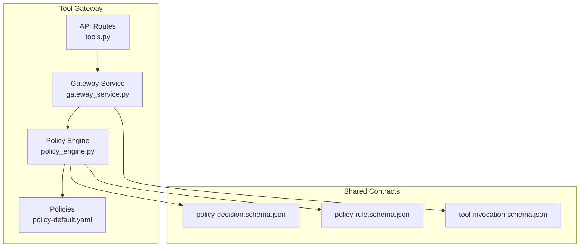
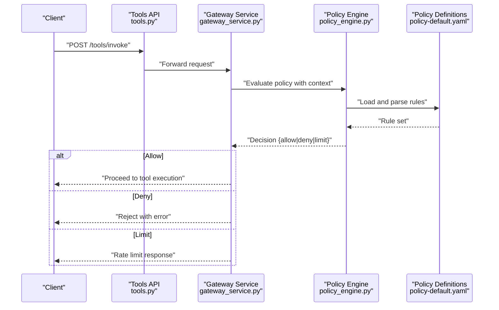
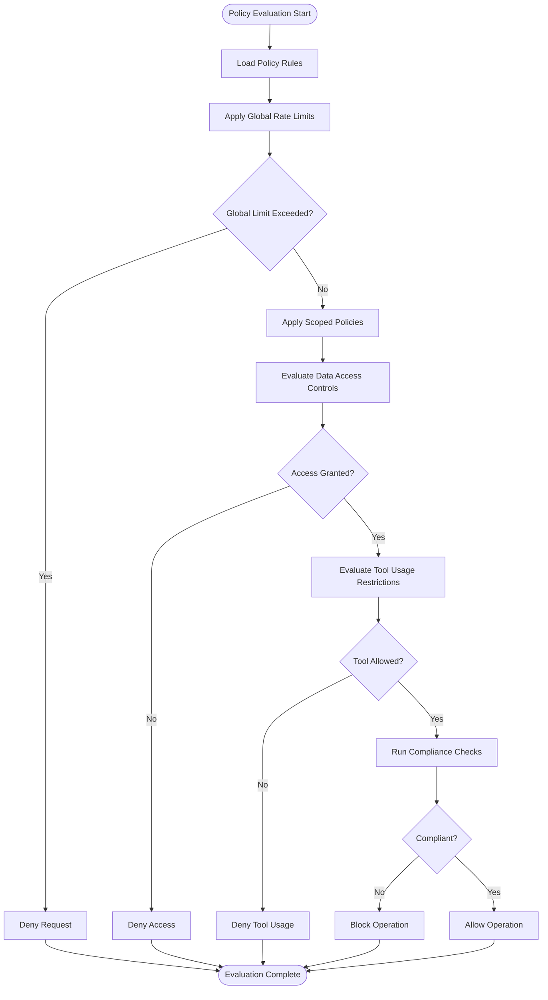
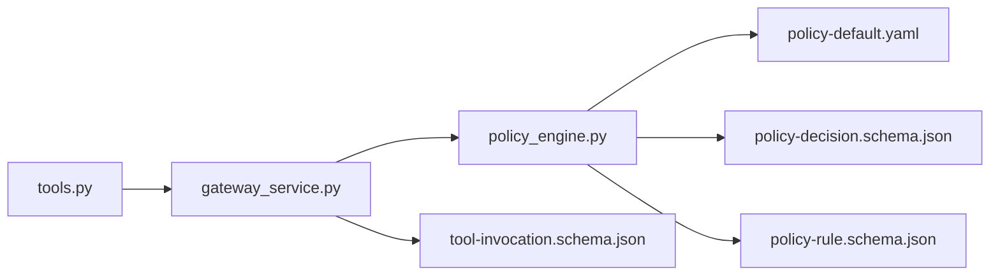

# Built-in Policies

<cite>
**Referenced Files in This Document**
- [policy-specification.md](file://docs/agentic-aiops-platform/policy-specification.md)
- [SPEC-004-policy-enforcement/spec.md](file://docs/specs/SPEC-004-policy-enforcement/spec.md)
- [policy-default.yaml](file://products/tool-gateway/src/api_gateway/policies/policy-default.yaml)
- [policy-engine.py](file://products/tool-gateway/src/api_gateway/services/policy_engine.py)
- [gateway_service.py](file://products/tool-gateway/src/api_gateway/services/gateway_service.py)
- [tools.py](file://products/tool-gateway/src/api_gateway/api/routes/tools.py)
- [policy-decision.schema.json](file://shared/shared-contracts/schemas/policy-decision.schema.json)
- [policy-rule.schema.json](file://shared/shared-contracts/schemas/policy-rule.schema.json)
- [tool-invocation.schema.json](file://shared/shared-contracts/schemas/tool-invocation.schema.json)
- [test_policy_enforcement.py](file://products/tool-gateway/tests/test_policy_enforcement.py)
- [test_policy_engine.py](file://products/tool-gateway/tests/test_policy_engine.py)
</cite>

## Table of Contents
1. [Introduction](#introduction)
2. [Project Structure](#project-structure)
3. [Core Components](#core-components)
4. [Architecture Overview](#architecture-overview)
5. [Detailed Component Analysis](#detailed-component-analysis)
6. [Dependency Analysis](#dependency-analysis)
7. [Performance Considerations](#performance-considerations)
8. [Troubleshooting Guide](#troubleshooting-guide)
9. [Conclusion](#conclusion)
10. [Appendices](#appendices)

## Introduction
This document describes the built-in policy types provided by the Luban AIOps platform, focusing on rate limiting policies, data access control policies, tool usage restrictions, and compliance checks. It explains configuration options, parameters, and use cases; provides complete YAML examples for different scenarios; documents precedence and combination rules; and includes troubleshooting guidance, performance considerations, and testing approaches for validation.

## Project Structure
The policy system is implemented primarily in the Tool Gateway service with supporting schemas and default configurations:
- Policy engine implementation and integration points
- Default policy definitions
- Shared schema contracts for decisions and rules
- Tests demonstrating enforcement behavior



**Diagram sources**
- [tools.py](file://products/tool-gateway/src/api_gateway/api/routes/tools.py)
- [gateway_service.py](file://products/tool-gateway/src/api_gateway/services/gateway_service.py)
- [policy-engine.py](file://products/tool-gateway/src/api_gateway/services/policy_engine.py)
- [policy-default.yaml](file://products/tool-gateway/src/api_gateway/policies/policy-default.yaml)
- [policy-decision.schema.json](file://shared/shared-contracts/schemas/policy-decision.schema.json)
- [policy-rule.schema.json](file://shared/shared-contracts/schemas/policy-rule.schema.json)
- [tool-invocation.schema.json](file://shared/shared-contracts/schemas/tool-invocation.schema.json)

**Section sources**
- [policy-specification.md](file://docs/agentic-aiops-platform/policy-specification.md)
- [SPEC-004-policy-enforcement/spec.md](file://docs/specs/SPEC-004-policy-enforcement/spec.md)
- [policy-default.yaml](file://products/tool-gateway/src/api_gateway/policies/policy-default.yaml)
- [policy-engine.py](file://products/tool-gateway/src/api_gateway/services/policy_engine.py)
- [gateway_service.py](file://products/tool-gateway/src/api_gateway/services/gateway_service.py)
- [tools.py](file://products/tool-gateway/src/api_gateway/api/routes/tools.py)
- [policy-decision.schema.json](file://shared/shared-contracts/schemas/policy-decision.schema.json)
- [policy-rule.schema.json](file://shared/shared-contracts/schemas/policy-rule.schema.json)
- [tool-invocation.schema.json](file://shared/shared-contracts/schemas/tool-invocation.schema.json)

## Core Components
- Policy Engine: Evaluates policy rules against incoming requests and tool invocations, returning structured decisions.
- Gateway Service: Orchestrates request handling, invokes the policy engine, and enforces decisions (allow/deny/limit).
- Policy Definitions: YAML-based policy files defining rule sets, scopes, and parameters.
- Schemas: JSON schemas defining the structure of policy decisions, rules, and tool invocation payloads.

Key responsibilities:
- Parse and validate policy definitions
- Evaluate rules based on context (identity, scope, resource, rate limits)
- Produce standardized decision outcomes
- Integrate with gateway flow to enforce decisions

**Section sources**
- [policy-engine.py](file://products/tool-gateway/src/api_gateway/services/policy_engine.py)
- [gateway_service.py](file://products/tool-gateway/src/api_gateway/services/gateway_service.py)
- [policy-default.yaml](file://products/tool-gateway/src/api_gateway/policies/policy-default.yaml)
- [policy-decision.schema.json](file://shared/shared-contracts/schemas/policy-decision.schema.json)
- [policy-rule.schema.json](file://shared/shared-contracts/schemas/policy-rule.schema.json)
- [tool-invocation.schema.json](file://shared/shared-contracts/schemas/tool-invocation.schema.json)

## Architecture Overview
The policy enforcement architecture integrates at the API boundary and tool invocation layer:



**Diagram sources**
- [tools.py](file://products/tool-gateway/src/api_gateway/api/routes/tools.py)
- [gateway_service.py](file://products/tool-gateway/src/api_gateway/services/gateway_service.py)
- [policy-engine.py](file://products/tool-gateway/src/api_gateway/services/policy_engine.py)
- [policy-default.yaml](file://products/tool-gateway/src/api_gateway/policies/policy-default.yaml)

## Detailed Component Analysis

### Rate Limiting Policies
Purpose: Control request throughput per identity, tenant, or resource to prevent abuse and ensure fair usage.

Configuration options:
- Scope: Per-user, per-tenant, per-tool, or global
- Window: Time window for counting requests (e.g., seconds, minutes)
- Limits: Maximum allowed requests within the window
- Actions: Allow, deny, throttle, or queue
- Headers: Custom headers for remaining quota and retry-after values

Use cases:
- Protect downstream tools from overload
- Enforce SLA tiers (basic vs premium)
- Prevent burst spikes during peak hours

YAML example (rate limiting):
```yaml
policies:
  - name: "global_rate_limit"
    type: "rate_limit"
    scope: "global"
    window_seconds: 60
    max_requests: 1000
    action: "deny"
    headers:
      include_remaining: true
      retry_after_seconds: 30
```

Precedence and combination:
- Global limits apply first, then scoped limits
- Stricter limits take precedence when overlapping
- Combined with other policies using AND logic unless explicitly configured otherwise

**Section sources**
- [policy-default.yaml](file://products/tool-gateway/src/api_gateway/policies/policy-default.yaml)
- [policy-engine.py](file://products/tool-gateway/src/api_gateway/services/policy_engine.py)

### Data Access Control Policies
Purpose: Restrict access to sensitive data based on identity, role, data classification, and context.

Configuration options:
- Identity filters: User roles, groups, or attributes
- Resource selectors: Data categories, namespaces, or tags
- Conditions: Time-based, location-based, or risk-score thresholds
- Actions: Allow, deny, mask, or audit-only

Use cases:
- Restrict PII access to authorized users only
- Limit data export capabilities based on clearance level
- Enable audit logging for sensitive operations

YAML example (data access control):
```yaml
policies:
  - name: "pii_access_control"
    type: "data_access"
    identity_roles: ["analyst", "admin"]
    resource_tags: ["pii", "confidential"]
    conditions:
      time_window: "business_hours"
      risk_score_max: 0.3
    action: "allow"
    audit: true
```

Precedence and combination:
- Most restrictive rule wins when multiple policies match
- Explicit deny overrides allow unless overridden by higher-priority admin policy
- Can be combined with rate limiting and compliance checks

**Section sources**
- [policy-default.yaml](file://products/tool-gateway/src/api_gateway/policies/policy-default.yaml)
- [policy-engine.py](file://products/tool-gateway/src/api_gateway/services/policy_engine.py)

### Tool Usage Restrictions
Purpose: Control which tools can be invoked, under what conditions, and with what constraints.

Configuration options:
- Tool selectors: By name, category, or version
- Invocation contexts: Allowed workflows, user roles, or environments
- Parameter validation: Schema-based input validation
- Quotas: Per-tool usage limits and cooldown periods

Use cases:
- Restrict dangerous tools to specific roles
- Validate tool inputs before execution
- Prevent excessive tool usage by individual users

YAML example (tool usage restrictions):
```yaml
policies:
  - name: "k8s_tool_restriction"
    type: "tool_usage"
    tool_selector:
      name: "kubernetes_connector"
      category: "infrastructure"
    allowed_roles: ["platform_admin", "devops"]
    parameter_validation:
      required_fields: ["namespace", "action"]
      forbidden_values: ["delete", "destroy"]
    quotas:
      max_invocations_per_hour: 50
      cooldown_seconds: 60
    action: "allow"
```

Precedence and combination:
- Tool-specific rules override general tool policies
- Parameter validation failures result in immediate denial
- Can be combined with data access controls for context-aware restrictions

**Section sources**
- [policy-default.yaml](file://products/tool-gateway/src/api_gateway/policies/policy-default.yaml)
- [policy-engine.py](file://products/tool-gateway/src/api_gateway/services/policy_engine.py)

### Compliance Checks
Purpose: Ensure operations comply with organizational policies, regulatory requirements, and security standards.

Configuration options:
- Compliance frameworks: SOC2, GDPR, HIPAA, custom rules
- Check types: Data residency, encryption status, retention policies
- Enforcement actions: Block, quarantine, or require approval
- Reporting: Audit trails and compliance dashboards

Use cases:
- Verify data stays within approved geographic regions
- Ensure encryption at rest and in transit
- Enforce data retention and deletion policies

YAML example (compliance checks):
```yaml
policies:
  - name: "gdpr_compliance_check"
    type: "compliance"
    framework: "GDPR"
    checks:
      - type: "data_residency"
        allowed_regions: ["eu-west-1", "eu-central-1"]
      - type: "encryption"
        require_at_rest: true
        require_in_transit: true
      - type: "retention"
        max_retention_days: 365
    action: "block"
    reporting:
      enable_audit_log: true
      notify_compliance_team: true
```

Precedence and combination:
- Compliance checks are typically mandatory and cannot be bypassed
- Failures result in operation blocking until remediated
- Can be combined with all other policy types for comprehensive governance

**Section sources**
- [policy-default.yaml](file://products/tool-gateway/src/api_gateway/policies/policy-default.yaml)
- [policy-engine.py](file://products/tool-gateway/src/api_gateway/services/policy_engine.py)

### Policy Precedence and Combination Rules
The policy engine evaluates rules in a defined order to ensure consistent enforcement:



**Diagram sources**
- [policy-engine.py](file://products/tool-gateway/src/api_gateway/services/policy_engine.py)
- [policy-default.yaml](file://products/tool-gateway/src/api_gateway/policies/policy-default.yaml)

Key rules:
- Global policies evaluate first, followed by scoped policies
- Most restrictive outcome takes precedence
- Compliance checks are mandatory and cannot be overridden
- Deny decisions short-circuit further evaluation

## Dependency Analysis
The policy system has clear dependencies between components:



**Diagram sources**
- [tools.py](file://products/tool-gateway/src/api_gateway/api/routes/tools.py)
- [gateway_service.py](file://products/tool-gateway/src/api_gateway/services/gateway_service.py)
- [policy-engine.py](file://products/tool-gateway/src/api_gateway/services/policy_engine.py)
- [policy-default.yaml](file://products/tool-gateway/src/api_gateway/policies/policy-default.yaml)
- [policy-decision.schema.json](file://shared/shared-contracts/schemas/policy-decision.schema.json)
- [policy-rule.schema.json](file://shared/shared-contracts/schemas/policy-rule.schema.json)
- [tool-invocation.schema.json](file://shared/shared-contracts/schemas/tool-invocation.schema.json)

**Section sources**
- [tools.py](file://products/tool-gateway/src/api_gateway/api/routes/tools.py)
- [gateway_service.py](file://products/tool-gateway/src/api_gateway/services/gateway_service.py)
- [policy-engine.py](file://products/tool-gateway/src/api_gateway/services/policy_engine.py)
- [policy-default.yaml](file://products/tool-gateway/src/api_gateway/policies/policy-default.yaml)
- [policy-decision.schema.json](file://shared/shared-contracts/schemas/policy-decision.schema.json)
- [policy-rule.schema.json](file://shared/shared-contracts/schemas/policy-rule.schema.json)
- [tool-invocation.schema.json](file://shared/shared-contracts/schemas/tool-invocation.schema.json)

## Performance Considerations
- Policy evaluation should be optimized for low latency
- Cache frequently accessed policy rules to reduce parsing overhead
- Implement efficient rate limiting algorithms (token bucket, sliding window)
- Use connection pooling for external policy services if applicable
- Monitor policy evaluation metrics for bottlenecks
- Consider asynchronous evaluation for non-blocking operations

[No sources needed since this section provides general guidance]

## Troubleshooting Guide
Common issues and solutions:

### Policy Configuration Errors
- Invalid YAML syntax in policy definitions
- Missing required fields in policy rules
- Incorrect data types for configuration parameters
- Circular references in policy dependencies

### Rate Limiting Issues
- Overly aggressive limits causing legitimate traffic rejection
- Inaccurate rate counter synchronization across instances
- Memory leaks in rate limit tracking structures
- Clock skew affecting time-based windows

### Data Access Control Problems
- Overly permissive default policies
- Incorrect role mapping or identity resolution
- Performance degradation with complex condition evaluation
- Inconsistent policy application across different endpoints

### Tool Usage Restrictions
- Misconfigured tool selectors preventing valid invocations
- Parameter validation too strict or too lenient
- Quota limits not properly enforced
- Conflicting tool usage policies

### Compliance Check Failures
- Outdated compliance rule definitions
- Incorrect data classification or tagging
- Network connectivity issues with compliance services
- Audit log generation failures

**Section sources**
- [test_policy_enforcement.py](file://products/tool-gateway/tests/test_policy_enforcement.py)
- [test_policy_engine.py](file://products/tool-gateway/tests/test_policy_engine.py)

## Conclusion
The Luban AIOps platform provides a comprehensive policy enforcement system that supports rate limiting, data access control, tool usage restrictions, and compliance checks. The modular architecture allows for flexible policy configuration while maintaining strong security and governance guarantees. Proper configuration, testing, and monitoring are essential for effective policy management.

[No sources needed since this section summarizes without analyzing specific files]

## Appendices

### Testing Approaches and Validation Techniques
- Unit tests for individual policy evaluators
- Integration tests for complete policy evaluation flows
- Load testing for rate limiting accuracy
- Chaos testing for policy failure scenarios
- Automated validation of policy YAML syntax and semantics

### Best Practices
- Start with conservative policies and gradually relax restrictions
- Implement comprehensive logging and audit trails
- Regular policy review and cleanup procedures
- Version control for all policy changes
- Staged rollout of policy updates

### Monitoring and Observability
- Policy evaluation latency metrics
- Rate limiting statistics and utilization
- Policy decision distribution analysis
- Error rates and failure patterns
- Compliance violation tracking

[No sources needed since this section provides general guidance]