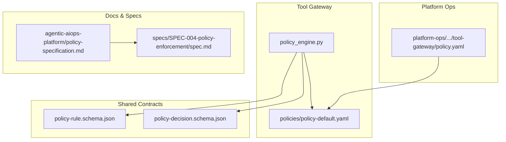
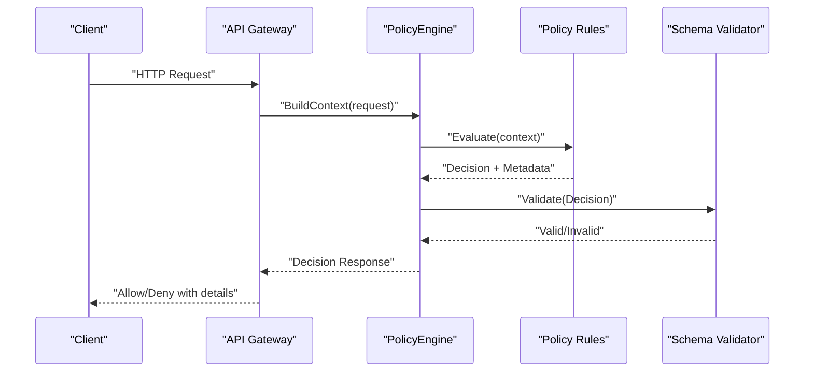
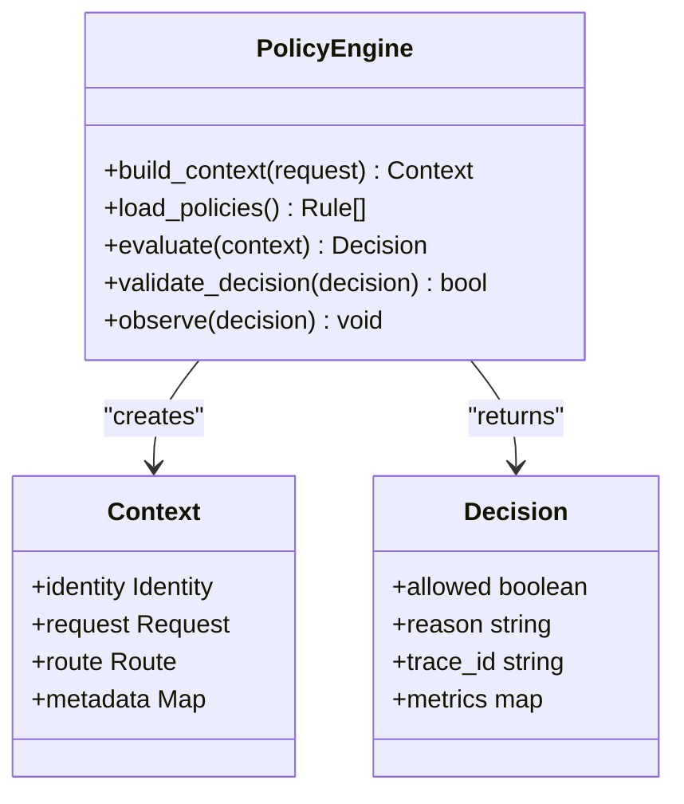
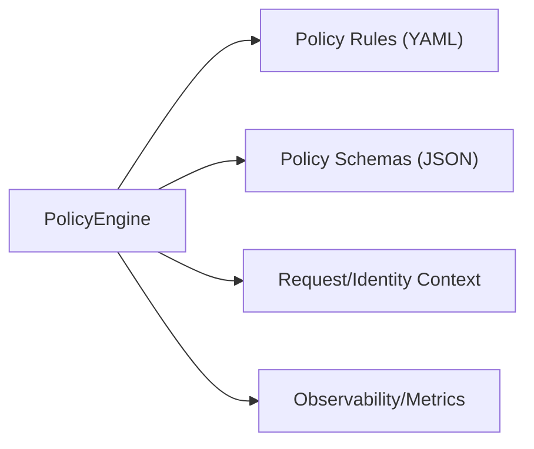

# Custom Policy Development

<cite>
**Referenced Files in This Document**
- [policy-specification.md](file://docs/agentic-aiops-platform/policy-specification.md)
- [SPEC-004-policy-enforcement/spec.md](file://docs/specs/SPEC-004-policy-enforcement/spec.md)
- [policy-default.yaml](file://products/tool-gateway/src/api_gateway/policies/policy-default.yaml)
- [policy.yaml](file://shared/platform-ops/gitops/dev-k8s/base/tool-gateway/policy.yaml)
- [policy_engine.py](file://products/tool-gateway/src/api_gateway/services/policy_engine.py)
- [test_policy_engine.py](file://products/tool-gateway/tests/test_policy_engine.py)
- [test_policy_enforcement.py](file://products/tool-gateway/tests/test_policy_enforcement.py)
- [policy-decision.schema.json](file://shared/shared-contracts/schemas/policy-decision.schema.json)
- [policy-rule.schema.json](file://shared/shared-contracts/schemas/policy-rule.schema.json)
</cite>

## Table of Contents
1. [Introduction](#introduction)
2. [Project Structure](#project-structure)
3. [Core Components](#core-components)
4. [Architecture Overview](#architecture-overview)
5. [Detailed Component Analysis](#detailed-component-analysis)
6. [Dependency Analysis](#dependency-analysis)
7. [Performance Considerations](#performance-considerations)
8. [Troubleshooting Guide](#troubleshooting-guide)
9. [Conclusion](#conclusion)
10. [Appendices](#appendices)

## Introduction
This document provides a comprehensive guide to creating custom policies in the Luban AIOps platform. It covers the policy development lifecycle from design and implementation through testing, packaging, distribution, and deployment. It also documents the policy API interfaces, context objects, helper functions, testing frameworks, mock strategies, validation techniques, security considerations, performance optimization, debugging practices, and maintenance guidelines.

## Project Structure
Policy-related artifacts are primarily located under:
- Product code for policy enforcement in the tool gateway service
- Shared contracts defining schemas for policy decisions and rules
- Platform operations configurations for deploying policies into Kubernetes
- Documentation and specifications describing policy behavior and constraints

**Diagram sources**
- [policy_engine.py](file://products/tool-gateway/src/api_gateway/services/policy_engine.py)
- [policy-default.yaml](file://products/tool-gateway/src/api_gateway/policies/policy-default.yaml)
- [policy-decision.schema.json](file://shared/shared-contracts/schemas/policy-decision.schema.json)
- [policy-rule.schema.json](file://shared/shared-contracts/schemas/policy-rule.schema.json)
- [policy.yaml](file://shared/platform-ops/gitops/dev-k8s/base/tool-gateway/policy.yaml)
- [policy-specification.md](file://docs/agentic-aiops-platform/policy-specification.md)
- [SPEC-004-policy-enforcement/spec.md](file://docs/specs/SPEC-004-policy-enforcement/spec.md)

**Section sources**
- [policy-engine.py](file://products/tool-gateway/src/api_gateway/services/policy_engine.py)
- [policy-default.yaml](file://products/tool-gateway/src/api_gateway/policies/policy-default.yaml)
- [policy-decision.schema.json](file://shared/shared-contracts/schemas/policy-decision.schema.json)
- [policy-rule.schema.json](file://shared/shared-contracts/schemas/policy-rule.schema.json)
- [policy.yaml](file://shared/platform-ops/gitops/dev-k8s/base/tool-gateway/policy.yaml)
- [policy-specification.md](file://docs/agentic-aiops-platform/policy-specification.md)
- [SPEC-004-policy-enforcement/spec.md](file://docs/specs/SPEC-004-policy-enforcement/spec.md)

## Core Components
- Policy Engine: The runtime component that evaluates policies against incoming requests and returns decisions.
- Policy Definitions: Declarative policy files (YAML) that define rules and conditions.
- Policy Schemas: JSON schemas that enforce structure and types for policy decisions and rules.
- Platform Policies: Kubernetes manifests used to deploy and configure policies within the cluster.
- Specifications: Authoritative documentation describing policy semantics, decision outcomes, and integration points.

Key responsibilities:
- Parse and validate policy definitions
- Build evaluation context from request metadata and identity
- Execute rule evaluation with deterministic outcomes
- Produce standardized decision responses conforming to shared schemas
- Expose observability and metrics for auditability

**Section sources**
- [policy_engine.py](file://products/tool-gateway/src/api_gateway/services/policy_engine.py)
- [policy-default.yaml](file://products/tool-gateway/src/api_gateway/policies/policy-default.yaml)
- [policy-decision.schema.json](file://shared/shared-contracts/schemas/policy-decision.schema.json)
- [policy-rule.schema.json](file://shared/shared-contracts/schemas/policy-rule.schema.json)
- [policy-specification.md](file://docs/agentic-aiops-platform/policy-specification.md)
- [SPEC-004-policy-enforcement/spec.md](file://docs/specs/SPEC-004-policy-enforcement/spec.md)

## Architecture Overview
The policy enforcement architecture integrates declarative policies with a runtime engine that evaluates them per request. Decisions are validated against shared schemas and returned as structured responses.

**Diagram sources**
- [policy_engine.py](file://products/tool-gateway/src/api_gateway/services/policy_engine.py)
- [policy-default.yaml](file://products/tool-gateway/src/api_gateway/policies/policy-default.yaml)
- [policy-decision.schema.json](file://shared/shared-contracts/schemas/policy-decision.schema.json)

**Section sources**
- [policy_engine.py](file://products/tool-gateway/src/api_gateway/services/policy_engine.py)
- [policy-default.yaml](file://products/tool-gateway/src/api_gateway/policies/policy-default.yaml)
- [policy-decision.schema.json](file://shared/shared-contracts/schemas/policy-decision.schema.json)

## Detailed Component Analysis

### Policy Engine
The policy engine is responsible for constructing evaluation contexts, loading and parsing policy rules, executing evaluations, and producing standardized decisions.

Key behaviors:
- Context construction from request headers, identity tokens, and route metadata
- Rule loading from YAML policy files or configuration stores
- Deterministic evaluation with short-circuit logic where applicable
- Decision output conforming to shared schema
- Observability hooks for tracing and metrics

**Diagram sources**
- [policy_engine.py](file://products/tool-gateway/src/api_gateway/services/policy_engine.py)

**Section sources**
- [policy_engine.py](file://products/tool-gateway/src/api_gateway/services/policy_engine.py)

### Policy Definitions (YAML)
Declarative policy files define rules, conditions, and actions. They are loaded by the engine and evaluated at runtime.

Best practices:
- Keep rules idempotent and deterministic
- Use clear condition expressions and explicit deny-by-default patterns
- Version policies alongside application changes
- Separate environment-specific overrides via overlays

**Section sources**
- [policy-default.yaml](file://products/tool-gateway/src/api_gateway/policies/policy-default.yaml)

### Policy Schemas
Shared JSON schemas ensure consistent structure for policy decisions and rules across services.

- Decision schema defines allowed/denied outcomes, reasons, trace identifiers, and optional metrics.
- Rule schema defines rule structure, conditions, and actions.

Validation ensures robustness and interoperability between components.

**Section sources**
- [policy-decision.schema.json](file://shared/shared-contracts/schemas/policy-decision.schema.json)
- [policy-rule.schema.json](file://shared/shared-contracts/schemas/policy-rule.schema.json)

### Platform Policies (Kubernetes)
Kubernetes manifests configure policy deployment and runtime settings within the cluster. These are managed via GitOps overlays and profiles.

Considerations:
- Use overlays for environment-specific policy variants
- Manage secrets securely and rotate regularly
- Align policy versions with service deployments

**Section sources**
- [policy.yaml](file://shared/platform-ops/gitops/dev-k8s/base/tool-gateway/policy.yaml)

### Specifications and Design
Authoritative specs describe policy semantics, decision outcomes, and integration points.

- Policy specification outlines high-level behavior and constraints.
- Enforcement spec details API contracts, error handling, and observability requirements.

**Section sources**
- [policy-specification.md](file://docs/agentic-aiops-platform/policy-specification.md)
- [SPEC-004-policy-enforcement/spec.md](file://docs/specs/SPEC-004-policy-enforcement/spec.md)

## Dependency Analysis
Policy engine depends on:
- Policy rule definitions (YAML)
- Shared schemas for validation
- Identity and request context providers
- Observability and metrics backends

**Diagram sources**
- [policy_engine.py](file://products/tool-gateway/src/api_gateway/services/policy_engine.py)
- [policy-default.yaml](file://products/tool-gateway/src/api_gateway/policies/policy-default.yaml)
- [policy-decision.schema.json](file://shared/shared-contracts/schemas/policy-decision.schema.json)
- [policy-rule.schema.json](file://shared/shared-contracts/schemas/policy-rule.schema.json)

**Section sources**
- [policy_engine.py](file://products/tool-gateway/src/api_gateway/services/policy_engine.py)
- [policy-default.yaml](file://products/tool-gateway/src/api_gateway/policies/policy-default.yaml)
- [policy-decision.schema.json](file://shared/shared-contracts/schemas/policy-decision.schema.json)
- [policy-rule.schema.json](file://shared/shared-contracts/schemas/policy-rule.schema.json)

## Performance Considerations
- Minimize policy evaluation overhead by caching immutable rule sets when safe
- Prefer early exits in rule evaluation to reduce computation
- Avoid heavy I/O during evaluation; offload external calls to async tasks
- Instrument key paths with metrics and traces to identify bottlenecks
- Validate inputs once and reuse parsed contexts across evaluations

[No sources needed since this section provides general guidance]

## Troubleshooting Guide
Common issues and resolutions:
- Invalid policy syntax: Validate YAML against schema and lint rules
- Unexpected denials: Inspect decision reason and trace ID; review context fields
- Performance regressions: Enable detailed tracing and profile evaluation paths
- Deployment mismatches: Ensure policy version aligns with engine capabilities

Testing strategies:
- Unit tests for policy engine methods and helpers
- Integration tests validating end-to-end decision flows
- Mock identity and request contexts to isolate evaluation logic
- Contract tests ensuring decisions conform to shared schemas

**Section sources**
- [test_policy_engine.py](file://products/tool-gateway/tests/test_policy_engine.py)
- [test_policy_enforcement.py](file://products/tool-gateway/tests/test_policy_enforcement.py)

## Conclusion
Custom policy development in Luban AIOps centers around a clear separation of concerns: declarative rules, a deterministic engine, and strict schema validation. By following the lifecycle outlined here—design, implement, test, package, deploy, and maintain—you can build robust, secure, and performant policies tailored to your business requirements.

[No sources needed since this section summarizes without analyzing specific files]

## Appendices

### Policy Development Lifecycle
- Design: Define objectives, constraints, and decision outcomes using specifications
- Implement: Write policy rules and integrate with the engine
- Test: Validate unit, integration, and contract tests; use mocks for isolation
- Package: Version policies and bundle with platform manifests
- Deploy: Apply via GitOps overlays and verify runtime behavior
- Maintain: Monitor, update, and deprecate policies with change management

[No sources needed since this section provides general guidance]

### Policy API Interfaces and Context Objects
- Context object includes identity, request metadata, route information, and auxiliary data
- Decision object includes allow/deny status, reason, trace ID, and optional metrics
- Engine methods provide context building, rule loading, evaluation, and validation

**Section sources**
- [policy_engine.py](file://products/tool-gateway/src/api_gateway/services/policy_engine.py)
- [policy-decision.schema.json](file://shared/shared-contracts/schemas/policy-decision.schema.json)
- [policy-rule.schema.json](file://shared/shared-contracts/schemas/policy-rule.schema.json)

### Step-by-Step Examples
- Example 1: Rate limiting by identity and route
  - Define rate limit rules in YAML
  - Extend context to include counters if needed
  - Add tests asserting denial after threshold
- Example 2: Feature flag gating based on tenant attributes
  - Create rules evaluating tenant metadata
  - Validate decision outputs and reasons
  - Deploy via overlay with tenant-specific values

[No sources needed since this section provides general guidance]

### Testing Frameworks and Mock Strategies
- Use unit tests to assert engine behavior with controlled contexts
- Mock identity providers and external dependencies
- Employ contract tests to validate schema conformance
- Simulate edge cases like missing fields or malformed requests

**Section sources**
- [test_policy_engine.py](file://products/tool-gateway/tests/test_policy_engine.py)
- [test_policy_enforcement.py](file://products/tool-gateway/tests/test_policy_enforcement.py)

### Packaging, Distribution, and Version Management
- Version policies alongside service releases
- Store policy artifacts in versioned repositories
- Use GitOps overlays to manage environment-specific variants
- Track policy changes in release notes and audits

**Section sources**
- [policy.yaml](file://shared/platform-ops/gitops/dev-k8s/base/tool-gateway/policy.yaml)

### Security Considerations
- Enforce deny-by-default policies
- Validate all inputs and sanitize context data
- Rotate secrets and restrict access to policy stores
- Audit decisions and retain logs per compliance requirements

[No sources needed since this section provides general guidance]

### Debugging Techniques
- Enable tracing with unique IDs per request
- Log decision reasons and context summaries (sanitized)
- Use feature flags to toggle verbose logging in non-production
- Correlate metrics with decision outcomes to detect anomalies

[No sources needed since this section provides general guidance]

### Documentation and Maintenance Guidelines
- Document policy intent, scope, and exceptions
- Maintain runbooks for common failures and remediation steps
- Review policies periodically for relevance and performance
- Deprecate obsolete rules with migration plans

[No sources needed since this section provides general guidance]