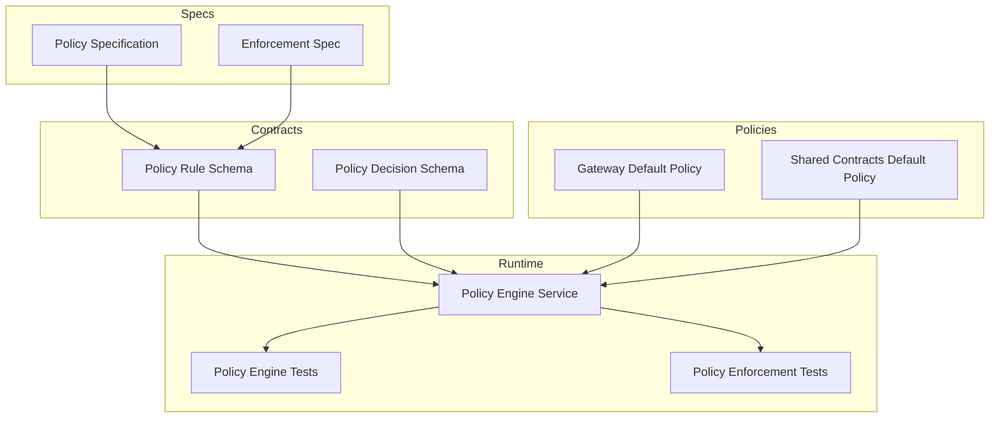
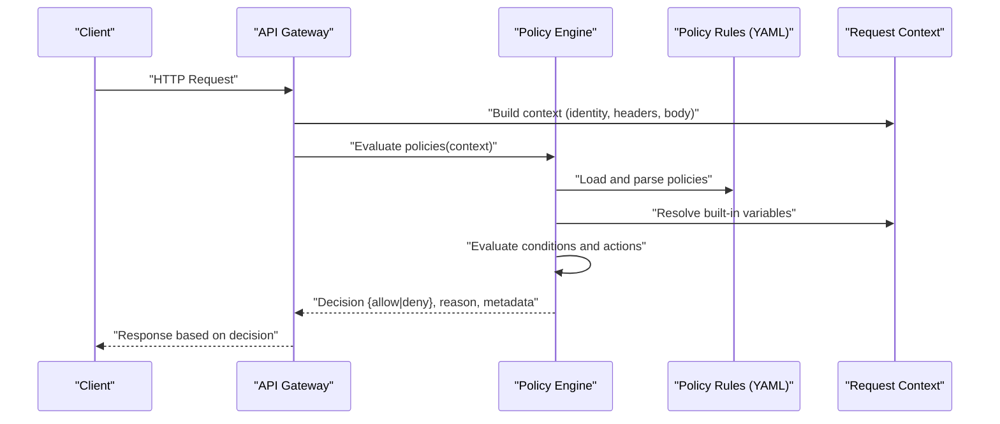
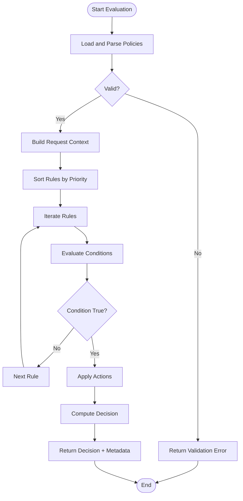
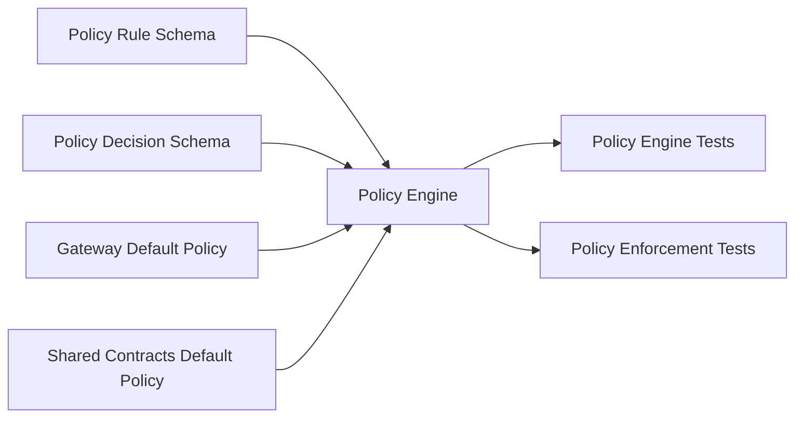

# Policy Definition Language

<cite>
**Referenced Files in This Document**
- [policy-specification.md](file://docs/agentic-aiops-platform/policy-specification.md)
- [SPEC-004-policy-enforcement/spec.md](file://docs/specs/SPEC-004-policy-enforcement/spec.md)
- [policy-default.yaml](file://products/tool-gateway/src/api_gateway/policies/policy-default.yaml)
- [policy-default.yaml](file://shared/shared-contracts/policies/policy-default.yaml)
- [policy-engine.py](file://products/tool-gateway/src/api_gateway/services/policy-engine.py)
- [test_policy_engine.py](file://products/tool-gateway/tests/test_policy_engine.py)
- [test_policy_enforcement.py](file://products/tool-gateway/tests/test_policy_enforcement.py)
- [policy-rule.schema.json](file://shared/shared-contracts/schemas/policy-rule.schema.json)
- [policy-decision.schema.json](file://shared/shared-contracts/schemas/policy-decision.schema.json)
</cite>

## Table of Contents
1. [Introduction](#introduction)
2. [Project Structure](#project-structure)
3. [Core Components](#core-components)
4. [Architecture Overview](#architecture-overview)
5. [Detailed Component Analysis](#detailed-component-analysis)
6. [Dependency Analysis](#dependency-analysis)
7. [Performance Considerations](#performance-considerations)
8. [Troubleshooting Guide](#troubleshooting-guide)
9. [Conclusion](#conclusion)
10. [Appendices](#appendices)

## Introduction
This document describes the policy definition language used by the Luban AIOps platform to enforce access control, rate limiting, data validation, and resource constraints at runtime. Policies are authored as YAML documents that define rules with conditions and actions. The engine evaluates these policies against request context and returns a decision (allow/deny) along with metadata for observability.

The language supports:
- Rule structure with identifiers, scopes, and priorities
- Condition expressions using boolean operators, comparisons, pattern matching, and data extraction from request context
- Actions such as allow, deny, log, throttle, and transform
- Built-in variables representing identity, request attributes, and environment context
- Composition and inheritance patterns via modularization and references

## Project Structure
Policy-related artifacts are distributed across specification documents, schema definitions, default policy files, and the runtime engine implementation:

- Specification and design:
  - Platform-level policy specification
  - Enforcement spec detailing evaluation semantics and lifecycle
- Schema contracts:
  - Policy rule schema defining valid structures
  - Policy decision schema describing outcomes
- Default policies:
  - Example policy YAML for gateway and shared contracts
- Runtime engine:
  - Policy engine service implementing evaluation logic
  - Tests validating behavior and edge cases

**Diagram sources**
- [policy-specification.md](file://docs/agentic-aiops-platform/policy-specification.md)
- [SPEC-004-policy-enforcement/spec.md](file://docs/specs/SPEC-004-policy-enforcement/spec.md)
- [policy-rule.schema.json](file://shared/shared-contracts/schemas/policy-rule.schema.json)
- [policy-decision.schema.json](file://shared/shared-contracts/schemas/policy-decision.schema.json)
- [policy-default.yaml](file://products/tool-gateway/src/api_gateway/policies/policy-default.yaml)
- [policy-default.yaml](file://shared/shared-contracts/policies/policy-default.yaml)
- [policy-engine.py](file://products/tool-gateway/src/api_gateway/services/policy-engine.py)
- [test_policy_engine.py](file://products/tool-gateway/tests/test_policy_engine.py)
- [test_policy_enforcement.py](file://products/tool-gateway/tests/test_policy_enforcement.py)

**Section sources**
- [policy-specification.md](file://docs/agentic-aiops-platform/policy-specification.md)
- [SPEC-004-policy-enforcement/spec.md](file://docs/specs/SPEC-004-policy-enforcement/spec.md)
- [policy-rule.schema.json](file://shared/shared-contracts/schemas/policy-rule.schema.json)
- [policy-decision.schema.json](file://shared/shared-contracts/schemas/policy-decision.schema.json)
- [policy-default.yaml](file://products/tool-gateway/src/api_gateway/policies/policy-default.yaml)
- [policy-default.yaml](file://shared/shared-contracts/policies/policy-default.yaml)
- [policy-engine.py](file://products/tool-gateway/src/api_gateway/services/policy-engine.py)
- [test_policy_engine.py](file://products/tool-gateway/tests/test_policy_engine.py)
- [test_policy_enforcement.py](file://products/tool-gateway/tests/test_policy_enforcement.py)

## Core Components
- Policy Rule Schema: Defines the canonical structure for policy rules including identifiers, versioning, scope, priority, conditions, and actions.
- Policy Decision Schema: Describes the outcome of policy evaluation, including decision, reason, and metadata.
- Default Policies: YAML examples demonstrating common patterns like rate limiting, access control, and validation.
- Policy Engine: Evaluates policies against request context, resolves variables, executes condition expressions, and produces decisions.

Key responsibilities:
- Parsing and validating policy YAML against schemas
- Resolving built-in variables and extracting values from request context
- Evaluating boolean expressions and pattern matching
- Applying actions and aggregating results
- Returning structured decisions with traceable reasons

**Section sources**
- [policy-rule.schema.json](file://shared/shared-contracts/schemas/policy-rule.schema.json)
- [policy-decision.schema.json](file://shared/shared-contracts/schemas/policy-decision.schema.json)
- [policy-default.yaml](file://products/tool-gateway/src/api_gateway/policies/policy-default.yaml)
- [policy-default.yaml](file://shared/shared-contracts/policies/policy-default.yaml)
- [policy-engine.py](file://products/tool-gateway/src/api_gateway/services/policy-engine.py)

## Architecture Overview
The policy enforcement flow integrates into the API gateway’s request lifecycle. Requests carry identity and contextual attributes; the policy engine evaluates configured policies and returns a decision that gates further processing.

**Diagram sources**
- [policy-engine.py](file://products/tool-gateway/src/api_gateway/services/policy-engine.py)
- [policy-default.yaml](file://products/tool-gateway/src/api_gateway/policies/policy-default.yaml)
- [policy-rule.schema.json](file://shared/shared-contracts/schemas/policy-rule.schema.json)
- [policy-decision.schema.json](file://shared/shared-contracts/schemas/policy-decision.schema.json)

## Detailed Component Analysis

### Policy Rule Schema
The policy rule schema defines the structure for each rule, including:
- Identifier and version fields for tracking and evolution
- Scope specifying applicable targets (e.g., endpoints, methods, tenants)
- Priority determining evaluation order among multiple rules
- Conditions expressing boolean logic over context variables
- Actions specifying outcomes (allow, deny, log, throttle, transform)

Complexity considerations:
- Rule parsing is O(n) over rule count per evaluation
- Condition evaluation uses short-circuit boolean operations
- Pattern matching leverages compiled regex where supported

Best practices:
- Use stable identifiers and semantic versioning
- Keep scopes narrow to minimize evaluation overhead
- Prefer explicit priorities to avoid ambiguity

**Section sources**
- [policy-rule.schema.json](file://shared/shared-contracts/schemas/policy-rule.schema.json)

### Policy Decision Schema
The decision schema captures:
- Decision value (allow/deny)
- Reason string explaining the outcome
- Metadata including matched rule IDs, timestamps, and counters

Usage:
- Downstream components use the decision to proceed or reject requests
- Observability systems consume metadata for metrics and tracing

**Section sources**
- [policy-decision.schema.json](file://shared/shared-contracts/schemas/policy-decision.schema.json)

### Default Policies
Default policy YAML files demonstrate practical patterns:
- Rate limiting rules based on client identity and endpoint frequency
- Access control rules enforcing role-based permissions
- Data validation rules ensuring payload shape and constraints
- Resource constraint rules bounding compute or storage usage

Modularization techniques:
- Splitting policies by domain (auth, rate-limit, validate)
- Referencing shared fragments via includes or anchors
- Versioned policy bundles for environments

**Section sources**
- [policy-default.yaml](file://products/tool-gateway/src/api_gateway/policies/policy-default.yaml)
- [policy-default.yaml](file://shared/shared-contracts/policies/policy-default.yaml)

### Policy Engine
The policy engine implements evaluation semantics:
- Loads and validates policies against schemas
- Builds a context object with built-in variables (identity, request attributes, environment)
- Iterates rules by priority and evaluates conditions
- Applies actions and aggregates results
- Produces a structured decision with reasons and metadata

Evaluation algorithm overview:

**Diagram sources**
- [policy-engine.py](file://products/tool-gateway/src/api_gateway/services/policy-engine.py)

**Section sources**
- [policy-engine.py](file://products/tool-gateway/src/api_gateway/services/policy-engine.py)

### Testing and Validation
Tests cover:
- Policy engine evaluation paths (allow/deny scenarios)
- Edge cases (missing context fields, malformed policies)
- Integration points with gateway request lifecycle

Recommendations:
- Maintain test coverage for new operators and functions
- Add negative tests for invalid inputs and unexpected contexts
- Simulate high-throughput scenarios to validate performance

**Section sources**
- [test_policy_engine.py](file://products/tool-gateway/tests/test_policy_engine.py)
- [test_policy_enforcement.py](file://products/tool-gateway/tests/test_policy_enforcement.py)

## Dependency Analysis
Policy components depend on schemas for validation and on YAML files for configuration. The engine orchestrates evaluation and interacts with request context.

**Diagram sources**
- [policy-rule.schema.json](file://shared/shared-contracts/schemas/policy-rule.schema.json)
- [policy-decision.schema.json](file://shared/shared-contracts/schemas/policy-decision.schema.json)
- [policy-default.yaml](file://products/tool-gateway/src/api_gateway/policies/policy-default.yaml)
- [policy-default.yaml](file://shared/shared-contracts/policies/policy-default.yaml)
- [policy-engine.py](file://products/tool-gateway/src/api_gateway/services/policy-engine.py)
- [test_policy_engine.py](file://products/tool-gateway/tests/test_policy_engine.py)
- [test_policy_enforcement.py](file://products/tool-gateway/tests/test_policy_enforcement.py)

**Section sources**
- [policy-rule.schema.json](file://shared/shared-contracts/schemas/policy-rule.schema.json)
- [policy-decision.schema.json](file://shared/shared-contracts/schemas/policy-decision.schema.json)
- [policy-default.yaml](file://products/tool-gateway/src/api_gateway/policies/policy-default.yaml)
- [policy-default.yaml](file://shared/shared-contracts/policies/policy-default.yaml)
- [policy-engine.py](file://products/tool-gateway/src/api_gateway/services/policy-engine.py)
- [test_policy_engine.py](file://products/tool-gateway/tests/test_policy_engine.py)
- [test_policy_enforcement.py](file://products/tool-gateway/tests/test_policy_enforcement.py)

## Performance Considerations
- Minimize rule count and complexity to reduce evaluation time
- Use precise scopes to limit context resolution overhead
- Cache compiled patterns for repeated pattern matching
- Avoid heavy computations inside conditions; precompute when possible
- Monitor decision latency and adjust priorities accordingly

[No sources needed since this section provides general guidance]

## Troubleshooting Guide
Common issues and resolutions:
- Invalid policy YAML: Validate against schema and fix structural errors
- Missing context variables: Ensure request context includes required fields
- Unexpected denials: Inspect decision reason and matched rule IDs
- Performance regressions: Profile evaluation paths and optimize rules

Diagnostic steps:
- Enable detailed logging for policy evaluations
- Export decision metadata for analysis
- Reproduce failures with minimal policy sets

**Section sources**
- [policy-engine.py](file://products/tool-gateway/src/api_gateway/services/policy-engine.py)
- [test_policy_engine.py](file://products/tool-gateway/tests/test_policy_engine.py)
- [test_policy_enforcement.py](file://products/tool-gateway/tests/test_policy_enforcement.py)

## Conclusion
The policy definition language enables flexible, maintainable governance of requests through declarative YAML policies. By adhering to schema-defined structures, leveraging built-in variables and operators, and following best practices for composition and versioning, teams can implement robust access control, rate limiting, validation, and resource constraints. The policy engine ensures consistent evaluation and actionable decisions with rich metadata for observability and debugging.

[No sources needed since this section summarizes without analyzing specific files]

## Appendices

### YAML Syntax Reference
- Rule fields: identifier, version, scope, priority, conditions, actions
- Condition expressions: boolean operators (and, or, not), comparisons (equals, greater-than, less-than), pattern matching (regex), data extraction (context keys)
- Actions: allow, deny, log, throttle, transform
- Built-in variables: identity attributes, request headers, method, path, tenant, timestamp

### Common Policy Patterns
- Rate limiting: Limit requests per client per minute
- Access control: Enforce role-based permissions on endpoints
- Data validation: Validate payload shape and constraints
- Resource constraints: Bound compute or storage usage per tenant

### Inheritance and Composition
- Modularize policies by domain and reference shared fragments
- Use versioned bundles for environment-specific overrides
- Compose complex rules from simpler primitives

### Versioning and Naming Conventions
- Semantic versioning for policy bundles
- Stable identifiers for rules and scopes
- Prefix naming for domains (e.g., auth.*, rate.*)

[No sources needed since this section provides general guidance]